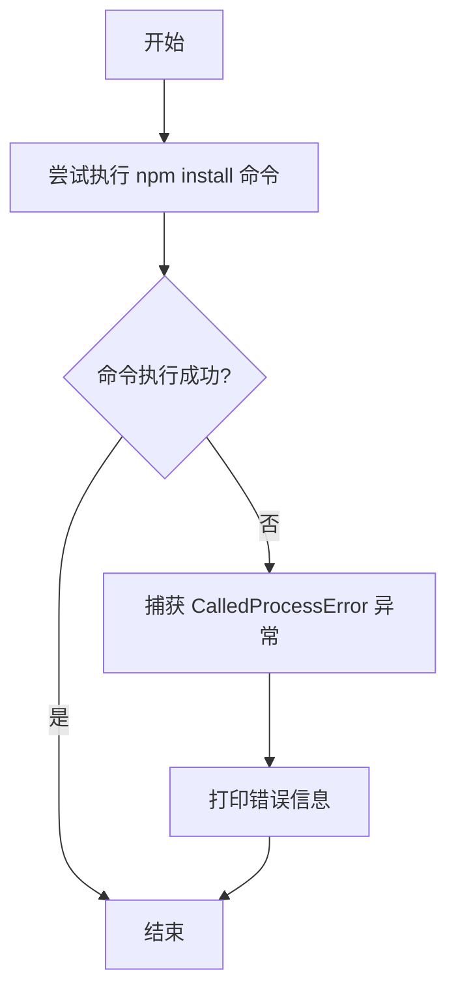
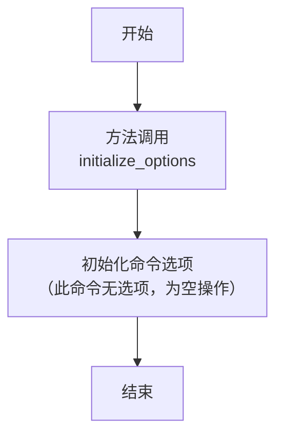
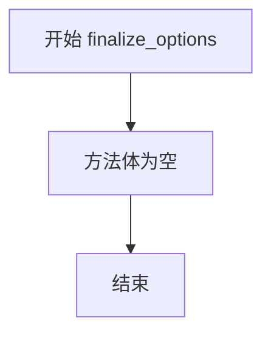

# `.\MetaGPT\setup.py` 详细设计文档

这是一个用于MetaGPT项目的Python包安装脚本(setup.py)。它定义了包的元数据、依赖项、扩展功能以及一个自定义的安装命令类，用于在安装过程中通过npm全局安装mermaid-cli工具。

## 整体流程

```mermaid
graph TD
    A[执行 `python setup.py` 或 `pip install .`] --> B{是否包含自定义命令?}
    B -- 是 (如 `install_mermaid`) --> C[执行 InstallMermaidCLI.run()]
    C --> D[调用 `npm install -g @mermaid-js/mermaid-cli`]
    D --> E{安装成功?}
    E -- 是 --> F[命令执行完毕]
    E -- 否 --> G[打印错误信息]
    B -- 否 (标准安装) --> H[调用 setuptools.setup()]
    H --> I[根据参数配置安装包、依赖、入口点等]
    I --> J[安装完成]
```

## 类结构

```
InstallMermaidCLI (自定义 setuptools 命令)
└── 继承自 setuptools.Command
```

## 全局变量及字段


### `here`
    
表示当前 setup.py 脚本所在目录的绝对路径对象。

类型：`pathlib.Path`
    


### `long_description`
    
从项目根目录的 README.md 文件读取的字符串内容，用作 PyPI 项目页面的长描述。

类型：`str`
    


### `requirements`
    
从项目根目录的 requirements.txt 文件读取并分割成列表的字符串，包含项目运行的核心依赖包。

类型：`List[str]`
    


### `extras_require`
    
一个字典，定义了项目的可选依赖组，键为功能组名称，值为该功能组所需的额外依赖包列表。

类型：`Dict[str, List[str]]`
    


### `InstallMermaidCLI.description`
    
用于描述 InstallMermaidCLI 自定义命令用途的字符串。

类型：`str`
    


### `InstallMermaidCLI.user_options`
    
一个列表，用于定义 setuptools 自定义命令的可接受命令行选项，此处为空列表表示该命令不接受额外选项。

类型：`List[Tuple[str, str, str]]`
    
    

## 全局函数及方法

### `InstallMermaidCLI.run`

该方法是一个自定义的 setuptools 命令，用于通过子进程执行 `npm install -g @mermaid-js/mermaid-cli` 命令，以全局安装 Mermaid CLI 工具。

参数：
- `self`：`InstallMermaidCLI`，当前命令实例的引用。

返回值：`None`，此方法不返回任何值。

#### 流程图



#### 带注释源码

```python
def run(self):
    """
    执行自定义命令的核心方法。
    尝试通过 subprocess.check_call 调用 npm 命令来全局安装 mermaid-cli。
    如果命令执行失败（返回非零退出码），则捕获 CalledProcessError 异常并打印错误输出。
    """
    try:
        # 使用 subprocess.check_call 执行 npm install -g @mermaid-js/mermaid-cli 命令
        # check_call 会等待命令完成，如果返回码非零则抛出 CalledProcessError 异常
        subprocess.check_call(["npm", "install", "-g", "@mermaid-js/mermaid-cli"])
    except subprocess.CalledProcessError as e:
        # 如果命令执行失败，捕获异常并打印错误信息（e.output 包含子进程的 stderr 输出）
        print(f"Error occurred: {e.output}")
```

### `InstallMermaidCLI.initialize_options`

该方法用于初始化自定义的 setuptools 命令 `InstallMermaidCLI` 的选项。它继承自 `setuptools.Command` 类，并重写了 `initialize_options` 方法。该方法的主要职责是初始化命令实例的选项属性，为后续的 `run` 方法执行做准备。由于 `InstallMermaidCLI` 命令不需要任何用户选项，此方法体为空，仅作为一个必要的占位符实现。

参数：

-  `self`：`InstallMermaidCLI`，`InstallMermaidCLI` 命令的实例。

返回值：`None`，无返回值。

#### 流程图



#### 带注释源码

```python
def initialize_options(self):
    """
    初始化命令的选项。
    此方法由 setuptools 在命令执行流程中调用，用于设置命令的初始状态。
    由于 `InstallMermaidCLI` 命令 (`install_mermaid`) 不需要任何额外的命令行参数，
    因此此方法体为空。
    """
    pass
```

### `InstallMermaidCLI.finalize_options`

`InstallMermaidCLI.finalize_options` 是 `setuptools.Command` 类的一个标准方法。在 `setuptools` 的命令执行流程中，`finalize_options` 方法用于在 `run` 方法执行前，对命令的选项进行最终的解析、验证和设置。对于 `InstallMermaidCLI` 这个自定义命令，由于它没有定义任何用户选项（`user_options = []`），因此其 `finalize_options` 方法是一个空实现，仅用于满足父类的接口要求，不执行任何具体操作。

参数：

- `self`：`InstallMermaidCLI`，`InstallMermaidCLI` 类的实例，代表当前命令对象。

返回值：`None`，此方法不返回任何值。

#### 流程图



#### 带注释源码

```python
def finalize_options(self):
    """
    最终确定选项。
    这是一个标准方法，用于在运行命令前设置最终选项。
    由于此命令没有用户选项，因此此方法为空。
    """
    # 此命令没有需要最终确定的选项，因此方法体为空。
    pass
```

## 关键组件


### 自定义安装命令 (InstallMermaidCLI)

一个用于通过子进程执行 `npm install -g @mermaid-js/mermaid-cli` 命令的自定义 setuptools 命令，用于安装 Mermaid CLI 工具以支持项目中的图表生成功能。

### 依赖管理 (extras_require)

一个字典结构，用于定义项目的可选依赖组。它清晰地组织了不同功能模块（如 Selenium 网页自动化、搜索引擎集成、RAG 检索增强生成、测试、开发工具、Android 助手等）所需的外部 Python 包，便于用户按需安装。

### 包配置 (setup 函数调用)

使用 setuptools 的 `setup` 函数进行项目打包和分发的核心配置。它定义了包的元数据（如名称、版本、描述）、依赖关系、入口点脚本，并集成了自定义命令，是构建和分发 Python 包的标准入口。


## 问题及建议


### 已知问题

-   **`extras_require["dev"]` 定义错误**：`extras_require["dev"]` 的值被错误地定义为一个元组 `(...,)`，这导致其内容是一个包含列表的元组，而非直接的依赖列表。这可能导致依赖安装失败或行为不符合预期。
-   **`extras_require["test"]` 依赖版本冲突风险**：`extras_require["test"]` 通过 `*set(i for j in extras_require.values() for i in j)` 包含了所有其他 `extras_require` 中的依赖。这可能导致不同功能组（如 `selenium`, `rag`）的依赖版本要求发生冲突，尤其是在 `rag` 部分包含了大量具有特定版本约束的 `llama-index` 包时。
-   **`InstallMermaidCLI` 命令的错误处理不完整**：`InstallMermaidCLI.run` 方法在捕获 `subprocess.CalledProcessError` 异常时，尝试打印 `e.output`，但 `CalledProcessError` 的 `output` 属性可能为 `None`（取决于 `subprocess.check_call` 的调用方式），这可能导致打印 `None` 或引发 `AttributeError`。此外，该命令假设用户系统已安装 `npm` 且可全局执行，未做前置检查。
-   **`extras_require["pyppeteer"]` 依赖已无人维护**：注释明确指出 `pyppeteer` 已无人维护，且存在依赖冲突。继续将其作为可选依赖存在安全性和兼容性风险。
-   **`extras_require["android_assistant"]` 包含平台特定依赖**：该部分包含了针对不同操作系统（`linux`, `win32`, `darwin`）的条件依赖 `tensorflow` 和 `tensorflow-macos`。这种条件语法在 `setup.py` 中有效，但在使用 `pyproject.toml` 的现代打包方式中可能不被支持，限制了项目向现代打包工具迁移的灵活性。
-   **硬编码的文件路径和编码**：脚本中硬编码了 `README.md` 和 `requirements.txt` 的文件名及 `utf-8` 编码。虽然常见，但缺乏灵活性，且未处理文件不存在时的异常。

### 优化建议

-   **修正 `extras_require["dev"]` 的定义**：将 `extras_require["dev"]` 的值从元组更正为列表，例如：`extras_require["dev"] = ["pylint~=3.0.3", "black~=23.3.0", "isort~=5.12.0", "pre-commit~=3.6.0"]`。
-   **重构 `extras_require["test"]` 的依赖收集方式**：避免使用集合展开所有依赖，改为显式列出测试所需的核心依赖，或为测试环境创建一个独立的、经过版本解析的依赖文件，以减少冲突风险。
-   **增强 `InstallMermaidCLI` 命令的健壮性**：
    -   在运行 `npm` 命令前，检查 `npm` 是否在系统路径中。
    -   改进错误处理，使用 `e.stderr` 或 `e.stdout` 替代可能为 `None` 的 `e.output`，或使用 `try-except` 捕获更广泛的异常。
    -   考虑提供更友好的错误提示，指导用户手动安装。
-   **评估并替换或移除 `pyppeteer` 依赖**：鉴于 `pyppeteer` 已无人维护，应评估其是否必需。如果必需，寻找替代品（如 `playwright`）；若非必需，应从 `extras_require` 中移除。
-   **将平台特定依赖移至环境标记**：考虑将 `android_assistant` 中的条件依赖（如 `tensorflow`）通过 `setup` 函数的 `extras_require` 配合环境标记（`sys_platform`）来更清晰地管理，或者在其文档中明确说明，并考虑在 `pyproject.toml` 中如何实现。
-   **提高文件读取的健壮性**：在读取 `README.md` 和 `requirements.txt` 时，使用 `try-except` 块捕获 `FileNotFoundError` 等异常，并提供默认值或清晰的错误信息。
-   **考虑迁移至 `pyproject.toml`**：对于新项目或进行重大重构时，考虑将打包配置从 `setup.py` 迁移到 `pyproject.toml`（使用 `setuptools` 作为构建后端）。这更符合现代 Python 打包标准，能更好地管理依赖和元数据。当前脚本中的一些模式（如自定义 `Command` 类）在 `pyproject.toml` 中可能需要不同的实现方式。
-   **统一和清理依赖版本约束**：检查所有依赖项的版本约束，确保它们之间没有已知的冲突。对于 `rag` 部分大量固定的 `llama-index` 包版本，评估是否可以使用更宽松的约束（如 `>=`）以提高与其他包的兼容性，同时确保在 `requirements.txt` 或 `pip-tools` 中锁定测试过的版本。


## 其它


### 设计目标与约束

本文件 `setup.py` 是 MetaGPT 项目的安装脚本，其核心设计目标是提供一个标准化的、可扩展的 Python 包安装和分发方案。主要目标包括：1) 定义包元数据（名称、版本、作者等）；2) 声明核心依赖和可选功能依赖；3) 提供自定义安装命令以支持项目构建流程；4) 定义命令行入口点。设计约束包括：必须兼容 `setuptools` 框架，支持 Python 3.9 至 3.11 版本，并确保依赖声明清晰、无冲突，特别是处理不同操作系统（如 Linux, Windows, macOS）下的特定依赖。

### 错误处理与异常设计

脚本中的错误处理主要集中于自定义命令 `InstallMermaidCLI` 的执行过程。当通过 `subprocess.check_call` 执行 `npm install` 命令失败时，会捕获 `subprocess.CalledProcessError` 异常，并将错误信息打印到标准输出。这是一种基础的、面向用户的错误通知机制。脚本的其他部分（如读取文件、解析依赖）依赖于 Python 和 `setuptools` 的内置异常处理，未显式定义自定义错误类型或复杂的恢复逻辑。整体错误处理策略是“快速失败并通知”，适用于安装脚本场景。

### 数据流与状态机

本脚本的数据流是线性的、无状态的。执行流程始于解析 `setup()` 函数的参数，这些参数来源于对本地文件（`README.md`, `requirements.txt`）的读取和内存中定义的字典（`extras_require`）。自定义命令 `InstallMermaidCLI` 定义了一个简单的状态机：`initialize_options` 和 `finalize_options` 方法为空（保持初始状态），`run` 方法执行安装动作并可能进入“成功”或“失败”状态，失败时输出错误信息。整个脚本没有持久化状态或复杂的状态转换。

### 外部依赖与接口契约

脚本显式声明了项目的外部依赖，这些依赖构成了项目的接口契约：
1.  **核心运行时依赖 (`install_requires`)**：定义在 `requirements.txt` 中，是运行 MetaGPT 所必需的最小包集合。
2.  **可选功能依赖 (`extras_require`)**：按功能分组（如 `selenium`, `rag`, `test`, `dev`），允许用户按需安装以启用特定功能。这定义了扩展功能的接口。
3.  **系统工具依赖**：`InstallMermaidCLI` 命令隐式依赖外部系统已安装 Node.js 和 npm，用于安装 `mermaid-cli`。这是一个跨语言的外部工具依赖。
4.  **`setuptools` 框架**：脚本本身依赖于 `setuptools` 包提供的 `setup` 函数和 `Command` 类接口。
5.  **入口点契约**：通过 `entry_points` 声明了一个控制台脚本 `metagpt`，它指向 `metagpt.software_company:app`。这定义了用户启动应用的标准命令行接口。

### 安全与合规性考虑

1.  **依赖来源与固定版本**：大部分依赖使用了固定版本号（如 `==`）或兼容性版本范围（如 `~=`），这有助于保证构建的可重复性，但需定期评估更新以修复安全漏洞。`extras_require["test"]` 中通过集合操作合并了所有可选依赖，可能无意中引入了非测试环境所需的包。
2.  **自定义命令的安全风险**：`InstallMermaidCLI` 以全局模式 (`-g`) 安装 npm 包，需要管理员/root 权限，可能带来系统级变更风险。脚本未对执行环境或用户权限进行校验。
3.  **许可证声明**：脚本中声明了项目整体许可证为 `MIT`，但未声明每个第三方依赖的许可证，用户需自行确保符合其使用场景的合规要求。
4.  **敏感信息**：脚本未包含硬编码的敏感信息（如密钥、令牌）。

### 配置管理

脚本本身不处理运行时配置。其配置管理体现在构建和安装阶段：
1.  **包配置**：所有配置均通过 `setup()` 函数的参数硬编码在脚本中，包括版本号、依赖列表等。版本升级或依赖变更需要直接修改此文件。
2.  **环境区分**：通过 `extras_require` 实现了依赖的环境/功能区分（如开发 `dev`、测试 `test`、特定功能 `rag`）。
3.  **条件依赖**：在 `extras_require["android_assistant"]` 中，使用环境标记 (`os_name`) 来声明不同操作系统下的特定依赖（如 `tensorflow-macos` for Darwin），这是基于环境的条件配置。
4.  **文件配置**：基础依赖 (`requirements.txt`) 和长描述 (`README.md`) 从外部文件读取，实现了部分配置与代码的分离。

### 构建、部署与发布流程

本脚本是标准 Python 包构建和分发的核心：
1.  **开发构建**：开发者使用 `pip install -e .[dev]` 可安装开发环境（包含代码格式化、linting工具）。
2.  **功能构建**：用户可通过 `pip install .[selenium,rag]` 安装带有特定功能集的包。
3.  **测试构建**：通过 `pip install .[test]` 安装测试环境及所有功能依赖。
4.  **发布分发包**：运行 `python setup.py sdist bdist_wheel` 生成源代码分发包和 Wheel 分发包，用于上传至 PyPI。
5.  **自定义构建步骤**：通过 `python setup.py install_mermaid` 可触发安装 `mermaid-cli` 的预构建步骤，此步骤通常由项目维护者在完整构建流程中调用，而非普通用户。
6.  **部署入口**：安装后，用户可通过 `metagpt` 命令直接启动应用，简化了部署后的启动流程。

    