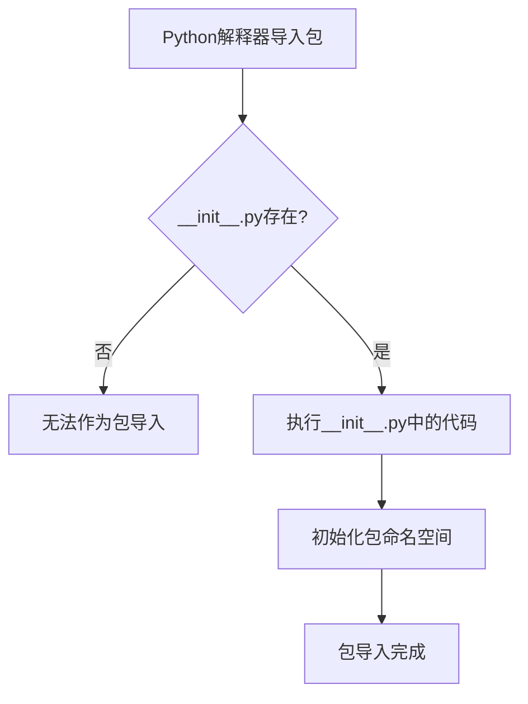

# `.\MetaGPT\tests\__init__.py` 详细设计文档

这是一个空的Python包初始化文件，其主要功能是标记当前目录为一个Python包，并可能包含包的元信息、版本号或执行包的初始化代码。当前文件内容为空，仅包含文件头注释。

## 整体流程



## 类结构

```
无类层次结构
```

## 全局变量及字段


    

## 全局函数及方法


## 关键组件


### 初始化模块

此文件是一个Python包的初始化模块（`__init__.py`），用于标记其所在目录为一个Python包，并可在其中定义包的公共接口或执行初始化代码。当前文件内容为空，表明这是一个基础的包结构定义文件。


## 问题及建议


### 已知问题

-   **空文件问题**：当前 `__init__.py` 文件为空，仅包含元数据注释。这可能导致该包在导入时无法正确初始化其子模块或公开必要的接口，影响代码的可维护性和使用便利性。
-   **缺乏功能定义**：文件没有定义任何类、函数或变量，使得该模块或包的功能不明确，增加了其他开发者理解和使用该代码库的难度。
-   **缺少版本信息**：文件中未包含 `__version__` 等标准元信息，不利于依赖管理和版本控制。

### 优化建议

-   **初始化包内容**：在 `__init__.py` 中添加必要的导入语句，以公开包的核心功能。例如，如果包内有重要的类或函数，可以使用 `from .module import ClassName, function_name` 的方式使其在包级别可直接访问。
-   **添加包元数据**：定义 `__version__`、`__author__`、`__description__` 等变量，明确包的版本和基本信息，遵循 Python 包的最佳实践。
-   **编写文档字符串**：为整个包添加一个模块级别的文档字符串（docstring），简要描述包的目的、主要功能和用法示例，提升代码的可读性和可维护性。
-   **考虑懒加载**：如果包较大，导入所有子模块可能影响启动性能。可以考虑使用懒加载机制，仅在首次访问时导入特定模块。


## 其它


### 设计目标与约束

该代码文件是一个包的初始化模块（`__init__.py`），其主要设计目标是定义Python包的命名空间，并可能用于执行包的初始化逻辑、控制包的导入行为（如定义`__all__`列表）或暴露包的主要公共接口。当前文件内容为空，表明该包可能仅作为模块的容器，或者其初始化逻辑由其他机制（如子模块）处理。约束包括遵循Python的包结构约定，确保该文件存在以标识目录为Python包。

### 错误处理与异常设计

当前`__init__.py`文件为空，因此不包含任何显式的错误处理或异常抛出逻辑。任何导入或使用该包时发生的错误将完全由Python解释器或调用者处理。例如，如果该包依赖其他未安装的模块，将在导入时引发`ModuleNotFoundError`。

### 数据流与状态机

由于该文件不包含可执行代码，因此不存在内部数据流或状态机。数据流和状态管理（如果有）完全由该包内的其他模块或外部调用者定义和控制。

### 外部依赖与接口契约

该`__init__.py`文件本身没有声明任何外部依赖。然而，整个包可能依赖外部库，这些依赖应在项目级别的`requirements.txt`或`setup.py`中声明。该文件当前没有定义任何公共接口（如类、函数、变量），因此也没有明确的接口契约。包的公共接口由包内其他模块通过在此文件中导入并暴露（例如，使用`__all__`列表）来定义。

    