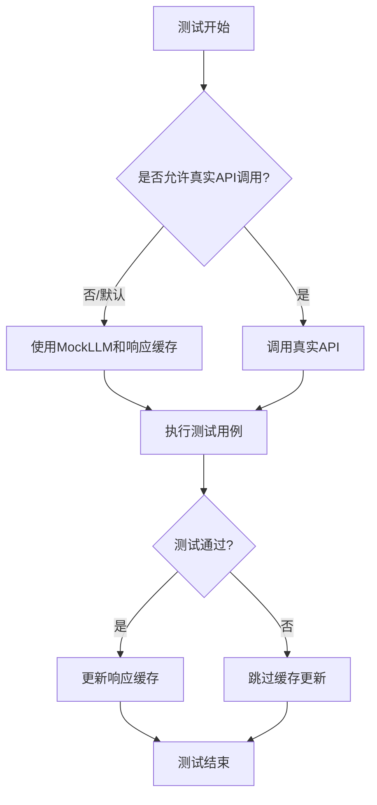
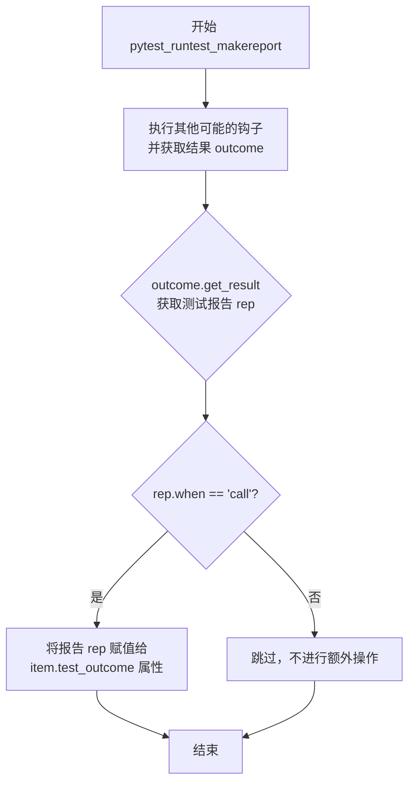
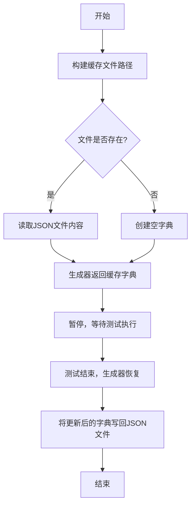
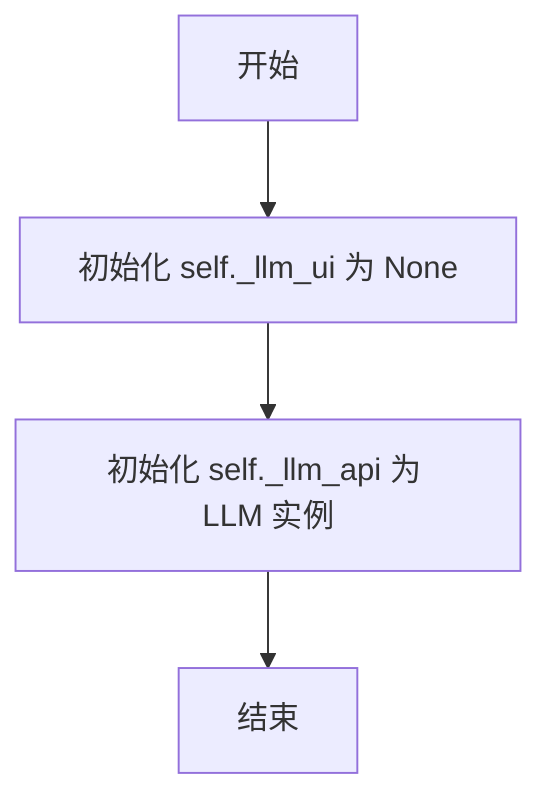
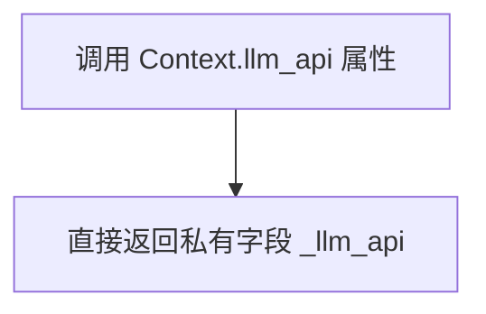

# `.\MetaGPT\tests\conftest.py` 详细设计文档

该文件是MetaGPT项目的Pytest测试配置文件，主要功能是为单元测试和集成测试提供一系列模拟（Mock）和测试夹具（Fixture）。它通过模拟LLM（大语言模型）API调用、HTTP请求、Git仓库操作等外部依赖，创建可重复、隔离的测试环境，并利用响应缓存机制来加速测试执行和避免真实API调用。

## 整体流程



## 类结构

```
conftest.py (Pytest配置文件)
├── 全局变量: RSP_CACHE_NEW, ALLOW_OPENAI_API_CALL
├── 全局函数: pytest_runtest_makereport, _rsp_cache
├── 类: Context
└── Pytest Fixtures:
    ├── rsp_cache
    ├── llm_mock
    ├── llm_api
    ├── proxy
    ├── loguru_caplog
    ├── context
    ├── init_config
    ├── new_filename
    ├── search_rsp_cache
    ├── mermaid_rsp_cache
    ├── aiohttp_mocker
    ├── curl_cffi_mocker
    ├── httplib2_mocker
    ├── search_engine_mocker
    ├── http_server
    ├── mermaid_mocker
    └── git_dir
```

## 全局变量及字段


### `RSP_CACHE_NEW`
    
全局字典，用于在测试运行期间临时存储新生成且有用的LLM响应缓存，最终会导出到rsp_cache_new.json文件中。

类型：`dict`
    


### `ALLOW_OPENAI_API_CALL`
    
全局环境变量标志，控制测试中是否允许真实调用OpenAI API（1为允许，0为禁止），默认为1，旨在测试完成后改为0以完全使用模拟数据。

类型：`int`
    


### `Context._llm_ui`
    
Context类的私有字段，用于存储用户界面相关的LLM实例，当前在测试上下文中未初始化或使用。

类型：`Optional[Any]`
    


### `Context._llm_api`
    
Context类的私有字段，用于存储一个真实的LLM API实例，作为测试中可能使用的语言模型后端。

类型：`LLM`
    
    

## 全局函数及方法

### `pytest_runtest_makereport`

这是一个Pytest钩子函数，用于在测试执行过程中捕获测试结果。它被标记为`tryfirst=True`和`hookwrapper=True`，确保它在其他同类型钩子之前执行，并允许它包装（即拦截和修改）测试报告生成过程。具体来说，它会在每个测试用例的`call`阶段（即测试函数体执行时）结束后，将生成的测试结果报告（`rep`）附加到测试项（`item`）的自定义属性`test_outcome`上，供后续的fixture（如`llm_mock`）使用，以判断测试是否通过并据此决定是否更新响应缓存。

参数：

- `item`：`pytest.Item`，表示当前正在执行的测试项（如一个测试函数）。
- `call`：`pytest.CallInfo`，包含当前测试调用阶段（setup, call, teardown）的信息。

返回值：`None`，此钩子函数不直接返回值，而是通过`yield`机制影响测试报告流程。

#### 流程图



#### 带注释源码

```python
@pytest.hookimpl(tryfirst=True, hookwrapper=True)  # 装饰器：将此函数注册为Pytest钩子，tryfirst确保优先执行，hookwrapper允许包装（拦截）执行过程。
def pytest_runtest_makereport(item, call):  # 钩子函数定义，参数由Pytest框架传入。
    outcome = yield  # yield语句暂停函数执行，将控制权交还给Pytest框架去执行实际的测试和报告生成逻辑。执行完毕后，outcome变量将包含一个`Result`对象。
    rep = outcome.get_result()  # 从outcome中获取最终的测试报告对象（`TestReport`）。
    if rep.when == "call":  # 检查报告是否对应测试的`call`阶段（即测试函数体本身执行阶段，而非setup或teardown）。
        item.test_outcome = rep  # 如果是`call`阶段的报告，则将其附加到测试项（item）的自定义属性`test_outcome`上，供其他fixture（如`llm_mock`）后续使用。
```

### `_rsp_cache`

该函数是一个用于读取和写入JSON格式响应缓存的生成器函数。它主要用于测试环境中，通过读取指定的缓存文件来模拟外部API的响应，并在测试结束后将更新后的缓存写回文件，以支持测试的稳定性和可重复性。

参数：

- `name`：`str`，缓存文件的名称（不包含扩展名），用于构建缓存文件的完整路径。

返回值：`Generator[dict, None, None]`，一个生成器，在迭代时首先返回从缓存文件中读取的字典数据，然后在生成器结束时将更新后的字典数据写回缓存文件。

#### 流程图



#### 带注释源码

```python
def _rsp_cache(name):
    # 构建缓存文件的完整路径，基于传入的名称和预设的测试数据路径
    rsp_cache_file_path = TEST_DATA_PATH / f"{name}.json"  # read repo-provided
    # 检查缓存文件是否存在
    if os.path.exists(rsp_cache_file_path):
        # 如果存在，打开并读取JSON内容
        with open(rsp_cache_file_path, "r") as f1:
            rsp_cache_json = json.load(f1)
    else:
        # 如果不存在，创建一个空字典作为初始缓存
        rsp_cache_json = {}
    # 使用yield将缓存字典返回给调用者，并暂停执行
    yield rsp_cache_json
    # 当生成器被恢复（即测试结束后），将更新后的缓存字典写回文件
    with open(rsp_cache_file_path, "w") as f2:
        json.dump(rsp_cache_json, f2, indent=4, ensure_ascii=False)
```

### `Context.__init__`

该方法用于初始化 `Context` 类的实例，主要设置内部用于管理 LLM（大语言模型）的字段。

参数：

-  `self`：`Context` 类型，表示 `Context` 类的实例本身。

返回值：`None` 类型，构造函数无返回值。

#### 流程图



#### 带注释源码

```python
def __init__(self):
    # 初始化一个内部变量 `_llm_ui`，用于可能的用户界面相关LLM，当前未使用，设为None。
    self._llm_ui = None
    # 初始化一个内部变量 `_llm_api`，创建一个 `LLM` 类的实例。
    # 这个实例将作为默认的API接口LLM，用于后续的文本生成等操作。
    self._llm_api = LLM()
```

### `Context.llm_api`

这是一个只读属性（property），用于获取 `Context` 类中封装的 `LLM` 实例。它不执行任何复杂的逻辑，只是简单地返回在 `__init__` 方法中初始化的 `_llm_api` 私有字段。该属性为外部访问 `LLM` 实例提供了一个统一的、受控的入口点。

参数：
- 无

返回值：`LLM`，返回一个 `LLM` 类的实例，该实例用于执行大语言模型相关的操作。

#### 流程图



#### 带注释源码

```python
    @property
    def llm_api(self):
        # 1. 初始化llm，带有缓存结果
        # 2. 如果缓存query，那么直接返回缓存结果
        # 3. 如果没有缓存query，那么调用llm_api，返回结果
        # 4. 如果有缓存query，那么更新缓存结果
        return self._llm_api
```

## 关键组件


### 响应缓存机制

该组件通过读取和写入JSON文件，为单元测试中的LLM（大语言模型）调用、网络请求（如搜索引擎、Mermaid服务）等外部依赖提供可预测的模拟响应，旨在实现测试的确定性、可重复性和离线执行能力。

### LLM模拟器

该组件通过`MockLLM`类及其`aask`、`aask_batch`、`aask_code`等方法，在测试中拦截并替换真实的LLM API调用。它利用响应缓存机制返回预设结果，并能在测试通过时自动收集新的响应以扩充缓存库。

### 网络请求模拟器

该组件包含`MockAioResponse`、`MockCurlCffiResponse`、`MockHttplib2Response`等类，用于模拟`aiohttp`、`curl_cffi`、`httplib2`等不同HTTP客户端库的请求。它们与响应缓存机制集成，为搜索引擎、Mermaid服务等外部HTTP请求提供模拟数据。

### 测试上下文与资源管理

该组件通过`context`、`git_dir`等fixture，为每个测试函数提供独立的、隔离的运行环境（如临时的Git仓库、项目路径配置），并在测试结束后自动清理资源，确保测试之间互不干扰。

### 代理服务器模拟

该组件通过`proxy` fixture提供一个简易的HTTP代理服务器实现，用于测试需要经过代理的网络请求场景，验证代码在代理环境下的行为。

### 日志捕获与集成

该组件通过`loguru_caplog` fixture，将`loguru`库的日志输出重定向到pytest的`caplog` fixture中，使得在测试中能够方便地断言和验证代码的日志输出。


## 问题及建议

### 已知问题

-   **全局变量 `RSP_CACHE_NEW` 和 `ALLOW_OPENAI_API_CALL` 缺乏类型注解和明确的常量标识**：`RSP_CACHE_NEW` 是一个全局字典，`ALLOW_OPENAI_API_CALL` 是一个全局整数，它们都没有类型注解，且 `ALLOW_OPENAI_API_CALL` 虽然作为常量使用，但命名上未遵循全大写的常量惯例，降低了代码的可读性和可维护性。
-   **`Context` 类的设计冗余且功能不完整**：代码中定义了一个 `Context` 类，但其 `llm_api` 属性仅返回一个未初始化的 `LLM` 实例，且注释描述的功能（缓存查询、更新缓存）并未在属性访问器中实现。同时，项目中已存在 `MetagptContext`，此自定义 `Context` 类可能造成混淆。
-   **`pytest_runtest_makereport` 钩子函数存在潜在风险**：该钩子为每个测试用例的 `item` 动态添加了 `test_outcome` 属性。虽然这在当前 `llm_mock` 夹具中用于判断测试是否通过，但这种动态修改测试项对象的方式不够规范，可能与其他插件或未来 pytest 版本不兼容。
-   **`llm_mock` 夹具的缓存更新逻辑可能不健壮**：该夹具在测试通过后，将 `llm.rsp_candidates` 中的内容更新到 `rsp_cache` 和全局的 `RSP_CACHE_NEW`。然而，`rsp_candidates` 的数据结构（列表套字典）的访问方式（`list(rsp_candidate.keys())[0]`）假设每个字典只有一个键值对，这种假设比较脆弱，如果数据结构变化会导致错误。
-   **`_rsp_cache` 函数和衍生夹具存在文件读写竞争风险**：`_rsp_cache` 生成器函数以及 `rsp_cache`、`search_rsp_cache`、`mermaid_rsp_cache` 等夹具在 `yield` 后（即测试结束后）会写回 JSON 文件。在并行测试（`pytest-xdist`）环境下，多个进程同时写入同一文件会导致数据损坏或丢失。
-   **`proxy` 夹具的 `print` 语句影响测试纯净度**：`proxy` 夹具中的 `print(f\"Proxy: {host}\")` 语句会将内容输出到标准输出，干扰测试报告，应使用更合适的日志或调试输出方式。
-   **`new_filename` 夹具的 Mock 对象可能过于宽泛**：该夹具 Mock 了 `FileRepository.new_filename` 方法，返回固定值 `"20240101"`。如果被测代码的其他部分或未来功能依赖此方法生成唯一或基于时间戳的文件名，此 Mock 可能导致隐藏的依赖问题或测试覆盖不全。
-   **`search_engine_mocker` 和 `mermaid_mocker` 夹具共享可变对象**：这两个夹具都将一个空字典 `check_funcs` 赋值给多个 Mock 响应类的 `check_funcs` 属性。这意味着通过这些夹具修改 `check_funcs` 会同时影响所有关联的 Mock 类，这种隐式的共享状态可能使测试间的隔离性变差，调试困难。

### 优化建议

-   **为全局变量添加类型注解并规范命名**：为 `RSP_CACHE_NEW` 添加 `dict` 类型注解（如 `RSP_CACHE_NEW: dict = {}`），将 `ALLOW_OPENAI_API_CALL` 重命名为全大写形式（如 `ALLOW_OPENAI_API_CALL`）并添加 `int` 类型注解。考虑将其定义为真正的常量（如放在 `const.py` 中）。
-   **移除或重构冗余的 `Context` 类**：评估 `Context` 类的实际用途。如果仅为 `llm_api` 夹具提供包装，可以考虑移除该类，直接在夹具中创建和返回 `LLM` 实例或 `MockLLM` 实例。如果需要更复杂的上下文管理，应完善其功能，确保属性访问器实现注释描述的逻辑，或与 `MetagptContext` 整合。
-   **使用更规范的 pytest 机制传递测试结果**：避免直接向 `item` 添加属性。可以考虑使用 `request` 对象的 `node` 属性结合 `rep` 对象的状态，或者利用 pytest 的内置缓存机制或自定义标记来传递测试通过信息。
-   **强化 `llm_mock` 的缓存更新逻辑**：改进对 `llm.rsp_candidates` 数据结构的处理，使其能安全地处理可能包含多个键的字典。可以添加类型检查和更健壮的循环逻辑。同时，考虑将更新逻辑封装成一个独立的函数以提高可测试性。
-   **解决缓存文件的并发写入问题**：为每个测试进程或会话使用独立的临时缓存文件路径，避免写入共享的 `rsp_cache.json` 等文件。可以在测试结束时合并这些临时文件，或者使用文件锁（如 `fcntl` 或 `portalocker`）来确保写入安全。更好的方式是考虑使用数据库或内存缓存（如 `pytest-cache`）替代文件缓存。
-   **移除或替换 `proxy` 夹具中的 `print` 语句**：将 `print` 语句替换为使用 `logger.debug` 或 `caplog` 夹具来捕获日志，以保持测试输出的整洁。
-   **细化 `new_filename` 的 Mock 策略**：评估是否所有测试都需要固定的文件名。如果不需要，可以移除该夹具。如果部分测试需要，可以将其改为一个可配置的夹具，允许测试用例指定返回的文件名，或者使用 `mocker.spy` 来监控调用而非完全替换实现。
-   **解耦 `search_engine_mocker` 和 `mermaid_mocker` 的共享状态**：为每个 Mock 响应类创建独立的 `check_funcs` 字典实例，而不是共享同一个空字典。这样可以确保各个测试夹具和 Mock 类之间的状态完全隔离，提高测试的独立性和可靠性。

## 其它


### 设计目标与约束

本代码文件 `conftest.py` 是 MetaGPT 项目的 Pytest 测试配置文件。其主要设计目标是：
1.  **提供可复现的测试环境**：通过 Mock 机制（如 `MockLLM`、`MockAioResponse`）和响应缓存（`rsp_cache`），隔离外部依赖（如 OpenAI API、网络服务），确保测试结果不因外部服务状态或网络波动而变化，实现测试的稳定性和可重复性。
2.  **简化测试编写**：通过预定义一系列 `pytest.fixture`（如 `llm_mock`, `context`, `proxy`），为测试用例提供即用型的模拟对象和上下文环境，减少测试代码中的样板代码和重复设置。
3.  **支持多种测试场景**：提供针对不同外部组件（如 LLM、HTTP 客户端、搜索引擎、Mermaid 服务）的 Mock 装置，方便对项目各模块进行单元测试和集成测试。
4.  **管理测试资源**：通过 `context` 等装置自动创建和清理测试工作空间（如 Git 仓库），确保测试之间相互独立，避免残留数据影响后续测试。

主要约束包括：
*   **与 Pytest 框架强耦合**：代码结构完全遵循 Pytest 的 fixture 和 hook 规范，其功能依赖于 Pytest 的运行生命周期。
*   **缓存驱动的 Mock 逻辑**：Mock 行为严重依赖于预先生成的 `rsp_cache.json` 文件。缓存不完整或过期会导致测试失败或意外调用真实 API。
*   **全局状态管理**：使用 `RSP_CACHE_NEW` 全局变量来收集测试运行中产生的新缓存条目，存在一定的状态管理复杂度。

### 错误处理与异常设计

代码中的错误处理主要围绕测试的健壮性和资源管理展开：
1.  **资源创建与清理**：在 `context` fixture 中，使用 `request.addfinalizer` 注册清理函数 `fin`，确保测试结束后删除创建的 Git 仓库，防止资源泄漏。这是通过 Pytest 的请求上下文机制实现的确定性清理。
2.  **文件操作容错**：在 `rsp_cache`、`_rsp_cache` 等 fixture 中，使用 `os.path.exists` 检查缓存文件是否存在，如果不存在则初始化为空字典，避免了 `FileNotFoundError`。
3.  **Mock 异常传播**：各类 Mock 响应类（如 `MockAioResponse`）的设计目的是模拟真实调用的成功返回。测试中需要验证的异常情况，应由测试用例自身通过 `pytest.raises` 等方式来触发和断言，本配置文件不直接处理业务逻辑异常。
4.  **环境变量控制**：通过 `ALLOW_OPENAI_API_CALL` 环境变量控制是否允许真实 API 调用，为调试和缓存更新提供了安全开关。默认值（1）在生产测试环境中可能存在意外调用真实服务的风险。

### 数据流与状态机

本文件的核心数据流围绕 **响应缓存** 的读写和 **Mock 对象** 的状态展开：
1.  **缓存加载流程**：
    *   **入口**：`rsp_cache`、`search_rsp_cache`、`mermaid_rsp_cache` 等 session 作用域的 fixture 是数据源。
    *   **读取**：每个测试会话开始时，从对应的 JSON 文件（如 `rsp_cache.json`）读取缓存字典。
    *   **注入**：这些缓存字典被注入到对应的 Mock fixture（如 `llm_mock`）中，并赋值给 Mock 对象的 `rsp_cache` 属性。
    *   **使用**：Mock 对象（如 `MockLLM.aask`）在执行时，以其接收到的参数（如 prompt）为键查询 `rsp_cache`。若命中，则返回缓存值；若未命中且 `ALLOW_OPENAI_API_CALL` 为真，则可能调用真实服务。
2.  **缓存更新流程**：
    *   **收集**：在 `llm_mock` fixture 的拆解阶段（`yield` 之后），检查测试是否通过。如果通过，则将 Mock 对象在本次测试中收集到的 `rsp_candidates`（新的问答对）更新到 session 级的 `rsp_cache` 字典中。
    *   **持久化**：在所有测试结束后（`rsp_cache` fixture 的 `yield` 之后），将更新后的 `rsp_cache` 字典写回原始文件，并将全新的缓存条目（`RSP_CACHE_NEW`）写入 `rsp_cache_new.json` 供审查。
3.  **状态机（简化）**：
    *   **初始状态**：加载缓存文件。
    *   **测试执行状态**：Mock 对象使用缓存提供服务，并可能记录新交互。
    *   **测试通过状态**：新交互被合并到主缓存和全局新缓存集合中。
    *   **会话结束状态**：所有更新被写回磁盘文件。

### 外部依赖与接口契约

本文件定义并 Mock 了系统与外部服务的接口契约，确保测试不依赖外部可用性：
1.  **大型语言模型 (LLM) 服务**：
    *   **契约接口**：`metagpt.provider.base_llm.BaseLLM.aask`, `aask_batch`, `metagpt.provider.openai_api.OpenAILLM.aask_code`。
    *   **Mock 实现**：通过 `llm_mock` fixture 使用 `MockLLM` 进行替换。`MockLLM` 需实现相同的方法签名和异步返回行为。
2.  **HTTP 客户端库**：
    *   **aiohttp**：契约为 `aiohttp.ClientSession.request` 及其便捷方法（`get`, `post` 等）。由 `aiohttp_mocker` fixture 通过 `MockAioResponse` 模拟。
    *   **curl_cffi**：契约为 `curl_cffi.requests.Session.request`。由 `curl_cffi_mocker` fixture 通过 `MockCurlCffiResponse` 模拟。
    *   **httplib2**：契约为 `httplib2.Http.request`。由 `httplib2_mocker` fixture 通过 `MockHttplib2Response` 模拟。
3.  **搜索引擎服务**：通过 `search_engine_mocker` fixture 整合上述 HTTP Mock，模拟 SerpAPI、Serper、Google、DuckDuckGo 等服务的网络请求，并共用 `search_rsp_cache` 缓存。
4.  **Mermaid 服务**：通过 `mermaid_mocker` fixture 使用 `aiohttp_mocker` 来模拟向 Mermaid 解析服务发起的 HTTP 请求，并共用 `mermaid_rsp_cache` 缓存。
5.  **Git 操作**：`context` fixture 内部依赖 `metagpt.utils.git_repository.GitRepository` 来创建和管理临时仓库。该依赖是项目内部模块，在测试中为真实调用，但操作的是临时目录。
6.  **日志系统**：通过 `loguru_caplog` fixture 将 `loguru` 的日志消息传播到 Python 标准的 `logging` 系统，以便 Pytest 的 `caplog` fixture 能够捕获和断言日志输出。

这些 Mock 装置严格遵循了原始接口的调用方式（同步/异步、参数、返回值类型），使得被测代码在测试环境中无需修改即可运行，但所有对外部世界的调用都被拦截并返回可控的模拟数据。

    