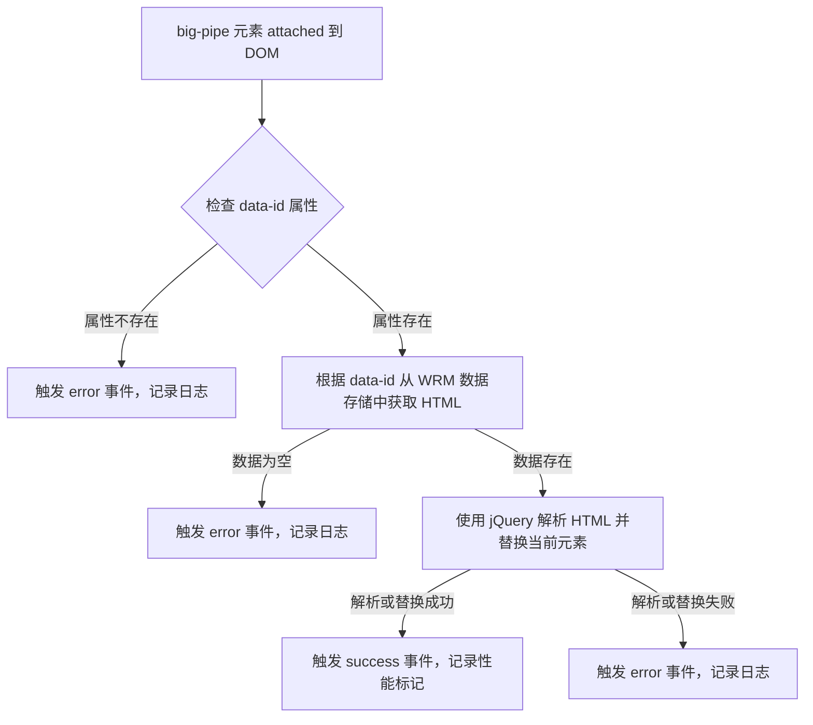
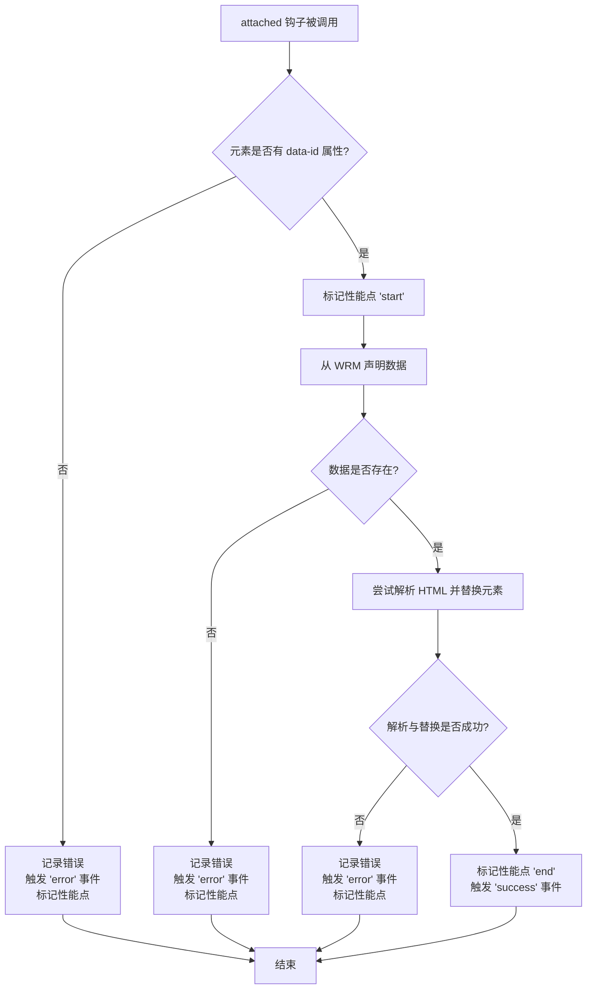
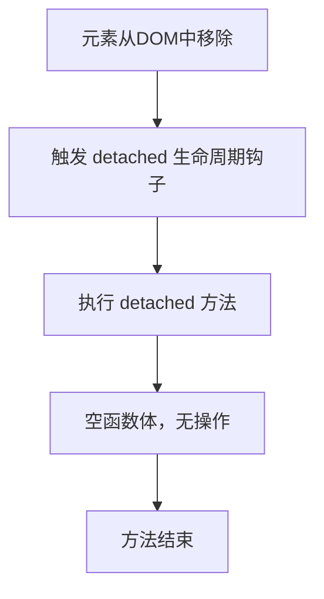

# `.\MetaGPT\tests\data\code\js\1.js` 详细设计文档

该代码定义了一个名为 `big-pipe` 的自定义 Web 组件（通过 Skate.js 库），用于实现 BigPipe 技术。其核心功能是异步加载和渲染服务器端分块发送的 HTML 内容片段。当组件被附加到 DOM 时，它会根据 `data-id` 属性从预加载的数据存储中获取对应的 HTML 字符串，将其解析并替换自身，从而完成内容的延迟渲染，并触发相应的事件通知渲染成功或失败。

## 整体流程



## 类结构

```
全局上下文
├── 全局函数: WRMCB
└── AMD 模块定义
    └── 匿名函数返回的 Skate.js 组件定义
        ├── 内部函数: a, o, d, p
        └── 组件生命周期钩子: attached, detached
```

## 全局变量及字段


### `WRMCB`
    
全局错误处理函数，用于捕获并输出脚本执行过程中的错误信息到控制台。

类型：`Function`
    


    

## 全局函数及方法

### `WRMCB`

这是一个全局错误处理函数，用于在浏览器控制台（如果可用）中记录和输出脚本执行过程中捕获的异常信息。

参数：
- `e`：`any`，捕获到的异常对象。

返回值：`undefined`，此函数不返回任何值。

#### 流程图

```mermaid
flowchart TD
    A[开始: 调用 WRMCB(e)] --> B{console 及其 log/error 方法<br>是否可用?}
    B -- 是 --> C[在控制台输出<br>“Error running batched script.”]
    C --> D[在控制台输出异常对象 e]
    D --> E[结束]
    B -- 否 --> E
```

#### 带注释源码

```
WRMCB=function(e){
    // 获取全局的 console 对象
    var c=console;
    // 检查 console 对象及其 log 和 error 方法是否存在
    if(c&&c.log&&c.error){
        // 输出通用的错误提示信息
        c.log('Error running batched script.');
        // 输出具体的异常对象 e
        c.error(e);
    }
}
```

### `big-pipe.attached`

`big-pipe.attached` 是 Skate.js 自定义元素 `<big-pipe>` 的生命周期钩子函数，当元素被插入到 DOM 中时触发。它的核心功能是：根据元素的 `data-id` 属性，从 WRM（Web Resource Manager）声明并获取对应的 HTML 片段数据，然后解析该 HTML 并替换当前 `<big-pipe>` 元素。整个过程会触发自定义事件来通知成功或失败，并使用 Performance API 进行性能标记。

参数：

- `i`：`HTMLElement`，当前被附加到 DOM 的 `<big-pipe>` 自定义元素实例。

返回值：`undefined`，该函数不返回任何值。

#### 流程图



#### 带注释源码

```javascript
attached: function(i) {
    // 成功回调函数：触发自定义 'success' 事件
    function a() {
        var e = new CustomEvent("success");
        i.dispatchEvent(e);
    }
    // 错误回调函数：触发自定义 'error' 事件，并携带错误数据
    function o(e, r) {
        var t = new CustomEvent("error");
        t.data = {
            event: e,
            signature: r
        }, i.dispatchEvent(t);
    }
    // 统一的错误处理函数：记录性能点并调用错误回调
    function d(e, r) {
        p("error"), o(e, r);
    }
    // 性能标记函数：使用 Performance API 记录关键时间点
    function p(e) {
        "performance" in window && performance.mark && performance.mark(c + e);
    }
    // 1. 获取元素的 data-id 属性
    var s = i.getAttribute("data-id");
    // 2. 检查 data-id 是否存在
    if (null === s)
        // 2.1 如果不存在，记录错误日志，触发错误事件，并结束流程
        return n.error("No data-id attribute provided for tag <big-pipe/> for element:", i), void d({
            name: "NoPipeIdError",
            message: "Unable to render element. Element does not contain a pipe id.",
            element: i
        }, "no.pipe.id");
    // 3. 构建性能标记的前缀
    var c = "bigPipe." + s + ".";
    // 4. 标记流程开始
    p("start");
    // 5. 根据 data-id 从 WRM 声明并获取数据
    var u = r.claim(s);
    // 6. 检查数据是否存在
    u ?
        // 6.1 如果数据存在，尝试解析并替换元素
        (function(r) {
            try {
                // 6.1.1 使用 jQuery 解析 HTML 字符串
                var o = e(r);
                // 6.1.2 用解析后的 DOM 替换当前 <big-pipe> 元素，并对新元素初始化 Skate.js 组件
                e(i).replaceWith(o).each(function() {
                    t.init(this);
                }),
                // 6.1.3 标记流程结束，触发成功事件
                p("end"), a();
            } catch (e) {
                // 6.1.4 如果解析或替换过程中出错，记录错误日志并触发错误事件
                n.error("Error while parsing html: " + e), d(e, "parsing");
            }
        })(u) :
        // 6.2 如果数据不存在，记录错误日志并触发错误事件
        d({
            name: "NoDataError",
            message: "BigPipe response is empty."
        }, "no.data");
}
```

### `big-pipe.detached`

`detached` 方法是 Skate.js 自定义元素生命周期钩子之一，当元素从 DOM 中移除时被调用。在当前代码实现中，此方法为空函数，意味着元素被移除时没有执行任何特定的清理或副作用操作。

参数：
- 无

返回值：`undefined`，无返回值。

#### 流程图



#### 带注释源码

```
detached: function() {
    // 这是一个 Skate.js 生命周期钩子函数。
    // 当自定义元素 <big-pipe> 从 DOM 树中分离（移除）时，此函数会被自动调用。
    // 当前实现为空，表示在元素移除时不需要执行任何特定的清理逻辑、事件解绑或资源释放。
    // 开发者可以在此处添加自定义的清理代码，例如：
    // - 移除事件监听器以防止内存泄漏。
    // - 取消未完成的网络请求（如与 `data-id` 相关的请求）。
    // - 清理在 `attached` 方法中创建的内部状态或定时器。
},
```

## 关键组件


### 自定义元素 (Custom Element)

通过 Skate.js 库定义的自定义 HTML 元素 `<big-pipe>`，用于实现基于“BigPipe”模式的异步内容分块加载与渲染。

### 数据声明与获取 (Data Claiming)

通过 `wrm/data` 模块的 `claim` 方法，根据元素上的 `data-id` 属性从预加载的数据池中获取对应的 HTML 片段数据。

### 事件驱动通信 (Event-Driven Communication)

使用 `CustomEvent` 在元素渲染成功或失败时，向父元素或监听器派发 `success` 或 `error` 事件，实现组件间的解耦通信。

### 性能标记 (Performance Marking)

利用 `window.performance.mark` API 在关键节点（如开始、结束、错误）打上时间戳标记，用于性能监控和分析。

### 错误处理与日志 (Error Handling & Logging)

包含对缺失 `data-id` 属性、数据为空、HTML 解析失败等情况的错误捕获，并通过 `jira/util/logger` 模块记录错误日志，同时派发错误事件。

### 渐进式渲染 (Progressive Rendering)

通过获取到的 HTML 字符串数据，使用 jQuery 解析并替换掉原始的 `<big-pipe>` 占位元素，实现内容的渐进式渲染，并自动初始化新元素中的 Skate.js 组件。


## 问题及建议


### 已知问题

-   **全局错误处理函数过于简单**：`WRMCB` 函数仅将错误打印到控制台，缺乏更健壮的错误上报、用户友好提示或降级处理机制，在生产环境中可能无法有效追踪和解决问题。
-   **硬编码的性能标记名称**：性能标记的名称（如 `"bigPipe."+s+"."`）是硬编码的，如果项目中的性能监控策略发生变化，需要修改多处代码，可维护性差。
-   **缺乏对 `performance.mark` API 的兼容性检查**：代码直接使用 `performance.mark`，但未检查该API在当前浏览器环境中是否可用，可能导致在不支持的浏览器中抛出错误。
-   **错误信息不够结构化**：在触发 `error` 事件时传递的错误对象（如 `{name:"NoPipeIdError"...}`）结构简单，可能不足以支持复杂的错误分析和处理逻辑。
-   **代码可读性差**：源码经过压缩（minified），变量名短且无意义（如 `e`, `r`, `t`, `n`），函数逻辑嵌套较深，给后续的调试、维护和理解带来了很大困难。

### 优化建议

-   **增强错误处理**：重构 `WRMCB` 函数，集成到项目的统一错误监控系统（如Sentry），并考虑在UI层向用户展示友好的错误提示。同时，确保 `big-pipe` 组件内部的 `d` 函数也能将错误上报。
-   **提取性能标记逻辑为可配置项**：将性能标记的前缀（如 `"bigPipe."`）和标记点名称（`"start"`, `"end"`, `"error"`）提取为配置常量或通过参数传入，提高代码的可配置性和可维护性。
-   **添加API兼容性检查**：在使用 `performance.mark` 等较新的Web API前，添加特性检测（feature detection），例如 `if (window.performance && performance.mark)`，并提供降级方案（如记录到自定义日志）。
-   **标准化错误对象**：定义并遵循项目内的错误对象格式标准，确保所有错误都包含必要的上下文信息，如错误码、时间戳、组件名称、原始错误对象等，便于日志聚合和分析。
-   **代码重构与解压缩**：在开发环境中使用未压缩的源代码进行维护。对压缩后的代码，应通过Source Map进行调试。考虑重构 `attached` 回调函数，将内部函数（`a`, `o`, `d`, `p`）提取为更独立的、可测试的模块方法，并赋予有意义的名称，以大幅提升代码可读性和可维护性。


## 其它


### 设计目标与约束

该代码模块的核心设计目标是实现一个基于 Web Components 的自定义元素 `<big-pipe>`，用于在 Jira 前端架构中支持“BigPipe”技术。BigPipe 是一种将页面内容分块异步加载和渲染的技术，旨在提升首屏渲染速度和用户体验。该组件的约束包括：必须与 Jira 现有的资源管理（WRM）系统集成，以异步获取数据块；必须使用 Skate.js 库来定义自定义元素；必须与 Jira 的日志系统集成以进行错误报告；并且需要触发自定义事件来通知外部代码渲染的成功或失败状态。

### 错误处理与异常设计

代码中包含了多层次的错误处理机制：
1.  **输入验证错误**：当 `<big-pipe>` 元素缺少必要的 `data-id` 属性时，会记录错误日志并触发一个携带 `"no.pipe.id"` 签名的 `error` 事件。
2.  **数据缺失错误**：当从 WRM 系统根据 `data-id` 无法获取到对应的数据时，会触发一个携带 `"no.data"` 签名的 `error` 事件。
3.  **运行时错误**：在解析和替换 HTML 内容的过程中，如果发生异常（例如，HTML 字符串无效或 jQuery 操作出错），会被 `try...catch` 块捕获，记录错误日志，并触发一个携带 `"parsing"` 签名的 `error` 事件。
4.  **全局错误捕获**：最外层的 `try...catch` 块和 `WRMCB` 函数用于捕获和报告模块定义过程中可能发生的脚本级错误，确保错误不会导致整个脚本块失效。
所有错误都通过 `jira/util/logger` 模块进行记录，并通过派发 `CustomEvent` 的方式将错误详情传递给父级或监听者，实现了业务逻辑与错误处理的解耦。

### 数据流与状态机

1.  **数据流**：
    *   **输入**：`<big-pipe>` 元素的 `data-id` 属性作为唯一标识符。
    *   **处理**：通过 `wrm/data.claim(data-id)` 方法，从 WRM 管理的缓存中获取对应的 HTML 字符串数据。
    *   **转换**：使用 jQuery 将获取到的 HTML 字符串转换为 DOM 片段。
    *   **输出**：用生成的 DOM 片段替换原始的 `<big-pipe>` 元素，并初始化新元素中的 Skate.js 组件。
2.  **状态机（隐式）**：
    *   **初始/挂载状态**：元素被添加到 DOM 时（`attached` 回调触发），开始执行流程。
    *   **加载/处理状态**：从 `claim` 数据到 `replaceWith` 替换元素的过程。此期间通过 `performance.mark` 记录性能时间点（`start`, `end`, `error`）。
    *   **完成状态**：
        *   **成功状态**：替换完成后，派发 `success` 事件。
        *   **错误状态**：在任何错误点（无ID、无数据、解析失败），派发 `error` 事件并记录错误性能标记。

### 外部依赖与接口契约

1.  **外部库/框架依赖**：
    *   **jQuery (`jquery`)**：用于 DOM 操作（HTML 解析和元素替换）。
    *   **Skate.js (`jira/skate`)**：用于定义和注册自定义 Web Component (`<big-pipe>`)。代码遵循 Skate.js 的生命周期回调（`attached`, `detached`）和配置约定。
    *   **WRM Data API (`wrm/data`)**：核心数据源接口。依赖其 `claim(pipeId)` 方法来异步获取由服务器端推送或预先埋入的 HTML 数据块。这是与 Jira 后端 BigPipe 实现通信的关键契约。
    *   **Jira Logger (`jira/util/logger`)**：用于记录错误和警告信息，统一应用日志行为。
2.  **浏览器 API 依赖**：
    *   `CustomEvent` 和 `Element.dispatchEvent`：用于组件间通信。
    *   `window.performance.mark` (如果可用)：用于性能监测。
    *   `Element.getAttribute`：用于读取配置。
3.  **接口契约（事件）**：
    *   组件承诺在成功渲染后派发一个无详情的 `"success"` 事件。
    *   组件承诺在失败时派发一个 `"error"` 事件，该事件的 `data` 属性包含错误对象 (`event`) 和一个标识错误类型的字符串 (`signature`)，如 `"no.pipe.id"`, `"no.data"`, `"parsing"`。
    *   父页面或脚本需要监听这些事件来知晓每个管道块的加载状态。

### 性能考量与监控

1.  **性能监控点**：代码集成了 User Timing API (`performance.mark`)，为每个 `data-id` 标识的管道块记录关键时间点：
    *   `bigPipe.[data-id].start`：处理开始。
    *   `bigPipe.[data-id].end`：处理成功结束。
    *   `bigPipe.[data-id].error`：处理过程中发生错误。
    这些标记可以在浏览器开发者工具的 Performance 面板或通过 `performance.getEntriesByType('mark')` 进行分析，用于评估每个内容块的加载性能。
2.  **异步与非阻塞**：由于依赖于 WRM 的异步数据获取机制，该组件的渲染不会阻塞主线程。数据就绪后才执行 DOM 操作。
3.  **优化空间**：当前实现是“拉”模式（元素挂载时主动 `claim` 数据）。在更复杂的场景下，可以考虑与 WRM 的“推”模式结合，或者实现一个简单的请求队列以避免短时间内过多并发操作。


    