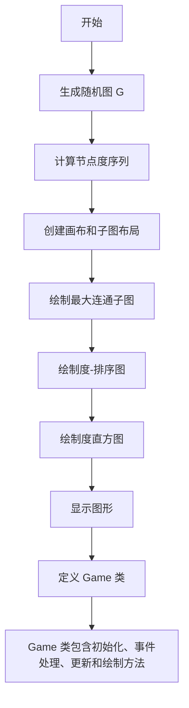
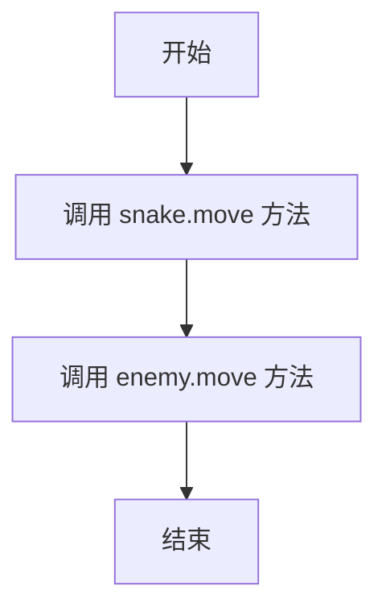
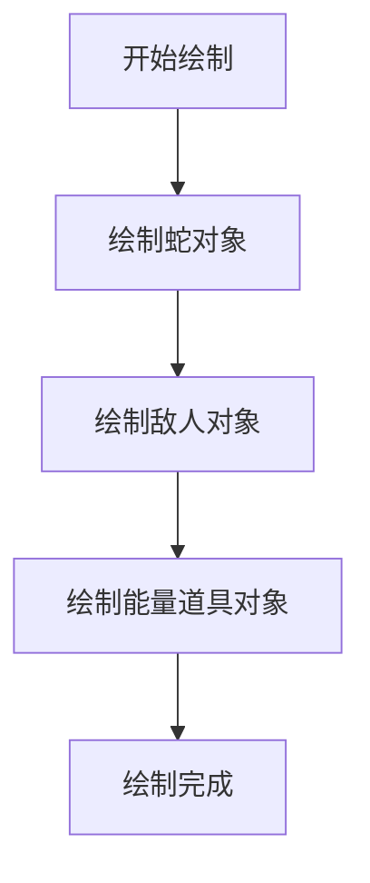

# `.\MetaGPT\tests\data\code\python\1.py` 详细设计文档

该代码是一个混合脚本，主要包含两部分功能：1) 使用 NetworkX 和 Matplotlib 生成并可视化一个随机图的节点度分布，包括最大连通子图、度-排序图和度直方图；2) 定义了一个简单的游戏类 `Game`，用于管理贪吃蛇、敌人和能量道具，并处理键盘事件、更新状态和绘制图形。

## 整体流程



## 类结构

```
Game
├── __init__
├── handle_events
├── update
└── draw
```

## 全局变量及字段


### `G`
    
随机生成的图对象，包含100个节点，边生成概率为0.02

类型：`networkx.Graph`
    


### `degree_sequence`
    
图中所有节点的度按降序排列的列表

类型：`list[int]`
    


### `dmax`
    
图中节点的最大度值

类型：`int`
    


### `fig`
    
Matplotlib图形对象，用于容纳所有子图

类型：`matplotlib.figure.Figure`
    


### `axgrid`
    
图形网格规范，用于定义子图的布局

类型：`matplotlib.gridspec.GridSpec`
    


### `ax0`
    
第一个子图，用于显示图的最大连通分量

类型：`matplotlib.axes.Axes`
    


### `Gcc`
    
原图G的最大连通分量子图

类型：`networkx.Graph`
    


### `pos`
    
节点位置字典，用于在子图ax0中布局Gcc的节点

类型：`dict`
    


### `ax1`
    
第二个子图，用于显示度-排名图

类型：`matplotlib.axes.Axes`
    


### `ax2`
    
第三个子图，用于显示度直方图

类型：`matplotlib.axes.Axes`
    


### `Game.snake`
    
游戏中的蛇对象，代表玩家控制的角色

类型：`Snake`
    


### `Game.enemy`
    
游戏中的敌人对象，代表敌对角色

类型：`Enemy`
    


### `Game.power_up`
    
游戏中的能量道具对象

类型：`PowerUp`
    
    

## 全局函数及方法

### `Game.__init__`

该方法初始化 `Game` 类的一个新实例，负责创建游戏中的核心对象：蛇（Snake）、敌人（Enemy）和能量道具（PowerUp），并设置它们的初始状态。

参数：
-  `self`：`Game`，指向当前 `Game` 类实例的引用。

返回值：`None`，此方法不返回任何值。

#### 流程图

```mermaid
flowchart TD
    A[开始 Game.__init__] --> B[创建 Snake 对象<br>初始位置 (400, 300)<br>初始速度 5<br>初始方向 0]
    B --> C[创建 Enemy 对象<br>初始位置 (100, 100)<br>初始速度 3<br>初始方向 1]
    C --> D[创建 PowerUp 对象<br>初始位置 (200, 200)]
    D --> E[结束]
```

#### 带注释源码

```python
def __init__(self):
    # 初始化蛇对象，设置其初始位置、速度、方向
    self.snake = Snake(400, 300, 5, 0)
    # 初始化敌人对象，设置其初始位置、速度、方向
    self.enemy = Enemy(100, 100, 3, 1)
    # 初始化能量道具对象，设置其初始位置
    self.power_up = PowerUp(200, 200)
```

### `Game.handle_events`

该方法处理来自 Pygame 事件队列的所有事件，主要用于响应用户的键盘输入以控制蛇的移动方向，并检测退出事件。

参数：
- `self`：`Game` 实例，表示当前游戏对象。

返回值：`bool`，如果检测到退出事件（如用户关闭窗口），则返回 `False` 以指示游戏应结束；否则返回 `True` 以继续游戏循环。

#### 流程图

```mermaid
graph TD
    A[开始] --> B[从事件队列获取事件列表]
    B --> C{遍历每个事件}
    C --> D{事件类型是 QUIT?}
    D -- 是 --> E[返回 False]
    D -- 否 --> F{事件类型是 KEYDOWN?}
    F -- 是 --> G{判断按下的键}
    G -- 上箭头 --> H[调用 snake.change_direction(0)]
    G -- 下箭头 --> I[调用 snake.change_direction(1)]
    G -- 左箭头 --> J[调用 snake.change_direction(2)]
    G -- 右箭头 --> K[调用 snake.change_direction(3)]
    F -- 否 --> L[继续循环]
    H --> L
    I --> L
    J --> L
    K --> L
    L --> C
    C -- 遍历结束 --> M[返回 True]
    E --> N[结束]
    M --> N
```

#### 带注释源码

```python
def handle_events(self):
    # 遍历 Pygame 事件队列中的所有事件
    for event in pygame.event.get():
        # 检查事件类型是否为退出事件（例如用户点击了窗口关闭按钮）
        if event.type == pygame.QUIT:
            # 如果检测到退出事件，返回 False 以通知主循环结束游戏
            return False
        # 检查事件类型是否为键盘按键按下事件
        elif event.type == pygame.KEYDOWN:
            # 根据按下的具体键位，调用蛇对象的 change_direction 方法来改变其移动方向
            if event.key == pygame.K_UP:
                # 方向 0 代表向上
                self.snake.change_direction(0)
            elif event.key == pygame.K_DOWN:
                # 方向 1 代表向下
                self.snake.change_direction(1)
            elif event.key == pygame.K_LEFT:
                # 方向 2 代表向左
                self.snake.change_direction(2)
            elif event.key == pygame.K_RIGHT:
                # 方向 3 代表向右
                self.snake.change_direction(3)
    # 如果没有检测到退出事件，返回 True 以继续游戏循环
    return True
```

### `Game.update`

该方法负责更新游戏状态，主要调用蛇和敌人的移动逻辑，使它们在每一帧中根据当前方向移动。

参数：无

返回值：`None`，无返回值

#### 流程图



#### 带注释源码

```
def update(self):
    # 更新蛇的位置，根据当前方向移动
    self.snake.move()
    # 更新敌人的位置，根据其AI逻辑移动
    self.enemy.move()
```

### `Game.draw`

该方法负责将游戏中的所有主要对象（蛇、敌人、能量道具）绘制到指定的屏幕上。

参数：
- `screen`：`pygame.Surface`，用于绘制游戏画面的屏幕表面对象。

返回值：`None`，该方法不返回任何值。

#### 流程图



#### 带注释源码

```python
def draw(self, screen):
    # 调用蛇对象的draw方法，将其绘制到屏幕上
    self.snake.draw(screen)
    # 调用敌人对象的draw方法，将其绘制到屏幕上
    self.enemy.draw(screen)
    # 调用能量道具对象的draw方法，将其绘制到屏幕上
    self.power_up.draw(screen)
```

## 关键组件

### 网络图生成与可视化组件

使用 `networkx` 库生成随机图，并计算节点的度序列，用于后续的度分布分析。

### 度分布分析组件

通过度排序图和度直方图两种方式，可视化展示图中节点度的分布情况。

### 图形用户界面组件

利用 `matplotlib` 库创建多子图布局，分别展示图的连通分量、度排序图和度直方图。

### 游戏逻辑组件

定义了一个 `Game` 类，用于管理贪吃蛇游戏的核心逻辑，包括事件处理、游戏状态更新和图形绘制。

## 问题及建议


### 已知问题

-   **代码结构混乱**：给定的代码片段混合了两个完全不相关的功能模块。第一部分（`import matplotlib.pyplot as plt` 之后）是一个使用 NetworkX 和 Matplotlib 进行图论分析和可视化的脚本。第二部分（`class Game:` 之后）是一个使用 Pygame 的贪吃蛇游戏（或类似游戏）的类定义。这两部分代码在逻辑和功能上没有任何关联，却被放在同一个文件中，违反了单一职责原则，导致代码难以理解、维护和复用。
-   **缺少必要的导入和依赖**：`Game` 类及其依赖的 `Snake`、`Enemy`、`PowerUp` 类均未在代码中定义或导入。代码中使用了 `pygame` 模块，但文件开头并未导入 `pygame`。这会导致运行时 `NameError`。
-   **硬编码与魔法数字**：`Game` 类中，蛇和敌人的初始位置、大小、速度等参数（如 `400, 300, 5, 0` 和 `100, 100, 3, 1`）以及方向控制的数字（0, 1, 2, 3）都是硬编码的“魔法数字”，降低了代码的可读性和可配置性。
-   **潜在的性能问题**：在 `handle_events` 方法中，每次调用都使用 `pygame.event.get()` 获取所有事件。虽然对于简单游戏足够，但在复杂场景或需要精细事件管理的应用中，可能需要更高效的事件处理机制。
-   **绘图脚本的硬编码参数**：NetworkX 绘图部分的随机图种子（`seed=10374196` 和 `seed=10396953`）是硬编码的，这使得结果不可复现，除非修改代码。虽然对于示例可以接受，但在需要可重复实验的场景下是个问题。
-   **绘图脚本的冗余打印**：代码中有一行 `print("aa")`，这看起来是调试遗留的语句，没有实际功能，属于代码噪音。

### 优化建议

-   **拆分代码文件**：立即将代码拆分为两个独立的文件。一个文件（例如 `graph_degree_analysis.py`）专门包含 NetworkX 图分析和可视化的脚本。另一个文件（例如 `game_main.py`）包含 `Game` 类以及相关的游戏逻辑。这是最优先且必须进行的重构。
-   **补充导入语句和类定义**：在游戏相关的文件中，确保导入 `pygame`。同时，需要提供或导入 `Snake`、`Enemy`、`PowerUp` 类的定义。如果这些类是占位符，应创建最小实现或明确标注为待实现。
-   **使用常量或配置类**：将 `Game` 类中的魔法数字（如初始坐标、方向枚举值、速度等）提取为类常量、模块级常量或一个单独的配置类/字典。例如：
    ```python
    class Direction:
        UP = 0
        DOWN = 1
        LEFT = 2
        RIGHT = 3

    INIT_SNAKE_POS = (400, 300)
    INIT_SNAKE_SIZE = 5
    ```
    这样能提高代码清晰度和可维护性。
-   **考虑事件处理的优化**：对于更复杂的游戏，可以研究 Pygame 的事件队列管理，或者将事件处理逻辑进一步模块化。当前结构对于小型项目尚可接受。
-   **使绘图脚本参数可配置**：考虑通过命令行参数、配置文件或函数参数的方式，让用户能够指定随机种子、节点数量、连接概率等，增强脚本的灵活性。
-   **移除调试代码**：删除无用的 `print("aa")` 语句。
-   **为游戏类添加文档字符串**：为 `Game` 类及其方法添加清晰的文档字符串，说明其职责、参数和返回值。
-   **错误处理**：在游戏循环中，应考虑添加基本的错误处理，例如处理 `pygame` 初始化失败的情况。


## 其它


### 设计目标与约束

本代码示例的主要设计目标是展示如何使用 NetworkX 和 Matplotlib 对随机生成图的节点度分布进行可视化分析。其核心约束包括：
1.  **功能性**：必须生成一个随机图，计算其节点度，并以三种不同的可视化形式（连通子图、度-排序图、度直方图）呈现结果。
2.  **可读性与演示性**：代码作为示例，结构应清晰，可视化结果应直观易懂，便于理解图论中的度分布概念。
3.  **技术栈依赖**：实现完全依赖于 NetworkX（用于图操作）和 Matplotlib（用于绘图）这两个外部库。
4.  **简单性**：作为示例，避免引入复杂的错误处理、配置或用户交互，专注于核心逻辑的演示。

### 错误处理与异常设计

当前代码示例几乎没有显式的错误处理机制，这符合其作为简单演示代码的定位。其异常处理依赖于 Python 解释器和所使用库（NetworkX, Matplotlib, NumPy）的内置异常抛出。
1.  **隐式异常**：如果 `nx.gnp_random_graph`、`nx.connected_components` 等函数因参数错误或内部问题失败，将抛出库定义的异常（如 `NetworkXError`），并导致程序终止。
2.  **数据假设**：代码假设生成的图 `G` 至少有一个连通分量，以便 `sorted(...)[0]` 能正确获取最大连通子图 `Gcc`。如果图完全由孤立节点组成（概率极低），此操作将引发 `IndexError`。
3.  **资源管理**：未显式管理图形资源（如 Matplotlib 图形窗口），依赖 `plt.show()` 阻塞和窗口关闭来结束程序。

### 数据流与状态机

本示例的数据流是线性的、无状态的，不涉及复杂的状态转换。
1.  **数据生成**：`nx.gnp_random_graph` 生成原始图数据 `G`。
2.  **数据处理**：
    *   从 `G` 中计算 `degree_sequence`（度序列）。
    *   从 `G` 中提取最大连通分量子图 `Gcc` 及其布局 `pos`。
    *   使用 `np.unique` 统计度序列的频率。
3.  **数据可视化**：处理后的数据（`Gcc`, `pos`, `degree_sequence`, 度频率）被直接传递给 Matplotlib 的绘图函数（`nx.draw_networkx_nodes`, `ax.plot`, `ax.bar`）进行渲染。
4.  **流程**：整个程序遵循“生成 -> 计算 -> 绘图 -> 显示”的简单线性流程，没有循环或状态维护。末尾的 `Game` 类定义与主流程无关，是未使用的代码片段。

### 外部依赖与接口契约

代码严重依赖外部库，并隐含了与这些库的接口契约。
1.  **NetworkX (`nx`)**：
    *   **契约**：调用其函数需传入符合预期的参数（如节点数、概率、图对象）。
    *   **关键依赖**：`gnp_random_graph` (生成图), `degree` (计算度), `connected_components` (找连通分量), `subgraph` (创建子图), `spring_layout` (计算布局), `draw_networkx_nodes/edges` (绘图)。
2.  **Matplotlib (`plt`, `pyplot`)**：
    *   **契约**：按照其 API 创建图形(`Figure`)、子图(`Axes`)并调用绘图方法。
    *   **关键依赖**：`figure`, `add_gridspec`, `add_subplot`, `plot`, `bar`, `set_title`, `set_xlabel`, `set_ylabel`, `tight_layout`, `show`。
3.  **NumPy (`np`)**：
    *   **契约**：使用其数组处理函数。
    *   **关键依赖**：`unique` (用于统计度频次)。
4.  **版本兼容性**：代码未指定库的最低版本，存在因 API 变更导致运行失败的风险。

### 安全性与鲁棒性考虑

作为离线数据分析和可视化的示例脚本，本代码不涉及网络、用户输入或持久化存储，因此在传统信息安全（如注入攻击、数据泄露）方面风险极低。其鲁棒性方面的考虑主要包括：
1.  **数值稳定性**：`nx.spring_layout` 使用了固定种子(`seed`)，确保了布局的可复现性，避免了随机性导致的视觉输出不稳定。
2.  **程序健壮性**：对输入数据（随机生成的图）的结构有隐含假设（存在连通分量），在极端情况下可能出错。缺乏参数验证和异常捕获，程序遇到意外错误时会直接崩溃。
3.  **资源泄漏**：虽然当前规模下不成问题，但最佳实践应包括在脚本结束时或使用 `try...finally` 块确保 Matplotlib 资源被正确关闭。

### 测试策略建议

虽然示例代码通常不附带测试，但若要将其转化为更可靠的模块，可考虑以下测试策略：
1.  **单元测试**：
    *   测试 `degree_sequence` 的计算是否正确（长度等于节点数，排序正确）。
    *   测试最大连通分量 `Gcc` 的节点数是否小于等于原图 `G`。
    *   验证度直方图的数据（`np.unique` 的返回结果）与 `degree_sequence` 手动统计的结果一致。
2.  **集成测试**：执行整个脚本，验证其能否无错误运行并成功弹出图形窗口（可通过自动化工具如 `pyautogui` 模拟关闭窗口，或在无头环境中使用 `Agg` 后端保存图像而不显示）。
3.  **可视化回归测试**：在固定随机种子(`seed`)的情况下，将生成的图形保存为基准图像，后续测试中比较新生成的图像与基准图像是否一致（允许微小的像素差异）。
4.  **异常测试**：注入边缘情况，例如生成一个极小概率的完全非连通图，测试代码是否会抛出预期的 `IndexError`。

    