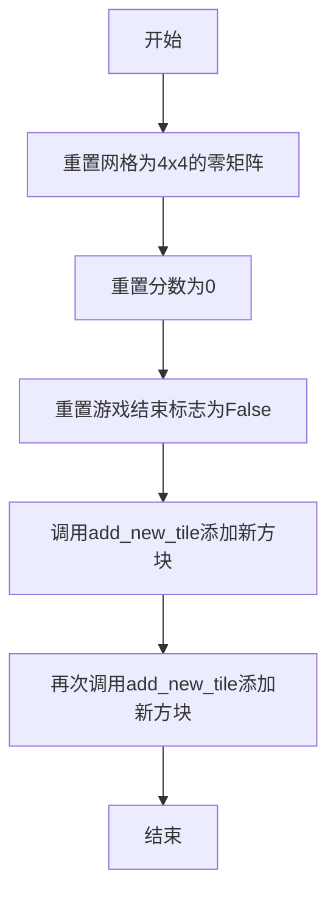
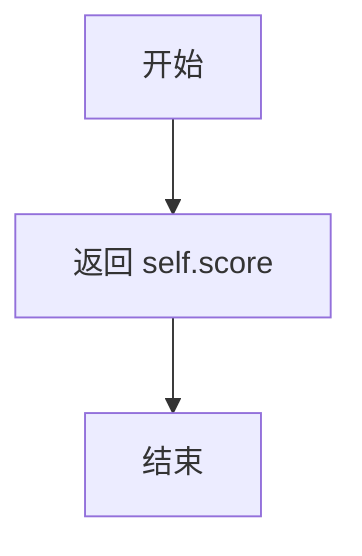

# `.\MetaGPT\tests\data\demo_project\game.py` 详细设计文档

该代码实现了一个简化版的2048游戏核心逻辑。它包含一个Game类，用于管理一个4x4的游戏网格、分数和游戏状态。主要功能包括：初始化游戏、重置游戏、在四个方向（上、下、左、右）移动方块、检查游戏是否结束、在随机空位添加新方块（2或4）以及获取当前分数。

## 整体流程

```mermaid
graph TD
    A[开始游戏] --> B[调用reset_game初始化]
    B --> C[添加两个初始方块]
    C --> D{等待玩家输入}
    D --> E[调用move(direction)]
    E --> F[执行对应方向移动逻辑]
    F --> G[检查是否有空位]
    G -- 是 --> H[在随机空位添加新方块]
    G -- 否 --> I[调用is_game_over检查]
    I -- 游戏结束 --> J[设置game_over为True]
    I -- 游戏继续 --> D
    H --> D
```

## 类结构

```
Game (游戏主类)
├── 字段: grid, score, game_over
├── 公开方法: __init__, reset_game, move, is_game_over, get_empty_cells, add_new_tile, get_score
└── 私有方法: _move_up, _move_down, _move_left, _move_right
```

## 全局变量及字段


### `Game.grid`
    
表示游戏棋盘的4x4二维数组，存储每个格子的数字（0表示空）。

类型：`List[List[int]]`
    


### `Game.score`
    
记录玩家在游戏过程中通过合并方块获得的总分数。

类型：`int`
    


### `Game.game_over`
    
表示游戏是否结束的标志，True为游戏结束，False为游戏进行中。

类型：`bool`
    
    

## 全局函数及方法


### `Game.__init__`

`Game` 类的构造函数，用于初始化一个新的 2048 游戏实例。它创建了一个空的 4x4 游戏网格，并将游戏分数初始化为 0，同时将游戏状态标记为未结束。

参数：
-  `self`：`Game`，指向当前 `Game` 类实例的引用。

返回值：`None`，构造函数不返回任何值。

#### 流程图

```mermaid
flowchart TD
    A[开始: Game.__init__] --> B[初始化 4x4 网格<br/>grid = [[0,0,0,0], ...]]
    B --> C[初始化分数 score = 0]
    C --> D[初始化游戏状态 game_over = False]
    D --> E[结束]
```

#### 带注释源码

```python
def __init__(self):
    # 初始化一个 4x4 的二维列表，所有元素为 0，代表空的游戏网格。
    self.grid: List[List[int]] = [[0 for _ in range(4)] for _ in range(4)]
    # 初始化游戏分数为 0。
    self.score: int = 0
    # 初始化游戏状态为未结束。
    self.game_over: bool = False
```


### `Game.reset_game`

该方法用于重置游戏状态，将游戏恢复到初始状态。具体操作包括：清空游戏网格（将所有格子设为0），将分数重置为0，将游戏结束标志设为False，并添加两个新的初始方块。

参数：
-  `self`：`Game`，当前游戏实例的引用

返回值：`None`，该方法不返回任何值

#### 流程图



#### 带注释源码

```
def reset_game(self):
    # 将游戏网格重置为一个4x4的零矩阵，表示所有格子为空
    self.grid = [[0 for _ in range(4)] for _ in range(4)]
    # 将玩家得分重置为0
    self.score = 0
    # 将游戏结束标志设置为False，表示游戏重新开始
    self.game_over = False
    # 在随机空位置添加一个新的方块（90%概率为2，10%概率为4）
    self.add_new_tile()
    # 再次添加一个新的方块，确保游戏开始时有两个方块
    self.add_new_tile()
```


### `Game.move`

该方法根据给定的方向字符串，调用对应的内部移动方法（上、下、左、右）来更新游戏网格。它是玩家操作的主要入口点，负责将高层指令分派到具体的底层移动逻辑。

参数：
- `direction`：`str`，表示移动方向的字符串，有效值为 `"up"`、`"down"`、`"left"`、`"right"`。

返回值：`None`，该方法不返回任何值，其作用是通过修改 `self.grid` 和 `self.score` 来改变游戏状态。

#### 流程图

```mermaid
flowchart TD
    A[开始: Game.move(direction)] --> B{direction 等于?};
    B -- "up" --> C[调用 _move_up];
    B -- "down" --> D[调用 _move_down];
    B -- "left" --> E[调用 _move_left];
    B -- "right" --> F[调用 _move_right];
    C --> G[结束];
    D --> G;
    E --> G;
    F --> G;
```

#### 带注释源码

```python
def move(self, direction: str):
    # 根据输入的方向字符串，分派到对应的内部移动方法
    if direction == "up":
        self._move_up()      # 处理向上移动的逻辑
    elif direction == "down":
        self._move_down()    # 处理向下移动的逻辑
    elif direction == "left":
        self._move_left()    # 处理向左移动的逻辑
    elif direction == "right":
        self._move_right()   # 处理向右移动的逻辑
    # 注意：该方法没有处理无效的 direction 输入，也没有在移动后添加新方块或检查游戏结束状态。
```


### `Game.is_game_over`

该方法用于判断当前游戏是否结束。游戏结束的条件是：4x4的网格中已没有空格（值为0），并且相邻的格子（上下左右）之间没有值相等的格子，即无法再进行任何有效的移动。

参数：
-  `self`：`Game`，表示当前游戏实例

返回值：`bool`，如果游戏结束则返回`True`，否则返回`False`

#### 流程图

```mermaid
flowchart TD
    A[开始] --> B[初始化 i=0]
    B --> C{i < 4?}
    C -->|是| D[初始化 j=0]
    D --> E{j < 4?}
    E -->|是| F{grid[i][j] == 0?}
    F -->|是| G[返回 False]
    E -->|否| H[i++]
    H --> C
    F -->|否| I{j < 3 且 grid[i][j] == grid[i][j+1]?}
    I -->|是| G
    I -->|否| J{i < 3 且 grid[i][j] == grid[i+1][j]?}
    J -->|是| G
    J -->|否| K[j++]
    K --> E
    C -->|否| L[返回 True]
```

#### 带注释源码

```python
def is_game_over(self) -> bool:
    # 遍历4x4网格的每一个格子
    for i in range(4):
        for j in range(4):
            # 检查当前格子是否为空（值为0）
            if self.grid[i][j] == 0:
                # 如果存在空格，游戏尚未结束
                return False
            # 检查当前格子是否与右边的格子值相等（水平方向可合并）
            if j < 3 and self.grid[i][j] == self.grid[i][j + 1]:
                # 如果存在水平相邻的相等格子，游戏尚未结束
                return False
            # 检查当前格子是否与下边的格子值相等（垂直方向可合并）
            if i < 3 and self.grid[i][j] == self.grid[i + 1][j]:
                # 如果存在垂直相邻的相等格子，游戏尚未结束
                return False
    # 如果遍历完所有格子，既没有空格，也没有相邻的相等格子，则游戏结束
    return True
```


### `Game.get_empty_cells`

该方法用于获取游戏网格中所有值为0（即空）的单元格的坐标。

参数：
- `self`：`Game`，表示当前游戏实例。

返回值：`List[Tuple[int, int]]`，返回一个列表，其中每个元素是一个包含两个整数的元组，表示空单元格的行索引和列索引。

#### 流程图

```mermaid
flowchart TD
    A[开始] --> B[初始化空列表 empty_cells]
    B --> C[外层循环 i 从 0 到 3]
    C --> D[内层循环 j 从 0 到 3]
    D --> E{判断 grid[i][j] 是否等于 0}
    E -- 是 --> F[将坐标 (i, j) 添加到 empty_cells]
    F --> D
    E -- 否 --> D
    D --> C
    C --> G[返回 empty_cells]
    G --> H[结束]
```

#### 带注释源码

```python
def get_empty_cells(self) -> List[Tuple[int, int]]:
    # 初始化一个空列表，用于存储所有空单元格的坐标
    empty_cells = []
    # 遍历网格的每一行（i 为行索引）
    for i in range(4):
        # 遍历网格的每一列（j 为列索引）
        for j in range(4):
            # 检查当前单元格的值是否为 0（即空单元格）
            if self.grid[i][j] == 0:
                # 如果是空单元格，将其坐标 (i, j) 添加到列表中
                empty_cells.append((i, j))
    # 返回包含所有空单元格坐标的列表
    return empty_cells
```


### `Game.add_new_tile`

该方法用于在游戏网格（grid）中随机选择一个空单元格，并放置一个新的方块。新方块的值有90%的概率为2，10%的概率为4。

参数：
-  `self`：`Game`，表示当前游戏实例。

返回值：`None`，该方法不返回任何值，直接修改游戏实例的`grid`属性。

#### 流程图

```mermaid
flowchart TD
    A[开始] --> B[获取所有空单元格列表]
    B --> C{列表是否为空?}
    C -- 是 --> D[结束，不添加新方块]
    C -- 否 --> E[从列表中随机选择一个单元格 (x, y)]
    E --> F[生成一个随机数 r]
    F --> G{r < 0.9?}
    G -- 是 --> H[在 (x, y) 位置放置值为 2 的方块]
    G -- 否 --> I[在 (x, y) 位置放置值为 4 的方块]
    H --> J[结束]
    I --> J
```

#### 带注释源码

```
def add_new_tile(self):
    # 1. 调用 get_empty_cells 方法，获取当前网格中所有值为0的单元格坐标列表。
    empty_cells = self.get_empty_cells()
    # 2. 检查空单元格列表是否非空。
    if empty_cells:
        # 3. 从空单元格列表中随机选择一个坐标 (x, y)。
        x, y = random.choice(empty_cells)
        # 4. 生成一个0到1之间的随机数。
        #    如果随机数小于0.9，则在选中的位置放置值为2的方块。
        #    否则（即10%的概率），放置值为4的方块。
        self.grid[x][y] = 2 if random.random() < 0.9 else 4
```


### `Game.get_score`

该方法用于获取当前游戏的累计分数。它是一个简单的访问器（getter），直接返回游戏对象的 `score` 属性值，不涉及任何计算或状态修改。

参数：
- 无

返回值：`int`，返回当前游戏的累计分数。

#### 流程图



#### 带注释源码

```python
def get_score(self) -> int:
    # 直接返回实例变量 `self.score` 的值
    return self.score
```


### `Game._move_up`

该方法处理游戏网格中所有方块向上移动的逻辑。它遍历每一列，对于每一列，从第二行开始向下检查每个非零方块，并将其尽可能地向该列的顶部移动，直到遇到非零方块或网格边界。此方法仅执行移动操作，不处理方块的合并。

参数：
-  `self`：`Game`，当前游戏实例的引用

返回值：`None`，该方法不返回任何值，直接修改游戏实例的 `grid` 属性。

#### 流程图

```mermaid
flowchart TD
    A[开始 _move_up] --> B[遍历每一列 j: 0 to 3]
    B --> C[遍历当前列每一行 i: 1 to 3]
    C --> D{当前格子 grid[i][j] != 0?}
    D -- 是 --> E[初始化 k = i]
    E --> F{k > 0 且 上方格子 grid[k-1][j] == 0?}
    F -- 是 --> G[将 grid[k][j] 的值移动到 grid[k-1][j]]
    G --> H[将 grid[k][j] 设为 0]
    H --> I[k = k - 1]
    I --> F
    F -- 否 --> C
    D -- 否 --> C
    C --> J[列遍历完成]
    J --> B
    B --> K[所有列遍历完成]
    K --> L[结束 _move_up]
```

#### 带注释源码

```python
    def _move_up(self):
        # 遍历网格的每一列
        for j in range(4):
            # 对于当前列，从第二行（索引1）开始向下检查
            for i in range(1, 4):
                # 如果当前单元格的值不为0（即有方块）
                if self.grid[i][j] != 0:
                    # 从当前行开始，向上检查，直到第一行（索引0）
                    for k in range(i, 0, -1):
                        # 如果当前方块的上一个单元格是空的（值为0）
                        if self.grid[k - 1][j] == 0:
                            # 将当前方块的值移动到上一个单元格
                            self.grid[k - 1][j] = self.grid[k][j]
                            # 将原位置清空（设为0）
                            self.grid[k][j] = 0
                        # 注意：这里没有 `else: break` 语句。
                        # 这意味着即使上方格子非空（即遇到另一个方块），
                        # 循环也会继续尝试更上方的格子，这在实际的2048游戏中是不正确的。
                        # 正确的逻辑应该是遇到非空格子就停止移动。
                        # 这是一个潜在的错误或简化实现。
```


### `Game._move_down`

该方法实现了游戏网格中所有方块向下移动的逻辑。它遍历每一列，从倒数第二行开始向上检查每个非零方块，并将其尽可能地向下方移动，直到遇到非空格子或网格底部。此方法仅处理移动，不涉及方块的合并操作。

参数：
-  `self`：`Game`，当前游戏实例的引用

返回值：`None`，此方法不返回任何值，直接修改游戏实例的网格状态。

#### 流程图

```mermaid
flowchart TD
    A[开始 _move_down] --> B[遍历每一列 j: 0 to 3]
    B --> C[遍历每一行 i: 2 to 0]
    C --> D{当前格子 grid[i][j] != 0?}
    D -- 是 --> E[初始化 k = i]
    E --> F{循环条件 k < 3?}
    F -- 是 --> G{下方格子 grid[k+1][j] == 0?}
    G -- 是 --> H[将当前格子值赋给下方格子]
    H --> I[将当前格子值置为0]
    I --> J[k = k + 1]
    J --> F
    G -- 否 --> K[跳出内层循环]
    F -- 否 --> K
    K --> C
    D -- 否 --> C
    C --> L[列遍历结束]
    L --> B
    B --> M[所有列遍历结束]
    M --> N[结束 _move_down]
```

#### 带注释源码

```
    def _move_down(self):
        # 遍历网格的每一列
        for j in range(4):
            # 从倒数第二行（索引2）开始，向上遍历到第一行（索引0）
            for i in range(2, -1, -1):
                # 如果当前单元格的值不为0（即有方块）
                if self.grid[i][j] != 0:
                    # 从当前行i开始，尝试向下移动方块，直到倒数第二行（索引2）
                    for k in range(i, 3):
                        # 检查当前方块（位置k, j）正下方（位置k+1, j）的单元格是否为空（值为0）
                        if self.grid[k + 1][j] == 0:
                            # 如果为空，则将当前方块移动到下方单元格
                            self.grid[k + 1][j] = self.grid[k][j]
                            # 将原位置清空
                            self.grid[k][j] = 0
                        else:
                            # 如果下方单元格不为空，则停止当前方块的向下移动尝试
                            break
```


### `Game._move_left`

该方法实现了游戏2048中向左移动所有非零方块的核心逻辑。它会遍历每一行，将每一行中的非零方块尽可能地向左移动，直到遇到边界或另一个非零方块。此方法仅处理移动，不处理方块合并。

参数：
-  `self`：`Game`，表示当前游戏实例的引用。

返回值：`None`，此方法不返回任何值，直接修改游戏实例的`grid`属性。

#### 流程图

```mermaid
flowchart TD
    A[开始] --> B[遍历每一行 i: 0 to 3]
    B --> C[遍历当前行每一列 j: 1 to 3]
    C --> D{grid[i][j] != 0?}
    D -- 是 --> E[初始化 k = j]
    E --> F{k > 0?}
    F -- 是 --> G{grid[i][k-1] == 0?}
    G -- 是 --> H[移动方块<br/>grid[i][k-1] = grid[i][k]]
    H --> I[清空原位置<br/>grid[i][k] = 0]
    I --> J[k = k - 1]
    J --> F
    G -- 否 --> K[结束当前方块的移动循环]
    F -- 否 --> K
    D -- 否 --> L[检查下一个方块]
    K --> L
    L --> C
    C --> M[所有列处理完毕]
    M --> B
    B --> N[所有行处理完毕]
    N --> O[结束]
```

#### 带注释源码

```python
    def _move_left(self):
        # 遍历游戏网格的每一行
        for i in range(4):
            # 从第2列（索引1）开始遍历到最后一列（索引3）
            # 因为第1列（索引0）的方块无需向左移动
            for j in range(1, 4):
                # 检查当前位置(i, j)是否有方块（值不为0）
                if self.grid[i][j] != 0:
                    # 对于有方块的格子，尝试将其向左移动
                    # 从当前位置j开始，向左遍历（k递减）
                    for k in range(j, 0, -1):
                        # 检查目标位置(i, k-1)是否为空（值为0）
                        if self.grid[i][k - 1] == 0:
                            # 如果为空，则将当前方块移动到目标位置
                            self.grid[i][k - 1] = self.grid[i][k]
                            # 将原位置清空
                            self.grid[i][k] = 0
                        else:
                            # 如果目标位置不为空（有方块），则停止向左移动当前方块
                            break
```


### `Game._move_right`

该方法实现了游戏网格中所有方块向右移动的逻辑。它遍历每一行，从右向左检查每个非零方块，并将其尽可能地向右侧的空格移动，但不进行合并操作。

参数：
-  `self`：`Game`，当前游戏实例的引用

返回值：`None`，该方法不返回任何值，直接修改游戏实例的网格状态。

#### 流程图

```mermaid
flowchart TD
    A[开始] --> B[遍历每一行 i: 0 to 3]
    B --> C[遍历当前行 j: 2 to 0]
    C --> D{grid[i][j] != 0?}
    D -- 是 --> E[遍历 k: j to 2]
    D -- 否 --> C
    E --> F{grid[i][k+1] == 0?}
    F -- 是 --> G[将 grid[i][k] 移动到 grid[i][k+1]]
    G --> H[将 grid[i][k] 置为 0]
    H --> E
    F -- 否 --> C
    E --> C
    C --> B
    B --> I[结束]
```

#### 带注释源码

```
    def _move_right(self):
        # 遍历网格的每一行
        for i in range(4):
            # 从倒数第二列开始向左遍历到第一列 (索引 2, 1, 0)
            # 因为最右侧的列（索引3）已经是目标位置，无需移动
            for j in range(2, -1, -1):
                # 如果当前单元格有方块（值不为0）
                if self.grid[i][j] != 0:
                    # 尝试将当前方块向右移动，k从当前列j开始，到倒数第二列（索引2）结束
                    for k in range(j, 3):
                        # 检查右侧相邻的单元格是否为空（值为0）
                        if self.grid[i][k + 1] == 0:
                            # 将当前方块移动到右侧的空单元格
                            self.grid[i][k + 1] = self.grid[i][k]
                            # 将原位置清空
                            self.grid[i][k] = 0
                        else:
                            # 如果右侧单元格非空，则当前方块无法继续右移，跳出内层循环
                            break
```


## 关键组件


### 游戏网格 (Game Grid)

一个4x4的二维整数列表，用于表示2048游戏的核心棋盘状态，每个单元格存储当前数字（0表示空）。

### 游戏状态管理 (Game State Management)

包含`score`（当前得分）和`game_over`（游戏结束标志）字段，用于追踪游戏的进度和状态。

### 移动逻辑 (Move Logic)

包含`_move_up`、`_move_down`、`_move_left`、`_move_right`四个私有方法，分别处理向上、向下、向左、向右移动时棋盘数字的滑动逻辑（仅滑动，不含合并）。

### 游戏初始化与重置 (Game Initialization & Reset)

`reset_game`方法负责初始化或重置游戏，包括清空网格、重置分数、设置游戏状态，并生成初始的两个数字方块。

### 新方块生成 (New Tile Generation)

`add_new_tile`方法负责在游戏网格的空单元格中随机位置生成一个新的数字方块（90%概率为2，10%概率为4）。

### 游戏结束判定 (Game Over Detection)

`is_game_over`方法通过检查网格中是否存在空单元格或相邻可合并的单元格来判断游戏是否结束。

### 空单元格获取 (Empty Cell Retrieval)

`get_empty_cells`方法遍历游戏网格，收集并返回所有空单元格的坐标列表，为新方块生成和游戏状态判断提供数据。


## 问题及建议


### 已知问题

-   **移动逻辑不完整**：`_move_up`, `_move_down`, `_move_left`, `_move_right` 方法只实现了方块的滑动，但缺少了相邻相同方块合并的核心逻辑。这导致游戏无法正确计分，也无法产生新的方块值（如 2+2=4）。
-   **游戏结束判断逻辑有缺陷**：`is_game_over` 方法在检测到有空格子或相邻可合并的格子时会立即返回 `False`，逻辑正确。但该方法仅在外部调用时生效，`move` 方法执行后没有主动调用它来更新 `self.game_over` 状态。这导致 `self.game_over` 字段可能无法反映真实的游戏状态。
-   **状态管理不一致**：`game_over` 状态由 `__init__` 和 `reset_game` 初始化，但在游戏过程中（如执行 `move` 后）没有更新机制，完全依赖外部查询 `is_game_over()`。这破坏了对象内部状态的封装性和一致性。
-   **代码重复度高**：四个方向的移动方法（`_move_up`, `_move_down`, `_move_left`, `_move_right`）结构高度相似，存在大量重复代码，违反了 DRY（Don‘t Repeat Yourself）原则，增加了维护成本和出错几率。

### 优化建议

-   **重构移动与合并逻辑**：将滑动和合并两个步骤整合到每个方向的移动方法中。例如，在 `_move_left` 中，先向左滑动所有行，再从左向右遍历合并相邻的相同值，合并后再次滑动以消除因合并产生的空格。此逻辑可抽象为通用函数，供四个方向复用。
-   **完善状态更新机制**：在 `move` 方法的末尾，应调用 `self.game_over = self.is_game_over()` 来更新内部状态。同时，在 `add_new_tile` 之前，应检查移动是否实际改变了网格（即发生了滑动或合并），只有改变了才添加新方块并检查游戏是否结束，这是 2048 的标准规则。
-   **抽象通用移动函数**：可以设计一个通用的 `_move_line` 函数，它接受一个列表（代表一行或一列），对其进行滑动和合并，然后返回处理后的列表和该行/列合并产生的分数。四个方向的移动方法可以分别负责提取和回写对应的行或列，并调用这个通用函数。这能极大减少代码重复。
-   **增加输入验证与异常处理**：`move` 方法应验证 `direction` 参数是否为预期的字符串（"up", "down", "left", "right"），对于无效输入可抛出 `ValueError` 或忽略。这能提高代码的健壮性。
-   **考虑性能优化**：当前 `is_game_over` 和 `get_empty_cells` 均使用双重循环遍历整个 4x4 网格。对于 2048 这样的小网格，这完全可接受。但作为一种优化实践，可以在每次移动后仅检查受影响的区域，或者维护一个 `empty_cells_count` 来加速空格判断。不过，对于当前规模，清晰性比微优化更重要。


## 其它


### 设计目标与约束

本代码实现了一个简化版的2048游戏核心逻辑。其核心设计目标是提供一个可独立运行、无外部依赖的游戏状态管理模块。主要约束包括：1) 使用纯Python实现，不依赖图形界面库；2) 游戏逻辑与用户界面分离，当前仅提供状态管理和操作接口；3) 网格固定为4x4大小；4) 遵循经典2048的移动、合并与生成新方块规则。

### 错误处理与异常设计

当前代码缺乏显式的错误处理机制。例如，`move`方法接收一个`direction`字符串参数，但未对无效的方向输入（如`"diagonal"`）进行验证或抛出异常，这可能导致程序静默失败或行为未定义。`add_new_tile`方法在`get_empty_cells`返回空列表时（即游戏已结束）仍会尝试调用`random.choice`，这将导致`IndexError`。建议增加输入验证和异常捕获，例如在`move`方法中检查方向是否在`["up", "down", "left", "right"]`中，并在`add_new_tile`中检查空单元格列表。

### 数据流与状态机

游戏的核心状态由`grid`（4x4整数矩阵）、`score`（整数）和`game_over`（布尔值）三个变量定义。状态转换主要由`move`方法触发：1) 用户输入方向指令；2) 调用对应的`_move_*`内部方法更新`grid`；3) （应在此处但当前缺失）检查并处理相邻相同数字的合并，并更新`score`；4) 调用`add_new_tile`在随机空位生成新数字；5) 调用`is_game_over`检查游戏是否结束并更新`game_over`状态。当前代码缺失了关键的“合并”逻辑和相应的分数计算，导致数据流不完整，游戏无法正常进行。

### 外部依赖与接口契约

本模块的外部依赖极简，仅依赖Python标准库的`random`和`typing`模块。其对外提供的接口契约主要包括：1) `Game`类：作为主要交互对象。2) `reset_game()`: 初始化或重置游戏状态。3) `move(direction: str)`: 接受方向指令并更新游戏状态。4) `get_score() -> int`: 查询当前分数。5) `is_game_over() -> bool`: 查询游戏是否结束。调用者需保证传入`move`方法的方向字符串是有效的，并理解当前实现中合并逻辑的缺失。

    