# `.\MetaGPT\tests\data\incremental_dev_project\mock.py` 详细设计文档

该文件是一个用于演示或模拟的代码文件，它包含了从需求分析（PRD）、设计文档（DESIGN）、任务分解（TASK）到旧代码示例（OLD_CODE_SAMPLE）以及一系列精炼后的需求、设计、任务和代码计划（REFINED_*）的完整数据。其核心功能是作为一个知识库或模板，展示一个简单的猜数字游戏从文本界面到图形界面（GUI）的完整重构过程，包括需求演变、设计决策、代码结构规划和具体的代码实现示例。

## 整体流程

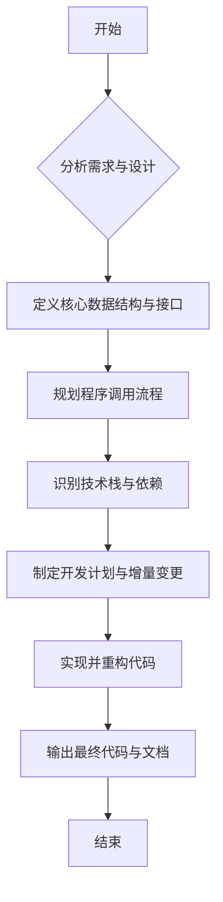

## 类结构

```
数据与文档 (非类结构)
├── 需求与设计样本 (NEW_REQUIREMENT_SAMPLE, PRD_SAMPLE, DESIGN_SAMPLE, TASK_SAMPLE)
├── 旧代码样本 (OLD_CODE_SAMPLE)
├── 精炼后的需求与设计 (REFINED_PRD_JSON, REFINED_DESIGN_JSON, REFINED_TASK_JSON)
└── 代码计划与变更 (CODE_PLAN_AND_CHANGE_SAMPLE, REFINED_CODE_SAMPLE)
```

## 全局变量及字段


### `NEW_REQUIREMENT_SAMPLE`
    
包含新需求描述的字符串，用于说明需要为猜数字游戏添加图形界面功能。

类型：`str`
    


### `PRD_SAMPLE`
    
包含产品需求文档（PRD）示例的字符串，详细描述了猜数字游戏的功能、目标、用户故事和竞争分析。

类型：`str`
    


### `DESIGN_SAMPLE`
    
包含设计文档示例的字符串，描述了实现方法、文件列表、数据结构和接口、程序调用流程等。

类型：`str`
    


### `TASK_SAMPLE`
    
包含任务分解示例的字符串，列出了所需的Python包、逻辑分析、任务列表和共享知识。

类型：`str`
    


### `OLD_CODE_SAMPLE`
    
包含旧版代码示例的字符串，展示了命令行版本的猜数字游戏实现，包括game.py、ui.py和main.py。

类型：`str`
    


### `REFINED_PRD_JSON`
    
包含精炼后的产品需求文档（PRD）的字典，针对图形界面需求更新了目标、用户故事和需求池。

类型：`dict`
    


### `REFINED_DESIGN_JSON`
    
包含精炼后的设计文档的字典，更新了实现方法、文件列表、数据结构和接口以支持图形界面。

类型：`dict`
    


### `REFINED_TASK_JSON`
    
包含精炼后的任务分解的字典，更新了所需的包、逻辑分析和任务列表以包含GUI开发。

类型：`dict`
    


### `CODE_PLAN_AND_CHANGE_SAMPLE`
    
包含代码计划和变更示例的字典，描述了开发图形界面的计划和具体的代码变更。

类型：`dict`
    


### `REFINED_CODE_INPUT_SAMPLE`
    
包含待重写的game.py代码的字符串，作为重构的输入。

类型：`str`
    


### `REFINED_CODE_SAMPLE`
    
包含重构后的game.py代码的字符串，添加了详细的注释以提高可读性。

类型：`str`
    


### `Game.secret_number`
    
存储游戏生成的秘密数字，玩家需要猜测的目标值。

类型：`int`
    


### `Game.min_range`
    
根据难度级别设置的最小猜测范围值。

类型：`int`
    


### `Game.max_range`
    
根据难度级别设置的最大猜测范围值。

类型：`int`
    


### `Game.attempts`
    
存储玩家在单次游戏会话中所有猜测历史的列表。

类型：`list[int]`
    
    

## 全局函数及方法

### `Game.__init__`

该方法用于初始化 `Game` 类的实例，根据传入的难度级别设置数字范围，并生成一个秘密数字，同时初始化用于记录玩家尝试次数的列表。

参数：

- `difficulty`：`str`，表示游戏难度级别，可选值为 'easy'、'medium'、'hard'，默认为 'medium'。

返回值：`None`，无返回值。

#### 流程图

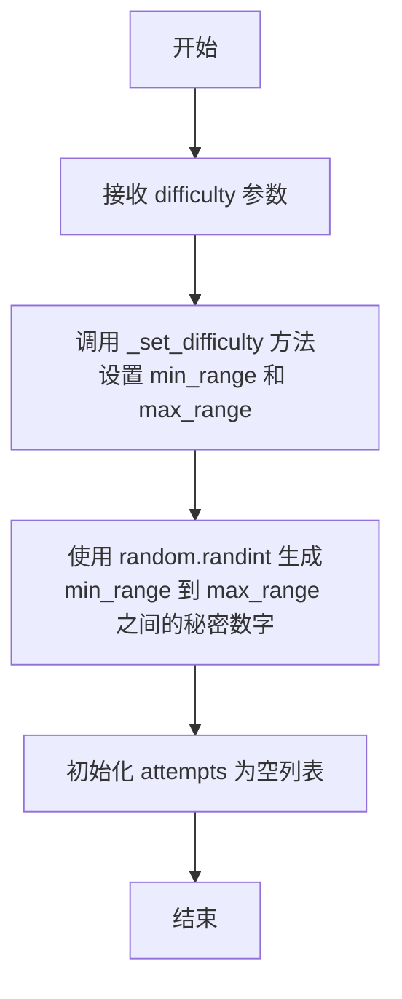

#### 带注释源码

```python
def __init__(self, difficulty: str = 'medium'):
    # 根据传入的难度级别设置数字范围
    self.min_range, self.max_range = self._set_difficulty(difficulty)
    # 在设定的范围内随机生成一个秘密数字
    self.secret_number = random.randint(self.min_range, self.max_range)
    # 初始化一个空列表，用于记录玩家的每次猜测
    self.attempts = []
```

### `Game._set_difficulty`

该方法根据传入的难度字符串，返回对应的数字范围元组，用于设置游戏的数字猜测范围。

参数：
- `difficulty`：`str`，表示游戏难度的字符串，可选值为 'easy'、'medium'、'hard'。

返回值：`tuple`，返回一个包含两个整数的元组 `(min_range, max_range)`，分别表示猜测范围的最小值和最大值。

#### 流程图

```mermaid
flowchart TD
    A[开始] --> B{检查difficulty参数}
    B -->|difficulty为'easy'| C[返回 (1, 10)]
    B -->|difficulty为'medium'| D[返回 (1, 100)]
    B -->|difficulty为'hard'| E[返回 (1, 1000)]
    B -->|difficulty为其他值| F[返回默认值 (1, 100)]
    C --> G[结束]
    D --> G
    E --> G
    F --> G
```

#### 带注释源码

```python
def _set_difficulty(self, difficulty: str):
    # 定义不同难度级别对应的数字范围字典
    difficulties = {
        'easy': (1, 10),    # 简单难度：数字范围1到10
        'medium': (1, 100), # 中等难度：数字范围1到100
        'hard': (1, 1000)   # 困难难度：数字范围1到1000
    }
    # 根据传入的难度字符串从字典中获取对应的范围
    # 如果找不到对应的难度，则返回默认的中等难度范围(1, 100)
    return difficulties.get(difficulty, (1, 100))
```

### `Game.start_game`

该方法用于开始或重置一个新的游戏会话。它会根据当前设置的难度范围生成一个新的秘密数字，并清空之前的猜测记录，为新一轮的游戏做好准备。

参数：无

返回值：`None`，无返回值

#### 流程图

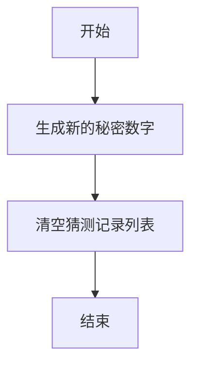

#### 带注释源码

```python
    def start_game(self):
        # 根据当前设定的最小和最大范围，生成一个新的随机秘密数字
        self.secret_number = random.randint(self.min_range, self.max_range)
        # 清空用于记录玩家所有猜测的列表，为新游戏做准备
        self.attempts.clear()
```

### `Game.check_guess`

该方法用于检查玩家猜测的数字与游戏秘密数字的关系，并返回相应的提示信息。同时，它会记录每次猜测的尝试。

参数：

- `guess`：`int`，玩家猜测的数字。

返回值：`str`，根据猜测结果返回提示信息："It's higher."（猜测过低）、"It's lower."（猜测过高）或"Correct! Game over."（猜测正确）。

#### 流程图

```mermaid
graph TD
    A[开始: check_guess(guess)] --> B[将guess添加到attempts列表]
    B --> C{guess < secret_number?}
    C -- 是 --> D[返回"It's higher."]
    C -- 否 --> E{guess > secret_number?}
    E -- 是 --> F[返回"It's lower."]
    E -- 否 --> G[返回"Correct! Game over."]
    D --> H[结束]
    F --> H
    G --> H
```

#### 带注释源码

```python
def check_guess(self, guess: int) -> str:
    # 将本次猜测记录到尝试列表中
    self.attempts.append(guess)
    # 判断猜测数字与秘密数字的关系
    if guess < self.secret_number:
        # 猜测过低，提示玩家数字更高
        return "It's higher."
    elif guess > self.secret_number:
        # 猜测过高，提示玩家数字更低
        return "It's lower."
    else:
        # 猜测正确，游戏结束
        return "Correct! Game over."
```

### `Game.get_attempts`

该方法用于获取当前游戏会话中玩家尝试猜测的次数。

参数：无

返回值：`int`，返回玩家到目前为止尝试猜测的次数，即 `self.attempts` 列表的长度。

#### 流程图

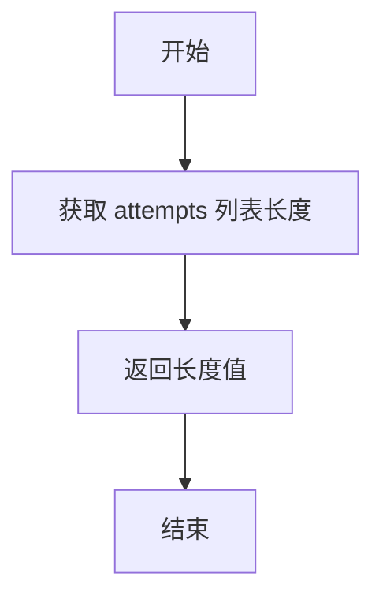

#### 带注释源码

```python
def get_attempts(self) -> int:
    # 返回 attempts 列表的长度，即玩家尝试的次数
    return len(self.attempts)
```

### `Game.get_history`

该方法用于获取当前游戏会话中玩家所有猜测的历史记录。它返回一个包含所有已尝试猜测的列表，按猜测顺序排列。

参数：
- 无参数

返回值：`list`，返回一个整数列表，表示玩家在当前游戏会话中所有已尝试的猜测。

#### 流程图

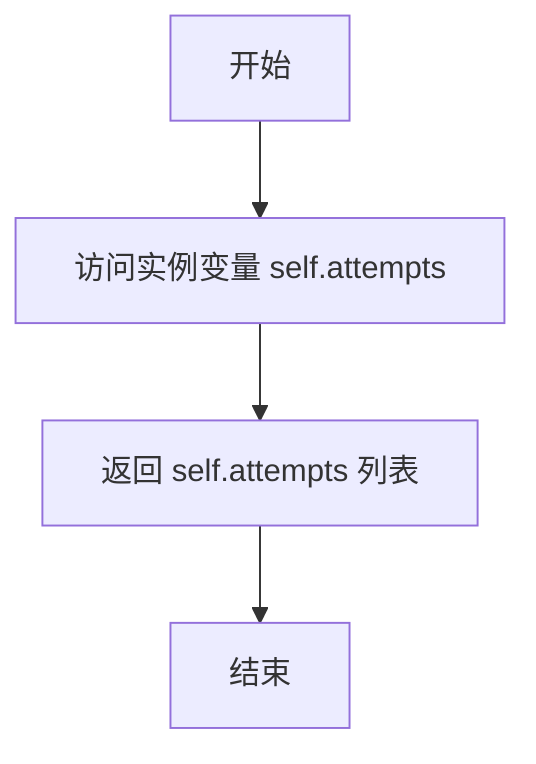

#### 带注释源码

```python
def get_history(self) -> list:
    # 返回存储玩家所有猜测的 attempts 列表
    return self.attempts
```

### `UI.start`

该方法启动数字猜谜游戏的用户界面。它首先让用户选择难度级别，然后初始化游戏实例并开始游戏循环。在游戏循环中，它持续获取用户的猜测输入，验证输入的有效性，并将猜测传递给游戏逻辑进行检查。根据游戏逻辑返回的反馈，它会显示相应的消息、当前尝试次数以及猜测历史。当用户猜中数字（反馈为"Correct! Game over."）时，循环结束，游戏会话完成。

参数：
- 无

返回值：`None`，无返回值

#### 流程图

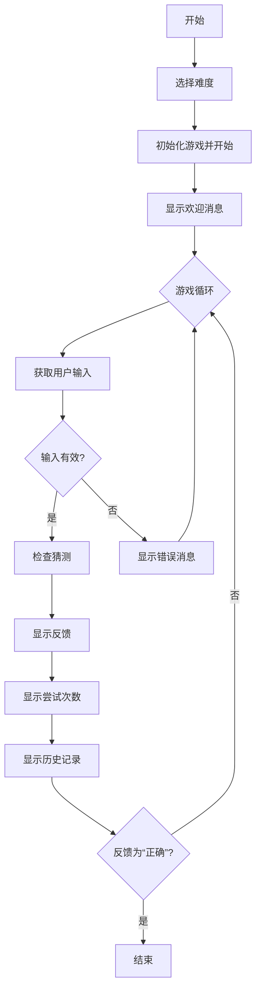

#### 带注释源码

```python
def start(self):
    # 选择游戏难度
    difficulty = self.select_difficulty()
    # 根据难度初始化游戏实例
    game = Game(difficulty)
    # 开始新游戏，重置秘密数字和尝试记录
    game.start_game()
    # 显示欢迎消息，告知用户数字范围
    self.display_welcome_message(game)

    # 初始化反馈字符串
    feedback = ""
    # 游戏主循环：持续进行直到用户猜中数字
    while feedback != "Correct! Game over.":
        # 提示用户输入猜测
        guess = self.get_user_input("Enter your guess: ")
        # 验证输入是否为有效数字
        if self.is_valid_guess(guess):
            # 将有效猜测传递给游戏逻辑并获取反馈
            feedback = game.check_guess(int(guess))
            # 向用户显示反馈信息
            self.display_message(feedback)
            # 显示当前尝试次数
            self.show_attempts(game.get_attempts())
            # 显示猜测历史记录
            self.show_history(game.get_history())
        else:
            # 如果输入无效，提示用户重新输入
            self.display_message("Please enter a valid number.")
```

### `UI.display_welcome_message`

该方法用于在游戏开始时向玩家显示欢迎信息，包括游戏名称和当前难度下的数字范围。

参数：
- `game`：`Game` 类型，表示当前游戏实例，用于获取难度设置的数字范围。

返回值：`None`，该方法不返回任何值，仅执行打印操作。

#### 流程图

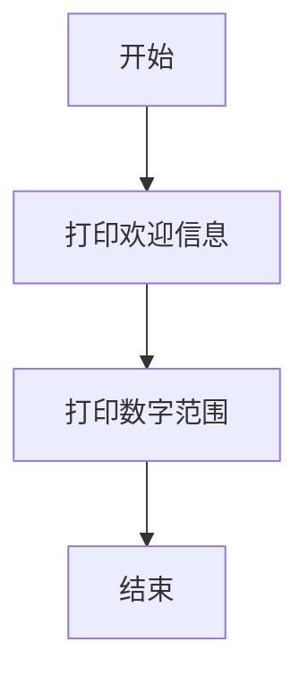

#### 带注释源码

```python
def display_welcome_message(self, game):
    # 打印欢迎信息
    print("Welcome to the Number Guessing Game!")
    # 打印当前难度下的数字范围
    print(f"Guess the number between {game.min_range} and {game.max_range}.")
```

### `UI.is_valid_guess`

该方法用于验证用户输入的猜测值是否为有效的数字字符串。它检查输入的字符串是否全部由数字字符组成，以确保可以安全地转换为整数进行后续的游戏逻辑处理。

参数：

- `guess`：`str`，用户输入的猜测值字符串。

返回值：`bool`，如果输入字符串全部由数字字符组成则返回 `True`，否则返回 `False`。

#### 流程图

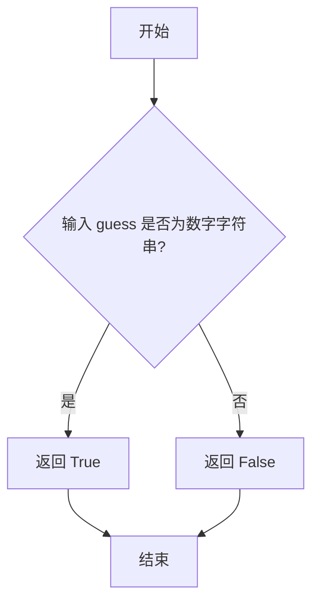

#### 带注释源码

```python
def is_valid_guess(self, guess):
    # 使用字符串的 isdigit 方法检查 guess 是否全部由数字字符组成
    # 如果是，则返回 True，表示是有效的猜测值
    # 如果不是，则返回 False，表示是无效的猜测值
    return guess.isdigit()
```

### `UI.display_message`

该方法用于在用户界面中显示一条消息。在当前的命令行界面版本中，它通过 `print` 函数将消息输出到控制台。在未来的图形用户界面（GUI）版本中，此方法将被重构，以将消息传递给 GUI 组件进行可视化展示。

参数：

- `message`：`str`，需要显示给用户的文本信息。

返回值：`None`，此方法不返回任何值。

#### 流程图

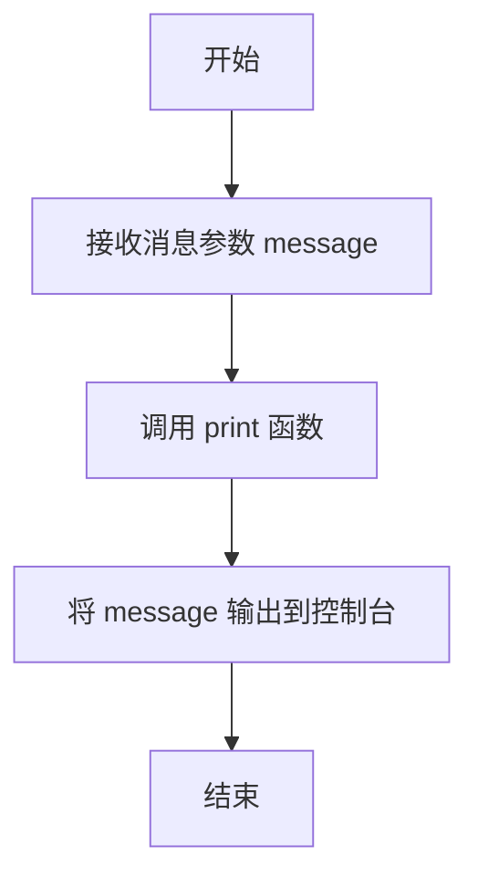

#### 带注释源码

```python
def display_message(self, message: str):
    # 在命令行界面中，直接使用 print 函数输出消息
    print(message)
```

### `UI.get_user_input`

该方法用于从用户获取输入，通过命令行提示用户输入猜测的数字。

参数：

- `prompt`：`str`，提示用户输入的字符串

返回值：`str`，用户输入的字符串

#### 流程图

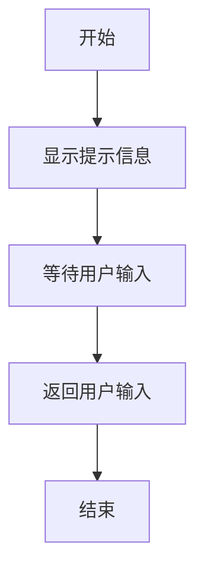

#### 带注释源码

```python
def get_user_input(self, prompt: str) -> str:
    # 使用内置的input函数获取用户输入
    # prompt参数用于显示提示信息
    return input(prompt)
```

### `UI.show_attempts`

该方法用于在用户界面中显示当前游戏尝试的次数。它接收一个整数参数，表示尝试次数，并将其以友好的格式输出给用户。

参数：

- `attempts`：`int`，表示玩家到目前为止尝试猜测的次数。

返回值：`None`，该方法不返回任何值，仅执行显示操作。

#### 流程图

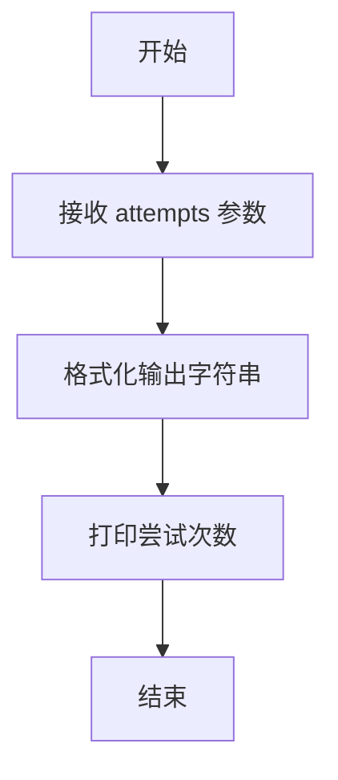

#### 带注释源码

```python
def show_attempts(self, attempts: int):
    # 打印当前尝试次数，格式为 "Number of attempts: {attempts}"
    print(f"Number of attempts: {attempts}")
```

### `UI.show_history`

该方法用于在命令行界面中显示玩家在当前游戏会话中的猜测历史。它接收一个包含历史猜测的列表，并逐行打印出来，以帮助玩家回顾之前的猜测并制定下一步策略。

参数：

- `history`：`list`，包含玩家在当前游戏会话中所有猜测的列表。

返回值：`None`，该方法不返回任何值，仅执行打印操作。

#### 流程图

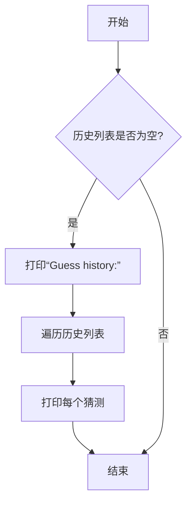

#### 带注释源码

```python
def show_history(self, history: list):
    # 打印历史记录的标题
    print("Guess history:")
    # 遍历历史列表中的每个猜测
    for guess in history:
        # 打印每个猜测
        print(guess)
```

### `UI.select_difficulty`

该方法用于在命令行界面中提示用户选择游戏难度，并验证输入的有效性。它通过循环提示用户输入，直到用户输入一个有效的难度级别（'easy'、'medium' 或 'hard'）为止。

参数：
-  `self`：`UI`，UI类的实例，用于调用类内部的其他方法。

返回值：`str`，返回用户选择的难度字符串（'easy'、'medium' 或 'hard'）。

#### 流程图

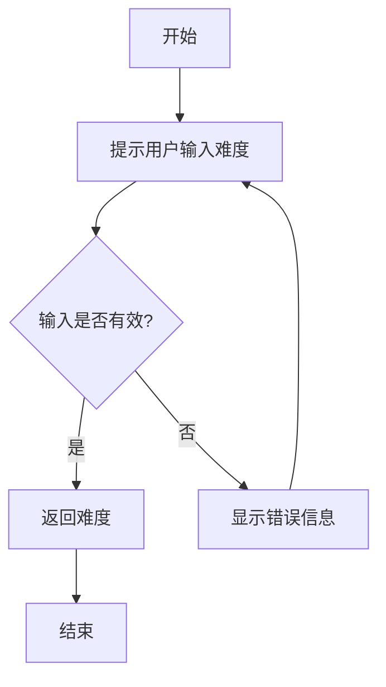

#### 带注释源码

```python
def select_difficulty(self) -> str:
    # 进入一个无限循环，直到用户输入有效的难度级别
    while True:
        # 提示用户输入难度，并将输入转换为小写以统一处理
        difficulty = input("Select difficulty (easy, medium, hard): ").lower()
        # 检查输入是否在预定义的难度列表中
        if difficulty in ['easy', 'medium', 'hard']:
            # 如果有效，返回用户选择的难度
            return difficulty
        else:
            # 如果无效，显示错误信息并继续循环
            self.display_message("Invalid difficulty. Please choose 'easy', 'medium', or 'hard'.")
```

### `Main.main`

`Main.main` 方法是整个数字猜谜游戏的入口点。它负责初始化用户界面（UI）并启动游戏的主循环。在重构后的版本中，该方法被设计为初始化图形用户界面（GUI），设置窗口，绑定事件，并启动 Tkinter 的主事件循环，从而将游戏从命令行界面迁移到图形界面。

参数：
- 无

返回值：`None`，该方法不返回任何值。

#### 流程图

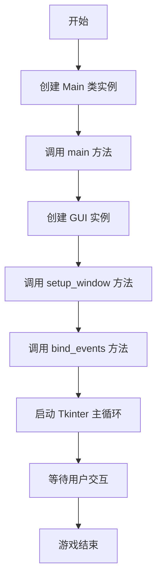

#### 带注释源码

```python
class Main:
    def main(self):
        # 创建图形用户界面实例
        graphical_user_interface = GUI()
        # 设置GUI窗口，包括布局和组件
        graphical_user_interface.setup_window()
        # 绑定事件，如按钮点击和输入处理
        graphical_user_interface.bind_events()
        # 启动Tkinter的主事件循环，等待用户交互
        # 注意：在实际代码中，这里会调用Tkinter的mainloop方法
        # 例如：graphical_user_interface.root.mainloop()
        pass

if __name__ == "__main__":
    # 创建Main类的实例
    main_instance = Main()
    # 调用main方法启动游戏
    main_instance.main()
```

### `GUI.__init__`

该方法用于初始化图形用户界面（GUI）类，设置主窗口、布局和事件绑定，为游戏提供用户友好的交互界面。

参数：

- `self`：`GUI`，表示GUI类的实例
- 无其他参数

返回值：`None`，无返回值

#### 流程图

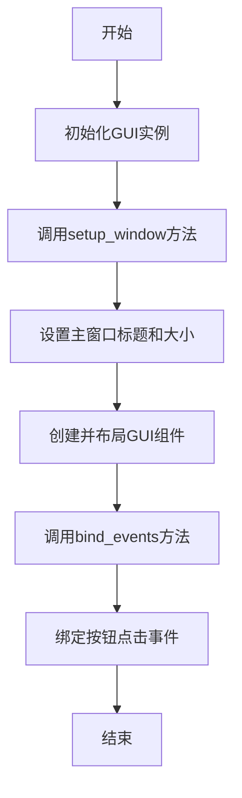

#### 带注释源码

```python
def __init__(self):
    """
    初始化GUI类，设置主窗口和事件绑定。
    """
    # 设置主窗口
    self.setup_window()
    # 绑定事件
    self.bind_events()
```

### `GUI.setup_window`

该方法用于初始化并配置图形用户界面的主窗口。它负责创建Tkinter根窗口，设置窗口标题、尺寸、位置等基本属性，并调用其他方法来创建和布局窗口内的各种UI组件（如标签、输入框、按钮等）。这是GUI启动过程中的核心步骤，为后续的用户交互和事件处理奠定了基础。

参数：
-  `self`：`GUI`，GUI类的实例，用于访问实例属性和方法。

返回值：`None`，此方法不返回任何值，其作用是配置窗口。

#### 流程图

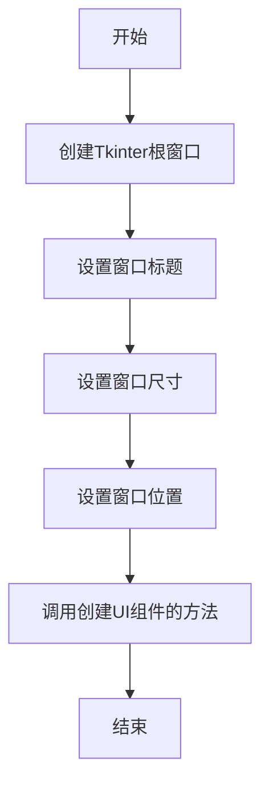

#### 带注释源码

```python
def setup_window(self):
    """
    初始化并配置图形用户界面的主窗口。
    此方法创建Tkinter根窗口，设置其基本属性（如标题、尺寸、位置），
    并负责调用其他方法来创建和布局窗口内的UI组件。
    """
    # 创建Tkinter根窗口实例
    self.root = tk.Tk()
    # 设置窗口标题
    self.root.title("Number Guessing Game")
    # 设置窗口的初始尺寸（宽x高）
    self.root.geometry("400x500")
    # 设置窗口在屏幕中央显示
    self.root.eval('tk::PlaceWindow . center')
    # 调用方法以创建和布局窗口内的具体UI组件（如标签、输入框、按钮等）
    self.create_widgets()
```

### `GUI.bind_events`

该方法用于将图形用户界面（GUI）中的事件（如按钮点击、键盘输入等）与相应的处理函数进行绑定，确保用户交互能够触发正确的游戏逻辑和界面更新。

参数：

- `self`：`GUI`，表示当前GUI类的实例，用于访问和操作GUI的属性和方法。

返回值：`None`，该方法不返回任何值，仅执行事件绑定操作。

#### 流程图

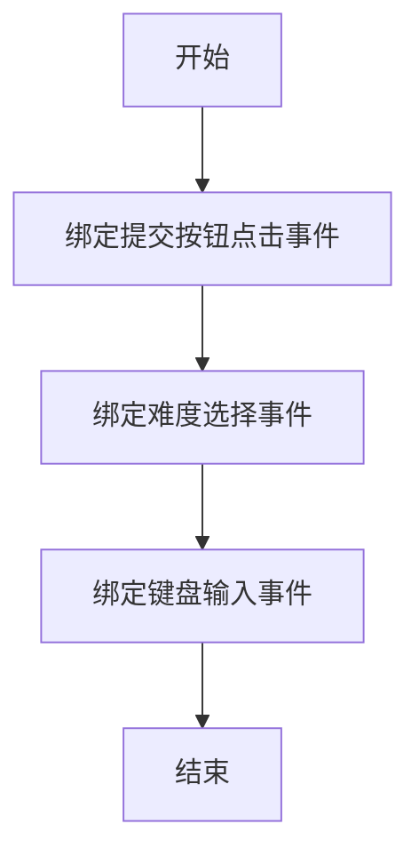

#### 带注释源码

```python
def bind_events(self):
    """
    绑定GUI中的事件到相应的处理函数。
    包括提交按钮的点击事件、难度选择事件和键盘输入事件。
    """
    # 绑定提交按钮的点击事件到处理函数
    self.submit_button.bind("<Button-1>", self.on_submit_click)

    # 绑定难度选择下拉菜单的事件到处理函数
    self.difficulty_selector.bind("<<ComboboxSelected>>", self.on_difficulty_selected)

    # 绑定键盘输入事件，允许用户按回车键提交猜测
    self.guess_entry.bind("<Return>", self.on_submit_click)
```

### `GUI.update_feedback`

该方法用于更新图形用户界面中的反馈信息，将游戏逻辑返回的提示信息（如“猜高了”、“猜低了”或“猜对了”）显示在界面上，为用户提供即时、直观的反馈。

参数：
- `message`：`str`，需要显示给用户的反馈信息字符串。

返回值：`None`，此方法不返回任何值，其作用在于更新GUI组件的状态。

#### 流程图

```mermaid
flowchart TD
    A[开始: update_feedback(message)] --> B{检查message是否为空或None?}
    B -- 是 --> C[将反馈标签文本设置为默认提示<br>如“请输入一个数字”]
    B -- 否 --> D[将反馈标签文本设置为传入的message]
    C --> E[结束]
    D --> E
```

#### 带注释源码

```python
def update_feedback(self, message: str):
    """
    更新图形界面上的反馈信息标签。
    
    该方法接收来自游戏逻辑的反馈字符串，并将其显示在GUI的指定标签上。
    如果传入的消息为空或None，则显示一个默认的提示信息。
    
    参数:
        message (str): 要显示的反馈信息。
    """
    # 检查传入的消息是否有效
    if not message:
        # 如果消息无效，则设置一个默认的提示文本
        self.feedback_label.config(text="请输入一个有效的数字。")
    else:
        # 如果消息有效，则更新反馈标签的文本内容
        self.feedback_label.config(text=message)
    # 强制Tkinter立即更新界面，确保用户能立即看到反馈
    self.root.update_idletasks()
```

### `GUI.update_attempts`

该方法用于更新图形用户界面（GUI）中显示玩家尝试次数的组件。它接收当前的尝试次数，并将其更新到界面上相应的标签或文本区域，以实时反馈玩家的游戏进度。

参数：

- `attempts`：`int`，表示玩家到目前为止的尝试次数。

返回值：`None`，该方法不返回任何值，仅更新界面组件。

#### 流程图

```mermaid
flowchart TD
    A[开始] --> B[接收尝试次数 attempts]
    B --> C[更新界面上的尝试次数显示]
    C --> D[结束]
```

#### 带注释源码

```python
def update_attempts(self, attempts: int):
    """
    更新图形用户界面中显示的尝试次数。

    参数:
        attempts (int): 玩家到目前为止的尝试次数。

    返回值:
        None: 该方法不返回任何值，仅更新界面组件。
    """
    # 更新界面上的尝试次数显示
    # 例如，更新一个标签或文本区域的内容
    self.attempts_label.config(text=f"尝试次数: {attempts}")
```

### `GUI.update_history`

该方法用于更新图形用户界面中的猜测历史显示区域。它接收一个包含玩家所有猜测的列表，并将其以可视化的方式（例如列表或表格）展示在GUI的特定组件上，以便玩家能够回顾之前的猜测并制定策略。

参数：

- `history`：`list`，包含玩家在当前游戏会话中所有猜测的整数列表。

返回值：`None`，此方法不返回任何值，仅更新界面组件。

#### 流程图

```mermaid
flowchart TD
    A[开始: update_history(history)] --> B{历史列表是否为空?}
    B -- 是 --> C[清空历史显示区域]
    B -- 否 --> D[遍历历史列表]
    D --> E[将每个猜测转换为字符串]
    E --> F[将字符串添加到历史显示组件]
    C --> G[结束]
    F --> G
```

#### 带注释源码

```python
def update_history(self, history: list):
    """
    更新图形用户界面中的猜测历史显示。
    
    此方法接收一个历史猜测列表，并将其内容更新到GUI的历史显示区域。
    如果历史列表为空，则清空显示区域。
    
    参数:
        history (list): 包含玩家所有猜测的整数列表。
    """
    # 清空当前历史显示区域，为更新做准备
    self.history_display.delete(0, tk.END)
    
    # 遍历历史列表，将每个猜测添加到显示区域
    for guess in history:
        # 将整数猜测转换为字符串，并添加到列表框中
        self.history_display.insert(tk.END, str(guess))
```

### `GUI.show_difficulty_selector`

该方法用于在图形用户界面中显示一个难度选择器，允许用户通过点击按钮来选择游戏的难度级别。它创建并布局三个按钮，分别对应“简单”、“中等”和“困难”难度，并将每个按钮的点击事件绑定到设置相应难度的回调函数。

参数：
- `self`：`GUI`，指向当前GUI实例的引用，用于访问和操作GUI的属性和方法。

返回值：`None`，此方法不返回任何值，其主要作用是更新GUI界面。

#### 流程图

```mermaid
flowchart TD
    A[开始 show_difficulty_selector] --> B[创建“简单”难度按钮]
    B --> C[创建“中等”难度按钮]
    C --> D[创建“困难”难度按钮]
    D --> E[将按钮添加到GUI布局]
    E --> F[为每个按钮绑定点击事件<br/>调用 set_difficulty 方法]
    F --> G[结束]
```

#### 带注释源码

```python
def show_difficulty_selector(self):
    """
    在GUI中显示难度选择按钮。
    创建三个按钮，分别对应“简单”、“中等”和“困难”难度。
    每个按钮被点击时，会调用 set_difficulty 方法并传入相应的难度字符串。
    """
    # 创建“简单”难度按钮，并绑定点击事件到设置“easy”难度
    easy_button = tk.Button(self.window, text="Easy", command=lambda: self.set_difficulty('easy'))
    easy_button.pack()

    # 创建“中等”难度按钮，并绑定点击事件到设置“medium”难度
    medium_button = tk.Button(self.window, text="Medium", command=lambda: self.set_difficulty('medium'))
    medium_button.pack()

    # 创建“困难”难度按钮，并绑定点击事件到设置“hard”难度
    hard_button = tk.Button(self.window, text="Hard", command=lambda: self.set_difficulty('hard'))
    hard_button.pack()
```

### `GUI.animate_guess_result`

该方法用于根据猜测结果（正确或错误）触发一个简单的视觉动画，以增强用户反馈体验。动画通过改变标签的背景颜色和文本颜色来实现，为用户提供即时的、直观的反馈。

参数：

- `correct`：`bool`，表示用户的猜测是否正确。`True` 表示猜测正确，`False` 表示猜测错误。

返回值：`None`，此方法不返回任何值，仅执行动画效果。

#### 流程图

```mermaid
flowchart TD
    A[开始: animate_guess_result] --> B{参数 correct 是否为 True?}
    B -->|是| C[设置反馈标签背景色为绿色<br>设置反馈标签文字颜色为白色]
    B -->|否| D[设置反馈标签背景色为红色<br>设置反馈标签文字颜色为白色]
    C --> E[使用 after 方法<br>在 500 毫秒后恢复标签原始样式]
    D --> E
    E --> F[结束]
```

#### 带注释源码

```python
def animate_guess_result(self, correct: bool):
    """
    根据猜测结果（正确/错误）触发一个简单的颜色变化动画。
    
    参数:
        correct (bool): 如果猜测正确则为 True，否则为 False。
    """
    # 根据猜测结果决定动画颜色
    if correct:
        # 猜测正确时，将反馈标签背景设置为绿色，文字设置为白色
        self.feedback_label.config(bg="green", fg="white")
    else:
        # 猜测错误时，将反馈标签背景设置为红色，文字设置为白色
        self.feedback_label.config(bg="red", fg="white")
    
    # 使用 Tkinter 的 `after` 方法，在 500 毫秒后恢复标签的原始样式
    # 这创建了一个短暂的视觉反馈效果
    self.feedback_label.after(500, lambda: self.feedback_label.config(bg="SystemButtonFace", fg="black"))
```

## 关键组件

### 核心游戏逻辑组件 (Game)

负责生成随机秘密数字、管理游戏状态（如难度范围、尝试次数、历史记录）、验证玩家猜测并提供反馈。它是整个应用程序的业务逻辑核心。

### 用户界面抽象层 (UI)

作为游戏逻辑与具体用户界面（无论是命令行还是图形界面）之间的桥梁。它定义了与用户交互的通用接口（如显示消息、获取输入、展示游戏状态），使得底层游戏逻辑可以独立于具体的界面实现。

### 图形用户界面组件 (GUI)

使用 Tkinter 库实现的具体图形界面。它负责创建窗口、管理控件（如输入框、按钮、标签）、处理用户事件（如点击、输入），并将用户操作转换为对 UI 抽象层和 Game 逻辑层的调用，同时提供视觉反馈和动画。

### 应用程序入口点 (Main)

程序的启动入口。负责初始化用户界面（UI）并启动主事件循环或游戏会话，协调整个应用程序的启动流程。

## 问题及建议

### 已知问题

1.  **架构耦合度高**：`UI` 类与 `Game` 类直接耦合，且 `UI` 类同时负责命令行交互逻辑和游戏流程控制（如 `start` 方法中的主循环）。这使得将命令行界面（CLI）替换为图形界面（GUI）时，需要大量重构 `UI` 类，违反了单一职责原则。
2.  **缺乏抽象接口**：用户界面（`UI`）与游戏逻辑（`Game`）之间没有定义清晰的接口契约。`UI` 类直接调用 `Game` 类的具体方法，导致两者紧密绑定，难以独立替换或扩展（例如，从 CLI 切换到 GUI）。
3.  **输入验证不完整**：`UI.is_valid_guess` 方法仅检查输入是否为数字，但未验证数字是否在当前的难度范围（`min_range` 到 `max_range`）内。这可能导致游戏逻辑接收到无效的猜测值。
4.  **状态管理分散**：游戏状态（如秘密数字、尝试次数、历史记录）由 `Game` 类管理，但游戏流程（如循环直到猜中）却由 `UI.start` 方法控制。这种分离不够清晰，`UI` 类承担了部分游戏控制器的职责。
5.  **错误处理不足**：代码中缺乏对潜在异常（如输入转换错误、随机数生成错误）的捕获和处理，可能导致程序意外崩溃。
6.  **可测试性差**：由于 `UI` 类严重依赖控制台输入/输出（`input`/`print`）和 `Game` 类的具体实现，对其进行单元测试较为困难，需要大量模拟（mocking）。
7.  **国际化/本地化支持缺失**：所有用户交互字符串（如提示信息、反馈）都硬编码在代码中，且为英文。若需支持多语言，修改工作量大。

### 优化建议

1.  **引入抽象层与依赖注入**：
    *   创建一个抽象的 `GameInterface` 或 `View` 接口，定义显示消息、获取输入、更新状态等方法。
    *   让 `CLI`（原 `UI` 类）和新的 `GUI` 类都实现此接口。
    *   修改 `Game` 类或创建一个新的 `GameController` 类，它依赖于 `GameInterface` 抽象，而非具体的 `UI` 类。通过依赖注入（如构造函数注入）来提供具体的界面实现。这样，切换界面只需更换注入的实现，核心游戏逻辑无需改动。

2.  **重构职责分离**：
    *   将游戏流程控制逻辑从 `UI` 类中剥离出来。可以创建一个 `GameSession` 或 `GameController` 类，专门负责协调 `Game`（逻辑）和 `View`（界面）之间的交互，管理游戏主循环。
    *   让 `UI`/`CLI` 类只专注于命令行下的输入/输出渲染和捕获。

3.  **增强输入验证**：
    *   在 `UI` 类或 `Game` 类中，增加对猜测数字是否在有效范围内的验证。例如，在 `check_guess` 之前或 `is_valid_guess` 中加入范围检查，并提供更明确的错误提示。

4.  **改进错误处理**：
    *   在 `get_user_input`、`check_guess` 及可能发生异常的地方添加 `try-except` 块，优雅地处理无效输入（如非数字字符）和其他运行时错误，确保程序健壮性。

5.  **提升可测试性**：
    *   通过上述的接口抽象和依赖注入，可以轻松地为 `Game` 逻辑和 `GameController` 编写单元测试，使用模拟的 `View` 进行验证。
    *   将 `input`/`print` 调用封装在方法内，便于在测试中模拟。

6.  **考虑配置化与国际化**：
    *   将游戏配置（如难度对应的数字范围）和所有用户可见的字符串提取到配置文件（如 JSON、YAML）或资源文件中。
    *   为未来支持多语言预留结构，例如使用键值对引用字符串。

7.  **代码质量与维护性**：
    *   为关键方法添加更详细的文档字符串（Docstrings），说明其作用、参数、返回值和可能抛出的异常。
    *   考虑使用类型注解的更多特性（如 `TypedDict`, `Literal` 用于难度值），使代码意图更清晰。
    *   在 `Game` 类中，`start_game` 方法重置 `attempts` 时，使用 `self.attempts.clear()` 比 `self.attempts = []` 在语义上更清晰，表明是清空现有列表。

## 其它

### 设计目标与约束

本项目的核心设计目标是将一个基于命令行的数字猜谜游戏升级为具有图形用户界面的版本，以提升用户体验和视觉吸引力。主要约束包括：必须使用Python语言，优先使用标准库（如Tkinter）以简化部署，保持核心游戏逻辑的独立性和可测试性，并确保新GUI界面直观、响应迅速且易于未来扩展。

### 错误处理与异常设计

系统采用分层错误处理策略。在游戏逻辑层（`game.py`），通过类型提示和输入验证确保方法接收正确类型的数据。在用户界面层（`ui.py` 和 `gui.py`），对用户输入进行有效性检查（如非数字输入、超出范围的数字），并通过图形化方式（如弹出警告、标签变色）向用户提供清晰的错误反馈，避免程序崩溃。异常主要捕获在UI事件循环中，确保单次操作失败不影响整体应用运行。

### 数据流与状态机

应用遵循事件驱动的MVC（模型-视图-控制器）简化模式。数据流始于用户通过GUI（视图）发起动作（如点击提交按钮），控制器（`UI`类）接收事件，调用模型（`Game`类）的`check_guess`等方法更新游戏状态（如秘密数字、尝试记录）。模型的状态变更通过回调或观察者模式通知视图，触发界面更新（如显示反馈、更新尝试次数）。游戏核心状态（进行中/已结束）由`Game`类的内部变量控制，并通过`check_guess`的返回值驱动UI流程。

### 外部依赖与接口契约

1.  **Python标准库**：核心依赖为`random`（用于生成随机数）和`tkinter`（用于构建GUI）。版本约束为`random==2.2.1`和`Tkinter==8.6`。
2.  **模块间接口契约**：
    *   `Game`类为`UI`类提供稳定的API，包括`check_guess(guess: int) -> str`、`get_attempts() -> int`等，不涉及任何GUI细节。
    *   `UI`类作为协调者，依赖`Game`进行逻辑判断，并调用`GUI`类的方法（如`update_feedback`）进行展示。`UI`与`GUI`之间的接口需明确消息格式和更新时机。
    *   `GUI`类（使用Tkinter）负责所有渲染和事件捕获，并通过定义好的方法（如`update_history(history: list)`）接收来自`UI`的更新指令。
3.  **无第三方网络或数据库依赖**，所有数据在单次会话内存中处理。
    