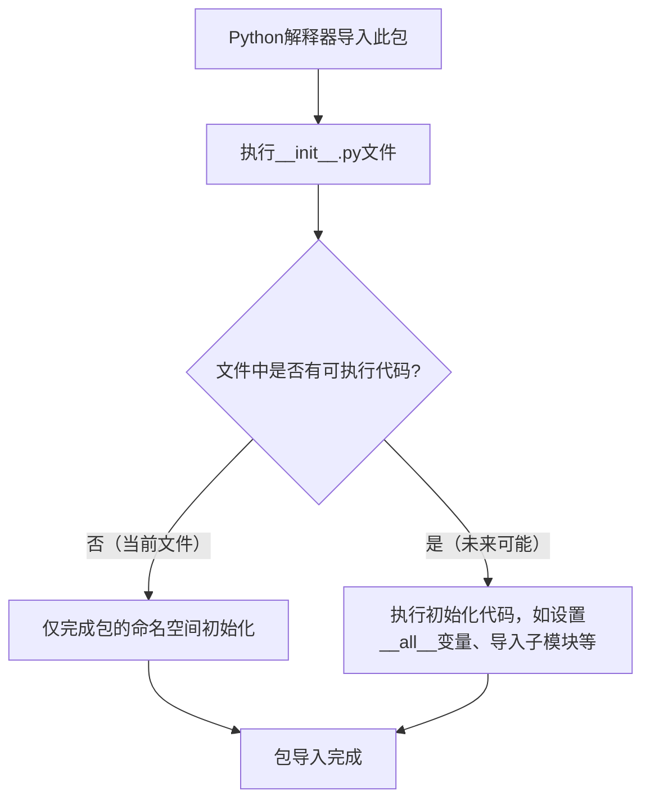

# `.\MetaGPT\tests\metagpt\__init__.py` 详细设计文档

该文件是一个Python包的初始化文件（__init__.py），其主要功能是定义包的公共接口、执行包的初始化代码以及控制包的导入行为。从提供的代码片段来看，它仅包含标准的文件头部注释（如作者、时间、文件名），没有定义任何类、函数、变量或可执行逻辑。因此，它当前的核心功能是标记该目录为一个Python包，并为未来可能的包级初始化代码或模块导出提供位置。

## 整体流程



## 类结构

```
该文件未定义任何类，因此没有类层次结构。
```

## 全局变量及字段


    

## 全局函数及方法


## 关键组件


### 初始化模块

此文件是一个Python包的初始化模块（`__init__.py`），用于定义包的公共接口和初始化逻辑。当前代码为空，表明该包可能仅作为命名空间使用，或者其功能由包内的其他模块提供。


## 问题及建议


### 已知问题

-   **空文件问题**：当前 `__init__.py` 文件为空，仅包含元信息注释。这可能导致该包在导入时无法正确初始化其命名空间，如果包内包含需要暴露给外部的模块、类或函数，它们将无法通过 `from package import *` 或 `import package` 的方式被便捷地访问。
-   **元信息不完整**：文件头部的注释包含了作者和时间信息，但缺少对模块或包功能的描述，这降低了代码的可读性和可维护性。

### 优化建议

-   **填充 `__init__.py` 文件**：根据包的用途，在 `__init__.py` 文件中定义 `__all__` 列表来明确指定通过 `from package import *` 时应导出的公共接口。同时，可以在此文件中导入包内关键的模块、类或函数，以便用户可以直接从包级别导入，简化使用方式。
-   **完善文档字符串**：在文件顶部添加一个模块级的文档字符串（docstring），简要描述该包的功能、主要组件和使用示例。这将极大地帮助其他开发者理解和使用此代码库。
-   **考虑版本管理**：建议在 `__init__.py` 中定义一个 `__version__` 变量，用于管理包的版本号，便于依赖管理和发布流程。


## 其它


### 设计目标与约束

该代码文件是一个包的初始化文件（`__init__.py`），其主要设计目标是定义Python包的公共接口和初始化逻辑。当前文件内容为空，表明该包可能仅作为模块的容器，或者其初始化逻辑由其他机制（如动态导入）处理。约束包括必须遵循Python的包结构规范，确保该文件存在以标识目录为Python包，并可能在未来用于集中管理包的版本信息、导入子模块或执行包级别的配置。

### 错误处理与异常设计

当前代码文件为空，因此没有显式的错误处理或异常设计。作为包的入口点，潜在的异常可能来自导入其子模块时（例如，子模块不存在或包含语法错误）。标准的Python导入机制将捕获这些异常并抛出`ImportError`。未来的设计应考虑是否需要在`__init__.py`中添加自定义的异常处理或日志记录，以提供更清晰的包加载失败信息。

### 数据流与状态机

由于当前文件不包含任何可执行代码，因此不存在内部数据流或状态机。该文件的作用是在包被导入时执行一次。如果未来添加了代码，数据流将仅限于在导入期间定义的变量或执行的函数调用。没有持久化的状态需要管理。

### 外部依赖与接口契约

该文件本身没有声明外部依赖。然而，整个包可能依赖于其他Python标准库或第三方包，这些依赖应在项目级别的配置文件（如`requirements.txt`或`pyproject.toml`）中声明。作为包的公共接口，`__init__.py`通过其`__all__`变量（如果定义）来定义包的导出契约，即明确指定哪些模块、类或函数可以从包中直接导入。当前未定义`__all__`，意味着默认行为是导入所有不以下划线开头的名称。

### 配置管理与环境变量

当前文件不涉及任何配置管理或环境变量的使用。如果包需要运行时配置，常见的做法是通过一个独立的配置模块、环境变量或配置文件（如`.env`、YAML、JSON文件）来管理，而不是在`__init__.py`中硬编码。`__init__.py`可以包含读取这些配置并设置包级别全局状态的逻辑。

### 安全考虑

空文件本身不引入安全风险。然而，作为包的入口点，未来添加的代码需要考虑安全最佳实践，例如：避免执行来自不可信源的代码，谨慎处理通过`__init__.py`暴露的敏感函数或变量，以及在导入时进行输入验证（如果涉及动态加载）。应确保不会无意中通过`__init__.py`暴露内部或私有模块。

### 测试策略

虽然`__init__.py`当前为空，但测试策略应确保包的导入功能正常工作。这包括验证包能够被成功导入，以及如果未来添加了初始化逻辑（如设置全局变量、注册插件等），这些逻辑能按预期执行。单元测试可以导入该包并断言其`__version__`（如果定义）或其他属性的值。集成测试应确保通过该包导入的子模块功能正常。

### 部署与构建说明

该文件是Python源代码的一部分，部署时需随整个包目录一起分发。构建过程（如使用`setuptools`、`poetry`或`flit`）会将其包含在分发的包中。无需特殊的构建或部署步骤。如果包定义了`__version__`属性，构建工具通常会自动或通过配置从其他文件（如`pyproject.toml`）读取版本信息并注入到`__init__.py`中。

### 文档与示例

当前文件缺少文档字符串（docstring）。一个良好的实践是在`__init__.py`顶部添加包级别的文档字符串，简要描述包的用途、主要功能和基本用法示例。这有助于用户和开发者快速理解包的作用。例如，可以添加：
```python
"""
软件包名称
===========

本包提供了...的核心功能。

快速开始
--------
>>> import package_name
>>> # 示例代码

主要模块
-------
- `module_a`: 负责...
- `module_b`: 负责...
"""
```

### 性能考量

空文件对性能无影响。如果未来添加初始化代码，应评估其执行时间，确保不会显著增加包的导入开销。避免在`__init__.py`中执行耗时操作（如大量计算、网络请求、文件I/O），除非这是包设计的必要部分。惰性导入（在函数内部导入模块）是一种常见的优化技术，可以推迟模块加载直到真正需要时。

### 兼容性与版本管理

该文件应保持与Python目标版本的语法兼容性。虽然当前为空，但未来添加代码时需注意不使用更高版本Python的特性，除非有明确的版本要求。建议在`__init__.py`中定义`__version__`属性，以便在代码和运行时中检查包版本。版本号应遵循语义化版本控制规范。

### 日志与监控

当前没有日志记录。对于需要初始化的包，可以在`__init__.py`中配置包级别的日志记录器，以便在导入时或包内部记录重要事件（如插件加载、配置读取）。这有助于调试和监控包的加载过程。例如：
```python
import logging
logger = logging.getLogger(__name__)
logger.info(“Package ‘package_name’ initialized.”)
```

    