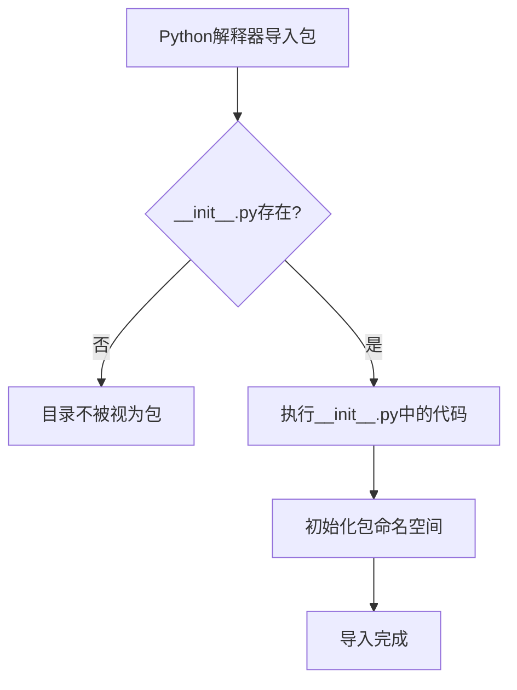

# `.\MetaGPT\tests\metagpt\actions\__init__.py` 详细设计文档

这是一个空的Python包初始化文件，其主要功能是标记当前目录为一个Python包，并可能包含包的元信息、版本号或执行包的初始化逻辑。当前文件内容为空，仅包含文件头注释。

## 整体流程



## 类结构

```
无类层次结构
```

## 全局变量及字段


    

## 全局函数及方法


## 关键组件


### 初始化模块

此文件是一个Python包的初始化模块（`__init__.py`），用于标记其所在目录为一个Python包，并可在其中定义包的公共接口或执行初始化代码。当前文件内容为空，表明该包目前仅作为命名空间容器，未定义任何公开的类、函数或变量。


## 问题及建议


### 已知问题

-   **空文件无实际功能**：当前 `__init__.py` 文件仅包含元信息注释，未定义任何类、函数或变量，因此不提供任何实际功能或模块导出。
-   **缺少模块导出定义**：作为包的初始化文件，未使用 `__all__` 列表明确声明应导出的模块或符号，可能导致导入行为不明确或导入不必要的内部模块。

### 优化建议

-   **明确模块导出**：如果此包包含需要对外公开的子模块或类/函数，应在 `__init__.py` 中使用 `__all__` 列表进行声明，例如 `__all__ = ['module1', 'ClassA']`，以提供清晰的公共接口。
-   **添加包级文档字符串**：在文件顶部添加一个模块文档字符串，简要说明此包的主要目的、包含的核心模块或功能，以提高代码的可读性和可维护性。
-   **考虑移除或填充内容**：如果此包目录下没有其他需要组织的模块，且 `__init__.py` 仅用于标记Python包，保持空文件是可接受的。但如果有相关功能，建议将共享的常量、异常类或工具函数定义在此处，作为包的命名空间。


## 其它


### 设计目标与约束

该代码文件是一个Python包的初始化文件（`__init__.py`）。其主要设计目标是：
1.  **定义包结构**：标记当前目录为一个Python包，使其可以被导入。
2.  **控制包的公开接口**：通过`__all__`变量或显式导入，管理从该包中导入`*`时暴露给外部的模块、类或函数。
3.  **执行包级初始化代码**：在包被首次导入时，执行此文件中的代码，可用于设置包级配置、初始化全局状态或执行兼容性检查。

主要约束包括：
*   **Python语法与模块系统**：必须遵循Python的模块和包导入机制。
*   **文件命名约定**：文件名必须为`__init__.py`。
*   **作用域**：其定义的变量和函数属于包的作用域。

### 错误处理与异常设计

当前文件为空，因此不包含任何显式的错误处理逻辑。作为包的入口点，其潜在的异常主要与导入过程相关：
*   **ImportError**：如果在`__init__.py`中尝试导入不存在的子模块或依赖包，会引发此异常。例如，若添加了`from .nonexistent_module import SomeClass`，导入该包时会失败。
*   **SyntaxError**：如果文件包含无效的Python语法。

最佳实践建议：在包初始化代码中，对于可选的依赖或可能失败的初始化步骤，应考虑使用`try...except`块进行捕获，并给出清晰的警告或错误信息，而不是让整个包导入失败。

### 数据流与状态机

由于当前文件为空，不存在内部数据流或状态机。如果未来添加了包级变量（例如缓存、配置字典、共享连接池等），则需描述：
*   **数据定义**：包级全局变量的初始状态。
*   **状态转换**：哪些函数或导入操作会修改这些全局状态。
*   **访问模式**：包内各模块如何访问和修改这些共享状态（需注意线程安全）。

### 外部依赖与接口契约

当前文件没有显式声明任何外部依赖（如`import`语句）。作为包的`__init__.py`，其核心“接口契约”是隐式的：
*   **导出契约**：通过定义`__all__`列表，明确声明了包对外提供的公共API。未在`__all__`中列出的模块、类或函数，应被视为内部实现细节（尽管Python无法强制阻止访问）。
*   **导入依赖**：如果未来在此文件中导入其他模块（如`import os`, `from .submodule import something`），则这些被导入的模块或包就成为此外部依赖。需要在此处声明，并说明其用途（例如，`os`用于路径操作，`.submodule`提供了核心功能类）。

### 配置管理与环境变量

当前文件不涉及配置管理。对于需要配置的包，`__init__.py`可能承担的角色包括：
*   **读取默认配置**：从包内资源文件读取默认配置。
*   **检查环境变量**：在初始化时检查特定的环境变量，并据此调整包的行为或配置。
*   **提供配置入口**：暴露一个配置函数或类，允许用户在导入包后、使用功能前进行全局配置。

### 安全考虑

当前文件内容不涉及安全风险。但作为包的入口，如果未来添加代码，需考虑：
*   **导入安全**：避免执行来自不可信源的动态导入（如`__import__(user_input)`）。
*   **敏感信息**：避免在代码中硬编码密码、密钥等敏感信息。应通过环境变量或安全的配置文件管理。
*   **序列化/反序列化**：如果初始化过程涉及从外部文件（如JSON, YAML）加载数据，需防范反序列化攻击。

### 测试策略

虽然`__init__.py`本身逻辑通常简单，但其测试重点在于：
*   **导入测试**：确保包可以正常导入，不会抛出`ImportError`或`SyntaxError`。
*   **导出测试**：如果定义了`__all__`，测试从包中导入`*`是否确实只导出了声明的对象。
*   **初始化副作用测试**：如果初始化代码有副作用（如创建目录、连接服务），测试这些行为是否符合预期，并且是可重复和可清理的。
*   **兼容性测试**：确保包在不同的Python版本和操作系统环境下都能正常初始化。

### 部署与构建

`__init__.py`文件本身是源代码的一部分，部署时随包一起分发。相关的构建考虑可能包括：
*   **打包工具**：在`setup.py`、`pyproject.toml`（用于`setuptools`、`poetry`或`flit`）中正确声明包及其包含的模块。
*   **字节码编译**：Python会生成`__pycache__/__init__.cpython-XX.pyc`文件以提升后续导入速度，此过程自动进行。
*   **版本管理**：包的版本号通常定义在`__version__`变量中，该变量可置于`__init__.py`内，便于运行时查询。

### 文档与示例

一个良好的`__init__.py`可以包含：
*   **包级文档字符串**：在文件顶部添加多行字符串，描述整个包的目的、主要功能和基本用法。
*   **版本变量**：定义`__version__ = “1.0.0”`。
*   **便捷导入**：将常用的类或函数提升到包级别，方便用户使用。例如：`from .core import MainClass`，这样用户可以直接`from my_package import MainClass`，而无需知道子模块结构。

    