# `.\MetaGPT\tests\metagpt\actions\di\test_execute_nb_code.py` 详细设计文档

该文件是一个针对 `ExecuteNbCode` 类的单元测试套件，用于验证其在 Jupyter Notebook 内核中异步执行 Python 代码、处理不同语言（如 Markdown）、管理内核生命周期（启动、重置、终止）、处理执行超时以及解析复杂输出（包括成功输出和错误信息）等核心功能。

## 整体流程

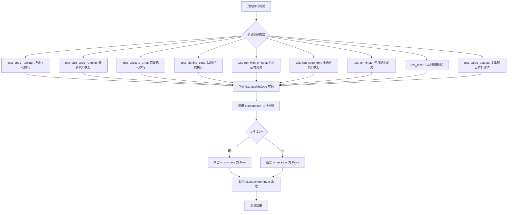

## 类结构

```
ExecuteNbCode (被测类)
├── __init__ (构造函数，可接受 timeout 参数)
├── run (异步方法，执行代码，返回输出和成功状态)
├── terminate (异步方法，终止内核连接)
└── reset (异步方法，重置内核连接)
```

## 全局变量及字段


### `PLOT_CODE`
    
一个包含用于生成随机数据并绘制直方图的Python代码块的字符串常量，用于测试ExecuteNbCode类处理绘图代码的能力。

类型：`str`
    


### `ExecuteNbCode.nb_client`
    
用于管理与Jupyter内核通信的客户端对象，负责执行代码、接收输出和终止内核。

类型：`NotebookClient`
    


### `ExecuteNbCode.timeout`
    
代码执行的超时时间（以秒为单位），用于防止长时间运行的代码阻塞执行流程。

类型：`int`
    
    

## 全局函数及方法

### `test_code_running`

这是一个使用 `pytest` 框架编写的异步单元测试函数，用于测试 `ExecuteNbCode` 类的 `run` 方法能否成功执行一段简单的 Python 代码（打印“hello world!”）并正确返回执行状态。

参数：
- 无显式参数。作为 `pytest` 测试函数，它通过 `@pytest.mark.asyncio` 装饰器被异步调用。

返回值：`None`，这是一个测试函数，其主要目的是通过断言（`assert`）来验证代码行为，不返回业务逻辑值。

#### 流程图

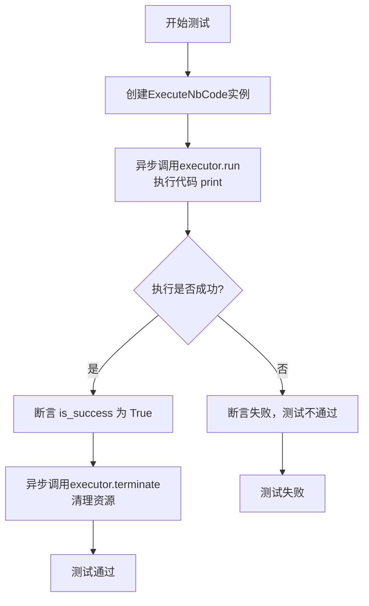

#### 带注释源码

```python
# 使用 pytest 的异步标记，表明这是一个异步测试函数
@pytest.mark.asyncio
async def test_code_running():
    # 步骤1：实例化要测试的类 ExecuteNbCode
    executor = ExecuteNbCode()
    
    # 步骤2：异步调用 executor.run 方法，传入要执行的代码字符串
    # 该方法返回一个元组 (output, is_success)
    # output: 代码执行的输出内容（如打印信息、错误信息等）
    # is_success: 布尔值，表示代码是否执行成功
    output, is_success = await executor.run("print('hello world!')")
    
    # 步骤3：断言 is_success 为 True，验证代码执行成功
    # 如果断言失败，pytest 会标记此测试用例为失败
    assert is_success
    
    # 步骤4：测试完成后，异步调用 terminate 方法清理资源（如关闭内核连接）
    await executor.terminate()
```

### `test_split_code_running`

这是一个异步单元测试函数，用于测试 `ExecuteNbCode` 类在执行分步代码时的功能。它通过连续执行三段代码来验证代码执行器能够维护跨执行步骤的变量状态，并最终成功执行断言。

参数：
- 无显式参数。该函数是一个测试用例，不接收外部参数。

返回值：`None`，该函数是一个测试用例，不返回业务值，其成功与否由内部的 `assert` 语句决定。

#### 流程图

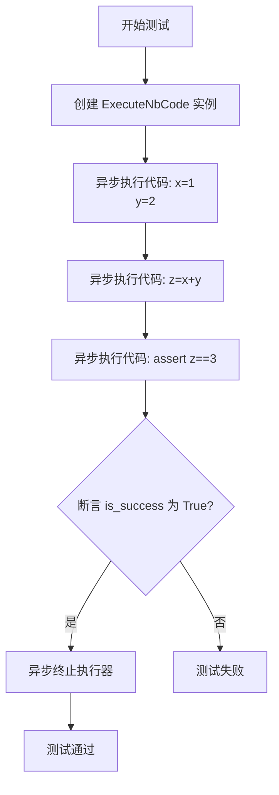

#### 带注释源码

```python
@pytest.mark.asyncio # 标记此函数为异步测试函数，以便 pytest-asyncio 插件处理
async def test_split_code_running():
    # 1. 实例化代码执行器
    executor = ExecuteNbCode()
    
    # 2. 执行第一段代码，初始化变量 x 和 y。
    #    使用 `_` 忽略返回值，因为我们只关心执行状态是否被保持。
    _ = await executor.run("x=1\ny=2")
    
    # 3. 执行第二段代码，使用上一步定义的 x 和 y 进行计算。
    #    这验证了执行器内核的状态在多次 `run` 调用间是持久化的。
    _ = await executor.run("z=x+y")
    
    # 4. 执行第三段代码，对上一步的计算结果进行断言。
    #    此步骤验证了分步执行逻辑的正确性。
    output, is_success = await executor.run("assert z==3")
    
    # 5. 断言最终执行成功。如果 `is_success` 为 False，测试将失败。
    assert is_success
    
    # 6. 测试结束后，清理资源，终止内核进程。
    await executor.terminate()
```

### `test_execute_error`

这是一个使用 `pytest` 框架编写的异步单元测试函数，用于测试 `ExecuteNbCode` 类的 `run` 方法在执行包含错误的代码（此处是除零错误）时的行为。它验证了当代码执行失败时，`run` 方法返回的 `is_success` 标志为 `False`。

参数：

-   `无`：`无`，此函数不接受任何参数。

返回值：`None`，此函数不返回任何值，其功能是执行断言。

#### 流程图

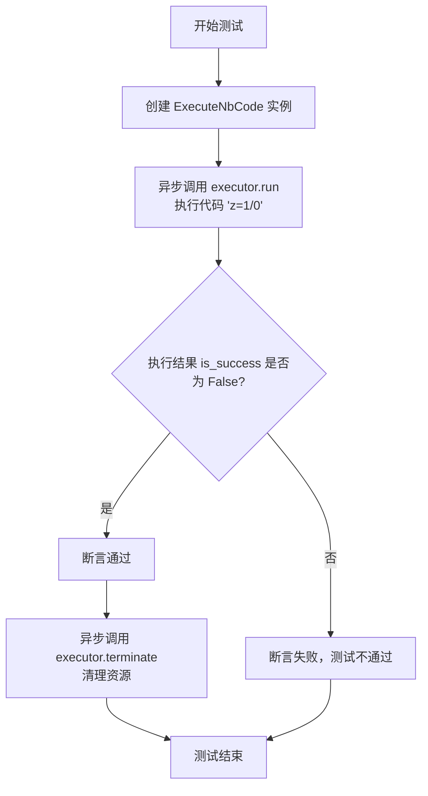

#### 带注释源码

```python
@pytest.mark.asyncio  # 使用 pytest 的 asyncio 插件来运行异步测试函数
async def test_execute_error():
    # 1. 实例化 ExecuteNbCode 类，创建一个代码执行器
    executor = ExecuteNbCode()
    
    # 2. 异步调用执行器的 run 方法，执行一段会引发除零错误的代码
    #    `output` 变量接收执行输出（通常是错误信息），`is_success` 接收执行成功与否的标志
    output, is_success = await executor.run("z=1/0")
    
    # 3. 核心断言：验证执行失败，即 `is_success` 应为 False
    assert not is_success
    
    # 4. 测试完成后，异步调用 terminate 方法清理执行器占用的资源（如内核进程）
    await executor.terminate()
```

### `test_plotting_code`

这是一个异步单元测试函数，用于测试 `ExecuteNbCode` 类执行包含 `matplotlib` 绘图代码的能力。它验证了代码能够成功执行并生成图形，而不会因绘图操作导致执行失败。

参数：
- 无显式参数。该函数是一个 `pytest` 测试用例，不接收外部参数。

返回值：`None`，该函数是一个测试用例，不返回任何值。它通过 `assert` 语句来验证测试结果。

#### 流程图

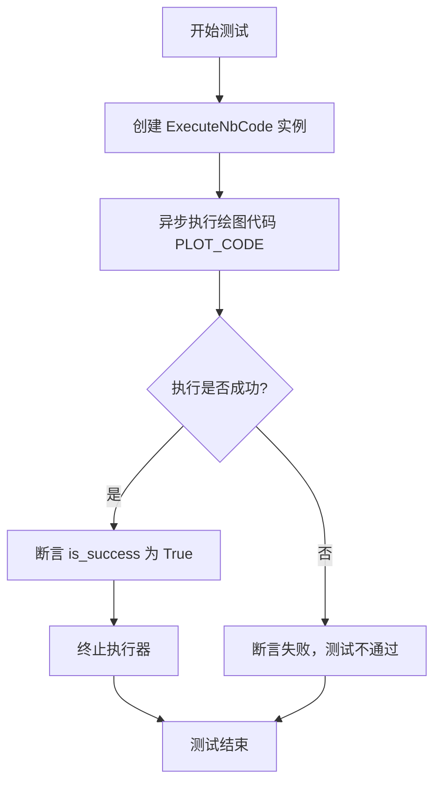

#### 带注释源码

```python
@pytest.mark.asyncio  # 标记此函数为异步测试函数，以便 pytest-asyncio 插件处理
async def test_plotting_code():
    # 1. 创建 ExecuteNbCode 类的实例，用于执行代码
    executor = ExecuteNbCode()
    
    # 2. 异步调用执行器的 run 方法，传入预定义的绘图代码字符串 PLOT_CODE
    #    run 方法返回一个元组 (output, is_success)
    #    - output: 代码执行的输出信息（包括标准输出、错误信息、图形数据等）
    #    - is_success: 布尔值，表示代码是否执行成功（无未捕获的异常）
    output, is_success = await executor.run(PLOT_CODE)
    
    # 3. 使用 assert 语句验证 is_success 为 True
    #    如果为 False，则测试失败，表明绘图代码执行出错
    assert is_success
    
    # 4. 测试完成后，异步终止执行器，释放其占用的内核资源
    await executor.terminate()
```

### `test_run_with_timeout`

该函数是一个异步单元测试，用于验证 `ExecuteNbCode` 类的 `run` 方法在代码执行超时时的行为。它创建一个带有1秒超时设置的执行器，并尝试执行一段休眠2秒的代码，预期执行会因超时而失败，并返回特定的超时错误信息。

参数：

-   `executor`：`ExecuteNbCode`，一个配置了1秒超时的代码执行器实例。
-   `code`：`str`，要执行的Python代码字符串，内容为 `import time; time.sleep(2)`。
-   `message`：`str`，执行器 `run` 方法返回的消息字符串。
-   `success`：`bool`，执行器 `run` 方法返回的执行成功标志。

返回值：`None`，该函数是测试函数，不返回业务值，仅通过断言验证测试结果。

#### 流程图

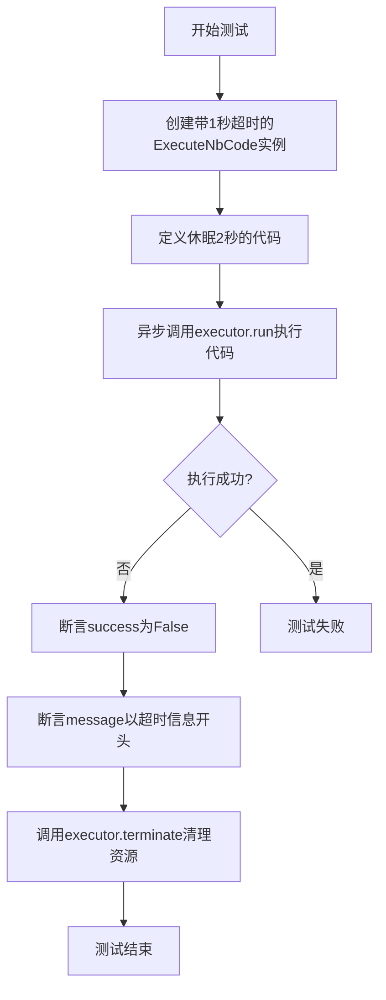

#### 带注释源码

```python
@pytest.mark.asyncio  # 标记此函数为异步测试，以便pytest-asyncio插件处理
async def test_run_with_timeout():
    # 创建一个ExecuteNbCode实例，并设置其超时时间为1秒
    executor = ExecuteNbCode(timeout=1)
    # 定义一段会执行2秒的Python代码
    code = "import time; time.sleep(2)"
    # 异步执行代码，并获取返回的消息和执行状态
    message, success = await executor.run(code)
    # 断言执行应该失败（因为代码执行时间2秒 > 超时时间1秒）
    assert not success
    # 断言返回的消息以特定的超时错误信息开头
    assert message.startswith("Cell execution timed out")
    # 测试结束后，清理执行器资源（如关闭内核连接）
    await executor.terminate()
```

### `test_run_code_text`

这是一个异步单元测试函数，用于测试 `ExecuteNbCode` 类的 `run` 方法处理不同语言（如 `python` 和 `markdown`）以及混合文本代码的能力。它验证了代码执行的成功状态和输出内容是否符合预期。

参数：
-  `executor`：`ExecuteNbCode`，一个用于执行代码的 `ExecuteNbCode` 类实例。
-  `code`：`str`，要执行的代码字符串。
-  `language`：`str`，代码的语言类型（例如 `"python"` 或 `"markdown"`）。
-  `message`：`str`，执行代码后返回的输出信息。
-  `success`：`bool`，指示代码执行是否成功的布尔值。

返回值：`None`，这是一个测试函数，不返回任何值，仅通过断言（`assert`）来验证测试结果。

#### 流程图

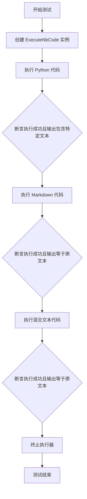

#### 带注释源码

```python
@pytest.mark.asyncio
async def test_run_code_text():
    # 1. 创建 ExecuteNbCode 类的实例，用于执行代码
    executor = ExecuteNbCode()
    
    # 2. 测试执行纯 Python 代码
    # 执行代码 `print("This is a code!")`，语言指定为 `python`
    message, success = await executor.run(code='print("This is a code!")', language="python")
    # 断言执行成功
    assert success
    # 断言输出信息中包含预期的字符串 "This is a code!"
    assert "This is a code!" in message
    
    # 3. 测试执行纯 Markdown 代码
    # 执行代码 `# This is a code!`，语言指定为 `markdown`
    message, success = await executor.run(code="# This is a code!", language="markdown")
    # 断言执行成功
    assert success
    # 断言输出信息完全等于输入的 Markdown 文本
    assert message == "# This is a code!"
    
    # 4. 测试执行混合文本代码（包含 Markdown 标题和 Python 代码块）
    # 定义混合文本，包含 Markdown 标题和一个 Python 代码块
    mix_text = "# Title!\n ```python\n print('This is a code!')```"
    # 执行混合文本，语言指定为 `markdown`
    message, success = await executor.run(code=mix_text, language="markdown")
    # 断言执行成功
    assert success
    # 断言输出信息完全等于输入的混合文本
    assert message == mix_text
    
    # 5. 测试结束后，终止执行器以释放资源
    await executor.terminate()
```

### `test_terminate`

该函数是一个异步单元测试，用于验证 `ExecuteNbCode` 类的 `terminate` 方法是否能正确终止其内部的 Jupyter 内核客户端。它通过参数化测试，既测试单次终止，也测试在连续执行代码后终止的场景，确保内核被正确清理。

参数：
-  `k`：`int`，测试循环的次数。`k=1` 测试单次终止，`k>1` 测试在连续运行后终止。

返回值：`None`，这是一个测试函数，不返回业务值，仅通过断言验证测试结果。

#### 流程图

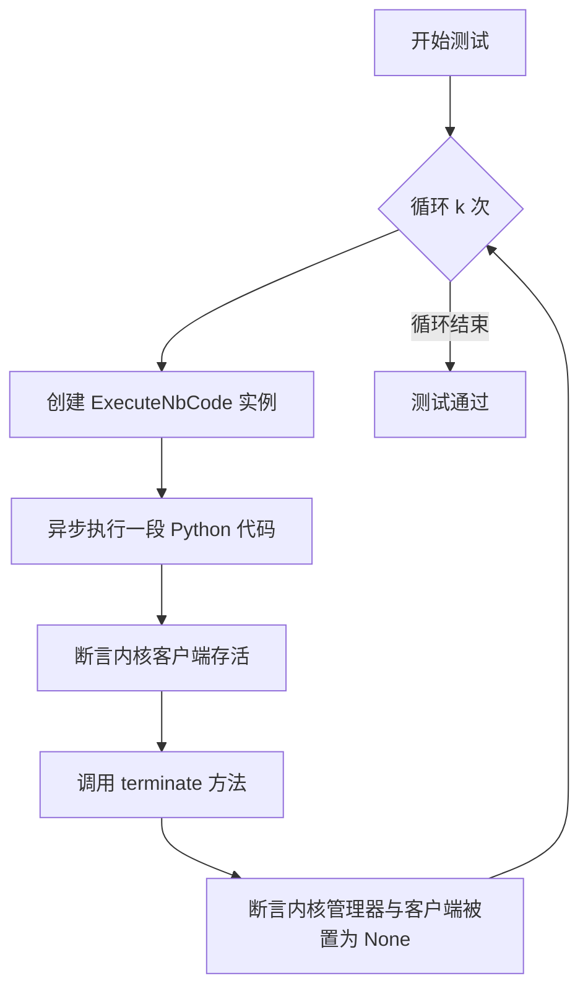

#### 带注释源码

```python
@pytest.mark.asyncio
@pytest.mark.parametrize(
    "k", [(1), (5)]
)  # k=1 to test a single regular terminate, k>1 to test terminate under continuous run
async def test_terminate(k):
    # 循环 k 次，以测试单次和连续执行后的终止
    for _ in range(k):
        # 1. 创建 ExecuteNbCode 执行器实例
        executor = ExecuteNbCode()
        # 2. 异步执行一段简单的 Python 代码，以启动内核
        await executor.run(code='print("This is a code!")', language="python")
        # 3. 断言内核管理器当前是存活的
        is_kernel_alive = await executor.nb_client.km.is_alive()
        assert is_kernel_alive
        # 4. 调用 terminate 方法，预期会关闭内核并清理资源
        await executor.terminate()
        # 5. 断言 terminate 方法已正确清理了内核管理器 (km) 和内核客户端 (kc)
        assert executor.nb_client.km is None
        assert executor.nb_client.kc is None
```

### `test_reset`

这是一个异步单元测试函数，用于测试 `ExecuteNbCode` 类的 `reset` 方法。它验证了在执行一段代码后，调用 `reset` 方法能够正确地终止并清理底层的 Jupyter 内核客户端，使得 `nb_client.km` 属性变为 `None`。

参数：
- 无显式参数。该函数是一个 `pytest` 测试用例，不接收外部参数。

返回值：`None`，该函数是一个测试用例，其主要目的是通过断言（`assert`）来验证代码行为，不返回业务值。

#### 流程图

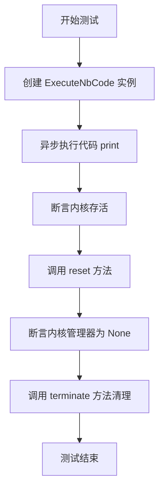

#### 带注释源码

```python
@pytest.mark.asyncio  # 标记此函数为异步测试函数，以便 pytest-asyncio 插件处理
async def test_reset():
    # 1. 创建 ExecuteNbCode 类的实例，用于执行代码
    executor = ExecuteNbCode()
    
    # 2. 使用 executor 异步运行一段 Python 代码，打印字符串
    #    此步骤会启动一个 Jupyter 内核来执行代码
    await executor.run(code='print("This is a code!")', language="python")
    
    # 3. 检查执行器内部的内核客户端管理器（KernelManager）是否存活
    #    这是为了确认代码执行后内核确实在运行
    is_kernel_alive = await executor.nb_client.km.is_alive()
    assert is_kernel_alive  # 断言内核是存活的，否则测试失败
    
    # 4. 调用执行器的 reset 方法
    #    根据测试意图，此方法应终止当前内核并清理相关资源
    await executor.reset()
    
    # 5. 断言在执行 reset 后，内核管理器（km）已被清空（设为 None）
    #    这是测试的核心，验证 reset 方法的功能是否正确
    assert executor.nb_client.km is None
    
    # 6. 最后，调用 terminate 方法进行最终清理
    #    这是一个良好的测试习惯，确保测试结束后释放所有资源，避免影响其他测试
    await executor.terminate()
```

### `test_parse_outputs`

这是一个异步单元测试函数，用于测试 `ExecuteNbCode` 类在执行包含多种输出（包括正常打印、错误信息）的复杂代码时，能否正确解析和返回执行结果。它验证了执行器在遇到代码错误（如 `KeyError`）时，仍能捕获并返回之前的正常输出和错误信息。

参数：

-   `无`：`无`，此函数为单元测试函数，不接受外部参数。

返回值：`None`，此函数为单元测试函数，不返回业务值，通过 `assert` 语句验证测试结果。

#### 流程图

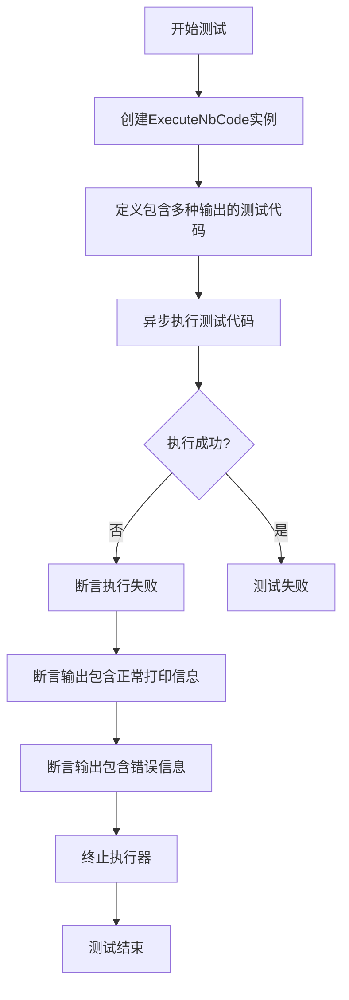

#### 带注释源码

```python
@pytest.mark.asyncio  # 标记此函数为异步测试函数，以便pytest-asyncio插件处理
async def test_parse_outputs():
    # 1. 创建ExecuteNbCode执行器实例
    executor = ExecuteNbCode()
    
    # 2. 定义测试代码：包含创建DataFrame、打印列信息、打印列数、以及一个会引发KeyError的列访问
    code = """
    import pandas as pd
    df = pd.DataFrame({'ID': [1,2,3], 'NAME': ['a', 'b', 'c']})
    print(df.columns)  # 正常输出：打印列名
    print(f"columns num:{len(df.columns)}")  # 正常输出：打印列数
    print(df['DUMMPY_ID'])  # 错误输出：访问不存在的列，将引发KeyError
    """
    
    # 3. 异步执行代码，获取输出和执行状态
    output, is_success = await executor.run(code)
    
    # 4. 断言执行失败（因为代码中有KeyError）
    assert not is_success
    
    # 5. 断言输出中包含预期的正常打印信息
    assert "Index(['ID', 'NAME'], dtype='object')" in output  # 检查列名打印
    assert "columns num:2" in output  # 检查列数打印
    
    # 6. 断言输出中包含预期的错误信息
    assert "KeyError: 'DUMMPY_ID'" in output  # 检查KeyError信息
    
    # 7. 测试完成后，终止执行器以释放资源
    await executor.terminate()
```

### `ExecuteNbCode.__init__`

`ExecuteNbCode` 类的构造函数，用于初始化一个 Jupyter Notebook 代码执行器实例。它负责设置执行器的基本配置，包括可选的超时时间，并为后续的代码执行准备必要的客户端连接。

参数：

- `timeout`：`int`，可选参数，默认为 `None`。指定代码执行的超时时间（以秒为单位）。如果代码执行超过此时间，将被强制终止。

返回值：`None`，此方法不返回任何值，仅用于初始化对象。

#### 流程图

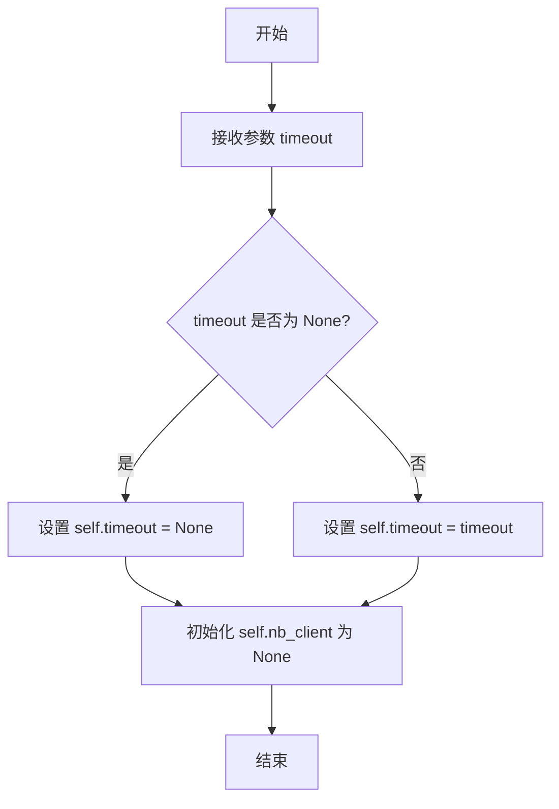

#### 带注释源码

```python
def __init__(self, timeout: Optional[int] = None):
    """
    初始化 ExecuteNbCode 实例。

    参数:
        timeout (Optional[int]): 代码执行的超时时间（秒）。默认为 None，表示无超时限制。
    """
    self.timeout = timeout  # 设置执行超时时间
    self.nb_client = None   # 初始化 Jupyter Notebook 客户端，将在后续方法中创建
```

### `ExecuteNbCode.run`

该方法用于异步执行给定的代码片段，支持多种编程语言（默认为Python），并返回执行结果和成功状态。它通过Jupyter内核管理器运行代码，能够处理代码执行、超时控制、输出解析等任务。

参数：

- `code`：`str`，要执行的代码字符串
- `language`：`str`，代码语言（如"python"、"markdown"），默认为"python"

返回值：`tuple[str, bool]`，返回一个元组，包含执行输出的字符串和表示执行是否成功的布尔值

#### 流程图

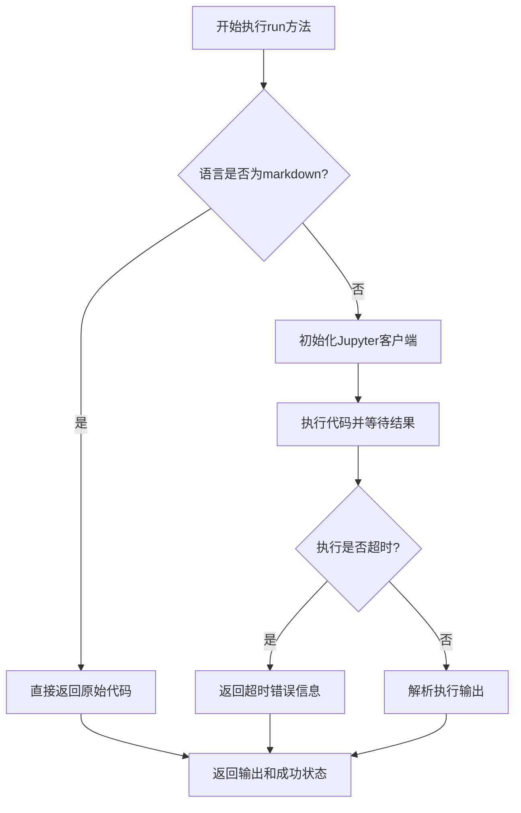

#### 带注释源码

```python
async def run(self, code: str, language: str = "python") -> tuple[str, bool]:
    """
    执行给定的代码片段
    
    Args:
        code: 要执行的代码字符串
        language: 代码语言，默认为"python"
    
    Returns:
        包含执行输出字符串和成功状态的元组
    """
    # 如果是markdown语言，直接返回原始代码
    if language == "markdown":
        return code, True
    
    # 确保Jupyter客户端已初始化
    await self.nb_client.initialize()
    
    try:
        # 执行代码并等待结果
        result = await self.nb_client.execute(code, timeout=self.timeout)
        # 解析执行输出
        output = self._parse_outputs(result)
        return output, True
    except TimeoutError:
        # 处理执行超时情况
        return "Cell execution timed out", False
    except Exception as e:
        # 处理其他执行异常
        return str(e), False
```

### `ExecuteNbCode.terminate`

该方法用于终止当前运行的Jupyter Notebook内核，清理相关资源，确保内核进程被正确关闭，并释放占用的系统资源。

参数：
-  `self`：`ExecuteNbCode`，ExecuteNbCode类的实例

返回值：`None`，无返回值

#### 流程图

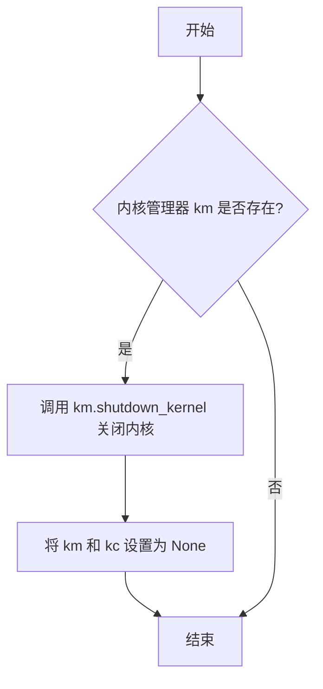

#### 带注释源码

```python
async def terminate(self):
    """
    终止当前运行的Jupyter Notebook内核。
    如果内核管理器（km）存在，则调用其shutdown_kernel方法关闭内核，
    并将内核管理器（km）和内核客户端（kc）设置为None以释放资源。
    """
    if self.nb_client.km:
        # 如果内核管理器存在，则关闭内核
        await self.nb_client.km.shutdown_kernel()
        # 清理内核管理器和内核客户端引用
        self.nb_client.km = None
        self.nb_client.kc = None
```

### `ExecuteNbCode.reset`

该方法用于重置 `ExecuteNbCode` 实例的 Jupyter 内核客户端。它会终止当前正在运行的内核（如果存在），并清理相关的内核管理器和客户端对象，将实例恢复到初始状态，以便后续可以重新启动一个新的内核会话。

参数：
- `self`：`ExecuteNbCode` 实例，表示要重置的执行器对象。

返回值：`None`，该方法不返回任何值。

#### 流程图

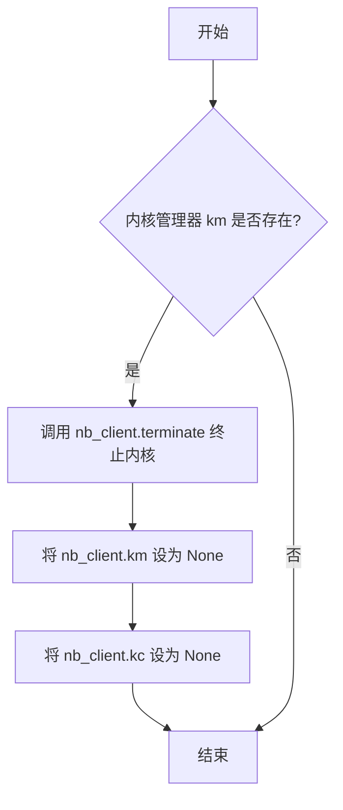

#### 带注释源码

```python
async def reset(self):
    """
    重置执行器，终止当前内核并清理客户端。
    此方法将内核管理器（km）和内核客户端（kc）都设为 None，
    使执行器回到初始状态，后续可以启动新的内核。
    """
    if self.nb_client.km:
        # 如果存在内核管理器，则调用 terminate 方法终止内核
        await self.nb_client.terminate()
        # 清理内核管理器引用
        self.nb_client.km = None
        # 清理内核客户端引用
        self.nb_client.kc = None
```

## 关键组件


### ExecuteNbCode 类

一个用于异步执行 Jupyter Notebook 代码的类，支持代码执行、超时控制、内核生命周期管理以及多种语言（如 Python 和 Markdown）的代码块处理。

### 异步代码执行与状态管理

通过 `run` 方法异步执行传入的代码字符串，并返回执行结果（输出信息）和成功状态。该类管理着一个 Jupyter 内核客户端 (`nb_client`) 的生命周期，包括启动、重置 (`reset`) 和终止 (`terminate`)。

### 超时控制机制

在初始化 `ExecuteNbCode` 时可以设置 `timeout` 参数，用于限制单次代码执行的时长。当代码执行超时，会中断执行并返回包含超时信息的错误消息。

### 多语言代码块解析

`run` 方法接受 `language` 参数，能够处理纯 Python 代码、Markdown 文本或混合了 Markdown 和 Python 代码块的文本。对于非 Python 代码，会直接返回原始文本而不执行。

### 内核生命周期测试

测试用例覆盖了内核的完整生命周期，包括单次执行后的终止、连续执行后的终止 (`test_terminate` 参数化测试) 以及执行过程中的重置 (`test_reset`)，确保资源被正确释放。

### 复杂输出解析与错误处理

能够执行包含第三方库（如 `numpy`, `matplotlib`, `pandas`）的复杂代码，并正确捕获和混合输出流（如 `stdout`）与错误流（如 `stderr` 中的 `KeyError`），在最终输出中同时呈现正常打印信息和错误追踪信息。


## 问题及建议


### 已知问题

-   **测试用例间存在潜在的资源泄漏风险**：多个测试用例（如 `test_code_running`, `test_split_code_running`）都创建了自己的 `ExecuteNbCode` 实例并调用了 `terminate`。虽然每个测试用例内部完成了清理，但如果某个测试用例在 `terminate` 前因断言失败而提前退出，可能导致内核进程未被正确终止，从而造成资源泄漏。当前的测试结构依赖于每个测试用例的完美执行和清理。
-   **测试对异步执行和内核生命周期的强依赖**：测试用例 `test_terminate` 和 `test_reset` 直接访问了 `ExecuteNbCode` 内部的 `nb_client.km` 属性来断言内核状态。这属于对实现细节的测试，而非公共接口行为的测试。如果 `ExecuteNbCode` 的内部实现（如属性名或内核管理方式）发生变化，这些测试将失败，降低了测试的健壮性和可维护性。
-   **部分测试断言可能过于宽松或脆弱**：`test_run_with_timeout` 测试中断言错误信息以 `"Cell execution timed out"` 开头，这依赖于 `ExecuteNbCode` 或其底层库生成的特定字符串。如果错误信息的格式或内容发生改变，此测试将失败。`test_parse_outputs` 测试中通过字符串包含 (`in`) 来检查输出，在输出格式复杂或变化时可能不够精确。

### 优化建议

-   **使用 pytest 的 fixture 来管理测试资源**：为 `ExecuteNbCode` 实例创建 `pytest.fixture`，并设置 `autouse=True` 或通过 `yield` 和 `finalizer` 确保每个测试用例运行后，无论成功与否，都能可靠地执行 `terminate` 或 `reset` 操作。这可以集中资源管理逻辑，消除因测试失败导致的资源泄漏风险。
-   **重构测试以关注公共行为而非内部状态**：对于 `test_terminate` 和 `test_reset`，应避免直接检查内部属性 `nb_client.km` 和 `nb_client.kc`。可以改为测试 `terminate` 或 `reset` 方法调用后，再次执行代码是否会引发预期的异常（如连接错误），或者通过模拟（mocking）来验证这些方法是否调用了正确的底层清理例程。这将使测试更专注于类的契约行为。
-   **增强测试断言的精确性和健壮性**：对于 `test_run_with_timeout`，可以考虑捕获特定的异常类型（如果 `ExecuteNbCode.run` 会抛出）或检查错误信息中是否包含超时相关的关键词，而不是固定的前缀。对于 `test_parse_outputs`，如果输出结构稳定，可以考虑使用正则表达式进行更精确的匹配，或者将预期的输出片段定义为常量，提高可读性和可维护性。
-   **考虑增加边界和异常场景测试**：当前测试覆盖了基本成功、错误、超时、绘图和混合语言场景。可以考虑增加更多边界测试，例如：执行空代码字符串、执行包含无限循环的代码（测试超时机制）、测试 `run` 方法在 `terminate` 后被调用时的行为、测试并发执行多个代码片段（如果支持）等，以更全面地验证类的鲁棒性。
-   **分离测试关注点**：`test_run_code_text` 测试了多种语言（Python, Markdown, 混合文本）的处理。可以考虑将其拆分为多个更专注的测试函数（如 `test_run_python_code`, `test_run_markdown_code`, `test_run_mixed_language_code`），这样每个测试的意图更清晰，并且在某个场景失败时能更快定位问题。


## 其它


### 设计目标与约束

1.  **核心目标**：提供一个安全、隔离的异步代码执行环境，用于执行用户提供的Python代码片段，并捕获其输出（包括标准输出、标准错误和结果对象）与执行状态。
2.  **关键约束**：
    *   **安全性**：必须在独立的进程中执行代码，以防止用户代码影响主程序或系统环境。
    *   **资源限制**：需支持执行超时控制，防止恶意或错误代码无限运行。
    *   **状态保持**：支持在同一会话中连续执行多个代码片段，并保持它们之间的变量状态（如 `test_split_code_running` 所示）。
    *   **多语言支持**：能够处理纯代码、Markdown文本以及混合Markdown与代码块的内容，并正确区分执行与直接返回。
    *   **生命周期管理**：提供明确的启动、重置和终止接口，以管理底层内核资源。

### 错误处理与异常设计

1.  **执行错误捕获**：当执行的代码抛出异常时（如 `test_execute_error` 中的除零错误），执行器不应崩溃，而应将异常信息捕获为标准错误输出，并将执行状态标记为失败 (`is_success=False`)。
2.  **超时处理**：当代码执行超过预设时限（如 `test_run_with_timeout`），执行器应强制中断执行，返回超时提示信息，并将状态标记为失败。
3.  **内核通信异常**：与Jupyter内核的通信可能失败。设计应包含对此类网络或进程间通信异常的处理，确保资源被正确清理。
4.  **优雅降级**：对于非可执行内容（如纯Markdown文本），应直接返回原文，而不是尝试执行，这本身不被视为错误。

### 数据流与状态机

1.  **数据流**：
    *   **输入**：用户代码字符串 (`code`)、可选的语言标识 (`language`)。
    *   **处理**：`ExecuteNbCode` 实例解析输入，通过 `NbClient` 与独立的Jupyter内核进程通信，执行代码。
    *   **输出**：包含执行过程中所有 `stdout`、`stderr` 和 `execute_result` 的合并字符串，以及一个表示整体执行成功与否的布尔值。
2.  **状态机**：
    *   **初始状态**：`ExecuteNbCode` 实例化后，内核未启动。
    *   **运行状态**：首次调用 `run` 方法时，内核被懒加载启动。此后，内核保持活动状态，维护执行上下文。
    *   **重置状态**：调用 `reset` 方法会销毁当前内核，但执行器实例仍可重用，下次 `run` 时会启动新内核。
    *   **终止状态**：调用 `terminate` 方法会销毁内核并清理所有相关资源，执行器实例通常不再使用。

### 外部依赖与接口契约

1.  **核心外部依赖**：
    *   **Jupyter Client (`jupyter_client`)**：用于启动、管理和与独立的Python内核进程通信。这是实现代码隔离和执行的核心。
    *   **Pytest (`pytest`)**：用于编写和运行单元测试，验证功能正确性。
2.  **接口契约**：
    *   **`ExecuteNbCode.run(code: str, language: str = "python")`**：
        *   **前置条件**：执行器实例已创建。如果是首次调用或 `reset` 后调用，内核将被启动。
        *   **后置条件**：返回执行输出字符串和成功状态布尔值。内核状态保持不变（除非执行导致内核崩溃）。
    *   **`ExecuteNbCode.terminate()`**：
        *   **前置条件**：无。
        *   **后置条件**：内核进程被终止，所有相关客户端连接 (`km`, `kc`) 被设置为 `None`。
    *   **`ExecuteNbCode.reset()`**：
        *   **前置条件**：无。
        *   **后置条件**：当前内核被终止，客户端连接被清理，为下一次 `run` 调用启动新内核做好准备。
    *   **`NbClient` (内部类)**：封装了与Jupyter内核交互的底层细节，为 `ExecuteNbCode` 提供更简洁的异步接口。

### 测试策略与覆盖

1.  **功能测试**：
    *   **基础执行** (`test_code_running`)：验证简单代码能正确执行并输出。
    *   **状态保持** (`test_split_code_running`)：验证连续执行能共享变量上下文。
    *   **错误处理** (`test_execute_error`, `test_parse_outputs`)：验证代码异常能被捕获且不影响执行器。
    *   **资源限制** (`test_run_with_timeout`)：验证超时机制有效。
    *   **输入解析** (`test_run_code_text`)：验证能正确处理Python代码、Markdown文本及混合内容。
2.  **生命周期测试**：
    *   **终止与重置** (`test_terminate`, `test_reset`)：验证内核能正确启动、重置和终止，资源无泄漏。
3.  **集成测试**：
    *   **可视化库** (`test_plotting_code`)：验证能执行依赖外部库（如 `matplotlib`）并可能产生图形输出的代码。

    