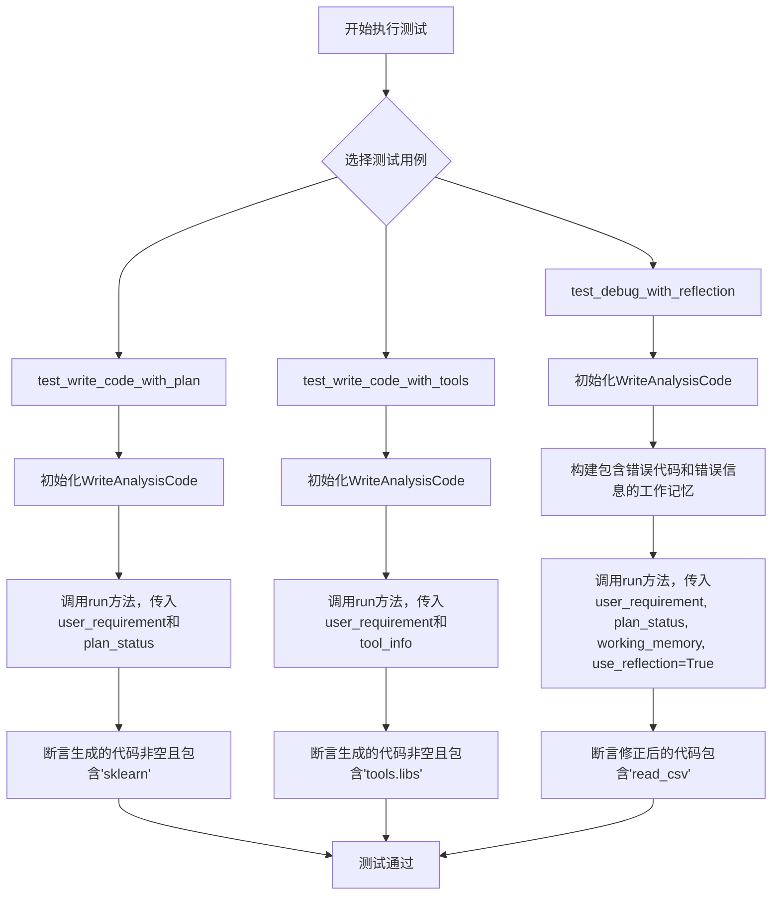
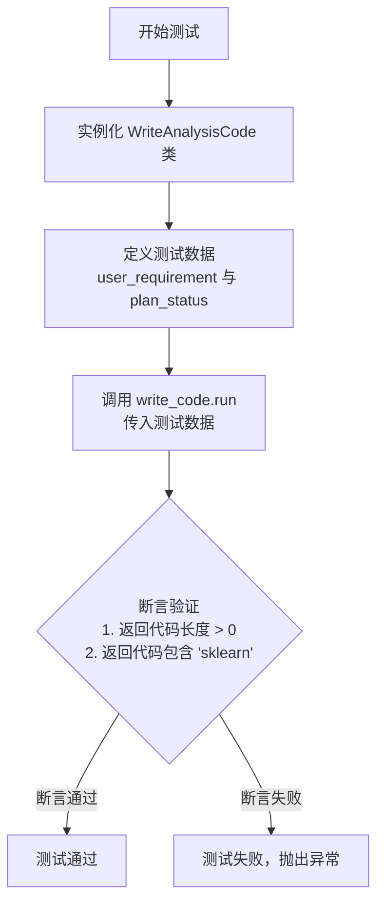
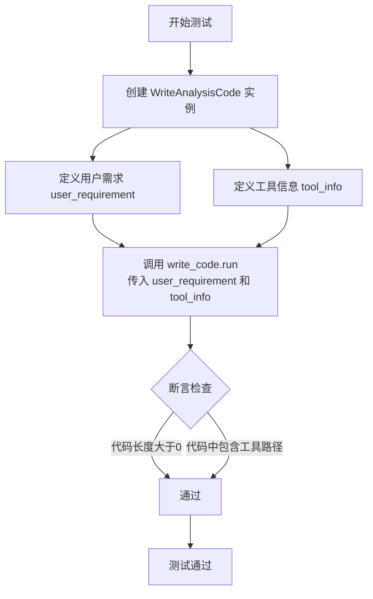
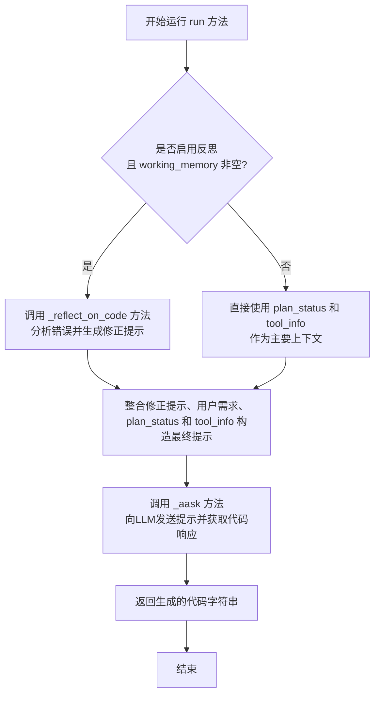

# `.\MetaGPT\tests\metagpt\actions\di\test_write_analysis_code.py` 详细设计文档

该文件是一个使用 pytest 框架编写的单元测试文件，用于测试 `WriteAnalysisCode` 类的 `run` 方法。`WriteAnalysisCode` 是一个用于生成数据分析代码的组件。测试覆盖了三种主要场景：1) 根据用户需求和任务计划生成代码；2) 结合预定义的工具信息生成代码；3) 在出现执行错误后，利用错误信息和历史对话（工作记忆）进行反思并生成修正后的代码。

## 整体流程



## 类结构

```
pytest (测试框架)
├── test_write_code_with_plan (异步测试函数)
├── test_write_code_with_tools (异步测试函数)
└── test_debug_with_reflection (异步测试函数)
metagpt.actions.di.write_analysis_code (被测试模块)
└── WriteAnalysisCode (被测试类)
    └── run (被测试方法)
```

## 全局变量及字段


### `write_code`
    
WriteAnalysisCode类的实例，用于生成数据分析代码

类型：`WriteAnalysisCode`
    


### `user_requirement`
    
用户需求描述，指定数据分析任务的目标和要求

类型：`str`
    


### `plan_status`
    
任务计划状态，包含已完成任务、当前任务和任务指导信息

类型：`str`
    


### `code`
    
生成的Python代码字符串，用于执行数据分析任务

类型：`str`
    


### `tool_info`
    
工具信息描述，包含可用工具的定义和使用说明

类型：`str`
    


### `wrong_code`
    
包含错误的代码字符串，用于调试和反射测试

类型：`str`
    


### `error`
    
代码执行时的错误信息，包含完整的异常堆栈跟踪

类型：`str`
    


### `working_memory`
    
工作记忆列表，包含历史对话消息用于代码调试

类型：`list[Message]`
    


### `new_code`
    
经过调试和反射后生成的新代码字符串

类型：`str`
    


### `Message.content`
    
消息的内容，可以是代码、错误信息或用户需求

类型：`str`
    


### `Message.role`
    
消息的角色，标识发送者是用户还是助手

类型：`str`
    
    

## 全局函数及方法

### `test_write_code_with_plan`

这是一个使用 `pytest` 框架编写的异步单元测试函数，用于测试 `WriteAnalysisCode` 类的 `run` 方法在给定用户需求 (`user_requirement`) 和计划状态 (`plan_status`) 时，能否生成包含特定关键词（如 `"sklearn"`）的有效代码。

参数：

- `无显式参数`：`None`，这是一个测试函数，不接收外部参数。其测试逻辑和所需数据均在函数体内定义。

返回值：`None`，测试函数通常不返回值，其目的是通过 `assert` 语句验证代码行为。

#### 流程图



#### 带注释源码

```python
# 使用 pytest 的异步标记，表示这是一个异步测试函数
@pytest.mark.asyncio
async def test_write_code_with_plan():
    # 1. 实例化待测试的 WriteAnalysisCode 动作类
    write_code = WriteAnalysisCode()

    # 2. 定义测试输入：用户需求字符串
    user_requirement = "Run data analysis on sklearn Iris dataset, include a plot"
    # 3. 定义测试输入：模拟的计划状态字符串，描述了已完成和当前任务
    plan_status = "\n## Finished Tasks\n### code\n```python\n\n```\n\n### execution result\n\n\n## Current Task\nLoad the sklearn Iris dataset and perform exploratory data analysis\n\n## Task Guidance\nWrite complete code for 'Current Task'. And avoid duplicating code from 'Finished Tasks', such as repeated import of packages, reading data, etc.\nSpecifically, \nThe current task is about exploratory data analysis, please note the following:\n- Distinguish column types with `select_dtypes` for tailored analysis and visualization, such as correlation.\n- Remember to `import numpy as np` before using Numpy functions.\n\n"

    # 4. 核心测试步骤：异步调用 write_code.run 方法，传入定义好的参数
    code = await write_code.run(user_requirement=user_requirement, plan_status=plan_status)
    
    # 5. 断言验证：确保返回的代码字符串不为空
    assert len(code) > 0
    # 6. 断言验证：确保返回的代码字符串中包含期望的关键词 "sklearn"
    assert "sklearn" in code
```

### `test_write_code_with_tools`

这是一个异步单元测试函数，用于测试 `WriteAnalysisCode` 类的 `run` 方法在接收到包含工具信息 (`tool_info`) 的用户需求时，能否生成正确的、使用了指定工具的代码。

参数：

- `write_code`：`WriteAnalysisCode`，一个 `WriteAnalysisCode` 类的实例，用于执行代码生成任务。
- `user_requirement`：`str`，描述用户需求的字符串，本例中要求对葡萄酒数据集进行预处理和模型训练。
- `tool_info`：`str`，一个包含可用工具详细信息的字符串，描述了工具的能力、路径和使用方法。
- `code`：`str`，调用 `write_code.run` 方法后生成的代码字符串。

返回值：`None`，这是一个测试函数，不返回业务值，仅通过断言 (`assert`) 来验证测试结果。

#### 流程图



#### 带注释源码

```python
@pytest.mark.asyncio  # 标记此函数为异步测试函数，以便 pytest-asyncio 插件能够正确处理
async def test_write_code_with_tools():
    # 1. 实例化 WriteAnalysisCode 类，这是被测试的主要对象
    write_code = WriteAnalysisCode()

    # 2. 定义用户需求：要求对 sklearn 的葡萄酒数据集进行预处理、模型训练并展示验证准确率
    user_requirement = "Preprocess sklearn Wine recognition dataset and train a model to predict wine class (20% as validation), and show validation accuracy."
    
    # 3. 定义工具信息字符串。该字符串模拟了系统提供给代码生成模型的上下文，
    #    告知模型可以使用哪些预定义工具（此处为 FillMissingValue）以及如何导入和使用它们。
    tool_info = """
    ## Capabilities
    - You can utilize pre-defined tools in any code lines from 'Available Tools' in the form of Python class or function.
    - You can freely combine the use of any other public packages, like sklearn, numpy, pandas, etc..

    ## Available Tools:
    Each tool is described in JSON format. When you call a tool, import the tool from its path first.
    {'FillMissingValue': {'type': 'class', 'description': 'Completing missing values with simple strategies.', 'methods': {'__init__': {'type': 'function', 'description': 'Initialize self. ', 'signature': '(self, features: \'list\', strategy: "Literal[\'mean\', \'median\', \'most_frequent\', \'constant\']" = \'mean\', fill_value=None)', 'parameters': 'Args: features (list): Columns to be processed. strategy (Literal["mean", "median", "most_frequent", "constant"], optional): The imputation strategy, notice \'mean\' and \'median\' can only be used for numeric features. Defaults to \'mean\'. fill_value (int, optional): Fill_value is used to replace all occurrences of missing_values. Defaults to None.'}, 'fit': {'type': 'function', 'description': 'Fit a model to be used in subsequent transform. ', 'signature': "(self, df: 'pd.DataFrame')", 'parameters': 'Args: df (pd.DataFrame): The input DataFrame.'}, 'fit_transform': {'type': 'function', 'description': 'Fit and transform the input DataFrame. ', 'signature': "(self, df: 'pd.DataFrame') -> 'pd.DataFrame'", 'parameters': 'Args: df (pd.DataFrame): The input DataFrame. Returns: pd.DataFrame: The transformed DataFrame.'}, 'transform': {'type': 'function', 'description': 'Transform the input DataFrame with the fitted model. ', 'signature': "(self, df: 'pd.DataFrame') -> 'pd.DataFrame'", 'parameters': 'Args: df (pd.DataFrame): The input DataFrame. Returns: pd.DataFrame: The transformed DataFrame.'}}, 'tool_path': 'metagpt/tools/libs/data_preprocess.py'}
    """

    # 4. 核心测试步骤：调用 WriteAnalysisCode 实例的 run 方法。
    #    传入用户需求和工具信息，异步等待其生成代码。
    code = await write_code.run(user_requirement=user_requirement, tool_info=tool_info)
    
    # 5. 断言验证：确保生成的代码不为空，并且包含了指定的工具模块路径。
    #    这验证了代码生成器成功理解并使用了提供的工具信息。
    assert len(code) > 0
    assert "metagpt.tools.libs" in code
```

### `test_debug_with_reflection`

这是一个使用 pytest 框架编写的异步单元测试函数，用于测试 `WriteAnalysisCode` 类的 `run` 方法在启用反思（`use_reflection=True`）模式下的调试能力。该测试模拟了一个场景：给定一段因使用错误函数（`pd.read_excel` 读取 CSV 文件）而执行失败的代码及其对应的错误信息，测试 `WriteAnalysisCode` 能否根据这些信息生成修正后的、正确的代码（使用 `pd.read_csv`）。

参数：

- `无显式参数`：`N/A`，这是一个测试函数，不接收外部参数。它通过内部定义的变量来构造测试用例。

返回值：`None`，这是一个测试函数，其主要目的是通过断言（`assert`）来验证代码行为，不返回业务值。

#### 流程图

```mermaid
flowchart TD
    Start[开始测试] --> DefineVars[定义测试变量<br>user_requirement, plan_status,<br>wrong_code, error, working_memory]
    DefineVars --> CallMethod[调用 WriteAnalysisCode().run<br>传入 user_requirement, plan_status,<br>working_memory, use_reflection=True]
    CallMethod --> GenerateCode[WriteAnalysisCode.run 方法<br>基于输入和反思机制生成新代码]
    GenerateCode --> Assertion[断言新生成的代码<br>包含 'read_csv' 字符串]
    Assertion --> End[测试结束]
```

#### 带注释源码

```python
@pytest.mark.asyncio  # 标记此函数为异步测试，以便 pytest-asyncio 插件能够正确处理
async def test_debug_with_reflection():
    # 定义用户需求：读取一个名为 test.csv 的数据集并打印其头部信息
    user_requirement = "read a dataset test.csv and print its head"

    # 定义任务计划状态，描述了当前任务（导入pandas并加载数据）和指导原则
    plan_status = """
    ## Finished Tasks
    ### code
    ```python
    ```

    ### execution result

    ## Current Task
    import pandas and load the dataset from 'test.csv'.

    ## Task Guidance
    Write complete code for 'Current Task'. And avoid duplicating code from 'Finished Tasks', such as repeated import of packages, reading data, etc.
    Specifically, 
    """

    # 定义一段错误的代码：错误地使用 `pd.read_excel` 来读取 CSV 文件
    wrong_code = """import pandas as pd\ndata = pd.read_excel('test.csv')\ndata"""  # use read_excel to read a csv

    # 定义上述错误代码执行后产生的错误信息（堆栈跟踪）
    error = """
    Traceback (most recent call last):
        File "<stdin>", line 2, in <module>
        File "/Users/gary/miniconda3/envs/py39_scratch/lib/python3.9/site-packages/pandas/io/excel/_base.py", line 478, in read_excel
            io = ExcelFile(io, storage_options=storage_options, engine=engine)
        File "/Users/gary/miniconda3/envs/py39_scratch/lib/python3.9/site-packages/pandas/io/excel/_base.py", line 1500, in __init__
            raise ValueError(
        ValueError: Excel file format cannot be determined, you must specify an engine manually.
    """

    # 创建工作记忆（working_memory），这是一个消息列表，模拟了对话历史。
    # 第一条消息是助手（assistant）提供的错误代码，第二条消息是用户（user）提供的错误反馈。
    working_memory = [
        Message(content=wrong_code, role="assistant"),
        Message(content=error, role="user"),
    ]

    # 调用 WriteAnalysisCode 的 run 方法，并启用反思模式（use_reflection=True）。
    # 该方法应能根据用户需求、任务状态、工作记忆（包含错误历史和反馈）生成修正后的代码。
    new_code = await WriteAnalysisCode().run(
        user_requirement=user_requirement,
        plan_status=plan_status,
        working_memory=working_memory,
        use_reflection=True,  # 关键参数：启用反思机制，使模型能从错误中学习并修正
    )

    # 断言：验证生成的新代码中包含了正确的 'read_csv' 函数调用，证明调试和修正成功。
    assert "read_csv" in new_code  # should correct read_excel to read_csv
```

### `WriteAnalysisCode.run`

该方法根据用户需求、任务计划状态、可用工具信息以及工作记忆（包含历史代码和错误信息），生成或修正数据分析代码。它能够整合上下文信息，处理错误反馈，并利用反思机制改进代码。

参数：

- `user_requirement`：`str`，用户对数据分析任务的自然语言描述。
- `plan_status`：`str`，可选参数，描述当前任务计划的文本，通常包含已完成任务、当前任务和任务指导。
- `tool_info`：`str`，可选参数，描述可用工具及其使用方式的文本。
- `working_memory`：`List[Message]`，可选参数，包含历史对话消息（如之前生成的错误代码和对应的错误信息）的列表。
- `use_reflection`：`bool`，可选参数，指示是否启用反思机制来分析和修正代码中的错误。

返回值：`str`，生成的或修正后的Python代码字符串。

#### 流程图



#### 带注释源码

```python
async def run(self,
              user_requirement: str,
              plan_status: str = "",
              tool_info: str = "",
              working_memory: List[Message] = None,
              use_reflection: bool = False) -> str:
    """
    运行方法，根据输入参数生成或修正数据分析代码。

    Args:
        user_requirement (str): 用户需求描述。
        plan_status (str, optional): 任务计划状态文本。默认为空字符串。
        tool_info (str, optional): 可用工具信息文本。默认为空字符串。
        working_memory (List[Message], optional): 工作记忆中的历史消息列表。默认为None。
        use_reflection (bool, optional): 是否启用反思机制。默认为False。

    Returns:
        str: 生成的Python代码字符串。
    """
    # 初始化提示词
    prompt = ""
    # 如果启用了反思机制并且提供了工作记忆（包含错误信息）
    if use_reflection and working_memory:
        # 调用内部方法，基于工作记忆中的错误进行反思，生成修正指导
        reflection = self._reflect_on_code(working_memory)
        # 将反思结果整合到提示词中
        prompt = f"{reflection}\n"
    # 将用户需求、任务计划状态和工具信息追加到提示词中
    # 这些是生成代码的核心上下文
    prompt += f"{user_requirement}\n{plan_status}\n{tool_info}"
    # 调用父类或关联的异步问答方法，向大语言模型(LLM)发送构造好的提示
    # 并获取模型生成的代码作为响应
    code_rsp = await self._aask(prompt)
    # 返回处理后的代码响应（例如，可能从Markdown代码块中提取纯代码）
    return self._parse_code_rsp(code_rsp)
```

## 关键组件


### WriteAnalysisCode 类

这是一个用于生成数据分析代码的核心动作类，它能够根据用户需求、任务计划、可用工具以及历史执行反馈来动态生成和修正Python代码。

### 代码生成流程

该流程接收用户需求、任务计划、工具信息和历史工作记忆作为输入，通过内部逻辑（可能涉及LLM调用）生成或修正用于数据分析的Python代码，并输出最终的代码字符串。

### 任务计划解析与指导

系统能够解析结构化的任务计划状态（`plan_status`），识别已完成的任务和当前待执行任务，并遵循任务指导（如避免重复导入、使用特定分析函数）来生成具有上下文连续性的代码。

### 工具集成与调用

系统支持集成外部预定义的数据处理工具（如`FillMissingValue`）。它能够解析工具描述信息，并在生成的代码中正确地导入和调用这些工具类或函数，以扩展其数据处理能力。

### 基于反射的代码调试与修正

当`use_reflection`标志为真且提供了包含错误信息的`working_memory`时，系统能够分析之前生成的错误代码及其对应的运行时错误，学习教训，并在新一轮代码生成中修正错误（例如，将`pd.read_excel`更正为`pd.read_csv`）。

### 测试框架集成

代码通过`pytest`和`pytest.mark.asyncio`进行异步单元测试，验证`WriteAnalysisCode`类在不同输入场景（如纯计划驱动、工具集成、调试修正）下的核心功能。


## 问题及建议

### 已知问题

-   **测试用例的健壮性不足**：测试用例`test_write_code_with_plan`和`test_write_code_with_tools`中的断言过于简单，仅检查输出字符串是否包含特定关键词（如`"sklearn"`, `"metagpt.tools.libs"`）。这无法有效验证生成的代码在语法、逻辑或功能上的正确性，可能导致测试通过但实际代码存在错误。
-   **测试数据与逻辑耦合**：测试用例中硬编码了`user_requirement`、`plan_status`和`tool_info`等输入字符串。这些字符串较长且包含特定格式（如Markdown），使得测试用例难以阅读和维护。当输入格式或要求发生变化时，需要同步修改所有相关测试用例。
-   **缺乏对`WriteAnalysisCode.run`方法边界条件的测试**：当前测试主要覆盖了“正常路径”。对于异常或边界情况，例如传入空的`user_requirement`、格式错误的`plan_status`、或`working_memory`包含无法解析的消息时，`WriteAnalysisCode`类的行为未经过测试，存在潜在风险。
-   **异步测试的潜在执行问题**：测试用例使用了`@pytest.mark.asyncio`装饰器。如果项目中没有正确配置异步测试环境（如未安装`pytest-asyncio`插件），或者存在未妥善处理的异步资源，可能导致测试执行不稳定或失败。
-   **测试`test_debug_with_reflection`的模拟过于简化**：该测试模拟了一个错误（用`read_excel`读取CSV文件）及其跟踪信息。然而，它依赖于`WriteAnalysisCode`内部对错误信息的解析和自修正逻辑。如果错误信息的格式发生变化，或者自修正逻辑（`use_reflection=True`）的实现有变，此测试可能无法准确反映真实场景。

### 优化建议

-   **增强测试断言**：建议在现有断言基础上，增加对生成代码的语法验证（例如使用`ast.parse`）或执行验证（在安全沙箱中运行代码片段）。对于功能测试，可以尝试提取生成的代码中的关键操作（如模型训练、绘图）进行更具体的断言。
-   **抽离测试数据**：将长的、格式化的输入字符串（如`plan_status`, `tool_info`）提取到外部的测试数据文件（如JSON、YAML或Python字典）或专用的测试夹具（fixture）中。这可以提高测试代码的可读性，并便于统一管理和更新测试数据。
-   **补充异常和边界测试**：为`WriteAnalysisCode.run`方法设计额外的测试用例，覆盖以下场景：
    -   空或`None`的输入参数。
    -   `plan_status`或`tool_info`格式不符合预期。
    -   `working_memory`中包含角色（`role`）或内容（`content`）异常的消息。
    -   `use_reflection=True`时，提供无法引导出正确修正的错误信息。
-   **确保异步测试环境稳定**：在项目依赖中明确添加`pytest-asyncio`插件，并在测试配置中确认其已启用。对于可能创建异步资源的代码，确保测试中包含了正确的清理逻辑（例如使用`asyncio.create_task`的适当关闭）。
-   **深化反射测试的场景覆盖**：`test_debug_with_reflection`测试可以扩展，以覆盖更多类型的常见错误（如库导入错误、函数参数错误、变量未定义等），并验证`WriteAnalysisCode`是否能针对不同错误类型生成合理的修正代码。这有助于提升`use_reflection`功能的鲁棒性。
-   **考虑添加集成测试或组件测试**：当前测试集中于`WriteAnalysisCode`类的单元测试。建议添加更高级别的测试，模拟从用户需求输入到最终代码生成的完整流程，以验证该类与系统中其他组件（如规划模块、工具管理模块）的集成是否正常。

## 其它


### 设计目标与约束

本代码是 `WriteAnalysisCode` 类的单元测试，旨在验证该类在不同输入场景下的核心功能。设计目标包括：1) 验证 `WriteAnalysisCode.run` 方法能根据用户需求、任务计划（`plan_status`）生成有效的分析代码；2) 验证该方法能正确集成并使用外部工具信息（`tool_info`）生成包含工具调用的代码；3) 验证在启用反思模式（`use_reflection=True`）并提供错误执行历史（`working_memory`）时，方法能修正代码错误。主要约束是测试的异步特性（使用 `pytest.mark.asyncio`）以及对 `metagpt` 框架内部模块（如 `WriteAnalysisCode`, `Message`）的依赖。

### 错误处理与异常设计

测试代码本身不包含复杂的业务逻辑错误处理，其核心是断言（`assert`）生成的代码符合预期。测试用例通过构造特定的输入（如错误的 `read_excel` 调用）来触发 `WriteAnalysisCode` 类内部的错误处理或反思机制，并验证其输出（`new_code`）是否已纠正错误（如包含 `"read_csv"`）。测试框架 `pytest` 负责捕获并报告测试执行过程中的任何异常（如断言失败、导入错误、异步超时等）。

### 数据流与状态机

测试的数据流是线性的、无状态的。每个测试函数独立运行：1) 初始化 `WriteAnalysisCode` 实例；2) 准备输入参数（`user_requirement`, `plan_status`, `tool_info`, `working_memory`, `use_reflection` 的组合）；3) 调用异步方法 `write_code.run(...)` 并获取生成的代码字符串；4) 对输出代码进行断言验证。测试之间没有共享状态或数据依赖。`working_memory` 参数模拟了一个简单的对话历史状态，用于 `test_debug_with_reflection` 测试，其中包含导致错误的代码和对应的错误信息，驱动 `WriteAnalysisCode` 进入“反思-修正”状态。

### 外部依赖与接口契约

1.  **框架依赖**：强依赖 `metagpt` 框架，特别是 `metagpt.actions.di.write_analysis_code.WriteAnalysisCode` 类和 `metagpt.schema.Message` 类。测试的成功执行完全依赖于这些外部类/方法的可用性和行为符合预期。
2.  **测试框架依赖**：依赖 `pytest` 和 `pytest-asyncio` 插件来运行异步测试用例。
3.  **接口契约**：测试严格遵循 `WriteAnalysisCode.run` 方法的接口契约。它验证了该方法对于不同参数组合的响应：
    *   `user_requirement` (str): 核心需求描述。
    *   `plan_status` (str): 结构化任务计划与指导。
    *   `tool_info` (str): 可用工具的描述信息。
    *   `working_memory` (List[Message]): 历史交互消息列表。
    *   `use_reflection` (bool): 是否启用反思模式标志。
    *   返回值 (str): 生成的Python代码字符串。
4.  **间接依赖**：生成的代码中可能提及的第三方库（如 `sklearn`, `pandas`, `numpy`），但这些库本身并非测试运行时的必需依赖，测试仅验证生成的代码字符串中是否包含特定关键字。

    