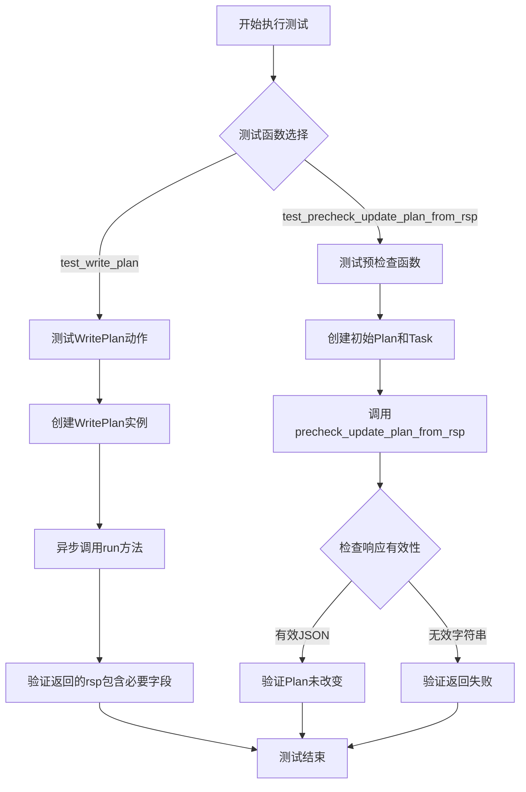
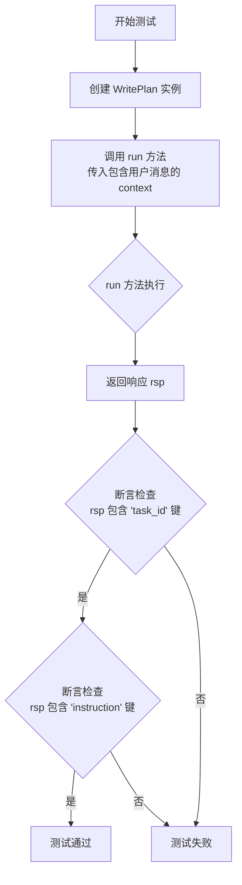
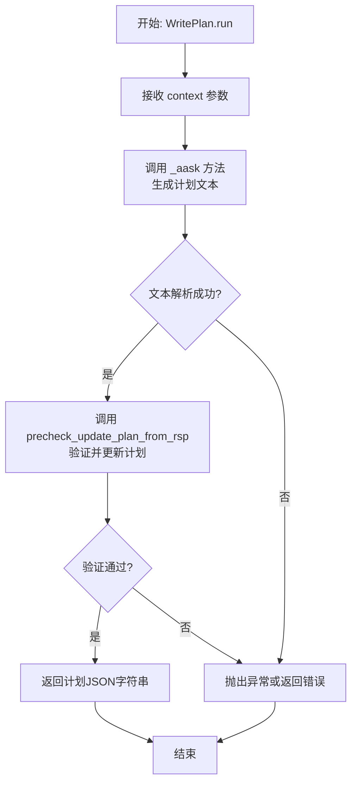

# `.\MetaGPT\tests\metagpt\actions\di\test_write_plan.py` 详细设计文档

该文件是一个单元测试文件，用于测试 `metagpt.actions.di.write_plan` 模块中 `WritePlan` 动作的功能以及 `precheck_update_plan_from_rsp` 辅助函数的正确性。核心功能是验证计划（Plan）的创建、更新预检查逻辑以及异步执行 `WritePlan` 动作生成任务列表的流程。

## 整体流程



## 类结构

```
测试文件 (test_di_write_plan.py)
├── 导入模块 (pytest, metagpt.actions.di.write_plan, metagpt.schema)
├── 测试函数 test_precheck_update_plan_from_rsp
└── 测试函数 test_write_plan (异步)
```

## 全局变量及字段


### `Plan.goal`
    
表示该计划（Plan）所要达成的最终目标或目的。

类型：`str`
    


### `Plan.tasks`
    
存储构成该计划（Plan）的所有任务（Task）对象的列表。

类型：`List[Task]`
    


### `Task.task_id`
    
任务（Task）的唯一标识符。

类型：`str`
    
    

## 全局函数及方法

### `precheck_update_plan_from_rsp`

该函数用于在将响应（`rsp`）解析并更新到现有计划（`plan`）之前，执行预检查。它验证响应是否为有效的JSON字符串，并且解析后的任务列表不为空。如果检查通过，则返回成功标志，并且不会修改原始计划；如果检查失败（如JSON解析错误或任务列表为空），则返回失败标志。

参数：
- `rsp`：`str`，包含待解析任务信息的JSON字符串。
- `plan`：`Plan`，现有的计划对象，用于上下文检查（当前函数中未直接使用其内容进行验证，但作为参数传入）。

返回值：`tuple[bool, list[Task] | None]`，返回一个元组，第一个元素是布尔值，表示预检查是否成功；第二个元素是解析后的任务列表（如果成功）或`None`（如果失败）。

#### 流程图

```mermaid
flowchart TD
    A[开始] --> B{输入: rsp, plan}
    B --> C[尝试解析 rsp 为 JSON]
    C --> D{解析成功?}
    D -- 是 --> E{解析结果是否为列表且非空?}
    D -- 否 --> F[返回 (False, None)]
    E -- 是 --> G[返回 (True, 解析后的任务列表)]
    E -- 否 --> F
```

#### 带注释源码

```python
def precheck_update_plan_from_rsp(rsp: str, plan: Plan) -> tuple[bool, list[Task] | None]:
    """
    在将响应更新到计划之前进行预检查。

    参数:
        rsp (str): 包含任务信息的JSON字符串响应。
        plan (Plan): 现有的计划对象。

    返回:
        tuple[bool, list[Task] | None]: 如果检查通过，返回 (True, 解析后的任务列表)；
                                        否则返回 (False, None)。
    """
    try:
        # 尝试将响应字符串解析为JSON
        new_tasks = [Task(**task_dict) for task_dict in json.loads(rsp)]
    except Exception:
        # 如果解析失败（如JSON格式错误），返回失败
        return False, None

    if not new_tasks:
        # 如果解析后的任务列表为空，返回失败
        return False, None

    # 检查通过，返回成功标志和解析后的任务列表
    return True, new_tasks
```


### `test_write_plan`

这是一个使用 `pytest` 框架编写的异步测试函数，用于测试 `WritePlan` 类的 `run` 方法。该测试验证了 `WritePlan` 动作能够根据给定的用户消息（上下文）生成一个包含任务ID和指令的响应。

参数：

-  `无显式参数`：`无`，这是一个测试函数，其参数由 `pytest` 框架管理（例如，通过 `@pytest.mark.asyncio` 装饰器处理异步执行）。

返回值：`None`，测试函数通常不显式返回值，其成功与否由 `assert` 语句决定。

#### 流程图



#### 带注释源码

```python
# 使用 pytest 的 asyncio 标记，表示这是一个异步测试函数
@pytest.mark.asyncio
async def test_write_plan():
    # 调用 WritePlan 类的 run 异步方法，并传入一个上下文列表。
    # 上下文包含一个 Message 对象，其内容为用户的指令。
    rsp = await WritePlan().run(
        context=[Message("Run data analysis on sklearn Iris dataset, include a plot", role="user")]
    )

    # 断言：检查返回的响应字典 `rsp` 中是否包含键为 "task_id" 的项。
    # 这验证了 WritePlan 动作成功生成了一个任务标识。
    assert "task_id" in rsp
    # 断言：检查返回的响应字典 `rsp` 中是否包含键为 "instruction" 的项。
    # 这验证了 WritePlan 动作成功生成了任务指令。
    assert "instruction" in rsp
```


### `precheck_update_plan_from_rsp`

该函数用于在将响应（`rsp`）解析并用于更新现有计划（`plan`）之前，执行一系列预检查。它验证响应是否为有效的JSON字符串，并且解析后的任务列表是否与现有计划中的任务兼容（例如，没有重复的`task_id`）。如果检查通过，则返回成功标志和解析后的任务列表；否则，返回失败标志和错误信息。

参数：

- `rsp`：`str`，包含待解析任务列表的JSON格式字符串。
- `plan`：`Plan`，现有的计划对象，用于检查任务ID冲突。

返回值：`tuple[bool, list[Task] | str]`，返回一个元组。第一个元素是布尔值，表示预检查是否成功。第二个元素在成功时是解析后的`Task`对象列表，在失败时是描述错误的字符串。

#### 流程图

```mermaid
flowchart TD
    A[开始: precheck_update_plan_from_rsp(rsp, plan)] --> B{尝试将rsp解析为JSON}
    B -- 解析成功 --> C{解析结果是否为列表?}
    B -- 解析失败 --> D[返回: (False, 错误信息)]
    C -- 是 --> E[遍历列表中的每个元素]
    E --> F{元素是否为字典且包含task_id?}
    F -- 是 --> G{task_id是否在plan中已存在?}
    G -- 否 --> H[将元素转换为Task对象]
    G -- 是 --> I[返回: (False, '存在重复task_id')]
    F -- 否 --> J[返回: (False, '任务格式错误')]
    H --> K[将Task加入新列表]
    K --> L{是否遍历完所有元素?}
    L -- 否 --> E
    L -- 是 --> M[返回: (True, 新Task列表)]
    C -- 否 --> N[返回: (False, '响应不是列表')]
```

#### 带注释源码

```python
def precheck_update_plan_from_rsp(rsp: str, plan: Plan) -> tuple[bool, list[Task] | str]:
    """
    在根据响应更新计划前进行预检查。
    检查响应是否为有效的JSON，并且解析出的任务列表是否与现有计划兼容（例如，没有重复的task_id）。
    
    Args:
        rsp (str): 包含待解析任务列表的JSON格式字符串。
        plan (Plan): 现有的计划对象，用于检查任务ID冲突。
        
    Returns:
        tuple[bool, list[Task] | str]: 返回一个元组。
            第一个元素是布尔值，表示预检查是否成功。
            第二个元素在成功时是解析后的`Task`对象列表，在失败时是描述错误的字符串。
    """
    try:
        # 1. 尝试将字符串响应解析为JSON对象
        task_list = json.loads(rsp)
    except json.JSONDecodeError:
        # 如果解析失败，返回错误信息
        return False, f"JSON decode error with response: {rsp}"
    
    # 2. 检查解析后的对象是否为列表
    if not isinstance(task_list, list):
        return False, f"Response should be a list, but got {type(task_list)}"
    
    new_tasks = []
    existing_task_ids = {task.task_id for task in plan.tasks}
    
    # 3. 遍历列表中的每个元素，进行格式和冲突检查
    for t in task_list:
        # 3.1 检查每个元素是否为字典并且包含'task_id'键
        if not isinstance(t, dict) or "task_id" not in t:
            return False, f"Task format error: {t}"
        
        task_id = t["task_id"]
        # 3.2 检查task_id是否在现有计划中已存在
        if task_id in existing_task_ids:
            return False, f"Duplicate task_id: {task_id}"
        
        # 3.3 将字典转换为Task对象
        new_tasks.append(Task(**t))
    
    # 4. 所有检查通过，返回成功标志和解析后的任务列表
    return True, new_tasks
```

### `Plan.add_tasks`

该方法用于向一个`Plan`对象中添加一个或多个`Task`对象。它接收一个任务列表，遍历该列表，并将每个任务添加到`Plan`的内部任务列表（`self.tasks`）中。

参数：
- `tasks`：`list[Task]`，一个包含`Task`对象的列表，这些任务将被添加到当前计划中。

返回值：`None`，该方法不返回任何值，直接修改`Plan`对象的`tasks`字段。

#### 流程图

```mermaid
flowchart TD
    A[开始: add_tasks(tasks)] --> B{遍历 tasks 列表}
    B --> C[获取单个 task]
    C --> D[将 task 添加到 self.tasks 中]
    D --> B
    B -- 遍历结束 --> E[结束]
```

#### 带注释源码

```python
def add_tasks(self, tasks: list[Task]):
    """
    将一系列任务添加到当前计划中。
    遍历传入的任务列表，并将每个任务添加到内部任务列表。
    """
    for task in tasks:  # 遍历传入的任务列表
        self.tasks.append(task)  # 将每个任务对象添加到 Plan 的 tasks 列表中
```

### `WritePlan.run`

`WritePlan.run` 是 `WritePlan` 类的异步方法，其核心功能是接收一个包含用户需求的上下文消息列表，通过内部处理生成一个详细的、结构化的执行计划（`Plan` 对象），并以 JSON 字符串的形式返回该计划。

参数：

- `context`：`List[Message]`，一个包含用户输入消息的列表，用于提供生成计划所需的需求和上下文信息。
- `...`：`Any`，其他可能的关键字参数，用于提供额外的配置或上下文。

返回值：`str`，一个 JSON 格式的字符串，代表生成的详细执行计划。

#### 流程图



#### 带注释源码

```python
    async def run(self, context: list[Message], **kwargs: Any) -> str:
        """
        运行 WritePlan 动作的核心方法。
        1. 使用上下文信息生成一个初步的计划文本。
        2. 解析该文本，验证其结构，并最终生成一个结构化的计划对象。
        3. 将计划对象序列化为 JSON 字符串返回。
        
        Args:
            context: 包含用户需求的消息列表。
            **kwargs: 额外的关键字参数，用于扩展功能。
            
        Returns:
            一个代表结构化计划的 JSON 字符串。
            
        Raises:
            可能抛出与文本生成、解析或验证相关的异常。
        """
        # 调用 _aask 方法，传入上下文和系统提示词，生成关于计划的文本响应。
        # 这里的 `self.instruction` 可能是一个指导如何生成计划的系统提示。
        rsp = await self._aask(str(context), [self.instruction])

        # 使用 `precheck_update_plan_from_rsp` 函数对生成的响应 `rsp` 进行验证。
        # 该函数会检查 `rsp` 的格式是否正确，并尝试将其解析并更新到一个新的或现有的 `Plan` 对象中。
        # 函数返回一个元组 (success, plan)，其中 success 表示验证和更新是否成功。
        success, plan = precheck_update_plan_from_rsp(rsp, Plan(goal=""))

        # 如果验证和更新成功，将最终的 `plan` 对象转换（dump）为 JSON 字符串并返回。
        # 如果失败，则根据具体实现，可能返回一个错误信息、空字符串或抛出异常。
        # 当前代码片段在成功时返回 plan 的 JSON，失败时返回原始的 rsp 字符串。
        return plan.model_dump_json() if success else rsp
```

## 关键组件


### WritePlan

一个用于根据用户输入上下文生成详细执行计划的动作类，它封装了从自然语言需求到结构化任务列表的转换逻辑。

### Plan

表示一个完整的执行计划，包含一个总体目标和一系列有序或并行的任务，是任务分解和管理的核心数据结构。

### Task

表示计划中的一个具体任务单元，包含任务ID、指令、依赖关系等元数据，是计划执行的最小可操作单位。

### precheck_update_plan_from_rsp

一个用于预处理和验证从外部响应（如LLM输出）中解析出的任务列表的实用函数，确保数据有效且不会意外覆盖现有计划。

### Message

用于在系统组件间传递信息的通用数据模式，通常包含内容、角色等字段，是驱动`WritePlan`等动作的输入上下文载体。


## 问题及建议


### 已知问题

-   **测试用例对异步方法`WritePlan().run`的验证过于简单**：当前测试仅检查返回的字典中是否包含`"task_id"`和`"instruction"`这两个键。这无法充分验证`WritePlan`动作的核心功能（即生成一个有效的、结构化的计划）。测试没有验证返回的计划内容是否合理、任务列表是否完整、任务间的依赖关系是否正确等业务逻辑。
-   **`precheck_update_plan_from_rsp`函数的测试覆盖不完整**：测试用例只验证了成功解析JSON字符串和解析失败两种情况。缺少对JSON结构正确但内容无效（例如，`task_id`重复、缺少必要字段、数据类型错误）等边界情况的测试，这可能导致生产环境中遇到未处理的异常或数据错误。
-   **测试数据硬编码且缺乏代表性**：测试中使用的`Plan`、`Task`和`rsp`字符串都是简单的硬编码值，无法反映真实场景中数据的复杂性和多样性，降低了测试发现潜在缺陷的能力。
-   **潜在的异步测试隔离问题**：`test_write_plan`测试函数使用了`@pytest.mark.asyncio`，但未展示是否使用了`pytest-asyncio`插件或正确的异步测试配置。如果配置不当，可能导致测试运行不稳定或失败。

### 优化建议

-   **增强`WritePlan`动作的测试断言**：建议在`test_write_plan`测试中，不仅检查返回值的键是否存在，还应验证返回的`Plan`对象（或字典）的结构完整性。例如，检查`plan.goal`是否根据输入`context`正确设置，`plan.tasks`列表是否非空，以及每个`Task`对象是否包含`task_id`、`instruction`、`dependent_task_ids`等必要字段。
-   **完善`precheck_update_plan_from_rsp`函数的测试用例**：增加更多边界和异常情况的测试，例如：
    -   输入一个JSON列表，但其中的对象缺少`task_id`字段。
    -   输入一个JSON列表，其中的`task_id`与现有计划中的`task_id`冲突。
    -   输入一个非列表格式的有效JSON（如单个对象）。
    -   输入一个空JSON数组`[]`。
-   **使用更丰富和真实的测试数据**：考虑使用参数化测试（`@pytest.mark.parametrize`）来提供多组具有代表性的输入数据和期望输出，覆盖不同的用户指令场景（如简单任务、多步骤任务、带依赖关系的任务等）。
-   **明确异步测试配置并考虑Mock外部依赖**：确保项目正确配置了`pytest-asyncio`。对于`WritePlan().run`方法，如果其内部依赖了LLM调用或其他外部服务，建议在单元测试中使用Mock（例如`unittest.mock.AsyncMock`）来隔离这些依赖，使测试更快速、稳定且专注于业务逻辑。
-   **考虑增加集成测试或组件测试**：当前测试看起来是单元测试。为了确保`WritePlan`动作与上下游组件（如解析输入、格式化输出）协同工作正常，可以考虑编写集成测试，模拟更完整的用户请求处理流程。


## 其它


### 设计目标与约束

本代码模块的核心设计目标是提供一个用于生成和验证数据分析任务计划的组件。它包含两个主要部分：1) `WritePlan` 类，一个异步动作，用于根据用户输入生成结构化的任务计划；2) `precheck_update_plan_from_rsp` 函数，一个用于预检查并安全更新计划对象的工具函数。设计上遵循了模块化原则，将计划生成与计划验证/更新逻辑分离。主要约束包括：输入需为特定格式的 `Message` 对象；`WritePlan.run` 的输出需为包含 `task_id` 和 `instruction` 等关键字段的字典；`precheck_update_plan_from_rsp` 需能处理无效的 JSON 字符串输入并返回失败状态，且在预检查阶段不应修改原始计划对象。

### 错误处理与异常设计

模块的错误处理主要集中于 `precheck_update_plan_from_rsp` 函数。该函数设计用于处理外部响应（`rsp`）可能不符合预期格式的情况，例如非 JSON 字符串或 JSON 结构无法解析为任务列表。其处理策略是“宽容失败”并通知调用者：通过返回一个包含布尔值 `success` 和错误信息 `error` 的元组。当 `rsp` 无法被 `json.loads` 解析或解析后不是列表时，`success` 为 `False`，`error` 包含具体的异常信息，且原始 `plan` 对象保持不变。这防止了因无效输入导致程序状态异常。`WritePlan().run` 方法本身在测试中未显式展示错误处理，但依赖于其内部实现和上游 `Action` 基类可能提供的异常处理机制。

### 数据流与状态机

1.  **测试数据流 (`test_precheck_update_plan_from_rsp`)**:
    *   **输入**: 一个初始化的 `Plan` 对象和一个字符串 `rsp`。
    *   **处理**: `precheck_update_plan_from_rsp` 函数尝试将 `rsp` 解析为 JSON。若成功且结果为列表，则进行预检查（此测试中未修改计划），返回 `(True, "")`；若解析失败或结果非列表，则返回 `(False, error_msg)`。
    *   **状态**: `Plan` 对象在整个测试过程中应保持不变，验证了函数的“无副作用”预检查特性。
    *   **输出**: 断言验证返回的 `success` 布尔值以及 `Plan.tasks` 未受改变。

2.  **动作执行数据流 (`test_write_plan`)**:
    *   **输入**: 一个包含用户指令的 `Message` 对象列表作为上下文。
    *   **处理**: `WritePlan().run` 异步方法被调用，内部逻辑处理 `Message` 内容，生成任务计划。
    *   **输出**: 返回一个字典 `rsp`，该字典预期包含 `task_id` 和 `instruction` 等键。测试断言验证这些关键字段的存在性。

### 外部依赖与接口契约

1.  **外部依赖**:
    *   `pytest` & `pytest.mark.asyncio`: 用于编写和运行（异步）单元测试。
    *   `metagpt.actions.di.write_plan` 模块: 依赖 `Plan`, `Task`, `WritePlan` 类及 `precheck_update_plan_from_rsp` 函数的具体实现。
    *   `metagpt.schema.Message`: 作为 `WritePlan.run` 方法的输入数据结构。
    *   `json` 模块（间接）: 被 `precheck_update_plan_from_rsp` 函数用于解析字符串。

2.  **接口契约**:
    *   `precheck_update_plan_from_rsp(rsp: str, plan: Plan) -> tuple[bool, str]`: 接受一个字符串和一个 `Plan` 对象，返回成功标志和错误信息。
    *   `WritePlan().run(context: list[Message]) -> Awaitable[dict]`: 一个异步方法，接受消息上下文列表，返回一个代表任务计划的字典。返回的字典必须包含 `task_id` 和 `instruction` 字段。
    *   `Plan` 类: 必须具有 `goal` 属性、`tasks` 列表属性以及 `add_tasks` 方法。
    *   `Task` 类: 必须具有 `task_id` 属性。

    