# `.\MetaGPT\tests\metagpt\actions\mock_json.py` 详细设计文档

该文件是一个模拟的软件项目文档生成器，它通过定义PRD（产品需求文档）、DESIGN（设计文档）和TASK（任务分解）三个字典结构，模拟了一个从需求分析到代码实现的完整软件开发流程。核心功能是展示如何将产品需求（如创建一个CLI贪吃蛇游戏）结构化地分解为设计、任务列表和具体的代码实现（包含一个未完成的Game类），并附带了一次代码审查的反馈。

## 整体流程

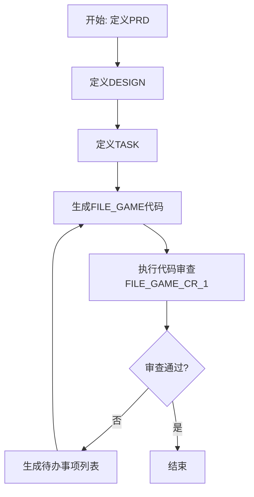

## 类结构

```
mock_json.py (主文件)
├── 全局字典: PRD, DESIGN, TASK
├── 全局字符串: FILE_GAME, FILE_GAME_CR_1
└── 代码片段中的类结构:
    ├── Point
    └── Game
```

## 全局变量及字段


### `PRD`
    
产品需求文档，包含项目需求、用户故事、竞品分析等产品定义信息

类型：`dict`
    


### `DESIGN`
    
设计文档，包含实现方法、文件列表、数据结构、程序调用流程等设计信息

类型：`dict`
    


### `TASK`
    
任务文档，包含所需包、逻辑分析、任务列表等开发任务信息

类型：`dict`
    


### `FILE_GAME`
    
game.py 文件的源代码内容

类型：`str`
    


### `FILE_GAME_CR_1`
    
针对 game.py 的代码审查报告，包含问题分析和行动项

类型：`str`
    


### `Point.x`
    
点在二维平面上的横坐标

类型：`int`
    


### `Point.y`
    
点在二维平面上的纵坐标

类型：`int`
    


### `Game.width`
    
游戏窗口的宽度（像素）

类型：`int`
    


### `Game.height`
    
游戏窗口的高度（像素）

类型：`int`
    


### `Game.score`
    
玩家当前的游戏得分

类型：`int`
    


### `Game.speed`
    
游戏循环的帧率，控制蛇的移动速度

类型：`int`
    


### `Game.snake`
    
表示蛇身体的点列表，列表头部为蛇头

类型：`List[Point]`
    


### `Game.food`
    
食物在游戏窗口中的位置

类型：`Point`
    


### `Game._display`
    
Pygame 显示表面对象，用于绘制游戏画面

类型：`pygame.Surface`
    


### `Game._clock`
    
Pygame 时钟对象，用于控制游戏帧率

类型：`pygame.time.Clock`
    


### `Game._running`
    
游戏主循环的运行状态标志

类型：`bool`
    
    

## 全局函数及方法

### `Point.__init__`

`Point` 类的构造函数，用于初始化一个表示二维空间中一个点的对象。它接收点的 x 和 y 坐标，并将其存储为对象的属性。

参数：
-  `x`：`int`，点的 x 坐标
-  `y`：`int`，点的 y 坐标

返回值：`None`，构造函数不返回任何值

#### 流程图

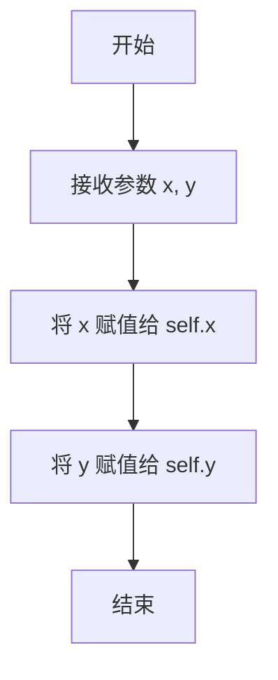

#### 带注释源码

```python
def __init__(self, x: int, y: int):
    # 将传入的 x 坐标赋值给实例变量 self.x
    self.x = x
    # 将传入的 y 坐标赋值给实例变量 self.y
    self.y = y
```

### `Game.__init__`

该方法用于初始化贪吃蛇游戏实例，设置游戏的基本参数（如画布宽度、高度、速度），并初始化游戏状态（如得分、蛇的初始位置和食物的位置）。

参数：

- `width`：`int`，游戏画布的宽度（以像素为单位）
- `height`：`int`，游戏画布的高度（以像素为单位）
- `speed`：`int`，游戏运行的速度（帧率，控制游戏循环的刷新频率）

返回值：`None`，构造函数不返回任何值

#### 流程图

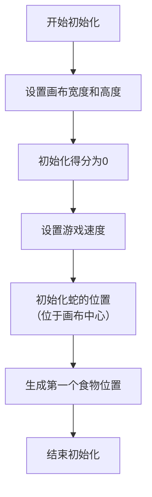

#### 带注释源码

```python
def __init__(self, width: int, height: int, speed: int):
    # 设置游戏画布的宽度
    self.width = width
    # 设置游戏画布的高度
    self.height = height
    # 初始化游戏得分
    self.score = 0
    # 设置游戏速度（帧率）
    self.speed = speed
    # 初始化蛇的身体，起始位置为画布中心
    # 蛇的身体用一个Point对象列表表示
    self.snake = [Point(width // 2, height // 2)]
    # 调用私有方法生成第一个食物位置
    self.food = self._create_food()
```

### `Game.start_game`

该方法初始化并启动贪吃蛇游戏的主循环。它负责设置Pygame显示窗口、游戏时钟，并进入一个持续运行的游戏循环，直到游戏结束或玩家退出。在循环中，它依次处理用户输入事件、更新蛇的位置和食物状态、检查碰撞，并绘制当前游戏画面。

参数：
-  `self`：`Game`，当前Game类的实例

返回值：`None`，无返回值

#### 流程图

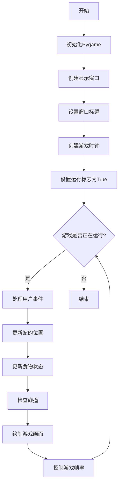

#### 带注释源码

```python
def start_game(self):
    # 初始化Pygame库的所有模块
    pygame.init()
    # 创建一个指定宽度和高度的游戏显示窗口
    self._display = pygame.display.set_mode((self.width, self.height))
    # 设置游戏窗口的标题
    pygame.display.set_caption('Snake Game')
    # 创建一个时钟对象，用于控制游戏帧率
    self._clock = pygame.time.Clock()
    # 设置游戏运行状态标志为True
    self._running = True

    # 游戏主循环：只要`_running`为True就持续运行
    while self._running:
        # 处理所有Pygame事件（如退出事件）
        self._handle_events()
        # 根据当前方向更新蛇的身体位置
        self._update_snake()
        # 检查蛇是否吃到食物，并相应更新食物位置
        self._update_food()
        # 检查蛇是否撞墙或撞到自己
        self._check_collision()
        # 清屏并绘制蛇和食物
        self._draw_screen()
        # 控制游戏循环的速度，`self.speed`决定了每秒的帧数
        self._clock.tick(self.speed)
```

### `Game.change_direction`

该方法用于根据用户输入更新贪吃蛇的移动方向。它接收一个表示方向的字符串，并相应地更新蛇的内部方向状态，从而影响蛇在游戏循环中的移动行为。

参数：

- `direction`：`str`，表示蛇的新移动方向。预期值为 `"UP"`、`"DOWN"`、`"LEFT"`、`"RIGHT"` 之一。

返回值：`None`，此方法不返回任何值，仅更新内部状态。

#### 流程图

```mermaid
flowchart TD
    A[开始: change_direction(direction)] --> B{方向是否有效?}
    B -- 是 --> C[更新蛇的当前方向]
    C --> D[结束]
    B -- 否 --> D
```

#### 带注释源码

```python
def change_direction(self, direction: str):
    # Update the direction of the snake based on user input
    pass
```


### `Game.game_over`

该方法用于处理游戏结束的逻辑，包括显示游戏结束信息、更新游戏状态以及处理可能的后续操作（如重置游戏或退出）。在当前代码框架中，它是一个待实现的方法。

参数：
-  `self`：`Game`，指向当前Game类实例的引用。

返回值：`None`，此方法不返回任何值。

#### 流程图

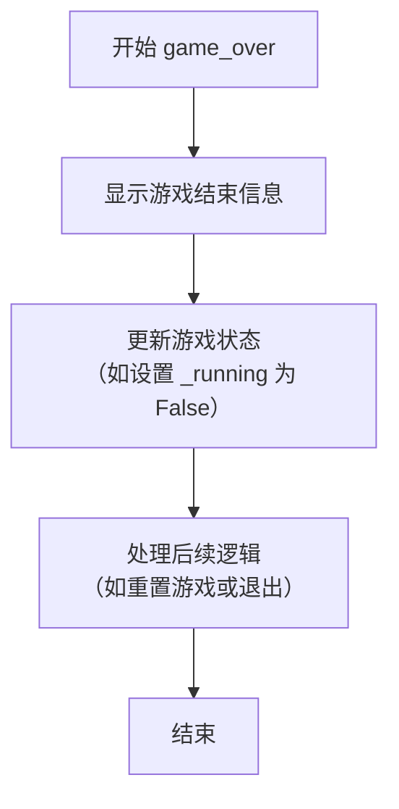

#### 带注释源码

```
def game_over(self):
    # Display game over message and handle game over logic
    pass
```


### `Game._create_food`

该方法用于在游戏区域内随机生成一个新的食物点。它通过随机数生成器在游戏画布的宽度和高度范围内随机选择一个坐标点，并返回一个表示该食物位置的`Point`对象。

参数：

-  `self`：`Game`，当前游戏实例的引用。

返回值：`Point`，一个表示食物位置的`Point`对象，其`x`和`y`坐标在游戏画布的有效范围内。

#### 流程图

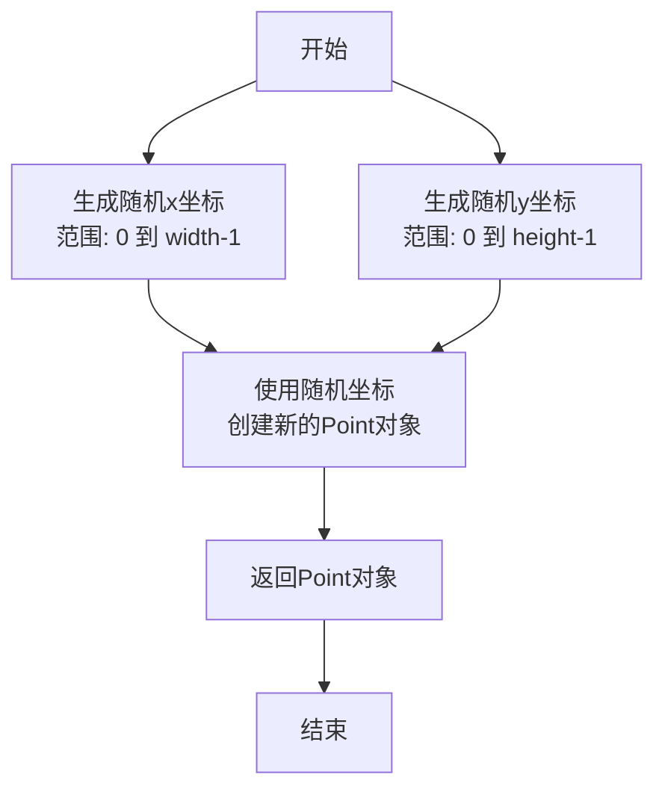

#### 带注释源码

```python
def _create_food(self) -> Point:
    # 创建一个新的食物点
    # 使用random.randint在游戏画布的有效范围内（0 到 width-1 和 0 到 height-1）随机生成x和y坐标
    # 返回一个用这些坐标初始化的Point对象
    return Point(random.randint(0, self.width - 1), random.randint(0, self.height - 1))
```

### `Game._handle_events`

该方法负责处理游戏主循环中的所有Pygame事件。它监听用户输入（如键盘按键、窗口关闭事件）并相应地更新游戏状态。当前实现仅处理了`pygame.QUIT`事件，用于优雅地退出游戏。

参数：
-  `self`：`Game`，`Game`类的实例，用于访问和修改游戏状态。

返回值：`None`，此方法不返回任何值。

#### 流程图

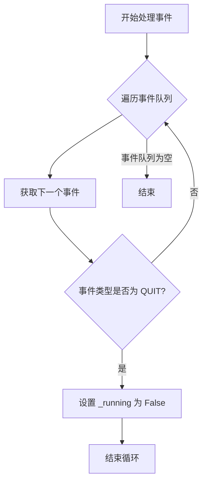

#### 带注释源码

```python
def _handle_events(self):
    # 遍历Pygame事件队列中的所有事件
    for event in pygame.event.get():
        # 检查事件类型是否为“窗口关闭”事件
        if event.type == pygame.QUIT:
            # 如果是，则将游戏运行标志设置为False，以退出主游戏循环
            self._running = False
```

### `Game._update_snake`

该方法用于更新贪吃蛇的位置。它根据蛇的当前移动方向，计算蛇头的新位置，并将这个新位置插入到蛇身体列表的开头。如果蛇没有吃到食物，则移除蛇尾的最后一个位置，以保持蛇的长度不变；如果吃到了食物，则蛇的长度会增加，分数也会相应增加。

参数：
-  `self`：`Game`，表示`Game`类的当前实例。

返回值：`None`，该方法不返回任何值，仅更新实例的内部状态。

#### 流程图

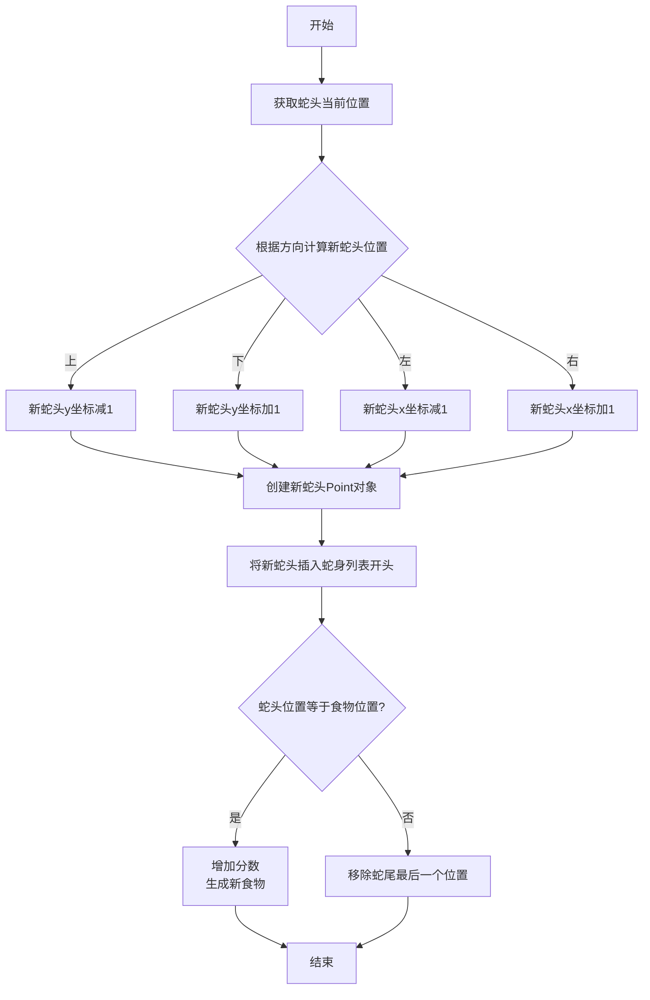

#### 带注释源码

```python
def _update_snake(self):
    """
    更新贪吃蛇的位置。
    根据当前方向移动蛇头，并在未吃到食物时移除蛇尾。
    """
    # 获取当前蛇头位置
    head = self.snake[0]
    # 根据当前方向计算新的蛇头位置
    if self.direction == 'UP':
        new_head = Point(head.x, head.y - 1)
    elif self.direction == 'DOWN':
        new_head = Point(head.x, head.y + 1)
    elif self.direction == 'LEFT':
        new_head = Point(head.x - 1, head.y)
    elif self.direction == 'RIGHT':
        new_head = Point(head.x + 1, head.y)
    else:
        # 默认方向为右
        new_head = Point(head.x + 1, head.y)

    # 将新的蛇头位置插入蛇身列表的开头
    self.snake.insert(0, new_head)

    # 检查蛇头是否吃到食物
    if new_head.x == self.food.x and new_head.y == self.food.y:
        # 吃到食物，增加分数并生成新的食物
        self.score += 1
        self.food = self._create_food()
    else:
        # 未吃到食物，移除蛇尾以保持长度不变
        self.snake.pop()
```

### `Game._update_food`

该方法用于更新游戏中的食物位置。当蛇头与食物位置重合时，表示蛇吃到了食物。此时，游戏分数会增加，蛇的身体会增长（通过不删除蛇尾实现），并在游戏区域内随机生成一个新的食物位置。

参数：
-  `self`：`Game`，表示当前游戏实例

返回值：`None`，该方法不返回任何值，直接修改游戏实例的内部状态。

#### 流程图

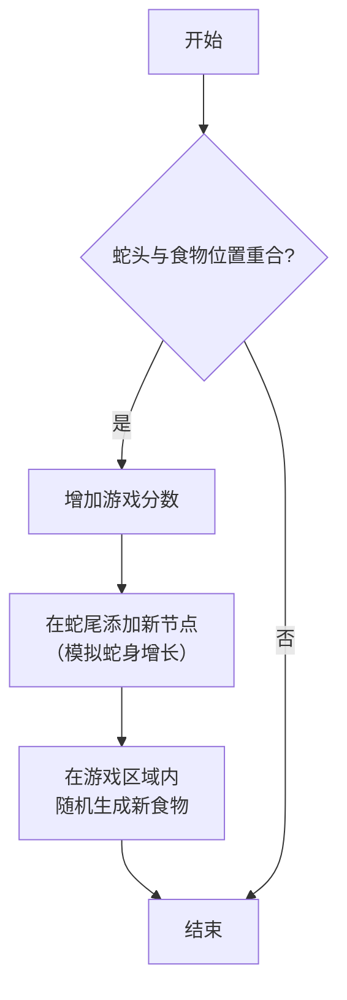

#### 带注释源码

```python
def _update_food(self):
    # 检查蛇头（snake列表的第一个元素）是否与食物位置重合
    if self.snake[0].x == self.food.x and self.snake[0].y == self.food.y:
        # 如果吃到食物，增加分数
        self.score += 1
        # 生成新的食物位置
        self.food = self._create_food()
        # 注意：这里没有删除蛇尾，所以蛇的长度会增加
        # 这是通过不在_update_snake中删除蛇尾来实现的
```

### `Game._check_collision`

该方法用于检查贪吃蛇是否与游戏边界或自身发生碰撞，是游戏逻辑中判断游戏是否结束的核心方法。

参数：
-  `self`：`Game`，指向当前Game实例的引用，用于访问游戏状态（如蛇的位置、游戏区域尺寸）。

返回值：`None`，该方法不返回值，其功能是检测到碰撞后调用`self.game_over()`方法结束游戏。

#### 流程图

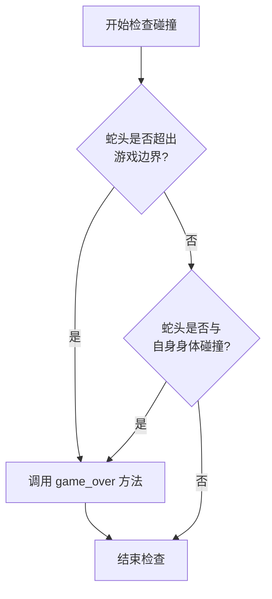

#### 带注释源码

```
def _check_collision(self):
    # 检查贪吃蛇是否与游戏边界或自身发生碰撞
    head = self.snake[0]  # 获取蛇头位置

    # 检查蛇头是否撞到游戏区域的边界（墙壁）
    if head.x < 0 or head.x >= self.width or head.y < 0 or head.y >= self.height:
        self.game_over()  # 如果撞墙，游戏结束
        return

    # 检查蛇头是否撞到了自己的身体（从蛇身的第二个节点开始检查，因为第一个节点是蛇头本身）
    for segment in self.snake[1:]:
        if head.x == segment.x and head.y == segment.y:
            self.game_over()  # 如果撞到自己，游戏结束
            return
```

### `Game._draw_screen`

该方法负责在每一帧游戏循环中绘制整个游戏画面。它首先清空屏幕，然后绘制贪吃蛇和食物，最后更新显示。

参数：
-  `self`：`Game`，当前Game类的实例

返回值：`None`，无返回值

#### 流程图

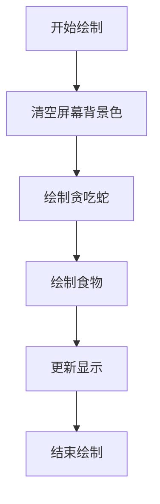

#### 带注释源码

```python
def _draw_screen(self):
    # 使用黑色填充整个显示表面，以清空上一帧的画面
    self._display.fill((0, 0, 0))
    # 绘制贪吃蛇和食物到屏幕上
    # 注意：此处的绘制逻辑（如蛇和食物的具体形状、颜色）尚未实现
    pygame.display.update() # 更新整个显示表面，将绘制的内容呈现到屏幕上
```

## 关键组件


### 游戏核心逻辑 (Game Class)

负责管理贪吃蛇游戏的核心状态与流程，包括游戏初始化、游戏循环、蛇的移动、食物生成、碰撞检测以及游戏结束逻辑。

### 点坐标表示 (Point Class)

用于表示游戏界面上的一个坐标点，是构成蛇身体和食物的基本单位。

### 用户输入处理 (Event Handling)

负责监听和处理用户的键盘输入事件，以控制蛇的移动方向。

### 游戏渲染 (Screen Rendering)

负责在游戏窗口中绘制游戏元素，包括蛇、食物、背景以及游戏状态信息（如分数）。

### 游戏循环与时钟控制 (Game Loop & Clock)

控制游戏的主循环，确保游戏以恒定的帧率（速度）运行，并协调事件处理、状态更新和屏幕渲染的时序。


## 问题及建议


### 已知问题

-   **核心游戏逻辑缺失**：代码中多个关键方法（如 `change_direction`, `_update_snake`, `_update_food`, `_check_collision`, `game_over`）仅包含 `pass` 语句或空实现，导致游戏无法正常运行。这是最严重的技术债务。
-   **代码结构不完整**：`FILE_GAME` 中定义的 `Game` 类缺少方向控制逻辑（如 `direction` 字段）和游戏状态管理（如 `game_over` 状态），使得游戏循环无法处理用户输入和状态转换。
-   **潜在的性能与资源管理问题**：游戏主循环 `start_game` 中的 `while` 循环没有明确的退出条件（除了 `pygame.QUIT`），且未处理游戏结束后的资源清理（如 `pygame.quit()`）。
-   **代码审查结果未整合**：`FILE_GAME_CR_1` 中详细指出了代码的缺失部分和待办事项（Actions），但这些反馈并未反映在 `FILE_GAME` 的最终代码中，导致设计与实现脱节。
-   **缺乏错误处理与鲁棒性**：代码中没有对潜在错误（如无效的用户输入、初始化失败）进行捕获和处理，程序健壮性不足。
-   **硬编码与配置化不足**：游戏参数（如屏幕尺寸、速度、颜色）在代码中硬编码，不利于后续调整难度、主题或进行测试。

### 优化建议

-   **实现核心游戏逻辑**：根据 `FILE_GAME_CR_1` 中的“Actions”部分，优先实现 `change_direction`, `_update_snake`, `_update_food`, `_check_collision`, `game_over` 等方法。这是项目推进的首要任务。
-   **重构 `Game` 类以完善状态管理**：在 `Game` 类中增加 `direction`（当前移动方向）、`game_over_flag`（游戏结束标志）等字段，并确保 `start_game` 循环能根据这些状态正确更新和渲染。
-   **增强资源管理与退出逻辑**：在 `game_over` 方法中或游戏循环结束后，确保调用 `pygame.quit()` 来正确释放 Pygame 资源。同时，为游戏循环提供更清晰的退出路径。
-   **整合代码审查反馈**：建立机制确保代码审查（如 `FILE_GAME_CR_1`）中指出的问题能在后续迭代中得到修复，避免设计与实现持续偏离。
-   **增加异常处理与输入验证**：在关键操作（如初始化 Pygame、处理用户输入）周围添加 `try-except` 块，并对 `change_direction` 等方法接收的参数进行有效性校验。
-   **将配置参数外部化**：考虑将游戏宽度、高度、速度、颜色等参数提取到配置文件（如 `config.py`）或作为 `Game.__init__` 的可选参数，提高代码的可配置性和可测试性。
-   **分离关注点**：考虑将游戏逻辑（`Game` 类）、渲染逻辑（`_draw_screen` 中的绘图代码）和输入处理（`_handle_events`）进一步解耦，例如引入独立的 `Renderer` 和 `InputHandler` 类，以提高代码的可维护性和可测试性。
-   **补充单元测试**：为核心游戏逻辑（如碰撞检测、蛇的移动、食物生成）编写单元测试，确保功能正确性，并为后续重构提供保障。


## 其它


### 设计目标与约束

本项目的核心设计目标是创建一个简单、易用、跨平台的命令行贪吃蛇游戏。主要约束包括：使用Python作为开发语言，采用Pygame库进行图形渲染和事件处理，确保代码结构清晰、易于维护，并支持基本的游戏功能（如移动、吃食物、碰撞检测、分数计算）和用户交互（如开始、结束、重新开始）。项目需遵循面向对象设计原则，将游戏逻辑与界面渲染分离。

### 错误处理与异常设计

当前代码中错误处理机制较为薄弱。主要潜在异常包括：Pygame初始化失败、游戏窗口创建失败、无效的用户输入方向、以及游戏状态更新时的逻辑错误。建议在`start_game`方法中增加Pygame初始化的异常捕获；在`change_direction`方法中验证输入方向的合法性；在游戏主循环的关键步骤（如`_update_snake`, `_check_collision`）中加入状态断言或日志记录，以便于调试。`game_over`方法应能妥善处理游戏结束状态，并安全地释放Pygame资源。

### 数据流与状态机

游戏的核心数据流围绕`Game`类的状态进行。主要状态包括：`INIT`（初始化）、`RUNNING`（运行中）、`PAUSED`（暂停，当前未实现）、`GAME_OVER`（游戏结束）。状态转换由用户输入（如退出事件、方向键）和游戏内部逻辑（如碰撞检测）触发。`snake`（蛇身坐标列表）和`food`（食物坐标）是核心数据实体，其更新（`_update_snake`, `_update_food`）和关系判断（`_check_collision`）驱动了游戏进程和`score`（分数）的变化。`_running`布尔变量是控制游戏主循环的关键状态标志。

### 外部依赖与接口契约

本项目主要外部依赖是`pygame`库（版本2.0.1），用于提供图形显示、事件处理和定时功能。`Game`类对外提供的接口契约主要包括：构造函数（`__init__`，接受游戏区域宽、高和速度参数）、`start_game`（启动游戏主循环）、`change_direction`（改变蛇的移动方向）。这些方法构成了与主程序（`main.py`）或其他潜在调用者之间的主要契约。内部方法（以`_`开头）被视为私有实现细节。`Point`类是一个简单的数据容器，用于表示二维坐标。

### 测试策略与可测试性

当前代码未包含任何测试。为提高可测试性，建议将游戏核心逻辑（如碰撞检测、食物生成、蛇身移动算法）从Pygame的渲染和事件循环中解耦。可以创建独立的函数或类方法来处理这些逻辑，使其能够在无图形界面的环境下进行单元测试。例如，`_check_collision`和`_create_food`方法应只依赖于`snake`、`food`、`width`、`height`等对象状态，而不依赖Pygame的显示模块，从而便于编写测试用例验证其正确性。集成测试可以模拟键盘事件来测试`change_direction`和完整的游戏流程。

### 部署与运行说明

项目运行依赖于Python环境及`pygame`库。部署时需通过`pip install -r requirements.txt`安装依赖（需创建该文件并列出`pygame==2.0.1`）。主入口文件为`game.py`，直接运行`python game.py`即可启动游戏。游戏以固定窗口大小（示例中为800x600）和速度（示例中为15帧/秒）运行。未来优化可考虑通过命令行参数或配置文件来定制这些初始设置，以增加灵活性。

    