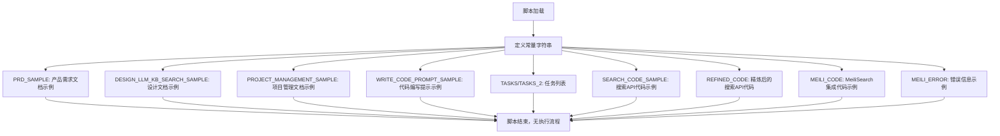
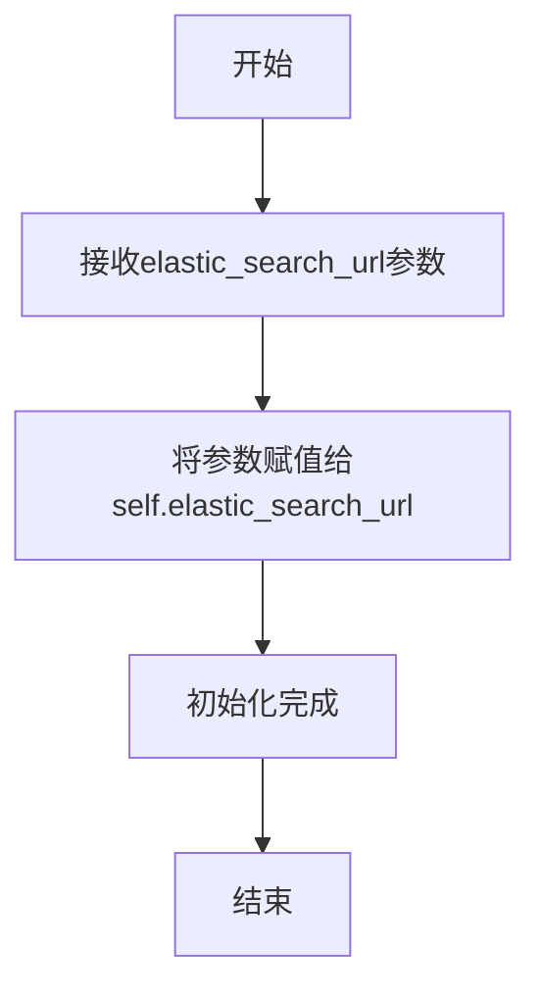
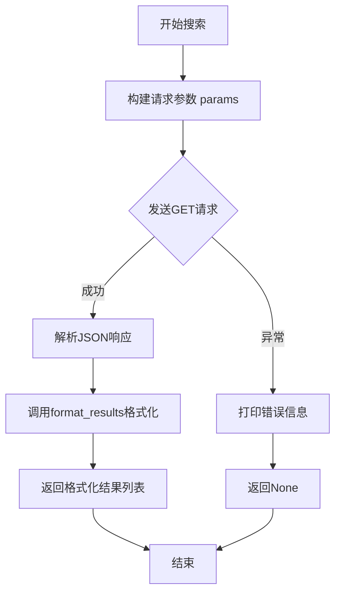
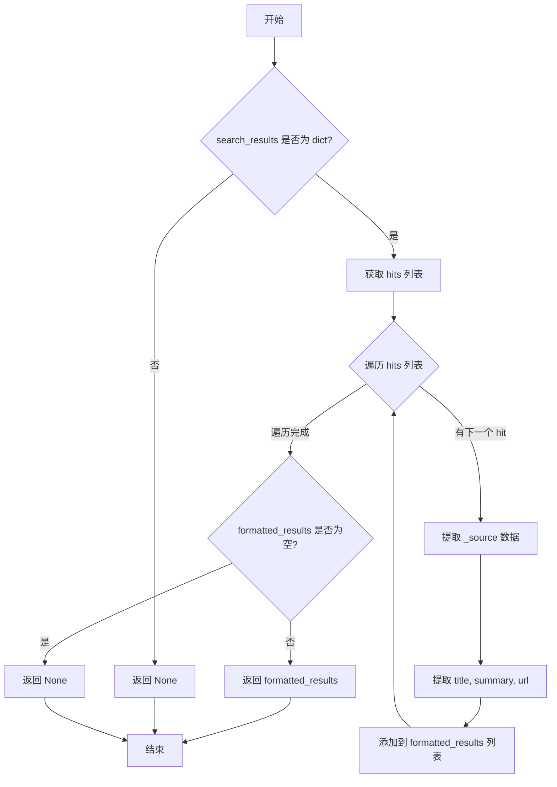
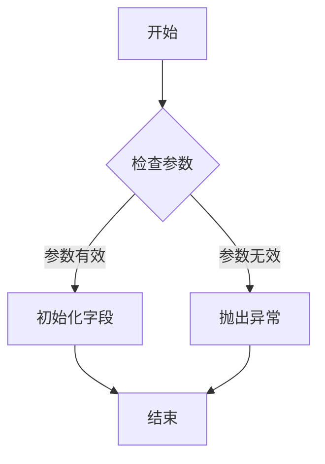
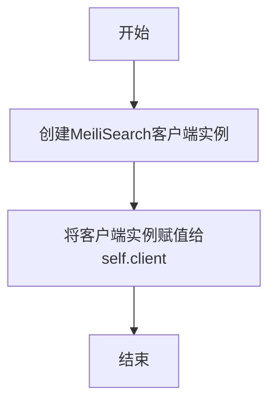
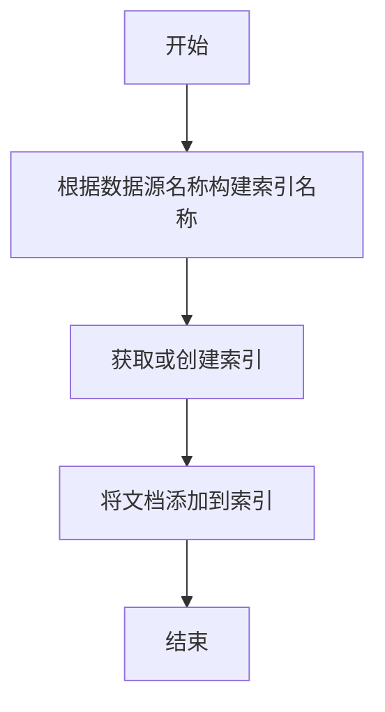

# `.\MetaGPT\tests\metagpt\actions\mock_markdown.py` 详细设计文档

该文件是一个包含多个示例文档片段的Python脚本，主要用于演示或模拟在软件开发过程中可能生成的各种设计文档、需求文档、项目管理文档和代码示例的格式与内容。它本身不构成一个可运行的程序，而是作为文档模板或示例的集合。

## 整体流程



## 类结构

```
无类层次结构 (本文件仅包含全局变量和函数定义)
├── 全局变量 (常量字符串)
└── 全局函数 (无)
```

## 全局变量及字段


### `PRD_SAMPLE`
    
产品需求文档的示例内容，包含原始需求、产品目标、用户故事、竞品分析、需求分析等部分，用于演示PRD的格式和内容。

类型：`str`
    


### `DESIGN_LLM_KB_SEARCH_SAMPLE`
    
设计文档的示例内容，包含实现方法、项目结构、数据结构和接口设计、程序调用流程等，用于展示基于LLM的知识库搜索系统的设计思路。

类型：`str`
    


### `PROJECT_MANAGEMENT_SAMPLE`
    
项目管理文档的示例内容，包含第三方依赖包、API规范、逻辑分析、任务列表、共享知识等，用于说明项目的整体管理和规划。

类型：`str`
    


### `WRITE_CODE_PROMPT_SAMPLE`
    
代码编写提示的示例内容，包含文件路径列表、数据结构、API接口、调用流程和当前任务，用于指导工程师编写符合规范的代码。

类型：`str`
    


### `TASKS`
    
任务列表，包含多个字符串描述的任务项，用于定义需要实现的功能模块，如数据API、搜索API、筛选API和推荐API。

类型：`list[str]`
    


### `TASKS_2`
    
第二个任务列表，包含一个字符串描述的任务项，用于指定需要完成的主程序文件功能。

类型：`list[str]`
    


### `SEARCH_CODE_SAMPLE`
    
搜索API的示例代码，展示了一个基于ElasticSearch的搜索类，包含初始化、搜索和结果格式化方法，用于演示搜索功能的实现。

类型：`str`
    


### `REFINED_CODE`
    
优化后的搜索API代码，在原有示例基础上增加了错误处理、参数说明和代码注释，提高了代码的健壮性和可读性。

类型：`str`
    


### `MEILI_CODE`
    
基于MeiliSearch的搜索引擎示例代码，包含数据源类和搜索引擎类，展示了如何添加文档库到MeiliSearch索引中。

类型：`str`
    


### `MEILI_ERROR`
    
MeiliSearch代码运行时的错误信息，指示了'Client'对象缺少'get_or_create_index'属性，用于调试和修复代码问题。

类型：`str`
    


### `MEILI_CODE_REFINED`
    
优化后的MeiliSearch代码，修复了原始代码中的错误，并可能增加了更多功能或改进，用于展示正确的实现方式。

类型：`str`
    


### `SearchAPI.elastic_search_url`
    
ElasticSearch服务器的URL地址，用于初始化SearchAPI对象并发送搜索请求。

类型：`str`
    


### `DataSource.name`
    
数据源的名称，用于标识不同的数据源，并在创建MeiliSearch索引时作为索引名称的一部分。

类型：`str`
    


### `DataSource.url`
    
数据源的URL地址，表示数据来源的位置，可用于后续的数据获取或处理。

类型：`str`
    


### `SearchEngine.client`
    
MeiliSearch客户端对象，用于与MeiliSearch服务器进行交互，执行索引创建、文档添加等操作。

类型：`meilisearch.Client`
    
    

## 全局函数及方法

### `SearchAPI.__init__`

该方法用于初始化`SearchAPI`类的实例，设置ElasticSearch服务的URL地址，为后续的搜索操作提供基础配置。

参数：

- `elastic_search_url`：`str`，ElasticSearch服务的URL地址，用于后续的搜索请求。

返回值：`None`，该方法不返回任何值。

#### 流程图



#### 带注释源码

```python
def __init__(self, elastic_search_url):
    """
    初始化SearchAPI对象。

    Args:
        elastic_search_url (str): ElasticSearch的URL。
    """
    self.elastic_search_url = elastic_search_url
```

### `SearchAPI.search`

该方法用于向ElasticSearch服务器发送搜索请求，根据用户提供的关键词检索相关文档，并返回格式化的搜索结果。

参数：

- `keyword`：`str`，用户输入的搜索关键词
- `size`：`int`，可选参数，指定返回的搜索结果数量，默认为10

返回值：`list`，包含格式化搜索结果的列表，每个结果是一个字典，包含`title`、`summary`和`url`字段。如果搜索过程中发生错误，则返回`None`。

#### 流程图



#### 带注释源码

```python
def search(self, keyword, size=10):
    """
    搜索关键词并返回相关的搜索结果。

    Args:
        keyword (str): 用户输入的搜索关键词。
        size (int): 返回结果数量，默认为10。

    Returns:
        list: 包含搜索结果的列表，每个结果是一个字典，包含标题、摘要和URL等信息。如果没有搜索结果，返回一个空列表。
    """
    # 构建搜索请求的参数
    params = {
        'q': keyword,
        'size': size
    }

    try:
        # 发送搜索请求
        response = requests.get(self.elastic_search_url, params=params)
        response.raise_for_status()
        # 解析搜索结果
        search_results = response.json()
        formatted_results = self.format_results(search_results)
        return formatted_results
    except requests.exceptions.RequestException as e:
        print(f'Error: {e}')
        return None
```

### `SearchAPI.format_results`

该方法用于格式化从ElasticSearch返回的原始搜索结果，提取并组织成结构化的数据列表，便于后续处理和展示。

参数：

- `search_results`：`dict`，ElasticSearch返回的原始搜索结果字典，包含命中数据等信息。

返回值：`list`，包含格式化搜索结果的列表，每个结果是一个字典，包含标题、摘要和URL等信息。如果搜索结果为空或输入无效，返回`None`。

#### 流程图



#### 带注释源码

```python
def format_results(self, search_results):
    """
    格式化搜索结果。

    Args:
        search_results (dict): ElasticSearch返回的搜索结果。

    Returns:
        list: 包含格式化搜索结果的列表，每个结果是一个字典，包含标题、摘要和URL等信息。如果搜索结果为空，返回None。
    """
    # 检查输入是否为字典类型，确保数据格式正确
    if not isinstance(search_results, dict):
        return None

    # 初始化结果列表
    formatted_results = []
    # 从搜索结果中提取命中数据列表，嵌套get方法提供默认值防止KeyError
    hits = search_results.get('hits', {}).get('hits', [])

    # 遍历每个命中结果
    for hit in hits:
        # 提取原始数据源
        result = hit.get('_source', {})
        # 提取标题、摘要和URL，提供空字符串作为默认值
        title = result.get('title', '')
        summary = result.get('summary', '')
        url = result.get('url', '')
        # 将格式化后的结果添加到列表
        formatted_results.append({
            'title': title,
            'summary': summary,
            'url': url
        })

    # 如果结果列表为空，返回None，否则返回格式化后的列表
    return formatted_results if formatted_results else None
```

### `DataSource.__init__`

DataSource类的构造函数，用于初始化数据源对象，存储数据源的名称和URL信息。

参数：

- `name`：`str`，数据源的名称
- `url`：`str`，数据源的URL地址

返回值：`None`，构造函数不返回任何值

#### 流程图



#### 带注释源码

```python
def __init__(self, name: str, url: str):
    """
    初始化DataSource对象
    
    Args:
        name (str): 数据源的名称，用于标识不同的数据源
        url (str): 数据源的URL地址，指向数据源的位置
    """
    # 存储数据源名称
    self.name = name
    # 存储数据源URL
    self.url = url
```

### `SearchEngine.__init__`

该方法用于初始化`SearchEngine`类的实例，主要功能是创建一个MeiliSearch客户端连接，以便后续进行文档索引和搜索操作。

参数：

- 无显式参数（`self`为实例自身引用）

返回值：`None`，无返回值

#### 流程图



#### 带注释源码

```python
def __init__(self):
    # 初始化MeiliSearch客户端，连接到本地7700端口的MeiliSearch服务器
    self.client = meilisearch.Client('http://localhost:7700')
```

### `SearchEngine.add_documents`

该方法用于将文档列表添加到MeiliSearch搜索引擎中。它首先根据数据源名称创建或获取一个索引，然后将提供的文档列表添加到该索引中。

参数：

- `data_source`：`DataSource`，包含数据源名称和URL的对象，用于确定索引名称。
- `documents`：`List[dict]`，要添加到索引中的文档列表，每个文档是一个字典。

返回值：`None`，该方法不返回任何值。

#### 流程图



#### 带注释源码

```python
def add_documents(self, data_source: DataSource, documents: List[dict]):
    # 根据数据源名称构建索引名称
    index_name = f"{data_source.name}_index"
    
    # 获取或创建索引
    index = self.client.get_or_create_index(index_name)
    
    # 将文档添加到索引
    index.add_documents(documents)
```

## 关键组件

### 张量索引与惰性加载

该组件负责高效地管理和访问大规模张量数据。它通过建立索引结构来快速定位数据，并采用惰性加载策略，仅在数据实际被访问时才从存储介质（如磁盘或数据库）加载到内存中，从而优化内存使用和启动性能。

### 反量化支持

该组件负责将量化后的低精度数据（如INT8）转换回其原始的高精度表示（如FP32）。它实现了反量化算法，确保在模型推理或训练过程中，量化操作引入的精度损失得到最小化，同时保持计算效率。

### 量化策略

该组件定义并管理模型参数的量化方案。它包含多种量化策略（如对称量化、非对称量化、逐层量化、逐通道量化），用于在模型压缩和加速过程中，权衡模型精度与计算/存储效率。该组件通常提供配置接口，允许用户根据具体需求选择或自定义量化策略。

## 问题及建议

### 已知问题

1.  **硬编码的配置与依赖**：代码中多处存在硬编码的配置，例如 `PRD_SAMPLE`、`DESIGN_LLM_KB_SEARCH_SAMPLE` 等大型字符串常量，以及 `SearchAPI` 类中默认的 `elastic_search_url` 和 `SearchEngine` 类中默认的 MeiliSearch 服务器地址。这使得代码难以在不同环境（如开发、测试、生产）中复用和配置。
2.  **错误处理不完善**：在 `SearchAPI` 类的 `search` 方法中，虽然捕获了 `requests.exceptions.RequestException` 异常并打印了错误信息，但方法返回了 `None`。这可能导致调用方需要额外的空值检查，且错误信息仅打印到控制台，不利于日志收集和监控。`format_results` 方法在输入非字典类型时返回 `None`，但未处理 `search_results` 为 `None` 的情况。
3.  **代码示例与实际实现不一致**：`MEILI_CODE` 示例中使用了 `client.get_or_create_index` 方法，但根据 `MEILI_ERROR` 显示，`Client` 对象没有此属性，这表明示例代码可能基于过时或不正确的 MeiliSearch SDK 版本编写，存在误导性。
4.  **缺乏模块化与抽象**：代码中包含了多个不相关的示例（如游戏设计、项目管理、搜索引擎），它们被硬编码在同一个文件中，缺乏清晰的模块划分和职责分离。这违反了单一职责原则，使得代码难以维护和扩展。
5.  **潜在的资源管理问题**：`SearchAPI` 类使用 `requests` 库进行网络调用，但未显式管理连接的生命周期（如使用上下文管理器）。虽然对于简单脚本影响不大，但在高并发或长时间运行的应用中可能引发资源泄漏。
6.  **测试覆盖不足**：提供的代码主要是示例和模板，缺乏相应的单元测试或集成测试代码。例如，`SearchAPI` 和 `SearchEngine` 类的功能没有测试用例，难以保证其正确性和稳定性。
7.  **文档与注释不完整**：虽然部分类和方法有注释，但整体文档缺乏。例如，全局常量（如 `PRD_SAMPLE`）没有说明其用途和上下文；类之间的交互和数据流没有详细描述；示例代码中的任务列表（`TASKS`, `TASKS_2`）缺乏明确的执行上下文和依赖关系说明。

### 优化建议

1.  **外部化配置管理**：将硬编码的配置（如 API 端点 URL、示例数据文件路径）移至配置文件（如 JSON、YAML 或环境变量）中。使用配置管理库（如 `python-dotenv` 或 `configparser`）来动态加载配置，提高代码的可配置性和环境适应性。
2.  **增强错误处理与日志记录**：
    *   在 `SearchAPI` 类中，考虑定义自定义异常（如 `SearchError`），并在 `search` 和 `format_results` 方法中抛出，而不是静默返回 `None`。这样调用方可以更清晰地处理错误。
    *   使用标准的日志记录库（如 `logging`）替代 `print` 语句，以便控制日志级别、输出格式和目的地（文件、控制台等）。
    *   在 `format_results` 方法中，增加对输入参数类型的严格检查，并提供更详细的错误信息。
3.  **更新依赖并验证示例**：核实所使用的第三方库（如 `meilisearch`、`requests`）的版本和 API。根据官方文档更新 `MEILI_CODE` 示例，确保其可运行。例如，MeiliSearch 的 `Client` 类可能使用 `index` 方法来创建或获取索引。
4.  **重构代码结构**：
    *   将不同功能的示例代码拆分到独立的模块或包中。例如，创建 `examples/game_design/`、`examples/search_engine/` 等目录，每个目录包含相关的代码和资源。
    *   遵循面向对象设计原则，明确类的职责。例如，`SearchEngine` 类应专注于搜索逻辑，而数据源管理（`DataSource`）可以进一步抽象。
    *   考虑使用接口或抽象基类来定义关键组件（如 `SearchEngine`）的契约，便于未来扩展和替换实现。
5.  **实现资源管理**：对于网络请求等需要管理资源的操作，确保使用上下文管理器（`with` 语句）或显式关闭连接。例如，虽然 `requests` 的会话在简单使用中会自动管理，但在复杂场景下，使用 `requests.Session` 并妥善管理其生命周期是更好的实践。
6.  **补充测试代码**：
    *   为关键类（如 `SearchAPI`、`SearchEngine`）编写单元测试，使用 mocking 技术隔离外部依赖（如网络请求、MeiliSearch 服务）。
    *   编写集成测试，验证与真实或模拟的外部服务（如 ElasticSearch、MeiliSearch）的交互。
    *   将测试纳入持续集成（CI）流程，确保代码变更不会破坏现有功能。
7.  **完善文档与注释**：
    *   为模块、类、方法和重要常量添加详细的文档字符串（docstrings），说明其目的、参数、返回值、异常和示例用法。
    *   创建项目级的 `README.md` 文件，概述项目结构、安装步骤、配置方法和运行示例。
    *   使用类型注解（Type Hints）提高代码的可读性和 IDE 支持。虽然部分代码已有类型提示，但可以更全面地应用。
    *   考虑使用自动化文档生成工具（如 Sphinx）来生成 API 文档。

## 其它

### 设计目标与约束

设计目标：创建一个基于文本的冒险游戏，类似于经典的Zork游戏。核心目标是提供一个引人入胜、用户友好且具有吸引力的故事和谜题的游戏体验。游戏应允许玩家探索不同的房间和地点，与游戏内物体互动，并通过解决谜题来推进游戏进程。游戏还应挑战玩家的解决问题的能力并保持其参与度。

设计约束：
1.  **平台约束**：游戏将作为Python控制台应用程序开发，以确保平台独立性。
2.  **技术栈约束**：主要使用Python内置数据结构和面向对象编程原则。测试使用PyTest框架。
3.  **功能范围约束**：初始版本不包含保存/加载功能、多人游戏支持或特定的图形用户界面。这些可作为未来迭代的潜在扩展。
4.  **架构约束**：采用模块化设计，将游戏逻辑分解为`Room`、`Player`、`Object`、`Puzzle`和`Game`等核心类，以促进代码的可维护性和可测试性。

### 错误处理与异常设计

1.  **输入验证**：
    *   `Player.move(direction)` 方法应验证提供的方向（如“北”、“南”、“东”、“西”）在当前房间是否有效。如果无效，应抛出`ValueError`或返回一个友好的错误消息。
    *   `Puzzle.check_answer(player_answer)` 方法应处理玩家输入与预期答案的匹配，可能需要进行大小写不敏感或模糊匹配。
2.  **状态一致性**：
    *   确保`Player`的`current_room`引用始终指向一个有效的`Room`对象。
    *   当`Player`拾取或使用`Object`时，应更新`Player.inventory`和`Room.objects`列表，以保持游戏状态的一致性。
3.  **资源管理**：虽然当前设计没有明显的外部资源（如文件、网络），但未来添加保存/加载功能时，需要妥善处理文件I/O错误。
4.  **异常传播**：在`Game`类的主循环中捕获和处理异常，防止游戏因未处理的异常而意外崩溃，并向玩家提供清晰的错误信息。

### 数据流与状态机

1.  **核心数据流**：
    *   **初始化**：`main.py` 创建 `Game` 实例，`Game` 创建 `Player` 实例并初始化起始 `Room` 及其关联的 `Object` 和 `Puzzle`。
    *   **游戏循环**：`Game.start()` 进入一个循环，等待玩家输入命令（如移动、交互、查看物品）。命令被解析并路由到相应的 `Player` 或 `Room` 方法。
    *   **状态更新**：玩家动作（如移动、解决谜题）会改变 `Player` 的状态（位置、库存）和游戏世界的状态（房间描述、物体可用性）。
    *   **渲染输出**：更新后的状态被转换为文本描述，通过控制台输出给玩家。
2.  **状态机模型**：
    *   游戏可以建模为一个状态机，其中每个`Room`是一个状态。
    *   玩家的移动命令是状态转换的触发器。
    *   `Puzzle` 可以看作是状态内的条件转换；解决谜题可能解锁新的`Room`（状态）或提供关键的`Object`（改变状态属性）。
    *   `Game` 类充当状态机的控制器，管理当前状态（房间）并处理转换逻辑。

### 外部依赖与接口契约

1.  **外部依赖**：
    *   **Python 3.x**：运行环境。
    *   **pytest (==6.2.5)**：仅用于开发和测试阶段，不是运行时依赖。用于编写和运行单元测试。
    *   **无第三方游戏引擎或图形库**：游戏完全基于控制台文本输入/输出。
2.  **接口契约**：
    *   **模块间接口**：通过类的方法定义清晰的接口。例如，`Room` 提供 `get_description()` 和 `get_objects()`；`Player` 提供 `move()` 和 `get_inventory()`。这确保了模块间的低耦合。
    *   **`main.py` 入口点**：作为程序的启动脚本，负责初始化游戏并启动主循环。它依赖于 `Game` 类的公共接口。
    *   **测试契约**：`test_game.py` 将针对 `Game`、`Player`、`Room` 等类的公共方法编写测试，确保它们的行为符合预期。测试不应依赖类的内部实现细节。
    *   **未来扩展契约**：如果未来需要添加GUI或网络功能，应通过定义清晰的适配器接口（如 `GameRenderer`、`NetworkAdapter`）来实现，而不直接修改核心游戏逻辑类。
    