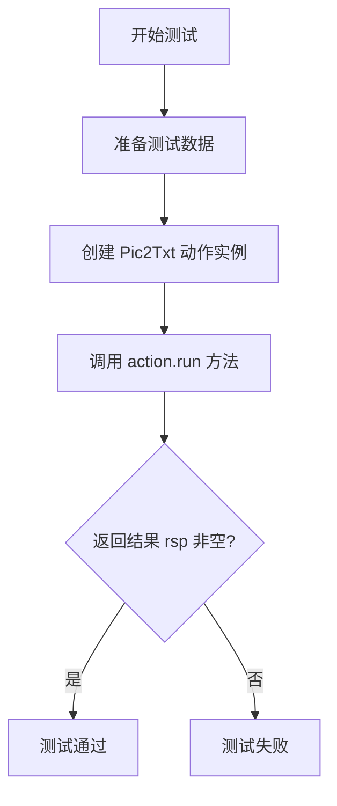
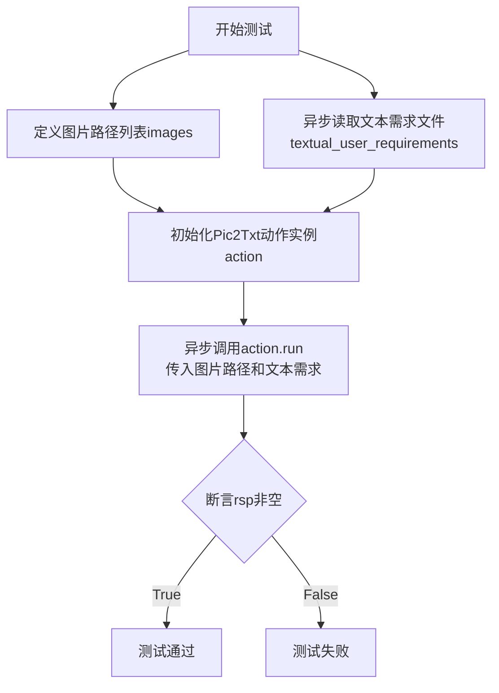
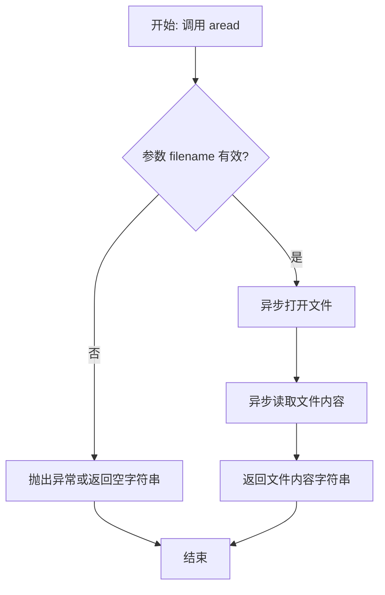
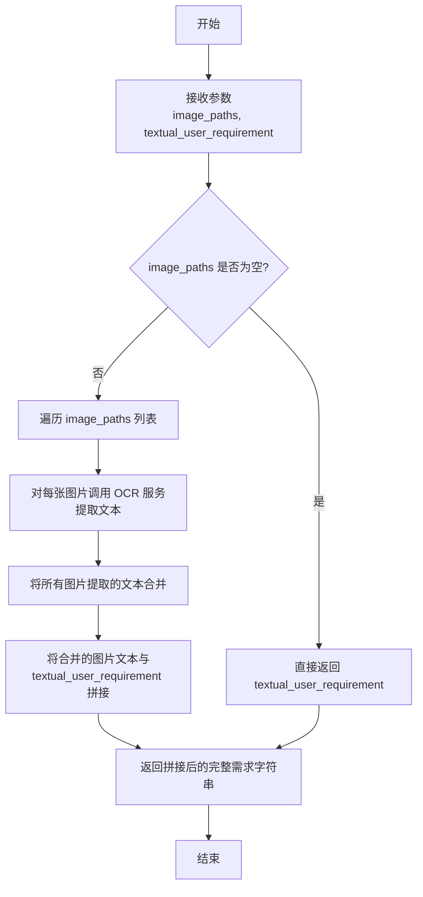

# `.\MetaGPT\tests\metagpt\actions\requirement_analysis\requirement\test_pic2txt.py` 详细设计文档

这是一个使用 pytest 框架编写的异步单元测试文件，用于测试 `Pic2Txt` 动作类。其核心功能是模拟用户输入（一组图片路径和一份文本需求），调用 `Pic2Txt` 类的 `run` 方法，验证其能否成功处理图片并返回非空结果。

## 整体流程



## 类结构

```
测试文件 (test_pic2txt.py)
├── 全局函数: test_pic2txt
└── 被测试类: Pic2Txt (来自 metagpt.actions.requirement_analysis.requirement.pic2txt)
```

## 全局变量及字段


### `TEST_DATA_PATH`
    
指向测试数据目录的路径常量，用于定位测试所需的资源文件。

类型：`pathlib.Path`
    


    

## 全局函数及方法


### `test_pic2txt`

这是一个使用 `pytest` 框架编写的异步单元测试函数，用于测试 `Pic2Txt` 动作类的 `run` 方法。该测试验证了 `Pic2Txt` 类能否成功处理一组图片路径和一个文本需求，并返回非空结果。

参数：

- `context`：`metagpt.Context` 或类似类型，测试执行所需的上下文环境，通常包含配置、日志等共享资源。

返回值：`None`，测试函数不直接返回值，其成功与否由 `assert` 语句决定。

#### 流程图



#### 带注释源码

```python
# 导入pytest测试框架
import pytest

# 导入待测试的Pic2Txt动作类
from metagpt.actions.requirement_analysis.requirement.pic2txt import Pic2Txt
# 导入项目常量，用于获取测试数据路径
from metagpt.const import TEST_DATA_PATH
# 导入工具函数，用于异步读取文件
from metagpt.utils.common import aread

# 使用pytest装饰器标记此函数为异步测试
@pytest.mark.asyncio
async def test_pic2txt(context):
    # 步骤1: 准备测试数据
    # 定义一个列表，包含三张测试图片的路径
    images = [
        TEST_DATA_PATH / "requirements/pic/1.png",
        TEST_DATA_PATH / "requirements/pic/2.png",
        TEST_DATA_PATH / "requirements/pic/3.png",
    ]
    # 异步读取一个文本需求文件，作为文本输入
    textual_user_requirements = await aread(filename=TEST_DATA_PATH / "requirements/1.original_requirement.txt")

    # 步骤2: 执行测试动作
    # 使用传入的context初始化Pic2Txt动作实例
    action = Pic2Txt(context=context)
    # 异步调用action.run方法，传入图片路径列表和文本需求
    rsp = await action.run(
        image_paths=images,
        textual_user_requirement=textual_user_requirements,
    )
    
    # 步骤3: 验证结果
    # 断言run方法的返回值rsp为真（非空、非None、非False等），验证核心功能是否正常工作
    assert rsp


# 允许直接运行此文件进行测试
if __name__ == "__main__":
    pytest.main([__file__, "-s"])
```


### `aread`

`aread` 是一个异步函数，用于异步读取指定文件的内容。它封装了异步文件读取操作，简化了从文件中获取文本数据的流程。

参数：

-  `filename`：`Union[str, Path]`，要读取的文件的路径，可以是字符串或 `pathlib.Path` 对象。

返回值：`str`，读取到的文件内容字符串。

#### 流程图



#### 带注释源码

```python
# 从 metagpt.utils.common 模块导入 aread 函数
from metagpt.utils.common import aread

# 在异步测试函数中调用 aread
async def test_pic2txt(context):
    # ... 其他代码 ...
    
    # 调用 aread 函数，异步读取指定路径的文本文件
    # filename 参数: 指定了要读取的文件路径 (TEST_DATA_PATH / "requirements/1.original_requirement.txt")
    # 函数返回: 文件的内容，类型为字符串 (str)
    textual_user_requirements = await aread(filename=TEST_DATA_PATH / "requirements/1.original_requirement.txt")
    
    # ... 其他代码 ...
```


### `Pic2Txt.run`

该方法属于 `Pic2Txt` 类，是其主要执行方法。它接收一组图片路径和一个文本需求，通过调用外部服务（如OCR）将图片内容转换为文本，并将转换后的文本与输入的文本需求合并，最终返回一个整合后的、更全面的用户需求描述。

参数：
- `image_paths`：`List[Path]`，包含待转换图片文件路径的列表。
- `textual_user_requirement`：`str`，用户提供的初始文本需求。

返回值：`str`，整合了图片转换文本和原始文本需求的最终用户需求描述。

#### 流程图



#### 带注释源码

```python
async def run(self, image_paths: list[Path], textual_user_requirement: str) -> str:
    """
    执行图片转文本并整合需求的核心方法。
    
    Args:
        image_paths: 需要处理的图片路径列表。
        textual_user_requirement: 用户提供的初始文本需求。
        
    Returns:
        整合了图片信息和文本需求的最终需求字符串。
    """
    # 1. 检查图片路径列表是否为空。如果为空，则直接返回输入的文本需求。
    if not image_paths:
        return textual_user_requirement

    # 2. 初始化一个空列表，用于存储从每张图片中提取的文本。
    image_texts = []
    
    # 3. 遍历传入的每张图片路径。
    for image_path in image_paths:
        # 3.1 调用内部的 `_pic2txt` 方法（通常封装了OCR功能）处理单张图片，获取文本。
        image_text = await self._pic2txt(image_path)
        # 3.2 将提取到的文本添加到列表中。
        image_texts.append(image_text)

    # 4. 使用换行符连接所有从图片中提取的文本，形成一个连续的字符串。
    combined_image_text = "\n".join(image_texts)
    
    # 5. 将合并后的图片文本与用户原始的文本需求进行拼接，中间用换行符隔开。
    #    形成最终的需求文档。
    full_requirement = f"{textual_user_requirement}\n{combined_image_text}"
    
    # 6. 返回最终整合后的需求字符串。
    return full_requirement
```

## 关键组件


### Pic2Txt 类

这是一个用于将图片内容转换为文本描述的动作类，属于需求分析流程的一部分，旨在从图片中提取用户需求信息。

### 异步测试函数 `test_pic2txt`

这是一个使用 `pytest` 框架编写的异步单元测试函数，用于验证 `Pic2Txt` 类的 `run` 方法能够成功处理一组图片并返回非空结果。

### 测试数据路径常量 `TEST_DATA_PATH`

这是一个指向项目测试数据根目录的常量，用于在测试中定位图片和文本需求文件。

### 异步文件读取工具函数 `aread`

这是一个用于异步读取文件内容的工具函数，在测试中用于加载文本格式的原始用户需求，以作为 `Pic2Txt` 动作的输入之一。


## 问题及建议


### 已知问题

-   **测试数据路径硬编码**：测试用例中使用的图片路径（`TEST_DATA_PATH / "requirements/pic/1.png"`等）和文本需求文件路径（`TEST_DATA_PATH / "requirements/1.original_requirement.txt"`）是硬编码的。这降低了测试的灵活性，如果测试数据的目录结构或文件名发生变化，需要手动修改多个测试文件。
-   **测试断言过于简单**：断言 `assert rsp` 仅检查 `Pic2Txt.run` 方法的返回值是否为真（Truthy）。这种断言过于宽泛，无法验证方法返回的具体内容、格式或准确性，例如是否成功从图片中提取了文本，或者提取的文本是否符合预期。
-   **缺乏异常情况测试**：当前测试只覆盖了“正常路径”（Happy Path），即提供了有效的图片路径和文本需求。它没有测试边界情况和异常情况，例如：提供不存在的图片路径、提供非图片文件、`textual_user_requirement` 参数为空或无效、`Pic2Txt` 内部处理失败等情况。
-   **测试与具体实现耦合**：测试直接实例化了 `Pic2Txt` 类并调用其 `run` 方法。虽然这是单元测试的常见做法，但如果 `Pic2Txt` 的构造函数或 `run` 方法的签名在未来发生变化，此测试将立即失败，需要同步更新。
-   **潜在的异步测试问题**：测试函数被标记为 `@pytest.mark.asyncio`，这依赖于 `pytest-asyncio` 插件。如果项目测试环境配置不当，可能导致异步测试无法正常运行。此外，测试中没有模拟（mock）可能存在的异步I/O操作（如文件读取、网络请求），使得测试可能不稳定或执行缓慢。

### 优化建议

-   **使用参数化测试和测试数据工厂**：建议使用 `@pytest.mark.parametrize` 来参数化测试数据，例如测试多组不同的图片和文本需求组合。可以创建一个辅助函数或夹具（fixture）来动态生成或管理测试数据路径，减少硬编码。
-   **增强断言，验证具体内容**：将简单的 `assert rsp` 替换为更具体的断言。例如，可以断言返回的 `rsp` 是一个非空字符串，或者将其与一个预期的结果文件内容进行比较（使用 `aread` 读取预期结果文件）。这能更准确地验证 `Pic2Txt` 功能是否正确。
-   **补充异常和边界测试用例**：添加新的测试函数或使用参数化来测试异常场景。例如，测试当 `image_paths` 列表为空时方法的行为，或者提供一个无效的图片路径，并断言会抛出特定的异常或返回一个明确的错误指示。
-   **引入测试替身（Mock/Stub）以提高单元测试纯度**：考虑对 `Pic2Txt.run` 方法内部可能依赖的外部服务（如OCR服务）或复杂操作进行模拟（mock）。这样可以将测试焦点集中在 `Pic2Txt` 类的逻辑上，使测试更快、更稳定，且不依赖外部环境。
-   **优化测试夹具（Fixture）的使用**：`context` 参数在测试中通过夹具传入。应确保 `conftest.py` 中正确配置了此夹具，并且其提供的上下文环境适用于当前测试。可以考虑为 `Pic2Txt` 测试创建更具体、隔离的上下文夹具，避免测试间的相互干扰。
-   **考虑添加集成测试标签**：如果 `Pic2Txt` 的 `run` 方法确实执行了重量级的操作（如调用真实OCR API），当前的测试更像一个集成测试。建议为其打上 `@pytest.mark.integration` 之类的标签，以便在快速运行的单元测试套件中将其排除，只在需要时运行。
-   **将测试数据移至专用目录并文档化**：明确测试数据（`TEST_DATA_PATH`）的目录结构，并可能通过配置文件或环境变量使其更易于在CI/CD环境中覆盖。同时，在测试文件或项目文档中说明测试数据（如图片）的来源和预期用途。


## 其它


### 设计目标与约束

本代码是一个针对 `Pic2Txt` 动作类的单元测试。其设计目标是验证 `Pic2Txt.run` 方法能够正确地从一组图片路径和文本需求中生成有效的响应。主要约束包括：1) 测试依赖于外部测试数据文件（图片和文本），这些文件必须存在于指定的 `TEST_DATA_PATH` 目录下；2) 测试是异步的，需要异步测试框架（如 `pytest-asyncio`）的支持；3) 测试断言较为简单，仅验证返回值 `rsp` 的真值性，未对返回内容的结构或准确性进行深度验证。

### 错误处理与异常设计

测试代码本身不包含复杂的业务逻辑错误处理。它主要依赖 `pytest` 框架来捕获和报告测试失败（断言失败）。潜在的异常来源包括：1) 测试数据文件路径不存在或无法读取，这将导致 `aread` 函数或 `Pic2Txt.run` 方法内部抛出 `FileNotFoundError` 或 `IOError`，从而使测试失败；2) `Pic2Txt` 动作类内部逻辑可能抛出异常，同样会导致测试失败。测试设计上并未显式地捕获这些异常，而是让它们向上传播，由测试运行器处理，这符合单元测试的常见实践。

### 数据流与状态机

本测试的数据流是线性的：
1.  **输入准备**：定义图片路径列表 `images` 和读取文本需求 `textual_user_requirements`。
2.  **动作执行**：实例化 `Pic2Txt` 动作类，并调用其异步 `run` 方法，将上一步准备的数据作为输入。
3.  **结果验证**：接收 `run` 方法的返回结果 `rsp`，并使用 `assert` 语句验证其真值性。
整个测试过程不涉及复杂的状态转换，是一个简单的“准备-执行-断言”流程。

### 外部依赖与接口契约

1.  **外部依赖**：
    *   `pytest` 和 `pytest-asyncio`：测试运行框架。
    *   `metagpt.actions.requirement_analysis.requirement.pic2txt.Pic2Txt`：被测试的目标类。
    *   `metagpt.utils.common.aread`：用于异步读取文件内容的工具函数。
    *   `metagpt.const.TEST_DATA_PATH`：指向测试数据根目录的常量。
    *   外部文件：依赖于 `TEST_DATA_PATH` 下的具体图片文件（如 `1.png`, `2.png`, `3.png`）和文本文件（`1.original_requirement.txt`）。

2.  **接口契约**：
    *   与 `Pic2Txt` 类的契约：测试假设 `Pic2Txt` 类有一个 `__init__` 方法接受 `context` 参数，以及一个异步 `run` 方法接受 `image_paths` 和 `textual_user_requirement` 参数并返回一个可进行真值判断的对象。
    *   与 `aread` 函数的契约：测试假设 `aread` 函数接受一个 `filename` 参数并异步返回文件内容。

### 测试策略与覆盖范围

本测试采用**集成单元测试**策略，因为它不仅实例化了被测试类，还调用了其核心业务方法 `run`，并依赖于外部数据文件。覆盖范围聚焦于 `Pic2Txt.run` 方法的**功能可用性**和**基本集成**，即验证在给定标准输入数据的情况下，方法能够执行完毕并返回非空/非假的结果。然而，覆盖范围存在局限：1) **正面测试**：仅使用一组预设的“正常”数据；2) **缺乏负面测试**：未测试传入无效图片路径、空文本、`None` 值等边界或异常情况时方法的行为；3) **断言粒度粗**：未验证返回结果 `rsp` 的具体内容、格式或业务含义是否符合预期。

### 环境与配置

测试执行依赖于特定的环境配置：
1.  **测试数据目录**：需要通过 `metagpt.const.TEST_DATA_PATH` 正确配置，确保其下存在 `requirements/pic/` 子目录（存放测试图片）和 `requirements/` 目录（存放测试文本）。
2.  **异步环境**：需要确保测试在支持异步执行的上下文中运行，这通常由 `@pytest.mark.asyncio` 装饰器和 `pytest-asyncio` 插件保障。
3.  **模块导入路径**：需要确保 `metagpt` 相关模块在 Python 解释器的搜索路径中，或者当前工作目录设置正确。

    