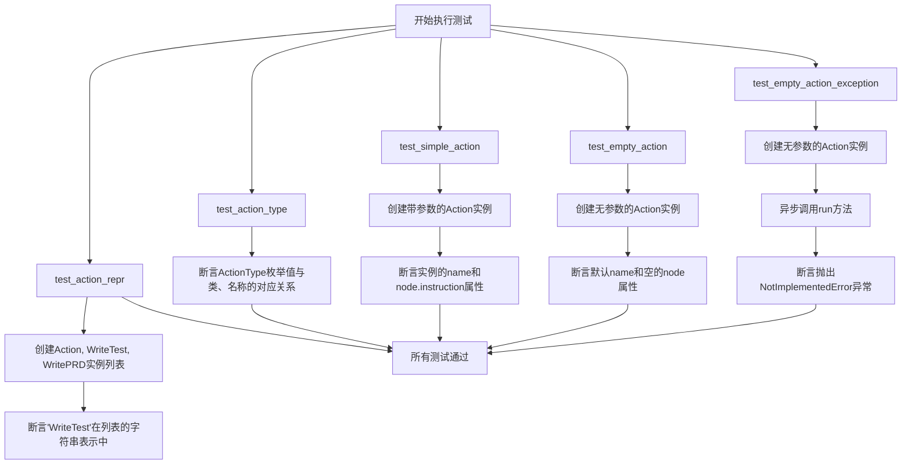
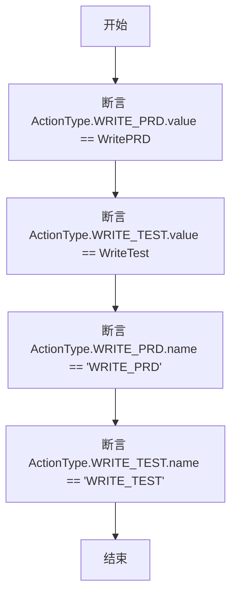
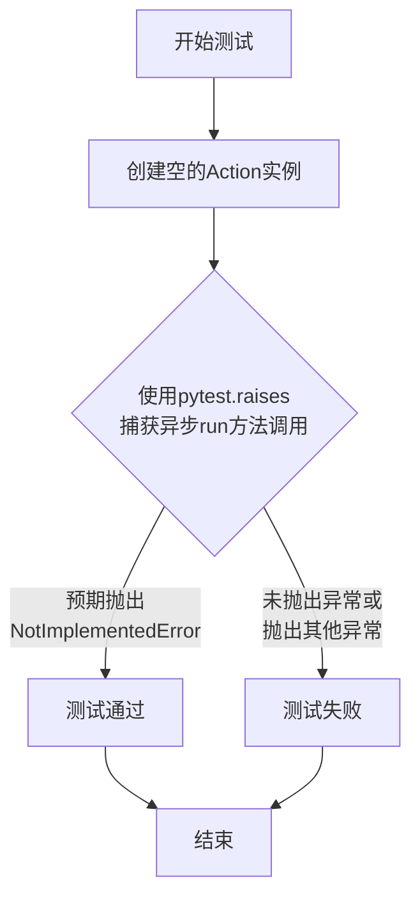
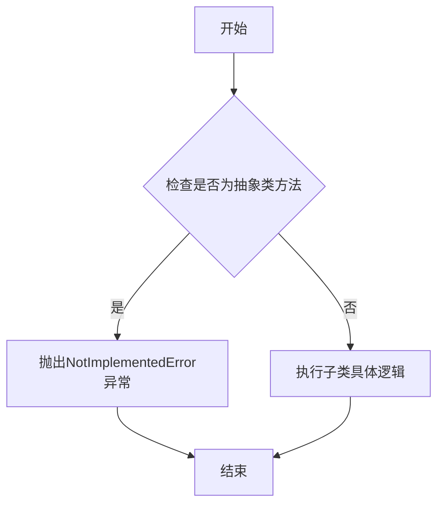

# `.\MetaGPT\tests\metagpt\actions\test_action.py` 详细设计文档

该文件是一个单元测试文件，用于测试 MetaGPT 框架中 Action 类及其子类（如 WritePRD, WriteTest）的基本功能、类型系统以及核心方法的行为。

## 整体流程



## 类结构

```
Action (被测试的基类)
├── WritePRD (被测试的子类)
└── WriteTest (被测试的子类)
ActionType (被测试的枚举类)
├── WRITE_PRD
└── WRITE_TEST
```

## 全局变量及字段


### `Action.name`
    
表示Action实例的名称，用于标识不同的动作。

类型：`str`
    


### `Action.node`
    
表示与Action关联的节点，可能包含指令、上下文或执行逻辑。

类型：`ActionNode`
    
    

## 全局函数及方法

### `test_action_repr`

该函数是一个单元测试，用于验证`Action`类及其子类（如`WriteTest`和`WritePRD`）的字符串表示（`__repr__`或`__str__`）是否正确。具体来说，它创建了一个包含不同`Action`实例的列表，并检查`WriteTest`实例的字符串表示是否包含类名"WriteTest"。

参数：无

返回值：`None`，该函数是一个测试函数，不返回任何值，而是通过断言（`assert`）来验证代码行为。

#### 流程图

```mermaid
graph TD
    A[开始] --> B[创建Action实例列表 actions]
    B --> C[将列表转换为字符串 str(actions)]
    C --> D{字符串中是否包含 'WriteTest'?}
    D -->|是| E[断言通过，测试成功]
    D -->|否| F[断言失败，测试失败]
    E --> G[结束]
    F --> G
```

#### 带注释源码

```python
def test_action_repr():
    # 创建一个列表，包含三个Action类的实例：
    # 1. 一个通用的Action实例
    # 2. 一个WriteTest实例（Action的子类）
    # 3. 一个WritePRD实例（Action的子类）
    actions = [Action(), WriteTest(), WritePRD()]
    
    # 使用str()函数将整个列表转换为字符串。
    # 然后断言这个字符串表示中是否包含子类名"WriteTest"。
    # 这主要用于验证Action子类的__repr__或__str__方法是否正确实现了。
    assert "WriteTest" in str(actions)
```

### `test_action_type`

该函数是一个单元测试，用于验证`ActionType`枚举类的正确性。它检查枚举成员的值是否对应正确的`Action`子类，以及枚举成员的名称是否符合预期。

参数：无

返回值：无（`None`），该函数通过`assert`语句进行断言测试，不返回任何值。

#### 流程图



#### 带注释源码

```python
def test_action_type():
    # 断言：检查 ActionType.WRITE_PRD 枚举的值是否等于 WritePRD 类
    assert ActionType.WRITE_PRD.value == WritePRD
    # 断言：检查 ActionType.WRITE_TEST 枚举的值是否等于 WriteTest 类
    assert ActionType.WRITE_TEST.value == WriteTest
    # 断言：检查 ActionType.WRITE_PRD 枚举的名称是否为字符串 'WRITE_PRD'
    assert ActionType.WRITE_PRD.name == "WRITE_PRD"
    # 断言：检查 ActionType.WRITE_TEST 枚举的名称是否为字符串 'WRITE_TEST'
    assert ActionType.WRITE_TEST.name == "WRITE_TEST"
```

### `test_simple_action`

该函数是一个单元测试，用于验证`Action`类在传入特定参数（`name`和`instruction`）时，其内部属性是否被正确设置。它测试了`Action`实例的`name`字段和其内部`node`对象的`instruction`字段是否与传入的参数值一致。

参数：
- 无显式参数。该函数是一个测试函数，不接收外部参数。

返回值：`None`，该函数是一个测试函数，其主要目的是通过断言（`assert`）来验证代码行为，不返回业务逻辑值。

#### 流程图

```mermaid
graph TD
    A[开始] --> B[创建Action实例<br/>传入name='AlexSay', instruction='...']；
    B --> C{断言：action.name == 'AlexSay'?}；
    C -->|是| D{断言：action.node.instruction == 传入的instruction?}；
    D -->|是| E[测试通过]；
    C -->|否| F[测试失败]；
    D -->|否| F；
```

#### 带注释源码

```python
def test_simple_action():
    # 创建一个Action类的实例，传入两个参数：
    # name: 设置动作的名称为"AlexSay"
    # instruction: 设置动作节点的指令为一段特定的字符串
    action = Action(name="AlexSay", instruction="Express your opinion with emotion and don't repeat it")
    
    # 断言1：验证创建的action实例的name属性是否等于传入的"AlexSay"
    assert action.name == "AlexSay"
    
    # 断言2：验证action实例内部的node对象的instruction属性是否等于传入的指令字符串
    assert action.node.instruction == "Express your opinion with emotion and don't repeat it"
```

### `test_empty_action`

该函数用于测试`Action`类的默认构造函数，验证在不提供任何参数的情况下创建的`Action`实例是否具有预期的默认属性值。

参数：无

返回值：无（该函数为测试函数，不返回任何值，仅通过断言验证行为）

#### 流程图

```mermaid
flowchart TD
    A[开始] --> B[调用 Action() 创建实例]
    B --> C[断言 action.name == 'Action']
    C --> D[断言 not action.node]
    D --> E[结束]
```

#### 带注释源码

```python
def test_empty_action():
    # 调用Action类的默认构造函数，不传入任何参数
    action = Action()
    # 断言：新创建的action实例的name属性应为默认值'Action'
    assert action.name == "Action"
    # 断言：新创建的action实例的node属性应为假值（例如None或空对象）
    assert not action.node
```

### `test_empty_action_exception`

这是一个使用 `pytest` 框架编写的异步单元测试函数，用于验证当调用一个未实现 `run` 方法的 `Action` 类实例时，是否会正确地抛出 `NotImplementedError` 异常。

参数：
- 无显式参数。该函数是一个测试用例，由 `pytest` 框架调用。

返回值：`None`，测试函数通常不返回有意义的值，其目的是通过断言或异常检查来验证代码行为。

#### 流程图



#### 带注释源码

```python
# 使用pytest.mark.asyncio装饰器标记此函数为异步测试函数
@pytest.mark.asyncio
async def test_empty_action_exception():
    # 创建一个默认的、未配置的Action类实例
    action = Action()
    # 使用pytest.raises上下文管理器来断言：当执行其run方法时，应抛出NotImplementedError异常
    with pytest.raises(NotImplementedError):
        # 异步调用action实例的run方法
        await action.run()
```

### `Action.run`

该方法用于执行Action对象的核心逻辑。由于Action是一个抽象基类，该方法默认抛出NotImplementedError异常，要求子类必须实现具体的运行逻辑。

参数：

-  `self`：`Action`，Action类的实例

返回值：`None`，无返回值

#### 流程图



#### 带注释源码

```python
async def run(self):
    """
    执行Action的核心逻辑。
    这是一个抽象方法，必须在子类中实现。
    
    参数:
        self: Action类的实例
        
    返回值:
        无
        
    异常:
        NotImplementedError: 当在基类中直接调用时抛出
    """
    raise NotImplementedError
```

## 关键组件


### Action 基类

定义了所有具体动作（Action）的抽象基类，提供了动作的基本属性和运行接口。

### ActionType 枚举

定义了系统中支持的动作类型枚举，将动作类型名称与具体的动作类进行映射。

### WritePRD 动作类

一个具体的动作类，负责编写产品需求文档（PRD）。

### WriteTest 动作类

一个具体的动作类，负责编写测试用例。

### Action 运行机制

定义了动作的执行流程，包括异步运行方法 `run()`，具体动作需要实现此方法来完成其核心逻辑。


## 问题及建议


### 已知问题

-   **`Action`基类的`run`方法未实现**：代码中`Action`基类的`run`方法是一个抽象方法，但未使用`@abstractmethod`装饰器进行标记。这导致在创建`Action`实例并调用`run`方法时，直到运行时才会抛出`NotImplementedError`，而不是在类定义或实例化时提供明确的提示，降低了代码的健壮性和可维护性。
-   **测试用例`test_empty_action_exception`的命名和断言不够精确**：该测试用例旨在验证调用未实现`run`方法的`Action`实例会抛出异常。然而，其名称`test_empty_action_exception`未能清晰表达测试意图。同时，测试中直接使用`Action()`实例进行测试，未能明确体现是对`run`方法未实现的测试，可能造成误解。
-   **`Action`类初始化逻辑存在不一致性**：在`test_simple_action`测试中，`Action`实例化时传入了`name`和`instruction`参数，并赋值给了`action.node.instruction`。而在`test_empty_action`测试中，无参实例化的`Action`对象，其`action.node`属性为`False`（或空值）。这种不一致的初始化状态可能暗示`Action`类内部构造逻辑或`node`属性的默认值设置存在模糊之处，容易引发错误。
-   **`ActionType`枚举的值直接关联到类引用，存在紧耦合**：`ActionType`枚举的成员值直接设置为类（如`WritePRD`, `WriteTest`）。这种设计将枚举类型与具体的类实现紧密耦合在一起，降低了枚举的独立性和可复用性。当需要增加新的Action类型或重构类名时，必须同步修改枚举定义，违反了开闭原则。

### 优化建议

-   **为`Action.run`方法添加`@abstractmethod`装饰器**：将`Action`基类中的`run`方法声明为抽象方法。这样可以确保任何从`Action`派生的非抽象子类都必须实现`run`方法，否则在子类定义阶段就会报错，提供了更早、更清晰的错误反馈，符合面向对象设计原则。
-   **重构并重命名测试用例`test_empty_action_exception`**：建议将测试用例重命名为`test_action_base_run_not_implemented`，以更准确地反映其测试目的。在测试体内，可以添加注释说明这是在测试基类未实现抽象方法的行为，或者考虑使用`pytest.raises`配合更具体的异常消息检查，使测试意图一目了然。
-   **明确并统一`Action`类的初始化契约**：审查并明确`Action`类的`__init__`方法。确保无论是否传入参数，`action.node`属性都能保持一致的初始状态（例如，始终初始化为一个有效的默认`Node`对象或`None`）。同时，考虑将`instruction`参数的处理逻辑标准化，避免内部状态的不确定性。
-   **解耦`ActionType`枚举与具体类**：考虑修改`ActionType`枚举的设计。枚举值可以改为字符串标识符（如`"WRITE_PRD"`）或整数代码，而非直接引用类对象。可以创建一个独立的映射关系（如字典或工厂类）来将`ActionType`的值与对应的`Action`子类关联起来。这样提高了枚举的稳定性，并使Action类型的注册和发现机制更加灵活，便于扩展。
-   **补充关键方法的单元测试**：当前测试主要覆盖了类型表示、枚举和简单的属性访问。建议增加对`WritePRD`和`WriteTest`等具体Action子类核心功能（即它们的`run`方法）的单元测试，以确保这些具体行为符合预期。
-   **考虑使用`pytest`的`parametrize`简化测试**：对于`test_action_repr`和`test_action_type`这类对多个类似对象或枚举项进行相同断言模式的测试，可以考虑使用`@pytest.mark.parametrize`装饰器来简化测试代码，提高可读性和可维护性。


## 其它


### 设计目标与约束

本代码模块是一个单元测试文件，旨在验证 `metagpt.actions` 模块中 `Action`、`ActionType`、`WritePRD`、`WriteTest` 等核心类的功能与行为。其设计目标是确保这些基础组件的正确性、一致性和异常处理能力。主要约束包括：1) 测试用例需覆盖同步与异步方法；2) 测试需验证类的字符串表示、枚举映射、属性初始化及方法调用；3) 需使用 `pytest` 框架并遵循其最佳实践。

### 错误处理与异常设计

代码中显式设计了一处异常处理测试：在 `test_empty_action_exception` 测试中，验证了当调用未实现 `run` 方法的 `Action` 实例时，会抛出 `NotImplementedError` 异常。这遵循了抽象基类或未完全实现类的常见设计模式，即要求子类必须重写特定方法。测试通过 `pytest.raises` 上下文管理器来断言预期的异常被正确抛出。

### 数据流与状态机

本测试文件不涉及复杂的数据流或状态机。其数据流是线性的：每个测试函数独立运行，初始化测试对象（如 `Action` 实例），调用其方法或访问其属性，然后使用 `assert` 语句验证结果是否符合预期。测试之间没有状态共享或依赖。测试对象（如 `action`）的状态在单个测试函数内创建、使用和销毁。

### 外部依赖与接口契约

1.  **框架依赖**：强依赖 `pytest` 框架及其 `pytest.mark.asyncio` 插件来运行异步测试用例。
2.  **模块依赖**：依赖被测试的 `metagpt.actions` 模块，具体需要从其中导入 `Action`、`ActionType`、`WritePRD`、`WriteTest` 等类。
3.  **接口契约**：
    *   测试假设 `Action` 类具有 `name`、`node` 属性及 `run` 方法。
    *   测试假设 `ActionType` 枚举的 `value` 属性直接映射到对应的类（如 `WritePRD`），`name` 属性为字符串。
    *   测试假设 `WritePRD` 和 `WriteTest` 是 `Action` 的子类或相关类，且其类名能通过 `str()` 函数正确表示。

    