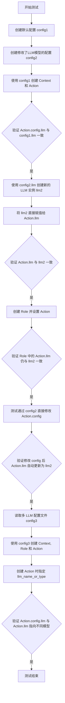
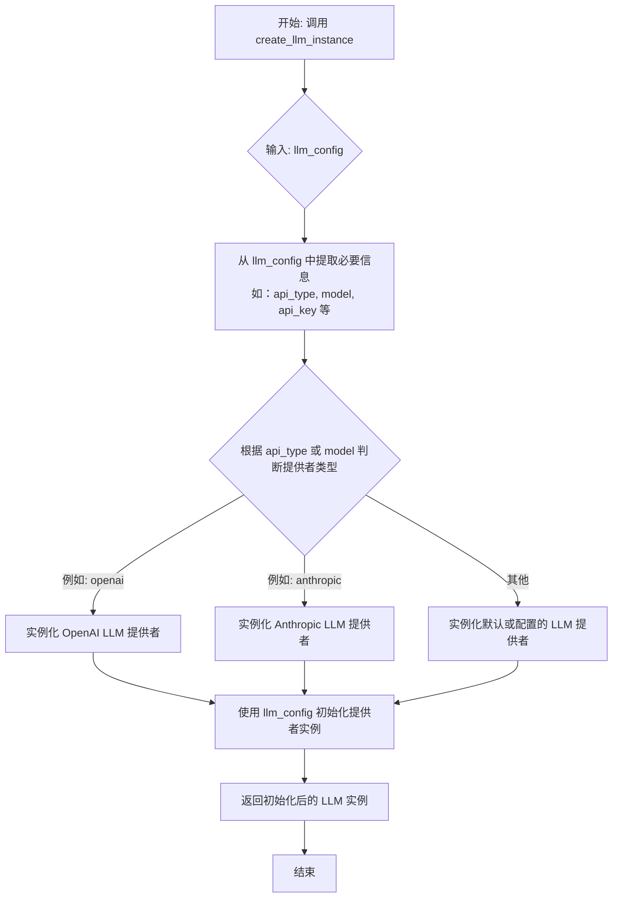
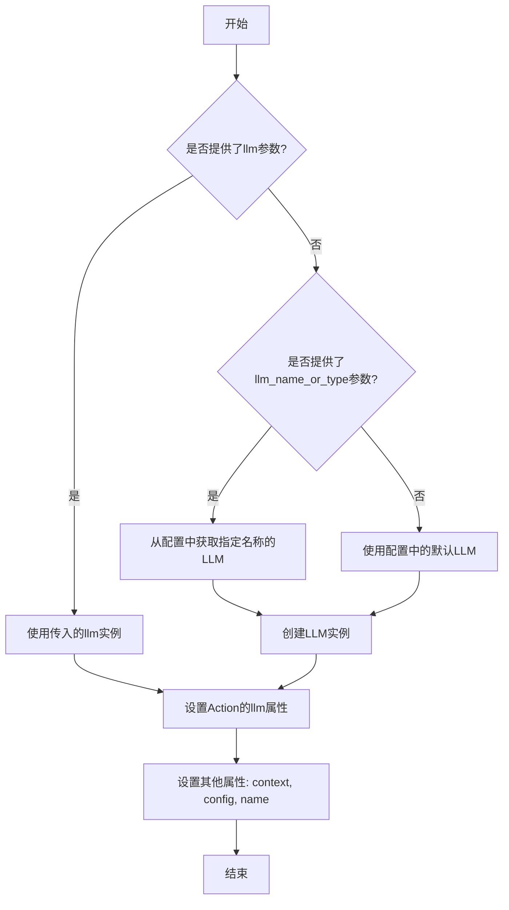
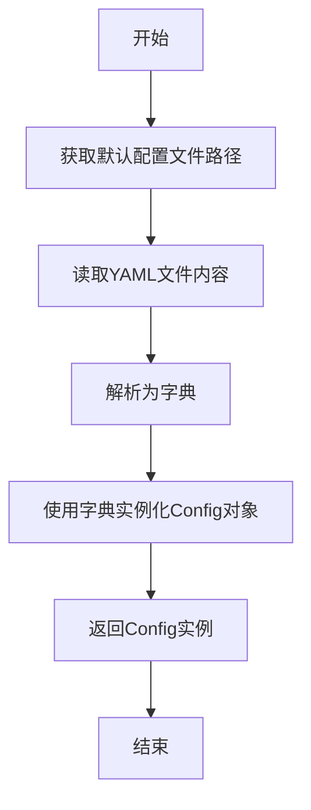
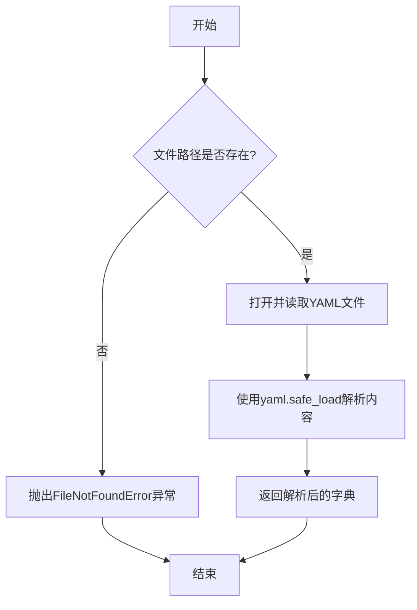
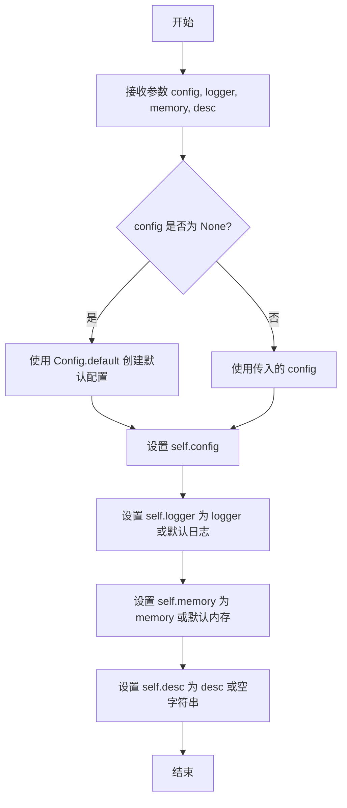

```mermaid
flowchart TD
    Start[开始] --> A[创建默认配置 config1]
    A --> B[创建并修改配置 config2<br>设置其LLM模型为'gpt-3.5-turbo']
    B --> C[使用 config1 创建 Context 和 Action]
    C --> D{断言: act.config.llm.model<br>等于 config1.llm.model}
    D --> E[使用 config2.llm 创建 llm2 实例]
    E --> F[将 act.llm 赋值为 llm2]
    F --> G{断言: act.llm.model<br>等于 llm2.model}
    G --> H[使用 config1 创建 Role<br>并通过 set_actions 关联 act]
    H --> I{断言: act.llm.model<br>仍等于 llm2.model}
    I --> J[创建新的 Role1 和 Action1]
    J --> K{断言: act1.config.llm.model<br>等于 config1.llm.model}
    K --> L[将 act1.config 赋值为 config2]
    L --> M[通过 set_actions 关联 act1]
    M --> N{断言: act1.llm.model<br>等于 llm2.model}
    N --> O[从YAML文件加载多LLM配置 config3]
    O --> P[使用 config3 创建 Context3 和 Role3]
    P --> Q[创建 Action3<br>并指定 llm_name_or_type 为'YOUR_MODEL_NAME_1']
    Q --> R{断言: act3.config.llm.model<br>为'gpt-3.5-turbo'<br>且 act3.llm.model 为'gpt-4-turbo'}
    R --> S[通过 set_actions 关联 act3]
    S --> T{最终断言: act3 的配置和LLM模型<br>保持不变}
    T --> End[结束]
```

# `.\MetaGPT\tests\metagpt\actions\test_action_multi_llm.py` 详细设计文档

该代码是一个单元测试，用于验证 MetaGPT 框架中 Action 和 Role 类在配置和使用不同 LLM（大语言模型）实例时的行为，特别是测试了通过配置对象、直接赋值以及多 LLM 配置场景下，Action 实例如何正确获取和使用指定的 LLM。

## 整体流程



## 类结构

```
外部依赖与调用关系
├── Config (配置类)
├── Context (上下文类)
├── Action (动作类)
│   ├── 属性: config, llm
│   └── 方法: __init__
├── Role (角色类)
│   └── 方法: set_actions
└── 全局函数
    ├── create_llm_instance
    └── test_set_llm (测试入口)
```

## 全局变量及字段


### `TEST_DATA_PATH`
    
指向项目测试数据目录的路径常量，用于加载测试配置文件。

类型：`pathlib.Path`
    


### `Action.config`
    
Action实例的配置对象，包含LLM等运行时配置信息。

类型：`Config`
    


### `Action.llm`
    
Action实例使用的具体语言模型实例，用于执行AI任务。

类型：`LLM`
    


### `Config.llm`
    
Config对象中用于配置语言模型的子配置对象。

类型：`LLMConfig`
    


### `Context.config`
    
Context对象持有的全局配置对象，定义了运行环境的配置。

类型：`Config`
    
    

## 全局函数及方法

### `test_set_llm`

该函数是一个单元测试，用于验证在MetaGPT框架中，`Action`和`Role`对象如何设置和使用不同的LLM（大语言模型）配置。它测试了通过直接赋值、通过`Role.set_actions`方法以及通过多LLM配置文件等多种方式，确保`Action`实例的`llm`属性能够被正确初始化和覆盖。

参数：
- 无

返回值：`None`，该函数是一个测试函数，不返回任何值，其验证逻辑通过`assert`语句实现。

#### 流程图



#### 带注释源码

```python
def test_set_llm():
    # 1. 测试基础配置继承与覆盖
    # 创建两个默认配置对象
    config1 = Config.default()
    config2 = Config.default()
    # 修改第二个配置的LLM模型
    config2.llm.model = "gpt-3.5-turbo"

    # 使用第一个配置创建上下文和动作
    context = Context(config=config1)
    act = Action(context=context)
    # 验证动作的配置LLM模型与初始配置一致
    assert act.config.llm.model == config1.llm.model

    # 根据第二个配置的LLM设置创建一个独立的LLM实例
    llm2 = create_llm_instance(config2.llm)
    # 将动作的llm属性直接替换为新创建的LLM实例
    act.llm = llm2
    # 验证动作的LLM模型已更新
    assert act.llm.model == llm2.model

    # 创建一个角色，并将上述动作设置给该角色
    role = Role(context=context)
    role.set_actions([act])
    # 验证在角色关联后，动作的LLM模型保持不变
    assert act.llm.model == llm2.model

    # 2. 测试通过修改Action的config属性来间接更新LLM
    # 创建新的角色和动作
    role1 = Role(context=context)
    act1 = Action(context=context)
    # 验证新动作的初始配置LLM模型
    assert act1.config.llm.model == config1.llm.model
    # 将动作的整个配置替换为config2
    act1.config = config2
    # 将动作关联到新角色
    role1.set_actions([act1])
    # 验证动作的LLM模型已更新为config2对应的模型
    assert act1.llm.model == llm2.model

    # 3. 测试从多LLM配置文件中加载配置
    # 定义多LLM配置文件的路径
    config3_path = TEST_DATA_PATH / "config/config2_multi_llm.yaml"
    # 读取YAML文件内容为字典
    dict3 = Config.read_yaml(config3_path)
    # 根据字典创建配置对象
    config3 = Config(**dict3)
    # 使用新配置创建上下文和角色
    context3 = Context(config=config3)
    role3 = Role(context=context3)
    # 创建动作时，通过`llm_name_or_type`参数指定使用配置中名为'YOUR_MODEL_NAME_1'的LLM
    act3 = Action(context=context3, llm_name_or_type="YOUR_MODEL_NAME_1")
    # 验证动作的配置LLM模型（默认LLM）与动作实际使用的LLM模型（指定LLM）不同
    assert act3.config.llm.model == "gpt-3.5-turbo"
    assert act3.llm.model == "gpt-4-turbo"
    # 将动作关联到角色
    role3.set_actions([act3])
    # 最终验证：关联后，配置LLM和实际使用的LLM均保持不变
    assert act3.config.llm.model == "gpt-3.5-turbo"
    assert act3.llm.model == "gpt-4-turbo"
```

### `create_llm_instance`

根据给定的LLM配置，创建并返回一个LLM实例。该函数是LLM提供者注册表的一部分，用于根据配置动态实例化具体的LLM提供者。

参数：
- `llm_config`：`LLMConfig`，包含LLM模型类型、API密钥、基础URL等配置信息的对象。

返回值：`BaseLLM`，一个实现了基础LLM接口的实例，可用于进行语言模型调用。

#### 流程图



#### 带注释源码

```python
# 函数定义：接收一个 LLMConfig 对象作为参数，返回一个 BaseLLM 实例
def create_llm_instance(llm_config: LLMConfig) -> BaseLLM:
    """
    根据配置创建 LLM 实例。
    
    此函数是 LLM 提供者工厂的核心。它解析传入的配置对象，
    根据配置中的提供者类型（如 'openai', 'anthropic'）或模型名称，
    从已注册的提供者中选取合适的类进行实例化。
    
    Args:
        llm_config (LLMConfig): 包含 LLM 连接和模型参数配置的对象。
            通常包括：
                - api_type: 提供者类型（如 'openai'）
                - model: 模型名称（如 'gpt-4'）
                - api_key: API 密钥
                - base_url: API 基础地址（可选）
                - 其他提供者特定参数。
    
    Returns:
        BaseLLM: 一个具体 LLM 提供者类的实例（如 OpenAIGPTAPI），
        该实例已使用提供的配置进行初始化，并准备好接受请求。
    
    Raises:
        ValueError: 如果无法从配置中确定或找到对应的 LLM 提供者。
        KeyError: 如果配置中缺少必需的参数（如 api_key）。
    """
    # 1. 从配置中提取提供者标识符。
    #    通常优先使用显式指定的 api_type，否则尝试从 model 名称推断。
    provider_key = llm_config.api_type or _infer_provider_from_model(llm_config.model)
    
    # 2. 从全局注册表（例如一个字典）中获取对应的提供者类。
    #    registry 是一个映射，将 provider_key 映射到具体的 LLM 类（如 OpenAIGPTAPI）。
    provider_class = LLM_PROVIDER_REGISTRY.get(provider_key)
    
    # 3. 如果找不到注册的提供者，则抛出错误或使用默认提供者。
    if provider_class is None:
        # 这里可以选择记录警告并使用一个安全的默认值，或者严格失败。
        raise ValueError(f"未注册的 LLM 提供者: {provider_key}")
    
    # 4. 使用提供的 llm_config 初始化提供者类并返回实例。
    #    初始化过程通常会将配置传递给类的构造函数。
    llm_instance = provider_class(llm_config)
    
    # 5. 返回创建好的实例。
    return llm_instance
```

### `Action.__init__`

初始化一个Action实例，设置其上下文、配置、语言模型（LLM）以及名称等属性。如果提供了`llm_name_or_type`参数，则会根据配置中的多LLM设置选择特定的LLM实例，否则使用默认的LLM。

参数：

- `context`：`Context`，包含配置信息的上下文对象，用于初始化Action的配置和LLM。
- `llm_name_or_type`：`str`，可选参数，指定要使用的LLM的名称或类型，用于在多LLM配置中选择特定的LLM。
- `name`：`str`，可选参数，Action的名称，默认为空字符串。
- `llm`：`LLM`，可选参数，直接传入一个LLM实例，如果提供则忽略其他LLM相关参数。

返回值：`None`，无返回值。

#### 流程图



#### 带注释源码

```python
def __init__(
    self,
    context: Context,
    llm_name_or_type: str = "",
    name: str = "",
    llm: LLM = None,
):
    """
    初始化Action实例。

    Args:
        context (Context): 包含配置信息的上下文对象。
        llm_name_or_type (str, optional): 指定LLM的名称或类型，用于多LLM配置。默认为空字符串。
        name (str, optional): Action的名称。默认为空字符串。
        llm (LLM, optional): 直接传入的LLM实例。如果提供，则忽略llm_name_or_type参数。
    """
    self.context = context  # 设置上下文
    self.config = context.config  # 从上下文获取配置
    self.name = name  # 设置Action名称

    if llm:
        # 如果直接提供了LLM实例，则使用该实例
        self.llm = llm
    elif llm_name_or_type:
        # 如果指定了LLM名称或类型，则从配置中获取对应的LLM配置并创建实例
        llm_config = self.config.get_llm_config(llm_name_or_type)
        self.llm = create_llm_instance(llm_config)
    else:
        # 否则使用配置中的默认LLM
        self.llm = create_llm_instance(self.config.llm)
```

### `Role.set_actions`

该方法用于为`Role`实例设置其可执行的动作（`Action`）列表。它会遍历传入的动作列表，确保每个动作都拥有一个有效的LLM（大语言模型）实例。如果某个动作的`llm`属性为`None`，则该方法会尝试从该动作的配置（`config`）中创建一个LLM实例并赋值给它。此过程确保了`Role`在后续执行其动作时，每个动作都具备必要的LLM资源。

参数：
- `actions`：`List[Action]`，一个`Action`对象的列表，代表该角色可以执行的一系列动作。

返回值：`None`，此方法不返回任何值，仅修改`Role`实例的内部状态。

#### 流程图

```mermaid
flowchart TD
    A[开始：Role.set_actions(actions)] --> B{遍历actions列表};
    B --> C[取下一个action];
    C --> D{action.llm is None?};
    D -- 是 --> E[从action.config.llm<br>创建LLM实例];
    E --> F[将LLM实例赋值给action.llm];
    D -- 否 --> F;
    F --> G{还有下一个action?};
    G -- 是 --> C;
    G -- 否 --> H[结束];
```

#### 带注释源码

```python
def set_actions(self, actions: List[Action]):
    """
    设置角色可以执行的动作列表。
    此方法会确保列表中的每个Action对象都拥有一个LLM实例。
    如果某个Action的llm属性为None，则会根据其config.llm配置创建一个新的LLM实例。
    Args:
        actions (List[Action]): 要设置的动作列表。
    """
    # 将传入的动作列表赋值给实例变量 self._actions
    self._actions = actions
    # 遍历动作列表，确保每个动作都有LLM实例
    for action in self._actions:
        # 如果当前动作的llm属性为None
        if action.llm is None:
            # 则根据该动作配置中的llm设置，创建一个LLM实例并赋值给action.llm
            action.llm = create_llm_instance(action.config.llm)
```

### `Config.default`

`Config.default` 是一个类方法，用于创建并返回一个默认的 `Config` 实例。它通过读取默认的配置文件路径，加载 YAML 配置，并基于该配置字典实例化 `Config` 对象。此方法确保了应用程序在启动时有一个标准化的、可预测的初始配置。

参数：
- 无

返回值：`Config`，一个包含默认配置的 `Config` 类实例。

#### 流程图



#### 带注释源码

```python
    @classmethod
    def default(cls) -> "Config":
        """
        创建并返回一个默认的 Config 实例。
        该方法通过读取默认的配置文件路径，加载 YAML 配置，并基于该配置字典实例化 Config 对象。
        此方法确保了应用程序在启动时有一个标准化的、可预测的初始配置。

        Returns:
            Config: 一个包含默认配置的 Config 类实例。
        """
        # 获取默认的配置文件路径
        path = CONFIG_PATH / "config2.yaml"
        # 读取 YAML 文件并将其内容解析为字典
        dict_ = cls.read_yaml(path)
        # 使用解析出的字典来实例化并返回一个 Config 对象
        return cls(**dict_)
```

### `Config.read_yaml`

这是一个静态方法，用于从指定的YAML配置文件中读取数据，并将其解析为Python字典。它主要用于加载应用程序的配置信息。

参数：

- `file_path`：`Path`，指向YAML配置文件的路径对象。

返回值：`dict`，从YAML文件中解析出的配置数据字典。

#### 流程图



#### 带注释源码

```python
@staticmethod
def read_yaml(file_path: Path) -> dict:
    """
    从指定的YAML文件中读取配置数据。

    此方法打开给定的YAML文件，安全地加载其内容，并将其作为Python字典返回。
    它主要用于加载应用程序的配置设置。

    Args:
        file_path (Path): 指向YAML配置文件的路径对象。

    Returns:
        dict: 从YAML文件中解析出的配置数据字典。

    Raises:
        FileNotFoundError: 如果指定的文件路径不存在。
        yaml.YAMLError: 如果YAML文件格式不正确，解析失败。
    """
    # 使用上下文管理器打开文件，确保文件正确关闭
    with open(file_path, 'r', encoding='utf-8') as file:
        # 使用yaml.safe_load安全地解析YAML内容，避免执行任意代码
        data = yaml.safe_load(file)
    return data
```

### `Config.__init__`

该方法用于初始化 `Config` 类的实例。它接受一个字典参数，并将其内容解包后赋值给实例的对应属性，从而完成配置对象的构建。

参数：
-  `kwargs`：`dict`，包含配置项键值对的字典，用于初始化配置实例。

返回值：`None`，此方法为构造函数，不返回任何值。

#### 流程图

```mermaid
flowchart TD
    A[开始] --> B[接收字典参数 kwargs]
    B --> C{kwargs 是否为空?}
    C -- 是 --> D[使用默认值初始化实例]
    C -- 否 --> E[遍历 kwargs 的键值对]
    E --> F[为实例设置属性<br/>setattr(self, key, value)]
    F --> G[初始化完成]
    D --> G
    G --> H[结束]
```

#### 带注释源码

```python
def __init__(self, **kwargs):
    """
    初始化 Config 实例。
    通过解包关键字参数，将配置项设置为实例的属性。
    """
    # 遍历传入的所有关键字参数
    for k, v in kwargs.items():
        # 使用 setattr 动态地将键值对设置为实例的属性
        setattr(self, k, v)
```

### `Context.__init__`

初始化一个Context实例，用于管理应用程序的配置、日志记录、内存存储等核心组件，并设置默认值。

参数：

- `config`：`Config`，应用程序的配置对象，包含LLM、日志、内存等设置
- `logger`：`Optional[Logger]`，日志记录器实例，用于记录应用程序日志
- `memory`：`Optional[Memory]`，内存存储实例，用于存储和检索数据
- `desc`：`str`，上下文的描述信息，默认为空字符串

返回值：`None`，无返回值

#### 流程图



#### 带注释源码

```python
def __init__(
    self,
    config: Config = None,
    logger: Logger = None,
    memory: Memory = None,
    desc: str = "",
):
    """
    初始化Context实例。

    Args:
        config (Config, optional): 配置对象，包含LLM、日志、内存等设置。默认为None，使用默认配置。
        logger (Logger, optional): 日志记录器实例。默认为None，使用默认日志记录器。
        memory (Memory, optional): 内存存储实例。默认为None，使用默认内存存储。
        desc (str, optional): 上下文的描述信息。默认为空字符串。
    """
    # 如果未提供config，则使用默认配置
    self.config = config or Config.default()
    # 如果未提供logger，则使用默认日志记录器
    self.logger = logger or self.config.new_logger()
    # 如果未提供memory，则使用默认内存存储
    self.memory = memory or self.config.new_memory()
    # 设置描述信息
    self.desc = desc
```

## 关键组件


### 配置管理 (Config)

用于管理应用程序的配置，支持从YAML文件读取配置，并允许创建具有不同配置的多个实例。

### 上下文管理 (Context)

作为配置的容器，在应用程序的不同组件（如Action和Role）之间传递和共享配置信息。

### 角色管理 (Role)

代表一个具有特定职责的实体，可以关联一个或多个动作（Action），并管理这些动作的执行上下文。

### 动作管理 (Action)

代表一个可执行的具体任务或操作，可以绑定特定的语言模型（LLM）实例，并依赖于配置和上下文。

### 语言模型提供者注册与创建 (LLM Provider Registry)

提供创建语言模型（LLM）实例的工厂方法，允许根据配置动态创建和切换不同的LLM后端。

### 多语言模型支持

支持在单个应用程序或角色中配置和使用多个不同的语言模型，允许动作（Action）指定使用特定的模型。


## 问题及建议


### 已知问题

-   **测试代码逻辑与生产代码逻辑耦合度高**：测试代码 `test_set_llm` 直接操作了 `Action` 和 `Role` 的内部状态（如 `act.config`、`act.llm`），这依赖于这些类的内部实现细节。如果 `Action` 或 `Role` 的初始化逻辑、属性设置方式或 `set_actions` 方法内部逻辑发生改变，此测试将很容易失败，即使核心功能（如“为Action设置特定LLM”）仍然正确。这增加了维护成本。
-   **测试用例覆盖的边界条件不足**：当前测试主要验证了在几种配置下 `Action` 的 `llm` 属性被正确设置。然而，它没有测试一些潜在的错误场景，例如：当传入的 `llm_name_or_type` 参数在配置中不存在时系统的行为；当 `config` 对象被替换后，`Action` 内部状态是否仍然一致；或者 `Role` 的 `set_actions` 方法在处理多个具有不同LLM配置的 `Action` 时是否正确。
-   **存在潜在的配置对象共享与污染风险**：在测试中，`act1.config = config2` 这一操作直接替换了 `Action` 实例的 `config` 属性。如果 `config` 对象在代码库的其他部分被共享或缓存，这种直接赋值可能会无意中影响其他组件的行为，导致难以调试的副作用。生产代码应避免这种直接的对象替换，或提供更安全的状态更新机制。

### 优化建议

-   **重构测试以提高健壮性和可读性**：建议将测试重点放在公共接口和行为上，而非内部状态。例如，可以验证 `Action` 在执行时是否确实使用了通过构造函数或特定方法设置的LLM，而不是直接断言其内部的 `llm.model` 属性。同时，为测试用例添加更清晰的描述，说明每个测试块正在验证的业务规则。
-   **补充边界和异常测试**：增加测试用例以覆盖上述提到的边界条件。例如，测试当提供无效的 `llm_name_or_type` 时，系统是抛出明确的异常、回退到默认LLM还是保持为`None`。这有助于明确接口契约并提高代码的鲁棒性。
-   **审查并强化配置与状态管理**：建议审查 `Action` 和 `Role` 类中关于 `config` 和 `llm` 属性的设计。考虑是否应该将 `config` 设为只读属性，或者提供专门的方法（如 `update_llm`）来安全地更新LLM实例，而不是允许直接替换整个配置对象。这可以防止状态不一致和意外的副作用，使数据流更清晰、更可控。


## 其它


### 设计目标与约束

本代码是一个单元测试，旨在验证 `Action` 和 `Role` 类在配置多语言模型（LLM）时的行为。其核心设计目标是确保：
1.  **配置继承与隔离**：`Action` 实例应能正确地从其创建时传入的 `Context` 或显式设置的 `Config` 中获取 LLM 配置。
2.  **LLM 实例的动态设置**：支持在运行时为 `Action` 实例动态设置或替换 LLM 实例。
3.  **多 LLM 支持**：验证系统能够处理包含多个预定义 LLM 配置的场景，并能通过名称或类型指定 `Action` 使用的具体 LLM。
4.  **角色与动作的绑定**：验证 `Role.set_actions` 方法能正确地将 `Action` 实例与 `Role` 关联，且不影响 `Action` 内部已设置的 LLM 实例。

主要约束包括：
*   测试依赖于 `metagpt` 框架的特定类（`Action`, `Role`, `Context`, `Config`）和函数（`create_llm_instance`）。
*   测试数据（如多 LLM 配置文件）的路径是硬编码的（`TEST_DATA_PATH / "config/config2_multi_llm.yaml"`），这要求项目结构稳定。
*   测试假设 `Config.default()` 返回一个有效的默认配置，且 `create_llm_instance` 能根据配置创建 LLM 实例。

### 错误处理与异常设计

本测试代码本身不包含业务逻辑的错误处理，其主要目的是通过断言（`assert`）来验证预期行为。测试失败将通过断言失败来体现，这符合单元测试的常规做法。

然而，从测试覆盖的功能点可以推断出底层框架（`metagpt`）在相关场景下应有的错误处理机制：
1.  **配置缺失或无效**：当 `Action` 或 `Role` 初始化时，若传入的 `Context` 或 `Config` 无效（如为 `None` 或缺少必要的 `llm` 配置），框架应抛出清晰的异常（如 `ValueError` 或 `ConfigurationError`）。
2.  **LLM 实例创建失败**：`create_llm_instance` 函数在给定的 LLM 配置无效或无法连接对应服务时，应抛出异常（如 `LLMCreationError`）。
3.  **未找到指定的 LLM**：在 `Action` 初始化时通过 `llm_name_or_type` 参数指定一个不存在的 LLM 名称时，框架应抛出 `KeyError` 或自定义的 `LLMNotFoundError`。
4.  **空动作列表**：`Role.set_actions` 方法在传入空列表时，应能优雅处理（可能视为清空动作），或根据业务需求抛出警告/异常。

### 数据流与状态机

本测试展示了 `Config`, `Context`, `Action`, `Role` 以及 LLM 实例之间的数据流动和状态变化：
1.  **初始化流**：
    *   `Config` 对象（如 `config1`, `config2`）作为配置数据的源头被创建。
    *   `Context` 对象包装 `Config`，提供运行时环境。
    *   `Action` 和 `Role` 对象通过 `Context` 被创建，从而间接获得初始配置。
2.  **LLM 配置与实例流**：
    *   **路径 A（默认/继承）**：`Action` 从其关联的 `config`（来自 `Context`）获取 LLM 配置。`act.llm` 属性最初可能为 `None` 或延迟初始化，但在需要时（如首次调用）应能根据 `act.config.llm` 创建实例。
    *   **路径 B（显式设置实例）**：通过 `act.llm = llm2` 直接为 `Action` 设置一个已创建的 LLM 实例。这会覆盖任何基于配置的延迟初始化逻辑。
    *   **路径 C（显式设置配置）**：通过 `act1.config = config2` 更改 `Action` 的配置。这可能会触发 `act1.llm` 的重新初始化（如果 `act1.llm` 原本是基于旧配置创建的）。
    *   **路径 D（按名指定）**：在 `Action` 构造函数中通过 `llm_name_or_type` 参数，从一个包含多个 LLM 配置的 `Config` 中选取特定的配置来初始化 `act.llm`。
3.  **角色-动作绑定流**：
    *   `Role.set_actions([act])` 建立 `Role` 与 `Action` 的关联。测试验证此过程不改变 `Action` 内部已有的 `llm` 实例或配置。

**状态机（简化）**：
*   `Action` 关于 LLM 的状态：
    *   **状态 S0（初始）**：拥有 `config`（可能来自 `Context`）和可选的 `llm_name_or_type`。`llm` 属性可能未初始化。
    *   **事件 E1（显式设置 `llm` 实例）** -> **状态 S1**：`llm` 被设置为特定实例，独立于 `config`。
    *   **事件 E2（显式设置 `config`）** -> **状态 S2**：`config` 被更新。如果 `llm` 处于 S0（未初始化）或原本基于旧配置，则可能触发向 S1 的转换（基于新配置创建实例），除非 `llm` 已被显式设置（S1状态具有优先级）。
    *   **事件 E3（通过 `llm_name_or_type` 初始化）** -> **状态 S3**：`llm` 根据指定的名称从 `config` 中的多个 LLM 配置初始化。

### 外部依赖与接口契约

1.  **外部依赖**：
    *   **`metagpt` 框架模块**：核心依赖，包括 `actions.action`, `config2`, `const`, `context`, `provider.llm_provider_registry`, `roles.role`。
    *   **YAML 配置文件**：测试多 LLM 场景时，依赖于外部 YAML 文件 (`config2_multi_llm.yaml`) 的存在和正确格式。
    *   **底层 LLM 服务/API**：虽然测试中未直接调用，但 `create_llm_instance` 可能隐式依赖外部 AI 服务（如 OpenAI API），其可用性和响应会影响 LLM 实例的创建，但在单元测试中通常被 Mock 或使用测试配置。

2.  **接口契约**：
    *   **`Config` 类**：必须提供 `default()` 类方法、`llm` 属性（至少包含 `model` 字段）、`read_yaml` 类方法以及支持通过 `**dict` 初始化的构造函数。
    *   **`Context` 类**：构造函数接受 `config` 参数，并应提供对配置的访问。
    *   **`Action` 类**：
        *   构造函数应接受 `context` 和可选的 `llm_name_or_type` 参数。
        *   应具有 `config` 和 `llm` 可读写属性。
        *   `llm` 属性应能反映当前生效的 LLM 实例。
    *   **`Role` 类**：应提供 `set_actions(actions)` 方法。
    *   **`create_llm_instance` 函数**：接受一个 LLM 配置对象，返回一个 LLM 实例，该实例至少具有 `model` 属性。
    *   **`TEST_DATA_PATH` 常量**：必须是一个指向有效测试数据目录的 `Path` 对象。

    