# `.\MetaGPT\tests\metagpt\actions\test_action_node.py` 详细设计文档

这是一个用于测试 MetaGPT 框架中 ActionNode 类的单元测试文件。ActionNode 是构建结构化 AI 动作的核心组件，它允许定义具有特定键、类型、指令和示例的节点，并能组合成树状结构。该测试文件验证了 ActionNode 的多种功能，包括：1) 单层和多层节点的创建与编译；2) 使用 LLM 填充节点内容；3) 对节点内容进行自动审查和修订；4) 从 Pydantic 模型动态生成 ActionNode；5) 处理包含图像的请求。此外，文件还包含了对 MetaGPT 框架中 Role、Action、Team 和 Environment 等核心组件在模拟辩论场景下的集成测试。

## 整体流程

```mermaid
graph TD
    Start[开始执行测试] --> TestCase{选择测试用例}
    TestCase --> Test1[test_debate_two_roles]
    TestCase --> Test2[test_debate_one_role_in_env]
    TestCase --> Test3[test_debate_one_role]
    TestCase --> Test4[test_action_node_one_layer]
    TestCase --> Test5[test_action_node_two_layer]
    TestCase --> Test6[test_action_node_review]
    TestCase --> Test7[test_action_node_revise]
    TestCase --> Test8[test_create_model_class]
    TestCase --> Test9[test_action_node_with_image]
    TestCase --> Test10[test_action_node_from_pydantic_and_print_everything]
    TestCase --> Test11[test_optional]
    
    Test1 --> Sub1[创建两个角色(Alex, Bob)及其Action]
    Sub1 --> Sub2[创建Environment和Team]
    Sub2 --> Sub3[运行团队辩论(3轮)]
    Sub3 --> Assert1[断言历史记录包含'Alex']
    
    Test4 --> Sub4[创建单层ActionNode]
    Sub4 --> Sub5[测试不同模式编译(raw, json, markdown)]
    Sub5 --> Sub6[测试to_dict和repr方法]
    
    Test5 --> Sub7[创建两个子节点]
    Sub7 --> Sub8[从子节点创建根节点]
    Sub8 --> Sub9[使用LLM填充节点内容(simple策略)]
    Sub9 --> Sub10[使用LLM填充节点内容(complex策略)]
    Sub10 --> Assert2[断言答案包含'579']
    
    Test6 --> Sub11[创建带审查的节点]
    Sub11 --> Sub12[填充节点内容]
    Sub12 --> Sub13[设置错误内容触发审查]
    Sub13 --> Sub14[执行自动审查(AUTO模式)]
    Sub14 --> Assert3[断言收到审查意见]
    
    Test9 --> Sub15[创建处理图像的节点]
    Sub15 --> Sub16[编码图像为base64]
    Sub16 --> Sub17[模拟LLM调用参数]
    Sub17 --> Sub18[使用LLM和图像填充节点]
    Sub18 --> Assert4[断言识别结果为发票]
    
    Test10 --> Sub19[从Pydantic模型Task创建ActionNode]
    Sub19 --> Sub20[编译节点生成提示词]
    Sub20 --> Assert5[断言提示词包含'tool_name']
```

## 类结构

```
BaseModel (Pydantic基类)
├── ToolDef (工具定义模型)
├── Task (任务定义模型)
└── Tasks (任务列表模型)

ActionNode (被测试的核心类)
├── 字段: key, expected_type, instruction, example, children, instruct_content
├── 方法: __init__, compile, fill, review, revise, from_children, from_pydantic, create_model_class, to_dict
└── 枚举: ReviewMode, ReviseMode

测试函数 (pytest异步测试)
├── test_debate_two_roles
├── test_debate_one_role_in_env
├── test_debate_one_role
├── test_action_node_one_layer
├── test_action_node_two_layer
├── test_action_node_review
├── test_action_node_revise
├── test_create_model_class
├── test_create_model_class_with_fields_unrecognized
├── test_create_model_class_with_fields_missing
├── test_create_model_class_with_mapping
├── test_action_node_with_image
├── test_action_node_from_pydantic_and_print_everything
└── test_optional
```

## 全局变量及字段


### `t_dict`
    
一个包含完整项目设计信息的字典，用于测试 ActionNode 创建 Pydantic 模型的能力，模拟了 WriteTasks 动作的典型输出结构。

类型：`Dict[str, Union[str, List[Tuple[str, str]], List[str]]]`
    


### `t_dict_min`
    
一个最小化的项目设计信息字典，仅包含必需字段，用于测试 ActionNode 在字段缺失情况下的模型验证行为。

类型：`Dict[str, str]`
    


### `WRITE_TASKS_OUTPUT_MAPPING`
    
定义了 WriteTasks 动作输出字段的类型映射，用于指导 ActionNode 动态创建对应的 Pydantic 模型类。

类型：`Dict[str, Tuple[Union[type, List[type]], ...]]`
    


### `WRITE_TASKS_OUTPUT_MAPPING_MISSING`
    
一个不完整的 WriteTasks 输出字段类型映射，用于测试 ActionNode 在输入数据包含未定义字段时的处理行为。

类型：`Dict[str, Tuple[type, ...]]`
    


### `ToolDef.tool_name`
    
工具的名称，用于标识一个具体的工具或功能。

类型：`str`
    


### `ToolDef.description`
    
对工具功能的详细描述，说明其用途和使用方式。

类型：`str`
    


### `Task.task_id`
    
任务的唯一标识符，用于区分和引用不同的任务。

类型：`int`
    


### `Task.name`
    
任务的名称，简要描述任务的内容或目标。

类型：`str`
    


### `Task.dependent_task_ids`
    
当前任务所依赖的其他任务的ID列表，定义了任务间的执行顺序关系。

类型：`List[int]`
    


### `Task.tool`
    
执行该任务所需使用的工具定义，包含了工具的名称和描述信息。

类型：`ToolDef`
    


### `Tasks.tasks`
    
一个包含多个 Task 对象的列表，表示一个完整的任务集合或计划。

类型：`List[Task]`
    
    

## 全局函数及方法

### `test_debate_two_roles`

这是一个使用 `pytest` 框架编写的异步测试函数，用于测试 `metagpt` 框架中 `Team` 类的多角色辩论功能。该测试模拟了一个由两个角色（Alex 和 Bob）组成的团队，围绕“气候变化”主题进行多轮辩论，并验证运行历史中是否包含特定角色的输出。

参数：

-  `无`：`无`，此函数不接受任何显式参数。

返回值：`None`，此函数不返回任何值，仅用于执行测试断言。

#### 流程图

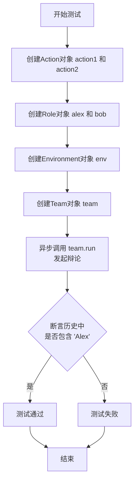

#### 带注释源码

```python
@pytest.mark.asyncio  # 标记此函数为异步测试
async def test_debate_two_roles():
    # 1. 创建两个Action对象，定义角色的发言行为
    action1 = Action(name="AlexSay", instruction="Express your opinion with emotion and don't repeat it")
    action2 = Action(name="BobSay", instruction="Express your opinion with emotion and don't repeat it")
    
    # 2. 创建两个Role对象，分别代表民主党和共和党候选人
    #    - `alex` 关注 `action2` (Bob的发言)
    #    - `bob` 关注 `action1` (Alex的发言)
    alex = Role(
        name="Alex", profile="Democratic candidate", goal="Win the election", actions=[action1], watch=[action2]
    )
    bob = Role(name="Bob", profile="Republican candidate", goal="Win the election", actions=[action2], watch=[action1])
    
    # 3. 创建环境（模拟美国选举直播场景）
    env = Environment(desc="US election live broadcast")
    
    # 4. 创建团队，将两个角色放入同一环境中
    team = Team(investment=10.0, env=env, roles=[alex, bob])
    
    # 5. 运行团队模拟：发起关于“气候变化”的辩论，共进行3轮，初始消息发送给Alex
    #    `idea` 参数定义了辩论主题和规则（每条消息少于80词）
    history = await team.run(idea="Topic: climate change. Under 80 words per message.", send_to="Alex", n_round=3)
    
    # 6. 断言：验证运行后的历史记录中是否包含“Alex”的发言
    assert "Alex" in history
```

### `test_debate_one_role_in_env`

这是一个异步的单元测试函数，用于测试在`Environment`环境中，单个`Role`（角色）执行辩论动作的场景。它创建了一个包含特定动作的角色，将其放入一个团队和环境中，然后运行团队模拟几轮辩论，最后验证运行历史中是否包含该角色的名字。

参数：

-   `无显式参数`：此函数是一个单元测试，使用`pytest.mark.asyncio`装饰器，不接收任何外部参数。

返回值：`None`，此函数是测试函数，其主要目的是通过断言（`assert`）来验证代码行为，不返回业务值。

#### 流程图

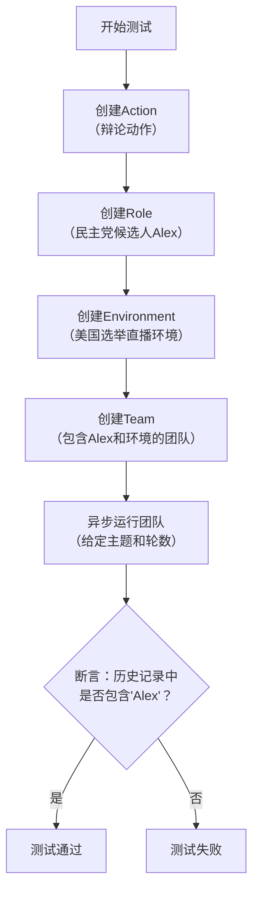

#### 带注释源码

```python
@pytest.mark.asyncio  # 标记此函数为异步测试，以便pytest-asyncio插件处理
async def test_debate_one_role_in_env():
    # 1. 创建一个Action（动作）实例，定义其名称和指令。
    #    指令要求角色带有感情地表达观点且不重复。
    action = Action(name="Debate", instruction="Express your opinion with emotion and don't repeat it")
    
    # 2. 创建一个Role（角色）实例，名为Alex，身份是民主党候选人，目标是赢得选举。
    #    为其分配上一步创建的辩论动作。
    alex = Role(name="Alex", profile="Democratic candidate", goal="Win the election", actions=[action])
    
    # 3. 创建一个Environment（环境）实例，描述为美国选举直播。
    env = Environment(desc="US election live broadcast")
    
    # 4. 创建一个Team（团队）实例，设置初始投资，并包含上面创建的环境和角色。
    team = Team(investment=10.0, env=env, roles=[alex])
    
    # 5. 异步运行团队。
    #    - `idea`: 提供辩论主题和约束（气候变化，每条消息少于80字）。
    #    - `send_to`: 指定初始消息发送给角色Alex。
    #    - `n_round`: 设置模拟运行3轮。
    #    函数返回运行的历史记录。
    history = await team.run(idea="Topic: climate change. Under 80 words per message.", send_to="Alex", n_round=3)
    
    # 6. 断言：验证运行历史（`history`）中是否包含字符串"Alex"。
    #    这是测试的核心验证点，确保指定的角色确实参与了模拟过程。
    assert "Alex" in history
```

### `test_debate_one_role`

这是一个异步单元测试函数，用于测试单个`Role`对象（名为Alex）在接收到一个辩论主题消息后，能够独立运行其内部的`Action`并生成一个有效的`Message`响应。该测试验证了`Role.run`方法的基本功能，确保角色能够处理输入并产生包含一定长度内容且发送者标识正确的输出消息。

参数：

-  `无显式参数`：该函数是一个使用`pytest.mark.asyncio`装饰的测试用例，不接收用户定义的参数。其行为由函数内部固定的测试逻辑和数据驱动。

返回值：`None`，该函数是一个测试用例，其主要目的是通过断言（`assert`）来验证代码行为，不返回业务逻辑值。测试框架会根据断言结果决定测试的通过或失败。

#### 流程图

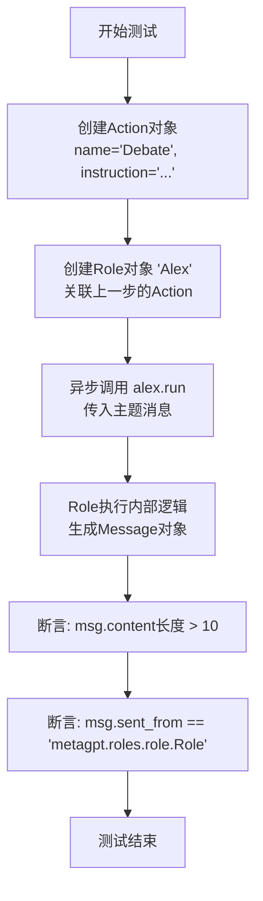

#### 带注释源码

```python
@pytest.mark.asyncio  # 标记此函数为异步测试用例，以便pytest-asyncio插件处理
async def test_debate_one_role():
    # 1. 创建一个Action对象，定义其名称和指令。
    #    这个Action模拟辩论行为，指令要求“带有感情地表达观点且不要重复”。
    action = Action(name="Debate", instruction="Express your opinion with emotion and don't repeat it")
    
    # 2. 创建一个Role对象，命名为“Alex”，设定其档案和目标。
    #    将上一步创建的Action分配给这个角色，这意味着Alex在“运行”时会执行这个Debate动作。
    alex = Role(name="Alex", profile="Democratic candidate", goal="Win the election", actions=[action])
    
    # 3. 异步调用Role的`run`方法，向其发送一个具体的辩论主题消息。
    #    `run`方法会触发角色内部的动作执行，并返回一个Message对象作为响应。
    msg: Message = await alex.run("Topic: climate change. Under 80 words per message.")

    # 4. 断言1：验证返回的Message内容长度大于10个字符。
    #    这是一个基本检查，确保角色确实产生了有意义的文本输出，而不是空或极短的响应。
    assert len(msg.content) > 10
    
    # 5. 断言2：验证Message的`sent_from`属性等于指定的字符串。
    #    这检查了消息的发送者标识是否正确，有助于在复杂系统中追踪消息来源。
    assert msg.sent_from == "metagpt.roles.role.Role"
```

### `test_action_node_one_layer`

该函数是一个异步单元测试，用于测试`ActionNode`类的基本功能，包括节点的编译（compile）和字典转换（to_dict）方法。它验证了节点在不同模式（raw、json、markdown）下生成的模板字符串是否包含预期的内容，并检查了节点的字典表示和字符串表示。

参数：

- 无显式参数（作为pytest测试函数，由测试框架调用）

返回值：`None`，该函数是一个测试函数，不返回业务值，但包含多个断言（assert）来验证代码行为。

#### 流程图

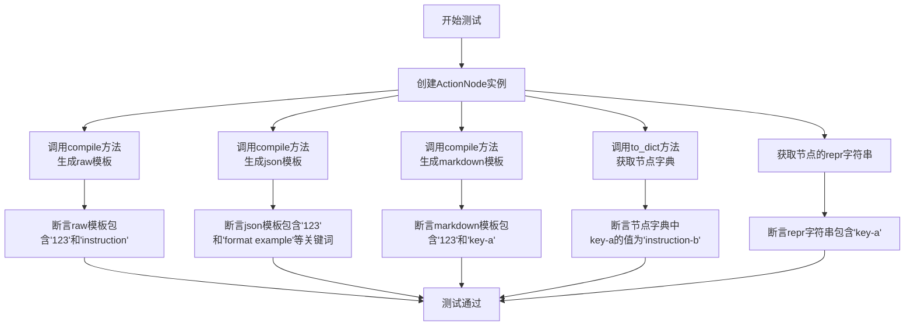

#### 带注释源码

```python
@pytest.mark.asyncio
async def test_action_node_one_layer():
    # 1. 创建一个单层的ActionNode实例，指定其键、期望类型、指令和示例。
    node = ActionNode(key="key-a", expected_type=str, instruction="instruction-b", example="example-c")

    # 2. 使用不同的模式和模式编译节点，生成提示词模板。
    raw_template = node.compile(context="123", schema="raw", mode="auto")
    json_template = node.compile(context="123", schema="json", mode="auto")
    markdown_template = node.compile(context="123", schema="markdown", mode="auto")
    
    # 3. 将节点转换为字典表示。
    node_dict = node.to_dict()

    # 4. 断言验证：检查raw模板是否包含给定的上下文和指令关键词。
    assert "123" in raw_template
    assert "instruction" in raw_template

    # 5. 断言验证：检查json模板是否包含上下文、格式示例、约束、动作等部分。
    assert "123" in json_template
    assert "format example" in json_template
    assert "constraint" in json_template
    assert "action" in json_template
    assert "[/" in json_template

    # 6. 断言验证：检查markdown模板是否包含上下文和节点键。
    assert "123" in markdown_template
    assert "key-a" in markdown_template

    # 7. 断言验证：检查节点字典中特定键的值是否正确。
    assert node_dict["key-a"] == "instruction-b"
    # 8. 断言验证：检查节点的字符串表示是否包含其键。
    assert "key-a" in repr(node)
```

### `test_action_node_two_layer`

该函数是一个异步单元测试，用于验证`ActionNode`类在构建两层结构（根节点包含两个子节点）时的功能。它测试了通过`from_children`方法创建分层节点，并验证子节点是否正确关联。随后，它使用两种不同的策略（"simple"和"complex"）调用根节点的`fill`方法，向LLM提问一个简单的加法问题（123+456），并断言响应中包含正确答案"579"。

参数：

-  `无显式参数`：该函数是一个测试函数，不接收外部参数。它使用`pytest.mark.asyncio`装饰器，表明它是一个异步测试。

返回值：`None`，该函数是一个测试函数，其主要目的是通过断言（assert）来验证代码行为，不返回业务值。

#### 流程图

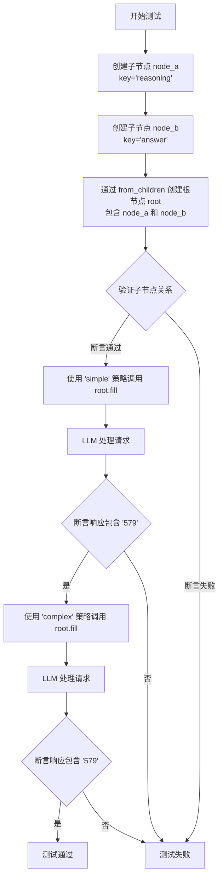

#### 带注释源码

```python
@pytest.mark.asyncio  # 标记此函数为异步测试，以便pytest-asyncio插件可以正确处理
async def test_action_node_two_layer():
    # 1. 创建第一个子ActionNode，代表推理步骤
    node_a = ActionNode(key="reasoning", expected_type=str, instruction="reasoning step by step", example="")
    # 2. 创建第二个子ActionNode，代表最终答案
    node_b = ActionNode(key="answer", expected_type=str, instruction="the final answer", example="")

    # 3. 使用 from_children 类方法，基于两个子节点创建一个根ActionNode
    #    key="detail answer" 定义了根节点的键名
    root = ActionNode.from_children(key="detail answer", nodes=[node_a, node_b])
    # 4. 断言：验证子节点已正确添加到根节点的children字典中
    assert "reasoning" in root.children  # 检查键是否存在
    assert node_b in root.children.values()  # 检查节点对象是否存在

    # 5. 测试使用'simple'策略填充节点内容
    #    req: 传递给LLM的请求/问题
    #    schema: 指定响应格式为JSON
    #    strgy: 使用'simple'策略进行填充
    #    llm: 传入一个LLM实例来处理请求
    answer1 = await root.fill(req="what's the answer to 123+456?", schema="json", strgy="simple", llm=LLM())
    # 6. 断言：验证LLM的响应内容中包含正确答案"579"
    assert "579" in answer1.content

    # 7. 测试使用'complex'策略填充节点内容
    answer2 = await root.fill(req="what's the answer to 123+456?", schema="json", strgy="complex", llm=LLM())
    # 8. 断言：同样验证响应中包含"579"
    assert "579" in answer2.content
```

### `test_action_node_review`

这是一个异步单元测试函数，用于测试 `ActionNode` 类的 `review` 方法。它验证了在单层和多层节点结构下，自动审查模式（`ReviewMode.AUTO`）和不同策略（`strgy`）下，`review` 方法是否能正确识别并返回不符合节点指令的审查意见。

参数：
- 无显式参数。作为 `pytest` 测试函数，它使用 `pytest.mark.asyncio` 装饰器，并由 `pytest` 框架异步调用。

返回值：`None`，这是一个测试函数，其主要目的是通过断言（`assert`）来验证代码行为，不返回业务值。

#### 流程图

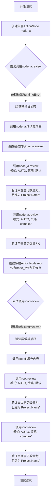

#### 带注释源码

```python
@pytest.mark.asyncio
async def test_action_node_review():
    # 1. 定义测试用的键和创建单层ActionNode
    key = "Project Name"
    node_a = ActionNode(
        key=key,
        expected_type=str,
        instruction='According to the content of "Original Requirements," name the project using snake case style '
        "with underline, like 'game_2048' or 'simple_crm.",
        example="game_2048",
    )

    # 2. 测试未填充内容时调用review应抛出异常
    with pytest.raises(RuntimeError):
        _ = await node_a.review()  # 期望失败，因为instruct_content为空

    # 3. 填充节点内容（使用LLM生成，但req为None，实际可能依赖mock）
    _ = await node_a.fill(req=None, llm=LLM())
    # 4. 故意设置一个不符合指令（非snake_case）的内容，以便后续审查
    setattr(node_a.instruct_content, key, "game snake")  # wrong content to review

    # 5. 测试自动审查模式（默认策略）
    review_comments = await node_a.review(review_mode=ReviewMode.AUTO)
    # 验证：应有一条针对'Project Name'的审查意见
    assert len(review_comments) == 1
    assert list(review_comments.keys())[0] == key

    # 6. 测试自动审查模式下的'complex'策略
    review_comments = await node_a.review(strgy="complex", review_mode=ReviewMode.AUTO)
    # 验证：使用'complex'策略时，审查意见应为空（可能策略更宽松或逻辑不同）
    assert len(review_comments) == 0

    # 7. 创建多层节点（根节点包含node_a作为子节点）
    node = ActionNode.from_children(key="WritePRD", nodes=[node_a])
    # 8. 测试多层节点未填充时调用review应抛出异常
    with pytest.raises(RuntimeError):
        _ = await node.review()

    # 9. 填充多层节点内容
    _ = await node.fill(req=None, llm=LLM())

    # 10. 测试多层节点的自动审查（默认策略）
    review_comments = await node.review(review_mode=ReviewMode.AUTO)
    # 验证：应有一条针对'Project Name'的审查意见
    assert len(review_comments) == 1
    assert list(review_comments.keys())[0] == key

    # 11. 测试多层节点的自动审查（'complex'策略）
    review_comments = await node.review(strgy="complex", review_mode=ReviewMode.AUTO)
    # 验证：应有一条针对'Project Name'的审查意见
    assert len(review_comments) == 1
    assert list(review_comments.keys())[0] == key
```

### `test_action_node_revise`

这是一个异步测试函数，用于验证 `ActionNode` 类的 `revise` 方法。它测试了在简单和复杂策略下，对单个节点和嵌套节点（包含子节点）的错误内容进行自动修订的功能。测试确保 `revise` 方法能够根据指令（例如，将项目名称修正为蛇形命名法）正确地识别并修正 `instruct_content` 中的字段值。

参数：

-  `key`：`str`，用于创建 `ActionNode` 的键名，此处固定为 `"Project Name"`。
-  `node_a`：`ActionNode`，一个叶子节点，其指令要求使用蛇形命名法命名项目。
-  `node`：`ActionNode`，一个根节点，其子节点包含 `node_a`。
-  `revise_contents`：`Dict[str, str]`，`revise` 方法返回的修订内容字典，键为字段名，值为修订后的内容。

返回值：`None`，这是一个测试函数，不返回业务值，使用 `assert` 语句验证测试结果。

#### 流程图

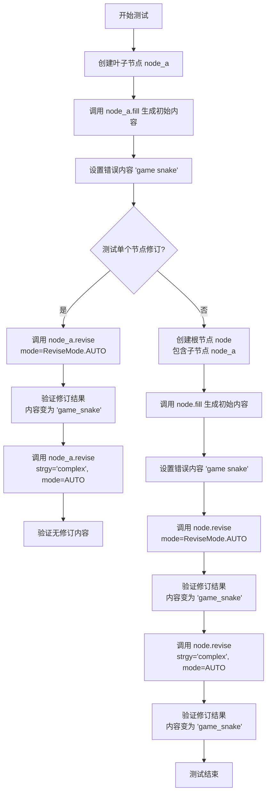

#### 带注释源码

```python
@pytest.mark.asyncio
async def test_action_node_revise():
    # 定义测试中使用的键，对应 ActionNode 的字段名
    key = "Project Name"
    # 创建一个叶子 ActionNode，其指令要求使用蛇形命名法（snake case）命名项目
    node_a = ActionNode(
        key=key,
        expected_type=str,
        instruction='According to the content of "Original Requirements," name the project using snake case style '
        "with underline, like 'game_2048' or 'simple_crm.",
        example="game_2048",
    )

    # 测试1：在调用 fill 方法前调用 revise 应抛出异常，因为 instruct_content 尚未生成
    with pytest.raises(RuntimeError):
        _ = await node_a.revise()

    # 调用 fill 方法，使用 LLM 根据指令生成初始的 instruct_content
    _ = await node_a.fill(req=None, llm=LLM())
    # 故意设置一个不符合蛇形命名法的错误内容，用于测试修订功能
    setattr(node_a.instruct_content, key, "game snake")  # wrong content to revise
    # 测试2：对单个节点进行自动修订（简单策略）
    revise_contents = await node_a.revise(revise_mode=ReviseMode.AUTO)
    # 验证修订确实发生（返回的字典长度为1），并且修订后的内容符合蛇形命名法
    assert len(revise_contents) == 1
    assert "game_snake" in getattr(node_a.instruct_content, key)

    # 测试3：对单个节点使用复杂策略进行自动修订，预期无内容需要修订（因为简单策略已修正）
    revise_contents = await node_a.revise(strgy="complex", revise_mode=ReviseMode.AUTO)
    assert len(revise_contents) == 0

    # 创建一个根节点，并将 node_a 作为其子节点，形成嵌套结构
    node = ActionNode.from_children(key="WritePRD", nodes=[node_a])
    # 测试4：在调用 fill 方法前对嵌套节点调用 revise 应抛出异常
    with pytest.raises(RuntimeError):
        _ = await node.revise()

    # 为嵌套节点生成初始的 instruct_content
    _ = await node.fill(req=None, llm=LLM())
    # 为嵌套节点的对应字段设置错误内容
    setattr(node.instruct_content, key, "game snake")
    # 测试5：对嵌套节点进行自动修订（简单策略）
    revise_contents = await node.revise(revise_mode=ReviseMode.AUTO)
    # 验证修订发生且内容被修正
    assert len(revise_contents) == 1
    assert "game_snake" in getattr(node.instruct_content, key)

    # 测试6：对嵌套节点使用复杂策略进行自动修订
    revise_contents = await node.revise(strgy="complex", revise_mode=ReviseMode.AUTO)
    # 验证修订发生且内容被修正（复杂策略在此场景下也执行了修订）
    assert len(revise_contents) == 1
    assert "game_snake" in getattr(node.instruct_content, key)
```

### `ActionNode.create_model_class`

该方法用于根据给定的字段映射动态创建一个Pydantic模型类。它接收一个类名和一个字段映射字典，返回一个继承自`BaseModel`的Pydantic类。该模型类可用于数据验证和序列化，常用于定义ActionNode的输出结构。

参数：

- `class_name`：`str`，要创建的Pydantic模型类的名称。
- `mapping`：`Dict[str, Tuple[type, Any]]`，字段映射字典，键为字段名，值为一个元组，包含字段类型和可选的`pydantic.Field`配置。

返回值：`Type[BaseModel]`，返回一个动态生成的Pydantic模型类。

#### 流程图

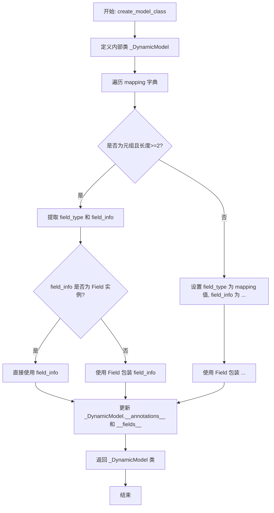

#### 带注释源码

```python
@classmethod
def create_model_class(cls, class_name: str, mapping: Dict[str, Tuple[type, Any]]) -> Type[BaseModel]:
    """
    根据给定的字段映射动态创建一个Pydantic模型类。

    Args:
        class_name (str): 要创建的Pydantic模型类的名称。
        mapping (Dict[str, Tuple[type, Any]]): 字段映射字典，键为字段名，值为一个元组，
                                               包含字段类型和可选的`pydantic.Field`配置。

    Returns:
        Type[BaseModel]: 返回一个动态生成的Pydantic模型类。
    """
    # 定义一个内部类，继承自BaseModel，用于动态创建模型
    class _DynamicModel(BaseModel):
        pass

    # 遍历字段映射字典，为每个字段动态添加到模型中
    for key, value in mapping.items():
        # 如果映射值是元组且长度大于等于2，则提取字段类型和字段信息
        if isinstance(value, tuple) and len(value) >= 2:
            field_type, field_info = value[0], value[1]
        else:
            # 否则，映射值直接作为字段类型，字段信息使用省略号(...)表示
            field_type, field_info = value, ...

        # 如果字段信息是Field实例，则直接使用；否则，使用Field包装字段信息
        if isinstance(field_info, Field):
            field = field_info
        else:
            field = Field(field_info)

        # 更新内部类的__annotations__属性，添加字段类型注解
        _DynamicModel.__annotations__[key] = field_type
        # 更新内部类的__fields__属性，添加字段定义
        _DynamicModel.__fields__[key] = ModelField(
            name=key,
            type_=field_type,
            class_validators=None,
            model_config=_DynamicModel.__config__,
            required=False,
            default=field.default if hasattr(field, 'default') else ...,
            default_factory=field.default_factory if hasattr(field, 'default_factory') else None,
            alias=field.alias if hasattr(field, 'alias') else None,
            field_info=field,
        )

    # 设置内部类的名称为传入的class_name
    _DynamicModel.__name__ = class_name
    # 返回动态创建的模型类
    return _DynamicModel
```

### `test_create_model_class_with_fields_unrecognized`

该函数是 `ActionNode` 类的一个单元测试，用于测试 `ActionNode.create_model_class` 方法在创建 Pydantic 模型类时，当传入的字典数据包含输出映射中未定义的字段时的行为。具体来说，它验证了当使用一个不完整的输出映射（`WRITE_TASKS_OUTPUT_MAPPING_MISSING`）创建模型类后，使用包含额外字段（`t_dict`）的字典初始化该模型实例时，程序不会抛出异常，而是仅产生警告。

参数：

-  `无`：`无`，该函数是一个单元测试函数，不接受任何参数。

返回值：`None`，该函数是一个单元测试函数，不返回任何值，其成功执行（不抛出异常）即表示测试通过。

#### 流程图

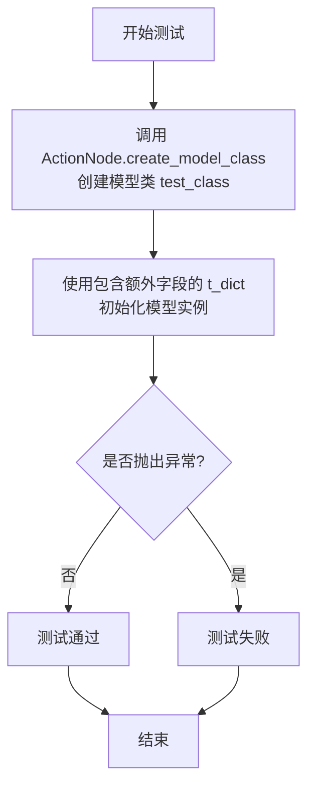

#### 带注释源码

```python
def test_create_model_class_with_fields_unrecognized():
    # 使用一个不完整的输出映射（仅包含一个字段）创建 Pydantic 模型类
    test_class = ActionNode.create_model_class("test_class", WRITE_TASKS_OUTPUT_MAPPING_MISSING)
    # 断言创建的类名正确
    assert test_class.__name__ == "test_class"

    # 使用包含多个字段（包括映射中未定义的字段）的字典 t_dict 来实例化模型
    # 预期行为：Pydantic 会忽略未在模型定义中声明的字段，并发出警告，但不会抛出 ValidationError
    _ = test_class(**t_dict)  # just warning
```

### `test_create_model_class_with_fields_missing`

该函数是一个单元测试，用于验证 `ActionNode.create_model_class` 方法在创建Pydantic模型类时，当传入的字段映射字典 `WRITE_TASKS_OUTPUT_MAPPING` 包含多个字段，但实际用于实例化的数据字典 `t_dict_min` 缺少部分必需字段时，是否会正确地抛出 `ValidationError` 异常。这确保了模型对输入数据的完整性有严格的校验。

参数：

-  `无显式参数`：该函数是一个测试函数，不接受任何外部参数。它内部定义了 `test_class` 和 `t_dict_min` 变量用于测试。

返回值：`None`，该函数是一个测试用例，其主要目的是通过断言（`assert`）和异常捕获（`with pytest.raises`）来验证代码行为，不返回业务逻辑值。

#### 流程图

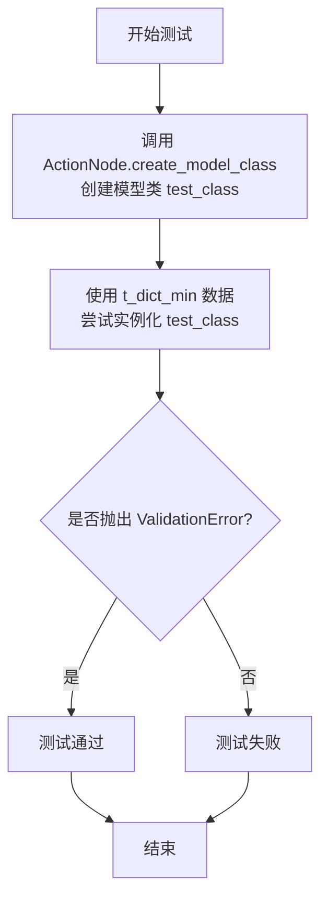

#### 带注释源码

```python
def test_create_model_class_with_fields_missing():
    # 使用 WRITE_TASKS_OUTPUT_MAPPING 映射字典创建一个名为 "test_class" 的 Pydantic 模型类。
    # 该映射定义了模型应包含的多个字段及其类型约束。
    test_class = ActionNode.create_model_class("test_class", WRITE_TASKS_OUTPUT_MAPPING)
    # 断言创建的类名正确。
    assert test_class.__name__ == "test_class"

    # 使用 `pytest.raises` 上下文管理器来捕获预期的 ValidationError 异常。
    # t_dict_min 是一个最小化的字典，它只包含映射中定义的部分字段（例如，仅包含"Required Python third-party packages"），
    # 而缺少其他必需字段（如"Full API spec"、"Logic Analysis"等）。
    # 因此，尝试用此不完整的数据实例化模型类应该失败。
    with pytest.raises(ValidationError):
        # 尝试使用不完整的 t_dict_min 数据来实例化 test_class。
        # 如果这行代码没有抛出 ValidationError，则上下文管理器会认为测试失败。
        _ = test_class(**t_dict_min)
```

### `test_create_model_class_with_mapping`

这是一个单元测试函数，用于验证 `ActionNode.create_model_class` 方法能够根据给定的映射字典正确创建一个Pydantic模型类，并且该模型类能够成功实例化并处理符合映射结构的数据。

参数：

-   无显式参数。它是一个测试函数，其参数由 `pytest` 框架隐式管理。

返回值：无显式返回值（`None`）。测试函数通过 `assert` 语句验证预期行为，若断言失败则测试不通过。

#### 流程图

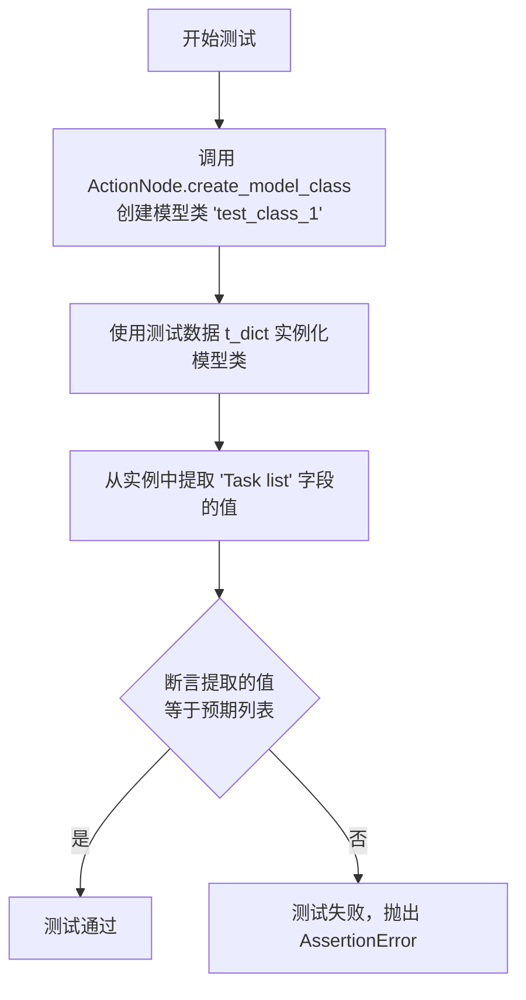

#### 带注释源码

```python
def test_create_model_class_with_mapping():
    # 调用 ActionNode 的类方法 create_model_class，传入类名和预定义的输出映射字典
    # 该方法根据映射字典动态创建一个 Pydantic 模型类
    t = ActionNode.create_model_class("test_class_1", WRITE_TASKS_OUTPUT_MAPPING)
    
    # 使用全局定义的测试数据字典 t_dict 来实例化上一步创建的模型类
    # 这会触发 Pydantic 的数据验证和解析
    t1 = t(**t_dict)
    
    # 从模型实例中获取 'Task list' 字段的值
    value = t1.model_dump()["Task list"]
    
    # 断言：验证获取到的任务列表与预期的列表完全一致
    # 这是本测试的核心验证点，确保模型创建和数据处理功能正确
    assert value == ["game.py", "app.py", "static/css/styles.css", "static/js/script.js", "templates/index.html"]
```

### `test_action_node_with_image`

这是一个异步单元测试函数，用于测试 `ActionNode` 类在接收图像输入时的功能。它模拟了一个场景：给定一张发票图片，要求 `ActionNode` 判断该图片是否为发票。函数通过模拟（mocking）LLM的调用参数来测试图像处理流程，并验证 `ActionNode` 的输出是否符合预期。

参数：

-  `mocker`：`pytest_mock.plugin.MockerFixture`，pytest-mock 插件提供的模拟对象，用于在测试中替换或模拟函数、方法的行为。

返回值：`None`，这是一个测试函数，不返回业务值，其成功与否由 `assert` 语句决定。

#### 流程图

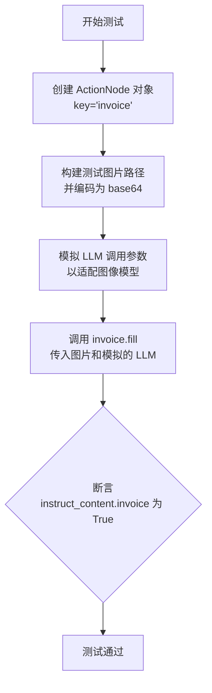

#### 带注释源码

```python
@pytest.mark.asyncio
async def test_action_node_with_image(mocker):
    # 定义一个内部函数，用于模拟 OpenAILLM._cons_kwargs 方法。
    # 目的是在单元测试中，将 LLM 的调用参数修改为支持图像处理的模型（gpt-4-vision-preview）。
    def _cons_kwargs(self, messages: list[dict], timeout=3, **extra_kwargs) -> dict:
        kwargs = {"messages": messages, "temperature": 0.3, "model": "gpt-4-vision-preview"}
        return kwargs

    # 创建一个 ActionNode 实例，其任务是判断输入是否为发票。
    # key: 输出字段的名称。
    # expected_type: 期望的输出类型（布尔值）。
    # instruction: 给 LLM 的指令，说明如何判断。
    # example: 提供一个示例输出。
    invoice = ActionNode(
        key="invoice", expected_type=bool, instruction="if it's a invoice file, return True else False", example="False"
    )

    # 构建测试图片（一张发票）的路径。Path(__file__).parent 获取当前文件所在目录，
    # 然后通过 joinpath 向上两级并进入 data/invoices 目录找到图片。
    invoice_path = Path(__file__).parent.joinpath("..", "..", "data", "invoices", "invoice-2.png")
    # 使用工具函数 encode_image 将图片文件编码为 base64 字符串，这是多模态 LLM 常见的输入格式。
    img_base64 = encode_image(invoice_path)
    # 使用 mocker.patch 将 metagpt.provider.openai_api.OpenAILLM._cons_kwargs 方法
    # 临时替换为上面定义的 _cons_kwargs。这样当 LLM 被调用时，会使用支持图像的模型参数。
    mocker.patch("metagpt.provider.openai_api.OpenAILLM._cons_kwargs", _cons_kwargs)
    # 调用 ActionNode 的 fill 方法，传入请求（空字符串）、LLM 实例和图像列表。
    # fill 方法会组织 prompt（包含指令和图像），调用 LLM，并将结果解析到 instruct_content 中。
    node = await invoice.fill(req="", llm=LLM(), images=[img_base64])
    # 断言：检查 fill 方法返回的 node 对象中的 instruct_content.invoice 字段是否为 True。
    # 这验证了 ActionNode 能够正确接收图像输入，并基于 LLM 的判断返回正确的结果。
    assert node.instruct_content.invoice
```

### `test_action_node_from_pydantic_and_print_everything`

该函数用于测试从Pydantic模型创建ActionNode的功能，并打印相关调试信息以验证转换过程。它通过给定的Pydantic模型（Task类）生成对应的ActionNode，然后输出模型的JSON表示、JSON模式、ActionNode结构、编译后的提示文本、子节点映射、生成的子类代码等，以验证ActionNode是否正确地从Pydantic模型派生并包含了所有必要的字段信息。

参数：

- 无参数

返回值：`None`，无返回值

#### 流程图

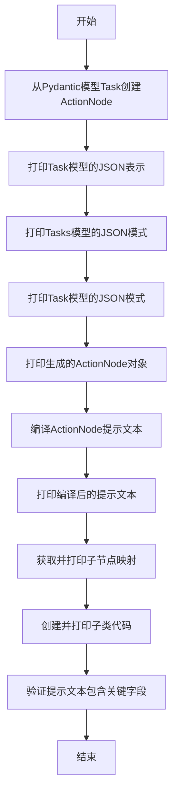

#### 带注释源码

```python
def test_action_node_from_pydantic_and_print_everything():
    # 从Pydantic模型Task创建ActionNode实例
    node = ActionNode.from_pydantic(Task)
    
    # 打印Task模型的JSON表示（缩进格式）
    print("1. Tasks")
    print(Task().model_dump_json(indent=4))
    
    # 打印Tasks模型的JSON模式
    print(Tasks.model_json_schema())
    
    # 打印Task模型的JSON模式
    print("2. Task")
    print(Task.model_json_schema())
    
    # 打印生成的ActionNode对象
    print("3. ActionNode")
    print(node)
    
    # 编译ActionNode的提示文本（使用空上下文）
    print("4. node.compile prompt")
    prompt = node.compile(context="")
    
    # 验证提示文本是否包含关键字段'tool_name'
    assert "tool_name" in prompt, "tool_name should be in prompt"
    print(prompt)
    
    # 获取并打印ActionNode的子节点映射
    print("5. node.get_children_mapping")
    print(node._get_children_mapping())
    
    # 创建并打印基于ActionNode生成的子类代码
    print("6. node.create_children_class")
    children_class = node._create_children_class()
    print(children_class)
    
    # 获取Tasks模型的源代码并打印，验证是否包含'tasks'字段
    import inspect
    code = inspect.getsource(Tasks)
    print(code)
    assert "tasks" in code, "tasks should be in code"
```

### `test_optional`

该函数用于测试 `ActionNode.create_model_class` 方法处理包含 `Optional` 类型字段的映射字典的能力。它创建一个动态的 Pydantic 模型类，并使用一个仅包含部分字段的字典进行实例化，验证模型能够正确处理可选字段的默认值。

参数：

-  `mapping`：`dict`，一个字典，其键为字段名，值为一个元组，元组包含字段类型（如 `Optional[List[Tuple[str, str]]]`）和可选的 `pydantic.Field` 对象或默认值。
-  `m`：`dict`，一个仅包含部分字段（如 `"Anything UNCLEAR"`）的字典，用于实例化创建的模型类。

返回值：`None`，该函数是一个测试函数，主要目的是通过断言验证功能，不返回具体值。

#### 流程图

```mermaid
flowchart TD
    A[开始] --> B[定义包含Optional字段的映射字典 mapping]
    B --> C[定义部分字段数据字典 m]
    C --> D[调用 ActionNode.create_model_class<br>创建动态Pydantic模型类 t]
    D --> E[使用字典 m 实例化模型 t1 = t(**m)]
    E --> F{实例化是否成功?}
    F -- 是 --> G[断言 t1 存在]
    G --> H[结束]
    F -- 否 --> I[抛出异常]
    I --> H
```

#### 带注释源码

```python
def test_optional():
    # 定义一个映射字典，其中包含多个可选（Optional）类型的字段。
    # 这些字段在实例化模型时可以不提供，系统会使用指定的默认值。
    mapping = {
        "Logic Analysis": (Optional[List[Tuple[str, str]]], Field(default=None)),
        "Task list": (Optional[List[str]], None),
        "Plan": (Optional[str], ""),
        "Anything UNCLEAR": (Optional[str], None),
    }
    # 创建一个仅包含部分字段（"Anything UNCLEAR"）的字典。
    # 用于测试模型是否能正确处理缺失的可选字段。
    m = {"Anything UNCLEAR": "a"}
    # 调用 ActionNode 的类方法，根据提供的映射字典动态创建一个 Pydantic 模型类。
    # 类名被指定为 "test_class_1"。
    t = ActionNode.create_model_class("test_class_1", mapping)

    # 使用部分数据字典 m 来实例化刚刚创建的模型类。
    # 此操作应成功，因为未提供的字段（Logic Analysis, Task list, Plan）都是可选的。
    t1 = t(**m)
    # 断言实例化成功，对象 t1 被正确创建。
    assert t1
```

## 关键组件


### ActionNode

ActionNode 是用于结构化生成和验证LLM输出的核心组件，它通过定义键、期望类型、指令和示例来构建一个可执行的“动作节点”，支持单层或多层嵌套结构，并能根据动态映射生成Pydantic模型类，以实现对LLM响应的强类型约束和自动解析。

### 动态模型类生成 (create_model_class)

该功能允许根据一个字段映射字典（字段名 -> (类型, 默认值/Field配置)）动态地创建Pydantic模型类。这使得ActionNode能够灵活地适配不同任务所需的输出格式，并为LLM的响应提供结构化的验证和解析能力。

### 编译与模板生成 (compile)

根据指定的上下文、输出模式（如 raw, json, markdown）和编译模式，将ActionNode及其子节点的指令、约束、示例等信息组合成最终发送给LLM的提示词模板。这确保了与LLM交互的请求格式是标准化和可配置的。

### 内容填充与执行 (fill)

使用LLM根据编译好的提示词模板和用户请求生成内容，并将LLM的原始响应解析并填充到ActionNode的`instruct_content`属性中。该过程完成了从结构化指令到具体内容产出的核心链路。

### 审查机制 (review)

对ActionNode已填充的`instruct_content`进行检查，判断其内容是否符合节点定义的约束（如格式、内容要求）。支持不同的审查策略（如 simple, complex）和模式（如 AUTO），并返回审查意见。

### 修订机制 (revise)

基于审查结果或直接触发，使用LLM对ActionNode中不符合要求的`instruct_content`进行自动修订，以生成更符合指令和约束的内容。同样支持不同的修订策略和模式。

### 从Pydantic模型构建 (from_pydantic)

根据一个已有的Pydantic模型类，自动构建出对应的ActionNode树状结构。这实现了将静态的数据模型反向映射为可执行的动态指令节点，便于与现有数据体系集成。

### 团队模拟与角色交互 (Team, Role, Action)

通过组合Role（角色，包含目标、行动和观察列表）、Action（基础动作）和Environment（环境），Team（团队）组件可以模拟多智能体间的协作与竞争（如辩论场景），并运行多轮交互。这展示了ActionNode在更复杂工作流中的应用基础。


## 问题及建议


### 已知问题

-   **测试用例依赖外部资源**：`test_action_node_with_image` 测试用例依赖于项目 `data/invoices/invoice-2.png` 路径下的特定图片文件。如果该文件被移动、重命名或删除，测试将失败，降低了测试的健壮性和可移植性。
-   **测试用例存在硬编码的 Mock**：`test_action_node_with_image` 测试用例通过 `mocker.patch` 直接修改了 `OpenAILLM._cons_kwargs` 方法，将模型硬编码为 `"gpt-4-vision-preview"`。这种硬编码方式使得测试与特定模型实现深度耦合，当底层 LLM 提供者或模型名称变更时，测试容易失效。
-   **测试用例断言过于宽松**：`test_action_node_with_image` 测试用例的断言 `assert node.instruct_content.invoice` 仅检查了 `invoice` 字段是否为真值，但没有验证其具体值（例如，是否为预期的 `True`）。如果 LLM 返回了非布尔值（如字符串 `"True"`）或错误的值（如 `False`），测试可能无法准确捕获问题。
-   **测试用例存在未使用的导入**：代码中导入了 `pydantic` 的 `BaseModel` 和 `Field`，但在测试函数 `test_action_node_with_image` 中并未直接使用，可能是在其他测试函数中使用。虽然不影响功能，但保持导入的整洁性有助于代码维护。
-   **测试用例的 `FIXME` 注释**：`test_action_node_two_layer` 测试用例中包含注释 `# FIXME: ADD MARKDOWN SUPPORT. NEED TO TUNE MARKDOWN SYMBOL FIRST.`，这表明代码中存在已知的、待解决的功能缺陷（对 Markdown 格式的支持不完整），但目前测试可能绕过了这个问题或未充分测试该功能。

### 优化建议

-   **使用测试固件或模拟数据**：对于 `test_action_node_with_image` 测试用例，建议将外部图片文件转换为 Base64 编码的字符串常量，并直接嵌入到测试代码中，或者使用一个轻量级的、确定性的模拟图片数据。这样可以消除对外部文件的依赖，使测试完全自包含。
-   **抽象 Mock 逻辑，提高可配置性**：建议将 Mock LLM 响应的逻辑抽象到一个可重用的测试辅助函数或固件中。避免在测试用例内部直接修补具体的方法实现。可以考虑使用一个配置化的 Mock LLM 类，使其行为（包括返回的模型名称）更容易在测试间进行控制和调整。
-   **增强断言的具体性和准确性**：将 `test_action_node_with_image` 测试用例中的断言修改为 `assert node.instruct_content.invoice is True`，以明确检查布尔值 `True`，提高测试的精确度，防止因类型转换或意外值导致的误判。
-   **清理未使用的导入**：定期检查并移除测试文件中未使用的导入语句，保持代码的清晰度。可以使用代码检查工具（如 `flake8`）来自动识别这类问题。
-   **制定计划解决 `FIXME` 问题**：针对 `test_action_node_two_layer` 中的 `FIXME` 注释，应将其转化为一个明确的技术债务条目或开发任务。评估实现完整 Markdown 支持的必要性和工作量，并安排优先级进行修复，同时更新或补充相关的测试用例以确保功能正确性。
-   **考虑增加更多边界和异常测试**：当前的测试用例主要覆盖了正常流程。建议增加更多针对 `ActionNode` 边界条件（如空输入、极大/极小值）和异常情况（如无效的 `schema` 参数、LLM 调用失败）的测试，以提高代码的鲁棒性。


## 其它

### 设计目标与约束

本测试文件旨在验证`ActionNode`类的核心功能及其在`Team`、`Role`、`Action`等组件构成的智能体协作系统中的行为。设计目标包括：1) 验证`ActionNode`的构建、编译、填充、审查和修订功能；2) 测试`ActionNode`与Pydantic模型的集成能力；3) 验证基于`ActionNode`构建的角色在团队环境中进行多轮辩论的流程。主要约束是测试的异步特性，需要确保所有异步操作正确执行和等待。

### 错误处理与异常设计

测试中明确设计了异常场景以验证系统的鲁棒性。例如，在`test_action_node_review`和`test_action_node_revise`中，在`instruct_content`未填充时调用`review()`或`revise()`方法会预期抛出`RuntimeError`。在`test_create_model_class_with_fields_missing`中，当输入数据不满足Pydantic模型定义的必填字段时，预期抛出`ValidationError`。这些测试确保了核心组件在非法状态或非法输入下能抛出正确的异常，防止状态不一致。

### 数据流与状态机

测试展示了`ActionNode`对象的关键状态流转：1) **初始化**：通过构造函数或`from_children`、`from_pydantic`方法创建节点。2) **填充**：调用`fill`方法，传入LLM和请求，节点进入“已填充”状态，生成`instruct_content`。3) **审查/修订**：在“已填充”状态下，可以调用`review`或`revise`方法，根据`ReviewMode`或`ReviseMode`对内容进行评估或修正。测试`test_debate_*`则展示了更高层的团队数据流：`Team.run`触发`Role`执行`Action`，生成`Message`并放入`Environment`，被`watch`的`Role`响应，构成多轮对话循环。

### 外部依赖与接口契约

1.  **LLM服务**：测试通过`LLM()`类（可能是一个Mock或配置了测试密钥的真实客户端）与大型语言模型交互。`ActionNode.fill`、`review`、`revise`方法的核心逻辑依赖LLM的补全能力。测试`test_action_node_with_image`还特别测试了支持图像输入的LLM接口。
2.  **Pydantic**：`ActionNode`深度集成Pydantic，用于定义数据模型、验证和数据序列化。`create_model_class`方法动态生成Pydantic模型，`from_pydantic`方法从现有Pydantic模型生成节点结构。测试验证了这种集成的正确性。
3.  **pytest框架**：作为测试运行和组织的框架，提供了`@pytest.mark.asyncio`装饰器以支持异步测试，以及`pytest.raises`用于异常断言。
4.  **文件系统**：`test_action_node_with_image`测试依赖于读取指定路径（`../data/invoices/invoice-2.png`）的图片文件，并将其编码为base64格式，这构成了对本地文件系统的依赖。
    