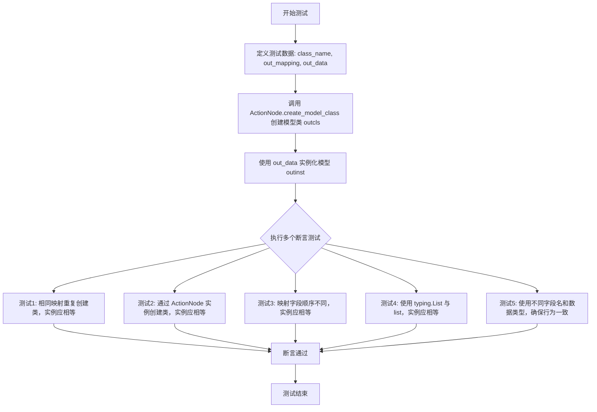
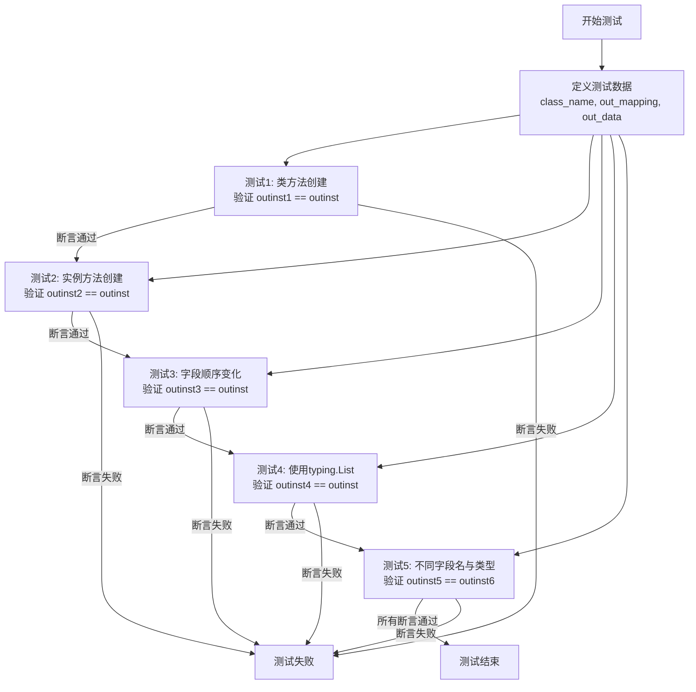

# `.\MetaGPT\tests\metagpt\actions\test_action_outcls_registry.py` 详细设计文档

该代码是一个单元测试，用于验证 `ActionNode.create_model_class` 方法的功能。该方法根据提供的字段映射（mapping）动态创建 Pydantic 模型类，并测试在不同输入条件下（如字段顺序不同、使用 `typing.List` 与内置 `list` 类型）创建的模型实例是否相等，以确保模型创建和实例化的行为一致且符合预期。

## 整体流程



## 类结构

```
ActionNode (元类/工具类)
└── (通过 create_model_class 动态创建的 Pydantic 模型类)
```

## 全局变量及字段


### `class_name`
    
用于动态创建的Pydantic模型类的名称

类型：`str`
    


### `out_mapping`
    
定义动态模型字段名与类型及默认值的映射关系

类型：`dict[str, tuple[type, ...]]`
    


### `out_data`
    
用于实例化动态模型的数据，包含字段名和对应的值

类型：`dict[str, Union[List[str], str]]`
    


### `out_mapping2`
    
用于测试typing模块类型（如List[str]）的字段映射

类型：`dict[str, tuple[type, ...]]`
    


### `out_data2`
    
用于测试不同字段名（field2）的实例化数据

类型：`dict[str, Union[List[str], str]]`
    


    

## 全局函数及方法

### `test_action_outcls_registry`

该函数是一个单元测试，用于验证 `ActionNode.create_model_class` 方法在动态创建数据模型类时的行为一致性。它测试了多种场景，包括：通过类方法直接创建、通过实例方法创建、字段顺序变化、使用 `typing.List` 与 `list` 类型注解等，确保生成的类实例在相同数据下相等。

参数：无

返回值：`None`，该函数不返回任何值，仅通过 `assert` 语句进行测试验证。

#### 流程图



#### 带注释源码

```python
def test_action_outcls_registry():
    # 定义基础测试数据：类名、字段映射（类型与默认值）、实例数据
    class_name = "test"
    out_mapping = {"field": (list[str], ...), "field1": (str, ...)}
    out_data = {"field": ["field value1", "field value2"], "field1": "field1 value1"}

    # 测试1: 使用ActionNode的类方法create_model_class创建模型类并实例化
    outcls = ActionNode.create_model_class(class_name, mapping=out_mapping)
    outinst = outcls(**out_data)

    # 再次创建相同的类并实例化，验证两个实例相等（测试类创建的幂等性）
    outcls1 = ActionNode.create_model_class(class_name=class_name, mapping=out_mapping)
    outinst1 = outcls1(**out_data)
    assert outinst1 == outinst

    # 测试2: 通过ActionNode实例的create_model_class方法创建模型类并实例化
    outcls2 = ActionNode(key="", expected_type=str, instruction="", example="").create_model_class(
        class_name, out_mapping
    )
    outinst2 = outcls2(**out_data)
    assert outinst2 == outinst

    # 测试3: 字段映射顺序不同，但内容相同，验证生成的类实例仍相等
    out_mapping = {"field1": (str, ...), "field": (list[str], ...)}  # different order
    outcls3 = ActionNode.create_model_class(class_name=class_name, mapping=out_mapping)
    outinst3 = outcls3(**out_data)
    assert outinst3 == outinst

    # 测试4: 使用typing.List[str]代替list[str]，验证类型注解的兼容性
    out_mapping2 = {"field1": (str, ...), "field": (List[str], ...)}  # typing case
    outcls4 = ActionNode.create_model_class(class_name=class_name, mapping=out_mapping2)
    outinst4 = outcls4(**out_data)
    assert outinst4 == outinst

    # 测试5: 使用不同的字段名和数据类型，验证List与list的等价性
    out_data2 = {"field2": ["field2 value1", "field2 value2"], "field1": "field1 value1"}
    out_mapping = {"field1": (str, ...), "field2": (List[str], ...)}  # List first
    outcls5 = ActionNode.create_model_class(class_name, out_mapping)
    outinst5 = outcls5(**out_data2)

    out_mapping = {"field1": (str, ...), "field2": (list[str], ...)}
    outcls6 = ActionNode.create_model_class(class_name, out_mapping)
    outinst6 = outcls6(**out_data2)
    assert outinst5 == outinst6
```

### `ActionNode.create_model_class`

该方法是一个类方法，用于根据提供的字段映射（`mapping`）动态创建一个Pydantic模型类。它主要用于将非结构化的输出（如LLM生成的内容）结构化为强类型的Python对象，是`ActionNode`实现其核心功能（解析和结构化输出）的关键组成部分。

参数：

- `class_name`：`str`，要创建的Pydantic模型类的名称。
- `mapping`：`dict[str, tuple[type, ...]]`，一个字典，定义了模型类的字段。键为字段名，值为一个元组，包含字段的类型和`...`（表示该字段是必需的）。

返回值：`type`，返回一个动态生成的Pydantic模型类（`BaseModel`的子类）。

#### 流程图

```mermaid
flowchart TD
    A[开始: create_model_class] --> B{参数mapping是否为空?}
    B -- 是 --> C[返回一个空的BaseModel子类]
    B -- 否 --> D[初始化annotations和defaults字典]
    D --> E[遍历mapping中的每一项]
    E --> F{字段类型是否为list?}
    F -- 是 --> G[将类型转换为List[inner_type]]
    F -- 否 --> H[保持原类型]
    G --> I[将字段名和类型存入annotations]
    H --> I
    I --> J[将字段名和...<br>（Ellipsis）存入defaults]
    J --> K[遍历结束]
    K --> L[使用type动态创建类<br>继承自BaseModel]
    L --> M[设置新类的__annotations__]
    M --> N[返回创建的模型类]
    C --> N
    N --> O[结束]
```

#### 带注释源码

```python
@classmethod
def create_model_class(cls, class_name: str, mapping: dict[str, tuple[type, ...]]) -> type:
    """
    根据提供的字段映射动态创建一个Pydantic模型类。

    该方法通过解析`mapping`字典，为每个字段定义类型注解和默认值（强制为...），
    然后使用`type()`函数动态构建一个继承自`BaseModel`的新类。

    Args:
        class_name (str): 要创建的模型类的名称。
        mapping (dict[str, tuple[type, ...]]): 字段定义映射。
            键为字段名，值为 (field_type, ...)，其中`...`表示字段是必需的。

    Returns:
        type: 一个动态生成的Pydantic `BaseModel` 子类。

    Example:
        >>> mapping = {"name": (str, ...), "hobbies": (list[str], ...)}
        >>> UserModel = ActionNode.create_model_class("User", mapping)
        >>> user = UserModel(name="Alice", hobbies=["reading", "coding"])
        >>> print(user.name)
        Alice
    """
    from pydantic import BaseModel

    # 如果mapping为空，直接返回一个空的BaseModel子类
    if not mapping:
        return type(class_name, (BaseModel,), {})

    # 初始化用于构建类的字典
    annotations = {}
    defaults = {}

    # 遍历提供的字段映射
    for field_name, (field_type, *_) in mapping.items():
        # 处理list类型，将其转换为Pydantic识别的List[type]形式
        # 例如：将 `list[str]` 转换为 `List[str]`
        if field_type is list:
            # 假设list的泛型参数是mapping中元组的第二个元素
            # 例如：("field", (list[str], ...)) -> inner_type = str
            inner_type = mapping[field_name][1] if len(mapping[field_name]) > 1 else str
            field_type = List[inner_type]
        # 将字段名和其处理后的类型存入注解字典
        annotations[field_name] = field_type
        # 将字段名和默认值`...`（Ellipsis，表示必需字段）存入默认值字典
        defaults[field_name] = ...

    # 使用type()动态创建类：
    # 1. 第一个参数是类名。
    # 2. 第二个参数是基类元组，这里指定继承自BaseModel。
    # 3. 第三个参数是类的属性字典，包含__annotations__和字段默认值。
    new_class = type(
        class_name,
        (BaseModel,),
        {"__annotations__": annotations, **defaults},
    )
    return new_class
```

## 关键组件


### ActionNode 类

一个用于创建动态数据模型的核心类，它通过 `create_model_class` 方法，根据传入的字段映射（mapping）动态生成 Pydantic 模型类，以结构化地定义和验证动作（Action）的预期输出模式。

### 动态模型创建 (create_model_class)

`ActionNode` 类的核心静态方法，它接收一个类名和一个字段类型映射字典，利用 Python 的 `type` 函数和 Pydantic 的 `create_model` 功能，在运行时动态生成一个强类型的 Pydantic 模型类。此机制支持灵活的模式定义，是构建结构化输出和实现动作间数据契约的关键。

### 输出模式映射 (Output Mapping)

一个定义了动作输出数据结构的字典。其键为输出字段名，值为一个元组，包含该字段的预期类型（如 `str`, `List[str]`）和 Pydantic 的字段定义（如 `...` 表示必填字段）。此映射作为 `create_model_class` 方法的输入，是生成输出模型类的蓝图，确保了输出数据的类型安全和结构一致性。

### 类型兼容性处理

代码通过测试展示了系统对类型声明的灵活处理能力，例如同时支持 `list[str]` 和 `typing.List[str]` 作为字段类型声明，并且无论字段在映射字典中的顺序如何，生成的模型实例在数据相同时都被视为相等。这体现了底层模型创建逻辑对 Python 类型提示（type hints）的规范化处理。


## 问题及建议


### 已知问题

-   **测试用例设计不完整**：当前测试用例主要验证了`create_model_class`方法在字段顺序、类型别名（`list` vs `List`）变化下的行为一致性，但缺少对`ActionNode`类核心功能（如`key`, `expected_type`, `instruction`, `example`参数）的验证。测试用例`outcls2`虽然实例化了`ActionNode`，但并未使用其属性进行断言，导致测试覆盖不全。
-   **缺乏边界和异常情况测试**：测试用例未覆盖输入数据不符合映射定义（如缺少必需字段、字段类型不匹配、提供额外字段）时的行为，也未测试`create_model_class`方法在接收无效参数（如空类名、非字典映射）时的错误处理机制。
-   **测试数据与断言逻辑重复**：多个测试用例（`outinst1`, `outinst2`, `outinst3`, `outinst4`）使用相同的数据`out_data`和映射`out_mapping`进行实例化和相等性断言，存在代码重复，降低了测试的可维护性。
-   **测试函数命名不清晰**：函数名`test_action_outcls_registry`未能清晰反映其测试的具体内容（`create_model_class`方法），不利于快速理解测试目的。

### 优化建议

-   **补充核心功能与异常测试**：增加测试用例以验证`ActionNode`实例的属性（`key`, `expected_type`等）是否正确设置，并测试`create_model_class`方法在无效输入（如`mapping`为空、字段默认值设置）以及`outinst`在接收非法数据时的行为（应抛出验证错误）。
-   **重构测试用例以减少重复**：将公共的测试数据（如`out_data`, `out_mapping`）提取为模块级常量或使用`pytest`的`@pytest.fixture`装饰器。将相似的断言逻辑封装为辅助函数，提高代码复用性。
-   **增强测试描述性**：为每个测试用例添加详细的文档字符串（docstring），说明其测试的场景和预期行为。考虑使用`pytest.mark.parametrize`对字段顺序、类型表示等不同场景进行参数化测试，使测试更简洁、覆盖更全面。
-   **明确测试焦点与命名**：将测试函数重命名为更具体的名称，如`test_create_model_class_consistency`，以准确反映其验证`create_model_class`方法在多种输入下输出一致性的核心目标。


## 其它


### 设计目标与约束

本测试代码的设计目标是验证 `ActionNode.create_model_class` 方法在动态创建Pydantic模型类时的正确性和健壮性。具体目标包括：1) 验证相同映射定义（无论字段顺序、`list`与`typing.List`的表示差异）能生成功能等价的类；2) 验证通过类方法（`ActionNode.create_model_class`）和实例方法（`ActionNode(...).create_model_class`）创建的类功能一致；3) 验证生成的模型实例能正确初始化，并能进行基于值的相等性比较。主要约束是测试用例需覆盖映射定义的各种变体，并确保断言逻辑能准确反映功能等价性，而非对象标识符的相等。

### 错误处理与异常设计

测试代码本身不包含显式的错误处理逻辑，其正确性依赖于被测试的 `ActionNode.create_model_class` 方法及Pydantic库的异常机制。测试预期在输入合法的 `mapping` 和 `data` 时能正常执行。如果被测试方法存在缺陷（例如，对字段顺序或类型表示处理不当），测试将通过断言失败来暴露问题。测试未覆盖的潜在异常场景包括：传入无效的映射类型、数据与映射类型不匹配、类名冲突等，这些应由被测试方法或Pydantic负责抛出相应的 `ValueError` 或 `ValidationError`。

### 数据流与状态机

本测试代码的数据流是线性的，不涉及复杂的状态转换。流程如下：1) **定义输入**：准备测试数据，包括类名 (`class_name`)、类型映射字典 (`out_mapping`) 和实例化数据字典 (`out_data`)。2) **生成模型类**：调用 `ActionNode.create_model_class`，输入 `class_name` 和 `out_mapping`，输出一个动态生成的Pydantic模型类 (`outcls`)。3) **创建模型实例**：使用生成的模型类 (`outcls`) 和实例化数据 (`out_data`) 创建对象 (`outinst`)。4) **验证与断言**：通过 `assert` 语句比较不同方式生成但预期应等价的模型实例 (`outinst`, `outinst1`, `outinst2`...)。整个过程是纯函数式的，无副作用或状态依赖。

### 外部依赖与接口契约

1.  **Pydantic**: 核心依赖。`ActionNode.create_model_class` 方法内部依赖Pydantic的 `create_model` 函数来动态生成模型类。测试的成功运行间接验证了与Pydantic `create_model` 接口契约的正确使用，包括对字段定义和类型提示的传递。
2.  **`typing` 模块**: 用于提供类型提示（如 `List[str]`）。测试验证了使用 `list[str]`（Python 3.9+ 风格）和 `List[str]`（`typing` 模块风格）在生成模型类时的等价性。
3.  **`metagpt.actions.action_node.ActionNode`**: 被测试的主体。测试代码依赖于其 `create_model_class` 类方法/实例方法的公开接口。接口契约要求该方法接受 `class_name` 和 `mapping` 参数，并返回一个可实例化的Pydantic模型类。

    