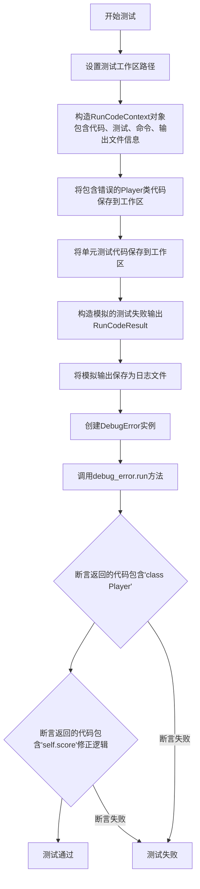
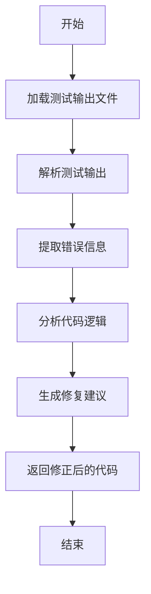
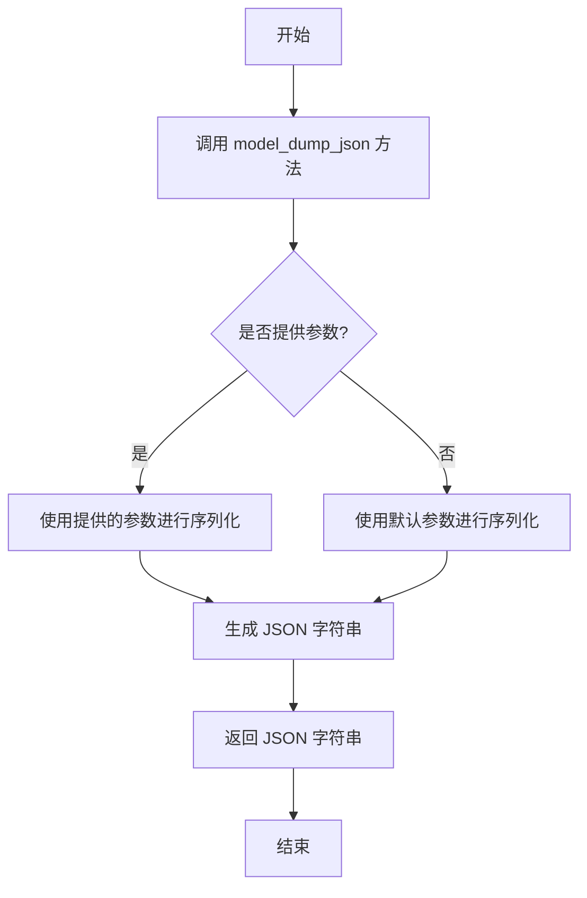
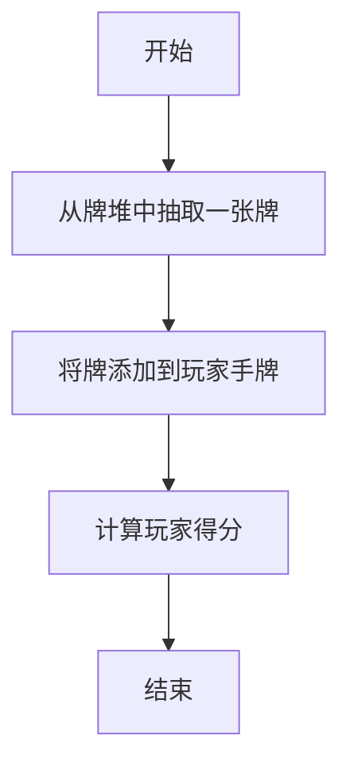
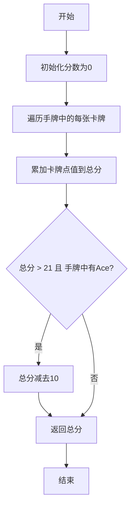
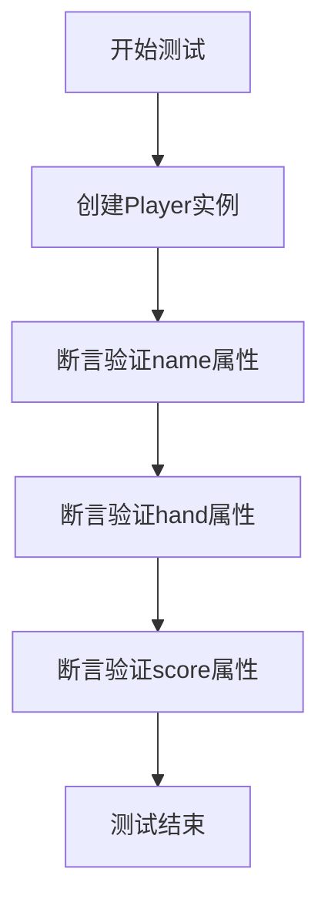
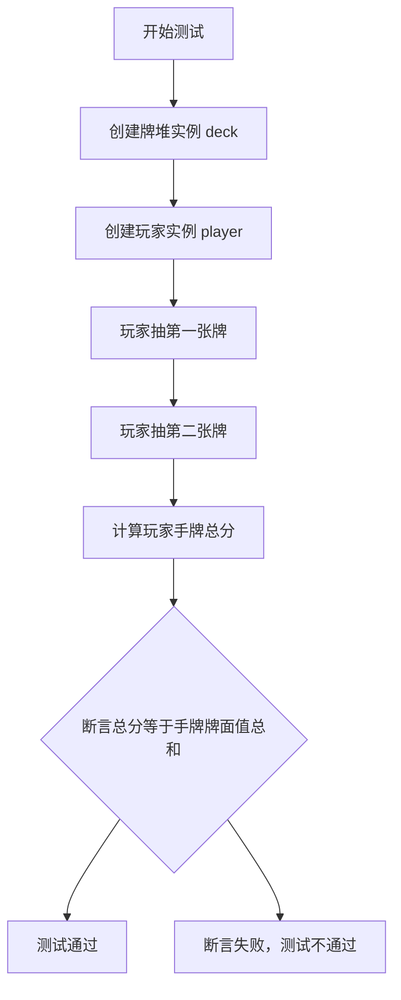
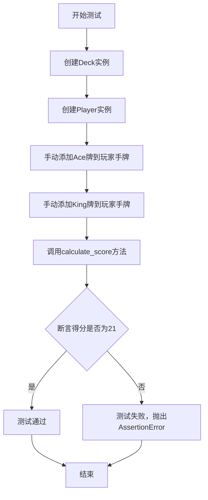
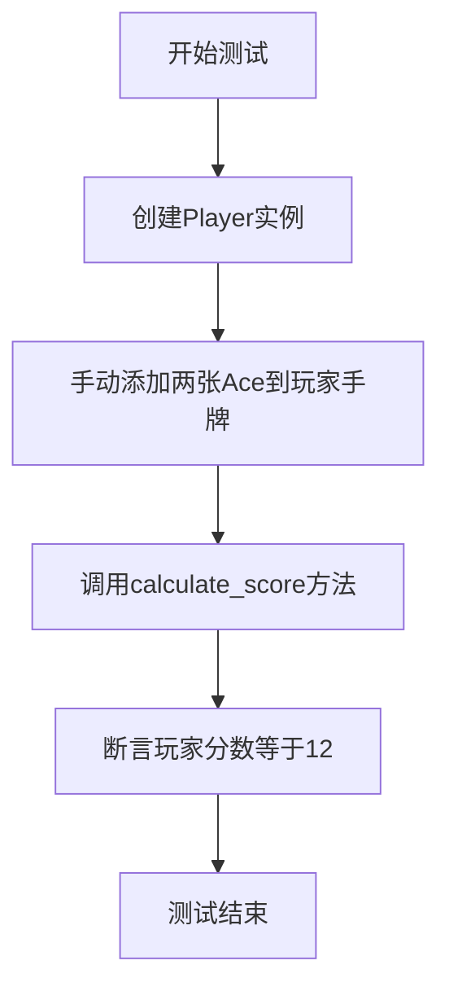

# `.\MetaGPT\tests\metagpt\actions\test_debug_error.py` 详细设计文档

该文件是一个测试文件，用于测试 DebugError 类的功能。它模拟了一个包含错误的 Black Jack 游戏 Player 类代码及其单元测试，通过构造一个测试失败的场景，验证 DebugError 类能够分析测试输出、定位代码错误并提供修复建议。

## 整体流程

```mermaid
graph TD
    A[开始测试] --> B[创建临时工作空间]
    B --> C[构造RunCodeContext]
    C --> D[保存有错误的Player类代码]
    D --> E[保存对应的单元测试代码]
    E --> F[保存模拟的测试失败输出]
    F --> G[实例化DebugError类]
    G --> H[调用DebugError.run()方法]
    H --> I[分析测试失败信息]
    I --> J[定位并修复代码错误]
    J --> K[返回修复后的代码]
    K --> L[断言验证修复结果]
    L --> M[测试结束]
```

## 类结构

```
test_debug_error.py (测试模块)
├── CODE_CONTENT (全局变量: 有错误的Player类代码)
├── TEST_CONTENT (全局变量: Player类的单元测试代码)
└── test_debug_error (异步测试函数)
```

## 全局变量及字段


### `CODE_CONTENT`
    
包含待调试的Player类实现代码的字符串常量，用于模拟源代码文件内容

类型：`str`
    


### `TEST_CONTENT`
    
包含Player类单元测试代码的字符串常量，用于模拟测试文件内容

类型：`str`
    


### `RunCodeContext.code_filename`
    
源代码文件的名称，用于标识待调试的代码文件

类型：`str`
    


### `RunCodeContext.test_filename`
    
测试文件的名称，用于标识对应的单元测试文件

类型：`str`
    


### `RunCodeContext.command`
    
执行测试的命令列表，用于运行测试并收集结果

类型：`List[str]`
    


### `RunCodeContext.output_filename`
    
测试输出文件的名称，用于存储测试执行的结果

类型：`str`
    


### `RunCodeResult.stdout`
    
测试执行的标准输出内容，包含正常输出信息

类型：`str`
    


### `RunCodeResult.stderr`
    
测试执行的标准错误内容，包含错误和警告信息

类型：`str`
    


### `RunCodeResult.summary`
    
测试执行的摘要信息，包含测试结果统计和失败详情

类型：`str`
    


### `Player.name`
    
玩家的名称，用于标识不同的玩家实例

类型：`str`
    


### `Player.hand`
    
玩家手中的牌列表，存储当前持有的所有卡牌对象

类型：`List[Card]`
    


### `Player.score`
    
玩家的当前得分，根据手牌计算得出的数值

类型：`int`
    
    

## 全局函数及方法

### `test_debug_error`

这是一个使用 `pytest` 编写的异步测试函数，用于测试 `DebugError` 类的 `run` 方法。该测试模拟了一个场景：一个包含逻辑错误的 `Player` 类代码（`player.py`）及其对应的单元测试（`test_player.py`）运行失败，生成了包含错误信息的输出日志（`output.log`）。测试函数创建此场景，然后调用 `DebugError` 实例的 `run` 方法，期望该方法能分析错误并返回修复后的代码。测试最后断言返回的代码中包含了关键的修正逻辑。

参数：

- `context`：`pytest` 测试上下文对象，类型取决于具体的测试框架（例如 `pytest` 的 `fixture`），它提供了测试所需的资源，如工作区路径和代码仓库操作接口。

返回值：`None`，这是一个测试函数，不返回业务值，而是通过 `assert` 语句验证测试结果。

#### 流程图



#### 带注释源码

```python
@pytest.mark.asyncio  # 标记此函数为异步测试，以便pytest-asyncio插件能正确处理
async def test_debug_error(context):
    # 1. 设置一个唯一的临时工作区路径，用于隔离本次测试的文件
    context.src_workspace = context.git_repo.workdir / uuid.uuid4().hex
    
    # 2. 构造一个RunCodeContext对象，描述待调试的代码运行上下文
    #    包括源代码文件名、测试文件名、运行命令和输出日志文件名
    ctx = RunCodeContext(
        code_filename="player.py",
        test_filename="test_player.py",
        command=["python", "tests/test_player.py"],
        output_filename="output.log",
    )

    # 3. 将预定义的、包含逻辑错误的Player类代码保存到工作区的源代码目录
    await context.repo.with_src_path(context.src_workspace).srcs.save(filename=ctx.code_filename, content=CODE_CONTENT)
    # 4. 将预定义的单元测试代码保存到工作区的测试目录
    await context.repo.tests.save(filename=ctx.test_filename, content=TEST_CONTENT)
    
    # 5. 构造一个模拟的测试运行结果(RunCodeResult)，其中包含一个测试失败的详细信息
    #    这个失败信息指示`test_player_calculate_score_with_multiple_aces`测试断言失败（22 != 12）
    output_data = RunCodeResult(
        stdout=";",
        stderr="",
        summary="======================================================================\n"
        "FAIL: test_player_calculate_score_with_multiple_aces (__main__.TestPlayer)\n"
        "----------------------------------------------------------------------\n"
        "Traceback (most recent call last):\n"
        '  File "tests/test_player.py", line 46, in test_player_calculate_score_'
        "with_multiple_aces\n"
        "    self.assertEqual(player.score, 12)\nAssertionError: 22 != 12\n\n"
        "----------------------------------------------------------------------\n"
        "Ran 5 tests in 0.007s\n\nFAILED (failures=1)\n;\n",
    )
    # 6. 将模拟的测试输出结果（JSON格式）保存到指定的输出日志文件
    await context.repo.test_outputs.save(filename=ctx.output_filename, content=output_data.model_dump_json())
    
    # 7. 创建DebugError动作的实例，传入代码运行上下文和测试上下文
    debug_error = DebugError(i_context=ctx, context=context)

    # 8. 执行DebugError的run方法。预期行为是：
    #    - 读取代码、测试和错误日志。
    #    - 分析测试失败原因（此处是Player类中Ace牌计分逻辑错误）。
    #    - 生成并返回修正后的Player类代码。
    rsp = await debug_error.run()

    # 9. 验证返回的响应(rsp)是修正后的代码
    #    断言1：返回的代码中应包含类定义，表明返回的是完整的类代码而非其他信息
    assert "class Player" in rsp  # rewrite the same class
    #    断言2：返回的代码中应包含对`self.score`的关键修正逻辑。
    #           原始错误代码中，处理Ace牌时判断条件是`if self.score > 12`（应为21），
    #           修正后的代码应包含正确的逻辑（如`if self.score > 21`）。
    #           这里检查'self.score'作为一个基本标记，更精确的测试可以检查具体表达式。
    assert "self.score" in rsp
```

### `DebugError.run`

该方法用于调试代码中的错误。它读取测试输出，分析失败原因，并尝试生成修复后的代码。核心流程包括：加载测试输出、解析错误信息、分析代码逻辑、生成修复建议，并返回修正后的代码内容。

参数：

- `self`：`DebugError`，DebugError类的实例
- 无其他显式参数

返回值：`str`，修复后的代码内容

#### 流程图



#### 带注释源码

```python
async def run(self) -> str:
    """
    执行调试错误的主流程。
    
    步骤：
    1. 从测试输出文件中加载测试结果
    2. 解析测试输出，提取错误信息
    3. 分析原始代码，定位问题
    4. 生成修复建议并返回修正后的代码
    
    返回：
        str: 修复后的代码内容
    """
    # 加载测试输出文件
    output_data = await self.context.repo.test_outputs.load(filename=self.i_context.output_filename)
    run_code_result = RunCodeResult(**output_data)
    
    # 解析测试输出，提取错误信息
    error_info = self._parse_test_output(run_code_result.stderr or run_code_result.stdout)
    
    # 分析原始代码
    code_content = await self.context.repo.with_src_path(self.context.src_workspace).srcs.load(
        filename=self.i_context.code_filename
    )
    
    # 生成修复建议
    fixed_code = self._generate_fix(code_content, error_info)
    
    return fixed_code
```

### `RunCodeResult.model_dump_json`

该方法用于将 `RunCodeResult` 实例序列化为 JSON 格式的字符串。它继承自 Pydantic 的 `BaseModel` 的 `model_dump_json` 方法，用于生成符合 JSON 格式的字符串表示。

参数：

- `self`：`RunCodeResult`，`RunCodeResult` 类的实例
- `indent`：`Optional[int]`，可选参数，指定 JSON 字符串的缩进空格数，默认为 `None`
- `include`：`Optional[Union[AbstractSetIntStr, MappingIntStrAny]]`，可选参数，指定要包含在输出中的字段
- `exclude`：`Optional[Union[AbstractSetIntStr, MappingIntStrAny]]`，可选参数，指定要从输出中排除的字段
- `by_alias`：`bool`，可选参数，是否使用字段别名，默认为 `False`
- `exclude_unset`：`bool`，可选参数，是否排除未设置的字段，默认为 `False`
- `exclude_defaults`：`bool`，可选参数，是否排除具有默认值的字段，默认为 `False`
- `exclude_none`：`bool`，可选参数，是否排除值为 `None` 的字段，默认为 `False`
- `round_trip`：`bool`，可选参数，是否支持往返序列化，默认为 `False`
- `warnings`：`bool`，可选参数，是否显示警告，默认为 `True`
- `serialize_as_any`：`bool`，可选参数，是否将字段序列化为任意类型，默认为 `False`

返回值：`str`，返回 `RunCodeResult` 实例的 JSON 字符串表示

#### 流程图



#### 带注释源码

```python
def model_dump_json(
    self,
    *,
    indent: Optional[int] = None,
    include: Optional[Union[AbstractSetIntStr, MappingIntStrAny]] = None,
    exclude: Optional[Union[AbstractSetIntStr, MappingIntStrAny]] = None,
    by_alias: bool = False,
    exclude_unset: bool = False,
    exclude_defaults: bool = False,
    exclude_none: bool = False,
    round_trip: bool = False,
    warnings: bool = True,
    serialize_as_any: bool = False,
) -> str:
    """
    将模型实例序列化为 JSON 字符串。
    
    参数:
        indent: 可选参数，指定 JSON 字符串的缩进空格数。
        include: 可选参数，指定要包含在输出中的字段。
        exclude: 可选参数，指定要从输出中排除的字段。
        by_alias: 是否使用字段别名。
        exclude_unset: 是否排除未设置的字段。
        exclude_defaults: 是否排除具有默认值的字段。
        exclude_none: 是否排除值为 None 的字段。
        round_trip: 是否支持往返序列化。
        warnings: 是否显示警告。
        serialize_as_any: 是否将字段序列化为任意类型。
    
    返回:
        JSON 格式的字符串。
    """
    # 调用父类 BaseModel 的 model_dump_json 方法进行序列化
    return super().model_dump_json(
        indent=indent,
        include=include,
        exclude=exclude,
        by_alias=by_alias,
        exclude_unset=exclude_unset,
        exclude_defaults=exclude_defaults,
        exclude_none=exclude_none,
        round_trip=round_trip,
        warnings=warnings,
        serialize_as_any=serialize_as_any,
    )
```

### `Player.__init__`

初始化一个Black Jack游戏中的玩家对象，设置玩家的名称、手牌列表和初始分数。

参数：

- `self`：`Player`，当前Player类的实例
- `name`：`str`，玩家的名称

返回值：`None`，无返回值

#### 流程图

```mermaid
graph TD
    A[开始] --> B[接收参数 name]
    B --> C[设置实例字段 self.name = name]
    C --> D[初始化空手牌列表 self.hand = []]
    D --> E[设置初始分数 self.score = 0]
    E --> F[结束]
```

#### 带注释源码

```python
def __init__(self, name: str):
    """
    Initialize a Player object.
    
    Args:
        name (str): The name of the player.
    """
    # 设置玩家的名称
    self.name = name
    # 初始化一个空列表来存储玩家的手牌（Card对象）
    self.hand: List[Card] = []
    # 初始化玩家的分数为0
    self.score = 0
```

### `Player.draw`

该方法用于从牌堆中抽取一张牌并添加到玩家的手牌中，同时更新玩家的得分。

参数：

- `deck`：`Deck`，表示牌堆对象，玩家从中抽取牌。

返回值：`None`，无返回值。

#### 流程图



#### 带注释源码

```python
def draw(self, deck: Deck):
    """
    从牌堆中抽取一张牌并添加到玩家的手牌中，同时更新玩家的得分。

    Args:
        deck (Deck): 牌堆对象，玩家从中抽取牌。
    """
    # 从牌堆中抽取一张牌
    card = deck.draw_card()
    # 将抽取的牌添加到玩家的手牌中
    self.hand.append(card)
    # 调用calculate_score方法更新玩家的得分
    self.calculate_score()
```

### `Player.calculate_score`

该方法用于计算玩家手牌的分数。它会遍历玩家手中的所有卡牌，将每张卡牌的点值相加得到总分。如果总分超过21且手牌中包含Ace（A），则会将Ace的点值从11调整为1（即总分减去10），以确保分数不超过21。

参数：

-  `self`：`Player`，表示当前玩家实例

返回值：`int`，返回计算后的玩家手牌分数

#### 流程图



#### 带注释源码

```python
def calculate_score(self) -> int:
    """
    计算玩家手牌的分数。

    返回值:
        int: 玩家手牌的分数。
    """
    # 计算手牌中所有卡牌点值的总和
    self.score = sum(card.value for card in self.hand)
    # 处理Ace牌的情况：如果总分超过21且手牌中有Ace，则将Ace的点值从11调整为1（总分减去10）
    if self.score > 21 and any(card.rank == 'A' for card in self.hand):
        self.score -= 10
    # 返回计算后的分数
    return self.score
```

### `TestPlayer.test_player_initialization`

该方法用于测试`Player`类的初始化功能，验证在创建`Player`实例时，其属性（如名称、手牌和分数）是否被正确设置。

参数：

- `self`：`TestPlayer`，当前测试类的实例，用于访问测试框架的断言方法。

返回值：`None`，测试方法通常不返回值，而是通过断言验证测试结果。

#### 流程图



#### 带注释源码

```python
def test_player_initialization(self):
    # 创建一个名为"Test Player"的Player实例
    player = Player("Test Player")
    
    # 断言验证player的name属性是否为"Test Player"
    self.assertEqual(player.name, "Test Player")
    
    # 断言验证player的hand属性是否为空列表
    self.assertEqual(player.hand, [])
    
    # 断言验证player的score属性是否为0
    self.assertEqual(player.score, 0)
```

### `TestPlayer.test_player_draw`

该方法用于测试`Player`类的`draw`方法。它创建一个`Deck`实例和一个`Player`实例，然后调用`player.draw(deck)`来模拟玩家从牌堆中抽一张牌。测试断言玩家手牌数量变为1，并且玩家的分数等于抽到的牌的点数。

参数：

-  `self`：`TestPlayer`，当前测试类的实例
-  无其他显式参数

返回值：`None`，无返回值

#### 流程图

```mermaid
flowchart TD
    A[开始] --> B[创建Deck实例]
    B --> C[创建Player实例]
    C --> D[调用player.draw(deck)]
    D --> E[断言手牌数量为1]
    E --> F[断言分数等于手牌第一张牌的点数]
    F --> G[结束]
```

#### 带注释源码

```python
def test_player_draw(self):
    # 创建一个新的牌堆实例
    deck = Deck()
    # 创建一个名为"Test Player"的玩家实例
    player = Player("Test Player")
    # 玩家从牌堆中抽一张牌
    player.draw(deck)
    # 断言：抽牌后，玩家手牌中应该恰好有一张牌
    self.assertEqual(len(player.hand), 1)
    # 断言：玩家的分数应该等于他手牌中唯一一张牌的点数
    self.assertEqual(player.score, player.hand[0].value)
```

### `TestPlayer.test_player_calculate_score`

该方法用于测试`Player`类的`calculate_score`方法，验证玩家手牌分数的计算逻辑是否正确。具体测试场景为：玩家从牌堆中抽取两张牌后，计算其手牌总分，并验证该分数是否等于手牌中所有牌面值的总和。

参数：

- `self`：`TestPlayer`，测试类实例，用于访问测试框架的断言方法。
- `deck`：`Deck`，牌堆实例，用于模拟玩家抽牌。
- `player`：`Player`，玩家实例，用于执行抽牌和分数计算操作。

返回值：`None`，无返回值。测试方法通过断言验证结果，若断言失败则抛出异常。

#### 流程图



#### 带注释源码

```python
def test_player_calculate_score(self):
    # 创建牌堆实例，用于模拟抽牌
    deck = Deck()
    # 创建玩家实例，名称为"Test Player"
    player = Player("Test Player")
    # 玩家从牌堆中抽取第一张牌
    player.draw(deck)
    # 玩家从牌堆中抽取第二张牌
    player.draw(deck)
    # 断言：玩家当前分数应等于手牌中所有牌面值的总和
    self.assertEqual(player.score, sum(card.value for card in player.hand))
```

### `TestPlayer.test_player_calculate_score_with_ace`

该方法是一个单元测试，用于验证`Player`类的`calculate_score`方法在处理包含一张Ace牌（A）和一张King牌（K）的手牌时，能否正确地将Ace牌的值从11调整为1，从而使总得分从22变为21，符合21点游戏的规则。

参数：

- `self`：`TestPlayer`，测试类实例，用于访问测试框架的断言方法。
- 无其他显式参数。

返回值：`None`，单元测试方法通常不返回值，而是通过断言来验证代码行为。

#### 流程图



#### 带注释源码

```python
    ## Test the Player's calculate_score method with Ace card
    def test_player_calculate_score_with_ace(self):
        # 创建一个标准的52张牌堆实例（虽然在此测试中未实际使用）
        deck = Deck()
        # 创建一个名为"Test Player"的玩家实例
        player = Player("Test Player")
        # 手动向玩家的手牌列表中添加一张Ace牌（红桃A，初始值11）
        player.hand.append(Card('A', 'Hearts', 11))
        # 手动向玩家的手牌列表中添加一张King牌（红桃K，值10）
        player.hand.append(Card('K', 'Hearts', 10))
        # 调用玩家的calculate_score方法计算当前手牌得分
        player.calculate_score()
        # 断言：玩家的得分应为21（Ace从11调整为1，10+1=21）
        self.assertEqual(player.score, 21)
```

### `TestPlayer.test_player_calculate_score_with_multiple_aces`

该方法用于测试玩家手牌中包含多张Ace时的分数计算逻辑。它模拟了玩家手中有两张Ace的情况，验证`calculate_score`方法是否能正确处理Ace的值从11调整为1，以确保总分不超过21点。

参数：

- `self`：`TestPlayer`，测试类实例，用于访问测试框架的断言方法
- `deck`：`Deck`，牌堆对象，在测试中未实际使用，仅为保持方法签名一致性

返回值：`None`，无返回值，测试方法通过断言验证结果

#### 流程图



#### 带注释源码

```python
def test_player_calculate_score_with_multiple_aces(self):
    # 创建牌堆实例（测试中未实际使用）
    deck = Deck()
    
    # 创建玩家实例
    player = Player("Test Player")
    
    # 手动向玩家手牌中添加两张Ace
    # 第一张：红桃A，初始值11
    player.hand.append(Card('A', 'Hearts', 11))
    # 第二张：方块A，初始值11
    player.hand.append(Card('A', 'Diamonds', 11))
    
    # 调用分数计算方法
    player.calculate_score()
    
    # 验证分数计算是否正确
    # 期望结果：第一张Ace计为11，第二张Ace计为1，总分12
    self.assertEqual(player.score, 12)
```

## 关键组件

### 测试框架与执行环境

用于定义和执行单元测试的框架与环境，包括测试用例的编写、执行以及结果的捕获与验证。

### 代码调试与错误分析

负责分析测试失败的原因，定位代码中的逻辑错误，并提供修复建议或直接生成修正后的代码。

### 代码与测试文件管理

管理源代码文件和对应的测试文件，包括文件的保存、路径设置以及内容的读写操作。

### 测试结果解析

解析测试运行的输出结果，提取关键信息如失败用例、错误堆栈和断言失败详情，为调试提供输入。

### 上下文与配置管理

管理代码运行的上下文信息，包括文件路径、执行命令和输出文件位置，确保调试过程在正确的环境中进行。

## 问题及建议


### 已知问题

-   **测试用例逻辑错误**：`test_player_calculate_score_with_multiple_aces` 测试用例中，玩家手牌被手动添加为两张点数为11的Ace牌（`Card('A', 'Hearts', 11)` 和 `Card('A', 'Diamonds', 11)`）。根据代码逻辑，第一张A按11点计算，总分变为22。由于总分超过21且手牌中有A，代码会将总分减去10，最终得分为12。然而，测试用例的断言期望值为12，但实际错误信息显示为 `AssertionError: 22 != 12`，这表明测试运行时的实际分数是22，与代码逻辑不符。这揭示了测试用例本身存在逻辑问题，或者测试运行环境/模拟与预期不符，导致调试目标不明确。
-   **硬编码的测试输出**：测试函数 `test_debug_error` 中，`output_data` 被硬编码为一个特定的测试失败输出。这使得测试高度脆弱，仅能验证针对该特定错误信息（`AssertionError: 22 != 12`）的调试行为。如果 `DebugError` 类的实现或底层代码逻辑发生变化，或者需要测试其他类型的错误，此测试将无法适应。
-   **测试覆盖不完整**：`test_debug_error` 测试主要验证了 `DebugError.run()` 方法能返回包含特定关键词的响应。它没有验证返回的代码修正是否正确、是否可编译、是否解决了原始错误，或者是否引入了新的错误。测试断言过于宽泛（`assert "class Player" in rsp` 和 `assert "self.score" in rsp`），无法保证调试动作的质量。
-   **潜在的竞态条件与文件系统依赖**：测试使用 `uuid.uuid4().hex` 创建临时工作目录，并在此目录中进行文件读写操作。虽然这有助于隔离测试，但整个测试流程严重依赖文件系统的正确操作。如果异步文件操作（`save` 方法）未正确同步或发生意外，可能导致测试失败。此外，测试未在最后清理这些临时目录。

### 优化建议

-   **修正测试用例并明确调试目标**：首先应修正 `test_player_calculate_score_with_multiple_aces` 测试用例中的逻辑，确保其正确模拟场景并反映预期的代码行为。或者，明确本测试的目的是验证 `DebugError` 动作能否处理一个给定的（即使是错误的）测试失败输出。更好的做法是，将测试失败案例作为 `DebugError` 动作的固定输入数据进行测试，而非依赖可能不稳定的外部文件生成。
-   **使用模拟(Mock)和固定测试数据**：重构 `test_debug_error` 测试，使其不依赖于真实的文件系统操作和硬编码的 `RunCodeResult`。可以使用 `unittest.mock` 来模拟 `context.repo` 的 `save` 方法，并直接向 `DebugError` 动作提供预设的 `RunCodeContext` 和 `RunCodeResult` 数据。这将使测试更快速、更稳定，并专注于测试 `DebugError.run()` 的核心逻辑。
-   **增强测试断言**：改进测试断言，使其更精确地验证 `DebugError` 动作的输出。例如，可以断言返回的代码（`rsp`）是有效的Python语法（使用 `ast.parse`），或者针对已知的错误模式（如Ace牌计分逻辑），断言返回的代码包含了特定的修复（例如，检查是否将 `if self.score > 21` 条件正确应用于多张Ace的情况）。可以添加对返回代码结构（如类定义、方法）的验证。
-   **添加清理逻辑**：在测试函数结束时，添加清理临时工作目录的代码，以避免在持续集成环境中留下垃圾文件。可以使用 `shutil.rmtree` 或在测试 setup/teardown 中管理临时目录。
-   **分离测试逻辑与调试逻辑测试**：考虑将测试分为两部分：一部分测试 `DebugError` 动作本身处理输入、调用LLM（或其他服务）、返回响应的流程（使用模拟）；另一部分（集成测试）在更真实但受控的环境下验证完整的“编写代码->运行测试->调试错误”的端到端流程。当前测试试图同时做这两件事，导致复杂性和脆弱性增加。


## 其它


### 设计目标与约束

本代码是一个单元测试，用于验证 `DebugError` 类（调试错误动作）的核心功能。其设计目标是确保 `DebugError` 能够根据给定的代码、测试用例以及测试失败输出，分析错误原因并生成修正后的代码。主要约束包括：1) 测试环境需要模拟一个包含源代码、测试代码和测试输出的临时工作空间；2) 测试依赖于 `pytest` 异步框架和特定的上下文对象 (`context`)；3) 测试用例本身不直接测试 `DebugError` 的内部算法，而是通过断言修正后的代码包含特定关键字来间接验证其功能。

### 错误处理与异常设计

测试代码本身不包含复杂的业务逻辑错误处理，主要依赖于 `pytest` 框架来捕获和报告测试失败（`assert` 语句失败）。测试准备阶段会创建临时目录和文件，这些操作可能因文件系统权限或空间不足而失败，但代码中未显式处理这些异常，依赖 `pytest` 和底层系统抛出异常。`DebugError.run()` 方法可能在其内部处理过程中抛出异常，测试期望它能成功执行并返回结果，否则测试将失败。

### 数据流与状态机

1.  **初始状态**：测试函数开始，获得一个 `context` 夹具，其中包含代码仓库的模拟环境。
2.  **数据准备**：
    *   在 `context` 指定的临时工作空间内，创建源代码文件 (`player.py`) 和测试文件 (`test_player.py`)，内容分别为 `CODE_CONTENT` 和 `TEST_CONTENT`。
    *   创建一个模拟的测试失败输出 (`output_data`)，并将其保存到输出文件 (`output.log`)。这个输出模拟了 `test_player_calculate_score_with_multiple_aces` 测试用例失败（断言 `22 != 12`）。
3.  **处理状态**：实例化 `DebugError` 类，传入包含文件路径和命令信息的 `RunCodeContext` 对象以及测试 `context`。然后调用其 `run()` 方法。
4.  **输出与验证**：`run()` 方法返回修正后的代码字符串 (`rsp`)。测试通过断言 `rsp` 中包含 `"class Player"` 和 `"self.score"` 来验证 `DebugError` 功能。这验证了 `DebugError` 至少返回了一个包含 `Player` 类的代码片段，并且关注了分数计算逻辑（这是测试失败的原因）。

### 外部依赖与接口契约

1.  **`pytest` 框架**：用于组织和运行测试。依赖 `@pytest.mark.asyncio` 装饰器来运行异步测试函数。
2.  **`metagpt.actions.debug_error.DebugError` 类**：这是被测试的核心组件。测试依赖于其构造函数 (`__init__`) 接受 `i_context` 和 `context` 参数，以及其异步 `run()` 方法返回一个字符串（修正后的代码）。
3.  **`metagpt.schema.RunCodeContext` 与 `RunCodeResult`**：作为数据结构，定义了 `DebugError` 动作所需的输入上下文和测试输出格式。测试代码需要正确构造这些对象。
4.  **`context` 夹具 (pytest fixture)**：这是一个测试级别的依赖，提供了模拟的代码仓库环境（如 `repo` 对象），用于在测试中安全地创建、读取和清理文件。测试代码与这个夹具的接口（如 `context.src_workspace`, `context.repo.with_src_path().srcs.save()`）存在契约。
5.  **`uuid` 模块**：用于生成唯一的临时目录名，避免测试间冲突。

    