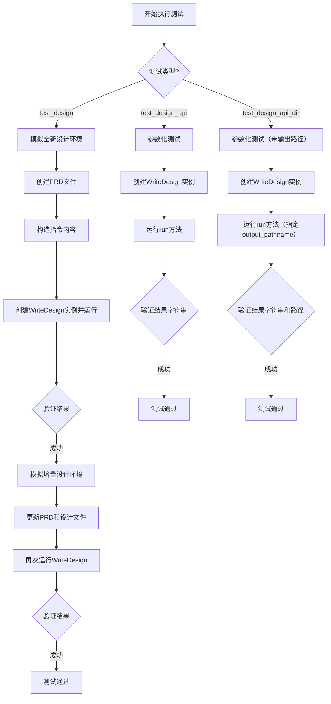
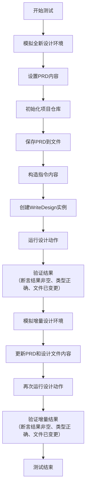
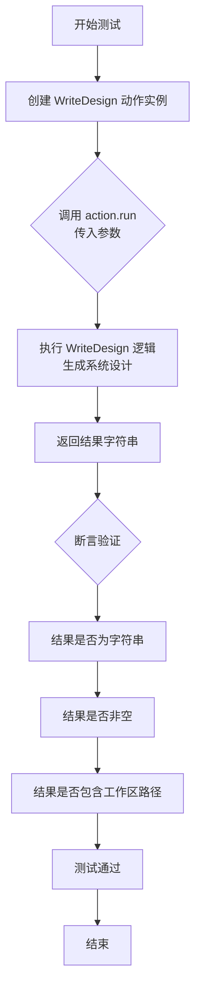
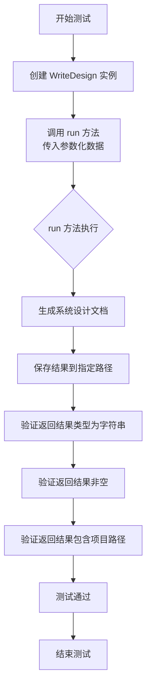
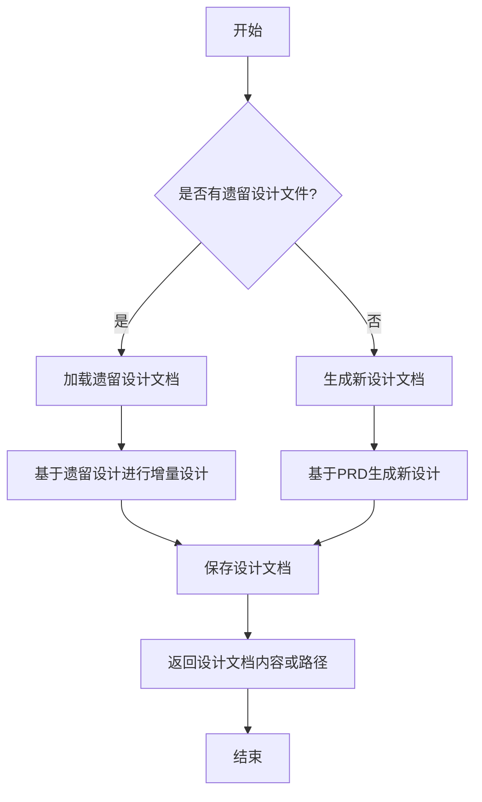

# `.\MetaGPT\tests\metagpt\actions\test_design_api.py` 详细设计文档

这是一个用于测试 `WriteDesign` 动作类的单元测试文件。它模拟了两种场景：1) 全新的系统设计流程，从产品需求文档（PRD）开始生成系统设计；2) 增量式设计流程，基于已有的PRD和旧版设计文档进行更新。测试验证了 `WriteDesign` 类在不同输入参数（用户需求、PRD文件路径、旧设计文件路径）下的功能正确性，包括输出类型、内容以及文件系统的变更。

## 整体流程



## 类结构

```
test_design_api.py (测试模块)
├── test_design (异步测试函数)
├── test_design_api (异步参数化测试函数)
└── test_design_api_dir (异步参数化测试函数，带输出目录)
```

## 全局变量及字段


### `DESIGN_SAMPLE`
    
用于测试的系统设计示例数据，模拟已有的设计文档内容

类型：`str`
    


### `REFINED_PRD_JSON`
    
用于测试的细化产品需求文档JSON数据，模拟更新后的PRD内容

类型：`str`
    


### `DEFAULT_WORKSPACE_ROOT`
    
默认工作空间根目录路径，用于存储项目相关文件

类型：`Path`
    


### `METAGPT_ROOT`
    
MetaGPT项目根目录路径，用于定位项目内的资源文件

类型：`Path`
    


    

## 全局函数及方法

### `test_design`

这是一个异步单元测试函数，用于测试 `WriteDesign` 类的功能。它模拟了两种场景：1) 全新的设计环境，从零开始生成系统设计；2) 增量设计环境，基于已有的PRD和设计文档进行更新。测试验证了 `WriteDesign` 动作能否正确运行并生成有效的设计输出。

参数：

- `context`：`pytest.fixture`，测试上下文，提供配置和运行环境。

返回值：`None`，这是一个测试函数，不返回业务值，通过断言验证测试结果。

#### 流程图



#### 带注释源码

```python
@pytest.mark.asyncio
async def test_design(context):
    # Mock new design env
    # 模拟全新的设计环境：设置一个简单的PRD需求
    prd = "我们需要一个音乐播放器，它应该有播放、暂停、上一曲、下一曲等功能。"
    # 配置上下文参数：设置项目路径，并标记为非增量模式
    context.kwargs.project_path = context.config.project_path
    context.kwargs.inc = False
    filename = "prd.txt"
    # 初始化项目仓库
    repo = ProjectRepo(context.kwargs.project_path)
    # 将PRD内容保存到项目仓库的文档中
    await repo.docs.prd.save(filename=filename, content=prd)
    # 构造传递给动作的指令内容，包含项目路径和变更的PRD文件信息
    kvs = {
        "project_path": str(context.kwargs.project_path),
        "changed_prd_filenames": [str(repo.docs.prd.workdir / filename)],
    }
    instruct_content = AIMessage.create_instruct_value(kvs=kvs, class_name="WritePRDOutput")

    # 创建 WriteDesign 动作实例并运行
    design_api = WriteDesign(context=context)
    result = await design_api.run([Message(content=prd, instruct_content=instruct_content)])
    # 记录结果用于调试
    logger.info(result)
    # 断言验证：结果应存在，是AIMessage类型，包含指令内容，并且系统设计文档有文件变更
    assert result
    assert isinstance(result, AIMessage)
    assert result.instruct_content
    assert repo.docs.system_design.changed_files

    # Mock incremental design env
    # 模拟增量设计环境：切换到增量模式，并更新PRD和设计文件的内容为预定义的样本数据
    context.kwargs.inc = True
    await repo.docs.prd.save(filename=filename, content=str(REFINED_PRD_JSON))
    await repo.docs.system_design.save(filename=filename, content=DESIGN_SAMPLE)

    # 再次运行设计动作（此时PRD内容已通过instruct_content传递，Message的content可为空）
    result = await design_api.run([Message(content="", instruct_content=instruct_content)])
    logger.info(result)
    # 对增量设计的结果进行同样的断言验证
    assert result
    assert isinstance(result, AIMessage)
    assert result.instruct_content
    assert repo.docs.system_design.changed_files
```

### `test_design_api`

这是一个使用 `pytest` 框架编写的异步测试函数，用于测试 `WriteDesign` 类的 `run` 方法。它通过参数化测试，验证在不同输入参数（用户需求、PRD文件名、遗留设计文件名）下，`WriteDesign` 动作能否正确生成系统设计文档并返回包含工作区路径的结果字符串。

参数：
- `context`：`pytest` 的 `fixture` 对象，提供测试上下文和配置信息。
- `user_requirement`：`str`，用户需求描述。
- `prd_filename`：`str` 或 `None`，产品需求文档（PRD）的文件路径。如果为 `None`，则从 `user_requirement` 生成。
- `legacy_design_filename`：`str` 或 `None`，遗留系统设计文档的文件路径。如果为 `None`，则生成新的设计。

返回值：`None`，这是一个测试函数，不直接返回值，但包含断言来验证测试结果。

#### 流程图



#### 带注释源码

```python
@pytest.mark.parametrize(
    # 使用参数化装饰器定义三组测试数据
    ("user_requirement", "prd_filename", "legacy_design_filename"),
    [
        # 测试用例1: 仅提供用户需求，无PRD和遗留设计文件
        ("我们需要一个音乐播放器，它应该有播放、暂停、上一曲、下一曲等功能。", None, None),
        # 测试用例2: 提供用户需求和PRD文件路径，无遗留设计文件
        ("write 2048 game", str(METAGPT_ROOT / "tests/data/prd.json"), None),
        # 测试用例3: 提供用户需求、PRD文件和遗留设计文件路径
        (
            "write 2048 game",
            str(METAGPT_ROOT / "tests/data/prd.json"),
            str(METAGPT_ROOT / "tests/data/system_design.json"),
        ),
    ],
)
@pytest.mark.asyncio  # 标记为异步测试函数
async def test_design_api(context, user_requirement, prd_filename, legacy_design_filename):
    # 实例化 WriteDesign 动作类
    action = WriteDesign()
    # 调用 run 方法，传入参数化数据，执行系统设计生成
    result = await action.run(
        user_requirement=user_requirement, prd_filename=prd_filename, legacy_design_filename=legacy_design_filename
    )
    # 断言1: 验证返回结果类型为字符串
    assert isinstance(result, str)
    # 断言2: 验证返回结果非空
    assert result
    # 断言3: 验证返回结果字符串中包含默认工作区根路径
    assert str(DEFAULT_WORKSPACE_ROOT) in result
```

### `test_design_api_dir`

这是一个使用 `pytest` 框架编写的异步测试函数，用于测试 `WriteDesign` 类的 `run` 方法。该测试函数通过参数化测试，验证在不同输入参数（用户需求、PRD文件路径、遗留设计文件路径）下，`WriteDesign` 的 `run` 方法能否正确生成系统设计文档，并将结果保存到指定的输出路径。

参数：
- `context`：`pytest` 的 `context` 对象，`pytest` 类型，提供测试上下文，例如配置信息。
- `user_requirement`：`str` 类型，描述用户需求的字符串。
- `prd_filename`：`str` 类型，产品需求文档（PRD）的文件路径。
- `legacy_design_filename`：`str` 类型，遗留系统设计文档的文件路径。

返回值：`None`，该函数是测试函数，不返回业务值，仅通过断言验证测试结果。

#### 流程图



#### 带注释源码

```python
@pytest.mark.parametrize(
    # 使用参数化装饰器定义三组测试数据，每组包含 user_requirement, prd_filename, legacy_design_filename
    ("user_requirement", "prd_filename", "legacy_design_filename"),
    [
        # 测试用例1：只有用户需求字符串，没有文件输入
        ("我们需要一个音乐播放器，它应该有播放、暂停、上一曲、下一曲等功能。", None, None),
        # 测试用例2：用户需求字符串 + PRD 文件路径
        ("write 2048 game", str(METAGPT_ROOT / "tests/data/prd.json"), None),
        # 测试用例3：用户需求字符串 + PRD 文件路径 + 遗留设计文件路径
        (
            "write 2048 game",
            str(METAGPT_ROOT / "tests/data/prd.json"),
            str(METAGPT_ROOT / "tests/data/system_design.json"),
        ),
    ],
)
@pytest.mark.asyncio  # 标记此测试函数为异步函数
async def test_design_api_dir(context, user_requirement, prd_filename, legacy_design_filename):
    # 创建 WriteDesign 动作的实例
    action = WriteDesign()
    # 异步调用 action 的 run 方法，传入参数化的测试数据以及一个额外的 output_pathname 参数
    # output_pathname 指定了生成的设计文档的保存路径，这里使用了测试上下文中的项目路径
    result = await action.run(
        user_requirement=user_requirement,
        prd_filename=prd_filename,
        legacy_design_filename=legacy_design_filename,
        output_pathname=str(Path(context.config.project_path) / "1.txt"),  # 将输出文件命名为 1.txt
    )
    # 断言1：验证 run 方法的返回结果是一个字符串
    assert isinstance(result, str)
    # 断言2：验证返回的字符串非空
    assert result
    # 断言3：验证返回的字符串中包含测试项目的路径，这通常意味着文件被成功保存到了预期位置
    assert str(context.config.project_path) in result
```

### `WriteDesign.run`

`WriteDesign.run` 方法是 `WriteDesign` 类的核心执行方法，负责根据用户需求、产品需求文档（PRD）文件名和遗留设计文件名，生成或更新系统设计文档。它支持增量设计模式，能够基于现有设计进行优化和调整。

参数：

- `user_requirement`：`str`，用户的需求描述，用于生成或更新设计文档。
- `prd_filename`：`str`，产品需求文档的文件路径，提供详细的产品需求信息。
- `legacy_design_filename`：`str`，遗留设计文档的文件路径，用于增量设计模式下的参考和优化。
- `output_pathname`：`str`，输出设计文档的保存路径，可选参数。

返回值：`str`，返回生成的设计文档内容或保存路径。

#### 流程图



#### 带注释源码

```python
async def run(
    self,
    user_requirement: str,
    prd_filename: str,
    legacy_design_filename: str,
    output_pathname: Optional[str] = None,
) -> str:
    """
    执行设计文档的生成或更新操作。

    参数:
        user_requirement (str): 用户的需求描述。
        prd_filename (str): 产品需求文档的文件路径。
        legacy_design_filename (str): 遗留设计文档的文件路径。
        output_pathname (Optional[str]): 输出设计文档的保存路径。

    返回:
        str: 生成的设计文档内容或保存路径。
    """
    # 加载产品需求文档（PRD）
    prd_content = self._load_prd(prd_filename) if prd_filename else user_requirement

    # 检查是否存在遗留设计文档
    if legacy_design_filename:
        # 加载遗留设计文档
        legacy_design = self._load_legacy_design(legacy_design_filename)
        # 基于遗留设计进行增量设计
        design_content = self._incremental_design(prd_content, legacy_design)
    else:
        # 基于PRD生成新设计文档
        design_content = self._generate_new_design(prd_content)

    # 保存设计文档
    if output_pathname:
        self._save_design(design_content, output_pathname)
        return output_pathname
    else:
        return design_content
```

## 关键组件


### WriteDesign 类

WriteDesign 类是负责根据产品需求文档（PRD）生成系统设计文档的核心组件。它通过分析用户需求、现有PRD和遗留设计文档，生成结构化的系统设计方案。

### ProjectRepo 类

ProjectRepo 类是项目仓库管理组件，负责管理项目文档（如PRD、系统设计文档）的存储、加载和版本控制。它提供了文档的保存和检索功能，支持增量开发模式下的文档变更管理。

### AIMessage 类

AIMessage 类是消息传递组件，用于封装AI生成的内容和指令信息。它支持创建包含键值对（kvs）和类名（class_name）的指令内容，便于在系统组件间传递结构化数据。

### 增量开发模式

增量开发模式是系统设计流程的关键组件，支持在已有设计文档基础上进行增量更新。该模式通过检查文档变更（changed_prd_filenames）和增量标志（inc）来决定是生成全新设计还是优化现有设计。

### 文档存储与加载机制

文档存储与加载机制是文件管理组件，负责将生成的系统设计文档保存到指定路径（如workspace目录）。它支持从文件路径加载现有PRD和设计文档，实现设计过程的持久化和复用。

### 测试数据模拟

测试数据模拟是测试支持组件，提供预定义的PRD样本（REFINED_PRD_JSON）和设计样本（DESIGN_SAMPLE），用于模拟不同测试场景（如全新设计、基于PRD的设计、基于遗留设计的设计）。


## 问题及建议


### 已知问题

-   **测试用例与生产逻辑耦合**：`test_design` 测试函数直接操作了 `ProjectRepo` 和 `WriteDesign` 的内部状态（如 `changed_prd_filenames`），并依赖于特定的 `AIMessage.create_instruct_value` 调用方式。这使得测试用例非常脆弱，一旦生产代码中 `WriteDesign` 的输入参数格式、`ProjectRepo` 的接口或 `AIMessage` 的构造方式发生改变，测试就会失败，且难以理解失败原因。
-   **测试数据路径硬编码**：`test_design_api` 和 `test_design_api_dir` 函数中，测试数据文件路径（如 `METAGPT_ROOT / "tests/data/prd.json"`）被硬编码在测试参数中。这降低了测试的可移植性，如果项目结构或测试数据位置发生变化，需要修改多处代码。
-   **测试环境配置复杂**：测试函数依赖于一个复杂的 `context` fixture 来提供配置和项目路径。这种间接性增加了理解测试前提条件的难度，并且 `context` 的内部状态（如 `kwargs.project_path`, `kwargs.inc`）在测试中被直接修改，可能导致测试间的状态污染。
-   **断言过于宽泛**：部分断言（如 `assert result`）仅检查结果是否为真，没有验证返回内容的具体结构或关键属性，降低了测试的有效性。
-   **存在重复的测试逻辑**：`test_design_api` 和 `test_design_api_dir` 两个测试函数的核心逻辑高度相似，主要区别在于是否指定了 `output_pathname` 参数。这造成了代码重复，增加了维护成本。

### 优化建议

-   **解耦测试与实现细节**：重构 `test_design` 函数，使其不依赖于 `WriteDesign` 的内部消息处理机制。应通过公开、稳定的API（如 `run` 方法的 `user_requirement`, `prd_filename` 参数）来驱动测试，并使用模拟（Mock）对象来隔离对 `ProjectRepo` 和文件系统的依赖。测试应关注行为（输入/输出），而非内部状态。
-   **集中管理测试数据路径**：创建一个公共的模块或 fixture（例如 `data_path`）来统一管理测试数据文件的根路径。测试用例通过这个公共接口获取路径，提高可维护性。
-   **简化测试环境设置**：评估 `context` fixture 的必要性。如果可能，使用更简单、更专注的 fixture 来提供测试所需的配置（如临时工作目录）。确保每个测试都是独立的，不共享可变状态。
-   **增强断言的具体性**：针对 `WriteDesign` 的预期行为，设计更具体的断言。例如，检查返回的字符串是否包含特定的设计元素（如“类图”、“序列图”），或者验证在给定输入文件时，输出是否包含了输入文件中的关键需求。
-   **合并重复测试用例**：将 `test_design_api` 和 `test_design_api_dir` 合并。可以使用 `pytest.mark.parametrize` 为 `output_pathname` 参数添加一个测试用例（包括 `None` 和有效路径两种情况），从而在一个测试函数中覆盖两种场景，消除代码重复。
-   **添加负面测试用例**：当前测试均为正面用例。建议补充负面测试，例如传入不存在的 `prd_filename` 或格式错误的 `legacy_design_filename`，验证 `WriteDesign` 动作是否能进行合理的错误处理（如抛出预期异常或返回错误信息）。


## 其它


### 设计目标与约束

该测试代码的设计目标是验证`WriteDesign`类在不同场景下的功能正确性，包括：
1. **功能验证**：测试`WriteDesign`类能否根据用户需求或PRD文档生成系统设计文档。
2. **增量设计验证**：测试在已有设计文档的基础上，`WriteDesign`类能否进行增量更新。
3. **参数化测试**：通过参数化测试用例，验证不同输入组合（如用户需求、PRD文件、遗留设计文件）下的行为。
4. **路径处理**：测试输出路径参数的正确处理，确保设计文档能保存到指定位置。

主要约束包括：
- 依赖外部测试数据文件（如`prd.json`, `system_design.json`）的存在和格式正确性。
- 测试环境需要正确配置`context`对象，包含项目路径、配置等信息。
- 异步测试需要使用`pytest.mark.asyncio`装饰器。

### 错误处理与异常设计

测试代码中的错误处理主要体现在以下几个方面：
1. **断言验证**：使用`assert`语句验证测试结果的正确性，包括：
   - 验证`WriteDesign.run`方法的返回值非空且类型正确（`AIMessage`或`str`）。
   - 验证设计文档是否成功保存到文件系统（通过检查`repo.docs.system_design.changed_files`）。
   - 验证输出路径是否包含预期的目录（如`DEFAULT_WORKSPACE_ROOT`或`context.config.project_path`）。
2. **异常传播**：测试依赖于`pytest`框架来捕获和报告测试过程中抛出的任何异常，如果`WriteDesign.run`方法内部发生未处理的异常，测试将失败。
3. **输入验证**：测试用例通过参数化提供了多种输入组合（包括空值），旨在验证`WriteDesign`类对边界情况和无效输入的处理能力。测试本身不直接处理这些异常，而是期望被测试的`WriteDesign`类能够妥善处理或抛出有意义的异常。

### 数据流与状态机

测试代码中的数据流和状态变化如下：
1. **初始状态**：
   - 测试函数开始执行，接收`context` fixture 提供的上下文环境。
   - 对于参数化测试，接收特定的参数组合（`user_requirement`, `prd_filename`, `legacy_design_filename`）。

2. **数据准备与输入**：
   - 在`test_design`中，模拟创建PRD文档并保存到项目仓库，构建`instruct_content`消息。
   - 在参数化测试中，直接使用传入的参数作为`WriteDesign.run`方法的输入。

3. **核心调用与状态转换**：
   - 调用`WriteDesign.run`方法。这是主要的状态转换点，方法内部会：
     a. 读取输入（用户需求、PRD文件、遗留设计文件）。
     b. （可能）调用LLM生成或修改系统设计。
     c. 将结果保存到文件系统（通过`ProjectRepo`）。
   - 系统状态从“等待设计”转换为“设计完成”，项目仓库中`system_design`目录下的文件发生变化。

4. **输出验证**：
   - 检查`run`方法的返回值。
   - 检查文件系统状态（通过`repo.docs.system_design.changed_files`）。
   - 验证输出字符串包含预期的路径。

5. **状态清理**：
   - 测试结束后，由`pytest`和可能的fixture进行清理。测试代码本身没有显式的清理步骤，依赖测试框架管理临时文件和状态。

### 外部依赖与接口契约

测试代码的外部依赖和接口契约包括：
1. **被测试类**：`metagpt.actions.design_api.WriteDesign`
   - **契约**：测试期望`WriteDesign`类提供一个异步的`run`方法，该方法接受`Message`列表或指定的关键字参数（`user_requirement`, `prd_filename`, `legacy_design_filename`, `output_pathname`），并返回一个`AIMessage`对象或包含文件路径的字符串。

2. **项目仓库**：`metagpt.utils.project_repo.ProjectRepo`
   - **契约**：测试使用`ProjectRepo`来模拟项目环境，依赖其`docs.prd.save`和`docs.system_design.save`方法来准备测试数据，并依赖`docs.system_design.changed_files`属性来验证输出。

3. **数据结构**：
   - `metagpt.schema.Message` 和 `metagpt.schema.AIMessage`：用于构建输入消息和验证输出。
   - `AIMessage.create_instruct_value`：用于创建包含特定键值对的指令内容。

4. **测试框架与工具**：
   - `pytest`：提供测试运行、fixture管理（`context`）、参数化（`@pytest.mark.parametrize`）和异步测试支持（`@pytest.mark.asyncio`）。
   - `metagpt.logs.logger`：用于记录测试过程中的信息。

5. **测试数据文件**：
   - 路径依赖于`METAGPT_ROOT`常量（例如：`METAGPT_ROOT / "tests/data/prd.json"`）。
   - 数据文件（如`prd.json`, `system_design.json`）需要符合`WriteDesign`类预期的输入格式。

6. **配置与上下文**：
   - 依赖`context` fixture提供运行时的配置和参数（如`context.config.project_path`, `context.kwargs`）。测试假设这些值已被正确设置。

这些依赖的稳定性直接影响测试的可靠性。任何被依赖类或接口的变更都可能导致测试失败。

    