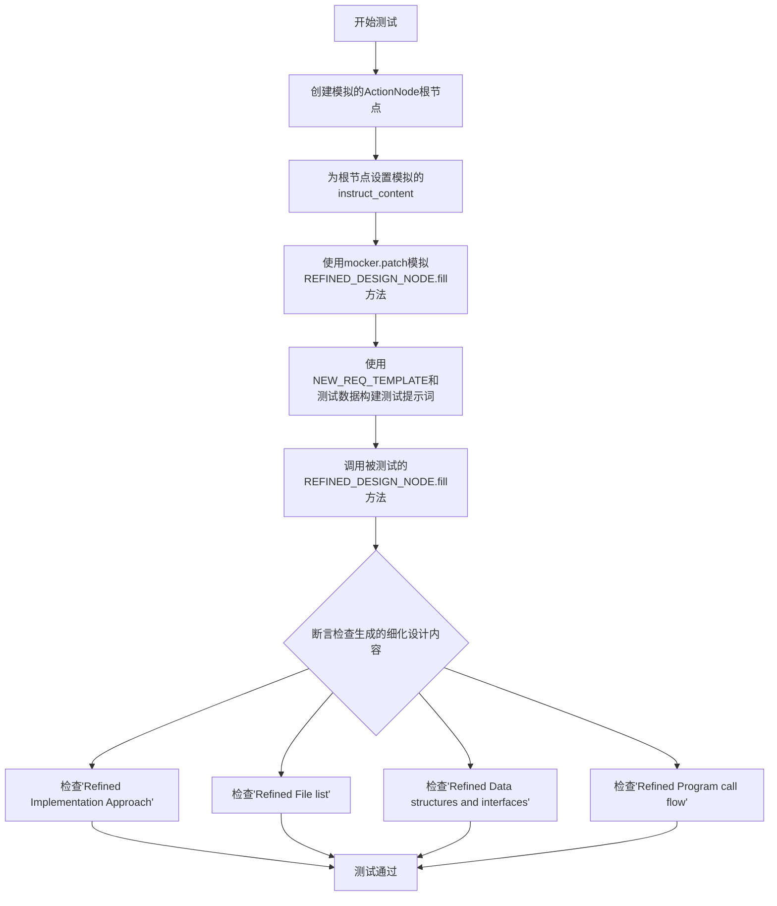
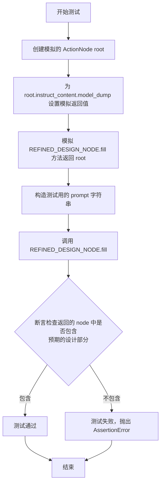
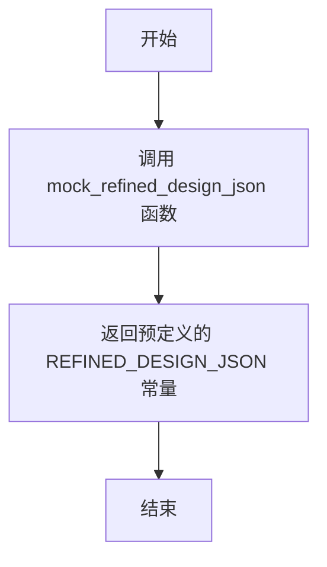
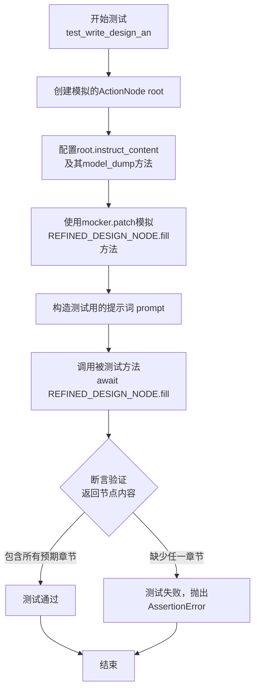
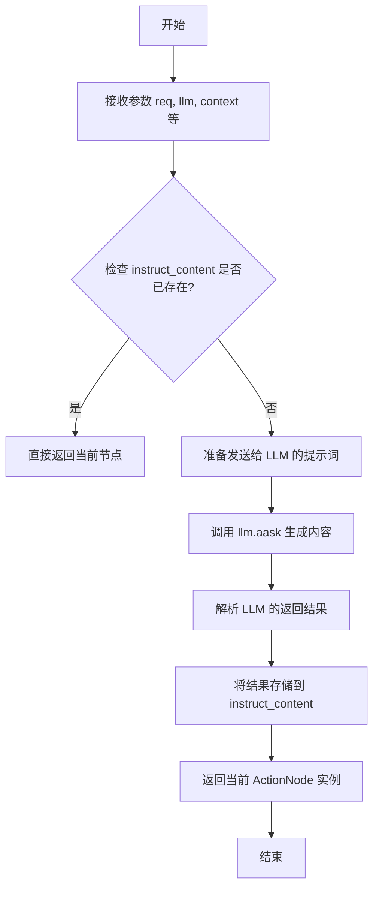
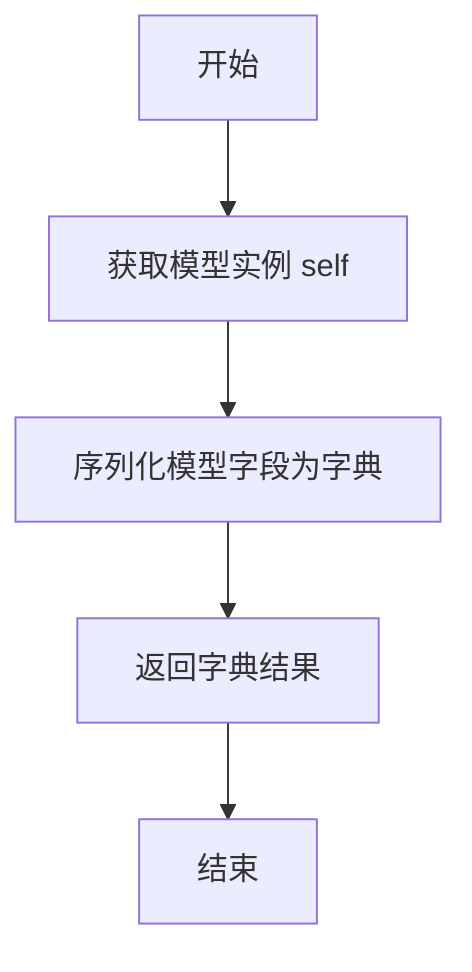

# `.\MetaGPT\tests\metagpt\actions\test_design_api_an.py` 详细设计文档

该文件是一个单元测试，用于验证 `metagpt.actions.design_api_an` 模块中 `REFINED_DESIGN_NODE` 的功能。它通过模拟（mocking）LLM调用和 `ActionNode.fill` 方法，测试在给定新的需求提示下，`REFINED_DESIGN_NODE` 能否正确生成包含特定关键部分（如实现方法、文件列表、数据结构与接口、程序调用流程）的细化设计内容。

## 整体流程



## 类结构

```
pytest框架
├── 测试函数 test_write_design_an
├── 测试夹具 llm
└── 辅助函数 mock_refined_design_json
```

## 全局变量及字段


### `REFINED_DESIGN_NODE`
    
一个预定义的ActionNode实例，用于在API设计流程中生成或精炼设计文档。

类型：`ActionNode`
    


### `NEW_REQ_TEMPLATE`
    
一个字符串模板，用于格式化包含旧设计和上下文信息的新需求提示。

类型：`str`
    


### `DESIGN_SAMPLE`
    
一个示例设计文档字符串，用作测试中的旧设计输入。

类型：`str`
    


### `REFINED_DESIGN_JSON`
    
一个包含精炼后设计内容的字典，用作测试中的模拟数据或预期输出。

类型：`dict`
    


### `REFINED_PRD_JSON`
    
一个包含精炼后产品需求文档（PRD）内容的字典，用作测试中的上下文输入。

类型：`dict`
    


### `ActionNode.key`
    
ActionNode的唯一标识符，用于在节点树中定位和引用该节点。

类型：`str`
    


### `ActionNode.expected_type`
    
指定该ActionNode期望生成或处理的内容的数据类型。

类型：`type`
    


### `ActionNode.instruction`
    
提供给LLM的指令文本，指导其如何生成或填充该节点的内容。

类型：`str`
    


### `ActionNode.example`
    
一个示例字符串，用于向LLM展示期望的输出格式或内容范例。

类型：`str`
    


### `ActionNode.instruct_content`
    
存储由LLM生成并结构化后的指令内容，通常是一个Pydantic BaseModel实例。

类型：`BaseModel`
    
    

## 全局函数及方法

### `test_write_design_an`

这是一个使用 `pytest` 框架编写的异步单元测试函数，用于测试 `REFINED_DESIGN_NODE.fill` 方法的功能。它通过模拟（Mock）依赖项来验证在给定特定输入（`NEW_REQ_TEMPLATE` 格式的提示词）时，`fill` 方法返回的 `ActionNode` 对象是否包含预期的关键设计部分。

参数：
-  `mocker`：`pytest-mock` 提供的 `MockerFixture` 类型对象，用于创建和管理测试中的模拟对象。

返回值：`None`，这是一个测试函数，不返回业务值，其成功与否由 `assert` 语句决定。

#### 流程图



#### 带注释源码

```python
@pytest.mark.asyncio  # 标记此函数为异步测试函数
async def test_write_design_an(mocker):  # 定义异步测试函数，接收 mocker 参数用于模拟
    # 1. 创建模拟的 ActionNode 对象作为 `fill` 方法的预期返回值
    root = ActionNode.from_children(
        "RefinedDesignAPI",  # 节点名称
        [ActionNode(key="", expected_type=str, instruction="", example="")]  # 子节点列表（此处为空节点）
    )
    # 2. 为模拟的 root 节点设置 instruct_content 属性
    root.instruct_content = BaseModel()  # 创建一个空的 BaseModel 对象
    # 3. 将 mock_refined_design_json 函数赋值给 model_dump 方法，用于模拟返回 REFINED_DESIGN_JSON 数据
    root.instruct_content.model_dump = mock_refined_design_json

    # 4. 使用 mocker 模拟 `metagpt.actions.design_api_an.REFINED_DESIGN_NODE.fill` 方法
    #    使其在测试中直接返回上面准备好的模拟 root 对象，而不是真正调用 LLM
    mocker.patch("metagpt.actions.design_api_an.REFINED_DESIGN_NODE.fill", return_value=root)

    # 5. 构造测试用的输入 prompt：
    #    - 使用 NEW_REQ_TEMPLATE 模板
    #    - 将 DESIGN_SAMPLE (旧设计) 和 REFINED_PRD_JSON (转换后的 PRD) 填入模板
    prompt = NEW_REQ_TEMPLATE.format(old_design=DESIGN_SAMPLE, context=dict_to_markdown(REFINED_PRD_JSON))
    
    # 6. 调用被测试的 `fill` 方法（此时已被模拟，会直接返回 root）
    #    传入构造的 prompt 和一个 llm 对象（在 fixture 中定义）
    node = await REFINED_DESIGN_NODE.fill(req=prompt, llm=llm)

    # 7. 断言：验证模拟返回的 node 对象的 instruct_content 中是否包含预期的键（即设计文档的各个部分）
    #    这些检查确保了 `fill` 方法返回的数据结构符合“精化设计”的预期格式
    assert "Refined Implementation Approach" in node.instruct_content.model_dump()
    assert "Refined File list" in node.instruct_content.model_dump()
    assert "Refined Data structures and interfaces" in node.instruct_content.model_dump()
    assert "Refined Program call flow" in node.instruct_content.model_dump()
```

### `mock_refined_design_json`

该函数是一个测试辅助函数，用于在单元测试中模拟`REFINED_DESIGN_JSON`数据。它不接受任何参数，直接返回一个预定义的、模拟精炼设计文档的JSON数据常量。其核心目的是在测试`test_write_design_an`时，隔离对真实LLM或复杂数据生成逻辑的依赖，确保测试的稳定性和可重复性。

参数：
- 无

返回值：`dict`，返回模拟的精炼设计文档JSON数据。

#### 流程图



#### 带注释源码

```python
def mock_refined_design_json():
    # 函数体：直接返回从测试数据模块导入的预定义常量 REFINED_DESIGN_JSON。
    # 该常量包含了模拟的精炼设计文档数据，用于在测试中替代真实的LLM生成结果。
    return REFINED_DESIGN_JSON
```

### `test_write_design_an`

这是一个使用 `pytest` 和 `mocker` 编写的异步单元测试函数，用于测试 `REFINED_DESIGN_NODE.fill` 方法的功能。它通过模拟（Mock）LLM的响应，验证在给定特定提示词（prompt）的情况下，`fill` 方法返回的 `ActionNode` 是否包含预期的设计文档章节。

参数：

-  `mocker`：`pytest-mock.MockerFixture`，pytest-mock 插件提供的模拟对象，用于在测试中替换（patch）函数或方法的返回值。

返回值：`None`，这是一个测试函数，其主要目的是通过断言（assert）来验证代码行为，不返回业务值。

#### 流程图



#### 带注释源码

```python
@pytest.mark.asyncio  # 标记此函数为异步测试函数
async def test_write_design_an(mocker):  # 定义异步测试函数，接收mocker fixture
    # 1. 准备模拟数据：创建一个模拟的ActionNode作为`fill`方法的预期返回值
    root = ActionNode.from_children(
        "RefinedDesignAPI",  # 节点名称
        [ActionNode(key="", expected_type=str, instruction="", example="")]  # 子节点列表（此处为一个空子节点）
    )
    # 为模拟节点设置instruct_content属性，它是一个BaseModel对象
    root.instruct_content = BaseModel()
    # 将BaseModel的model_dump方法替换为自定义的mock函数，使其返回预定义的REFINED_DESIGN_JSON
    root.instruct_content.model_dump = mock_refined_design_json

    # 2. 模拟（Mock）外部依赖：使用mocker替换`design_api_an`模块中的`REFINED_DESIGN_NODE.fill`方法
    #    使其直接返回上面准备好的模拟`root`节点，而不是真正调用LLM。
    mocker.patch("metagpt.actions.design_api_an.REFINED_DESIGN_NODE.fill", return_value=root)

    # 3. 构造测试输入：根据模板和模拟数据生成将要发送给`fill`方法的提示词。
    prompt = NEW_REQ_TEMPLATE.format(
        old_design=DESIGN_SAMPLE,  # 旧的设计文档样本
        context=dict_to_markdown(REFINED_PRD_JSON)  # 将精化的PRD JSON转换为markdown格式作为上下文
    )

    # 4. 执行被测试方法：调用`REFINED_DESIGN_NODE.fill`方法。
    #    由于该方法已被模拟，此处实际调用的是上面patch设置的函数，直接返回`root`。
    node = await REFINED_DESIGN_NODE.fill(req=prompt, llm=llm)

    # 5. 验证结果：断言返回的node的instruct_content中包含精化设计文档的所有关键章节。
    #    这些断言检查模拟的JSON数据（REFINED_DESIGN_JSON）是否被正确返回并包含必要字段。
    assert "Refined Implementation Approach" in node.instruct_content.model_dump()
    assert "Refined File list" in node.instruct_content.model_dump()
    assert "Refined Data structures and interfaces" in node.instruct_content.model_dump()
    assert "Refined Program call flow" in node.instruct_content.model_dump()
```

### `ActionNode.from_children`

这是一个类方法，用于根据提供的子节点列表创建一个新的 `ActionNode` 实例。它通过组合子节点的键（key）来生成新节点的键，并设置其预期类型、指令和示例。此方法常用于构建具有层次结构的动作节点树。

参数：

- `name`：`str`，要创建的新 `ActionNode` 的名称。
- `children`：`List[ActionNode]`，一个 `ActionNode` 实例的列表，这些实例将作为新创建节点的子节点。

返回值：`ActionNode`，返回一个根据提供的子节点列表构造的新 `ActionNode` 实例。

#### 流程图

```mermaid
flowchart TD
    A[开始: from_children(name, children)] --> B{children 列表是否为空?}
    B -- 是 --> C[设置 key 为 name]
    B -- 否 --> D[遍历 children 列表<br>提取每个 child 的 key]
    D --> E[使用 '\\n' 连接所有 child key]
    E --> F[设置 key 为 name + '\\n' + 连接的 keys]
    F --> G[创建新的 ActionNode 实例<br>传入 key, 预期类型, 指令, 示例]
    C --> G
    G --> H[返回新创建的 ActionNode 实例]
    H --> I[结束]
```

#### 带注释源码

```python
@classmethod
def from_children(cls, name: str, children: List["ActionNode"]) -> "ActionNode":
    """
    根据子节点列表创建一个新的 ActionNode。
    新节点的 key 由名称和所有子节点的 key 组合而成。
    
    Args:
        name (str): 新节点的名称。
        children (List[ActionNode]): 子节点列表。
        
    Returns:
        ActionNode: 新创建的 ActionNode 实例。
    """
    # 初始化 key 为传入的名称
    key = name
    # 如果存在子节点，则处理子节点的 key
    if children:
        # 从每个子节点中提取其 key
        child_keys = [child.key for child in children]
        # 将所有子节点的 key 用换行符连接起来
        concatenated_keys = "\n".join(child_keys)
        # 将名称和连接后的子节点 keys 组合，形成新节点的 key
        key = f"{name}\n{concatenated_keys}"
    # 创建并返回一个新的 ActionNode 实例
    # 注意：这里固定了预期类型为 str，指令和示例为空字符串。
    # 在实际的类定义中，这些参数可能需要根据上下文动态设置。
    return cls(key=key, expected_type=str, instruction="", example="")
```

### `ActionNode.fill`

该方法用于填充 ActionNode 的内容。它接收一个需求描述（`req`）和一个大语言模型实例（`llm`），通过调用大语言模型来生成或完善当前 ActionNode 及其子节点的内容，并将结果存储在 `instruct_content` 属性中。

参数：
- `req`：`str`，描述需要填充或处理的需求文本。
- `llm`：`LLM`，用于生成内容的大语言模型实例。
- `context`：`str`，可选参数，提供额外的上下文信息。
- `schema`：`str` 或 `dict`，可选参数，指定输出内容的格式或结构。
- `mode`：`str`，可选参数，指定填充模式，例如 "auto" 表示自动模式。
- `system_text`：`str`，可选参数，提供给大语言模型的系统提示文本。
- `format`：`dict`，可选参数，指定输出格式的详细配置。

返回值：`ActionNode`，返回填充了内容的 ActionNode 实例本身。

#### 流程图



#### 带注释源码

```python
async def fill(
    self,
    req: str,
    llm: LLM,
    context: str = "",
    schema: Union[str, dict] = "json",
    mode: str = "auto",
    system_text: str = "",
    format: dict = {},
) -> "ActionNode":
    """
    填充 ActionNode 的内容。
    通过调用大语言模型，根据需求（req）和上下文（context）生成内容，并解析存储结果。
    
    Args:
        req (str): 需求描述。
        llm (LLM): 大语言模型实例。
        context (str, optional): 额外的上下文信息。默认为空字符串。
        schema (Union[str, dict], optional): 输出内容的格式，如 'json'。默认为 "json"。
        mode (str, optional): 填充模式，例如 'auto'。默认为 "auto"。
        system_text (str, optional): 系统提示词。默认为空字符串。
        format (dict, optional): 输出格式的详细配置。默认为空字典。
    
    Returns:
        ActionNode: 填充了内容的当前 ActionNode 实例。
    """
    # 如果 instruct_content 已存在，则直接返回，避免重复生成
    if self.instruct_content:
        return self

    # 准备发送给 LLM 的提示词，结合需求、上下文和节点自身的指令
    prompt = self.compile(context=context, schema=schema, mode=mode, req=req)
    # 调用大语言模型生成内容
    rsp = await llm.aask(prompt, system_msgs=[system_text] if system_text else [])
    # 解析大语言模型的返回结果，并存储到 instruct_content 属性中
    self.instruct_content = self.parse(
        rsp, schema=schema, format=format
    )  # 可能返回一个 BaseModel 实例或字典
    # 返回当前节点实例，便于链式调用
    return self
```

### `BaseModel.model_dump`

该方法用于将 `BaseModel` 实例序列化为一个字典。它通常用于提取模型的数据，以便进行进一步处理或输出。

参数：
-  `self`：`BaseModel`，`BaseModel` 的实例，表示要序列化的模型对象。

返回值：`dict`，返回一个字典，包含模型的所有字段及其对应的值。

#### 流程图



#### 带注释源码

```python
def model_dump(self) -> dict:
    """
    将 BaseModel 实例序列化为字典。
    
    该方法遍历模型的所有字段，并将其转换为字典形式。
    通常用于数据提取、序列化或进一步处理。
    
    Returns:
        dict: 包含模型字段及其值的字典。
    """
    # 序列化逻辑：将模型字段转换为字典
    result = {}
    for field_name, field_value in self.__dict__.items():
        # 处理字段值，确保可序列化
        if hasattr(field_value, 'model_dump'):
            result[field_name] = field_value.model_dump()
        else:
            result[field_name] = field_value
    return result
```

## 关键组件


### ActionNode

ActionNode 是用于构建和操作结构化指令内容的核心组件，它支持从子节点构建树形结构，并能与LLM交互进行内容填充。

### REFINED_DESIGN_NODE

REFINED_DESIGN_NODE 是一个预定义的 ActionNode 实例，专门用于处理“精化设计”任务，它封装了生成精化设计文档（如实现方法、文件列表、数据结构、程序调用流）所需的指令结构。

### LLM (Large Language Model)

LLM 是提供大语言模型能力的封装类，作为外部服务接口，被 ActionNode 调用以生成或填充结构化的设计内容。

### dict_to_markdown

dict_to_markdown 是一个工具函数，用于将字典数据结构转换为 Markdown 格式的字符串，以便作为上下文信息嵌入到提示词中，辅助 LLM 理解现有需求或设计。

### NEW_REQ_TEMPLATE

NEW_REQ_TEMPLATE 是一个字符串模板，用于格式化生成向 LLM 请求精化设计的提示词。它接收旧的设计文档和精化的产品需求文档作为输入，构造出完整的任务描述。

### Mock Data (DESIGN_SAMPLE, REFINED_DESIGN_JSON, REFINED_PRD_JSON)

这是一组用于单元测试的模拟数据，分别代表旧的设计样本、期望的精化设计JSON输出以及精化的产品需求JSON。它们确保了测试可以在不依赖真实LLM服务的情况下验证代码逻辑的正确性。


## 问题及建议


### 已知问题

-   **测试用例对实现细节耦合过紧**：`test_write_design_an` 测试函数通过 `mocker.patch` 直接模拟了 `REFINED_DESIGN_NODE.fill` 的内部方法调用。这种测试方式高度依赖于 `ActionNode.fill` 方法的内部实现（即它会调用 `REFINED_DESIGN_NODE.fill`），使得测试变得脆弱。一旦 `design_api_an` 模块中 `REFINED_DESIGN_NODE` 的初始化方式、`fill` 方法的实现逻辑或导入路径发生改变，此测试就会失败，即使被测试的核心功能（设计API的生成与验证）依然正确。
-   **测试数据与逻辑混合**：测试函数中直接硬编码了断言检查的字符串（如 `"Refined Implementation Approach"`）。这些字符串是业务逻辑的一部分，应该与被测试模块（`design_api_an`）中定义的结构常量保持一致。目前这种写法存在两处维护点，容易在业务逻辑变更时导致测试遗漏或失败。
-   **模拟对象构造复杂且不直观**：为了模拟 `ActionNode` 的 `instruct_content` 属性，测试代码手动创建了一个 `BaseModel` 实例并为其 `model_dump` 方法打补丁。这种构造方式较为晦涩，增加了测试的理解和维护成本，未能清晰表达测试的意图。
-   **异步测试的潜在资源管理问题**：测试函数标记为 `@pytest.mark.asyncio` 但未显式管理异步上下文或资源（如 `LLM` 实例）。虽然当前通过 `mocker.patch` 避免了真实调用，但在更复杂的异步测试场景下，缺乏对事件循环或异步资源生命周期的明确管理可能引发问题。

### 优化建议

-   **采用更高层次的模拟或依赖注入**：建议重构测试，避免对 `REFINED_DESIGN_NODE.fill` 进行底层模拟。可以改为模拟 `LLM` 的调用（如果 `fill` 方法内部使用了 `LLM`），或者为 `ActionNode` 提供一个可配置的测试替身。更好的方式是，审视 `design_api_an` 模块的设计，看是否可以将 `REFINED_DESIGN_NODE` 作为可注入的依赖，从而在测试中轻松替换为返回预设结果的模拟对象。
-   **集中管理测试断言常量**：将与业务逻辑相关的预期字符串（如 `"Refined Implementation Approach"`）提取为测试模块或共享模块的常量。或者，直接从被测试模块（`design_api_an`）导入这些定义。这样可以确保测试与实现保持同步，减少重复和维护开销。
-   **简化模拟对象的创建**：使用更专业的测试工具（如 `unittest.mock` 的 `MagicMock` 或 `AsyncMock`）来创建行为更清晰的模拟对象。例如，可以直接创建一个 `MagicMock` 实例，设置其 `model_dump` 方法返回 `mock_refined_design_json` 函数，而不是操作一个真实的 `BaseModel` 实例。这能使测试代码的意图更明确。
-   **明确异步测试的资源管理**：考虑使用 `pytest-asyncio` 的最佳实践，例如在 fixture 中管理异步资源的创建和清理。对于 `llm` fixture，确保其返回的对象在异步上下文中是安全的。虽然当前测试通过模拟避免了问题，但建立良好的模式有助于未来编写更健壮的集成测试。
-   **增强测试的语义和可读性**：为测试用例和断言添加更清晰的描述性注释或变量名，说明正在验证的业务规则，而不仅仅是实现细节。考虑将长的测试函数拆分为多个更小、更专注的测试函数，每个函数验证一个特定的方面。


## 其它


### 设计目标与约束

本测试代码的设计目标是验证 `design_api_an` 模块中 `REFINED_DESIGN_NODE` 的功能，确保其能够根据给定的需求提示（`NEW_REQ_TEMPLATE`）和模拟的上下文数据，正确生成并填充一个包含“精炼设计”关键部分（如实现方法、文件列表、数据结构与接口、程序调用流程）的 `ActionNode` 对象。主要约束包括：1) 测试环境需模拟外部 LLM 调用和 `REFINED_DESIGN_NODE.fill` 方法的行为；2) 依赖固定的测试数据样本（`DESIGN_SAMPLE`, `REFINED_PRD_JSON`, `REFINED_DESIGN_JSON`）以确保测试的可重复性和确定性；3) 作为单元测试，需与真实网络和服务隔离。

### 错误处理与异常设计

当前测试代码主要使用 `pytest` 的断言机制来验证功能正确性，未显式包含针对被测试函数（`REFINED_DESIGN_NODE.fill`）可能抛出的异常（如网络错误、API调用失败、数据解析错误等）的捕获和处理测试。错误处理逻辑依赖于被模拟的 `fill` 方法返回预设的、正确的 `ActionNode` 对象。测试本身假设依赖的模拟数据和补丁操作总是成功的。更健壮的测试设计应考虑模拟异常场景，例如让模拟的 `fill` 方法抛出特定异常，并验证测试是否能恰当处理或失败。

### 数据流与状态机

测试的数据流清晰且线性：
1.  **初始化**：准备测试夹具 `llm` 和模拟数据函数 `mock_refined_design_json`。
2.  **模拟设置**：使用 `mocker.patch` 将 `REFINED_DESIGN_NODE.fill` 方法替换为返回一个预配置的 `root` `ActionNode` 对象的模拟函数。该 `root` 节点的 `instruct_content.model_dump` 方法被设置为返回固定的 `REFINED_DESIGN_JSON` 数据。
3.  **执行**：根据 `NEW_REQ_TEMPLATE` 和 `REFINED_PRD_JSON` 构造请求提示（`prompt`），然后异步调用被模拟的 `REFINED_DESIGN_NODE.fill` 方法。
4.  **验证**：断言返回的 `node` 对象的 `instruct_content.model_dump()` 结果中包含预期的几个关键字段（如“Refined Implementation Approach”），以此验证 `fill` 方法处理逻辑和输出结构的正确性。整个测试过程没有复杂的状态变迁，是一个单一的“调用-验证”流程。

### 外部依赖与接口契约

测试代码明确依赖以下外部组件：
1.  **`pytest` 框架**：用于组织测试用例、提供夹具和模拟功能（`mocker`）。
2.  **`metagpt.actions.design_api_an.REFINED_DESIGN_NODE`**：这是被测试的主要对象。测试与其的契约是：调用其 `fill` 方法并传入 `req` 和 `llm` 参数后，应返回一个 `ActionNode` 实例，且该实例的 `instruct_content` 包含特定的结构化设计信息。
3.  **`metagpt.llm.LLM`**：作为 `fill` 方法的参数之一被传入，但在本测试中被模拟，并未实际使用其功能。接口契约是作为 `llm` 参数的类型。
4.  **测试数据模块 (`tests.data.incremental_dev_project.mock`)**：提供固定的输入（`DESIGN_SAMPLE`, `REFINED_PRD_JSON`）和预期输出（`REFINED_DESIGN_JSON`）数据。契约是这些数据具有稳定的结构和内容。
5.  **`openai._models.BaseModel` 及 `metagpt.actions.action_node` 相关类**：用于构建和验证返回的 `ActionNode` 对象的结构。

测试通过模拟（`mocker.patch`）严格定义了与 `REFINED_DESIGN_NODE.fill` 的交互，使其不依赖于该方法的真实实现或任何外部服务（如真实的 LLM API），从而实现了隔离测试。

    