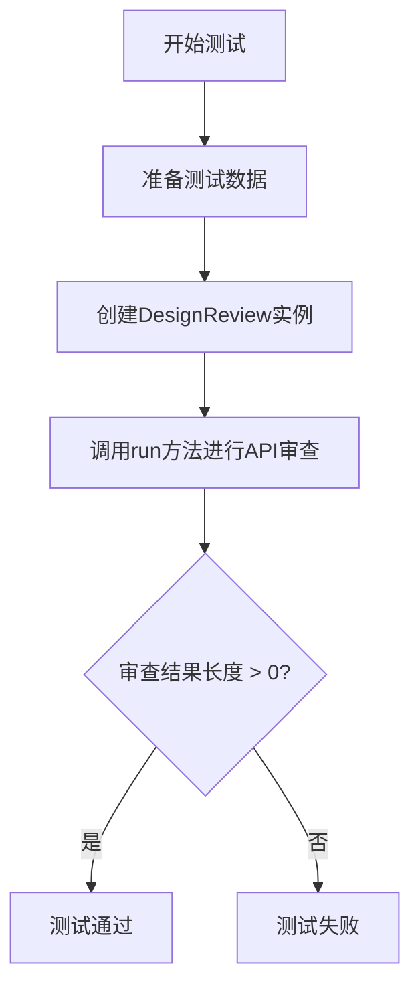
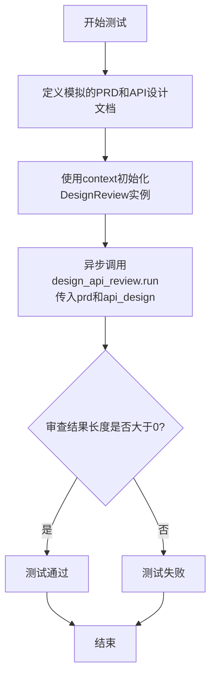
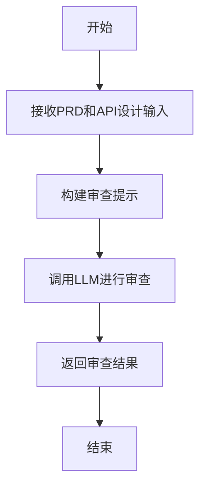

# `.\MetaGPT\tests\metagpt\actions\test_design_api_review.py` 详细设计文档

该文件是一个单元测试，用于测试 DesignReview 类的功能。它模拟了一个产品需求文档（PRD）和一个API设计，然后调用 DesignReview 类的 run 方法进行审查，验证其是否能够生成有效的审查结果。

## 整体流程



## 类结构

```
DesignReview (被测试类)
├── 继承自: 未知基类 (根据导入推测)
└── 方法: run
```

## 全局变量及字段


### `prd`
    
产品需求文档（PRD）的字符串内容，描述了音乐播放器的核心功能需求。

类型：`str`
    


### `api_design`
    
API设计的字符串描述，包含数据结构和API列表。

类型：`str`
    


### `_`
    
一个占位符变量，用于存储预期的审查结果或提示文本，但在此测试中未实际使用。

类型：`str`
    


### `design_api_review`
    
DesignReview类的实例，用于执行API设计审查操作。

类型：`DesignReview`
    


### `result`
    
存储DesignReview.run方法返回的API审查结果字符串。

类型：`str`
    


    

## 全局函数及方法

### `test_design_api_review`

这是一个使用 `pytest` 框架编写的异步单元测试函数，用于测试 `DesignReview` 类的 `run` 方法。它模拟了产品需求文档（PRD）和API设计文档，调用 `DesignReview` 的审查功能，并验证其返回结果的有效性。

参数：

- `context`：`Context`，测试执行所需的上下文环境，通常包含配置信息、日志记录器等，用于初始化 `DesignReview` 实例。

返回值：`None`，这是一个测试函数，不直接返回值，而是通过断言（`assert`）来验证测试结果。

#### 流程图



#### 带注释源码

```python
@pytest.mark.asyncio  # 标记此函数为异步测试，以便pytest-asyncio插件能够正确处理
async def test_design_api_review(context):  # 定义异步测试函数，接收context参数
    # 模拟产品需求文档（PRD）内容
    prd = "我们需要一个音乐播放器，它应该有播放、暂停、上一曲、下一曲等功能。"
    # 模拟基于PRD设计的API文档
    api_design = """
数据结构:
1. Song: 包含歌曲信息，如标题、艺术家等。
2. Playlist: 包含一系列歌曲。

API列表:
1. play(song: Song): 开始播放指定的歌曲。
2. pause(): 暂停当前播放的歌曲。
3. next(): 跳到播放列表的下一首歌曲。
4. previous(): 跳到播放列表的上一首歌曲。
"""
    # 这是一个预期的审查结果描述（在测试中未使用，仅作示意）
    _ = "API设计看起来非常合理，满足了PRD中的所有需求。"

    # 使用传入的context初始化DesignReview动作实例
    design_api_review = DesignReview(context=context)

    # 异步调用DesignReview的run方法，传入模拟的PRD和API设计进行审查
    result = await design_api_review.run(prd, api_design)

    # 这是构造的、预期会发送给LLM的提示词（在测试中未实际调用，仅作示意和注释）
    _ = f"以下是产品需求文档(PRD):\n\n{prd}\n\n以下是基于这个PRD设计的API列表:\n\n{api_design}\n\n请审查这个API设计是否满足PRD的需求，以及是否符合良好的设计实践。"
    # 如果使用了mock，可以在此断言LLM被调用了一次，并传入了上面的prompt
    # mock_llm.ask.assert_called_once_with(prompt)

    # 断言：审查结果（result）的长度必须大于0，确保得到了非空的响应
    assert len(result) > 0
```

### `DesignReview.run`

该方法用于执行API设计审查，根据产品需求文档（PRD）评估给定的API设计是否满足需求并符合良好的设计实践。

参数：

- `prd`：`str`，产品需求文档，描述系统或功能的需求。
- `api_design`：`str`，基于PRD设计的API列表和数据结构。

返回值：`str`，返回审查结果，包含对API设计的评价和建议。

#### 流程图



#### 带注释源码

```python
async def run(self, prd: str, api_design: str) -> str:
    """
    执行API设计审查。

    Args:
        prd (str): 产品需求文档，描述系统或功能的需求。
        api_design (str): 基于PRD设计的API列表和数据结构。

    Returns:
        str: 返回审查结果，包含对API设计的评价和建议。
    """
    # 构建审查提示，将PRD和API设计整合到提示中
    prompt = f"以下是产品需求文档(PRD):\n\n{prd}\n\n以下是基于这个PRD设计的API列表:\n\n{api_design}\n\n请审查这个API设计是否满足PRD的需求，以及是否符合良好的设计实践。"
    
    # 调用LLM（大语言模型）进行审查，并返回结果
    result = await self._aask(prompt)
    return result
```

## 关键组件


### DesignReview 类

这是一个用于审查API设计的动作类，它接收产品需求文档（PRD）和API设计文档作为输入，通过调用语言模型来评估API设计是否满足需求以及是否符合良好的设计实践。

### 测试函数 `test_design_api_review`

这是一个异步测试函数，用于验证 `DesignReview` 类的 `run` 方法功能。它模拟了输入（PRD和API设计），执行审查过程，并断言返回的结果不为空，以确保审查逻辑能够产生输出。


## 问题及建议


### 已知问题

-   **测试用例设计不完整**：当前测试用例仅验证了`DesignReview.run`方法能返回非空结果，但没有验证其返回内容的正确性、格式或是否符合预期逻辑。测试覆盖度不足，无法有效保证代码质量。
-   **存在未使用的变量**：代码中定义了两个下划线(`_`)变量，它们被赋值但从未被使用。这可能是开发过程中的残留代码，会造成代码冗余和潜在的混淆。
-   **测试数据与断言分离**：用于构造预期提示词（prompt）的字符串被赋值给变量`_`，但后续的断言（`assert len(result) > 0`）并未与此提示词或其生成逻辑建立关联，使得测试意图不清晰，更像是一个“烟雾测试”。
-   **依赖外部服务未模拟**：测试方法`test_design_api_review`直接实例化并运行了`DesignReview`动作，该动作内部很可能会调用大语言模型(LLM)服务。在单元测试中直接调用真实外部服务是不合适的，会导致测试速度慢、不稳定（依赖网络和服务状态）、可能产生费用，且无法模拟各种边界和异常情况。代码中注释掉的`# mock_llm.ask.assert_called_once_with(prompt)`表明开发者意识到了需要模拟，但并未正确实现。

### 优化建议

-   **完善测试断言**：除了检查返回结果非空，应增加对返回结果具体内容的断言。例如，可以验证返回的字符串中是否包含特定的关键词（如“合理”、“满足需求”等），或者使用更结构化的预期输出进行对比。
-   **清理无用代码**：移除两个未使用的`_`变量赋值语句，保持代码简洁。
-   **重构测试逻辑，明确测试意图**：将测试的“准备-执行-断言”三步更清晰地分离。可以显式地构造预期的输入（PRD和API设计）和预期的输出（或输出特征），然后执行方法，最后断言实际输出符合预期。
-   **使用Mock模拟外部依赖**：正确实现LLM服务的模拟（Mock）。使用`pytest-mock`或`unittest.mock`来替换`DesignReview`动作内部对LLM的调用，并设置模拟返回一个预定义的、符合测试场景的字符串。同时，可以断言模拟对象是否以预期的参数（如构造正确的提示词）被调用。这能将测试聚焦于`DesignReview`动作本身的逻辑，而不是其外部依赖。
-   **考虑增加更多测试场景**：当前测试只覆盖了“正常情况”。建议增加更多测试用例，例如：测试当API设计不满足PRD时的反馈、测试当输入为空或格式错误时的行为、测试模型返回异常时的错误处理等，以提高代码的健壮性。


## 其它


### 设计目标与约束

本代码是一个针对`DesignReview`类的单元测试，其设计目标是验证`DesignReview`类的`run`方法能够正确执行API设计审查流程。主要约束包括：
1.  **测试隔离性**：测试应独立于真实的LLM（大语言模型）服务，通过模拟或依赖注入（如`context`参数）来避免外部调用，确保测试的稳定性和可重复性。
2.  **异步支持**：由于`DesignReview.run`方法是异步的，测试框架必须支持异步测试（使用`pytest.mark.asyncio`）。
3.  **输入输出验证**：测试需要验证在给定固定的产品需求文档（PRD）和API设计输入后，`run`方法能产生非空的输出（`assert len(result) > 0`），从而确认核心流程的连通性。

### 错误处理与异常设计

当前测试代码本身不包含复杂的错误处理逻辑，其设计重点在于验证正常路径。潜在的异常处理考虑包括：
1.  **输入验证**：`DesignReview.run`方法内部应处理`prd`或`api_design`为空字符串或`None`的情况，可能抛出`ValueError`等异常。本测试未覆盖这些边界情况。
2.  **依赖服务异常**：`DesignReview`类依赖的`context`（可能包含LLM客户端）在运行时可能发生网络错误或服务不可用。这些异常应由`DesignReview`类捕获并转换为适当的用户友好错误或日志，但本测试通过传入模拟的`context`规避了此类问题。
3.  **测试断言失败**：若`run`方法返回空结果，`assert len(result) > 0`将抛出`AssertionError`，这是测试框架的标准行为，用于指示测试未通过。

### 数据流与状态机

本测试执行过程中的数据流清晰且线性：
1.  **数据输入**：测试函数内部硬编码了`prd`（产品需求）和`api_design`（API设计）两个字符串作为输入数据。
2.  **处理过程**：数据被传递给`DesignReview`实例的`run`方法。根据代码注释推断，`run`方法会构造一个包含PRD和API设计的提示词（prompt），并通过`context`中的LLM服务进行处理。
3.  **数据输出**：`run`方法的返回值`result`被赋值给变量，并断言其长度大于0。`result`应为LLM生成的API设计审查意见文本。
4.  **状态变化**：此测试不涉及持久化状态。`DesignReview`类本身在测试中是无状态的，其行为完全由输入参数和注入的`context`依赖决定。

### 外部依赖与接口契约

1.  **`pytest`框架**：测试依赖于`pytest`及其`asyncio`插件来运行异步测试用例。
2.  **`metagpt.actions.design_api_review.DesignReview`类**：这是被测系统（SUT）。测试依赖于其公共接口：
    *   `__init__(context)`: 构造函数，接受一个`context`对象。
    *   `run(prd: str, api_design: str) -> str`: 异步方法，接受PRD和API设计字符串，返回审查结果字符串。这是测试验证的核心契约。
3.  **`context`参数（pytest fixture）**：这是关键的外部依赖注入点。测试函数接收一个名为`context`的fixture，它应提供一个模拟或配置好的上下文环境，使得`DesignReview`类能够在不调用真实外部服务（如OpenAI API）的情况下运行。其具体接口由测试框架或项目约定定义，通常包含模拟的LLM客户端。
4.  **隐式依赖（已模拟）**：真实的`DesignReview`类可能依赖LLM API、配置管理等。在测试中，这些依赖通过`context` fixture被模拟或存根（Stub），从而切断了外部依赖。

### 测试策略与覆盖范围

1.  **测试类型**：这是一个单元测试（Unit Test），专注于验证`DesignReview`类单个方法的功能。
2.  **覆盖重点**：
    *   **正向路径（Happy Path）**：测试使用一组有代表性的有效输入，验证`run`方法能否成功执行并返回预期格式（非空字符串）的结果。
    *   **集成点**：验证`DesignReview`类与通过`context`注入的依赖之间接口调用的正确性（从代码注释`# mock_llm.ask.assert_called_once_with(prompt)`可推断，实际可能使用了Mock进行验证）。
3.  **覆盖缺口**：
    *   **边界条件**：未测试空输入、超长输入、特殊字符输入等。
    *   **异常路径**：未测试当依赖的`context`提供异常响应时（如模拟LLM抛出异常），`run`方法的行为。
    *   **输出验证**：仅验证了结果非空，未对结果的内容、格式或质量进行断言。更完善的测试可能需要对LLM返回的文本进行模式匹配或结构化验证。

    