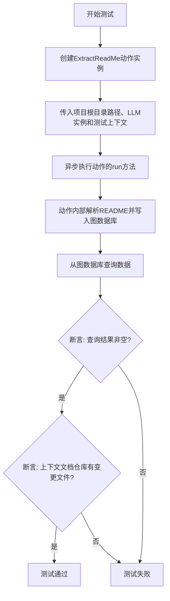
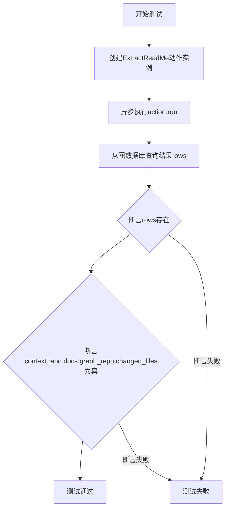
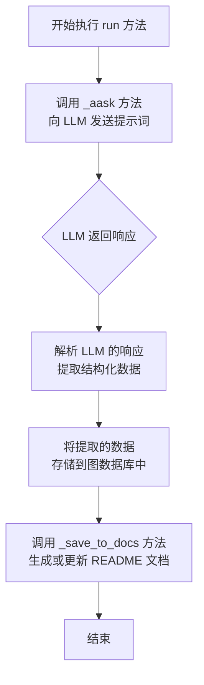
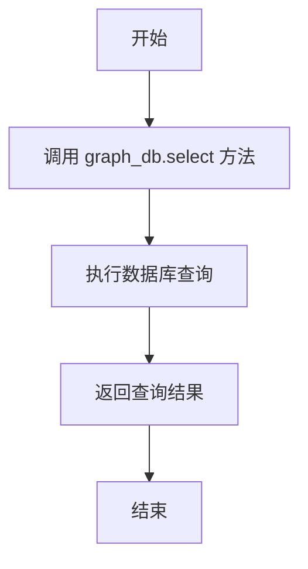

# `.\MetaGPT\tests\metagpt\actions\test_extract_readme.py` 详细设计文档

该代码是一个使用 pytest 框架编写的异步单元测试，用于测试 `ExtractReadMe` 动作（Action）的功能。该动作的核心功能是解析指定目录（此处为项目根目录）下的 README 文件，提取其中的结构化信息（如依赖、API、架构等），并将其存储到图数据库中。测试验证了动作执行后图数据库中存在数据，并且测试上下文（context）中的文档仓库有文件被标记为已更改。

## 整体流程



## 类结构

```
测试文件 (test_extract_readme.py)
├── 全局函数: test_learn_readme (异步测试函数)
└── 外部依赖类:
    ├── ExtractReadMe (被测试的动作类)
    └── LLM (大语言模型类)
```

## 全局变量及字段


### `ExtractReadMe.name`
    
动作实例的名称标识符，用于区分不同的动作实例

类型：`str`
    


### `ExtractReadMe.i_context`
    
输入上下文路径，指定要处理的根目录或文件路径

类型：`str`
    


### `ExtractReadMe.llm`
    
大语言模型实例，用于执行自然语言处理任务

类型：`LLM`
    


### `ExtractReadMe.context`
    
运行时上下文对象，包含项目状态、配置和共享资源

类型：`Context`
    


### `ExtractReadMe.graph_db`
    
图数据库连接实例，用于存储和查询提取的文档结构关系

类型：`GraphDB`
    
    

## 全局函数及方法

### `test_learn_readme`

这是一个使用 `pytest` 框架编写的异步单元测试函数。它的核心功能是测试 `ExtractReadMe` 动作（Action）的 `run` 方法，验证其能否成功从指定上下文中提取 README 信息，并将结果存储到图数据库中，同时断言相关的文件状态发生了变化。

参数：

- `context`：`metagpt.Context` 类型，测试执行所需的上下文环境，通常包含代码仓库、配置等信息。

返回值：`None`，测试函数通常不显式返回值，其成功与否由断言（`assert`）决定。

#### 流程图



#### 带注释源码

```python
# 使用pytest的异步标记，表示这是一个异步测试函数
@pytest.mark.asyncio
async def test_learn_readme(context):
    # 1. 实例化被测试的Action：ExtractReadMe
    #    - name: 动作名称，此处为"RedBean"
    #    - i_context: 输入上下文，这里通过Path计算得到项目根目录的路径字符串
    #    - llm: 大语言模型实例，用于Action内部的处理
    #    - context: 测试传入的上下文对象
    action = ExtractReadMe(
        name="RedBean",
        i_context=str(Path(__file__).parent.parent.parent.parent),
        llm=LLM(),
        context=context,
    )
    
    # 2. 异步执行Action的核心逻辑（run方法）
    #    该方法预计会解析README，并将结构化数据存入图数据库
    await action.run()
    
    # 3. 从Action关联的图数据库中查询所有数据行
    rows = await action.graph_db.select()
    
    # 4. 断言1：确保图数据库中有数据被写入（rows不为空）
    assert rows
    
    # 5. 断言2：确保上下文中的文档图仓库标记了文件变更
    #    这验证了Action的执行确实对系统状态产生了预期的影响
    assert context.repo.docs.graph_repo.changed_files

# 允许直接运行此脚本进行测试
if __name__ == "__main__":
    pytest.main([__file__, "-s"])
```

### `ExtractReadMe.run`

该方法用于执行 README 文档的提取流程。它通过调用 LLM 分析指定目录下的代码文件，提取关键信息，并将这些信息结构化地存储到图数据库中，最终生成或更新项目的 README 文档。

参数：
-  `self`：`ExtractReadMe`，`ExtractReadMe` 类的实例，包含执行提取任务所需的所有上下文和配置。

返回值：`None`，此方法不返回任何值，其主要作用是通过副作用（如写入数据库、生成文件）来完成其任务。

#### 流程图



#### 带注释源码

```python
async def run(self, *args, **kwargs) -> None:
    """
    执行 README 提取流程的核心方法。
    该方法是一个异步协程，负责协调整个信息提取和文档生成过程。
    """
    # 1. 构建提示词 (Prompt)，将代码目录路径等信息发送给 LLM
    prompt = self._build_prompt()
    
    # 2. 异步调用 LLM (大语言模型) 获取分析结果
    #    _aask 方法负责与 LLM API 交互并返回响应文本
    rsp = await self._aask(prompt)
    
    # 3. 解析 LLM 返回的响应文本，提取结构化的项目信息
    #    _parse_data 方法将自然语言响应转换为预定义的数据结构
    data = self._parse_data(rsp)
    
    # 4. 将解析后的结构化数据存储到图数据库中
    #    _save_to_graph_db 方法负责数据的持久化存储
    await self._save_to_graph_db(data)
    
    # 5. 基于图数据库中的信息，生成或更新项目的 README 文档
    #    _save_to_docs 方法负责文档的最终生成和写入
    await self._save_to_docs()
```

### `ExtractReadMe.graph_db.select`

该方法用于从图数据库中查询数据，返回查询结果。

参数：
- 无显式参数。该方法通过`self`访问`ExtractReadMe`实例的`graph_db`属性，并调用其`select`方法。

返回值：`list`，包含从图数据库中查询到的数据行。

#### 流程图



#### 带注释源码

```python
async def select(self):
    """
    从图数据库中查询数据。
    
    该方法通过调用图数据库的查询接口，获取存储的数据。
    通常用于在提取README信息后，检索已存储的节点和关系。
    
    Returns:
        list: 查询结果，包含数据行。
    """
    # 调用图数据库的select方法执行查询
    rows = await self.graph_db.select()
    return rows
```

## 关键组件


### ExtractReadMe 动作

一个用于从项目代码库中提取README信息的动作，它通过LLM分析代码结构并生成知识图谱节点，以支持文档的自动化生成与维护。

### LLM (大语言模型)

作为核心的AI驱动组件，负责理解代码语义、分析项目结构，并生成结构化的文档信息，是`ExtractReadMe`动作实现智能分析的关键依赖。

### Graph Database (图数据库)

用于存储`ExtractReadMe`动作处理后的结构化数据（知识图谱），支持对代码实体、关系及文档信息的持久化存储与高效查询。

### Repository Context (仓库上下文)

提供了当前代码仓库的元数据和访问接口，特别是`repo.docs.graph_repo`，它管理着与文档相关的文件状态，是动作执行环境的核心组成部分。

### Asynchronous Test Framework (异步测试框架)

通过`pytest.mark.asyncio`和`async/await`语法支持对异步动作`ExtractReadMe.run()`的单元测试，确保了核心业务流程的可验证性。


## 问题及建议


### 已知问题

-   **测试用例与具体实现强耦合**：测试用例 `test_learn_readme` 直接实例化了 `ExtractReadMe` 类，并依赖于其内部方法 `run()` 和 `graph_db.select()`。这使得测试用例与 `ExtractReadMe` 类的具体实现细节紧密绑定。如果 `ExtractReadMe` 的内部结构或方法签名发生变化（例如，`run` 方法重命名、`graph_db` 属性重构），该测试用例将立即失败，即使 `ExtractReadMe` 的核心功能（从README中提取信息）仍然正确。这违反了单元测试应关注行为而非实现的“黑盒”测试原则，降低了测试的健壮性和可维护性。
-   **测试数据路径硬编码**：测试用例中通过 `str(Path(__file__).parent.parent.parent.parent)` 硬编码了一个相对路径作为 `i_context` 参数。这种写法使得测试依赖于特定的目录结构，可移植性差。如果测试文件被移动，或者项目结构发生变化，路径计算将出错，导致测试失败。同时，这也使得测试意图不清晰，难以理解 `i_context` 应该指向什么内容。
-   **测试断言过于宽泛**：断言 `assert rows` 和 `assert context.repo.docs.graph_repo.changed_files` 仅检查了返回结果非空或属性存在。这些断言过于笼统，没有验证 `ExtractReadMe` 动作执行后产生的具体数据内容、格式或业务逻辑的正确性（例如，是否成功从README中提取了预期的信息并存储到了图数据库中）。这可能导致测试通过，但核心功能实际已损坏的“假阳性”情况。
-   **缺乏模拟（Mock）和依赖注入**：测试直接使用了真实的 `LLM()` 实例和传入的 `context` 对象。这会导致测试不是真正的“单元”测试，而是集成测试。它依赖于外部服务（LLM）的可用性和返回结果，以及 `context` 及其内部复杂对象（如 `repo.docs.graph_repo`）的状态。这使得测试运行缓慢、不稳定（可能因网络或外部服务问题而失败），且难以模拟各种边界情况和异常场景。
-   **测试用例职责不单一**：该测试用例似乎试图验证多个方面：1) `ExtractReadMe.run()` 方法能成功执行；2) 执行后图数据库中有数据；3) `context` 中的某个仓库状态发生了变化。这违反了“单一职责原则”，使得测试意图模糊，且在某个断言失败时难以快速定位根本原因。

### 优化建议

-   **重构为基于接口/行为的测试**：将测试重点从 `ExtractReadMe` 的内部实现转移到其对外提供的服务或行为上。考虑为 `ExtractReadMe` 定义一个清晰的公共接口（如果尚不存在），并针对该接口编写测试。使用测试替身（Test Doubles），如模拟对象（Mocks）或桩（Stubs），来替代 `LLM` 和 `context` 等复杂依赖。这样可以将测试隔离，使其快速、稳定，并专注于 `ExtractReadMe` 自身的逻辑。
-   **使用明确的测试数据**：为 `i_context` 参数创建专用的、独立的测试数据目录或文件（例如，一个包含已知内容的README文件）。在测试用例中明确指定这个路径，或者使用 `pytest` 的 `fixture` 来临时创建测试数据。这能提高测试的可读性、可维护性和可移植性。
-   **增强断言的精确性**：编写更具体、更有意义的断言来验证 `ExtractReadMe` 的行为。例如，可以模拟LLM返回一个预定义的响应，然后断言 `graph_db.select()` 返回的数据结构与预期匹配，或者断言 `changed_files` 包含了特定的文件。这能确保测试真正覆盖了业务逻辑的正确性。
-   **采用依赖注入和模拟框架**：重构 `ExtractReadMe` 的构造函数，使其更容易注入依赖（例如，通过参数接收 `llm` 和 `graph_db` 的实例）。在测试中，使用 `unittest.mock` 或 `pytest-mock` 等工具创建这些依赖的模拟对象，并预设它们的行为和返回值。这能彻底解耦测试与外部依赖。
-   **拆分测试用例**：根据测试的不同关注点，将 `test_learn_readme` 拆分为多个更小、更专注的测试用例。例如，一个测试验证在给定输入下 `run` 方法能正确调用LLM；另一个测试验证LLM的响应能被正确解析并存入图数据库；再一个测试验证成功执行后相关的状态标志被正确设置。这样可以使测试套件结构更清晰，问题定位更迅速。
-   **考虑添加负面测试（Negative Testing）**：除了“成功路径”，还应添加测试用例来验证 `ExtractReadMe` 在异常情况下的行为，例如当LLM调用失败、当README文件不存在或格式错误时，代码是否能恰当地处理错误（抛出预期异常、记录日志、设置错误状态等）。


## 其它


### 设计目标与约束

本代码是一个单元测试，旨在验证 `ExtractReadMe` 动作（Action）的核心功能。其设计目标是确保该动作能够正确地从指定的项目根目录中提取 README 文档信息，并将其结构化数据成功持久化到图数据库中。主要约束包括：1) 测试依赖于外部 LLM 服务和 `ExtractReadMe` 动作的内部实现；2) 测试执行是异步的；3) 测试成功与否依赖于运行环境的特定目录结构和文件内容。

### 错误处理与异常设计

测试代码本身不包含复杂的业务逻辑错误处理，主要依赖 `pytest` 框架来捕获和报告断言失败。如果 `await action.run()` 执行过程中 `ExtractReadMe` 动作内部抛出异常，测试将失败。`assert` 语句用于验证两个关键结果：1) 图数据库查询返回了数据行（`rows`）；2) 上下文中的文档图仓库标记了文件变更（`changed_files`）。任何一项不满足即视为测试失败。

### 数据流与状态机

1.  **输入**：测试的输入是固定的，包括一个测试 `context` 对象（由 `pytest` fixture 提供）和一个硬编码的项目根目录路径（`i_context`）。
2.  **处理**：
    a. 初始化 `ExtractReadMe` 动作实例。
    b. 异步执行 `action.run()` 方法。此方法内部预期会：读取指定目录下的 README 文件，利用 LLM 解析内容，将解析出的结构化信息（如实体、关系）写入图数据库，并更新相关上下文状态。
3.  **输出/状态变更**：
    a. **直接输出**：`action.run()` 方法可能没有直接返回值，但其副作用是向图数据库写入数据。
    b. **状态验证**：测试通过查询图数据库（`action.graph_db.select()`）来验证数据是否已写入。同时，检查 `context.repo.docs.graph_repo.changed_files` 状态，确认文档图仓库感知到了文件变更。
4.  **状态机**：本测试描述了一个简单的线性流程：`初始化动作 -> 执行动作 -> 验证持久化状态`。没有循环或复杂的状态转移。

### 外部依赖与接口契约

1.  **`pytest` 框架**：用于组织测试用例、管理测试上下文（`context` fixture）、执行测试和断言。
2.  **`metagpt.actions.extract_readme.ExtractReadMe` 类**：是被测对象。测试依赖于其构造函数参数（`name`, `i_context`, `llm`, `context`）和 `run()` 方法的异步执行契约。`run()` 方法需完成信息提取与持久化。
3.  **`metagpt.llm.LLM` 类**：作为 `ExtractReadMe` 的依赖项注入，用于自然语言处理。测试中创建了默认实例。
4.  **`pathlib.Path`**：用于构建跨平台的文件路径（`i_context`）。
5.  **图数据库（通过 `action.graph_db` 访问）**：测试假设 `ExtractReadMe` 动作内部维护了一个可查询的图数据库连接，并定义了 `select()` 方法。
6.  **上下文对象（`context`）**：是一个复杂的 fixture，至少需要提供 `repo.docs.graph_repo.changed_files` 属性供测试验证。其具体结构和生命周期由测试框架管理。

    