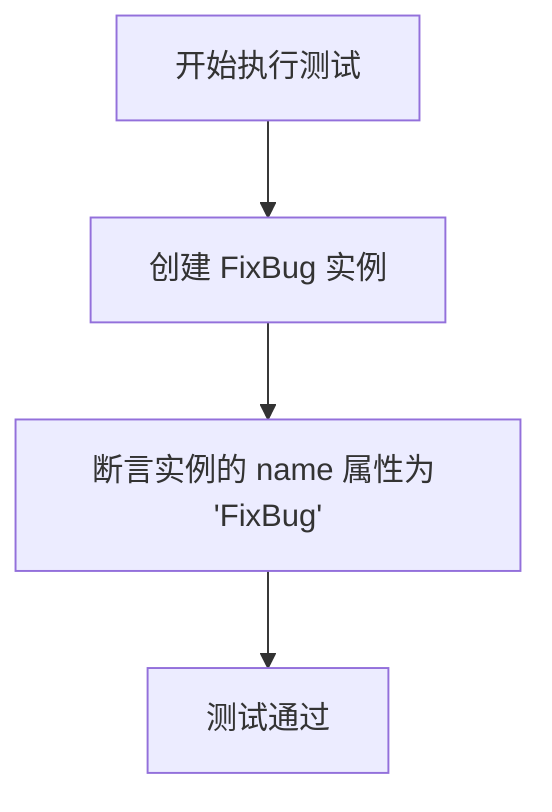
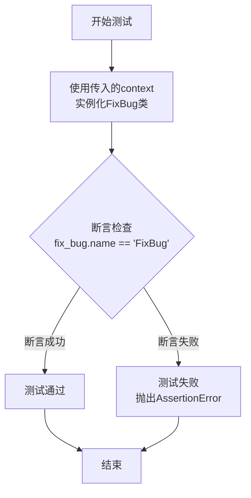

# `.\MetaGPT\tests\metagpt\actions\test_fix_bug.py` 详细设计文档

这是一个使用 pytest 框架编写的异步单元测试文件，用于测试 `FixBug` 类的实例化及其 `name` 属性的默认值。

## 整体流程



## 类结构

```
test_fix_bug.py
├── 全局函数: test_fix_bug
└── 导入的类: FixBug
```

## 全局变量及字段


### `fix_bug`
    
FixBug 类的实例，用于执行修复bug的操作

类型：`FixBug`
    


### `context`
    
测试上下文，包含测试所需的环境和配置信息

类型：`Context`
    


### `FixBug.name`
    
FixBug 类的名称标识，固定为 'FixBug'

类型：`str`
    
    

## 全局函数及方法


### `test_fix_bug`

这是一个使用 `pytest` 框架编写的异步单元测试函数，用于测试 `FixBug` 类的实例化及其 `name` 属性。

参数：

-  `context`：`<class 'metagpt.Context'>`，测试执行所需的上下文环境，通常包含配置、日志、工作空间等信息。

返回值：`None`，测试函数不返回任何值，其成功与否由 `assert` 语句和 `pytest` 框架判定。

#### 流程图



#### 带注释源码

```python
# 使用pytest的异步标记，表明这是一个异步测试函数
@pytest.mark.asyncio
async def test_fix_bug(context):
    # 使用传入的上下文对象实例化FixBug类
    fix_bug = FixBug(context=context)
    # 断言：检查新创建的FixBug实例的name属性是否等于字符串"FixBug"
    assert fix_bug.name == "FixBug"
    # 如果断言通过，函数正常结束，测试成功。
    # 如果断言失败，pytest会捕获AssertionError，标记测试为失败。
```


## 关键组件


### FixBug 类

一个用于修复代码缺陷的动作类，继承自 `Action` 基类，封装了识别和修复代码中错误的逻辑。

### pytest 测试框架

一个用于编写和运行单元测试的 Python 框架，在本代码中用于对 `FixBug` 类的功能进行异步测试。

### context 对象

一个上下文对象，用于在测试环境中为 `FixBug` 类提供必要的运行时信息和依赖。


## 问题及建议


### 已知问题

-   **测试用例过于简单**：当前的测试用例仅验证了`FixBug`动作的名称属性，没有对`FixBug`类的核心功能（如分析问题、生成修复代码）进行任何实质性测试。这无法保证代码修复逻辑的正确性。
-   **缺乏对`context`参数的验证**：测试用例依赖于传入的`context`参数，但未验证其内容是否有效或是否符合`FixBug`类的预期。如果`context`结构不正确，可能导致类初始化失败或运行时错误，但现有测试无法发现。
-   **异步测试未充分利用**：虽然使用了`@pytest.mark.asyncio`装饰器，但测试函数内部并未调用任何异步方法（如`FixBug`的`run`方法）。这未能测试类的异步执行流程。

### 优化建议

-   **补充核心功能测试**：应编写测试用例来验证`FixBug`类的`run`方法。可以模拟一个包含错误代码和错误信息的`context`，然后断言`run`方法返回的修复建议或代码是合理且符合预期的。
-   **增加`context`参数验证测试**：应添加测试来验证当传入无效、不完整或格式错误的`context`时，`FixBug`类的行为是否符合预期（例如，是否抛出恰当的异常）。
-   **完善异步行为测试**：确保测试用例调用`FixBug`实例的异步方法（如`run`），以验证其异步交互和协程处理逻辑是否正确。
-   **考虑增加集成测试**：除了单元测试，可以考虑编写集成测试，将`FixBug`动作与相关的`Action`、`Role`或`Environment`组件结合起来测试，以确保在更真实的场景下能协同工作。


## 其它


### 设计目标与约束

本代码是一个针对 `FixBug` 类的单元测试。其核心设计目标是验证 `FixBug` 类在给定上下文 (`context`) 下能够被正确实例化，并且其 `name` 属性被正确初始化为 `"FixBug"`。主要约束包括：
1.  必须使用 `pytest` 框架进行异步测试。
2.  测试依赖于外部提供的 `context` 测试夹具 (`fixture`)。
3.  测试范围仅限于类的初始化和基本属性验证，不涉及 `FixBug` 类的核心业务逻辑（如实际的 bug 修复过程）。

### 错误处理与异常设计

本测试代码本身不包含复杂的业务逻辑，因此其错误处理主要围绕测试断言和测试框架：
1.  **断言失败**：如果 `fix_bug.name` 的值不等于 `"FixBug"`，`assert` 语句将引发 `AssertionError`，导致测试用例失败。这是测试的主要验证机制。
2.  **依赖注入失败**：如果 `pytest` 框架无法成功注入或找到所需的 `context` 夹具，测试将在执行前因依赖解析失败而报错。
3.  **异步执行异常**：测试函数被标记为 `@pytest.mark.asyncio`，如果 `FixBug` 的初始化过程（尽管本例中看似同步）或任何未来添加的异步操作抛出未处理的异常，测试将失败。

### 数据流与状态机

本测试用例的数据流非常简单，不涉及复杂的状态转换：
1.  **输入**：测试的唯一输入是 `context` 对象，它作为 `pytest` 夹具被注入到测试函数中。该 `context` 的具体结构和内容由测试环境定义。
2.  **处理**：
    a. 使用输入的 `context` 实例化 `FixBug` 类。
    b. 读取新创建的 `fix_bug` 实例的 `name` 属性。
3.  **验证/输出**：将读取到的 `name` 属性值与预期值 `"FixBug"` 进行比较。测试的成功与失败即是其输出。

### 外部依赖与接口契约

1.  **外部依赖**：
    *   `pytest`：整个测试框架，提供测试运行、夹具管理、断言等功能。
    *   `pytest-asyncio`（通过 `@pytest.mark.asyncio` 推断）：用于支持异步测试函数的执行。
    *   `metagpt.actions.fix_bug.FixBug`：被测试的目标类。测试代码依赖于其公开的构造函数（接受 `context` 参数）和 `name` 实例属性。
    *   `context` 夹具：一个未在代码中定义但由测试套件其他部分提供的 `pytest` 夹具。测试代码依赖于其存在并能提供 `FixBug` 类初始化所需的上下文数据。

2.  **接口契约**：
    *   与 `FixBug` 类的契约：测试假设 `FixBug(context)` 构造函数可以成功调用，且创建的实例具有一个可读的字符串类型 `name` 属性，其值为 `"FixBug"`。
    *   与测试框架的契约：测试函数遵循 `pytest` 的命名约定（以 `test_` 开头），并正确使用 `@pytest.mark.asyncio` 装饰器来声明其为异步测试。它声明了一个参数 `context`，`pytest` 负责解析并注入对应的夹具值。

### 测试策略与覆盖范围

1.  **测试策略**：这是一个**单元测试**，专注于隔离地测试 `FixBug` 类的一个最小功能单元——其初始化和属性设置。它使用依赖注入（通过 `context` 夹具）来模拟类所需的运行环境。
2.  **覆盖范围**：
    *   **正面测试**：验证在提供有效 `context` 的情况下，类能按预期初始化。
    *   **当前覆盖的方面**：构造函数的调用、`name` 属性的默认值。
    *   **未覆盖的方面**：`FixBug` 类的核心方法（如 `run` 或 `fix` 方法）的逻辑、`context` 参数为无效或边界值时的行为、`name` 属性是否可写或其他属性状态。这些需要额外的测试用例来完成。

### 环境与配置

1.  **执行环境**：测试需要在安装了 `pytest`, `pytest-asyncio` 以及 `metagpt` 包的 Python 环境中运行。
2.  **配置**：测试文件本身没有显式配置。`pytest` 的运行配置（如夹具定义、插件启用、路径设置等）通常位于项目根目录的 `conftest.py` 文件或 `pytest.ini`/`pyproject.toml` 配置文件中。特别是 `context` 夹具的定义位置，对理解测试的完整上下文至关重要。

    