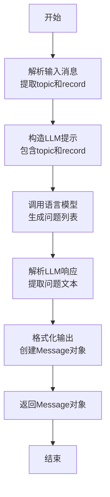

# `.\MetaGPT\tests\metagpt\actions\test_generate_questions.py` 详细设计文档

这是一个使用 pytest 框架编写的异步单元测试文件，用于测试 `GenerateQuestions` 动作（Action）的功能。该动作的核心功能是接收一段包含主题和讨论记录的文本，并生成相关的问题列表。测试用例验证了动作执行后返回的响应内容中是否包含预期的结构（如 'Questions' 标题和编号列表）。

## 整体流程

```mermaid
graph TD
    A[开始执行测试] --> B[创建 GenerateQuestions 动作实例]
    B --> C[调用 action.run(msg) 异步执行]
    C --> D{动作内部处理: 解析输入并生成问题}
    D --> E[返回 ActionOutput 对象 rsp]
    E --> F[记录 rsp.content 到日志]
    F --> G{断言验证: rsp.content 包含 'Questions' 和 '1.'}
    G -- 通过 --> H[测试成功]
    G -- 失败 --> I[测试失败]
```

## 类结构

```
测试文件 (test_generate_questions.py)
├── 全局变量 msg (测试输入数据)
├── 全局函数 test_generate_questions (主测试函数)
└── 外部依赖
    ├── pytest (测试框架)
    ├── metagpt.actions.generate_questions.GenerateQuestions (被测类)
    └── metagpt.logs.logger (日志工具)
```

## 全局变量及字段


### `msg`
    
一个包含主题和记录的字符串，用作测试中 GenerateQuestions 动作的输入数据。

类型：`str`
    


### `GenerateQuestions.该类的字段定义在 metagpt.actions.generate_questions 模块中，本测试文件未直接展示。`
    
GenerateQuestions 类的具体字段定义在其源模块中，本测试文件未直接导入或展示，因此无法在此处提供详细信息。

类型：`N/A`
    
    

## 全局函数及方法

### `test_generate_questions`

这是一个使用 `pytest` 框架编写的异步测试函数，用于测试 `GenerateQuestions` 动作类的 `run` 方法。它模拟给定一个包含主题和讨论记录的输入消息，验证 `GenerateQuestions` 能否正确生成包含问题列表的响应。

参数：

- `context`：`metagpt.Context` 类型，测试执行所需的上下文环境，通常包含配置、角色、内存等信息。

返回值：`None`，测试函数不直接返回值，而是通过断言（`assert`）来验证测试结果。

#### 流程图

```mermaid
flowchart TD
    A[开始测试] --> B[创建GenerateQuestions动作实例]
    B --> C[调用action.run(msg)异步执行]
    C --> D[获取响应rsp]
    D --> E[记录响应内容到日志]
    E --> F{断言验证}
    F -->|验证通过| G[测试成功]
    F -->|验证失败| H[测试失败]
```

#### 带注释源码

```python
#!/usr/bin/env python
# -*- coding: utf-8 -*-
"""
@Time    : 2023/9/13 00:26
@Author  : fisherdeng
@File    : test_generate_questions.py
"""
import pytest  # 导入pytest测试框架

from metagpt.actions.generate_questions import GenerateQuestions  # 导入要测试的动作类
from metagpt.logs import logger  # 导入日志模块

# 定义一个测试用的输入消息，包含主题和讨论记录
msg = """
## topic
如何做一个生日蛋糕

## record
我认为应该先准备好材料，然后再开始做蛋糕。
"""

# 使用pytest装饰器标记此函数为异步测试
@pytest.mark.asyncio
async def test_generate_questions(context):  # 定义异步测试函数，接收context参数
    action = GenerateQuestions(context=context)  # 使用传入的context创建GenerateQuestions动作实例
    rsp = await action.run(msg)  # 异步调用动作的run方法，传入测试消息，并等待响应
    logger.info(f"{rsp.content=}")  # 使用日志记录响应对象的内容，便于调试

    # 断言：验证响应内容中包含预期的关键词和格式
    assert "Questions" in rsp.content  # 检查响应内容中是否包含"Questions"字符串
    assert "1." in rsp.content  # 检查响应内容中是否包含列表序号"1."，表明生成了问题列表
```

### `GenerateQuestions.run`

该方法根据给定的消息内容，生成一系列相关的问题。它首先解析输入消息以提取主题和讨论记录，然后基于这些信息构造一个提示，通过语言模型生成问题列表，最后将生成的问题格式化为结构化的输出。

参数：

- `self`：`GenerateQuestions`，当前`GenerateQuestions`类的实例
- `msg`：`str`，包含主题和讨论记录的输入消息文本

返回值：`Message`，一个包含生成问题内容的`Message`对象

#### 流程图



#### 带注释源码

```python
async def run(self, msg: str) -> Message:
    """
    异步执行方法，根据输入消息生成问题。

    该方法解析输入消息，提取主题和记录，然后使用语言模型生成相关问题，
    最后将结果封装成Message对象返回。

    Args:
        msg (str): 包含主题和记录的输入消息文本

    Returns:
        Message: 包含生成问题内容的Message对象
    """
    # 解析输入消息，提取主题和记录部分
    topic, record = self._parse(msg)
    
    # 构造提示词，指导语言模型基于主题和记录生成问题
    prompt = self._build_prompt(topic, record)
    
    # 调用语言模型生成问题列表
    rsp = await self._aask(prompt)
    
    # 解析语言模型的响应，提取生成的问题文本
    questions = self._parse_questions(rsp)
    
    # 将生成的问题格式化为结构化的输出内容
    content = self._format_output(questions)
    
    # 创建并返回包含生成问题的Message对象
    return Message(content=content, role=self.profile)
```

## 关键组件


### GenerateQuestions 类

一个用于根据给定主题和记录生成相关问题的动作类，是智能体工作流中的关键组件。

### 异步执行流程

通过 `run` 方法异步执行，接收包含主题和记录的输入消息，处理后返回包含生成问题列表的响应。

### 测试框架与验证

使用 `pytest` 框架进行异步单元测试，验证 `GenerateQuestions` 动作的核心功能是否按预期生成结构化的问题列表。


## 问题及建议


### 已知问题

-   **测试用例过于简单且脆弱**：当前的测试用例仅验证了返回的字符串中是否包含“Questions”和“1.”。这种断言过于宽泛，无法有效验证`GenerateQuestions`动作的核心功能（即生成高质量、相关的问题列表）。只要返回的字符串包含这两个子串，测试就会通过，这可能导致即使功能出现严重退化（例如，返回格式错误或内容不相关），测试也无法发现。
-   **缺乏对输出格式和内容的精确验证**：测试没有验证生成的问题列表的格式是否正确（例如，是否为有序列表），也没有验证问题的内容是否与输入的主题“如何做一个生日蛋糕”相关且具有逻辑性。这使得测试的置信度很低。
-   **测试数据硬编码在测试文件中**：测试数据`msg`直接以字符串形式写在测试文件里。如果未来需要测试多个场景或数据驱动测试，维护和扩展会变得困难。
-   **依赖外部系统状态**：测试用例`async def test_generate_questions(context)`依赖于一个外部的`context` fixture。测试文档中没有明确说明这个`context`的构成和预期状态，这可能导致测试在特定环境下（如缺少某些配置）不可靠或难以理解。
-   **未测试异常和边界情况**：测试只覆盖了正常的执行路径。没有对`GenerateQuestions.run`方法可能出现的异常情况（如输入为空、格式错误）进行测试，也没有测试其在边界条件（如极长的输入）下的行为。

### 优化建议

-   **增强测试断言**：重构测试，使用更精确的断言来验证`GenerateQuestions`动作的输出。例如：
    -   使用正则表达式验证返回内容符合预期的Markdown列表格式（如`^\s*\d+\.\s+.+`）。
    -   解析返回的内容，提取问题列表，并断言列表长度大于0。
    -   可选地，对问题内容进行关键词匹配（如“材料”、“步骤”、“烤箱”等与主题相关的词），以验证问题的相关性。
-   **采用参数化测试**：使用`@pytest.mark.parametrize`将测试数据参数化。可以定义多个不同的`msg`输入（如不同主题、不同格式的记录），以验证动作在不同输入下的鲁棒性和输出一致性。这能将测试数据与测试逻辑分离，提高可维护性。
-   **明确并模拟测试依赖**：在测试文件或相关的conftest.py中，清晰地定义`context` fixture的构成，确保它提供了`GenerateQuestions`动作运行所需的最小、稳定的依赖环境（如必要的配置、角色信息等）。理想情况下，应使用模拟（Mock）对象来替代真实的外部服务（如LLM调用），使测试快速、稳定且不依赖网络。
-   **补充异常和边界测试**：添加新的测试用例，专门测试`GenerateQuestions.run`方法在异常输入下的行为。例如，测试传入`None`、空字符串、或格式严重错误的`msg`时，方法是否会抛出预期的异常或返回合理的错误指示。
-   **引入黄金文件测试或快照测试**：对于生成式AI的输出，其内容可能变化但格式和核心语义应稳定。可以考虑将一次运行得到的、经过人工验证的“好”的输出保存为“黄金文件”（golden file），在测试中与之进行对比（允许一定程度的差异，如使用diff工具或语义相似度比较）。或者使用pytest的快照测试插件，自动捕获并对比输出。


## 其它


### 设计目标与约束

本代码是一个针对 `GenerateQuestions` 类的单元测试。其主要设计目标是验证 `GenerateQuestions` 类的 `run` 方法能够正确接收输入消息，并生成包含特定格式（如“Questions”标题和编号列表）的输出。约束包括：必须使用 `pytest` 框架和 `asyncio` 进行异步测试；测试依赖于外部定义的 `context` 夹具；测试断言基于输出内容的字符串匹配，而非结构化数据验证。

### 错误处理与异常设计

当前测试代码本身不包含显式的错误处理逻辑。测试的成功与否完全由 `pytest` 框架通过 `assert` 语句来判定。如果 `action.run(msg)` 调用抛出异常（例如，由于 `GenerateQuestions` 类内部错误、网络问题或 `context` 配置不当），测试将失败，`pytest` 会报告相应的异常堆栈信息。这是一种典型的“让测试失败”的策略，依赖测试框架来捕获和报告错误。测试未包含对特定异常类型的捕获或自定义的错误恢复流程。

### 数据流与状态机

数据流清晰且线性：
1.  **输入**：硬编码的字符串 `msg`，包含“## topic”和“## record”部分。
2.  **处理**：`msg` 被传递给 `GenerateQuestions` 实例的 `run` 方法。
3.  **输出**：`run` 方法返回一个响应对象 `rsp`，测试代码检查其 `content` 属性。
4.  **验证**：通过两个 `assert` 语句验证 `rsp.content` 中是否包含“Questions”子字符串和“1.”子字符串，以此判断问题生成功能是否按预期工作。
本测试不涉及复杂的状态转换，是一个无状态的、一次性的函数调用验证。

### 外部依赖与接口契约

1.  **`pytest` 框架**：用于组织和运行测试。依赖 `@pytest.mark.asyncio` 装饰器来处理异步测试函数。
2.  **`context` 夹具 (Fixture)**：测试函数接收一个名为 `context` 的参数，这预期是一个由 `pytest` 夹具系统提供的对象。该 `context` 的具体结构和内容未在测试代码中定义，是测试环境的外部依赖，用于初始化 `GenerateQuestions` 动作。
3.  **`GenerateQuestions` 类**：来自 `metagpt.actions.generate_questions` 模块。测试与其 `run` 方法存在契约：该方法应能异步接收一个字符串消息，并返回一个包含 `content` 属性（字符串类型）的响应对象。
4.  **`metagpt.logs.logger`**：用于记录测试过程中的信息（如生成的 `rsp.content`），属于可观察性依赖，不影响测试逻辑的核心断言。

    