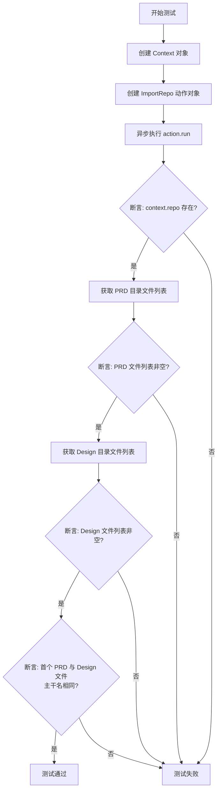
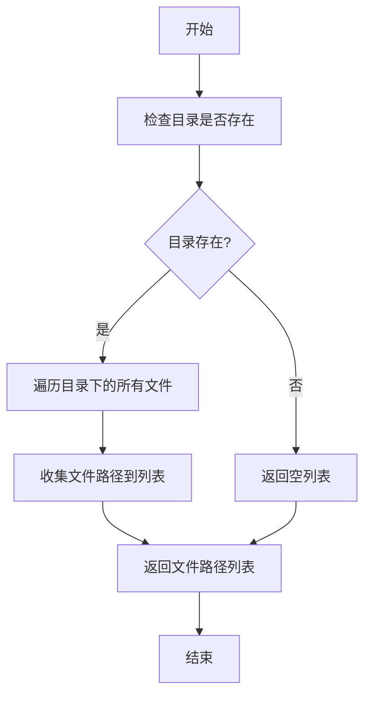
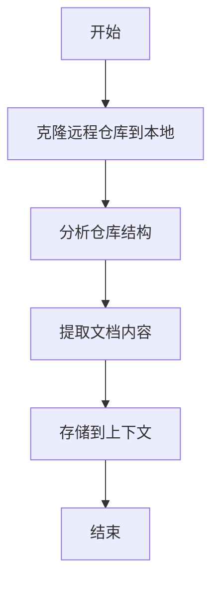

# `.\MetaGPT\tests\metagpt\actions\test_import_repo.py` 详细设计文档

该代码是一个使用 pytest 框架编写的异步单元测试，用于测试 `ImportRepo` 动作的功能。其核心功能是：给定一个远程 Git 仓库的 URL，测试 `ImportRepo` 动作能否成功克隆该仓库，并验证克隆后仓库的文档目录结构是否符合预期（即 PRD 文档和系统设计文档的根文件名一致）。

## 整体流程

```mermaid
graph TD
    A[开始测试] --> B[设置测试参数 repo_path]
    B --> C[创建 Context 对象]
    C --> D[创建 ImportRepo 动作对象]
    D --> E[异步执行 ImportRepo.run()]
    E --> F{断言: context.repo 存在?}
    F -- 是 --> G[列出 PRD 文档目录文件]
    G --> H{断言: PRD 文件列表非空?}
    H -- 是 --> I[列出系统设计文档目录文件]
    I --> J{断言: 设计文件列表非空?}
    J -- 是 --> K{断言: PRD 与设计文件根名相同?}
    K -- 是 --> L[测试通过]
    F -- 否 --> M[测试失败]
    H -- 否 --> M
    J -- 否 --> M
    K -- 否 --> M
```

## 类结构

```
测试文件 (test_import_repo.py)
├── 测试函数: test_import_repo
├── 被测类: ImportRepo (来自 metagpt.actions.import_repo)
├── 上下文类: Context (来自 metagpt.context)
└── 工具函数: list_files (来自 metagpt.utils.common)
```

## 全局变量及字段


### `ImportRepo.repo_path`
    
存储要导入的Git仓库的远程URL或本地路径。

类型：`str`
    


### `ImportRepo.context`
    
存储代码执行上下文，用于传递和共享导入仓库后的结果数据。

类型：`Context`
    


### `Context.repo`
    
存储导入的仓库对象，包含仓库的文档、代码结构等信息。

类型：`Repository`
    
    

## 全局函数及方法


### `test_import_repo`

这是一个使用 `pytest` 框架编写的异步测试函数，用于测试 `ImportRepo` 动作的功能。该测试会克隆指定的 Git 仓库，并验证 `ImportRepo` 动作执行后，在上下文（`Context`）中生成的仓库对象（`repo`）及其内部文档目录（PRD 和系统设计）是否被正确创建且包含文件。

参数：

-  `repo_path`：`str`，要测试的 Git 仓库的远程 URL 地址。

返回值：`None`，测试函数通常不显式返回值，其成功与否由 `assert` 语句决定。

#### 流程图



#### 带注释源码

```python
# 使用 pytest 的异步支持和参数化装饰器
@pytest.mark.asyncio
@pytest.mark.parametrize(
    "repo_path", # 参数化测试，为 `repo_path` 参数提供多个测试值
    [
        "https://github.com/spec-first/connexion.git", # 测试用例1：connexion 仓库
        # "https://github.com/geekan/MetaGPT.git" # 被注释的测试用例2
    ],
)
@pytest.mark.skip # 跳过此测试，通常用于临时禁用或标记为待实现
async def test_import_repo(repo_path): # 定义异步测试函数，接收参数化的 repo_path
    # 1. 创建运行上下文
    context = Context()
    
    # 2. 实例化要测试的 ImportRepo 动作，传入仓库路径和上下文
    action = ImportRepo(repo_path=repo_path, context=context)
    
    # 3. 异步执行动作的核心逻辑（例如：克隆仓库、解析结构）
    await action.run()
    
    # 4. 验证动作执行后，上下文中是否成功创建了 repo 对象
    assert context.repo
    
    # 5. 获取仓库中文档目录 `docs.prd` 下的文件列表
    prd = list_files(context.repo.docs.prd.workdir)
    # 验证 PRD 目录下至少有一个文件
    assert prd
    
    # 6. 获取仓库中文档目录 `docs.system_design` 下的文件列表
    design = list_files(context.repo.docs.system_design.workdir)
    # 验证系统设计目录下至少有一个文件
    assert design
    
    # 7. 验证第一个 PRD 文件和第一个设计文件的主干名（不含扩展名）相同
    # 这通常用于检查文档的对应关系
    assert prd[0].stem == design[0].stem
```


### `list_files`

`list_files` 是一个全局函数，用于列出指定目录下的所有文件路径，并返回一个包含这些文件路径的列表。

参数：

- `directory`：`str`，要列出文件的目录路径。

返回值：`List[Path]`，返回一个包含指定目录下所有文件路径的列表。

#### 流程图



#### 带注释源码

```python
def list_files(directory: str) -> List[Path]:
    """
    列出指定目录下的所有文件路径。

    参数:
        directory (str): 要列出文件的目录路径。

    返回值:
        List[Path]: 包含指定目录下所有文件路径的列表。
    """
    # 将目录路径转换为Path对象
    dir_path = Path(directory)
    
    # 检查目录是否存在
    if not dir_path.exists():
        # 如果目录不存在，返回空列表
        return []
    
    # 使用glob模式匹配所有文件，并返回文件路径列表
    return list(dir_path.glob('*'))
```

### `ImportRepo.run`

该方法用于执行仓库导入的核心流程，包括克隆远程仓库到本地、分析仓库结构、提取文档内容并存储到上下文中。

参数：
- `self`：`ImportRepo`，`ImportRepo`类的实例，包含仓库路径和上下文等信息。

返回值：`None`，无返回值，但会更新上下文中的`repo`字段。

#### 流程图



#### 带注释源码

```python
async def run(self):
    """
    执行仓库导入的核心流程。
    1. 克隆远程仓库到本地。
    2. 分析仓库结构。
    3. 提取文档内容。
    4. 存储到上下文。
    """
    # 克隆远程仓库到本地
    repo = await self._clone_repo()
    
    # 分析仓库结构
    structure = await self._analyze_structure(repo)
    
    # 提取文档内容
    docs = await self._extract_docs(structure)
    
    # 存储到上下文
    self.context.repo = docs
```

## 关键组件


### ImportRepo 动作

一个用于从远程仓库（如GitHub）导入代码仓库，并自动生成产品需求文档（PRD）和系统设计文档的自动化动作。

### Context 上下文

一个用于存储和管理项目运行时状态、数据和依赖的上下文容器，在此代码中用于存储导入的仓库信息。

### 文件列表工具函数

一个用于列出指定目录下所有文件的工具函数，用于验证导入仓库后生成的文档文件是否存在。

### 测试框架与参数化

使用pytest框架进行异步测试，并通过参数化支持测试多个不同的远程仓库路径，提高测试的覆盖率和灵活性。

### 异步执行与惰性加载

通过异步函数（async/await）执行仓库导入和文档生成任务，可能涉及网络请求和文件I/O的惰性加载，以提高执行效率。


## 问题及建议


### 已知问题

-   **测试用例被跳过**：测试函数 `test_import_repo` 被 `@pytest.mark.skip` 装饰器标记，导致该测试在常规执行时会被跳过，无法验证 `ImportRepo` 功能的有效性。
-   **硬编码的测试数据**：测试参数 `repo_path` 被硬编码为特定的 Git 仓库 URL。这使得测试缺乏灵活性，难以扩展或用于测试其他仓库。
-   **依赖外部网络服务**：测试用例依赖于从 GitHub 克隆远程仓库，这引入了外部依赖。网络问题、仓库不可用或访问限制都可能导致测试失败，影响测试的稳定性和可重复性。
-   **缺乏模拟（Mocking）**：测试直接调用 `ImportRepo` 的 `run` 方法，没有对可能的外部调用（如 Git 克隆操作、文件系统操作）进行模拟。这使得测试更偏向集成测试而非单元测试，且执行速度较慢。
-   **断言条件可能过于严格**：断言 `prd[0].stem == design[0].stem` 假设 PRD 和系统设计文档目录下的第一个文件具有相同的名称（不含扩展名）。如果仓库的文档结构不满足此假设，测试将失败，这可能并非代码功能问题。
-   **缺少错误处理验证**：测试没有验证 `ImportRepo` 在遇到无效仓库路径、网络错误或其他异常情况时的行为（例如，是否抛出预期的异常）。

### 优化建议

-   **移除或条件化跳过标记**：移除 `@pytest.mark.skip` 装饰器，或将其替换为 `@pytest.mark.skipif` 并基于环境变量（如 `SKIP_NETWORK_TESTS`）决定是否跳过，以便在需要时运行测试。
-   **参数化与使用测试夹具（Fixture）**：考虑使用 `pytest` 的 `fixture` 来提供测试仓库路径，或者从配置文件、环境变量中读取，以提高灵活性。可以为不同的测试场景（如有效URL、无效URL、本地路径）创建不同的测试用例。
-   **引入模拟和存根**：使用 `unittest.mock` 或 `pytest-mock` 来模拟 `ImportRepo` 动作中的 `git.Repo.clone_from` 调用以及相关的文件系统操作。这将把测试转变为更快速、更稳定的单元测试，并允许测试各种边界情况。
-   **分离关注点**：将测试分解为多个更小的测试函数，分别测试 `ImportRepo` 的不同方面，例如：成功克隆、上下文更新、文档目录结构验证、错误处理等。
-   **改进断言**：将断言 `prd[0].stem == design[0].stem` 替换为更健壮的检查，例如验证两个目录都非空，或者检查它们是否包含预期的文件类型。或者，如果此断言是业务逻辑的核心，则应确保测试仓库（或模拟数据）明确满足此条件。
-   **增加错误处理测试**：添加新的测试用例，使用 `pytest.raises` 来验证当提供无效的 `repo_path` 或发生网络错误时，`ImportRepo.run()` 是否会抛出预期的异常。
-   **考虑使用临时目录**：在测试中，使用 `tempfile.TemporaryDirectory` 作为代码的工作目录，以确保测试不会在本地文件系统中留下残余文件，并使测试更加隔离。
-   **添加集成测试标签**：如果决定保留当前具有外部依赖的测试形式，应为其添加一个特定的标记（如 `@pytest.mark.integration` 或 `@pytest.mark.network`），以便与纯单元测试分开运行。


## 其它


### 设计目标与约束

本代码是一个针对 `ImportRepo` 动作的单元测试。其主要设计目标是验证 `ImportRepo` 动作能够正确地从指定的 Git 仓库 URL 导入代码，并在 `Context` 对象中正确构建仓库的文档结构（特别是 PRD 和系统设计文档目录）。约束包括：1) 测试依赖于外部网络服务（GitHub）和 `git` 命令；2) 测试执行时间受网络和仓库大小影响；3) 为避免对远程仓库造成影响或消耗过多资源，测试被标记为 `@pytest.mark.skip`，默认不执行。

### 错误处理与异常设计

测试本身不包含复杂的业务逻辑错误处理，主要依赖 `pytest` 框架的断言机制。如果 `ImportRepo` 动作的 `run` 方法抛出异常（如网络错误、Git 操作失败、路径错误），测试将失败。测试通过 `assert` 语句验证 `context.repo` 对象的存在性以及 `prd` 和 `design` 目录的非空性，若验证失败则测试不通过。测试被 `@pytest.mark.skip` 装饰，这是一种主动的“优雅跳过”机制，用于控制测试的执行。

### 数据流与状态机

1.  **初始状态**：测试函数开始，传入参数 `repo_path`（一个 Git 仓库 URL）。
2.  **状态转换 1 (创建上下文与动作)**：创建 `Context` 对象和 `ImportRepo` 动作实例，将 `repo_path` 和 `context` 注入动作。
3.  **状态转换 2 (执行导入)**：异步调用 `action.run()`。此步骤触发复杂的数据流：`ImportRepo` 内部会克隆远程仓库到本地临时目录，解析仓库结构，并在 `context.repo` 中创建对应的文档目录对象。
4.  **状态转换 3 (验证结果)**：
    *   验证 `context.repo` 不为 `None`。
    *   使用 `list_files` 获取 `context.repo.docs.prd` 和 `context.repo.docs.system_design` 目录下的文件列表。
    *   验证这两个文件列表均非空。
    *   验证两个列表中的第一个文件具有相同的主干名（`stem`），这暗示了 PRD 与设计文档可能基于相同的需求项生成。
5.  **结束状态**：所有断言通过，测试成功；任一断言失败，测试失败。

### 外部依赖与接口契约

1.  **`pytest` 框架**：用于测试发现、执行、参数化和跳过。
2.  **`metagpt.actions.import_repo.ImportRepo` 类**：被测动作。测试假设其 `__init__` 方法接受 `repo_path` 和 `context` 参数，并且其 `run` 方法会异步执行仓库导入逻辑，填充 `context.repo`。
3.  **`metagpt.context.Context` 类**：用于存储运行时状态，特别是导入后的 `repo` 对象。
4.  **`metagpt.utils.common.list_files` 函数**：用于列出指定目录下的文件。测试假设其返回一个 `Path` 对象列表。
5.  **外部服务 (GitHub)**：测试数据（`repo_path`）指向真实的 GitHub 仓库，测试执行时需要网络连接以完成 `git clone`。
6.  **系统命令 `git`**：`ImportRepo` 动作的实现内部需要调用 `git` 命令行工具来克隆仓库。

### 测试策略与用例设计

*   **策略**：这是一个集成测试，因为它测试了 `ImportRepo` 动作与 `Context`、`list_files` 工具以及外部 Git 服务的协同工作。它侧重于验证功能的端到端正确性，而非内部逻辑分支。
*   **用例设计**：
    *   **正向用例**：使用一个已知包含特定文档结构的公开仓库 URL（如 `"https://github.com/spec-first/connexion.git"`）进行测试，验证整个导入和结构解析流程。
    *   **参数化**：使用 `@pytest.mark.parametrize` 支持测试多个仓库，但目前第二个用例被注释掉。
    *   **跳过机制**：通过 `@pytest.mark.skip` 装饰器，默认跳过此测试， likely due to its reliance on external resources and potential slowness. It can be explicitly run when needed.
    *   **断言点**：设计了多层次的断言：对象非空、目录非空、文件命名一致性，以增强测试的健壮性。

### 安全与合规考虑

1.  **代码来源**：测试克隆的是公开的、受信任的第三方代码仓库（如 `connexion`）。应确保在团队或生产环境中使用的仓库 URL 是经过审核的，避免引入恶意代码。
2.  **资源清理**：测试代码没有显式展示克隆到本地的临时仓库是如何被清理的。这依赖于 `ImportRepo` 动作或 `Context` 的析构逻辑。如果清理不当，可能导致临时目录累积，占用磁盘空间。这是一个潜在的优化点或技术债务。
3.  **网络依赖**：测试失败可能由网络问题引起，这并非业务逻辑错误，但会影响测试的稳定性和可靠性。`@pytest.mark.skip` 部分也是出于此考虑。

    