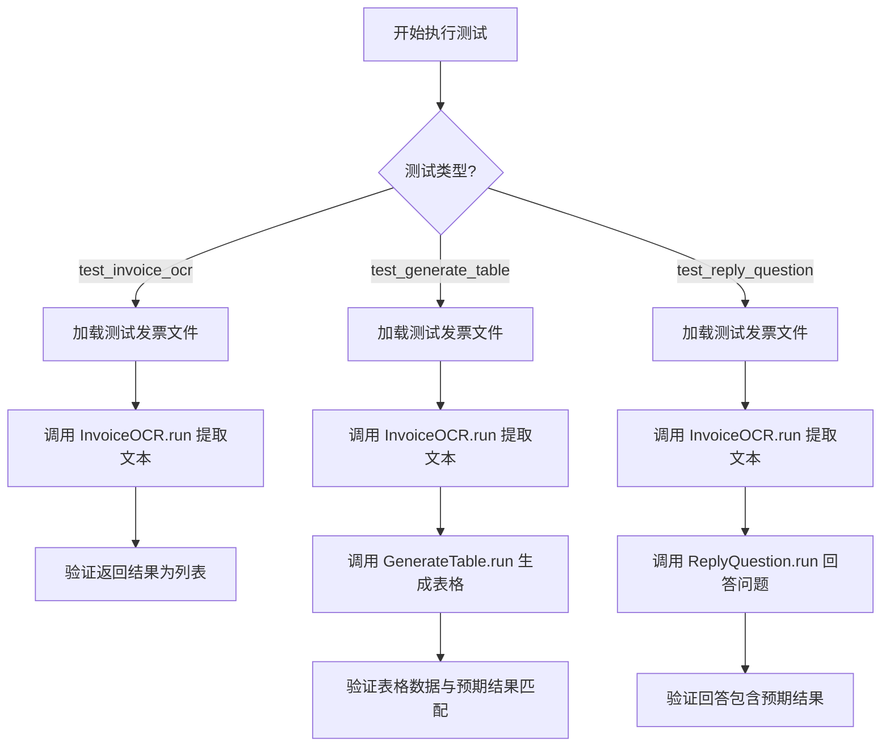
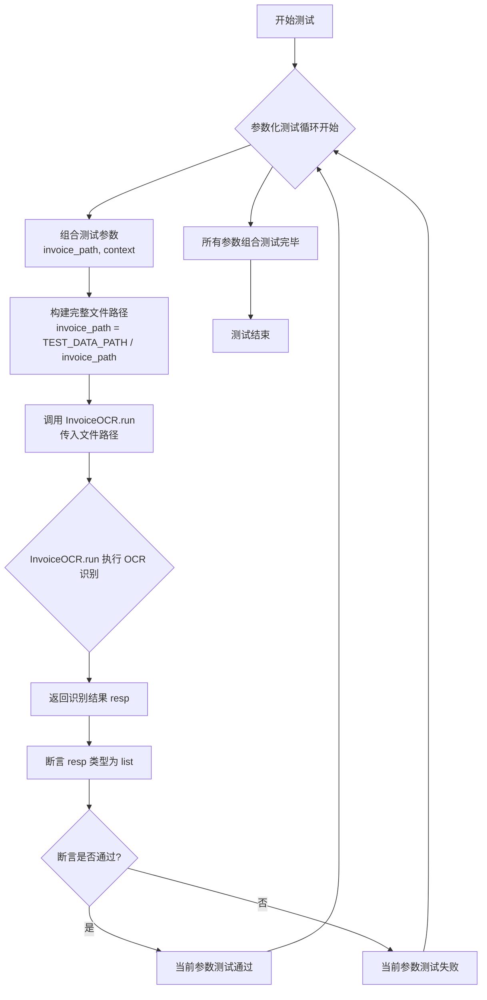
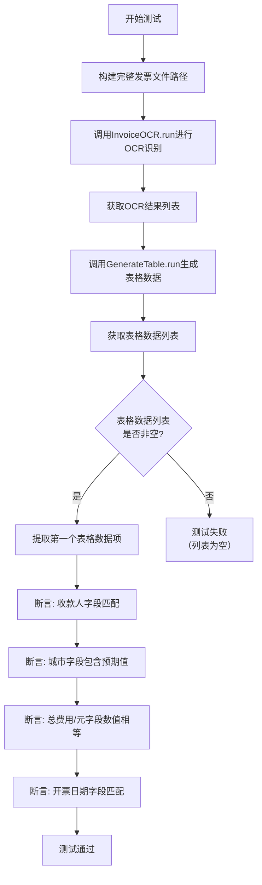
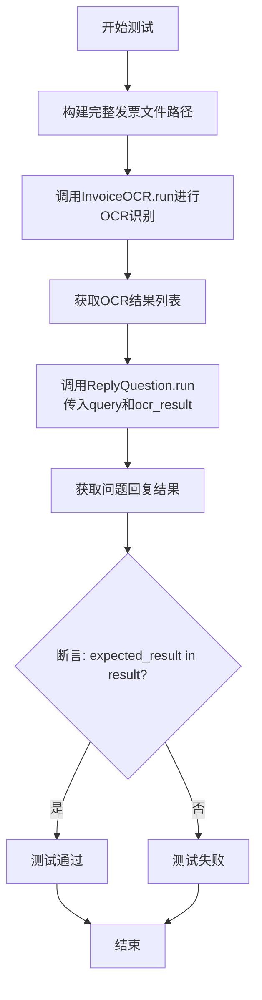
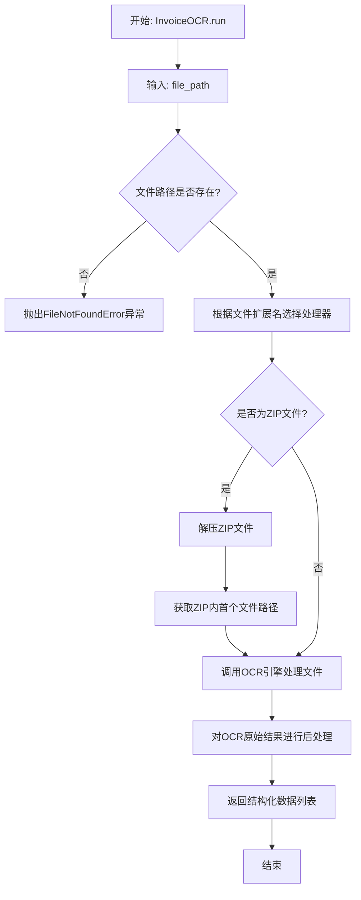
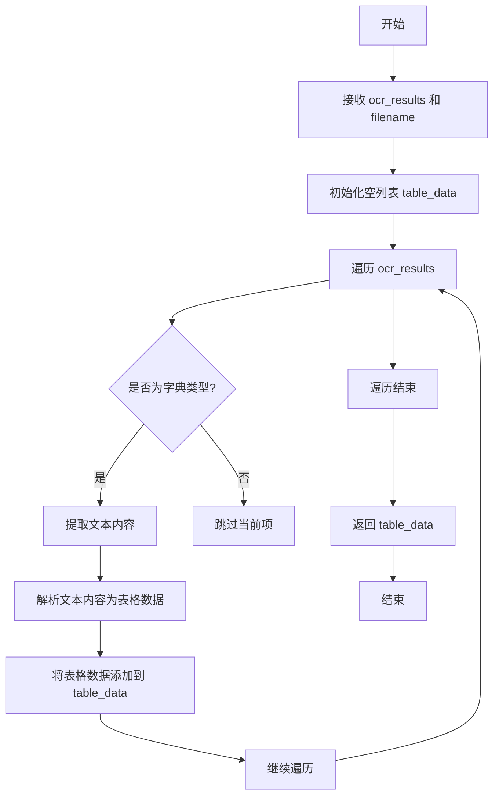
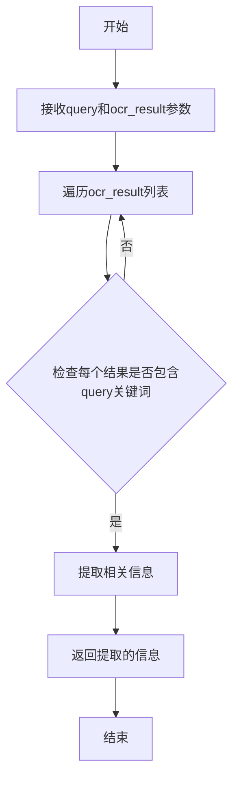

# `.\MetaGPT\tests\metagpt\actions\test_invoice_ocr.py` 详细设计文档

该文件是一个使用 pytest 框架编写的单元测试文件，用于测试 MetaGPT 项目中与发票 OCR（光学字符识别）相关的功能，包括从发票图像/PDF/ZIP 文件中提取文本、将提取结果转换为结构化表格数据，以及根据提取的文本回答特定问题。

## 整体流程



## 类结构

```
test_invoice_ocr.py (测试模块)
├── test_invoice_ocr (异步测试函数)
├── test_generate_table (异步测试函数)
└── test_reply_question (异步测试函数)
```

## 全局变量及字段


### `TEST_DATA_PATH`
    
指向测试数据根目录的路径常量，用于定位测试所需的发票文件。

类型：`Path`
    


    

## 全局函数及方法

### `test_invoice_ocr`

这是一个使用 `pytest` 框架编写的异步测试函数，用于测试 `InvoiceOCR` 类的 `run` 方法。它通过参数化测试，验证该方法对不同格式（如 JPG 和 ZIP）的发票文件进行 OCR 识别后，是否能正确返回一个列表类型的结果。

参数：
- `invoice_path`：`Path`，一个 `Path` 对象，表示相对于 `TEST_DATA_PATH` 的发票文件路径。
- `context`：`object`，测试上下文对象，通常由 `pytest` 框架提供，用于管理测试环境和依赖。

返回值：`None`，这是一个测试函数，其主要目的是通过断言（`assert`）来验证代码行为，不返回业务值。测试框架会根据断言结果判断测试是否通过。

#### 流程图



#### 带注释源码

```python
@pytest.mark.asyncio # 标记此测试函数为异步函数，以便 pytest-asyncio 插件能正确处理
@pytest.mark.parametrize( # 使用参数化测试，为同一个测试逻辑提供多组输入数据
    "invoice_path", # 参数化变量名
    [ # 参数化数据列表，每个元素代表一组测试数据
        Path("invoices/invoice-3.jpg"), # 第一组数据：JPG 格式发票路径
        Path("invoices/invoice-4.zip"), # 第二组数据：ZIP 格式发票路径
    ],
)
async def test_invoice_ocr(invoice_path: Path, context): # 异步测试函数定义
    # 将相对路径转换为绝对路径：拼接测试数据根目录和传入的相对路径
    invoice_path = TEST_DATA_PATH / invoice_path
    # 创建 InvoiceOCR 实例（传入测试上下文），并异步调用其 run 方法进行 OCR 识别
    resp = await InvoiceOCR(context=context).run(file_path=Path(invoice_path))
    # 断言：验证 OCR 识别返回的结果 `resp` 的数据类型是列表（list）
    assert isinstance(resp, list)
```

### `test_generate_table`

这是一个使用 pytest 编写的异步测试函数，用于测试 `GenerateTable` 类的功能。它通过加载指定的发票文件，使用 `InvoiceOCR` 进行光学字符识别（OCR），然后将 OCR 结果传递给 `GenerateTable` 以生成结构化的表格数据。最后，函数将生成的表格数据与预期结果进行断言比较，以验证表格生成功能的正确性。

参数：

- `invoice_path`：`Path`，发票文件的路径，用于指定要测试的发票文件。
- `expected_result`：`dict`，预期的结果字典，包含期望从生成的表格数据中提取的键值对，用于验证测试的正确性。

返回值：`None`，该测试函数不返回任何值，其目的是通过断言来验证功能。

#### 流程图



#### 带注释源码

```python
@pytest.mark.asyncio  # 标记此函数为异步测试函数
@pytest.mark.parametrize(  # 使用参数化测试，为测试函数提供多组输入数据
    ("invoice_path", "expected_result"),  # 定义两个参数：文件路径和预期结果
    [
        # 提供一组测试数据：PDF发票路径和对应的预期结果字典
        (Path("invoices/invoice-1.pdf"), {"收款人": "小明", "城市": "深圳", "总费用/元": 412.00, "开票日期": "2023年02月03日"}),
    ],
)
async def test_generate_table(invoice_path: Path, expected_result: dict):
    # 步骤1: 构建完整的测试文件路径
    invoice_path = TEST_DATA_PATH / invoice_path
    # 步骤2: 从路径中提取文件名
    filename = invoice_path.name
    # 步骤3: 调用OCR动作，识别发票文件内容，获取OCR结果列表
    ocr_result = await InvoiceOCR().run(file_path=Path(invoice_path))
    # 步骤4: 调用生成表格动作，将OCR结果和文件名作为输入，生成表格数据列表
    table_data = await GenerateTable().run(ocr_results=ocr_result, filename=filename)
    # 断言1: 验证返回的table_data是一个列表
    assert isinstance(table_data, list)
    # 步骤5: 从返回的列表（假设至少有一个元素）中取出第一个表格数据项（字典格式）
    table_data = table_data[0]
    # 断言2: 验证生成的表格数据中“收款人”字段的值与预期结果一致
    assert expected_result["收款人"] == table_data["收款人"]
    # 断言3: 验证预期结果中的“城市”字符串包含在生成的表格数据的“城市”字段值中
    assert expected_result["城市"] in table_data["城市"]
    # 断言4: 验证生成的表格数据中“总费用/元”字段的数值（转换为浮点数）与预期结果的数值相等
    assert float(expected_result["总费用/元"]) == float(table_data["总费用/元"])
    # 断言5: 验证生成的表格数据中“开票日期”字段的值与预期结果一致
    assert expected_result["开票日期"] == table_data["开票日期"]
```

### `test_reply_question`

该函数是一个异步的单元测试函数，用于测试 `ReplyQuestion` 类的 `run` 方法。它通过给定的发票文件路径和查询问题，验证 `ReplyQuestion` 能否从OCR结果中正确提取并返回预期的答案。

参数：
- `invoice_path`：`Path`，发票文件的路径。
- `query`：`dict`，查询的问题，以字典形式表示。
- `expected_result`：`str`，期望从OCR结果中提取的答案。

返回值：`None`，该函数是测试函数，不返回业务值，通过断言（`assert`）验证测试结果。

#### 流程图



#### 带注释源码

```python
@pytest.mark.asyncio  # 标记此函数为异步测试函数
@pytest.mark.parametrize(  # 使用参数化测试，为测试提供多组数据
    ("invoice_path", "query", "expected_result"),  # 参数名：文件路径、查询问题、期望结果
    [(Path("invoices/invoice-1.pdf"), "Invoicing date", "2023年02月03日")],  # 测试数据：使用invoice-1.pdf文件，查询“开票日期”，期望得到“2023年02月03日”
)
async def test_reply_question(invoice_path: Path, query: dict, expected_result: str):  # 定义异步测试函数，接收三个参数
    invoice_path = TEST_DATA_PATH / invoice_path  # 将相对路径与测试数据根路径组合，得到完整的绝对路径
    ocr_result = await InvoiceOCR().run(file_path=Path(invoice_path))  # 创建InvoiceOCR实例并运行，对指定发票文件进行OCR识别，获取结果列表
    result = await ReplyQuestion().run(query=query, ocr_result=ocr_result)  # 创建ReplyQuestion实例并运行，传入查询问题和OCR结果，获取答案
    assert expected_result in result  # 断言：期望的结果字符串应包含在返回的答案中
```

### `InvoiceOCR.run`

该方法执行发票OCR（光学字符识别）的核心流程，通过加载指定路径的发票文件（支持图片、PDF、ZIP等格式），调用OCR引擎提取文本信息，并对提取结果进行结构化处理，最终返回一个包含发票关键信息的列表。

参数：

- `file_path`：`Path`，发票文件的路径，支持常见格式如JPG、PDF、ZIP。

返回值：`list`，一个列表，其中每个元素代表从发票中提取出的一条结构化数据记录（通常是字典形式）。

#### 流程图



#### 带注释源码

```python
async def run(self, file_path: Path) -> list:
    """
    执行发票OCR处理的主方法。
    
    参数:
        file_path (Path): 指向发票文件的路径对象。
        
    返回:
        list: 包含从发票中提取的结构化信息的列表。
        
    异常:
        FileNotFoundError: 当指定的文件路径不存在时抛出。
    """
    # 1. 验证输入文件路径是否存在
    if not file_path.exists():
        raise FileNotFoundError(f"The file path {file_path} does not exist.")
    
    # 2. 根据文件扩展名分派到相应的处理逻辑
    # 注：实际代码中可能包含对.jpg, .png, .pdf, .zip等格式的判断和处理
    # 此处流程图展示了ZIP文件的处理分支作为示例
    if file_path.suffix.lower() == '.zip':
        # 处理ZIP压缩包：解压并获取内部文件
        extracted_file_path = self._extract_zip(file_path)
        ocr_raw_result = await self._call_ocr_engine(extracted_file_path)
    else:
        # 直接处理单个文件（如图片、PDF）
        ocr_raw_result = await self._call_ocr_engine(file_path)
    
    # 3. 对OCR引擎返回的原始文本进行后处理
    # 例如：文本清洗、关键字段（如收款人、日期、金额）的识别与提取
    structured_data = self._postprocess_ocr_result(ocr_raw_result)
    
    # 4. 返回结构化的数据列表
    return structured_data
```

### `GenerateTable.run`

该方法接收OCR识别结果和文件名，从中提取结构化表格数据，并返回一个包含表格数据的列表。

参数：

- `ocr_results`：`list`，OCR识别结果列表，包含从发票中提取的文本信息。
- `filename`：`str`，发票文件名，用于日志记录或数据标识。

返回值：`list`，包含提取的表格数据列表，每个元素为一个字典，代表一行表格数据。

#### 流程图



#### 带注释源码

```python
async def run(self, ocr_results: list, filename: str) -> list:
    """
    从OCR识别结果中提取表格数据。

    Args:
        ocr_results (list): OCR识别结果列表，包含从发票中提取的文本信息。
        filename (str): 发票文件名，用于日志记录或数据标识。

    Returns:
        list: 包含提取的表格数据列表，每个元素为一个字典，代表一行表格数据。
    """
    table_data = []  # 初始化空列表，用于存储表格数据
    for ocr_result in ocr_results:  # 遍历OCR识别结果
        if isinstance(ocr_result, dict):  # 检查当前项是否为字典类型
            text = ocr_result.get("text", "")  # 提取文本内容，默认为空字符串
            # 解析文本内容为表格数据（此处为示例逻辑，实际实现可能更复杂）
            parsed_data = self._parse_text_to_table(text)
            table_data.append(parsed_data)  # 将解析后的数据添加到列表
        else:
            # 如果当前项不是字典类型，跳过处理
            continue
    return table_data  # 返回提取的表格数据列表
```

### `ReplyQuestion.run`

该方法用于根据给定的发票OCR结果和查询问题，从OCR结果中提取并返回与查询相关的信息。

参数：

- `query`：`str`，用户提出的查询问题，例如“开票日期”
- `ocr_result`：`list`，发票OCR处理后的结果列表，包含发票的文本和位置信息

返回值：`str`，从OCR结果中提取的与查询相关的信息

#### 流程图



#### 带注释源码

```python
async def run(self, query: str, ocr_result: list) -> str:
    """
    根据查询问题和OCR结果，提取相关信息并返回。

    Args:
        query (str): 用户提出的查询问题。
        ocr_result (list): 发票OCR处理后的结果列表。

    Returns:
        str: 从OCR结果中提取的与查询相关的信息。
    """
    # 遍历OCR结果列表
    for idx, item in enumerate(ocr_result):
        # 检查当前结果是否包含查询关键词
        if query in item["text"]:
            # 提取相关信息
            result = ocr_result[idx + 1]["text"]
            return result
    # 如果未找到相关信息，返回空字符串
    return ""
```

## 关键组件


### InvoiceOCR

负责对发票图像或包含发票的压缩文件进行光学字符识别（OCR），提取其中的文本信息。

### GenerateTable

将OCR提取的文本信息进行结构化处理，生成表格数据，以便于后续的数据分析和查询。

### ReplyQuestion

基于OCR提取的文本信息，回答用户提出的关于发票内容的特定问题。


## 问题及建议


### 已知问题

-   **测试数据路径硬编码**：测试代码中直接使用了 `TEST_DATA_PATH` 常量来定位测试数据文件。虽然这本身不是错误，但它将测试与特定的项目目录结构耦合。如果项目结构发生变化或需要在不同环境中运行测试（例如，在CI/CD流水线中），可能需要调整路径或设置环境变量，增加了维护成本。
-   **测试用例覆盖不全面**：当前的测试用例仅针对少数几种发票格式（如 `.jpg`, `.zip`, `.pdf`）和特定查询进行了验证。对于OCR这种处理复杂、输入多样的场景，测试覆盖可能不足，例如缺少对损坏文件、超大文件、不支持的格式、模糊或倾斜图片、以及复杂表格布局的发票的测试。
-   **异步测试的潜在稳定性问题**：测试函数被标记为 `@pytest.mark.asyncio` 并使用了 `async/await`。虽然这是测试异步代码的正确方式，但如果 `InvoiceOCR`, `GenerateTable`, `ReplyQuestion` 等被测试的动作内部包含不稳定的网络调用（如调用外部OCR API）或未正确管理异步资源，可能导致测试间歇性失败（超时、网络错误），影响测试套件的可靠性。
-   **断言过于宽松**：在 `test_invoice_ocr` 测试中，仅断言返回值是 `list` 类型。这种断言非常弱，无法有效验证OCR功能是否成功执行并返回了有意义的、结构化的数据，降低了测试的价值。
-   **测试数据与逻辑耦合**：测试期望结果（如 `expected_result` 字典）被硬编码在测试参数中。当被测试的业务逻辑（如字段提取规则）或测试发票样本内容发生变化时，需要同步更新多个测试用例中的期望值，容易遗漏导致测试失败。

### 优化建议

-   **使用 pytest 的 fixtures 管理测试资源**：建议为 `TEST_DATA_PATH` 和通用的 `invoice_path` 处理逻辑创建 pytest fixture。例如，可以创建一个 `invoice_path_fixture`，它接收参数并返回完整的路径，这样可以在多个测试中复用，并集中管理路径解析逻辑，提高代码的整洁性和可维护性。
-   **扩充测试场景和用例**：建议增加更多的测试用例，以覆盖边界情况和异常流。例如：
    -   测试无效或不存在文件路径的处理。
    -   测试空文件或非发票文件。
    -   测试不同分辨率、质量、旋转角度的图片。
    -   测试 `ReplyQuestion` 动作对于不存在的字段或模糊查询的响应。
    -   使用 `pytest.raises` 来验证在特定错误输入下是否抛出了预期的异常。
-   **增强测试断言**：改进断言语句，使其更具表现力和验证力。
    -   在 `test_invoice_ocr` 中，除了检查返回类型，还应检查列表非空，并可能验证其内部包含某些预期的键或结构。
    -   在 `test_generate_table` 和 `test_reply_question` 中，可以考虑使用 `pytest.approx` 进行浮点数比较，避免精度问题导致的断言失败。
-   **解耦测试数据**：考虑将测试期望数据（如 `expected_result`）外置到独立的配置文件（如 JSON、YAML）或通过 fixture 从文件加载。这样，当测试数据变更时，只需更新数据文件，而无需修改测试代码逻辑，符合关注点分离原则。
-   **添加测试标签与分类**：使用 `pytest.mark` 对测试进行分类，例如 `@pytest.mark.slow`（标记依赖外部API的测试）、`@pytest.mark.integration`（标记集成测试）。这样可以在日常开发中快速运行单元测试，而在CI或发布前运行全套测试，提升开发效率。
-   **考虑模拟（Mock）外部依赖**：对于 `InvoiceOCR` 等可能调用外部服务的动作，在其单元测试中，应考虑使用 `unittest.mock` 或 `pytest-mock` 来模拟外部API的响应。这可以消除测试对网络和外部服务的依赖，使测试运行更快、更稳定，并允许模拟各种成功和失败的场景。当前的测试更像是集成测试。


## 其它


### 设计目标与约束

本测试代码的设计目标是验证 `metagpt.actions.invoice_ocr` 模块中 `InvoiceOCR`、`GenerateTable` 和 `ReplyQuestion` 三个核心功能类的正确性。主要约束包括：
1.  **功能验证**：确保三个类能够分别完成发票图像/文件的OCR识别、结构化表格生成以及基于OCR结果的问答功能。
2.  **数据驱动**：使用参数化测试（`@pytest.mark.parametrize`）覆盖不同的输入文件类型（如 JPG, PDF, ZIP）和测试场景。
3.  **异步支持**：所有测试函数均为异步函数，以适配被测试的异步方法。
4.  **路径处理**：测试数据路径通过 `metagpt.const.TEST_DATA_PATH` 常量与相对路径组合而成，确保测试的可移植性。
5.  **断言完整性**：对返回值的类型、关键字段的值进行断言，验证功能是否符合预期。

### 错误处理与异常设计

当前测试代码主要关注正常路径下的功能验证，错误处理机制体现在：
1.  **隐式依赖**：测试依赖于 `pytest` 框架自身的断言失败机制来报告错误。当 `assert` 语句条件不满足时，测试将失败并抛出 `AssertionError`。
2.  **文件存在性**：测试假设 `TEST_DATA_PATH` 下存在指定的测试文件（如 `invoices/invoice-1.pdf`）。如果文件不存在，被测试的 `InvoiceOCR().run()` 方法内部应抛出相应的异常（如 `FileNotFoundError`），这将导致测试失败，从而暴露出环境配置或测试数据问题。
3.  **异步异常传播**：如果被测试的异步方法（如 `InvoiceOCR().run`）内部抛出异常，该异常会传播到测试函数中，导致测试失败。
4.  **潜在缺失**：测试代码本身未显式包含对异常情况的测试用例（例如，传入不存在的文件路径、损坏的文件、不支持的格式或空的OCR结果），这部分属于测试覆盖率的潜在缺口。

### 数据流与状态机

本测试代码的数据流清晰，不涉及复杂的状态机：
1.  **数据输入**：起始于参数化的 `invoice_path`（相对路径）和可选的 `query`（问题字符串）。
2.  **路径解析**：`invoice_path` 与 `TEST_DATA_PATH` 常量拼接，得到绝对路径 `invoice_path`。
3.  **核心处理**：
    *   `test_invoice_ocr`：`invoice_path` -> `InvoiceOCR().run()` -> `resp` (OCR结果列表)。
    *   `test_generate_table`：`invoice_path` -> `InvoiceOCR().run()` -> `ocr_result` -> `GenerateTable().run()` -> `table_data` (结构化表格列表)。
    *   `test_reply_question`：`invoice_path` -> `InvoiceOCR().run()` -> `ocr_result` + `query` -> `ReplyQuestion().run()` -> `result` (答案字符串)。
4.  **验证输出**：通过 `assert` 语句验证 `resp`、`table_data`、`result` 的类型或内容是否符合 `expected_result` 中定义的预期值。
5.  **状态**：测试函数本身是无状态的，每个测试用例独立运行。数据流是线性的，没有分支或循环状态转移。

### 外部依赖与接口契约

测试代码依赖于以下外部组件，并隐含了相应的接口契约：
1.  **被测试模块 (`metagpt.actions.invoice_ocr`)**：
    *   `InvoiceOCR` 类：契约是其 `run(file_path: Path)` 异步方法应返回一个 `list`。
    *   `GenerateTable` 类：契约是其 `run(ocr_results: list, filename: str)` 异步方法应返回一个 `list`，且列表中的字典包含特定的键（如“收款人”）。
    *   `ReplyQuestion` 类：契约是其 `run(query: str, ocr_result: list)` 异步方法应返回一个包含答案的 `str`。
2.  **测试框架 (`pytest`)**：依赖其测试发现、参数化、异步测试支持（`pytest.mark.asyncio`）和断言机制。
3.  **测试数据 (`TEST_DATA_PATH` 下的文件)**：契约是这些文件必须是有效的、可被底层OCR引擎处理的发票图像或文档。文件的具体格式（PDF, JPG, ZIP）是测试用例的一部分。
4.  **系统路径 (`pathlib.Path`)**：用于跨平台的文件路径操作。
5.  **隐式依赖**：测试不直接但间接依赖于 `InvoiceOCR` 等类内部可能使用的OCR服务库（如PaddleOCR）、文件处理库（如处理ZIP）等。这些依赖的可用性和行为稳定性是测试通过的前提。

    