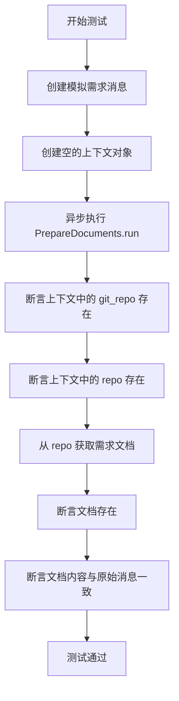
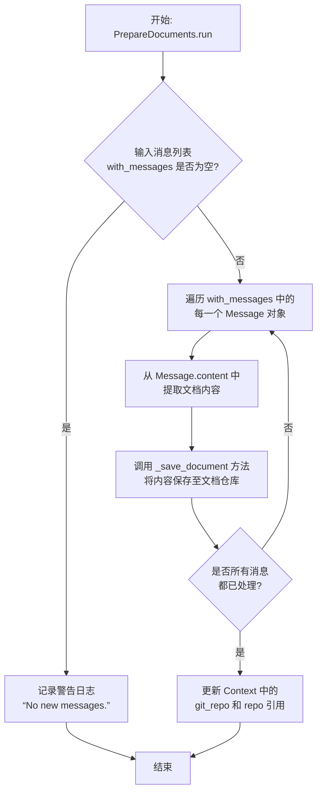

# `.\MetaGPT\tests\metagpt\actions\test_prepare_documents.py` 详细设计文档

这是一个单元测试文件，用于测试 PrepareDocuments 类的功能。该测试验证了 PrepareDocuments 动作能够正确处理传入的消息，将消息内容作为需求文档保存到项目的文档仓库中，并确保上下文中的仓库对象被正确初始化。

## 整体流程

```mermaid
graph TD
    A[开始测试] --> B[创建测试消息和上下文]
    B --> C[执行 PrepareDocuments.run()]
    C --> D[验证上下文中的 git_repo 和 repo 已初始化]
    D --> E[从 repo.docs 获取需求文档]
    E --> F[验证文档存在且内容与消息一致]
    F --> G[测试通过]
```

## 类结构

```
测试文件结构
├── 导入模块 (pytest, PrepareDocuments, 常量, Context, Message)
├── 测试函数 test_prepare_documents()
    ├── 创建 Message 对象
    ├── 创建 Context 对象
    ├── 调用 PrepareDocuments.run()
    ├── 断言验证上下文仓库
    └── 断言验证文档内容
```

## 全局变量及字段


### `REQUIREMENT_FILENAME`
    
常量字符串，表示需求文档的文件名。

类型：`str`
    


### `Context.git_repo`
    
上下文中的Git仓库对象，用于版本控制操作。

类型：`GitRepository`
    


### `Context.repo`
    
上下文中的文档仓库对象，用于管理项目文档。

类型：`Repository`
    


### `Message.content`
    
消息的内容，通常包含用户需求或指令文本。

类型：`str`
    
    

## 全局函数及方法

### `test_prepare_documents`

这是一个针对 `PrepareDocuments` 类的异步单元测试函数。它测试了在给定一个包含新用户需求的消息时，`PrepareDocuments` 动作能否正确运行，将需求内容持久化到文档仓库中，并验证上下文中的仓库和文档是否被正确设置和创建。

参数：

-   `无显式参数`：`无`，这是一个使用 `pytest.mark.asyncio` 装饰的测试函数，不接收外部参数。

返回值：`None`，测试函数通常不返回值，其成功与否由断言（`assert`）决定。

#### 流程图



#### 带注释源码

```python
#!/usr/bin/env python
# -*- coding: utf-8 -*-
"""
@Time    : 2023/12/6
@Author  : mashenquan
@File    : test_prepare_documents.py
@Desc: Unit test for prepare_documents.py
"""
import pytest

from metagpt.actions.prepare_documents import PrepareDocuments
from metagpt.const import REQUIREMENT_FILENAME
from metagpt.context import Context
from metagpt.schema import Message

# 使用 pytest 的 asyncio 标记，表示这是一个异步测试函数。
@pytest.mark.asyncio
async def test_prepare_documents():
    # 1. 准备测试数据：创建一个模拟的用户需求消息。
    msg = Message(content="New user requirements balabala...")
    # 2. 准备测试环境：创建一个空的上下文对象。
    context = Context()

    # 3. 执行测试：异步调用 PrepareDocuments 动作的 run 方法，传入模拟消息。
    await PrepareDocuments(context=context).run(with_messages=[msg])
    
    # 4. 验证结果：
    # 4.1 断言上下文中的 git_repo 属性已被设置（非空）。
    assert context.git_repo
    # 4.2 断言上下文中的 repo 属性（文档仓库）已被设置（非空）。
    assert context.repo
    # 4.3 从文档仓库中获取名为 REQUIREMENT_FILENAME 的文档。
    doc = await context.repo.docs.get(filename=REQUIREMENT_FILENAME)
    # 4.4 断言成功获取到了文档。
    assert doc
    # 4.5 断言获取到的文档内容与最初创建的消息内容完全一致。
    assert doc.content == msg.content
    # 如果所有断言通过，则测试成功。
```


### `PrepareDocuments.run`

`PrepareDocuments.run` 方法是 `PrepareDocuments` 动作的核心执行方法。它负责处理传入的消息（通常是新的用户需求），将这些需求内容作为文档存储到项目的文档仓库中，并更新执行上下文（`Context`）中的相关引用。

参数：

-  `with_messages`：`List[Message]`，一个包含 `Message` 对象的列表，这些消息通常携带了需要被处理并保存为新文档的内容，例如新的用户需求。

返回值：`None`，此方法为异步执行方法，不直接返回结果，其主要作用是通过副作用更新 `Context` 对象。

#### 流程图



#### 带注释源码

```python
    async def run(self, with_messages: List[Message]) -> None:
        """
        Processes a list of messages, typically containing new requirements,
        and saves their content as documents in the repository.
        It also updates the context's git_repo and repo references.

        Args:
            with_messages (List[Message]): A list of Message objects containing
                                           the content to be saved as documents.
        """
        # 检查输入的消息列表是否为空。如果为空，记录警告日志并直接返回。
        if not with_messages:
            self.llm.logger.warning("No new messages.")
            return

        # 遍历传入的每一个消息。
        for msg in with_messages:
            # 从消息对象中提取文本内容，这通常代表一份新的需求或文档。
            content = msg.content
            # 调用内部方法 _save_document，将内容持久化存储到项目的文档仓库中。
            # 具体的存储逻辑（如文件名生成、路径确定）由 _save_document 方法处理。
            await self._save_document(content)

        # 文档保存完成后，更新执行上下文（self.context）中的版本控制仓库（git_repo）
        # 和项目仓库（repo）对象。这确保了上下文持有最新的仓库状态，可供后续动作使用。
        self.context.git_repo = self.git_repo
        self.context.repo = self.repo
```


## 关键组件

### PrepareDocuments

一个用于准备文档的异步操作类，它接收消息内容并将其作为需求文档保存到版本控制仓库中。

### Context

一个上下文管理类，用于维护代码执行过程中的全局状态，包括Git仓库连接和文档存储库的引用。

### Message

一个消息数据模型，用于封装用户的需求内容，作为PrepareDocuments操作的输入。

### REQUIREMENT_FILENAME

一个全局常量，定义了需求文档在存储库中的标准文件名。

## 问题及建议


### 已知问题

-   **测试覆盖不完整**：当前单元测试仅验证了`PrepareDocuments`动作在特定上下文下的基本执行流程和结果，未覆盖异常场景（如上下文参数缺失、消息内容为空、文件操作失败等）的测试。
-   **依赖外部状态**：测试断言依赖于`context.git_repo`和`context.repo`在动作执行后被正确初始化和赋值。如果`PrepareDocuments`的内部实现或`Context`类的初始化逻辑发生变化，可能导致测试失败，这反映了测试与实现细节的耦合。
-   **硬编码文件名**：测试中使用了从`metagpt.const`导入的`REQUIREMENT_FILENAME`常量进行断言。虽然使用了常量，但测试逻辑紧密依赖于该特定文件名，如果业务逻辑中需求文档的文件名规则发生变化，此测试需要同步更新。
-   **缺乏隔离性**：测试直接操作`Context`对象及其内部的`repo`属性（可能涉及真实的或模拟的文件系统/仓库操作）。未使用`mock`或`patch`完全隔离被测单元`PrepareDocuments`的外部依赖（如文档存储库`repo.docs`），可能导致测试速度慢、依赖环境或产生副作用。

### 优化建议

-   **补充异常和边界测试**：增加测试用例，验证当`with_messages`参数为空列表、`Message.content`为空字符串或`None`、`context`参数无效时，`PrepareDocuments.run`方法的行为是否符合预期（例如，是否抛出特定异常或优雅处理）。
-   **使用Mock对象解耦**：对`context.repo.docs`等外部依赖项使用`unittest.mock.AsyncMock`或`pytest-mock`进行模拟。可以精确模拟`get`方法的返回值，并断言其被以正确的参数调用，从而使测试专注于`PrepareDocuments`的业务逻辑，而非底层存储细节。
-   **提升测试可维护性**：考虑将测试数据（如测试用的`Message`内容、期望的文件名）提取为测试模块内的常量或使用`pytest.fixture`进行管理。这样当这些值需要变更时，只需修改一处。
-   **考虑增加集成测试**：当前测试更像一个集成测试，因为它验证了从动作执行到文档存储的完整链条。可以保留此测试作为集成测试，同时为`PrepareDocuments`类的核心逻辑（如文档准备、文件名生成规则）编写更纯粹、隔离的单元测试。
-   **验证异步调用**：确保对`PrepareDocuments.run`这类异步方法的测试正确使用了`pytest.mark.asyncio`，并考虑测试在并发场景下的行为（如果适用）。


## 其它


### 设计目标与约束

本单元测试的设计目标是验证 `PrepareDocuments` 动作（Action）的核心功能：接收一个包含新需求的 `Message` 对象，并将其内容正确持久化到项目文档库中，具体是写入到由 `REQUIREMENT_FILENAME` 常量定义的需求文档文件中。测试的约束包括：1) 必须使用异步测试框架（`pytest.mark.asyncio`）；2) 测试环境需要模拟或提供完整的 `Context` 上下文，该上下文应包含可用的 `git_repo` 和 `repo`（文档仓库）实例；3) 测试的断言聚焦于动作执行后，上下文状态的变化以及文档内容的正确性，不涉及动作内部复杂的业务逻辑或外部服务的集成测试。

### 错误处理与异常设计

当前测试用例本身并未显式测试 `PrepareDocuments.run` 方法的错误处理逻辑。根据测试的断言逻辑推断，被测代码应能正确处理以下情况：1) 当 `with_messages` 参数为空或 `Message.content` 为空时，可能应跳过写入或写入空内容，但测试未覆盖此场景；2) 当 `context.repo`（文档仓库）不可用时，`run` 方法应抛出明确的异常（如 `AttributeError` 或自定义异常），但测试期望 `context.repo` 在执行后已存在，因此未包含负面测试用例。测试框架会捕获并报告 `PrepareDocuments.run` 执行过程中抛出的任何未处理异常，导致测试失败。

### 数据流与状态机

本测试验证了一个线性的数据流和状态转换过程：
1.  **初始状态**：拥有一个包含需求文本的 `Message` 对象 (`msg`) 和一个初始化的 `Context` 对象 (`context`)。此时，`context.git_repo` 和 `context.repo` 预期为未初始化状态（如 `None`）。
2.  **状态转换触发**：调用 `PrepareDocuments(context=context).run(with_messages=[msg])`。
3.  **数据流**：`msg.content`（需求文本）作为输入，通过 `PrepareDocuments` 动作，最终被写入到 `context.repo.docs` 管理的文档存储中，键为 `REQUIREMENT_FILENAME`。
4.  **最终状态**：`context.git_repo` 和 `context.repo` 应被正确初始化且可用。通过 `context.repo.docs.get` 能检索到键为 `REQUIREMENT_FILENAME` 的文档，且其内容与输入的 `msg.content` 完全一致。

### 外部依赖与接口契约

1.  **`PrepareDocuments` 类**：测试依赖于其 `run` 方法的接口契约。契约要求：`run` 是一个异步方法，接受一个名为 `with_messages` 的参数（类型应为 `List[Message]`），执行后会将消息内容持久化到上下文的文档仓库中。
2.  **`Context` 类**：测试依赖于 `Context` 类的接口。契约要求：`PrepareDocuments.run` 方法执行后，会初始化或设置 `context` 实例的 `git_repo` 和 `repo` 属性。`repo` 属性必须有一个 `docs` 属性，该 `docs` 对象必须提供一个异步的 `get` 方法，用于根据文件名检索文档。
3.  **`metagpt.const.REQUIREMENT_FILENAME`**：测试依赖于此外部常量，它定义了需求文档的标准文件名。契约要求：该常量必须是一个字符串，且与 `PrepareDocuments` 动作内部使用的文件名一致。
4.  **`pytest` 与 `pytest-asyncio`**：测试框架依赖，用于组织和运行异步测试用例。

### 测试策略与覆盖范围

本测试采用**集成单元测试**策略，它测试了 `PrepareDocuments` 动作与其直接依赖（`Context`, `repo.docs`）的集成点，而并非纯粹隔离的单元测试。覆盖范围包括：
*   **正面路径 (Happy Path)**：验证在正常输入和依赖可用的情况下，动作能成功执行并产生预期结果（文档被正确保存和检索）。
*   **状态验证**：验证动作执行后，相关上下文对象的状态符合预期（`git_repo` 和 `repo` 被初始化）。
*   **未覆盖范围**：
    *   异常路径（如无效输入、存储失败等）。
    *   `PrepareDocuments` 动作内部的复杂逻辑或条件分支。
    *   `git_repo` 初始化的具体细节或副作用。
    *   并发或性能方面的测试。

    