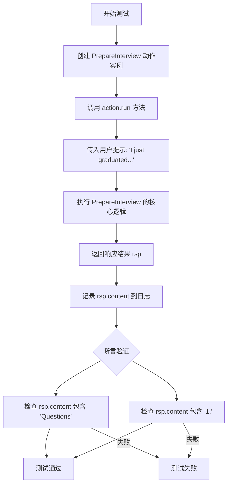
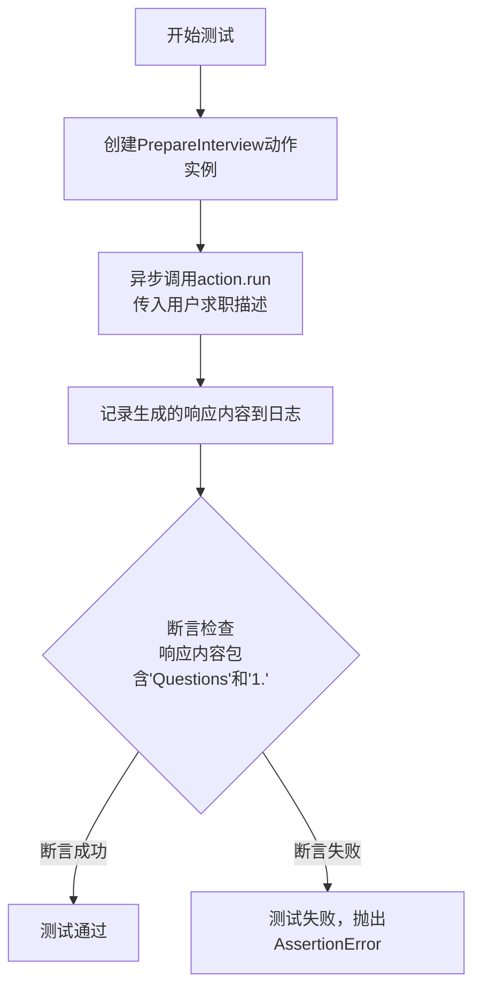

# `.\MetaGPT\tests\metagpt\actions\test_prepare_interview.py` 详细设计文档

该代码是一个使用 pytest 框架编写的异步单元测试，用于测试 PrepareInterview 动作类。它模拟一个刚毕业的求职者请求，验证 PrepareInterview 能否成功生成包含特定格式（如'Questions'和编号列表）的面试问题。

## 整体流程



## 类结构

```
test_generate_questions.py (测试文件)
├── pytest.mark.asyncio (装饰器)
└── test_prepare_interview (异步测试函数)
```

## 全局变量及字段


### `logger`
    
用于记录测试执行过程中的日志信息，如调试信息、错误信息等。

类型：`logging.Logger`
    


    

## 全局函数及方法


### `test_prepare_interview`

这是一个使用 `pytest` 框架编写的异步单元测试函数，用于测试 `PrepareInterview` 动作类的 `run` 方法。它模拟了一个刚毕业、希望找到Python工程师工作的用户场景，验证 `PrepareInterview` 能否生成包含面试问题的响应。

参数：

-  `context`：`<metagpt上下文对象>`，测试框架（如 `pytest`）提供的测试上下文，通常包含运行测试所需的环境配置、依赖对象等。在本测试中，它被传递给 `PrepareInterview` 动作的构造函数。

返回值：`None`，`pytest` 测试函数通常不显式返回值，其成功与否由函数内的断言（`assert`）决定。

#### 流程图



#### 带注释源码

```python
# 使用pytest的异步标记，表明这是一个异步测试函数
@pytest.mark.asyncio
async def test_prepare_interview(context):
    # 1. 实例化被测试的Action类：PrepareInterview，并传入测试上下文
    action = PrepareInterview(context=context)
    
    # 2. 异步执行Action的核心run方法，模拟用户输入一段求职描述
    rsp = await action.run("I just graduated and hope to find a job as a Python engineer")
    
    # 3. 使用logger记录Action返回的响应内容，便于调试和观察
    logger.info(f"{rsp.content=}")
    
    # 4. 进行断言验证：检查响应内容中是否包含预期的“Questions”标题和列表标记“1.”
    #    这验证了PrepareInterview动作成功生成了结构化的面试问题列表。
    assert "Questions" in rsp.content
    assert "1." in rsp.content
```


### `PrepareInterview.run`

`PrepareInterview.run` 是 `PrepareInterview` 动作类的核心执行方法。它接收一个用户输入的求职意向描述，通过调用大语言模型（LLM）生成一份针对该意向的模拟面试问题列表，旨在帮助用户进行面试准备。

参数：

-  `self`：`PrepareInterview` 实例，方法所属的动作类实例。
-  `requirements`：`str`，用户提供的求职意向或职位描述文本。

返回值：`ActionOutput`，一个封装了动作执行结果的对象，其 `content` 属性包含了生成的面试问题字符串。

#### 流程图

```mermaid
flowchart TD
    A[开始: run(requirements)] --> B[构造提示词 Prompt]
    B --> C[异步调用 LLM<br/>_aask(prompt)]
    C --> D[接收并返回 LLM 的响应<br/>ActionOutput(content=response)]
    D --> E[结束]
```

#### 带注释源码

```python
async def run(self, requirements: str) -> ActionOutput:
    """
    执行准备面试动作。
    根据用户需求（求职意向），生成相关的面试问题。

    Args:
        requirements (str): 用户提供的求职意向或职位描述。

    Returns:
        ActionOutput: 包含生成的面试问题内容的结果对象。
    """
    # 1. 构造发送给大语言模型（LLM）的提示词（Prompt）。
    #    提示词中包含了系统角色设定和具体的用户需求。
    prompt = self.PROMPT_TEMPLATE.format(requirements=requirements)

    # 2. 异步调用底层的 LLM 接口（_aask 方法）并传入构造好的提示词。
    #    _aask 方法负责与 LLM 服务通信并获取文本响应。
    rsp = await self._aask(prompt)

    # 3. 将 LLM 返回的文本响应（rsp）封装成 ActionOutput 对象并返回。
    #    ActionOutput 是一个标准化的输出容器，用于在智能体系统中传递动作结果。
    return ActionOutput(content=rsp)
```


## 关键组件


### PrepareInterview 类

一个用于准备面试问题的动作类，它接收上下文和用户背景信息，生成相关的面试问题列表。

### pytest 测试框架

一个用于编写和运行单元测试的Python框架，支持异步测试和断言验证。

### 异步测试函数

一个使用 `pytest.mark.asyncio` 装饰的异步测试函数，用于测试 `PrepareInterview` 动作的运行功能。

### 日志记录器

一个用于记录测试过程中信息的日志工具，帮助调试和验证代码执行情况。


## 问题及建议


### 已知问题

-   **测试用例过于简单且脆弱**：当前的测试断言仅检查返回内容中是否包含“Questions”字符串和“1.”，这种检查方式非常脆弱。任何格式上的微小变动（例如，问题列表使用“a.”或“i.”作为编号，或者“Questions”一词被翻译）都可能导致测试失败，而实际上核心功能（生成面试问题）可能完全正常。
-   **缺乏对核心功能的验证**：测试没有验证生成的问题是否与给定的输入（“Python工程师”）相关，也没有检查问题的质量、数量或结构（例如，是否是一个列表）。这使得测试在确保`PrepareInterview`动作正确性方面的价值有限。
-   **依赖外部系统且无模拟**：测试直接运行`PrepareInterview`动作的`run`方法，而该动作内部很可能调用了大型语言模型（LLM）等外部服务。这会导致测试执行速度慢、成本高，并且可能因为网络问题或API配额限制而失败，使得测试不可靠且不适合持续集成（CI）环境。
-   **测试数据硬编码**：测试输入（“I just graduated and hope to find a job as a Python engineer”）直接硬编码在测试函数中，缺乏灵活性，也难以扩展为针对不同场景（如不同职位、经验水平）的测试用例。

### 优化建议

-   **增强断言逻辑**：重构测试断言，使其更健壮并专注于验证核心业务逻辑。建议：
    -   验证返回的`rsp.content`是一个结构化的数据（例如，通过解析确认它是一个包含多个问题的列表）。
    -   检查生成的问题中是否包含与目标职位（“Python”）相关的关键词。
    -   可以断言问题的数量在一个合理的范围内。
-   **对外部依赖进行模拟（Mock）**：使用`pytest-mock`或`unittest.mock`来模拟`PrepareInterview`动作内部对LLM的调用。这样可以将测试重点放在动作本身的流程处理、提示词构建和结果解析逻辑上，使测试更快、更稳定、与外部环境隔离。
-   **参数化测试输入**：使用`@pytest.mark.parametrize`装饰器，将不同的测试用例（如不同的求职描述、不同的经验水平）参数化。这能提高测试的覆盖率和可维护性。
-   **添加异常处理测试**：补充测试用例，用于验证当输入无效、空值或外部服务调用失败时，`PrepareInterview`动作是否能按预期抛出异常或返回错误信息。
-   **考虑引入契约测试或集成测试**：当前测试更像是端到端（E2E）测试。建议将测试分层：
    -   **单元测试**（使用Mock）：针对`PrepareInterview`类的内部方法。
    -   **集成/契约测试**：针对与LLM服务的关键交互点，验证请求格式和响应解析是否符合约定。
    -   保留当前形式的测试作为**有限的场景测试**，但为其配置独立的测试环境，并可能降低在CI中的执行频率。


## 其它


### 设计目标与约束

本代码是一个针对 `PrepareInterview` 动作的单元测试。其设计目标是验证 `PrepareInterview` 类在给定上下文和提示信息时，能够正确运行并生成包含特定格式（如包含“Questions”和列表序号“1.”）的响应。主要约束包括：1) 依赖于 `pytest` 异步测试框架；2) 依赖于 `metagpt` 项目中的 `PrepareInterview` 动作和 `logger` 模块；3) 测试用例是异步的，需要事件循环支持。

### 错误处理与异常设计

当前测试代码本身不包含复杂的错误处理逻辑。它主要依赖于 `pytest` 框架来捕获和报告测试失败（断言失败）。如果 `action.run` 方法内部抛出异常，`pytest` 会将其标记为测试错误。测试的健壮性依赖于被测试对象 `PrepareInterview` 自身的错误处理机制。测试用例没有显式处理网络超时、数据格式错误或外部服务不可用等潜在异常。

### 数据流与状态机

1.  **输入流**：测试函数接收一个 `context` 夹具（fixture）作为输入，该夹具由 `pytest` 框架管理并提供。
2.  **处理流**：
    a. 实例化 `PrepareInterview` 动作对象，注入 `context`。
    b. 调用动作对象的异步 `run` 方法，传入固定的提示字符串 `"I just graduated and hope to find a job as a Python engineer"`。
    c. `run` 方法执行内部逻辑（此部分为被测对象，在测试中视为黑盒），并返回一个响应对象 `rsp`。
    d. 使用 `logger` 记录响应内容。
3.  **验证流（状态断言）**：
    a. 断言响应内容 (`rsp.content`) 中包含子字符串 `"Questions"`。
    b. 断言响应内容中包含子字符串 `"1."`，用于验证结果是否以列表形式呈现。
4.  **输出流**：测试本身没有返回值，其输出是测试通过或失败的状态，由 `pytest` 框架输出到控制台。

### 外部依赖与接口契约

1.  **`pytest` 框架**：用于组织和执行测试。依赖 `@pytest.mark.asyncio` 装饰器来支持异步测试函数，并依赖 `context` 夹具来提供运行时上下文。
2.  **`metagpt.actions.prepare_interview.PrepareInterview` 类**：这是被测试的核心组件。测试代码与其契约是：给定一个 `context` 对象和一个提示字符串，其 `run` 方法应异步返回一个包含 `content` 属性的响应对象。
3.  **`metagpt.logs.logger`**：用于记录测试过程中的信息，属于辅助性依赖。
4.  **`context` 夹具**：这是一个关键的外部依赖，由测试套件（conftest.py 或其它地方）定义。它必须提供 `PrepareInterview` 类初始化及 `run` 方法执行所需的所有环境、配置或服务访问能力。测试的成功与否高度依赖于该夹具的正确实现和配置。

### 安全与合规考虑

此单元测试代码不直接处理用户数据、网络请求或敏感操作，因此安全风险较低。主要考虑点在于：
1.  **依赖安全**：需要确保所依赖的 `metagpt` 包及其传递依赖来自可信源，且无已知漏洞。
2.  **测试数据**：测试中使用的提示字符串是固定的、无害的模拟数据，不涉及真实个人信息。
3.  **合规性**：代码本身不涉及特定的行业合规要求（如GDPR、HIPAA）。但如果 `PrepareInterview` 动作在未来集成外部AI服务，则相关测试可能需要考虑数据隐私和传输安全。

### 部署与运维考虑

1.  **环境要求**：运行此测试需要 Python 环境、安装 `pytest`、`pytest-asyncio` 插件以及 `metagpt` 包及其所有依赖。
2.  **执行方式**：通常通过命令 `pytest path/to/test_generate_questions.py` 或作为整个测试套件的一部分来执行。
3.  **集成流水线**：此测试应被集成到项目的持续集成（CI）流水线中，以确保 `PrepareInterview` 动作的功能在代码变更后依然正常。
4.  **日志与监控**：测试中使用 `logger.info` 记录响应内容，这有助于调试失败的测试。但在大规模CI运行时，可能需要调整日志级别以避免输出过多信息。

    