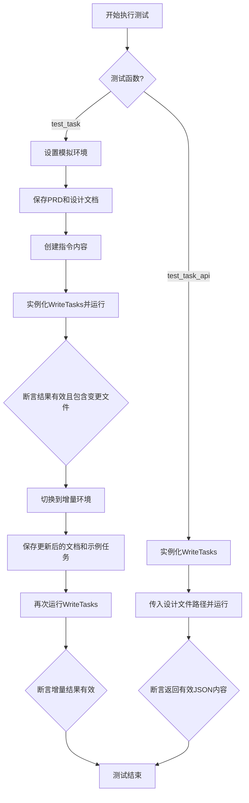
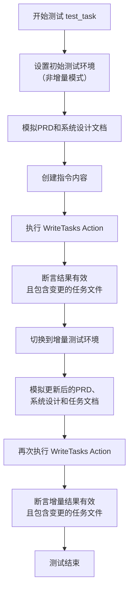
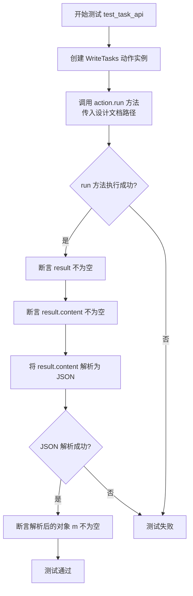
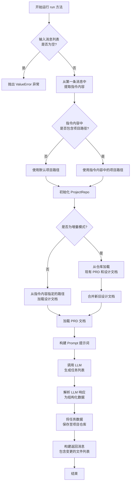

# `.\MetaGPT\tests\metagpt\actions\test_project_management.py` 详细设计文档

该文件是一个测试文件，用于测试 WriteTasks 动作类（Action）的功能。WriteTasks 是项目管理系统中的一个组件，负责根据产品需求文档（PRD）和系统设计文档生成或更新任务列表。测试文件包含两个异步测试函数：test_task 测试在模拟的完整和增量开发环境中 WriteTasks 的运行；test_task_api 测试 WriteTasks 通过直接传入设计文件路径的 API 调用方式。

## 整体流程



## 类结构

```
测试文件 (test_project_management.py)
├── 全局导入模块
├── 测试函数: test_task
└── 测试函数: test_task_api
```

## 全局变量及字段


### `REFINED_DESIGN_JSON`
    
用于测试的、经过精炼后的系统设计数据，模拟增量开发场景下的设计变更。

类型：`dict`
    


### `REFINED_PRD_JSON`
    
用于测试的、经过精炼后的产品需求文档数据，模拟增量开发场景下的需求变更。

类型：`dict`
    


### `TASK_SAMPLE`
    
用于测试的任务样本数据，模拟增量开发场景下已存在的任务列表。

类型：`str`
    


### `DESIGN`
    
用于测试的初始系统设计数据，模拟首次开发时的设计输入。

类型：`dict`
    


### `PRD`
    
用于测试的初始产品需求文档数据，模拟首次开发时的需求输入。

类型：`dict`
    


    

## 全局函数及方法

### `test_task`

这是一个使用 `pytest` 框架编写的异步测试函数，用于测试 `WriteTasks` 动作（Action）在两种不同场景下的功能：1) 模拟一个全新的任务编写环境；2) 模拟一个增量开发环境。它通过设置测试上下文、模拟输入数据并执行 `WriteTasks` 动作来验证其输出是否符合预期。

参数：

-   `context`：`pytest` 的 `Fixture` 类型，通常指测试上下文对象，它提供了测试运行时的配置信息和共享状态。在本测试中，用于获取和设置项目路径、增量标志等。

返回值：`None`，`pytest` 测试函数通常不显式返回值，其成功与否由内部的 `assert` 语句决定。

#### 流程图



#### 带注释源码

```python
@pytest.mark.asyncio  # 标记此函数为异步测试
async def test_task(context):  # 定义异步测试函数，接收测试上下文
    # Mock write tasks env
    # 模拟一个全新的任务编写环境（非增量模式）
    context.kwargs.project_path = context.config.project_path  # 从上下文配置中获取项目路径
    context.kwargs.inc = False  # 设置增量标志为 False
    repo = ProjectRepo(context.kwargs.project_path)  # 创建项目仓库对象
    filename = "1.txt"  # 定义模拟文件名
    # 保存模拟的产品需求文档（PRD）
    await repo.docs.prd.save(filename=filename, content=str(PRD))
    # 保存模拟的系统设计文档
    await repo.docs.system_design.save(filename=filename, content=str(DESIGN))
    # 构建传递给动作的指令内容所需的数据
    kvs = {
        "project_path": context.kwargs.project_path,
        "changed_system_design_filenames": [str(repo.docs.system_design.workdir / filename)],
    }
    # 创建一个包含上述数据的指令消息内容
    instruct_content = AIMessage.create_instruct_value(kvs=kvs, class_name="WriteDesignOutput")

    action = WriteTasks(context=context)  # 实例化要测试的 WriteTasks 动作
    # 运行动作，传入一个包含指令内容的空消息列表
    result = await action.run([Message(content="", instruct_content=instruct_content)])
    logger.info(result)  # 记录结果日志
    assert result  # 断言结果不为空
    # 断言结果中包含变更的任务文件名列表
    assert result.instruct_content.changed_task_filenames

    # Mock incremental env
    # 模拟增量开发环境
    context.kwargs.inc = True  # 将增量标志设置为 True
    # 保存更新后的模拟PRD文档
    await repo.docs.prd.save(filename=filename, content=str(REFINED_PRD_JSON))
    # 保存更新后的模拟系统设计文档
    await repo.docs.system_design.save(filename=filename, content=str(REFINED_DESIGN_JSON))
    # 保存一个已有的任务样本，模拟增量场景下的已有任务
    await repo.docs.task.save(filename=filename, content=TASK_SAMPLE)

    # 再次运行动作，使用相同的指令内容（但底层环境数据已更新）
    result = await action.run([Message(content="", instruct_content=instruct_content)])
    logger.info(result)  # 记录结果日志
    assert result  # 断言结果不为空
    # 断言增量运行的结果中也包含变更的任务文件名列表
    assert result.instruct_content.changed_task_filenames
```

### `test_task_api`

这是一个使用 pytest 框架编写的异步测试函数，用于测试 `WriteTasks` 类的 `run` 方法。它模拟了一个 API 调用场景，通过提供一个设计文档的文件路径，来验证 `WriteTasks` 能否成功运行并返回一个包含有效 JSON 内容的 `Message` 对象。

参数：

- `context`：`pytest.fixture`，pytest 提供的测试上下文夹具，用于管理测试环境。在本函数中未直接使用，但作为测试函数的参数存在。

返回值：`None`，测试函数通常不显式返回值，其核心是通过 `assert` 语句验证测试结果。

#### 流程图



#### 带注释源码

```python
@pytest.mark.asyncio  # 标记此函数为异步测试函数，以便 pytest-asyncio 插件处理
async def test_task_api(context):  # 定义异步测试函数，接收 context 夹具
    action = WriteTasks()  # 实例化要测试的 WriteTasks 类，不传入 context
    # 调用 action 的 run 方法，传入一个设计文档的路径字符串。
    # 这里使用了 METAGPT_ROOT 常量来构建一个测试数据文件的绝对路径。
    result = await action.run(design_filename=str(METAGPT_ROOT / "tests/data/system_design.json"))
    # 断言：run 方法的返回值 result 应该是一个非空对象（通常是 Message 实例）
    assert result
    # 断言：result 对象的 content 属性应该包含非空内容
    assert result.content
    # 尝试将 result.content 字符串解析为 JSON 对象
    m = json.loads(result.content)
    # 断言：JSON 解析成功，并且得到的对象 m 非空
    assert m
```

### `WriteTasks.run`

`WriteTasks.run` 是 `WriteTasks` 类的核心异步方法，负责根据产品需求文档（PRD）和系统设计文档生成或更新具体的开发任务列表。它通过解析输入消息中的指令内容，定位相关设计文件，并调用大语言模型（LLM）来生成结构化的任务数据，最终将任务保存到项目仓库中。

参数：

- `with_messages`：`List[Message]`，一个包含指令内容的 `Message` 对象列表。指令内容（`instruct_content`）中应包含项目路径和已变更的系统设计文件路径等信息。

返回值：`Message`，返回一个 `Message` 对象，其 `instruct_content` 属性包含了本次操作所变更的任务文件路径列表。

#### 流程图



#### 带注释源码

```python
async def run(self, with_messages: List[Message]) -> Message:
    """
    根据输入的消息（包含指令内容）生成或更新开发任务。
    核心流程：加载设计文档 -> 构建Prompt -> 调用LLM -> 解析并保存任务。
    """
    # 1. 参数校验：确保输入消息列表不为空
    if not with_messages:
        raise ValueError("No messages provided.")
    msg = with_messages[0]

    # 2. 提取指令内容，获取项目路径和变更的设计文件信息
    ic = msg.instruct_content
    project_path = ic.kvs.get("project_path") if ic else self.context.kwargs.project_path
    changed_system_design_filenames = ic.kvs.get("changed_system_design_filenames", []) if ic else []

    # 3. 初始化项目仓库对象
    self.project_repo = ProjectRepo(project_path)

    # 4. 加载必要的文档：PRD 和 系统设计文档
    #    根据是否为增量模式，决定是加载全部还是仅加载变更的部分
    prd_doc = await self.project_repo.docs.prd.get()
    if self.inc:
        # 增量模式：加载现有设计，并与变更部分合并
        old_system_design_doc = await self.project_repo.docs.system_design.get()
        changed_system_design_docs = [
            await self.project_repo.docs.system_design.get(filename=filename)
            for filename in changed_system_design_filenames
        ]
        system_design_doc = old_system_design_doc + changed_system_design_docs
    else:
        # 全量模式：直接加载指定的设计文档
        system_design_doc = await self.project_repo.docs.system_design.get()

    # 5. 构建发送给 LLM 的提示词（Prompt）
    prompt = self._format_prompt(prd_doc.content, system_design_doc.content)

    # 6. 调用 LLM 生成任务列表的文本响应
    rsp = await self._aask(prompt)

    # 7. 解析 LLM 的响应，将其转换为结构化的任务数据（字典列表）
    tasks = WriteTasksOutput.model_validate_json(rsp)
    task_list = tasks.model_dump()["tasks"]

    # 8. 将生成的任务列表保存到项目仓库的 `task` 目录下
    changed_task_filenames = []
    for task in task_list:
        filename = f"{task['id']}.txt"
        await self.project_repo.docs.task.save(filename=filename, content=json.dumps(task, indent=4, ensure_ascii=False))
        changed_task_filenames.append(str(self.project_repo.docs.task.workdir / filename))

    # 9. 构建并返回结果消息，其中包含本次操作变更的任务文件路径列表
    instruct_content = WriteTasksOutput(
        changed_task_filenames=changed_task_filenames
    )
    return Message(content="", instruct_content=instruct_content)
```

## 关键组件


### WriteTasks Action

WriteTasks 是一个项目管理的动作（Action），其核心功能是根据产品需求文档（PRD）和系统设计文档，生成或更新具体的开发任务列表。它支持增量模式，能够识别设计变更并相应地调整任务。

### ProjectRepo

ProjectRepo 是一个项目仓库管理组件，它封装了对项目文档（如PRD、系统设计、任务等）的读写操作，提供了结构化的方式来管理和访问项目中的不同文档类型。

### AIMessage

AIMessage 是一个消息模式组件，用于在系统内部传递结构化的指令和数据。它能够封装键值对数据（kvs）和类名，作为动作执行的输入指令内容。

### 测试数据模拟组件

测试数据模拟组件（如 `REFINED_DESIGN_JSON`, `REFINED_PRD_JSON`, `TASK_SAMPLE`, `DESIGN`, `PRD`）用于在单元测试中提供模拟的输入数据，以验证 WriteTasks 动作在不同场景（如初始生成和增量更新）下的行为是否正确。


## 问题及建议


### 已知问题

-   **测试数据与逻辑耦合**：测试用例 `test_task` 中，测试逻辑与特定的模拟数据文件名 `"1.txt"` 和数据结构（如 `PRD`, `DESIGN`）紧密耦合。如果数据结构或文件名发生变化，测试用例可能失败，降低了测试的健壮性和可维护性。
-   **硬编码的路径和配置**：测试中使用了硬编码的路径（如 `METAGPT_ROOT / "tests/data/system_design.json"`）和通过 `context.kwargs` 设置的配置。这使得测试依赖于特定的文件系统布局和环境配置，不利于在不同环境（如CI/CD流水线）中运行。
-   **模拟环境设置复杂且重复**：`test_task` 方法中，为了测试“完整”和“增量”两种场景，需要手动设置和重置多个模拟状态（如 `context.kwargs.inc`, 保存文件内容）。这种设置不仅冗长，而且容易出错，测试意图被实现细节所掩盖。
-   **断言过于宽泛**：断言 `assert result` 和 `assert result.instruct_content.changed_task_filenames` 虽然检查了关键输出，但未能验证生成的任务内容是否符合预期（例如，与 `REFINED_DESIGN_JSON` 的关联性）。这可能导致测试通过，但核心功能逻辑错误未被发现。
-   **潜在的异步执行问题**：测试标记为 `@pytest.mark.asyncio` 并使用了 `async/await`，但测试函数内部对 `ProjectRepo` 的操作（如多次 `save`）如果涉及真正的I/O且未妥善处理并发，在特定条件下可能存在竞态状态，尽管当前使用模拟数据可能掩盖了此问题。

### 优化建议

-   **使用 pytest fixture 和工厂函数**：为常用的模拟数据（如 `PRD`, `DESIGN`, `REFINED_PRD_JSON`）和对象（如配置好的 `ProjectRepo` 实例、`WriteTasks` 动作实例）创建 pytest fixture。将测试环境设置（如文件保存）封装在 fixture 或辅助函数中，使测试用例更简洁、专注。
-   **参数化测试用例**：使用 `@pytest.mark.parametrize` 将 `test_task` 中测试的“完整”和“增量”两种场景参数化。这样可以消除重复代码，并清晰地展示被测试的不同条件。
-   **增强断言，验证业务逻辑**：在断言结果非空和文件名列表存在的基础上，增加对生成任务内容本身的验证。例如，可以解析 `result.instruct_content` 或检查生成的任务文件内容，确保其与输入的设计文档（`REFINED_DESIGN_JSON`）在关键要求上保持一致。
-   **解耦测试数据路径**：避免在测试代码中硬编码绝对路径或相对于项目根的路径。可以考虑使用 `pytest` 的 `data_dir` 模式，或将测试数据路径定义为模块级常量，并通过 fixture 注入，提高测试的可移植性。
-   **考虑使用更隔离的测试环境**：对于涉及文件系统操作的测试，考虑使用临时目录（如 `tmp_path` fixture）作为 `project_path`，确保每次测试都在干净的环境中进行，避免测试间相互干扰，也便于清理。
-   **审查异步操作的安全性**：确保测试中连续的异步 `save` 操作是确定性的。如果 `ProjectRepo.save` 涉及非模拟的I/O，考虑是否需要显式地等待或顺序执行这些操作，或者在 fixture 的 `setup/teardown` 中处理，以保证测试的可靠性。


## 其它


### 设计目标与约束

本测试代码的设计目标是验证 `WriteTasks` 动作（Action）在项目管理和任务生成场景下的功能正确性。具体包括：
1.  **功能验证**：测试 `WriteTasks` 动作能否根据产品需求文档（PRD）和系统设计文档，正确生成或更新任务列表。
2.  **增量更新验证**：测试在已有任务列表的基础上，当 PRD 或系统设计发生变更时，`WriteTasks` 动作能否正确地进行增量更新，而非全量覆盖。
3.  **接口兼容性验证**：测试 `WriteTasks` 动作通过不同输入方式（如通过 `Message` 对象传递结构化指令，或直接传入设计文件路径）调用时，其行为是否符合预期。

主要约束包括：
*   **测试环境依赖**：测试依赖于 `pytest` 框架、特定的模拟数据（如 `PRD`, `DESIGN`, `REFINED_PRD_JSON` 等）以及 `ProjectRepo` 等基础设施。
*   **异步执行**：所有测试函数均为异步函数，需要运行在支持异步的测试环境中。
*   **数据隔离**：测试通过 `context` 和 `ProjectRepo` 操作临时或指定的项目路径，以避免污染实际项目数据。

### 错误处理与异常设计

测试代码本身主要关注功能正确性断言，其错误处理策略如下：
1.  **断言验证**：使用 `assert` 语句验证关键结果，例如 `WriteTasks` 动作的返回结果 (`result`) 非空，以及返回的指令内容 (`instruct_content`) 中包含预期的字段（如 `changed_task_filenames`）。
2.  **异常传播**：测试函数本身不捕获 `WriteTasks` 动作或 `ProjectRepo` 操作可能抛出的异常（如文件读写错误、JSON解析错误、业务逻辑错误）。这些异常将直接导致测试失败，从而暴露出问题。
3.  **模拟数据有效性**：测试依赖于外部定义的模拟数据（如 `PRD`, `DESIGN`）。这些数据的格式和内容必须符合 `WriteTasks` 动作的输入预期，否则测试将因动作执行失败或断言不通过而失败。

测试代码未显式设计针对模拟数据缺失、上下文配置错误等情况的容错逻辑，依赖测试框架和前置条件来保证测试环境正确。

### 数据流与状态机

测试执行过程中的核心数据流如下：
1.  **初始状态**：测试开始时，通过 `context` 配置和 `ProjectRepo` 初始化一个项目仓库环境。
2.  **数据准备（Arrange）**：
    *   `test_task`: 将模拟的 PRD 和系统设计文档保存到仓库的指定位置。构建一个包含变更信息的 `instruct_content` 并封装到 `Message` 中。
    *   `test_task_api`: 直接准备一个设计文件的路径字符串。
3.  **动作执行（Act）**：调用 `WriteTasks` 动作的 `run` 方法，传入准备好的输入数据（`Message` 列表或文件路径）。
4.  **结果验证（Assert）**：
    *   检查动作返回的 `result` 对象不为空。
    *   验证 `result` 中包含预期的结构化内容（如 `instruct_content.changed_task_filenames` 或可解析为 JSON 的 `content`）。
5.  **状态变迁（仅 `test_task`）**：
    *   **首次执行**：验证全量任务生成功能。
    *   **增量环境模拟**：更新 `context.kwargs.inc` 为 `True`，并更新仓库中的 PRD、系统设计文档，同时存入一个旧的任务样本 (`TASK_SAMPLE`)。
    *   **再次执行**：使用相同的 `instruct_content`（但底层引用的文档内容已变）触发 `WriteTasks` 动作，验证其能识别变更并进行增量更新，而非简单覆盖。

### 外部依赖与接口契约

1.  **测试框架**：`pytest` 和 `pytest.mark.asyncio`，用于组织异步测试用例。
2.  **被测对象**：
    *   `metagpt.actions.project_management.WriteTasks`: 主要被测动作类。
    *   `metagpt.utils.project_repo.ProjectRepo`: 用于模拟项目文件操作。
3.  **数据模拟依赖**：
    *   `tests.data.incremental_dev_project.mock.REFINED_DESIGN_JSON`
    *   `tests.data.incremental_dev_project.mock.REFINED_PRD_JSON`
    *   `tests.data.incremental_dev_project.mock.TASK_SAMPLE`
    *   `tests.metagpt.actions.mock_json.DESIGN`
    *   `tests.metagpt.actions.mock_json.PRD`
    *   这些模块提供了测试所需的、符合特定格式要求的模拟数据。
4.  **基础设施与工具**：
    *   `metagpt.schema.AIMessage`, `Message`: 用于构建动作的输入消息。
    *   `metagpt.logs.logger`: 用于记录测试过程中的信息。
    *   `json`: 用于验证 API 模式调用返回结果的格式。
5.  **接口契约**：
    *   `WriteTasks.run()`: 测试代码调用的核心接口。它接受一个 `Message` 列表或特定格式的输入，并返回一个包含结果内容的 `Message` 对象。测试代码依赖于该返回对象的 `instruct_content` 属性或 `content` 属性的具体结构。
    *   `ProjectRepo.docs.prd.save()`, `ProjectRepo.docs.system_design.save()`, `ProjectRepo.docs.task.save()`: 测试代码使用这些方法来设置测试前置状态（准备输入文件）和验证增量场景（准备旧任务文件）。
    *   `AIMessage.create_instruct_value()`: 用于创建符合 `WriteTasks` 动作预期的结构化指令内容。

    