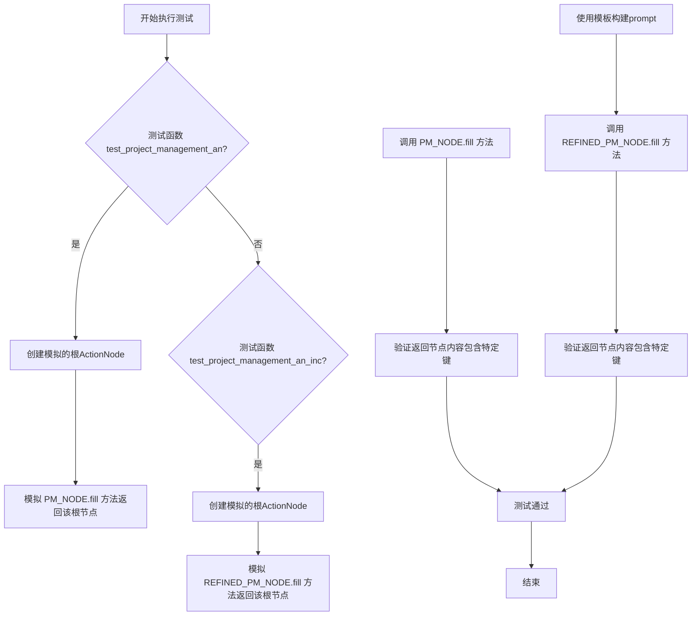
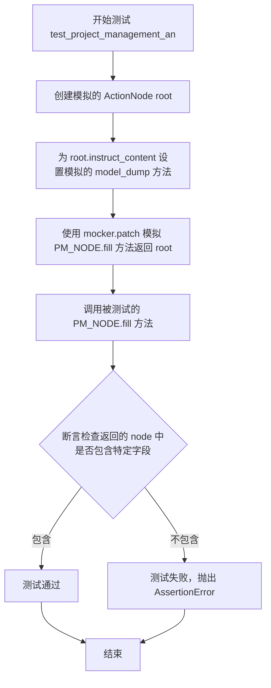
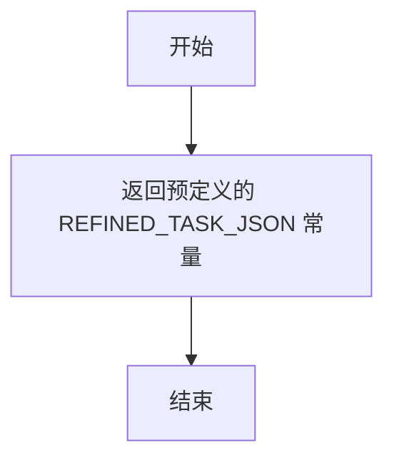
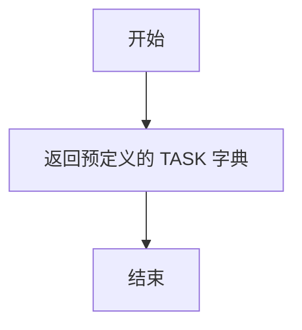
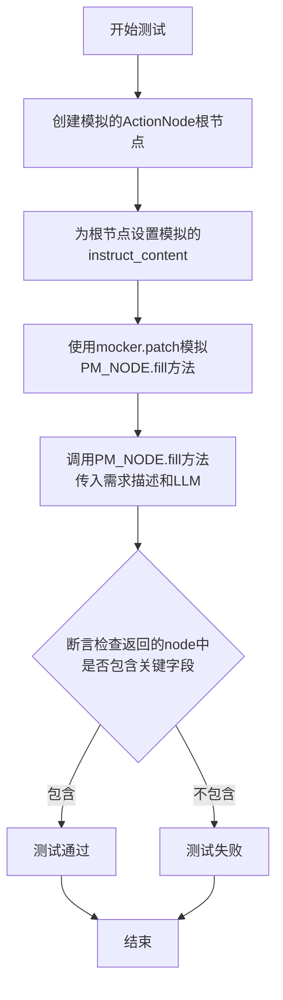
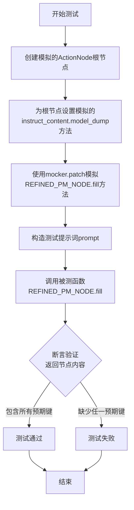
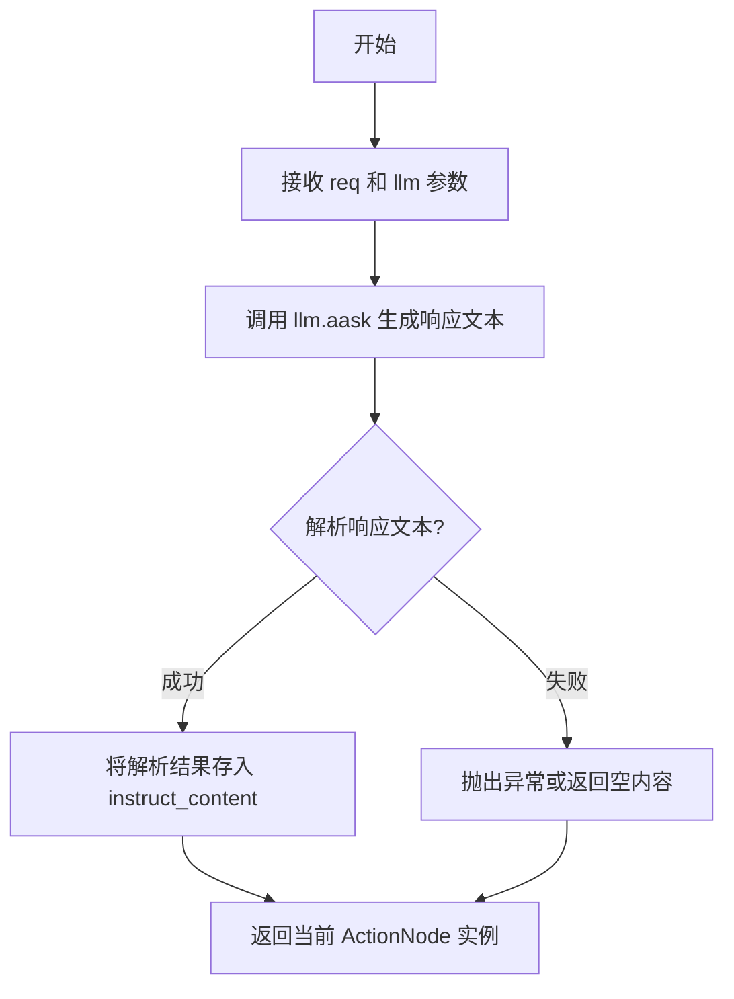
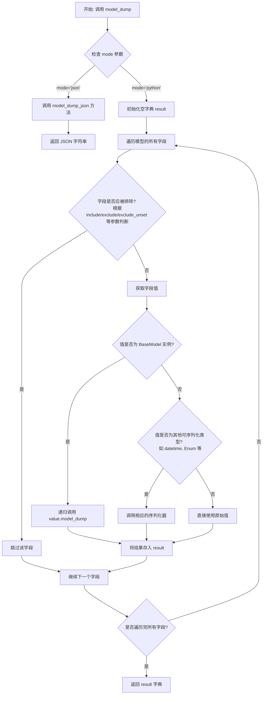

# `.\MetaGPT\tests\metagpt\actions\test_project_management_an.py` 详细设计文档

该文件是一个使用 pytest 框架编写的单元测试文件，用于测试 MetaGPT 框架中项目管理相关的 ActionNode 功能。它包含两个异步测试函数，分别测试 PM_NODE 和 REFINED_PM_NODE 这两个预定义节点在填充（fill）时的行为，验证它们能否根据给定的需求描述（req）和语言模型（llm）生成包含特定键（如“Logic Analysis”、“Task list”）的结构化输出。测试通过模拟（mock）底层节点填充方法和 instruct_content 来隔离外部依赖，专注于验证节点输出的数据结构。

## 整体流程



## 类结构

```
pytest.fixture (装饰器)
├── llm (fixture函数)
├── mock_refined_task_json (全局函数)
├── mock_task_json (全局函数)
├── test_project_management_an (异步测试函数)
└── test_project_management_an_inc (异步测试函数)
```

## 全局变量及字段


### `PM_NODE`
    
项目管理动作节点，用于初始项目任务分解和规划

类型：`ActionNode`
    


### `REFINED_PM_NODE`
    
精炼项目管理动作节点，用于增量开发中的任务更新和优化

类型：`ActionNode`
    


### `NEW_REQ_TEMPLATE`
    
新需求提示词模板，用于构建增量开发的任务更新请求

类型：`str`
    


### `REFINED_DESIGN_JSON`
    
精炼后的设计文档数据，作为项目管理的输入上下文

类型：`dict`
    


### `REFINED_TASK_JSON`
    
精炼后的任务列表数据，用于模拟测试中的预期输出

类型：`dict`
    


### `TASK_SAMPLE`
    
任务样本数据，代表旧的任务列表用于增量更新对比

类型：`str`
    


### `TASK`
    
初始任务列表数据，用于模拟测试中的预期输出

类型：`dict`
    


### `ActionNode.key`
    
动作节点的唯一标识符，用于在节点树中定位

类型：`str`
    


### `ActionNode.expected_type`
    
期望的输出数据类型，用于指导LLM生成结构化内容

类型：`type`
    


### `ActionNode.instruction`
    
节点指令说明，描述该节点需要完成的具体任务

类型：`str`
    


### `ActionNode.example`
    
示例输出，为LLM提供格式和内容的参考

类型：`str`
    


### `ActionNode.instruct_content`
    
结构化指令内容，存储LLM解析后的输出结果

类型：`BaseModel`
    
    

## 全局函数及方法

### `test_project_management_an`

这是一个使用 `pytest` 框架编写的异步测试函数，用于测试 `PM_NODE` 对象的 `fill` 方法。它通过模拟（mocking）`PM_NODE.fill` 方法的返回值，验证在给定特定输入（`req` 和 `llm`）时，返回的 `ActionNode` 对象的 `instruct_content` 中是否包含预期的关键字段。

参数：

-   `mocker`：`pytest-mock` 提供的 `MockerFixture` 类型对象，用于创建和管理测试中的模拟（mock）对象。

返回值：`None`，测试函数通常不显式返回值，其成功与否由 `assert` 语句决定。

#### 流程图



#### 带注释源码

```python
@pytest.mark.asyncio  # 标记此函数为异步测试函数
async def test_project_management_an(mocker):  # 定义异步测试函数，接收 mocker 夹具
    # 1. 准备模拟数据：创建一个 ActionNode 作为模拟的返回值
    root = ActionNode.from_children(
        "ProjectManagement",  # 节点名称
        [ActionNode(key="", expected_type=str, instruction="", example="")]  # 子节点列表（此处为空节点）
    )
    # 2. 为模拟的 root 节点设置 instruct_content 属性
    root.instruct_content = BaseModel()  # 创建一个空的 BaseModel 对象
    # 3. 将 mock_task_json 函数赋值给 model_dump 方法，模拟其返回预定义的 TASK 数据
    root.instruct_content.model_dump = mock_task_json

    # 4. 使用 mocker.patch 模拟 `PM_NODE.fill` 方法，使其在测试中直接返回准备好的 root 对象
    #    这样测试就不会真正调用 LLM 或执行复杂的 fill 逻辑。
    mocker.patch("metagpt.actions.project_management_an.PM_NODE.fill", return_value=root)

    # 5. 调用被测试的 `PM_NODE.fill` 方法（此时已被模拟）
    #    - req: 将 REFINED_DESIGN_JSON 字典转换为 markdown 字符串作为请求参数。
    #    - llm: 传入一个 LLM 实例（由 `llm` 夹具提供，在测试中可能未被实际使用）。
    node = await PM_NODE.fill(req=dict_to_markdown(REFINED_DESIGN_JSON), llm=llm)

    # 6. 断言验证：检查模拟返回的 node 对象的 instruct_content.model_dump() 结果
    #    是否包含预期的键（"Logic Analysis", "Task list", "Shared Knowledge"）。
    #    这些断言验证了 `fill` 方法返回的数据结构符合预期。
    assert "Logic Analysis" in node.instruct_content.model_dump()
    assert "Task list" in node.instruct_content.model_dump()
    assert "Shared Knowledge" in node.instruct_content.model_dump()
```

### `mock_refined_task_json`

该函数是一个测试辅助函数，用于在单元测试中模拟返回一个预定义的、经过精炼的任务JSON数据。它不接受任何参数，直接返回一个常量数据对象，以便在测试`project_management_an`模块时，能够隔离对外部数据源或复杂逻辑的依赖，确保测试的稳定性和可重复性。

参数：
- 无

返回值：`dict`，返回一个预定义的、表示精炼后任务列表的JSON数据字典。

#### 流程图



#### 带注释源码

```python
def mock_refined_task_json():
    # 函数体：直接返回从测试数据模块导入的常量 REFINED_TASK_JSON。
    # 该常量是一个字典，包含了用于测试的精炼后的任务数据。
    return REFINED_TASK_JSON
```

### `mock_task_json`

该函数是一个测试辅助函数，用于在单元测试中模拟返回一个预定义的、固定的任务JSON数据（`TASK`），从而避免在测试项目管理和任务生成逻辑时依赖外部数据源或复杂的对象构造过程。

参数：
- 无参数

返回值：`dict`，返回一个预定义的、表示任务数据的字典对象，用于模拟`ActionNode.instruct_content.model_dump`方法的返回值。

#### 流程图



#### 带注释源码

```python
def mock_task_json():
    # 该函数直接返回从测试数据模块导入的常量 TASK。
    # 此常量是一个字典，包含了模拟的任务结构数据。
    # 在测试中，它被用来模拟 ActionNode 的 instruct_content.model_dump 方法的返回值。
    return TASK
```

### `test_project_management_an`

该函数是一个异步单元测试，用于验证`PM_NODE`对象的`fill`方法在给定需求描述和语言模型的情况下，能够正确生成包含“Logic Analysis”、“Task list”和“Shared Knowledge”等关键字段的项目管理节点。

参数：
-  `mocker`：`pytest_mock.plugin.MockerFixture`，pytest-mock插件提供的mock对象，用于模拟函数或方法的行为。

返回值：`None`，该函数为测试函数，不返回业务值，仅通过断言验证测试结果。

#### 流程图



#### 带注释源码

```python
@pytest.mark.asyncio  # 标记此函数为异步测试函数
async def test_project_management_an(mocker):  # 定义异步测试函数，接收mocker参数用于模拟
    # 1. 创建模拟的ActionNode根节点
    root = ActionNode.from_children(
        "ProjectManagement", [ActionNode(key="", expected_type=str, instruction="", example="")]
    )
    # 2. 为根节点设置一个模拟的instruct_content属性，它是一个BaseModel对象
    root.instruct_content = BaseModel()
    # 3. 将BaseModel对象的model_dump方法替换为自定义的mock函数，使其返回预定义的TASK数据
    root.instruct_content.model_dump = mock_task_json
    # 4. 使用mocker模拟`project_management_an`模块中的`PM_NODE.fill`方法，
    #    使其在测试中不执行真实逻辑，而是直接返回上面准备好的模拟根节点`root`
    mocker.patch("metagpt.actions.project_management_an.PM_NODE.fill", return_value=root)

    # 5. 调用被测试的`PM_NODE.fill`方法。
    #    由于该方法已被模拟，所以实际调用的是上面设置的模拟函数，返回模拟的`root`节点。
    #    `req`参数：将REFINED_DESIGN_JSON字典转换为markdown格式字符串，作为需求描述。
    #    `llm`参数：传入一个LLM实例（在fixture中定义），但在模拟场景下可能不会被实际使用。
    node = await PM_NODE.fill(req=dict_to_markdown(REFINED_DESIGN_JSON), llm=llm)

    # 6. 断言：验证模拟返回的node节点的instruct_content.model_dump()结果中
    #    是否包含项目管理文档应有的关键部分。
    assert "Logic Analysis" in node.instruct_content.model_dump()
    assert "Task list" in node.instruct_content.model_dump()
    assert "Shared Knowledge" in node.instruct_content.model_dump()
```

### `test_project_management_an_inc`

这是一个使用 `pytest` 框架编写的异步单元测试函数，用于测试 `REFINED_PM_NODE.fill` 方法在增量开发场景下的功能。它通过模拟（Mock）底层依赖，验证了当给定一个包含旧任务和新设计上下文的提示时，`REFINED_PM_NODE` 能够正确生成包含“精炼逻辑分析”、“精炼任务列表”和“精炼共享知识”等关键字段的项目管理节点。

参数：

- `mocker`：`pytest-mock` 提供的 `MockerFixture` 类型对象，用于创建和管理测试中的模拟（Mock）对象，以隔离被测函数的外部依赖。

返回值：`None`，`pytest` 测试函数通常不显式返回值，其成功与否由断言（`assert`）决定。

#### 流程图



#### 带注释源码

```python
@pytest.mark.asyncio  # 标记此函数为异步测试，以便pytest-asyncio插件能正确处理
async def test_project_management_an_inc(mocker):  # 定义异步测试函数，接收mocker fixture
    # 1. 准备模拟数据：创建一个模拟的ActionNode作为根节点
    root = ActionNode.from_children(
        "RefinedProjectManagement",  # 节点名称
        [ActionNode(key="", expected_type=str, instruction="", example="")]  # 子节点列表（此处为空节点占位）
    )
    # 2. 为模拟的根节点设置一个模拟的`instruct_content`属性
    root.instruct_content = BaseModel()  # 创建一个空的BaseModel对象
    # 3. 将模拟的`model_dump`方法替换为返回预定义精炼任务JSON的函数
    root.instruct_content.model_dump = mock_refined_task_json  # `mock_refined_task_json`返回REFINED_TASK_JSON

    # 4. 使用mocker模拟`REFINED_PM_NODE.fill`方法，使其直接返回我们准备好的模拟根节点
    #    这样测试就不会真正调用LLM，实现了测试隔离。
    mocker.patch("metagpt.actions.project_management_an.REFINED_PM_NODE.fill", return_value=root)

    # 5. 构造测试输入：使用模板将旧任务样本和新的设计上下文格式化成提示词
    prompt = NEW_REQ_TEMPLATE.format(old_task=TASK_SAMPLE, context=dict_to_markdown(REFINED_DESIGN_JSON))

    # 6. 调用被测试的对象方法：执行`REFINED_PM_NODE.fill`（实际调用的是上面patch的模拟方法）
    node = await REFINED_PM_NODE.fill(req=prompt, llm=llm)  # `llm` 是另一个fixture提供的模拟LLM对象

    # 7. 断言验证：检查模拟返回的节点内容中是否包含增量项目管理所需的特定字段
    assert "Refined Logic Analysis" in node.instruct_content.model_dump()
    assert "Refined Task list" in node.instruct_content.model_dump()
    assert "Refined Shared Knowledge" in node.instruct_content.model_dump()
    # 如果所有断言通过，则测试成功。
```

### `ActionNode.from_children`

这是一个类方法，用于根据提供的子节点列表创建一个新的 `ActionNode` 实例。它通过组合子节点的键来生成新节点的键，并整合子节点的指令和示例，从而构建一个代表更复杂操作或数据结构的父节点。

参数：

- `name`：`str`，要创建的新 `ActionNode` 的名称。
- `children`：`List[ActionNode]`，用于构建新节点的子 `ActionNode` 对象列表。

返回值：`ActionNode`，返回一个根据提供的子节点构造的新 `ActionNode` 实例。

#### 流程图

```mermaid
flowchart TD
    A[开始: from_children(name, children)] --> B{children 列表是否为空?}
    B -- 是 --> C[抛出 ValueError 异常]
    B -- 否 --> D[初始化 key 为空字符串]
    D --> E[初始化 instruction 为空字符串]
    E --> F[初始化 example 为空字符串]
    F --> G[遍历 children 列表]
    G --> H{是否为第一个子节点?}
    H -- 是 --> I[key 追加子节点 key]
    H -- 否 --> J[key 追加 '\\n' 和子节点 key]
    I --> K[instruction 追加子节点 instruction]
    J --> K
    K --> L[example 追加子节点 example]
    L --> M[遍历结束?]
    M -- 否 --> G
    M -- 是 --> N[创建并返回新的 ActionNode<br/>key, str, instruction, example]
    N --> O[结束]
    C --> O
```

#### 带注释源码

```python
@classmethod
def from_children(cls, name: str, children: List["ActionNode"]) -> "ActionNode":
    """
    根据子节点列表创建一个新的 ActionNode。
    新节点的键、指令和示例由所有子节点的对应部分组合而成。

    Args:
        name (str): 新节点的名称。
        children (List[ActionNode]): 子节点列表。

    Returns:
        ActionNode: 一个新的 ActionNode 实例。

    Raises:
        ValueError: 如果 children 列表为空。
    """
    if not children:
        # 如果子节点列表为空，抛出异常
        raise ValueError("Children list cannot be empty")
    
    # 初始化用于构建新节点属性的变量
    key = ""
    instruction = ""
    example = ""
    
    # 遍历所有子节点，整合它们的属性
    for idx, child in enumerate(children):
        # 构建 key：第一个子节点的 key 直接使用，后续的用换行符分隔
        if idx == 0:
            key += child.key
        else:
            key += "\n" + child.key
        
        # 累加 instruction 和 example
        instruction += child.instruction
        example += child.example
    
    # 使用整合后的属性创建并返回一个新的 ActionNode 实例
    # 注意：新节点的 expected_type 被固定为 str
    return cls(key=key, expected_type=str, instruction=instruction, example=example, name=name)
```

### `ActionNode.fill`

该方法用于填充 ActionNode 的内容。它接收一个需求描述（`req`）和一个大语言模型实例（`llm`），通过调用 LLM 来生成符合节点预期的结构化内容，并将结果解析并存储到节点的 `instruct_content` 属性中。

参数：
- `req`：`str`，描述需要处理的需求或任务的文本。
- `llm`：`LLM`，用于生成内容的大语言模型实例。

返回值：`ActionNode`，返回填充了 `instruct_content` 的当前 ActionNode 实例本身。

#### 流程图



#### 带注释源码

```python
async def fill(self, req: str, llm: LLM) -> "ActionNode":
    """
    填充当前 ActionNode 的内容。
    
    该方法使用提供的大语言模型（LLM）根据给定的需求（req）生成内容，
    并将生成的内容解析并存储到节点的 `instruct_content` 属性中。
    
    Args:
        req (str): 描述需求或任务的文本。
        llm (LLM): 用于生成内容的大语言模型实例。
        
    Returns:
        ActionNode: 返回填充了内容的当前 ActionNode 实例。
    """
    # 调用 LLM 的 aask 方法，传入当前节点的提示模板和需求，生成响应文本
    rsp = await llm.aask(self.prompt_template.format(req=req))
    # 将 LLM 的响应文本解析为结构化的 InstructContent 对象
    self.instruct_content = self.parse_llm_rsp(rsp)
    # 返回当前节点实例，便于链式调用
    return self
```

### `BaseModel.model_dump`

`BaseModel.model_dump` 是 Pydantic `BaseModel` 类的一个实例方法，用于将模型实例序列化为一个字典。它递归地处理模型的所有字段，将字段名和对应的值（经过序列化处理后）组织成键值对，最终返回一个标准的 Python 字典。这是将 Pydantic 模型数据转换为易于存储、传输或进一步处理的通用格式（如 JSON）的关键步骤。

参数：
-  `self`：`BaseModel`，`BaseModel` 的一个实例，表示要序列化的数据模型。
-  `mode`：`str`，可选参数，指定序列化模式。通常为 `'python'`（返回 Python 原生对象）或 `'json'`（返回 JSON 字符串）。默认为 `'python'`。
-  `include`：`Union[AbstractSetIntStr, MappingIntStrAny]`，可选参数，指定要包含在输出中的字段。可以是字段名的集合或映射。
-  `exclude`：`Union[AbstractSetIntStr, MappingIntStrAny]`，可选参数，指定要从输出中排除的字段。可以是字段名的集合或映射。
-  `by_alias`：`bool`，可选参数，如果为 `True`，则使用字段的别名（通过 `Field` 的 `alias` 参数定义）作为字典的键；否则使用字段的原名。默认为 `False`。
-  `exclude_unset`：`bool`，可选参数，如果为 `True`，则排除未显式设置的字段（即使用默认值的字段）。默认为 `False`。
-  `exclude_defaults`：`bool`，可选参数，如果为 `True`，则排除值等于字段默认值的字段。默认为 `False`。
-  `exclude_none`：`bool`，可选参数，如果为 `True`，则排除值为 `None` 的字段。默认为 `False`。
-  `round_trip`：`bool`，可选参数，如果为 `True`，则序列化输出应能通过模型的 `parse_obj` 方法重新解析为相同的模型实例。这会影响某些类型的处理方式。默认为 `False`。
-  `warnings`：`bool`，可选参数，是否在序列化过程中发出警告。默认为 `True`。

返回值：`dict`，返回一个字典，其中键为字段名（或其别名），值为字段值经过序列化处理后的结果。

#### 流程图



#### 带注释源码

```python
def model_dump(
    self,
    *,
    mode: Literal['json', 'python'] = 'python',
    include: Union[AbstractSetIntStr, MappingIntStrAny] = None,
    exclude: Union[AbstractSetIntStr, MappingIntStrAny] = None,
    by_alias: bool = False,
    exclude_unset: bool = False,
    exclude_defaults: bool = False,
    exclude_none: bool = False,
    round_trip: bool = False,
    warnings: bool = True,
) -> dict:
    """
    将模型实例序列化为字典。
    
    这是 Pydantic BaseModel 的核心序列化方法。它根据提供的参数，有选择地将模型字段及其值转换为一个字典。
    处理过程包括字段筛选、别名处理、递归序列化嵌套模型以及特殊类型（如 datetime, Enum）的转换。
    
    Args:
        mode: 序列化模式。'python' 返回原生 Python 对象（字典），'json' 会委托给 `model_dump_json` 方法。
        include: 指定要包含的字段。
        exclude: 指定要排除的字段。
        by_alias: 是否使用字段别名作为字典键。
        exclude_unset: 是否排除未设置的字段（即仍为默认值的字段）。
        exclude_defaults: 是否排除值等于字段默认值的字段。
        exclude_none: 是否排除值为 None 的字段。
        round_trip: 是否确保序列化结果可被重新解析为相同的模型。
        warnings: 是否在序列化过程中显示警告。
        
    Returns:
        一个表示模型数据的字典。
        
    Raises:
        ValidationError: 如果序列化过程中数据验证失败（在特定模式下可能发生）。
    """
    # 如果模式是 'json'，则调用专门的 JSON 序列化方法
    if mode == 'json':
        return self.model_dump_json(
            include=include,
            exclude=exclude,
            by_alias=by_alias,
            exclude_unset=exclude_unset,
            exclude_defaults=exclude_defaults,
            exclude_none=exclude_none,
            round_trip=round_trip,
            warnings=warnings,
        )
        
    # 核心序列化逻辑（针对 'python' 模式）
    # 1. 获取模型的字段信息
    # 2. 根据 include/exclude 等参数构建要处理的字段集合
    # 3. 遍历字段，获取值并进行序列化
    # 4. 将序列化后的键值对存入结果字典
    
    # 以下为逻辑伪代码，展示主要步骤：
    result = {}
    # ... （内部实现细节，包括字段筛选、值获取、递归调用、特殊类型处理等）
    # 最终返回 result 字典
    return result
```

## 关键组件


### ActionNode

ActionNode 是用于构建和管理结构化指令节点的核心组件，它支持从子节点构建复杂节点、填充内容以及序列化输出。

### PM_NODE 与 REFINED_PM_NODE

PM_NODE 和 REFINED_PM_NODE 是预定义的 ActionNode 实例，分别用于初始项目管理和增量需求下的精炼项目管理，它们封装了特定的指令模板和结构。

### dict_to_markdown

这是一个工具函数，用于将字典数据结构转换为 Markdown 格式的字符串，以便作为提示词的一部分输入给语言模型。

### NEW_REQ_TEMPLATE

这是一个字符串模板，用于格式化增量开发场景下的新需求提示词，它整合了旧的任务列表和新的设计上下文。


## 问题及建议


### 已知问题

-   **测试用例过度依赖模拟 (Mocking)**：两个测试函数 (`test_project_management_an` 和 `test_project_management_an_inc`) 都完全模拟了 `PM_NODE.fill` 和 `REFINED_PM_NODE.fill` 方法，返回一个预构建的 `ActionNode`。这导致测试并未真正验证 `PM_NODE` 或 `REFINED_PM_NODE` 与 LLM 交互、解析输入并生成正确输出的核心逻辑，实质上只测试了模拟框架本身和断言语句。
-   **测试数据与逻辑耦合**：测试断言依赖于模拟方法返回的 `root.instruct_content.model_dump()` 的特定键名（如 `"Logic Analysis"`, `"Task list"`）。如果实际业务逻辑中这些键名发生变化，测试会失败，但失败原因并非业务逻辑错误，而是测试数据未同步更新，降低了测试的健壮性和可维护性。
-   **缺乏对异常和边界条件的测试**：当前测试只覆盖了“正常路径”（Happy Path）。没有测试用例来验证当输入 `req` 为空、格式错误，或 `llm` 参数异常时，`PM_NODE.fill` 和 `REFINED_PM_NODE.fill` 的行为是否符合预期（例如，是否抛出恰当的异常）。
-   **测试命名可读性不足**：测试函数名 `test_project_management_an_inc` 中的 `_inc` 后缀含义模糊，不能清晰表达其测试的是“增量”或“精化”场景。更好的命名应直接反映测试意图，如 `test_refined_project_management_an`。
-   **存在未使用的导入**：代码中导入了 `pytest` 但未使用其部分高级功能（这本身不是严重问题），但更重要的是，导入了 `NEW_REQ_TEMPLATE` 和 `dict_to_markdown` 等，这些在测试逻辑中虽被使用，但测试并未验证这些模板或函数转换的正确性对最终结果的影响，因为核心逻辑被模拟了。

### 优化建议

-   **重构测试策略，减少过度模拟**：应至少为 `PM_NODE` 和 `REFINED_PM_NODE` 编写集成测试或使用真实 LLM 的测试（可配置为使用测试专用的轻量级模型或 Mock LLM），以验证其完整的输入-输出转换逻辑。可以将当前测试视为“单元测试”，但需补充更贴近真实调用的测试。
-   **解耦测试数据与断言逻辑**：将测试中用于模拟返回的 JSON 数据（`TASK`, `REFINED_TASK_JSON`）中的关键字段提取为常量或配置文件。这样，当业务逻辑的键名变更时，只需在一个地方更新测试数据，避免散落在多个断言中。同时，考虑使用更灵活的断言，如检查 `instruct_content.model_dump()` 是否包含预期的键（而非固定字符串），或验证其结构是否符合预定义的 Schema。
-   **补充负面测试用例 (Negative Test Cases)**：增加测试用例来验证错误处理。例如：
    -   传入 `req=None` 或空字符串。
    -   传入格式严重不符合预期的 `req`。
    -   模拟 `llm.aask` 调用抛出异常，检查 `fill` 方法是否妥善处理。
-   **改善测试命名和结构**：
    -   将 `test_project_management_an_inc` 重命名为 `test_refined_project_management_an`，使其意图更明确。
    -   考虑使用 `pytest` 的 `parametrize` 来测试不同输入场景，减少重复代码。
-   **清理导入并增强测试覆盖**：移除未使用的导入。考虑为 `NEW_REQ_TEMPLATE` 的格式化功能、`dict_to_markdown` 的转换功能编写独立的单元测试，确保这些支撑组件的正确性，从而让主测试可以更专注于集成逻辑。
-   **考虑测试的可维护性与速度平衡**：在测试套件中区分纯单元测试（可大量模拟）和少量关键的集成/契约测试（使用真实或高度仿真的依赖）。确保集成测试能够快速运行（例如，使用内存数据库、模拟网络服务），以便在持续集成流程中频繁执行。


## 其它


### 设计目标与约束

本测试代码的设计目标是验证 `project_management_an` 模块中 `PM_NODE` 和 `REFINED_PM_NODE` 两个关键 `ActionNode` 的功能正确性。具体目标包括：1) 测试 `PM_NODE.fill` 方法能否根据给定的需求描述（`req`）生成包含“Logic Analysis”、“Task list”、“Shared Knowledge”等关键字段的项目管理结构；2) 测试 `REFINED_PM_NODE.fill` 方法能否在已有任务列表（`old_task`）和新的上下文（`context`）基础上，生成包含“Refined Logic Analysis”等字段的增量式项目管理结构。主要约束是测试环境需模拟 LLM 和 `ActionNode.fill` 方法的返回，以避免依赖外部服务和不稳定的生成结果，确保测试的确定性和可重复性。

### 错误处理与异常设计

测试代码本身不包含业务逻辑的错误处理，其设计重点在于验证正常路径下的功能。它通过 `pytest` 框架组织测试用例，并使用 `@pytest.mark.asyncio` 装饰器支持异步测试。当断言失败时，`pytest` 会抛出 `AssertionError` 并输出详细的失败信息，这是测试用例标准的行为模式。代码通过 `mocker.patch` 模拟了外部依赖（`PM_NODE.fill` 和 `REFINED_PM_NODE.fill`）的行为，确保了测试的隔离性，避免了因被模拟对象内部错误导致的测试失败，从而将测试焦点集中在接口契约的正确性上。

### 数据流与状态机

测试数据流清晰：1) 在 `test_project_management_an` 中，输入为 `REFINED_DESIGN_JSON` 转换的 Markdown 字符串，经过模拟的 `PM_NODE.fill` 处理后，输出一个预置了 `mock_task_json` 数据的 `ActionNode` 实例，最后验证该实例的 `instruct_content` 中是否包含预期字段。2) 在 `test_project_management_an_inc` 中，输入由 `TASK_SAMPLE` 和 `REFINED_DESIGN_JSON` 通过 `NEW_REQ_TEMPLATE` 格式化而成，经过模拟的 `REFINED_PM_NODE.fill` 处理后，输出一个预置了 `mock_refined_task_json` 数据的 `ActionNode` 实例，并进行字段验证。整个测试过程是线性的，没有复杂的状态迁移，核心是验证输入到输出的映射是否符合预期。

### 外部依赖与接口契约

测试代码明确声明并模拟了其外部依赖：1) `metagpt.actions.project_management_an.PM_NODE` 和 `REFINED_PM_NODE`：这两个是待测试的全局 `ActionNode` 实例。测试通过 `mocker.patch` 替换了它们的 `fill` 方法，约定其返回一个预构造的、包含特定 `instruct_content` 的 `ActionNode` 对象。2) `metagpt.llm.LLM`：通过 `pytest.fixture` 提供的 `llm` 实例，虽然在测试中被模拟覆盖而未实际使用，但其接口（作为 `fill` 方法的参数）仍需满足。3) 测试数据文件（如 `tests.data.incremental_dev_project.mock` 中的常量）：依赖这些常量提供一致的测试输入和模拟返回数据。测试的核心契约是验证被模拟的 `fill` 方法调用后，返回的 `ActionNode` 对象的 `instruct_content.model_dump()` 结果必须包含预定义的键（如“Task list”）。

### 测试策略与覆盖范围

本测试采用单元测试策略，并利用模拟（Mocking）技术进行隔离测试。它覆盖了 `project_management_an` 模块的两个主要公共接口：`PM_NODE.fill` 和 `REFINED_PM_NODE.fill`。测试覆盖了这两个接口在特定输入下的**正常行为**，即验证其输出结构是否包含必要的字段。然而，测试覆盖范围存在局限性：1) **未覆盖错误路径**：没有测试无效输入、LLM调用失败或网络异常等情况下的行为。2) **未测试逻辑正确性**：由于完全模拟了 `fill` 方法，并未测试其内部真正的提示词工程、LLM交互逻辑和结果解析逻辑是否正确。3) **依赖特定数据**：测试的有效性依赖于 `REFINED_DESIGN_JSON`、`TASK_SAMPLE` 等模拟数据的正确性，这些数据本身可能成为测试的脆弱点。测试的重点在于确认模块接口的稳定性和集成点，而非内部算法。

    