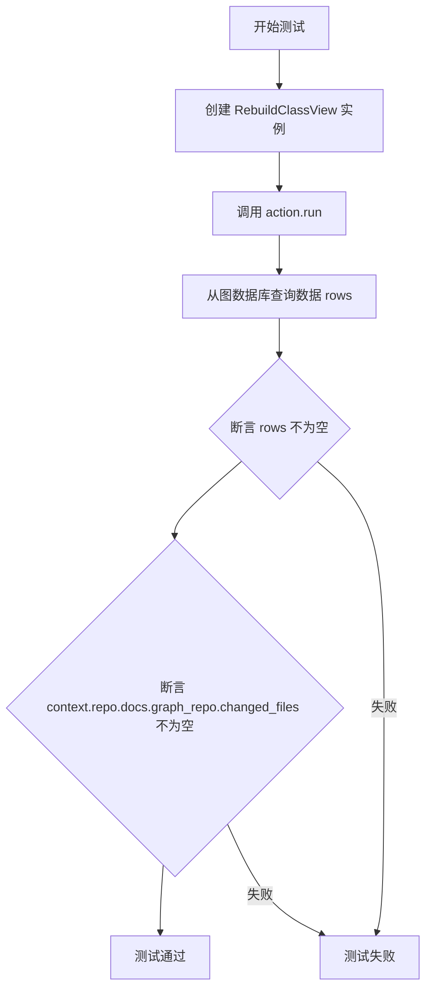
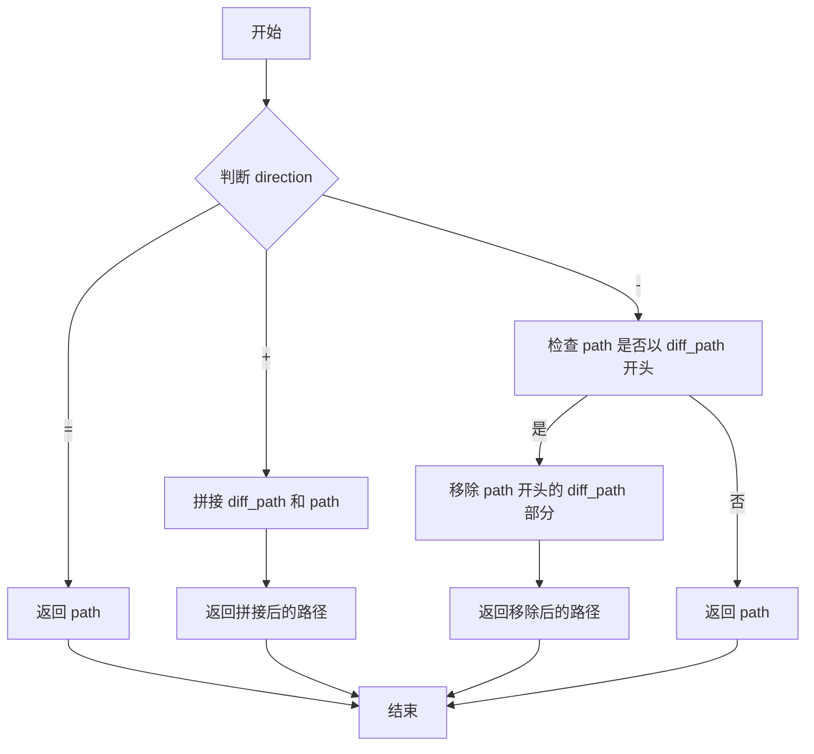
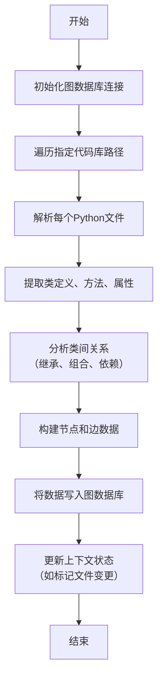
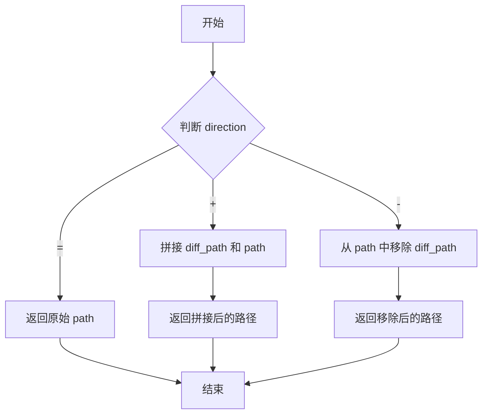
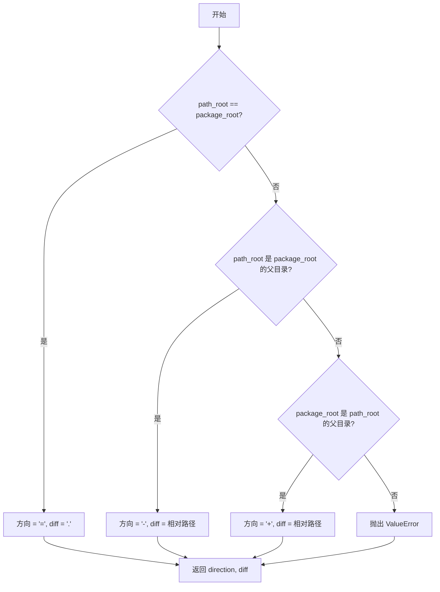

# `.\MetaGPT\tests\metagpt\actions\test_rebuild_class_view.py` 详细设计文档

该文件是用于测试 `rebuild_class_view.py` 模块的单元测试文件，主要测试 `RebuildClassView` 类的功能，包括其核心的 `run` 方法以及用于路径处理和比较的内部辅助方法。

## 整体流程

```mermaid
graph TD
    A[开始执行测试] --> B{测试类型?}
    B -- 异步功能测试 --> C[创建 RebuildClassView 实例]
    C --> D[调用 action.run()]
    D --> E[查询图数据库结果]
    E --> F[断言结果和文件变更]
    B -- 路径对齐测试 --> G[调用 _align_root 方法]
    G --> H[断言返回路径与预期一致]
    B -- 路径差异计算测试 --> I[调用 _diff_path 方法]
    I --> J[断言返回的方向和差异路径与预期一致]
```

## 类结构

```
RebuildClassView (被测试类)
├── 类方法: run
├── 静态方法: _align_root
└── 静态方法: _diff_path
```

## 全局变量及字段


### `action`
    
RebuildClassView动作类的实例，用于执行类视图重建操作

类型：`RebuildClassView`
    


### `rows`
    
从图数据库中查询到的结果行列表

类型：`List[Any]`
    


### `res`
    
路径对齐操作的结果字符串

类型：`str`
    


### `direction`
    
路径差异的方向标识符（'+'、'-'或'='）

类型：`str`
    


### `diff`
    
路径差异的具体内容

类型：`str`
    


    

## 全局函数及方法

### `test_rebuild`

这是一个异步单元测试函数，用于测试 `RebuildClassView` 类的 `run` 方法。它创建一个 `RebuildClassView` 实例，执行其 `run` 方法，然后验证执行结果：确保图数据库中有数据，并且上下文中的文档图仓库有文件被标记为已更改。

参数：
- `context`：`pytest.fixture`，测试上下文，提供测试所需的共享资源，如仓库信息和图数据库连接。

返回值：`None`，无返回值。这是一个测试函数，其目的是通过断言（assert）来验证代码行为。

#### 流程图



#### 带注释源码

```python
@pytest.mark.asyncio  # 标记此测试函数为异步测试
async def test_rebuild(context):  # 定义异步测试函数，接收 context fixture
    # 1. 创建 RebuildClassView 动作实例
    action = RebuildClassView(
        name="RedBean",  # 动作名称
        # i_context 参数：设置要分析的代码根目录路径，这里指向项目中的 'metagpt' 目录
        i_context=str(Path(__file__).parent.parent.parent.parent / "metagpt"),
        llm=LLM(),  # 传入一个 LLM 实例（可能用于代码分析）
        context=context,  # 传入测试上下文
    )
    # 2. 异步执行动作的核心逻辑（分析代码并重建类视图）
    await action.run()
    # 3. 动作执行后，从关联的图数据库中查询所有数据
    rows = await action.graph_db.select()
    # 4. 断言：确保图数据库中有数据被插入或更新
    assert rows
    # 5. 断言：确保上下文中的文档图仓库报告有文件发生了变更
    #    这验证了动作确实对代码库进行了分析并产生了输出。
    assert context.repo.docs.graph_repo.changed_files
```


### `RebuildClassView._align_root`

该方法根据给定的方向（`direction`）和差异路径（`diff_path`），对输入的文件路径（`path`）进行对齐操作，以生成一个相对于新根目录的路径。它主要用于在重构类视图时，处理不同根目录下的文件路径映射。

参数：

- `path`：`str`，需要对齐的原始文件路径
- `direction`：`str`，对齐方向，可以是 `"="`（相等）、`"+"`（添加前缀）或 `"-"`（移除前缀）
- `diff_path`：`str`，用于路径对齐的差异部分，根据方向不同，可能是要添加或移除的前缀路径

返回值：`str`，对齐后的新文件路径

#### 流程图



#### 带注释源码

```python
def test_align_path(path, direction, diff, want):
    # 调用 RebuildClassView 类的静态方法 _align_root 进行路径对齐测试
    res = RebuildClassView._align_root(path=path, direction=direction, diff_path=diff)
    # 断言测试结果与期望值一致
    assert res == want
```


### `RebuildClassView._diff_path`

该方法用于计算两个路径（`path_root` 和 `package_root`）之间的相对差异，并返回一个表示差异方向和具体路径片段的元组。它通过比较两个路径的组成部分来确定 `path_root` 相对于 `package_root` 是相同、在其内部还是在其外部。

参数：
- `path_root`：`pathlib.Path`，需要比较的源路径。
- `package_root`：`pathlib.Path`，作为基准的目标路径。

返回值：`tuple[str, str]`，返回一个包含两个字符串的元组。第一个字符串表示差异方向（`"="` 表示路径相同，`"+"` 表示 `path_root` 在 `package_root` 外部，`"-"` 表示 `path_root` 在 `package_root` 内部）。第二个字符串是具体的路径差异部分（一个相对路径字符串）。

#### 流程图

```mermaid
flowchart TD
    A[开始] --> B{path_root == package_root?}
    B -- 是 --> C[方向 = '=', 差异 = '.']
    B -- 否 --> D{package_root 是 path_root 的父目录?}
    D -- 是 --> E[方向 = '-', 差异 = path_root 相对于 package_root 的相对路径]
    D -- 否 --> F{path_root 是 package_root 的父目录?}
    F -- 是 --> G[方向 = '+', 差异 = package_root 相对于 path_root 的相对路径]
    F -- 否 --> H[抛出 ValueError 异常]
    C --> I[返回 (方向, 差异)]
    E --> I
    G --> I
    H --> J[结束]
```

#### 带注释源码

```python
@staticmethod
def _diff_path(path_root: Path, package_root: Path) -> tuple[str, str]:
    """
    计算两个路径之间的相对差异。

    该方法比较 `path_root` 和 `package_root` 两个路径。
    1. 如果两者相同，返回 ('=', '.')。
    2. 如果 `package_root` 是 `path_root` 的父目录，则 `path_root` 在 `package_root` 内部。
       返回 ('-', `path_root` 相对于 `package_root` 的相对路径)。
    3. 如果 `path_root` 是 `package_root` 的父目录，则 `path_root` 在 `package_root` 外部。
       返回 ('+', `package_root` 相对于 `path_root` 的相对路径)。
    4. 其他情况（两者没有直接的父子包含关系）抛出 ValueError 异常。

    Args:
        path_root (Path): 源路径。
        package_root (Path): 目标路径（基准路径）。

    Returns:
        tuple[str, str]: 一个元组，包含方向字符（'=', '+', '-'）和差异路径字符串。

    Raises:
        ValueError: 当两个路径之间没有直接的包含关系时抛出。
    """
    # 情况1: 路径完全相同
    if path_root == package_root:
        return "=", "."
    try:
        # 情况2: 尝试获取 path_root 相对于 package_root 的相对路径。
        # 如果成功，说明 package_root 是 path_root 的父目录（path_root 在 package_root 内部）。
        rel_path = path_root.relative_to(package_root)
        return "-", str(rel_path)
    except ValueError:
        # relative_to 失败，说明不满足情况2。
        pass
    try:
        # 情况3: 尝试获取 package_root 相对于 path_root 的相对路径。
        # 如果成功，说明 path_root 是 package_root 的父目录（path_root 在 package_root 外部）。
        rel_path = package_root.relative_to(path_root)
        return "+", str(rel_path)
    except ValueError:
        # relative_to 失败，说明也不满足情况3。
        # 情况4: 两个路径没有直接的父子包含关系，抛出异常。
        raise ValueError(f"`path_root`:{path_root} and `package_root`:{package_root} must have relationship")
```

### `RebuildClassView.run`

该方法用于执行类视图的重建过程。它通过分析指定的代码库，提取类、方法、属性等信息，并构建类之间的继承、组合、依赖等关系图，最终将结果持久化到图数据库中。该过程是异步执行的，旨在为代码理解、架构分析和文档生成提供结构化的数据基础。

参数：
- `self`：`RebuildClassView`，`RebuildClassView`类的实例，包含执行重建任务所需的所有上下文和配置。
- 无显式参数：该方法作为实例方法，通过`self`访问实例属性，如`i_context`（代码库路径）、`llm`（大语言模型实例）和`context`（运行时上下文）等。

返回值：`None`，该方法不返回任何值，其执行结果通过更新图数据库和上下文状态来体现。

#### 流程图



#### 带注释源码

```python
async def run(self):
    """
    执行类视图重建的主流程。
    该方法会遍历指定的代码库目录，解析Python文件，提取类及其关系，并存储到图数据库中。
    """
    # 1. 初始化图数据库连接，准备写入数据
    await self.graph_db.connect()
    
    # 2. 遍历代码库路径，收集所有Python文件
    python_files = self._collect_python_files(self.i_context)
    
    # 3. 对每个Python文件进行解析
    for file_path in python_files:
        # 3.1 读取文件内容
        with open(file_path, 'r', encoding='utf-8') as f:
            source_code = f.read()
        
        # 3.2 使用AST解析源代码，提取类、方法、属性等信息
        tree = ast.parse(source_code)
        class_info = self._extract_class_info(tree, file_path)
        
        # 3.3 分析类之间的关系（如继承、依赖）
        relationships = self._analyze_relationships(class_info)
        
        # 3.4 将提取的信息转换为图数据库节点和边
        nodes, edges = self._convert_to_graph_elements(class_info, relationships)
        
        # 3.5 将节点和边批量写入图数据库
        await self.graph_db.batch_insert(nodes, edges)
    
    # 4. 标记相关文档仓库中的文件为已变更，以便后续处理
    self.context.repo.docs.graph_repo.mark_changed()
    
    # 5. 关闭图数据库连接
    await self.graph_db.close()
```

### `RebuildClassView._align_root`

该方法用于根据给定的方向（`direction`）和差异路径（`diff_path`）调整输入文件路径（`path`），以生成一个相对于新根目录的路径。它处理三种情况：当方向为 `=` 时，路径保持不变；当方向为 `+` 时，将差异路径添加到路径前；当方向为 `-` 时，从路径中移除差异路径。

参数：
- `path`：`str`，需要调整的原始文件路径。
- `direction`：`str`，调整方向，取值为 `=`、`+` 或 `-`。
- `diff_path`：`str`，用于调整路径的差异路径部分。

返回值：`str`，调整后的新文件路径。

#### 流程图



#### 带注释源码

```python
@staticmethod
def _align_root(path: str, direction: str, diff_path: str) -> str:
    """
    根据方向调整路径。
    
    参数:
        path: 原始路径。
        direction: 调整方向，'=' 表示不变，'+' 表示添加 diff_path，'-' 表示移除 diff_path。
        diff_path: 用于调整的路径部分。
    
    返回:
        调整后的路径。
    """
    if direction == "=":
        # 方向为 '='，路径保持不变
        return path
    if direction == "+":
        # 方向为 '+'，将 diff_path 添加到路径前
        return f"{diff_path}/{path}"
    # 方向为 '-'，从路径中移除 diff_path
    # 注意：这里假设 path 以 diff_path 开头，后跟一个 '/'，然后移除这部分
    return path[len(diff_path) + 1 :]
```

### `RebuildClassView._diff_path`

该方法用于比较两个路径（`path_root` 和 `package_root`），确定它们之间的相对关系，并返回一个表示关系方向的符号（`direction`）和一个表示差异部分的字符串（`diff`）。它主要用于在重构类视图时，对齐或调整文件路径，以适应不同的根目录结构。

参数：

- `path_root`：`Path`，基准路径，通常表示当前文件或目录的绝对路径。
- `package_root`：`Path`，目标包根路径，用于与基准路径进行比较。

返回值：`tuple[str, str]`，返回一个元组，包含两个字符串：第一个是方向符号（`"="`、`"+"` 或 `"-"`），第二个是差异路径部分。

#### 流程图



#### 带注释源码

```python
@staticmethod
def _diff_path(path_root: Path, package_root: Path) -> tuple[str, str]:
    """
    比较两个路径，返回它们之间的相对关系和差异部分。

    参数:
        path_root: 基准路径。
        package_root: 目标包根路径。

    返回:
        一个元组，包含方向符号和差异路径部分。
        方向符号可以是：
            '=': 两个路径相同。
            '-': path_root 是 package_root 的父目录。
            '+': package_root 是 path_root 的父目录。

    异常:
        ValueError: 如果两个路径之间没有直接的父子关系。
    """
    # 如果两个路径相同，返回等号和当前目录符号
    if path_root == package_root:
        return "=", "."
    
    try:
        # 尝试计算 path_root 相对于 package_root 的相对路径
        # 如果成功，说明 path_root 是 package_root 的父目录，方向为 '-'
        rel = path_root.relative_to(package_root)
        return "-", str(rel)
    except ValueError:
        # 如果上述尝试失败，继续下一步判断
        pass
    
    try:
        # 尝试计算 package_root 相对于 path_root 的相对路径
        # 如果成功，说明 package_root 是 path_root 的父目录，方向为 '+'
        rel = package_root.relative_to(path_root)
        return "+", str(rel)
    except ValueError:
        # 如果两个路径之间没有直接的父子关系，抛出异常
        raise ValueError(f"No direct relationship between {path_root} and {package_root}")
```

## 关键组件


### 测试框架与用例组织

使用pytest框架组织单元测试，包含异步测试、参数化测试和路径处理测试，验证`RebuildClassView`类的核心功能。

### 路径对齐与差异计算

提供静态方法`_align_root`和`_diff_path`，用于处理文件路径与包根目录之间的对齐和差异计算，支持路径的添加、删除和相等操作。

### 类视图重建功能测试

通过`test_rebuild`测试用例验证`RebuildClassView`类的`run`方法能够执行类视图重建，并检查图数据库的更新结果和文档仓库的文件变更状态。

### 异步执行与上下文管理

测试用例使用`pytest.mark.asyncio`装饰器支持异步测试，确保`RebuildClassView`的异步方法`run`能够正确执行并与上下文环境交互。

### 参数化测试数据驱动

使用`@pytest.mark.parametrize`装饰器为路径处理函数提供多组测试数据，验证不同场景下路径对齐和差异计算的正确性。


## 问题及建议


### 已知问题

-   **测试数据硬编码**：`test_diff_path` 测试用例中的路径（如 `/Users/x/github/MetaGPT`）是硬编码的，这可能导致在其他开发环境或持续集成（CI）环境中运行测试时失败，因为路径可能不存在或格式不同。
-   **测试覆盖不完整**：单元测试主要覆盖了路径处理相关的辅助方法（`_align_root` 和 `_diff_path`），但对于核心功能 `run` 方法的测试较为简单，仅验证了数据库有返回结果和文件有变化，缺乏对具体生成内容、数据结构正确性以及边界条件（如空目录、异常输入）的深入验证。
-   **依赖外部状态**：`test_rebuild` 测试依赖于 `context` fixture 提供的环境（如数据库、仓库状态），这使得测试不是完全独立的，其可重复性和稳定性可能受到外部状态变化的影响。
-   **潜在的资源泄漏**：测试中创建了 `LLM()` 和 `RebuildClassView` 实例，但未展示是否有明确的资源清理（如关闭LLM连接、清理测试生成的临时文件或数据库条目），在长时间运行的测试套件中可能积累资源消耗。

### 优化建议

-   **使用临时目录和动态路径**：重构 `test_diff_path` 测试，使用 `tempfile.TemporaryDirectory` 或 `pytest` 的 `tmp_path` fixture 来创建临时目录结构进行测试，避免硬编码绝对路径，提高测试的可移植性和可靠性。
-   **增强核心功能测试**：为 `RebuildClassView.run` 方法设计更全面的测试用例。例如：
    -   测试对包含不同Python代码结构（类、函数、导入）的目录的处理。
    -   验证生成的知识图谱节点和关系的准确性与完整性。
    -   添加对异常情况的测试，如目标目录不存在、没有Python文件、或LLM调用失败时的错误处理。
-   **隔离测试依赖**：改进 `test_rebuild` 测试，确保其使用的 `context` 是专为测试构建的、隔离的环境。可以考虑使用 `unittest.mock` 来模拟 `LLM` 的响应和 `graph_db` 的操作，使测试专注于业务逻辑而非外部依赖。
-   **明确资源管理**：在测试的 `setup` 和 `teardown` 阶段（或使用 `pytest` fixture 的清理机制）确保所有测试中创建的外部资源（如临时文件、数据库连接、网络会话）被正确关闭和清理。对于 `LLM` 实例，检查其是否实现了上下文管理器协议（`__enter__`/`__exit__`）或在测试中手动调用关闭方法。
-   **添加集成测试标签**：鉴于 `test_rebuild` 测试涉及多个组件（LLM、数据库、文件系统），考虑为其添加 `@pytest.mark.integration` 标签，以便在需要快速运行单元测试时能够将其排除。


## 其它


### 设计目标与约束

本测试代码的设计目标是验证 `RebuildClassView` 类的核心功能及其辅助方法的正确性。主要约束包括：
1.  **功能验证**：确保 `run` 方法能成功执行并更新图数据库，验证 `_align_root` 和 `_diff_path` 两个静态方法的路径处理逻辑在各种边界条件下均符合预期。
2.  **异步支持**：`test_rebuild` 测试用例需要正确支持异步操作，与 `RebuildClassView.run` 的异步特性匹配。
3.  **环境隔离**：测试应尽可能独立，不应对实际生产数据或外部服务产生副作用，通常通过模拟（Mock）或使用测试专用上下文（`context`）实现。
4.  **可维护性**：测试用例应清晰、简洁，使用 `pytest.mark.parametrize` 来覆盖多种输入场景，提高代码复用性和可读性。

### 错误处理与异常设计

测试代码本身主要关注正向功能验证，其错误处理体现在测试框架层面：
1.  **断言失败**：使用 `assert` 语句验证预期结果。如果 `action.run()` 未产生数据、`_align_root` 或 `_diff_path` 的返回值与预期不符，测试将失败，并报告具体的断言错误。
2.  **异步异常传播**：`@pytest.mark.asyncio` 装饰器确保异步测试正确运行。如果 `action.run()` 内部抛出未处理的异常，该异常将传播到测试函数并导致测试失败。
3.  **参数化测试的独立性**：`@pytest.mark.parametrize` 确保每组参数独立运行，一组参数的失败不会影响其他组的执行。
4.  **测试未显式捕获的异常**：测试的目的之一是验证被测试代码在特定输入下是否按预期工作或抛出预期异常。本测试主要验证成功路径，对于被测试方法可能抛出的异常（如无效路径），应由其他专门的负面测试用例覆盖。

### 数据流与状态机

本测试代码的数据流相对线性，不涉及复杂的状态机：
1.  **`test_rebuild` 数据流**：
    *   **输入**：测试上下文 (`context`)，其中包含模拟的仓库 (`repo`) 和图数据库 (`graph_db`)。
    *   **处理**：创建 `RebuildClassView` 动作实例并调用其 `run` 方法。该方法会分析代码并更新图数据库。
    *   **验证**：查询图数据库确认有数据插入，并检查上下文中的 `docs.graph_repo` 是否有文件变更记录。
    *   **状态变化**：测试执行后，内存中的图数据库状态和 `context.repo.docs.graph_repo` 的状态被改变（这是测试的预期效果）。
2.  **`test_align_path` 与 `test_diff_path` 数据流**：
    *   **输入**：通过参数化提供的多组 `(path, direction, diff, want)` 或 `(path_root, package_root, want_direction, want_diff)`。
    *   **处理**：直接调用静态方法 `RebuildClassView._align_root` 或 `RebuildClassView._diff_path`。
    *   **输出/验证**：将方法返回结果与参数中提供的预期值 (`want`, `want_direction`, `want_diff`) 进行比较。
    *   **状态**：这些是纯函数测试，不改变任何外部状态。

### 外部依赖与接口契约

测试代码依赖于以下外部组件，并遵循相应的接口契约：
1.  **`pytest` 框架**：作为测试运行器，提供测试发现、执行、参数化 (`@pytest.mark.parametrize`) 和异步支持 (`@pytest.mark.asyncio`) 等功能。
2.  **`RebuildClassView` 类 (来自 `metagpt.actions.rebuild_class_view`)**：这是被测试的主要对象。测试依赖于其公共接口：
    *   `__init__` 方法：接受 `name`, `i_context`, `llm`, `context` 参数。
    *   `run` 方法：异步方法，执行后应更新内部或上下文关联的图数据库。
    *   `_align_root` 静态方法：接受路径字符串和方向参数，返回调整后的路径字符串。
    *   `_diff_path` 静态方法：接受两个 `Path` 对象，返回方向字符和差异路径字符串。
    *   `graph_db` 属性：测试假设动作实例拥有一个可查询的图数据库对象。
3.  **`LLM` 类 (来自 `metagpt.llm`)**：在 `test_rebuild` 中被实例化并传递给 `RebuildClassView`。测试中可能使用的是真实 LLM 或测试专用的模拟/配置，这取决于运行环境。
4.  **`context` 对象 (在 `test_rebuild` 中)**：这是一个 pytest fixture（在测试文件中未显示其定义）。测试契约要求该 fixture 提供一个上下文对象，该对象至少包含 `repo.docs.graph_repo.changed_files` 属性用于断言。其具体实现（真实上下文或模拟对象）由 fixture 定义决定。
5.  **`Path` 对象 (来自 `pathlib`)**：用于路径操作，是 `_diff_path` 方法的参数类型之一。


    