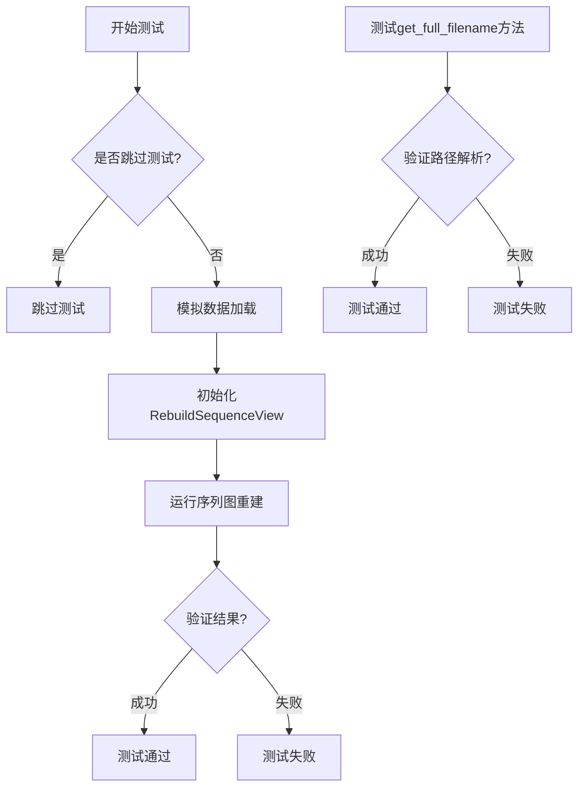
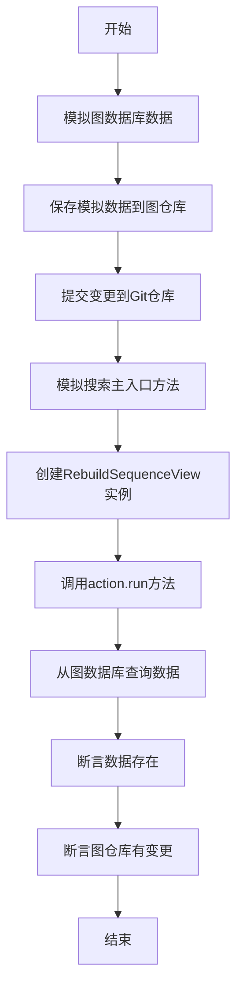
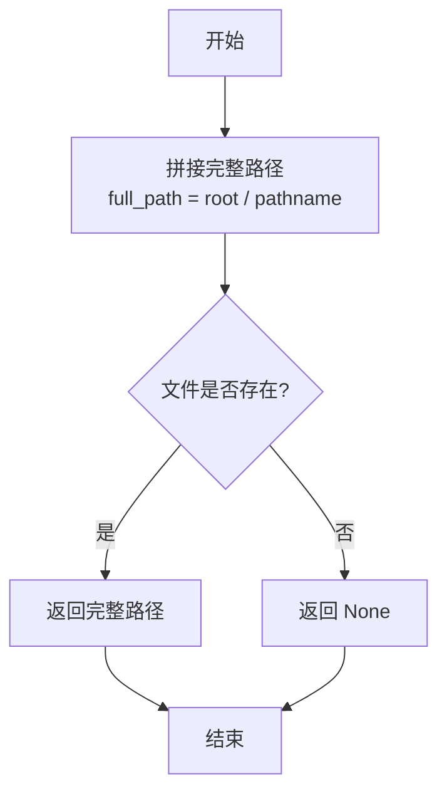
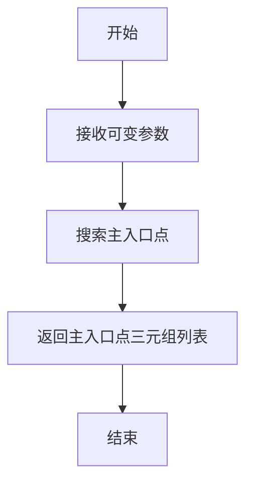
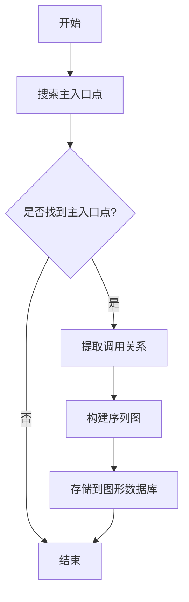

# `.\MetaGPT\tests\metagpt\actions\test_rebuild_sequence_view.py` 详细设计文档

该文件是一个单元测试文件，用于测试从源代码项目中重建序列图的功能。它包含了对RebuildSequenceView类的测试，包括模拟数据、测试主入口点搜索功能以及验证序列图重建的正确性。

## 整体流程



## 类结构

```
RebuildSequenceView (被测试类)
├── 类方法: get_full_filename
├── 类方法: _search_main_entry
└── 实例方法: run
测试函数
├── test_rebuild (异步测试)
└── test_get_full_filename (参数化测试)
```

## 全局变量及字段


### `data`
    
从文件中读取的图数据库JSON数据字符串。

类型：`str`
    


### `graph_db_filename`
    
图数据库文件的路径对象，基于上下文工作目录生成。

类型：`Path`
    


### `mock_spo`
    
模拟的SPO（Subject-Predicate-Object）三元组对象，用于测试主入口点搜索功能。

类型：`SPO`
    


### `action`
    
RebuildSequenceView动作类的实例，用于执行序列图重建测试。

类型：`RebuildSequenceView`
    


### `rows`
    
从图数据库中查询得到的SPO三元组结果列表。

类型：`List[SPO]`
    


### `res`
    
根据根目录和相对路径名解析得到的完整文件路径，可能为None。

类型：`Path | None`
    


### `root`
    
测试函数中用于解析文件路径的根目录路径对象。

类型：`Path`
    


### `pathname`
    
测试函数中用于解析文件路径的相对路径字符串。

类型：`str`
    


### `want`
    
测试函数中期望得到的完整文件路径结果，用于断言验证。

类型：`Path | None`
    


    

## 全局函数及方法

### `test_rebuild`

这是一个异步单元测试函数，用于测试`RebuildSequenceView`类的`run`方法。它通过模拟数据、设置测试环境，并调用目标方法来验证序列图重建功能是否正常工作，最终断言图数据库中存在数据且图仓库有文件变更。

参数：

- `context`：`pytest fixture`，测试上下文对象，提供代码仓库、图数据库等测试环境。
- `mocker`：`pytest-mock`的`mocker`对象，用于模拟（mock）对象和方法。

返回值：`None`，无返回值。

#### 流程图



#### 带注释源码

```python
@pytest.mark.skip  # 标记此测试为跳过，不执行
@pytest.mark.asyncio  # 标记为异步测试
async def test_rebuild(context, mocker):
    # Mock
    # 读取模拟的图数据库数据文件
    data = await aread(filename=Path(__file__).parent / "../../data/graph_db/networkx.class_view.json")
    # 构造图数据库文件名，基于上下文工作目录
    graph_db_filename = Path(context.repo.workdir.name).with_suffix(".json")
    # 将模拟数据保存到图仓库
    await context.repo.docs.graph_repo.save(filename=str(graph_db_filename), content=data)
    # 将图数据库文件标记为未跟踪变更，并添加到Git仓库
    context.git_repo.add_change({f"{GRAPH_REPO_FILE_REPO}/{graph_db_filename}": ChangeType.UNTRACTED})
    context.git_repo.commit("commit1")  # 提交变更
    # 模拟`_search_main_entry`方法返回一个SPO对象，表示代码中的主入口点
    mock_spo = SPO(
        subject="metagpt/management/skill_manager.py:__name__:__main__",
        predicate="has_page_info",
        object_='{"lineno":113,"end_lineno":116,"type_name":"ast.If","tokens":["__name__","__main__"],"properties":{}}',
    )
    mocker.patch.object(RebuildSequenceView, "_search_main_entry", return_value=[mock_spo])

    # 创建RebuildSequenceView动作实例，传入名称、上下文路径、LLM和测试上下文
    action = RebuildSequenceView(
        name="RedBean",
        i_context=str(
            Path(__file__).parent.parent.parent.parent / "metagpt/management/skill_manager.py:__name__:__main__"
        ),
        llm=LLM(),
        context=context,
    )
    await action.run()  # 执行序列图重建动作
    rows = await action.graph_db.select()  # 从图数据库查询数据
    assert rows  # 断言查询结果不为空
    assert context.repo.docs.graph_repo.changed_files  # 断言图仓库有文件变更
```

### `RebuildSequenceView.get_full_filename`

该方法用于根据给定的根目录和相对路径名，解析并返回完整的文件路径对象。如果文件不存在，则返回 `None`。

参数：

- `root`：`Path`，搜索的根目录路径
- `pathname`：`str`，相对于根目录的文件路径名

返回值：`Path`，如果文件存在则返回完整的 `Path` 对象，否则返回 `None`

#### 流程图

```mermaid
flowchart TD
    A[开始] --> B[构造完整路径<br>full_path = root / pathname]
    B --> C{文件是否存在?<br>full_path.exists()}
    C -- 是 --> D[返回 full_path]
    C -- 否 --> E[返回 None]
    D --> F[结束]
    E --> F
```

#### 带注释源码

```python
def test_get_full_filename(root, pathname, want):
    # 调用 RebuildSequenceView 类的静态方法 get_full_filename
    # 传入根目录路径 root 和相对路径名 pathname
    res = RebuildSequenceView.get_full_filename(root=root, pathname=pathname)
    # 断言返回结果 res 与期望值 want 相等
    assert res == want
```

### `RebuildSequenceView.get_full_filename`

该方法用于根据给定的根目录和相对路径名，解析并返回完整的文件路径。如果文件不存在，则返回 `None`。

参数：

- `root`：`Path`，根目录路径
- `pathname`：`str`，相对路径名

返回值：`Path`，完整的文件路径，如果文件不存在则返回 `None`

#### 流程图



#### 带注释源码

```python
@staticmethod
def get_full_filename(root: Path, pathname: str) -> Path:
    """
    根据根目录和相对路径名返回完整的文件路径。
    
    参数:
        root: 根目录路径
        pathname: 相对路径名
        
    返回:
        完整的文件路径，如果文件不存在则返回 None
    """
    # 拼接根目录和相对路径名
    full_path = root / pathname
    
    # 检查文件是否存在
    if full_path.exists():
        return full_path
    else:
        return None
```

### `RebuildSequenceView._search_main_entry`

该方法用于在代码库中搜索主入口点（即 `if __name__ == "__main__":` 语句），并返回相关的三元组信息。

参数：

-  `self`：`RebuildSequenceView`，当前 `RebuildSequenceView` 类的实例
-  `*args`：`tuple`，可变位置参数，用于接收额外的参数
-  `**kwargs`：`dict`，可变关键字参数，用于接收额外的关键字参数

返回值：`list[SPO]`，返回一个包含主入口点三元组信息的列表

#### 流程图



#### 带注释源码

```python
def _search_main_entry(self, *args, **kwargs):
    """
    搜索代码库中的主入口点（即 `if __name__ == "__main__":` 语句）。
    该方法通过查询图数据库或解析源代码来定位主入口点，并返回相关的三元组信息。

    参数：
        *args: 可变位置参数，用于接收额外的参数。
        **kwargs: 可变关键字参数，用于接收额外的关键字参数。

    返回值：
        list[SPO]: 返回一个包含主入口点三元组信息的列表。
    """
    # 由于代码片段中未提供具体实现，此处为占位符。
    # 实际实现可能包括：
    # 1. 查询图数据库以获取主入口点信息。
    # 2. 解析源代码文件，查找 `if __name__ == "__main__":` 语句。
    # 3. 将找到的主入口点信息封装为 SPO 对象并返回。
    pass
```

### `RebuildSequenceView.run`

该方法用于从源代码项目中重建序列图。它通过分析代码中的主入口点，提取相关的调用关系，并将这些关系以序列图的形式存储在图形数据库中，从而帮助开发者理解和可视化代码的执行流程。

参数：

-  `self`：`RebuildSequenceView`，RebuildSequenceView类的实例
-  无其他显式参数

返回值：`None`，无返回值

#### 流程图



#### 带注释源码

```python
async def run(self):
    """
    执行序列图重建的主要方法。
    该方法会搜索代码中的主入口点，提取调用关系，并构建序列图存储到图形数据库中。
    """
    # 搜索主入口点
    main_entries = await self._search_main_entry()
    if not main_entries:
        # 如果没有找到主入口点，则直接返回
        return

    # 提取调用关系
    call_relations = await self._extract_call_relations(main_entries)
    
    # 构建序列图
    sequence_diagram = await self._build_sequence_diagram(call_relations)
    
    # 存储到图形数据库
    await self._save_to_graph_db(sequence_diagram)
```

## 关键组件


### 测试框架与依赖管理

使用pytest框架进行异步单元测试，通过mocker进行对象方法的模拟，以隔离外部依赖并验证`RebuildSequenceView`类的核心功能。

### 数据准备与模拟

通过读取预设的图数据库JSON文件来模拟项目上下文，并使用`SPO`（Subject-Predicate-Object）三元组模拟代码的主入口点搜索，为测试序列图重建功能提供初始数据。

### 功能类测试

针对`RebuildSequenceView`类的`run`方法进行集成测试，验证其能否根据模拟的代码入口点成功执行序列图重建，并检查图数据库的更新状态。

### 工具函数测试

对`RebuildSequenceView`类的静态工具方法`get_full_filename`进行参数化测试，验证其根据根目录和相对路径解析出完整文件路径的逻辑正确性。


## 问题及建议


### 已知问题

-   **测试用例被跳过**：`test_rebuild` 函数被 `@pytest.mark.skip` 装饰器标记，这意味着该测试在常规测试运行中不会执行，可能导致相关功能未经充分验证。
-   **硬编码的测试数据路径**：测试中使用了硬编码的相对路径（如 `"../../data/graph_db/networkx.class_view.json"`）来加载测试数据。这可能导致测试在不同环境或目录结构下运行失败。
-   **模拟对象过于具体**：`test_rebuild` 中模拟的 `_search_main_entry` 方法返回一个硬编码的 `SPO` 对象。这使得测试与特定实现细节（如特定的代码文件和行号）紧密耦合，降低了测试的健壮性和可维护性。
-   **潜在的资源依赖**：测试依赖于 `context` fixture 提供的工作目录和Git仓库环境。如果 `context` 的设置不完整或状态不正确，测试可能会失败。
-   **断言条件可能不充分**：测试断言 `rows` 和 `changed_files` 存在，但未验证其具体内容或行为是否符合预期，可能导致测试通过但功能实际不正确。

### 优化建议

-   **移除或条件化跳过标记**：评估 `test_rebuild` 被跳过的原因。如果是暂时性的（如依赖外部资源），考虑使用 `@pytest.mark.skipif` 进行条件跳过，或修复根本问题后移除装饰器，以确保关键功能被持续测试。
-   **使用更稳健的路径处理**：利用 `pytest` 的 `datafiles` 机制或项目根目录的绝对路径来定位测试数据文件，避免硬编码的相对路径，提高测试的可移植性。
-   **抽象和泛化模拟数据**：将模拟的 `SPO` 数据提取到测试夹具（fixture）或常量中，或者根据被测逻辑动态生成模拟数据，减少测试与具体数据值的耦合。
-   **增强测试的隔离性**：确保 `context` fixture 能为每个测试提供干净、隔离的环境。可以考虑在测试中更明确地设置和清理所需的状态，或使用 `mocker` 更彻底地模拟外部依赖。
-   **补充更具体的断言**：在现有断言基础上，增加对 `rows` 数据结构、内容以及 `changed_files` 具体变更的验证。例如，可以断言生成的序列图节点和边的数量或关键属性，使测试更能捕获功能回归。
-   **考虑增加负面测试用例**：添加测试用例来验证代码在输入无效路径、空数据或异常情况下的行为，提高代码的鲁棒性。
-   **将工具函数测试参数化**：`test_get_full_filename` 已经良好地使用了 `@pytest.mark.parametrize`。可以沿用此模式，为其他复杂方法添加类似的参数化测试，覆盖更多边界情况。


## 其它


### 设计目标与约束

本单元测试模块的设计目标是验证 `RebuildSequenceView` 类（一个用于从源代码项目重建序列图视图的动作）的核心功能。主要约束包括：1) 测试环境需要模拟一个包含图数据库（graph repository）的代码仓库上下文；2) 需要模拟 `_search_main_entry` 方法的返回值以控制测试流程；3) 测试应验证动作执行后图数据库的状态变化以及上下文中文档图仓库的变更状态。

### 错误处理与异常设计

测试代码中主要包含以下错误处理与异常设计：1) 使用 `pytest.mark.skip` 和 `pytest.mark.asyncio` 装饰器来管理异步测试的执行和跳过；2) 在 `test_get_full_filename` 参数化测试中，通过断言 `res == want` 来验证 `get_full_filename` 静态方法在正常路径和无效路径下的行为，无效路径预期返回 `None`；3) 测试依赖于 `mocker.patch.object` 来模拟内部方法，确保测试的独立性和可重复性，避免因外部依赖（如实际的文件搜索逻辑）失败而导致测试失败。

### 数据流与状态机

测试的数据流如下：1) 准备阶段：读取预设的图数据库JSON数据文件，将其保存到测试上下文（`context`）的图仓库中，并通过 `git_repo` 模拟一次提交。2) 模拟阶段：使用 `mocker` 将 `RebuildSequenceView._search_main_entry` 方法的返回值固定为一个预定义的 `SPO` 对象，该对象模拟了在指定文件中找到的主入口点信息。3) 执行阶段：实例化 `RebuildSequenceView` 动作并异步执行其 `run` 方法。4) 验证阶段：断言动作执行后图数据库中存在数据行，并且上下文中的文档图仓库有文件被标记为已更改。整个测试过程模拟了从加载历史数据、定位入口点到执行重建并更新图状态的一个简化流程。

### 外部依赖与接口契约

测试模块的外部依赖与接口契约包括：1) **pytest框架**：用于组织测试用例、参数化测试和异步测试执行。2) **metagpt.actions.rebuild_sequence_view.RebuildSequenceView**：被测类，测试依赖于其 `run` 方法、`graph_db` 属性以及静态方法 `get_full_filename` 的公共接口。3) **metagpt.utils.git_repository.ChangeType** 和 **metagpt.utils.graph_repository.SPO**：用于构造测试数据。4) **metagpt.llm.LLM**：作为动作的依赖项被实例化，但在本测试中被模拟，未实际调用其功能。5) **context fixture**：一个pytest fixture，提供测试所需的仓库上下文环境，包括 `repo.docs.graph_repo` 和 `git_repo` 等对象，测试与其约定这些对象需具备特定的方法（如 `save`, `add_change`, `select`）和属性（如 `changed_files`）。

    