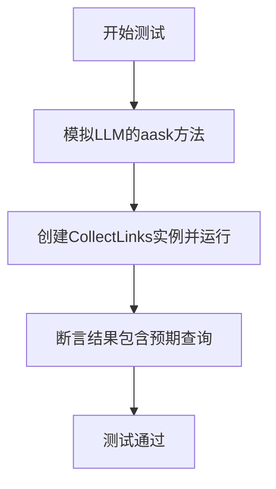
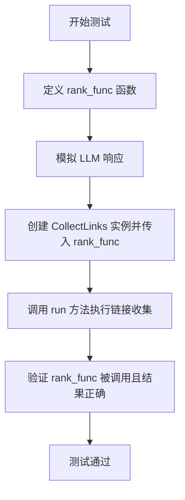
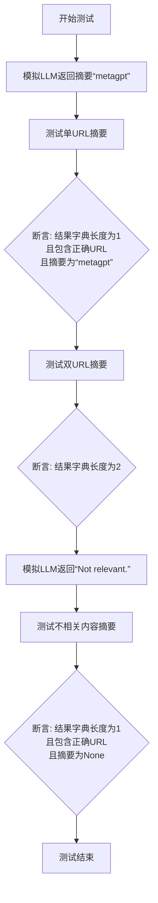
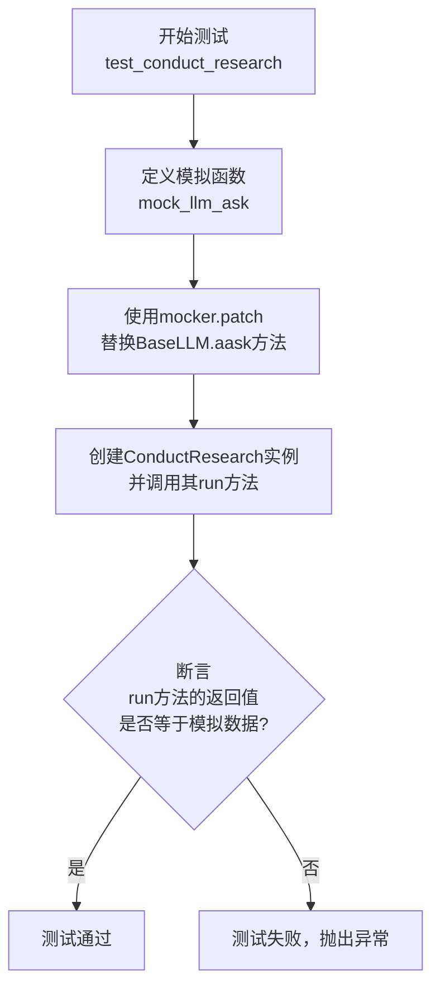
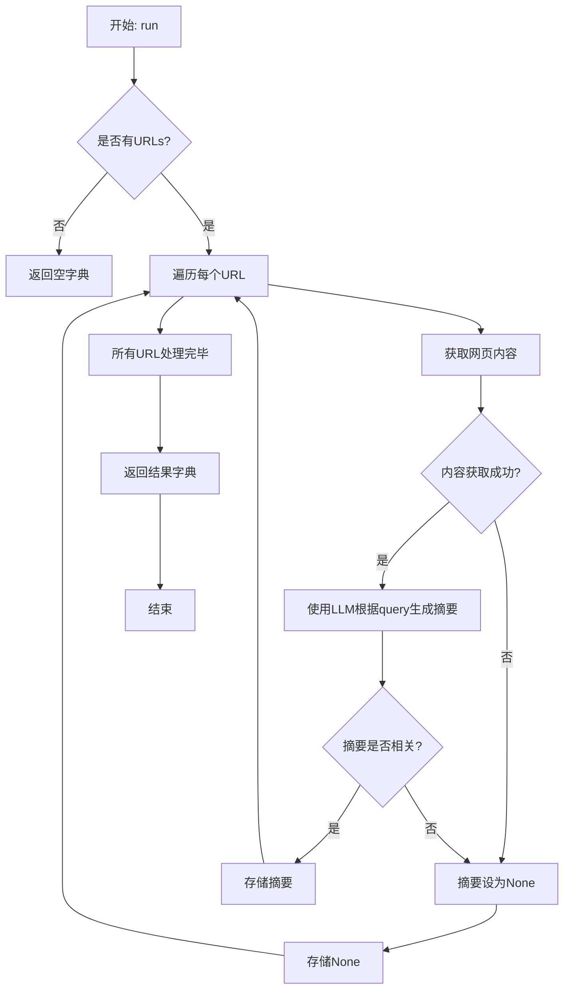
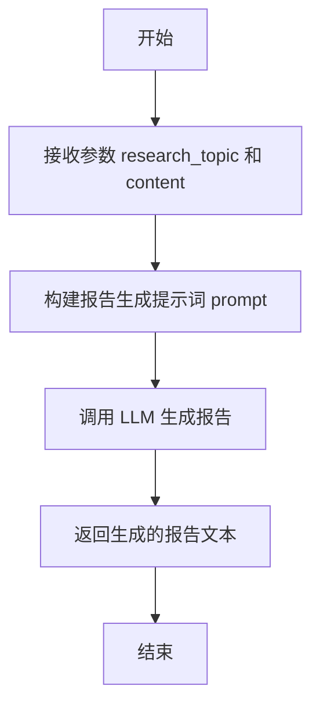

# `.\MetaGPT\tests\metagpt\actions\test_research.py` 详细设计文档

这是一个用于测试 MetaGPT 框架中研究相关功能（包括链接收集、网页浏览与总结、研究执行）的单元测试文件。它通过模拟 LLM 响应和搜索引擎来验证 `research` 模块中各个 Action 类的正确性。

## 整体流程

```mermaid
graph TD
    Start[开始执行测试] --> TestCase{选择测试用例}
    TestCase --> Test1[test_collect_links]
    TestCase --> Test2[test_collect_links_with_rank_func]
    TestCase --> Test3[test_web_browse_and_summarize]
    TestCase --> Test4[test_conduct_research]
    
    subgraph Test1 [测试链接收集基础功能]
        T1A[模拟LLM响应] --> T1B[创建CollectLinks Action]
        T1B --> T1C[执行Action.run]
        T1C --> T1D[验证返回结果包含预期查询]
    end
    
    subgraph Test2 [测试带排序功能的链接收集]
        T2A[定义自定义排序函数] --> T2B[模拟LLM响应]
        T2B --> T2C[创建带rank_func的CollectLinks Action]
        T2C --> T2D[执行Action.run]
        T2D --> T2E[验证排序逻辑和结果]
    end
    
    subgraph Test3 [测试网页浏览与总结]
        T3A[模拟LLM返回相关内容] --> T3B[创建WebBrowseAndSummarize Action]
        T3B --> T3C[执行Action.run(单URL)]
        T3C --> T3D[验证单URL总结结果]
        T3D --> T3E[执行Action.run(多URL)]
        T3E --> T3F[验证多URL总结结果]
        T3F --> T3G[模拟LLM返回不相关内容]
        T3G --> T3H[执行Action.run]
        T3H --> T3I[验证不相关URL总结为None]
    end
    
    subgraph Test4 [测试研究执行]
        T4A[模拟LLM生成研究报告] --> T4B[创建ConductResearch Action]
        T4B --> T4C[执行Action.run]
        T4C --> T4D[验证返回的研究报告内容]
    end
    
    Test1 --> End[测试结束]
    Test2 --> End
    Test3 --> End
    Test4 --> End
```

## 类结构

```
test_research.py (测试模块)
├── 全局函数: mock_collect_links_llm_ask
├── 测试函数: test_collect_links
├── 测试函数: test_collect_links_with_rank_func
├── 测试函数: test_web_browse_and_summarize
└── 测试函数: test_conduct_research
```

## 全局变量及字段


### `data`
    
用于存储模拟LLM响应内容的临时变量，在测试函数中用于验证ConductResearch动作的输出结果。

类型：`str`
    


    

## 全局函数及方法

### `mock_collect_links_llm_ask`

这是一个用于模拟大型语言模型（LLM）响应的异步函数，专门用于测试 `CollectLinks` 动作。它根据传入的提示词（`prompt`）返回预定义的字符串，模拟LLM在收集研究链接过程中的不同步骤（如提取关键词、生成搜索查询、排序结果）的响应。

参数：

- `self`：`Any`，模拟的LLM实例自身（在模拟函数中通常不直接使用）。
- `prompt`：`str`，发送给LLM的提示词文本。
- `system_msgs`：`Any`，系统消息（在此模拟函数中未使用）。

返回值：`str`，根据不同的提示词返回预定义的JSON格式字符串或空字符串，用于驱动测试流程。

#### 流程图

```mermaid
graph TD
    A[开始: mock_collect_links_llm_ask] --> B{判断 prompt 内容};
    B -- 包含关键词提取提示 --> C[返回 '["metagpt", "llm"]'];
    B -- 包含查询生成提示 --> D[返回包含4个查询的JSON字符串];
    B -- 包含结果排序提示 --> E[返回 '[1,2]'];
    B -- 其他提示 --> F[返回空字符串 ''];
    C --> G[结束];
    D --> G;
    E --> G;
    F --> G;
```

#### 带注释源码

```python
async def mock_collect_links_llm_ask(self, prompt: str, system_msgs):
    # 检查提示词是否包含请求提取关键词的特定文本。
    if "Please provide up to 2 necessary keywords" in prompt:
        # 返回一个JSON字符串，模拟LLM提取出的两个关键词："metagpt"和"llm"。
        return '["metagpt", "llm"]'

    # 检查提示词是否包含请求生成相关搜索查询的特定文本。
    elif "Provide up to 4 queries related to your research topic" in prompt:
        # 返回一个JSON字符串，模拟LLM生成的四个与MetaGPT相关的研究查询。
        return (
            '["MetaGPT use cases", "The roadmap of MetaGPT", '
            '"The function of MetaGPT", "What llm MetaGPT support"]'
        )
    # 检查提示词是否包含请求对搜索结果进行排序的特定文本。
    elif "sort the remaining search results" in prompt:
        # 返回一个JSON字符串，模拟LLM对两个结果的排序顺序：[1, 2]。
        return "[1,2]"

    # 对于不匹配以上任何条件的提示词，返回空字符串。
    return ""
```

### `test_collect_links`

这是一个使用 `pytest` 框架编写的异步单元测试函数，用于测试 `research.CollectLinks` 类的 `run` 方法。它通过模拟（Mock）LLM（大语言模型）的响应和搜索引擎，验证 `CollectLinks` 能否根据给定的研究主题正确生成查询、收集链接并返回预期的结果。

参数：

- `mocker`：`pytest-mock` 提供的 `mocker` 对象，用于模拟（Mock）函数或方法。
- `search_engine_mocker`：一个自定义的 `pytest` fixture，用于模拟搜索引擎的响应。
- `context`：一个自定义的 `pytest` fixture，提供测试所需的上下文信息。

返回值：`None`，这是一个测试函数，不返回业务值，其成功与否由 `assert` 语句判断。

#### 流程图



#### 带注释源码

```python
@pytest.mark.asyncio  # 标记此函数为异步测试函数
async def test_collect_links(mocker, search_engine_mocker, context):
    # 定义一个内部异步函数，用于模拟LLM对不同提示词（prompt）的响应
    async def mock_llm_ask(self, prompt: str, system_msgs):
        if "Please provide up to 2 necessary keywords" in prompt:
            # 当提示词要求提供关键词时，返回一个包含“metagpt”和“llm”的JSON字符串
            return '["metagpt", "llm"]'

        elif "Provide up to 4 queries related to your research topic" in prompt:
            # 当提示词要求提供相关查询时，返回一个包含四个查询的JSON字符串
            return (
                '["MetaGPT use cases", "The roadmap of MetaGPT", '
                '"The function of MetaGPT", "What llm MetaGPT support"]'
            )
        elif "sort the remaining search results" in prompt:
            # 当提示词要求对搜索结果排序时，返回一个简单的排序列表
            return "[1,2]"

    # 使用mocker将`metagpt.provider.base_llm.BaseLLM.aask`方法替换为上面定义的模拟函数
    mocker.patch("metagpt.provider.base_llm.BaseLLM.aask", mock_llm_ask)
    
    # 创建CollectLinks动作实例，传入模拟的搜索引擎和上下文，并执行其run方法
    resp = await research.CollectLinks(
        search_engine=SearchEngine(engine=SearchEngineType.DUCK_DUCK_GO), context=context
    ).run("The application of MetaGPT")  # 运行时的研究主题
    
    # 断言：验证返回的响应（resp）中是否包含了所有预期的查询字符串
    for i in ["MetaGPT use cases", "The roadmap of MetaGPT", "The function of MetaGPT", "What llm MetaGPT support"]:
        assert i in resp
```

### `test_collect_links_with_rank_func`

这是一个异步单元测试函数，用于测试 `research.CollectLinks` 类的 `run` 方法在传入自定义 `rank_func` 参数时的行为。该测试验证了 `rank_func` 是否被正确调用，以及它是否能够对搜索结果进行自定义排序。

参数：

- `mocker`：`pytest-mock` 提供的 `mocker` 对象，用于模拟（mock）依赖项。
- `search_engine_mocker`：一个自定义的 fixture，用于模拟搜索引擎的响应。
- `context`：一个自定义的 fixture，提供测试所需的上下文信息。

返回值：`None`，这是一个测试函数，不返回业务值，其成功与否由 `assert` 语句决定。

#### 流程图



#### 带注释源码

```python
@pytest.mark.asyncio
async def test_collect_links_with_rank_func(mocker, search_engine_mocker, context):
    # 初始化两个列表，用于记录 rank_func 调用前后的结果，以便后续验证
    rank_before = []
    rank_after = []
    # 定义每个查询期望返回的 URL 数量
    url_per_query = 4

    # 定义自定义的排序函数 rank_func
    def rank_func(results):
        # 1. 截取前 url_per_query 个结果
        results = results[:url_per_query]
        # 2. 将排序前的原始结果（截取后）记录到 rank_before
        rank_before.append(results)
        # 3. 对结果进行反转排序（模拟自定义排序逻辑）
        results = results[::-1]
        # 4. 将排序后的结果记录到 rank_after
        rank_after.append(results)
        # 5. 返回排序后的结果
        return results

    # 使用 mocker 模拟 BaseLLM.aask 方法，使其返回预定义的测试数据
    mocker.patch("metagpt.provider.base_llm.BaseLLM.aask", mock_collect_links_llm_ask)
    
    # 创建 CollectLinks 动作实例，传入模拟的搜索引擎和自定义的 rank_func
    resp = await research.CollectLinks(
        search_engine=SearchEngine(engine=SearchEngineType.DUCK_DUCK_GO),
        rank_func=rank_func,
        context=context,
    ).run("The application of MetaGPT")  # 执行 run 方法，传入研究主题
    
    # 验证环节：遍历每个查询对应的记录
    for x, y, z in zip(rank_before, rank_after, resp.values()):
        # 验证 rank_func 中的反转逻辑：x[::-1] 应等于 y
        assert x[::-1] == y
        # 验证最终返回的 resp 中，每个查询对应的链接列表等于 rank_func 排序后的链接列表
        assert [i["link"] for i in y] == z
```

### `test_web_browse_and_summarize`

这是一个使用 `pytest` 框架编写的异步单元测试函数，用于测试 `research.WebBrowseAndSummarize` 类的 `run` 方法。它通过模拟（Mock）LLM（大语言模型）的响应，验证 `WebBrowseAndSummarize` 在给定一个或多个URL及查询时，能否正确地对网页内容进行浏览和摘要，并处理“不相关”内容的情况。

参数：

- `mocker`：`pytest-mock` 提供的 `mocker` 对象，用于创建和管理模拟对象。
- `context`：`metagpt` 框架中的上下文对象，用于在动作（Action）执行过程中传递信息和状态。

返回值：`None`，这是一个测试函数，不返回业务值，其成功与否由 `assert` 断言决定。

#### 流程图



#### 带注释源码

```python
@pytest.mark.asyncio  # 标记此函数为异步测试函数
async def test_web_browse_and_summarize(mocker, context):
    # 定义第一个模拟函数，模拟LLM的aask方法，始终返回字符串"metagpt"
    async def mock_llm_ask(*args, **kwargs):
        return "metagpt"

    # 使用mocker将`metagpt.provider.base_llm.BaseLLM.aask`方法替换为上面的模拟函数
    mocker.patch("metagpt.provider.base_llm.BaseLLM.aask", mock_llm_ask)
    
    # 定义测试用的URL和查询
    url = "https://github.com/geekan/MetaGPT"
    url2 = "https://github.com/trending"
    query = "What's new in metagpt"
    
    # 测试用例1：使用单个URL和查询调用`WebBrowseAndSummarize().run`
    resp = await research.WebBrowseAndSummarize(context=context).run(url, query=query)

    # 断言1：返回的字典应只包含一个条目
    assert len(resp) == 1
    # 断言2：返回的字典应包含指定的URL作为键
    assert url in resp
    # 断言3：该URL对应的值应为模拟LLM返回的"metagpt"
    assert resp[url] == "metagpt"

    # 测试用例2：使用两个URL和同一个查询调用`WebBrowseAndSummarize().run`
    resp = await research.WebBrowseAndSummarize(context=context).run(url, url2, query=query)
    # 断言4：返回的字典应包含两个条目
    assert len(resp) == 2

    # 定义第二个模拟函数，模拟LLM返回"Not relevant."，用于测试不相关内容
    async def mock_llm_ask(*args, **kwargs):
        return "Not relevant."

    # 再次使用mocker替换LLM的aask方法为新的模拟函数
    mocker.patch("metagpt.provider.base_llm.BaseLLM.aask", mock_llm_ask)
    
    # 测试用例3：使用单个URL和查询调用，但LLM返回“不相关”
    resp = await research.WebBrowseAndSummarize(context=context).run(url, query=query)

    # 断言5：返回的字典应只包含一个条目
    assert len(resp) == 1
    # 断言6：返回的字典应包含指定的URL作为键
    assert url in resp
    # 断言7：由于LLM返回了“Not relevant.”，该URL对应的值应为None
    assert resp[url] is None
```

### `test_conduct_research`

这是一个异步单元测试函数，用于测试 `research.ConductResearch` 类的 `run` 方法。它通过模拟（Mock）LLM（大语言模型）的响应，验证 `ConductResearch` 能否接收一个研究主题和内容，并正确返回由模拟 LLM 生成的“研究报告”。

参数：
-  `mocker`：`pytest-mock` 提供的 `MockerFixture` 类型，用于创建和管理测试中的模拟对象。
-  `context`：`Context` 类型，提供测试执行所需的上下文环境，如配置、日志等。

返回值：`None`，这是一个测试函数，其主要目的是通过断言（assert）来验证功能，不返回业务值。

#### 流程图



#### 带注释源码

```python
@pytest.mark.asyncio  # 标记此函数为异步测试函数，以便pytest-asyncio插件能正确处理
async def test_conduct_research(mocker, context):
    """
    测试 ConductResearch 类的 run 方法。
    通过模拟 LLM 的响应，验证其能否正确处理输入并返回预期的研究报告。
    """
    data = None  # 用于存储模拟LLM返回的数据，以便后续断言

    async def mock_llm_ask(*args, **kwargs):
        """
        模拟 BaseLLM.aask 方法的异步函数。
        当 ConductResearch 内部调用 LLM 生成报告时，此函数将被调用。
        """
        nonlocal data  # 声明使用外部作用域的 data 变量
        # 构造一个模拟的研究报告字符串
        data = f"# Research Report\n## Introduction\n{args} {kwargs}"
        return data  # 返回模拟的报告内容

    # 使用 mocker 将 `metagpt.provider.base_llm.BaseLLM.aask` 方法替换为上面定义的模拟函数
    # 这样，在测试过程中，ConductResearch 实际调用的是 mock_llm_ask，而不是真实的 LLM
    mocker.patch("metagpt.provider.base_llm.BaseLLM.aask", mock_llm_ask)

    # 准备测试用的输入内容
    content = (
        "MetaGPT takes a one line requirement as input and "
        "outputs user stories / competitive analysis / requirements / data structures / APIs / documents, etc."
    )

    # 执行被测试的功能：创建 ConductResearch 实例，并调用其 run 方法
    # 参数1: 研究主题 ("The application of MetaGPT")
    # 参数2: 相关内容 (上面定义的 content 字符串)
    resp = await research.ConductResearch(context=context).run("The application of MetaGPT", content)

    # 断言：验证 run 方法的返回值 (resp) 是否等于模拟 LLM 返回的数据 (data)
    # 如果相等，说明 ConductResearch 正确地将输入传递给了 LLM，并返回了 LLM 的输出。
    assert resp == data
```

### `CollectLinks.run`

该方法负责执行研究主题的链接收集流程。它首先通过LLM生成与研究主题相关的关键词和搜索查询，然后使用搜索引擎并行执行这些查询，收集搜索结果链接，最后通过LLM对结果进行排序和去重，返回一个按查询分组的链接字典。

参数：

-  `self`：`CollectLinks`，CollectLinks类的实例
-  `topic`：`str`，研究主题

返回值：`Dict[str, List[str]]`，一个字典，键为搜索查询，值为该查询对应的去重和排序后的链接列表

#### 流程图

```mermaid
flowchart TD
    A[开始: run(topic)] --> B[调用_get_keywords生成关键词]
    B --> C[调用_get_queries生成搜索查询]
    C --> D[并行执行所有查询的搜索]
    D --> E[合并所有搜索结果]
    E --> F[调用_rank_results对结果排序去重]
    F --> G[按查询分组结果]
    G --> H[返回分组后的链接字典]
    H --> I[结束]
```

#### 带注释源码

```python
async def run(self, topic: str) -> dict[str, list[str]]:
    """Run the research topic and return the links.

    Args:
        topic: The research topic.

    Returns:
        A dictionary containing the search queries and their corresponding links.
    """
    # 步骤1: 生成与研究主题相关的关键词
    keywords = await self._get_keywords(topic)
    # 步骤2: 基于关键词生成具体的搜索查询
    queries = await self._get_queries(topic, keywords)
    # 步骤3: 并行执行所有搜索查询，收集结果
    results = await self._search(queries)
    # 步骤4: 对搜索结果进行排序和去重
    results = await self._rank_results(results)
    # 步骤5: 将处理后的结果按原始查询进行分组，构建返回字典
    return self._results_to_dict(queries, results)
```

### `WebBrowseAndSummarize.run`

该方法用于浏览给定的一个或多个URL，获取网页内容，并使用LLM根据指定的查询问题对内容进行摘要。如果内容与查询不相关，则返回None。

参数：

-  `self`：`WebBrowseAndSummarize`，WebBrowseAndSummarize类的实例
-  `*urls`：`str`，一个或多个要浏览的URL地址
-  `query`：`str`，用于指导摘要生成的查询问题

返回值：`Dict[str, Optional[str]]`，一个字典，键为URL，值为对应的摘要文本。如果内容与查询不相关，则值为None。

#### 流程图



#### 带注释源码

```python
    async def run(self, *urls: str, query: str = "") -> Dict[str, Optional[str]]:
        """Browse urls and summarize the content based on query.

        Args:
            *urls: A list of URLs to browse.
            query: The query to summarize the content.

        Returns:
            A dictionary of URL and its summary. If the content is not relevant to the query, the summary is None.
        """
        # 初始化结果字典
        summaries = {}
        # 遍历所有传入的URL
        for url in urls:
            # 获取网页的文本内容
            text = await self._get_url_content(url)
            # 如果获取内容失败，摘要设为None
            if not text:
                summaries[url] = None
                continue
            # 使用LLM根据查询生成摘要
            summary = await self._summarize(text, query)
            # 检查摘要是否表明内容不相关
            if self._is_relevant(summary):
                summaries[url] = summary
            else:
                summaries[url] = None
        # 返回URL与摘要的映射字典
        return summaries
```

### `ConductResearch.run`

该方法负责执行研究任务，根据给定的研究主题和内容，生成一份研究分析报告。

参数：

- `research_topic`：`str`，研究主题，用于指导研究的方向和范围。
- `content`：`str`，与研究主题相关的初始内容或背景信息，作为生成报告的基础材料。

返回值：`str`，返回生成的研究报告文本。

#### 流程图



#### 带注释源码

```python
async def run(self, research_topic: str, content: str) -> str:
    """
    执行研究任务，生成研究报告。
    
    参数:
        research_topic (str): 研究主题。
        content (str): 与研究主题相关的初始内容。
        
    返回:
        str: 生成的研究报告文本。
    """
    # 构建用于生成研究报告的提示词。
    # 提示词中包含了研究主题和提供的初始内容，指导LLM进行深入分析和报告撰写。
    prompt = f"# Research Topic\n{research_topic}\n\n# Content\n{content}\n\n# Research Report\n"
    
    # 调用大语言模型（LLM）的异步提问方法，传入构建好的提示词，以生成研究报告。
    # 这里假设 `self.llm.aask` 是一个异步方法，负责与LLM交互并返回生成的文本。
    report = await self.llm.aask(prompt)
    
    # 返回LLM生成的研究报告。
    return report
```

## 关键组件


### 搜索与链接收集 (CollectLinks)

负责根据研究主题生成搜索关键词和查询，调用搜索引擎获取相关链接，并可对搜索结果进行排序和筛选。

### 网页浏览与摘要生成 (WebBrowseAndSummarize)

负责访问给定的一个或多个URL，抓取网页内容，并基于用户查询使用LLM对内容进行摘要或相关性判断。

### 研究报告生成 (ConductResearch)

负责整合收集到的链接和内容，使用LLM生成结构化的研究报告。


## 问题及建议


### 已知问题

-   **测试代码与实现代码耦合度高**：测试用例`test_collect_links_with_rank_func`和`test_collect_links`直接使用了`research.CollectLinks`类，并模拟了其内部依赖（如`BaseLLM.aask`）。这使得测试不仅验证了`CollectLinks`的行为，也间接测试了其与`SearchEngine`、`BaseLLM`的集成。当`CollectLinks`的内部实现（如LLM调用逻辑）发生变化时，即使其对外接口和核心功能不变，这些测试也可能失败，增加了维护成本。
-   **模拟逻辑重复且分散**：测试文件中存在两个高度相似的模拟函数`mock_llm_ask`和`mock_collect_links_llm_ask`，用于在不同测试中模拟LLM的响应。这种重复增加了代码冗余，且当需要调整模拟逻辑时，需要在多个地方进行修改，容易出错。
-   **测试断言过于具体和脆弱**：在`test_collect_links`中，断言检查返回的字典`resp`中是否包含特定的查询字符串。这个测试假设了`CollectLinks.run`方法返回一个以查询为键的字典。如果`CollectLinks`的内部数据结构或返回格式发生改变（例如，键名改变或结构嵌套），即使功能正确，测试也会失败。这属于对实现细节而非公共契约的测试。
-   **`rank_func`测试的复杂性**：`test_collect_links_with_rank_func`测试通过注入一个自定义的`rank_func`来验证排序功能，并同时验证了`rank_before`和`rank_after`列表的状态以及最终`resp`的结果。这个测试逻辑较为复杂，将多个验证点（函数调用副作用和最终结果）耦合在一个测试中，降低了测试的可读性和单一职责性。
-   **硬编码的测试数据**：测试中使用的搜索查询、URL和模拟的LLM响应都是硬编码的。这使得测试数据与测试逻辑混合，当需要测试不同场景时不够灵活。

### 优化建议

-   **重构测试以减少与实现的耦合**：考虑为`CollectLinks`、`WebBrowseAndSummarize`等类定义更清晰、稳定的公共接口或契约。测试应主要针对这些公共接口进行，而不是内部的LLM调用序列。可以使用依赖注入将`SearchEngine`和`LLM`等依赖项彻底模拟，使测试专注于被测单元的核心逻辑。
-   **提取共享的模拟逻辑**：将`mock_llm_ask`和`mock_collect_links_llm_ask`函数合并，并提取为一个公共的fixture或辅助函数。这样可以消除重复，集中管理模拟行为，提高代码的可维护性。
-   **使用更健壮的断言**：避免断言具体的字符串内容或复杂的内部数据结构。改为断言更通用的行为，例如：`assert len(resp) == 4`（检查返回了4个结果），或者使用`assert all(query in resp for query in expected_queries)`来检查所有预期查询是否以某种形式存在于结果中，而不指定具体的键结构。对于`WebBrowseAndSummarize`，可以断言返回的字典包含特定的URL键，并且其值不为空（或符合预期类型），而不是断言具体的摘要内容。
-   **简化复杂测试**：将`test_collect_links_with_rank_func`拆分为多个更小的测试。例如，一个测试专门验证`rank_func`被正确调用并传入预期参数，另一个测试验证使用`rank_func`后，`run`方法的最终输出格式符合预期。这样每个测试只关注一个方面，更清晰，也更容易定位问题。
-   **参数化测试用例**：使用`pytest`的`@pytest.mark.parametrize`装饰器，将不同的测试数据（如不同的查询主题、URL列表、模拟的LLM响应）参数化。这可以显著减少重复代码，并使添加新的测试场景变得非常容易。
-   **增加负面测试和边界条件测试**：当前测试主要集中在“正常路径”。建议增加测试用例来覆盖异常情况，例如：当`SearchEngine`返回空结果时`CollectLinks`的行为，当`WebBrowseAndSummarize`遇到无法访问的URL或LLM返回“不相关”内容时的处理，以及`rank_func`返回空列表或非法数据时的情况。


## 其它


### 设计目标与约束

本测试代码的设计目标是验证 `metagpt.actions.research` 模块中 `CollectLinks`、`WebBrowseAndSummarize` 和 `ConductResearch` 三个核心 Action 类的功能正确性。主要约束包括：1) 测试环境需模拟外部依赖（如 LLM 和搜索引擎）以避免真实网络调用；2) 测试应覆盖核心逻辑分支，包括正常流程、排序函数集成以及内容相关性过滤；3) 测试需保持异步执行以匹配生产代码的协程特性。

### 错误处理与异常设计

当前测试代码主要关注功能验证，未显式测试错误处理路径。生产代码中的潜在异常（如网络请求失败、LLM API 错误、HTML 解析失败）在测试中被 `mocker.patch` 完全模拟，从而避免了异常触发。测试设计隐含地假设被模拟的依赖总是返回预期格式的数据。一个改进点是增加针对模拟依赖返回异常或非法数据时，被测 Action 类是否按设计抛出或处理特定异常的测试用例。

### 数据流与状态机

测试中的数据流清晰：1) `test_collect_links`：输入研究主题 -> 模拟 LLM 生成关键词和查询 -> 模拟搜索引擎返回结果 -> 验证输出链接包含预期查询词。2) `test_collect_links_with_rank_func`：在上述流程中注入自定义 `rank_func`，验证该函数被正确调用且影响了最终输出顺序。3) `test_web_browse_and_summarize`：输入 URL 和查询 -> 模拟网页获取与 LLM 摘要 -> 验证输出映射关系及内容过滤（返回 `None`）。4) `test_conduct_research`：输入主题和内容 -> 模拟 LLM 生成报告 -> 验证输出与模拟返回值一致。整个测试过程是无状态的，每个测试函数独立运行。

### 外部依赖与接口契约

测试明确识别并模拟了以下关键外部依赖：1) **LLM 提供商 (`BaseLLM.aask`)**：契约是接收提示词和系统消息，返回文本响应。测试通过 `mock_llm_ask` 和 `mock_collect_links_llm_ask` 函数模拟其行为，根据不同的提示词返回预设的 JSON 数组或文本字符串。2) **搜索引擎 (`SearchEngine`)**：契约是接收查询并返回结果列表。测试通过 `search_engine_mocker` fixture（其实现在代码中未展示）进行模拟。3) **网络请求（用于网页浏览）**：契约是通过 URL 获取网页内容。此依赖在 `WebBrowseAndSummarize` 的内部被模拟（代码中未直接显示 patch，可能在其依赖的工具中）。测试通过模拟 LLM 响应间接避免了真实的网络请求。

### 测试策略与覆盖范围

测试策略采用**单元测试**和**集成测试**结合的方式，聚焦于 Action 类与其直接依赖的交互。通过 `mocker.patch` 实现了**依赖隔离**，确保测试的确定性和速度。覆盖范围包括：Action 的 `run` 方法主流程、自定义排序函数的回调机制、多 URL 处理能力、以及基于内容相关性的摘要过滤逻辑。未覆盖的部分包括：Action 类的初始化参数校验、极端边界条件（如空输入、模拟依赖返回空列表或异常）、以及与更下层组件（如真实网络库、HTML 解析器）的集成。

### 模拟与 Fixture 设计

测试利用了 `pytest` 的 `mocker` fixture（来自 `pytest-mock`）来动态替换依赖。`search_engine_mocker` 是一个自定义 fixture，用于模拟 `SearchEngine` 的行为。`context` fixture 为 Action 提供运行时上下文。模拟函数 `mock_llm_ask` 和 `mock_collect_links_llm_ask` 的设计是关键，它们通过解析输入 `prompt` 来区分 LLM 被调用的不同阶段（生成关键词、生成查询、排序），并返回相应的预设值，从而驱动被测对象完成整个工作流。这种设计紧密耦合于生产代码中的提示词模板。

    