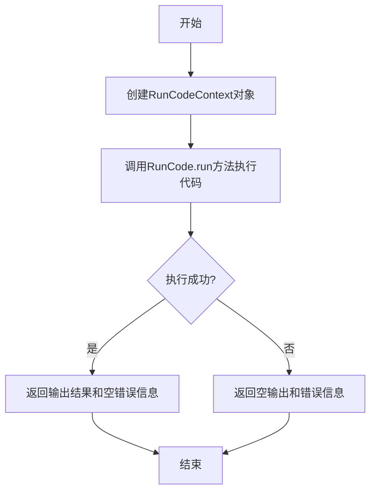
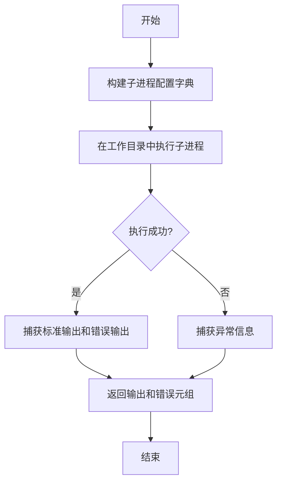
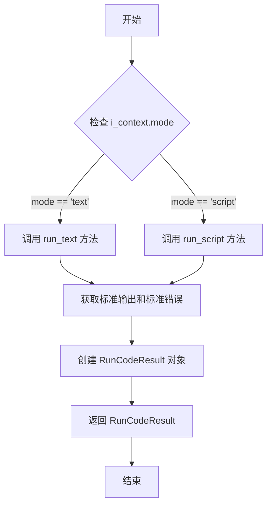
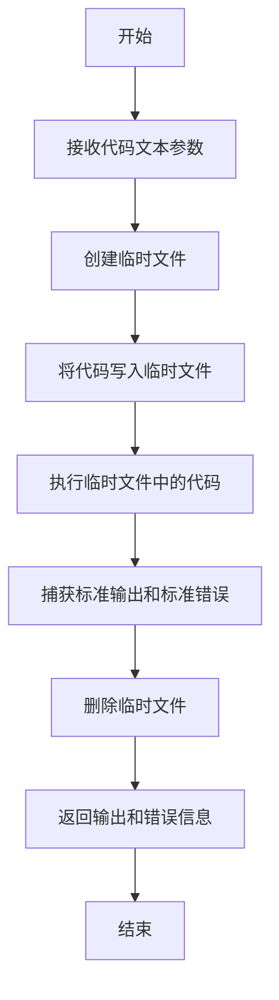
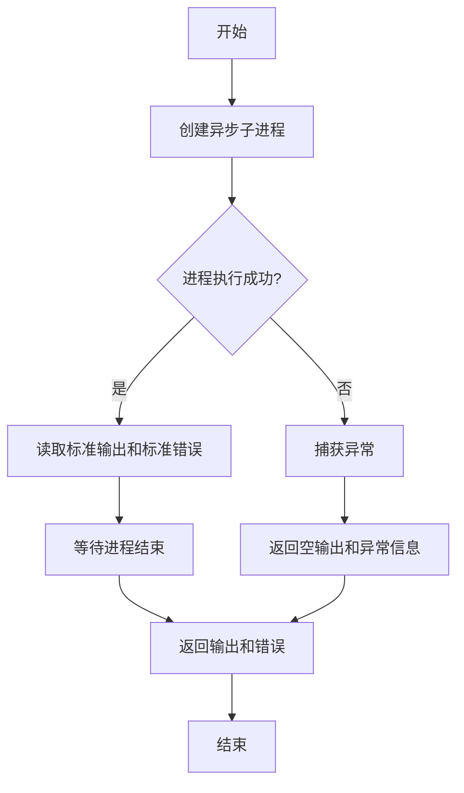
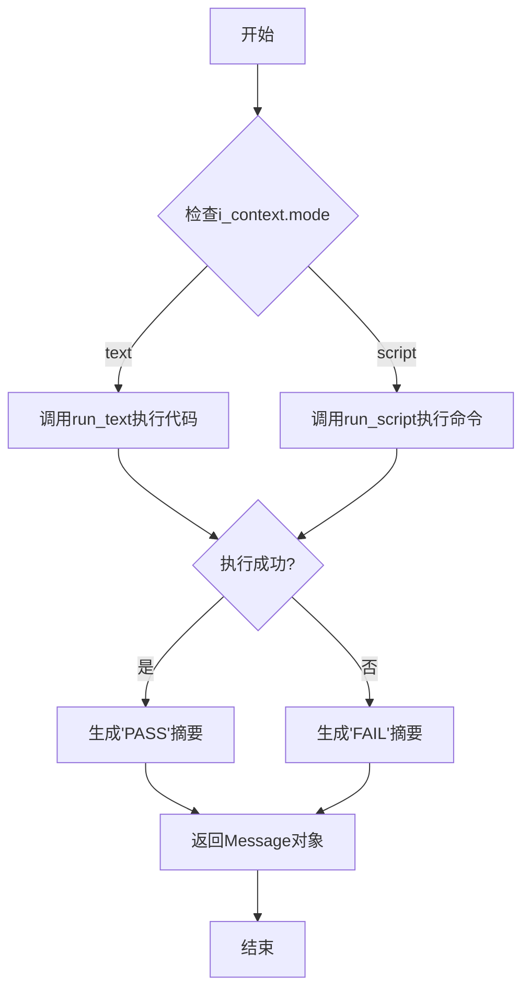

# `.\MetaGPT\tests\metagpt\actions\test_run_code.py` 详细设计文档

该文件是一个单元测试文件，用于测试 `RunCode` 类的功能。`RunCode` 类的核心功能是执行代码，支持两种模式：1) 直接执行文本形式的代码片段（如 Python 表达式或语句）；2) 执行脚本文件或系统命令。测试文件通过多个测试用例验证了 `RunCode` 类在不同场景下的行为，包括成功执行、处理运行时错误（如除零错误）以及根据 `RunCodeContext` 配置执行相应操作。

## 整体流程

```mermaid
graph TD
    A[开始执行测试] --> B{选择测试用例}
    B --> C[test_run_text: 测试文本代码执行]
    B --> D[test_run_script: 测试脚本/命令执行]
    B --> E[test_run: 综合测试RunCode.run方法]
    C --> C1[执行简单计算: 1+1]
    C1 --> C2[验证输出为2, 错误为空]
    C --> C3[执行除零错误代码: 1/0]
   3 --> C4[验证输出为空, 错误包含'division by zero']
    D --> D1[执行成功命令: echo 'Hello World']
    D1 --> D2[验证输出为'Hello World', 错误为空]
    D --> D3[执行失败命令: python -c 'print(1/0)']
    D3 --> D4[验证错误包含'ZeroDivisionError']
    E --> E1[遍历测试输入列表]
    E1 --> E2[为每个RunCodeContext调用RunCode.run]
    E2 --> E3[验证响应摘要包含预期结果('PASS'或'FAIL')]
    C2 & C4 & D2 & D4 & E3 --> F[所有断言通过, 测试成功]
```

## 类结构

```
RunCode (被测试的类)
├── 类方法: run_text
├── 实例方法: run_script
└── 实例方法: run
RunCodeContext (数据类, 用于配置执行上下文)
├── 字段: mode, code_filename, code, command, working_directory
└── ...
pytest 测试函数
├── test_run_text
├── test_run_script
└── test_run
```

## 全局变量及字段


### `RunCodeContext.mode`
    
运行模式，指定代码执行的方式，如'text'表示直接执行文本代码，'script'表示执行脚本文件

类型：`str`
    


### `RunCodeContext.code_filename`
    
代码文件名，用于标识或保存代码的文件名

类型：`str`
    


### `RunCodeContext.code`
    
要执行的代码内容，可以是Python代码片段或脚本命令

类型：`str`
    


### `RunCodeContext.command`
    
执行脚本时使用的命令参数列表，用于构建子进程命令

类型：`List[str]`
    


### `RunCodeContext.working_directory`
    
工作目录路径，指定执行脚本时的当前工作目录

类型：`str`
    
    

## 全局函数及方法

### `RunCode.run_text`

该方法用于异步执行一段给定的Python代码文本，并返回执行结果和错误信息。它通过创建一个临时的`RunCodeContext`对象，调用`RunCode`类的`run`方法来执行代码，并处理返回的结果。

参数：

- `code`：`str`，要执行的Python代码文本。

返回值：`tuple`，包含两个元素的元组，第一个元素是代码执行的标准输出结果（如果执行成功且代码有输出），第二个元素是标准错误输出（如果执行出错）。

#### 流程图



#### 带注释源码

```python
@classmethod
async def run_text(cls, code: str) -> tuple:
    """
    异步执行一段给定的Python代码文本。

    Args:
        code (str): 要执行的Python代码文本。

    Returns:
        tuple: 包含两个元素的元组，第一个元素是代码执行的标准输出结果（如果执行成功且代码有输出），第二个元素是标准错误输出（如果执行出错）。
    """
    # 创建一个RunCodeContext对象，设置执行模式为'text'，并传入要执行的代码
    ctx = RunCodeContext(mode="text", code=code)
    # 调用RunCode类的run方法执行代码，并获取响应
    rsp = await cls(i_context=ctx).run()
    # 从响应中提取输出结果和错误信息，并返回
    return rsp.out, rsp.err
```

### `RunCode.run_script`

该方法用于在指定的工作目录中执行一个外部脚本或命令，并捕获其标准输出和标准错误输出。

参数：
- `self`：`RunCode`，`RunCode`类的实例
- `working_directory`：`str`，执行命令的工作目录路径
- `command`：`List[str]`，要执行的命令及其参数列表

返回值：`Tuple[str, str]`，返回一个包含两个字符串的元组，第一个字符串是命令的标准输出内容，第二个字符串是命令的标准错误输出内容

#### 流程图



#### 带注释源码

```python
async def run_script(self, working_directory: str, command: List[str]) -> Tuple[str, str]:
    """
    在指定工作目录中执行给定的命令。
    
    参数:
        working_directory: 执行命令的工作目录
        command: 要执行的命令及其参数列表
        
    返回:
        包含标准输出和标准错误输出的元组
    """
    # 构建子进程配置，设置工作目录和捕获输出
    process = await asyncio.create_subprocess_exec(
        *command,
        cwd=working_directory,  # 设置工作目录
        stdout=asyncio.subprocess.PIPE,  # 捕获标准输出
        stderr=asyncio.subprocess.PIPE,  # 捕获标准错误
    )
    
    # 等待子进程执行完成并获取输出
    stdout, stderr = await process.communicate()
    
    # 将字节流解码为字符串并返回
    return stdout.decode(), stderr.decode()
```

### `RunCode.run`

该方法用于执行代码，支持两种模式：文本模式（直接执行代码字符串）和脚本模式（执行外部命令或脚本）。它会根据传入的 `RunCodeContext` 对象中的配置，调用相应的执行方法，并返回一个包含执行结果的 `RunCodeResult` 对象。

参数：

- `i_context`：`RunCodeContext`，包含执行代码所需的所有上下文信息，如执行模式、代码内容、命令、工作目录等。
- `context`：`dict`，额外的上下文信息，可能包含环境变量或其他运行时配置。

返回值：`RunCodeResult`，包含执行结果的摘要、标准输出、标准错误等信息。

#### 流程图



#### 带注释源码

```python
async def run(self, i_context: RunCodeContext, context: dict = None) -> RunCodeResult:
    """
    执行代码的主要方法。
    
    根据 i_context 中的 mode 字段，决定是执行文本代码还是脚本命令。
    文本模式下，直接执行代码字符串；脚本模式下，执行指定的命令。
    
    Args:
        i_context (RunCodeContext): 包含执行代码所需的所有上下文信息。
        context (dict, optional): 额外的上下文信息，默认为 None。
    
    Returns:
        RunCodeResult: 包含执行结果的摘要、标准输出、标准错误等。
    """
    # 根据模式选择执行方法
    if i_context.mode == "text":
        # 文本模式：直接执行代码字符串
        out, err = await self.run_text(i_context.code)
    elif i_context.mode == "script":
        # 脚本模式：执行外部命令或脚本
        out, err = await self.run_script(
            i_context.working_directory, i_context.command
        )
    else:
        # 如果模式不支持，抛出异常
        raise ValueError(f"Unsupported mode: {i_context.mode}")
    
    # 根据执行结果生成摘要
    summary = "PASS" if not err else "FAIL"
    
    # 创建并返回 RunCodeResult 对象
    return RunCodeResult(
        summary=summary,
        stdout=out,
        stderr=err,
        context=i_context,
    )
```

### `RunCode.run_text`

该方法用于异步执行一段给定的Python代码文本，并返回执行结果和错误信息。它通过创建一个临时的Python脚本文件，执行该脚本，并捕获标准输出和标准错误流来实现。

参数：

- `code`：`str`，要执行的Python代码文本。

返回值：`tuple[str, str]`，一个包含两个字符串的元组，第一个字符串是代码执行的标准输出（stdout），第二个字符串是代码执行的标准错误（stderr）。

#### 流程图



#### 带注释源码

```python
@classmethod
async def run_text(cls, code: str) -> tuple[str, str]:
    """
    异步执行一段给定的Python代码文本。

    该方法通过创建一个临时的Python脚本文件，执行该脚本，并捕获标准输出和标准错误流。
    执行完成后，临时文件会被删除。

    Args:
        code (str): 要执行的Python代码文本。

    Returns:
        tuple[str, str]: 一个包含两个字符串的元组。
            第一个字符串是代码执行的标准输出（stdout）。
            第二个字符串是代码执行的标准错误（stderr）。
    """
    # 创建一个临时文件，用于存储要执行的代码
    with tempfile.NamedTemporaryFile(mode='w', suffix='.py', delete=False) as tmp:
        tmp.write(code)  # 将代码写入临时文件
        tmp_path = tmp.name  # 获取临时文件的路径

    try:
        # 使用asyncio创建子进程来执行临时文件中的Python代码
        process = await asyncio.create_subprocess_exec(
            sys.executable,  # 使用当前Python解释器
            tmp_path,        # 临时文件路径
            stdout=asyncio.subprocess.PIPE,  # 捕获标准输出
            stderr=asyncio.subprocess.PIPE   # 捕获标准错误
        )
        # 等待进程执行完成，并获取输出和错误信息
        stdout, stderr = await process.communicate()
        # 将字节流解码为字符串，并去除末尾的换行符
        return stdout.decode().strip(), stderr.decode().strip()
    finally:
        # 无论执行成功与否，都删除临时文件
        os.unlink(tmp_path)
```

### `RunCode.run_script`

该方法用于在指定的工作目录中执行一个外部命令（脚本），并捕获其标准输出和标准错误。它通过异步子进程执行命令，并返回执行结果。

参数：
- `self`：`RunCode`，`RunCode`类的实例
- `working_directory`：`str`，执行命令的工作目录路径
- `command`：`List[str]`，要执行的命令及其参数列表

返回值：`Tuple[str, str]`，返回一个元组，包含标准输出字符串和标准错误字符串

#### 流程图



#### 带注释源码

```python
async def run_script(self, working_directory: str, command: List[str]) -> Tuple[str, str]:
    """
    在指定工作目录执行命令
    :param working_directory: 工作目录
    :param command: 命令
    :return: 标准输出和标准错误
    """
    try:
        # 创建异步子进程，执行指定命令
        process = await asyncio.create_subprocess_exec(
            *command,
            cwd=working_directory,  # 设置工作目录
            stdout=asyncio.subprocess.PIPE,  # 捕获标准输出
            stderr=asyncio.subprocess.PIPE,  # 捕获标准错误
        )
        
        # 异步读取标准输出和标准错误
        stdout, stderr = await process.communicate()
        
        # 解码字节流为字符串，并移除末尾空白字符
        return stdout.decode().strip(), stderr.decode().strip()
    except Exception as e:
        # 如果执行过程中发生异常，返回空字符串和异常信息
        return "", str(e)
```

### `RunCode.run`

该方法根据传入的`RunCodeContext`配置，执行相应的代码或脚本。如果模式为"text"，则执行Python代码文本；如果模式为"script"，则执行系统命令。执行后，它会根据执行结果（成功或失败）生成一个包含执行摘要的`Message`对象。

参数：

- `i_context`：`RunCodeContext`，包含执行模式、代码内容、命令、工作目录等信息的上下文对象。
- `context`：`dict`，运行时的上下文信息，可能包含环境变量、配置等。

返回值：`Message`，包含执行结果的摘要信息，例如"PASS"或"FAIL"。

#### 流程图



#### 带注释源码

```python
async def run(self, i_context: RunCodeContext, context: dict) -> Message:
    """
    根据传入的上下文执行代码或脚本，并返回执行结果的摘要。
    
    Args:
        i_context (RunCodeContext): 包含执行模式、代码内容、命令等信息的上下文对象。
        context (dict): 运行时的上下文信息，可能包含环境变量、配置等。
    
    Returns:
        Message: 包含执行结果摘要的消息对象。
    """
    # 根据执行模式调用不同的方法
    if i_context.mode == "text":
        # 执行文本代码
        out, err = await self.run_text(i_context.code)
    elif i_context.mode == "script":
        # 执行脚本命令
        out, err = await self.run_script(
            i_context.working_directory, i_context.command
        )
    else:
        # 如果模式不支持，抛出异常
        raise NotImplementedError(f"Unsupported mode: {i_context.mode}")
    
    # 根据执行结果生成摘要
    summary = "PASS" if not err else "FAIL"
    # 返回包含摘要的Message对象
    return Message(content=summary)
```

## 关键组件


### RunCode 类

一个用于执行代码或脚本的类，支持文本模式（直接执行Python代码字符串）和脚本模式（执行外部命令或脚本文件）。

### RunCodeContext 类

一个数据类，用于封装执行代码所需的上下文信息，包括执行模式、代码文件名、代码内容、命令参数、工作目录等。

### 测试框架 (pytest)

用于编写和执行单元测试的框架，确保RunCode类的功能正确性，包括异步测试支持。

### 异步执行支持

通过`asyncio`和`async/await`关键字实现异步代码执行，提高I/O密集型任务（如执行外部命令）的并发性能。


## 问题及建议


### 已知问题

-   **测试用例对执行环境的强依赖**：`test_run_script` 和 `test_run` 测试用例中使用了 `echo` 和 `python` 命令。这些命令在类Unix系统（如Linux、macOS）上普遍存在，但在Windows系统上可能无法直接运行或行为不一致（例如，Windows的`echo`命令行为与Unix不同）。这会导致测试用例在跨平台环境中可能失败，降低了测试的可靠性。
-   **测试数据硬编码与逻辑耦合**：`test_run` 测试用例中，测试输入（`RunCodeContext`）与预期结果（`"PASS"`/`"FAIL"`）是硬编码在测试函数中的。当`RunCode`类的`run`方法返回的`rsp.summary`格式或逻辑发生变化时，需要同步修改所有相关的测试数据，维护成本较高，且容易遗漏。
-   **异常断言不够精确**：在 `test_run_text` 和 `test_run_script` 中，对于错误输出的断言使用了 `in` 操作符（如 `assert "division by zero" in err`）。这虽然能通过测试，但无法确保错误信息是精确的或来自预期的源头，可能掩盖其他潜在问题或使得测试对无关的字符串变化过于敏感。
-   **资源管理与清理缺失**：测试代码执行了可能产生副作用的操作（如在指定工作目录运行脚本），但测试用例中没有包含任何资源清理或环境恢复的步骤（例如，清理可能生成的文件）。在持续集成环境中，这可能导致残留文件影响后续测试的执行。

### 优化建议

-   **使用跨平台工具或模拟进行测试**：建议使用Python标准库（如`subprocess`运行`sys.executable`来调用Python解释器）或第三方库（如`pytest-mock`）来模拟命令执行，而不是直接依赖系统命令如`echo`。这样可以确保测试行为在Windows、Linux和macOS上的一致性。
-   **采用参数化测试和数据驱动**：使用`@pytest.mark.parametrize`装饰器将`test_run`中的测试数据参数化。将测试输入和预期输出分离到外部数据源（如JSON文件、YAML文件或测试类内部的常量字典）中。这样能提高测试的可读性，并在业务逻辑变更时，只需更新数据源而非每个测试函数。
-   **精确断言异常和输出**：对于预期发生的特定异常，应尽量断言具体的异常类型和消息。例如，可以尝试捕获`ZeroDivisionError`并断言其字符串表示。对于成功执行的输出，应断言其完全相等（`==`）而非包含关系，以确保输出符合预期格式。
-   **引入测试固件进行环境管理**：利用`pytest`的`fixture`功能，为需要特定工作目录或会产生临时文件的测试用例设置独立的临时目录。在fixture中创建临时工作目录，并在测试结束后自动清理。这可以保证测试的独立性和环境的纯净。
-   **增强错误处理与日志记录**：在测试中增加更详细的错误日志输出，当断言失败时，打印出实际的`out`和`err`值，便于快速定位问题。考虑对`RunCode`运行失败但未抛出异常的情况进行更明确的测试。
-   **补充边界和异常场景测试**：当前测试覆盖了文本模式和脚本模式的基本成功与失败场景。建议补充更多边界测试，例如：空代码执行、超长代码执行、包含特殊字符的代码、无权限目录下的脚本执行、不存在的命令执行等，以提高代码的健壮性。


## 其它


### 设计目标与约束

该测试代码的设计目标是验证`RunCode`类在不同模式（文本执行和脚本执行）下的功能正确性，包括正常执行和异常处理。约束包括：必须使用`pytest`框架进行异步测试；测试用例需覆盖成功和失败场景；测试数据通过`RunCodeContext`对象提供；测试环境需支持Python代码执行和shell命令执行。

### 错误处理与异常设计

测试代码通过断言（`assert`）验证`RunCode`类的错误处理机制。对于文本执行模式，测试验证了代码执行成功时输出正确结果，执行失败时（如除零错误）捕获并返回错误信息。对于脚本执行模式，测试验证了命令执行成功时输出正确，执行失败时错误信息包含预期关键字（如"ZeroDivisionError"）。测试本身不处理异常，依赖`pytest`在测试失败时报告。

### 数据流与状态机

测试数据流：测试函数接收输入（代码字符串或命令列表） -> 调用`RunCode`类方法执行 -> 获取输出和错误结果 -> 通过断言验证结果是否符合预期。状态机：无复杂状态转换，测试用例是独立的，每个用例执行后状态重置。

### 外部依赖与接口契约

外部依赖：`pytest`测试框架、`metagpt.actions.run_code.RunCode`类、`metagpt.schema.RunCodeContext`类。接口契约：测试代码依赖`RunCode.run_text`返回元组`(out, err)`；`RunCode.run_script`返回元组`(out, err)`；`RunCode.run`返回包含`summary`属性的响应对象。测试假设这些接口在成功和失败时行为一致。

### 测试策略与覆盖范围

测试策略：使用参数化输入（通过`inputs`列表）覆盖不同执行模式和场景。覆盖范围：包括文本模式成功执行、文本模式异常执行、脚本模式成功执行、脚本模式异常执行。通过检查输出内容和错误信息关键字确保功能正确。

### 环境与配置假设

假设测试环境已安装Python并可用`python`命令执行代码；支持执行shell命令（如`echo`）；工作目录（`.`）可访问；`RunCode`类所需的所有依赖（如代码执行引擎）已正确配置。测试不修改全局环境状态。

    