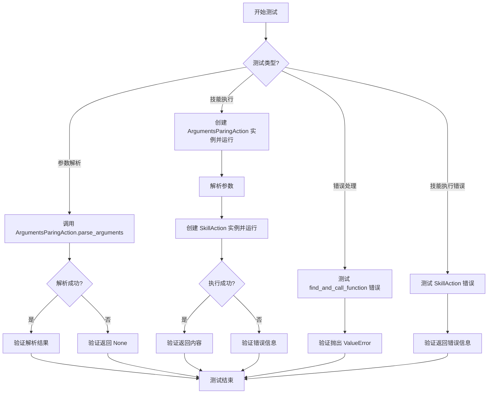
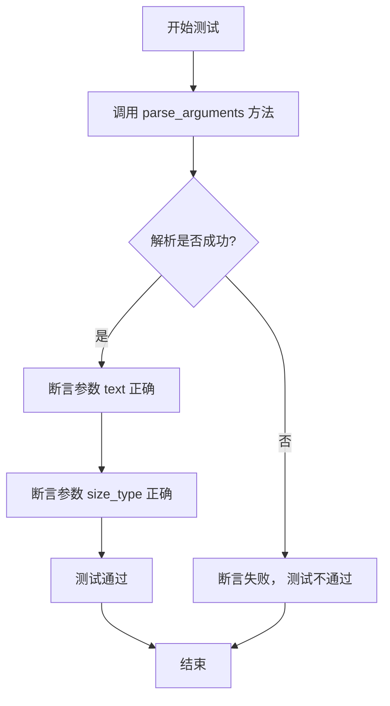
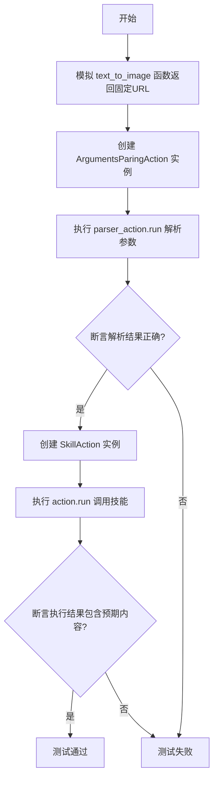

# `.\MetaGPT\tests\metagpt\actions\test_skill_action.py` 详细设计文档

这是一个单元测试文件，用于测试 `SkillAction` 和 `ArgumentsParingAction` 类的功能。`SkillAction` 负责根据给定的技能定义和参数执行相应的功能，而 `ArgumentsParingAction` 则负责从文本中解析出技能名称和参数。测试覆盖了参数解析、技能执行以及错误处理等场景。

## 整体流程



## 类结构

```
TestSkillAction (测试类)
├── skill (类字段: Skill 实例)
├── test_parser (测试方法)
├── test_parser_action (测试方法)
├── test_parse_arguments (测试方法)
├── test_find_and_call_function_error (测试方法)
└── test_skill_action_error (测试方法)
```

## 全局变量及字段


### `TestSkillAction.skill`
    
一个用于单元测试的预定义技能对象，模拟了文本转图像功能的技能配置。

类型：`Skill`
    
    

## 全局函数及方法

### `TestSkillAction.test_parser`

这是一个异步单元测试方法，用于测试`ArgumentsParingAction.parse_arguments`函数解析技能调用字符串参数的功能。它验证了函数能否正确地从格式化的字符串中提取出键值对参数。

参数：

-  `self`：`TestSkillAction`，当前测试类的实例
-  无其他显式参数

返回值：`None`，这是一个测试方法，不返回业务值，使用断言进行验证。

#### 流程图



#### 带注释源码

```python
    @pytest.mark.asyncio
    async def test_parser(self):
        # 调用静态方法 parse_arguments，传入技能名称和包含参数的字符串
        args = ArgumentsParingAction.parse_arguments(
            skill_name="text_to_image", # 技能名称
            txt='`text_to_image(text="Draw an apple", size_type="512x512")`' # 待解析的字符串，格式为 `技能名(参数1=值1, 参数2=值2)`
        )
        # 断言解析出的参数字典中，键"text"对应的值为"Draw an apple"
        assert args.get("text") == "Draw an apple"
        # 断言解析出的参数字典中，键"size_type"对应的值为"512x512"
        assert args.get("size_type") == "512x512"
```

### `TestSkillAction.test_parser_action`

这是一个单元测试方法，用于测试 `ArgumentsParingAction` 和 `SkillAction` 的协同工作流程。它模拟了从用户请求中解析参数并执行相应技能动作的过程，验证了参数解析的正确性和技能动作执行的预期结果。

参数：

- `self`：`TestSkillAction`，测试类实例
- `mocker`：`MockerFixture`，pytest-mock 提供的模拟对象，用于模拟外部依赖
- `context`：`Context`，执行上下文，包含环境配置等信息

返回值：`None`，无返回值，仅执行断言验证

#### 流程图



#### 带注释源码

```python
    @pytest.mark.asyncio
    async def test_parser_action(self, mocker, context):
        # mock
        # 使用 mocker 模拟 `metagpt.learn.text_to_image` 函数，使其返回一个固定的 URL 字符串，
        # 避免在单元测试中调用真实的外部服务。
        mocker.patch("metagpt.learn.text_to_image", return_value="https://mock.com/xxx")

        # 1. 测试参数解析动作
        # 创建一个 ArgumentsParingAction 实例，传入预定义的技能对象、用户请求文本和上下文。
        parser_action = ArgumentsParingAction(skill=self.skill, ask="Draw an apple", context=context)
        # 执行参数解析动作的 run 方法，解析用户请求中的参数。
        rsp = await parser_action.run()
        # 断言解析动作执行成功（返回非空值）。
        assert rsp
        # 断言解析后的参数字典存在。
        assert parser_action.args
        # 断言解析出的 `text` 参数值为 "Draw an apple"。
        assert parser_action.args.get("text") == "Draw an apple"
        # 断言解析出的 `size_type` 参数值为 "512x512"。
        assert parser_action.args.get("size_type") == "512x512"

        # 2. 测试技能执行动作
        # 创建一个 SkillAction 实例，传入相同的技能对象、上一步解析出的参数字典和上下文。
        action = SkillAction(skill=self.skill, args=parser_action.args, context=context)
        # 执行技能动作的 run 方法，调用模拟的 `text_to_image` 函数。
        rsp = await action.run()
        # 断言技能动作执行成功（返回非空值）。
        assert rsp
        # 断言执行结果的内容中要么包含 base64 图片数据前缀，要么包含 HTTP URL（模拟返回）。
        # 这验证了技能动作能根据参数正确调用底层函数并返回预期格式的结果。
        assert "image/png;base64," in rsp.content or "http" in rsp.content
```

### `TestSkillAction.test_parse_arguments`

这是一个参数化单元测试方法，用于测试 `ArgumentsParingAction.parse_arguments` 函数在不同输入下的行为。它验证函数是否能正确解析包含技能名称和参数的字符串，并在输入格式错误时返回 `None`。

参数：
-  `skill_name`：`str`，要测试的技能名称。
-  `txt`：`str`，包含技能调用信息的文本字符串。
-  `want`：`dict` 或 `None`，期望的解析结果。

返回值：`None`，这是一个测试方法，不返回业务值，仅通过断言验证测试结果。

#### 流程图

```mermaid
flowchart TD
    Start[开始测试] --> Input[接收参数<br>skill_name, txt, want]
    Input --> Call[调用<br>ArgumentsParingAction.parse_arguments(skill_name, txt)]
    Call --> GetResult[获取解析结果 args]
    GetResult --> Assert[断言 args == want]
    Assert --> End[测试结束]
```

#### 带注释源码

```python
    @pytest.mark.parametrize(
        ("skill_name", "txt", "want"), # 使用pytest的parametrize装饰器定义多组测试数据
        [
            ("skill1", 'skill1(a="1", b="2")', {"a": "1", "b": "2"}), # 用例1: 标准格式，应成功解析为字典
            ("skill1", '(a="1", b="2")', None), # 用例2: 缺少技能名前缀，应返回None
            ("skill1", 'skill1(a="1", b="2"', None), # 用例3: 括号不匹配，应返回None
        ],
    )
    def test_parse_arguments(self, skill_name, txt, want):
        # 调用被测试的静态方法，传入技能名和文本
        args = ArgumentsParingAction.parse_arguments(skill_name, txt)
        # 断言实际解析结果与期望值一致
        assert args == want
```

### `TestSkillAction.test_find_and_call_function_error`

该方法是一个单元测试，用于验证 `SkillAction.find_and_call_function` 方法在传入无效函数名时是否能正确抛出 `ValueError` 异常。

参数：

-  `self`：`TestSkillAction`，测试类实例
-  无其他显式参数

返回值：`None`，无返回值（测试方法通常不返回值，而是通过断言或异常验证行为）

#### 流程图

```mermaid
graph TD
    A[开始测试] --> B[调用 SkillAction.find_and_call_function<br/>传入无效函数名 'dummy_call' 和参数 {'a': 1}]
    B --> C{是否抛出 ValueError 异常?}
    C -- 是 --> D[测试通过]
    C -- 否 --> E[测试失败]
    D --> F[结束]
    E --> F
```

#### 带注释源码

```python
@pytest.mark.asyncio  # 标记此测试为异步测试，以便在异步环境中运行
async def test_find_and_call_function_error(self):
    # 使用 pytest.raises 上下文管理器来断言调用特定代码会抛出 ValueError 异常
    with pytest.raises(ValueError):
        # 调用 SkillAction 类的静态方法 find_and_call_function
        # 传入一个不存在的函数名 'dummy_call' 和一个参数字典 {'a': 1}
        # 预期此调用会失败并抛出 ValueError 异常
        await SkillAction.find_and_call_function("dummy_call", {"a": 1})
```


### `TestSkillAction.test_skill_action_error`

这是一个单元测试方法，用于测试 `SkillAction` 类在传入无效参数（空字典 `args`）时，其 `run` 方法是否能正确地处理错误并返回包含“Error”字符串的响应。

参数：

-  `self`：`TestSkillAction`，当前测试类的实例。
-  `context`：`Context`，测试执行所需的上下文环境，通常包含配置、日志等共享信息。

返回值：`None`，这是一个测试方法，不返回业务值，其成功与否由断言（`assert`）决定。

#### 流程图

```mermaid
flowchart TD
    A[开始测试] --> B[创建SkillAction实例<br/>skill=self.skill, args={}]
    B --> C[调用action.run]
    C --> D{run方法内部执行}
    D --> E[因args为空<br/>导致执行失败]
    E --> F[返回包含'Error'的响应]
    F --> G[断言响应内容包含'Error']
    G --> H[测试通过]
```

#### 带注释源码

```python
    @pytest.mark.asyncio
    async def test_skill_action_error(self, context):
        # 创建一个SkillAction实例，传入一个空的参数字典`args`。
        # 这模拟了参数解析失败或未提供必要参数的情况。
        action = SkillAction(skill=self.skill, args={}, context=context)
        
        # 异步执行SkillAction的run方法。
        # 预期由于缺少必要参数，该方法内部会抛出异常并被捕获，
        # 最终返回一个内容包含“Error”的响应对象。
        rsp = await action.run()
        
        # 断言：验证响应对象`rsp`的`content`属性中是否包含字符串“Error”。
        # 这是测试的核心，用于确认在错误情况下，系统能返回预期的错误指示。
        assert "Error" in rsp.content
```


## 关键组件


### 张量索引与惰性加载

在给定的测试代码中，未直接体现张量索引与惰性加载机制。该代码主要测试技能动作的解析与执行流程，核心操作围绕字符串解析和函数调用，不涉及大规模张量数据的处理或按需加载策略。

### 反量化支持

在给定的测试代码中，未直接体现反量化支持。代码主要处理技能参数解析和模拟的技能执行（如文本转图像），其输入输出为字符串或模拟的URL/Base64数据，不涉及量化模型的权重加载或数值精度转换。

### 量化策略

在给定的测试代码中，未直接体现量化策略。代码专注于单元测试逻辑，验证`ArgumentsParingAction`和`SkillAction`类的参数解析与执行功能，不涉及模型压缩、权重量化或推理优化策略。


## 问题及建议


### 已知问题

-   **测试用例对实现细节的强依赖**：`test_parser_action` 测试方法通过检查返回的字符串中是否包含 `"image/png;base64,"` 或 `"http"` 来断言成功。这依赖于 `SkillAction.run()` 方法的具体实现细节（如返回消息的格式），而非其契约行为（如成功调用技能并返回结果）。一旦实现方式改变（例如返回纯JSON），即使功能正确，测试也会失败。
-   **模拟不完整可能导致测试不稳定**：`test_parser_action` 方法中仅模拟了 `metagpt.learn.text_to_image` 函数。如果 `SkillAction` 或其依赖的其他组件（如网络请求、配置读取）在测试环境中未正确隔离或模拟，可能导致测试因外部因素（如网络、配置）而间歇性失败。
-   **错误测试用例的断言可能过于宽松**：`test_skill_action_error` 测试方法仅断言返回内容中包含 `"Error"`。这未能精确验证错误类型、错误消息格式或具体的异常处理逻辑，可能掩盖了错误处理中的潜在问题。
-   **硬编码的测试数据**：测试类中定义的 `skill` 对象包含了硬编码的配置（如 `OPENAI_API_KEY` 的描述、示例等）。如果技能的定义发生变更，需要同步修改多个测试用例，增加了维护成本。
-   **潜在的异步测试问题**：测试方法使用了 `@pytest.mark.asyncio` 装饰器，但测试框架和异步环境的配置如果处理不当，可能导致测试执行顺序问题或资源未正确清理。

### 优化建议

-   **重构测试以关注行为而非实现**：修改 `test_parser_action` 的断言，使其基于 `SkillAction` 的公共接口契约。例如，可以断言返回的 `Message` 对象的某个属性（如 `.content` 的类型或结构）符合预期，而不是检查特定的字符串片段。考虑使用更精确的断言，如 `assert isinstance(rsp.content, str)` 并结合对技能调用结果的验证。
-   **完善测试隔离与模拟**：确保测试 `SkillAction` 时，所有外部依赖（如网络调用、文件IO、环境变量）都被充分模拟。可以使用 `pytest-mock` 或 `unittest.mock` 来系统性地模拟依赖项，使测试完全在受控环境中运行。
-   **增强错误测试的精确性**：改进 `test_skill_action_error` 测试用例。可以更具体地断言抛出的异常类型（使用 `pytest.raises(ValueError)`）或检查返回的 `Message` 对象中是否包含结构化的错误信息，而不仅仅是字符串匹配。
-   **使用测试夹具（Fixture）管理共享数据**：将 `skill` 对象的创建移至 `pytest` 的 fixture 中，例如 `@pytest.fixture`。这样可以在多个测试用例中复用，并在技能定义变更时只需修改一处。同时，可以将测试用例参数化时用到的数据也提取出来，提高可读性和可维护性。
-   **确保异步测试的健壮性**：遵循 `pytest-asyncio` 的最佳实践，例如使用 `async def` 定义测试函数，并在必要时使用 `asyncio` 的事件循环 fixture。确保在测试结束时正确关闭所有异步生成器或客户端，避免资源泄漏警告。
-   **补充边界和异常情况测试**：当前测试覆盖了正常流程和少数错误情况。建议增加更多边界测试，例如：`parse_arguments` 方法处理空字符串、包含特殊字符的字符串、参数类型不匹配等情况；`SkillAction` 在技能不存在、参数缺失或类型错误时的行为。
-   **考虑测试的可读性与结构**：将 `test_parse_arguments` 的参数化测试数据提取到一个单独的变量或列表中，可以提高测试代码的可读性。对于复杂的测试逻辑（如 `test_parser_action`），可以考虑拆分为多个更小、更专注的测试方法。


## 其它


### 设计目标与约束

本模块的设计目标是提供一个可扩展的技能执行框架，用于解析用户请求、调用预定义的技能函数并返回结果。核心约束包括：1) 技能定义需遵循特定的JSON Schema格式，包含参数、返回值、前置条件等元数据；2) 技能函数的调用需支持异步执行；3) 参数解析需具备一定的容错能力，能从非标准字符串中提取键值对；4) 框架需与项目的上下文管理机制集成。

### 错误处理与异常设计

模块的错误处理主要分为两类：1) **参数解析错误**：当输入文本不符合`skill_name(key="value", ...)`格式时，`parse_arguments`方法返回`None`，上层调用者需处理此情况。2) **技能执行错误**：当`find_and_call_function`无法找到对应的技能函数时，抛出`ValueError`异常。在`SkillAction.run`方法中，所有异常被捕获，并封装到一个包含"Error"标识的`Message`对象中返回，确保调用链不会因单个技能执行失败而中断。

### 数据流与状态机

1.  **数据流**：
    *   **输入**：用户请求文本（`ask`）和技能定义（`Skill`对象）。
    *   **处理**：
        a. `ArgumentsParingAction` 解析`ask`，提取技能名和参数字典。
        b. 参数字典与`Skill`对象中定义的参数模式进行验证（当前测试未展示显式验证，但设计上应支持）。
        c. `SkillAction` 使用参数字典，通过反射机制查找并调用对应的技能函数（如`text_to_image`）。
    *   **输出**：技能函数的执行结果，被封装为`Message`对象。
2.  **状态机**：模块本身不维护复杂的状态机。其行为是线性的：解析 -> 验证（隐式）-> 执行 -> 返回。状态主要体现在`SkillAction`和`ArgumentsParingAction`类实例化时持有的参数（如`args`, `skill`）上。

### 外部依赖与接口契约

1.  **外部依赖**：
    *   `metagpt.learn.skill_loader`：定义了核心数据结构`Skill`, `Parameter`, `Example`, `Returns`。本模块严重依赖这些类来获取技能的元数据。
    *   `metagpt.learn.text_to_image`：这是一个具体的技能函数实现，是本模块要调用的目标之一。模块通过函数名动态导入和调用此类函数。
    *   `pytest`：仅用于单元测试，不属于运行时依赖。
2.  **接口契约**：
    *   **技能函数契约**：任何被`SkillAction`调用的函数必须满足：a) 函数名与`Skill.id`或`Skill.name`可映射；b) 函数参数名与`Skill.parameters`中定义的键名匹配；c) 函数应为异步（`async`）或可等待。
    *   **上下文契约**：`SkillAction`和`ArgumentsParingAction`的`context`参数需提供项目运行所需的配置信息（如API密钥），该契约由`Skill.x_prerequisite`字段定义。

### 测试策略与覆盖

单元测试覆盖了以下关键场景：1) **参数解析**：测试正常、缺失技能名、括号不匹配等情况。2) **集成流程**：测试从解析到执行的完整链条，使用Mock替代真实的外部服务调用。3) **异常路径**：测试函数查找失败和技能执行错误的处理。测试策略采用`pytest`框架，利用`@pytest.mark.asyncio`处理异步，`@pytest.mark.parametrize`进行参数化测试，以及`mocker`进行依赖隔离。

### 安全与配置考虑

1.  **安全**：技能执行涉及动态代码调用（`find_and_call_function`），存在潜在的安全风险。当前设计依赖于受信任的技能定义源。未来需考虑沙箱机制或严格的函数白名单。
2.  **配置**：技能的前置条件（`x_prerequisite`）定义了运行时必需的配置项（如`OPENAI_API_KEY`）。这要求调用方（`context`）必须提供这些配置，否则技能可能执行失败。配置的管理和验证责任在框架使用者。

### 部署与运维考量

模块作为核心框架的一部分，无独立部署需求。运维关注点在于：1) **技能管理**：如何动态添加、更新或禁用技能定义，而不需要重启服务。2) **监控与日志**：需要记录技能调用的详细信息（如技能名、参数、执行时间、成功/失败状态），以便进行问题排查和性能分析。3) **性能**：频繁的反射调用可能带来性能开销，对于高性能场景，可能需要缓存函数查找结果。

    