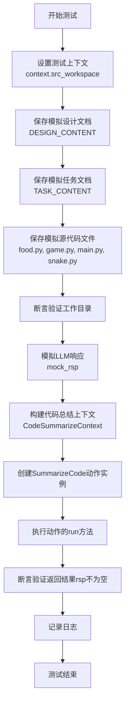

# `.\MetaGPT\tests\metagpt\actions\test_summarize_code.py` 详细设计文档

这是一个针对`SummarizeCode`动作的单元测试文件。它模拟了一个完整的代码分析场景：首先，它创建并保存了蛇游戏的设计文档、任务文档以及多个源代码文件（如`food.py`、`game.py`、`main.py`、`snake.py`）。然后，它使用模拟的LLM（大语言模型）来运行`SummarizeCode`动作，该动作旨在分析这些代码文件，生成类图、序列图、代码总结和待办事项列表。测试验证了`SummarizeCode`动作能够成功运行并返回非空结果。

## 整体流程

```mermaid
graph TD
    A[开始测试] --> B[设置测试环境]
    B --> C[保存设计文档(1.json)]
    C --> D[保存任务文档(1.json)]
    D --> E[保存源代码文件(food.py, game.py, main.py, snake.py)]
    E --> F[模拟LLM响应]
    F --> G[创建SummarizeCode动作]
    G --> H[运行SummarizeCode动作]
    H --> I{动作返回结果?}
    I -- 是 --> J[记录结果并断言成功]
    I -- 否 --> K[测试失败]
    J --> L[测试结束]
    K --> L
```

## 类结构

```
test_summarize_code.py (测试文件)
├── 全局变量: DESIGN_CONTENT, TASK_CONTENT, FOOD_PY, GAME_PY, MAIN_PY, SNAKE_PY, mock_rsp
├── 全局函数: test_summarize_code (异步测试函数)
└── 导入模块: pytest, SummarizeCode, logger, CodeSummarizeContext, MockLLM
```

## 全局变量及字段


### `DESIGN_CONTENT`
    
包含贪吃蛇游戏系统设计文档的JSON字符串，描述了实现方法、项目结构、类图、程序调用流程等。

类型：`str`
    


### `TASK_CONTENT`
    
包含贪吃蛇游戏任务分解文档的JSON字符串，列出了所需的第三方包、API规范、逻辑分析、任务列表和共享知识。

类型：`str`
    


### `FOOD_PY`
    
包含food.py文件源码的字符串，定义了Food类及其生成和获取位置的方法。

类型：`str`
    


### `GAME_PY`
    
包含game.py文件源码的字符串，定义了Game类及其游戏循环、事件处理、碰撞检测等核心游戏逻辑。

类型：`str`
    


### `MAIN_PY`
    
包含main.py文件源码的字符串，定义了程序的入口点，初始化并启动游戏。

类型：`str`
    


### `SNAKE_PY`
    
包含snake.py文件源码的字符串，定义了Snake类及其移动、转向、生长等方法。

类型：`str`
    


### `mock_rsp`
    
模拟LLM响应的字符串，包含类图、序列图、代码总结和待办事项列表，用于测试SummarizeCode动作。

类型：`str`
    


### `CodeSummarizeContext.design_filename`
    
系统设计文档的文件名，用于在代码总结过程中定位和读取设计信息。

类型：`str`
    


### `CodeSummarizeContext.task_filename`
    
任务分解文档的文件名，用于在代码总结过程中定位和读取任务需求信息。

类型：`str`
    


### `CodeSummarizeContext.codes_filenames`
    
待总结的源代码文件路径列表，指定了需要被分析和总结的代码文件集合。

类型：`List[str]`
    
    

## 全局函数及方法

### `test_summarize_code`

这是一个使用 `pytest` 框架编写的异步单元测试函数。它的核心功能是测试 `SummarizeCode` 动作（Action）的 `run` 方法。该测试模拟了一个完整的代码总结场景：它首先在给定的上下文中设置了一系列模拟数据（包括设计文档、任务文档和多个源代码文件），然后使用一个模拟的LLM（大语言模型）来返回预定义的响应，最后执行 `SummarizeCode` 动作并验证其返回结果不为空。

参数：

- `context`：`pytest` 的 `fixture` 类型，通常是一个包含测试所需环境（如工作区、Git仓库模拟等）的上下文对象。它提供了测试运行时的依赖项。
- `mocker`：`pytest-mock` 库提供的 `MockerFixture` 类型，用于在测试中创建模拟（mock）对象，以隔离和控制系统其他部分的行为。

返回值：`None`，该函数是一个测试函数，不直接返回值，而是通过 `assert` 语句来验证测试条件。

#### 流程图



#### 带注释源码

```python
@pytest.mark.asyncio  # 标记此函数为异步测试函数
async def test_summarize_code(context, mocker):
    # 1. 设置测试环境：指定源代码的工作空间路径
    context.src_workspace = context.git_repo.workdir / "src"

    # 2. 准备模拟数据：将设计文档、任务文档和源代码文件保存到模拟的仓库中
    # 保存设计文档
    await context.repo.docs.system_design.save(filename="1.json", content=DESIGN_CONTENT)
    # 保存任务文档
    await context.repo.docs.task.save(filename="1.json", content=TASK_CONTENT)
    # 保存源代码文件 food.py
    await context.repo.with_src_path(context.src_workspace).srcs.save(filename="food.py", content=FOOD_PY)
    # 验证工作目录设置正确
    assert context.repo.srcs.workdir == context.src_workspace
    # 保存其他源代码文件
    await context.repo.srcs.save(filename="game.py", content=GAME_PY)
    await context.repo.srcs.save(filename="main.py", content=MAIN_PY)
    await context.repo.srcs.save(filename="snake.py", content=SNAKE_PY)

    # 3. 模拟外部依赖：将 MockLLM 的 _mock_rsp 方法替换为返回预定义内容
    mocker.patch.object(MockLLM, "_mock_rsp", return_value=mock_rsp)

    # 4. 构建测试输入：获取所有源代码文件名，并创建代码总结上下文对象
    all_files = context.repo.srcs.all_files
    summarization_context = CodeSummarizeContext(
        design_filename="1.json", task_filename="1.json", codes_filenames=all_files
    )

    # 5. 执行被测试对象：创建 SummarizeCode 动作并运行
    action = SummarizeCode(context=context, i_context=summarization_context)
    rsp = await action.run()  # 执行核心的代码总结逻辑

    # 6. 验证结果：断言返回的总结结果不为空
    assert rsp
    # 记录结果日志（用于调试或报告）
    logger.info(rsp)
```

### `SummarizeCode.run`

该方法负责执行代码总结的核心逻辑。它接收一个包含设计文档、任务文档和代码文件列表的上下文对象，通过调用大语言模型（LLM）生成代码的总结、类图、序列图、待办事项列表以及需要修改的文件信息。

参数：

- `self`：`SummarizeCode`，当前`SummarizeCode`类的实例。
- `i_context`：`CodeSummarizeContext`，包含代码总结所需上下文信息的对象，具体包括设计文档文件名、任务文档文件名以及待总结的代码文件名列表。

返回值：`str`，返回一个字符串，其中包含由LLM生成的代码总结报告。该报告通常包括类图、序列图、代码功能概述、待办事项列表以及需要修改的文件映射。

#### 流程图


#### 带注释源码

```python
async def run(self, i_context: CodeSummarizeContext) -> str:
    """
    执行代码总结操作。
    该方法会读取设计文档、任务文档以及指定的代码文件，将它们的内容组合成一个提示（Prompt），
    然后调用大语言模型（LLM）来生成一份综合性的代码总结报告。

    Args:
        i_context (CodeSummarizeContext): 包含代码总结所需上下文信息的对象。
            该对象应至少包含以下属性：
            - design_filename: 设计文档的文件名。
            - task_filename: 任务文档的文件名。
            - codes_filenames: 待总结的代码文件名列表。

    Returns:
        str: 由LLM生成的代码总结报告字符串。报告内容通常包括：
            - 类图（Class Diagram）
            - 序列图（Sequence Diagram）
            - 代码功能概述（Summary）
            - 待办事项列表（TODOs）
            - 需要修改的文件映射（files_to_modify）
    """
    # 1. 从上下文对象中提取关键文件名
    design_filename = i_context.design_filename
    task_filename = i_context.task_filename
    codes_filenames = i_context.codes_filenames

    # 2. 读取设计文档和任务文档的内容
    design_doc = await self.context.repo.docs.system_design.get(filename=design_filename)
    task_doc = await self.context.repo.docs.task.get(filename=task_filename)

    # 3. 读取所有指定的代码文件内容
    codes_content = []
    for filename in codes_filenames:
        # 通过代码仓库（repo）的srcs属性读取文件内容
        content = await self.context.repo.srcs.get(filename=filename)
        codes_content.append(f"## {filename}\n{content}")

    # 4. 将所有内容（设计、任务、代码）组合成一个完整的提示字符串
    prompt = f"{design_doc}\n{task_doc}\n" + "\n".join(codes_content)

    # 5. 调用大语言模型（LLM），传入组合好的提示，请求生成代码总结
    # 注意：self.llm.aask 是一个异步方法，用于与LLM API交互
    rsp = await self.llm.aask(prompt)

    # 6. 返回LLM生成的总结报告
    return rsp
```

### `MockLLM._mock_rsp`

该方法用于模拟大语言模型（LLM）的响应，根据传入的提示词（prompt）返回预定义的模拟响应。它主要用于单元测试中，以替代真实的LLM调用，确保测试的稳定性和可重复性。

参数：

- `prompt`：`str`，输入的提示词文本，用于触发特定的模拟响应逻辑。

返回值：`str`，返回一个预定义的、格式化的字符串，模拟了LLM对代码进行总结分析后的输出。

#### 流程图


#### 带注释源码

```python
def _mock_rsp(self, prompt: str) -> str:
    """
    模拟LLM响应的核心方法。
    在单元测试中，此方法被用于替代真实的LLM调用，返回一个固定的、结构化的响应内容。
    该响应内容包含了类图、序列图、代码总结以及待办事项列表，用于测试下游的代码总结功能。

    Args:
        prompt (str): 输入的提示词。在本测试上下文中，此参数的内容被忽略，直接返回预设的响应。

    Returns:
        str: 预定义的模拟响应字符串，其内容模拟了LLM对一段游戏代码（Snake Game）的分析总结。
    """
    # 返回预定义的模拟响应字符串。
    # 该字符串包含了Mermaid格式的类图和序列图、对代码的文本总结以及一个JSON格式的待修改文件列表。
    return mock_rsp
```

## 关键组件


### 代码总结与重构建议生成器

该组件接收项目设计文档、任务文档和现有源代码，通过分析生成代码的类图、序列图、总结以及后续修改建议。它作为代码审查和迭代开发流程的一部分，旨在自动化生成代码结构文档和识别待完善项。

### 模拟LLM响应

该组件用于在单元测试中模拟大型语言模型（LLM）的响应。它通过预定义的`mock_rsp`字符串来模拟LLM对代码分析请求的典型输出，包括Mermaid图表、文本总结和待办事项列表，从而在不依赖真实AI服务的情况下测试`SummarizeCode`动作的逻辑。

### 测试上下文构建器

该组件负责在单元测试中构建一个完整的模拟环境。它创建并配置了包含设计文档、任务文档和多个源代码文件（如`food.py`, `game.py`, `main.py`, `snake.py`）的虚拟仓库结构，为`SummarizeCode`动作的执行提供了必要的输入数据和上下文。


## 问题及建议

### 已知问题

-   **硬编码的测试数据**：测试脚本中包含了大量硬编码的JSON字符串（如`DESIGN_CONTENT`, `TASK_CONTENT`）和代码片段（如`FOOD_PY`, `GAME_PY`）。这使得测试脚本冗长、难以维护，并且与测试逻辑本身耦合过紧。任何对设计或代码的修改都需要同步更新测试脚本。
-   **脆弱的模拟（Mock）**：测试通过`mocker.patch.object(MockLLM, "_mock_rsp", return_value=mock_rsp)`来模拟LLM的响应。这个模拟依赖于一个非常具体且庞大的字符串`mock_rsp`。如果`SummarizeCode`动作的内部实现或期望的输出格式发生微小变化，这个模拟就会失效，导致测试失败，即使核心逻辑可能仍然正确。
-   **测试覆盖不完整**：该测试主要验证了`SummarizeCode`动作在给定特定输入时能够运行并返回非空结果。它缺乏对动作输出内容正确性的断言（例如，生成的类图、序列图、总结或TODO列表是否符合预期）。这降低了测试的有效性。
-   **资源管理潜在问题**：测试中创建了多个文件（如`1.json`, `food.py`等），但测试框架（如`pytest`的临时目录）通常会负责清理。然而，如果测试在文件保存过程中意外中断，可能会留下残余文件。虽然当前上下文管理可能处理了这一点，但缺乏明确的说明。
-   **代码与测试数据混合**：测试文件`test_summarize_code.py`中同时包含了单元测试逻辑和作为测试数据的完整项目代码（贪吃蛇游戏）。这违反了关注点分离原则，使得文件目的不清晰，并增加了认知负担。

### 优化建议

-   **将测试数据外部化**：将`DESIGN_CONTENT`, `TASK_CONTENT`, 各`*_PY`代码字符串以及`mock_rsp`等大型测试数据移出测试脚本。可以将它们存储在单独的JSON或YAML文件中（例如`test_data/`目录下），并在测试中加载。这能大幅提高测试脚本的可读性和可维护性。
-   **改进模拟策略**：与其模拟一个固定的、庞大的字符串响应，不如考虑：
    1.  创建一个更智能的`MockLLM`，能够根据输入（如代码内容）生成结构上合理但内容简化的响应。
    2.  或者，将测试重点放在`SummarizeCode`动作对LLM返回值的处理逻辑上，而不是LLM本身。可以模拟`SummarizeCode`所依赖的LLM调用方法，直接返回一个结构化的字典对象，代表期望的解析结果。
-   **增强测试断言**：在`assert rsp`之后，添加更具体的断言来验证`rsp`的内容。例如，可以检查返回的字典是否包含特定的键（如`"class_diagram"`, `"sequence_diagram"`, `"summary"`, `"todos"`），或者使用正则表达式验证生成的图表是否包含预期的类名和方法名。
-   **明确测试范围与使用Fixture**：使用`pytest`的`fixture`来更清晰地管理测试上下文和临时资源。例如，可以创建一个fixture来设置测试所需的文件结构，并在测试结束后自动清理。这能使测试逻辑更清晰，并减少资源泄漏的风险。
-   **重构测试结构**：考虑将针对不同输入场景或`SummarizeCode`不同行为的测试用例拆分到多个测试函数中。例如，一个测试用例测试正常流程，另一个测试用例测试当代码文件缺失时的行为。同时，将庞大的内联测试数据替换为对外部资源的引用。
-   **添加对异常路径的测试**：当前测试只覆盖了“成功路径”。建议添加测试用例来验证当输入数据不完整、格式错误或LLM返回意外响应时，`SummarizeCode`动作是否能恰当地处理错误（例如，抛出预期的异常或返回特定的错误指示）。

## 其它


### 设计目标与约束

本代码是一个单元测试文件，用于测试 `SummarizeCode` 动作（Action）的功能。该动作的核心目标是：给定一个项目的系统设计文档、任务分解文档以及部分源代码文件，通过调用大语言模型（MockLLM）来生成一份代码总结报告。这份报告应包括更新后的类图、序列图、代码功能总结以及后续待办事项（TODOs）。测试的目标是验证 `SummarizeCode` 动作能够正确整合输入信息，调用LLM，并解析返回的结构化结果。

主要约束包括：
1.  **测试隔离性**：使用 `MockLLM` 模拟真实LLM的响应，确保测试不依赖外部API，且结果可预测。
2.  **上下文完整性**：测试需要构建完整的 `CodeSummarizeContext`，其中包含指向设计文档、任务文档和源代码文件的路径信息。
3.  **文件系统模拟**：测试依赖于 `context.repo` 提供的虚拟文件系统来创建和管理测试所需的输入文件（如 `1.json`, `food.py`, `game.py` 等）。
4.  **异步执行**：`SummarizeCode.run()` 是一个异步方法，测试需要使用 `pytest.mark.asyncio` 装饰器。

### 错误处理与异常设计

当前测试用例主要关注正向流程，即所有输入正确且Mock LLM返回预期格式时的成功执行。代码中隐含的错误处理与异常设计点包括：

1.  **文件读取错误**：`SummarizeCode` 动作内部会读取 `design_filename`, `task_filename` 和 `codes_filenames` 指定的文件。如果这些文件不存在或路径错误，相关操作（如 `open`）会抛出 `FileNotFoundError` 或 `IOError`。测试通过预先在模拟文件系统中创建文件来避免此问题。
2.  **LLM响应解析错误**：`MockLLM._mock_rsp` 返回的 `mock_rsp` 变量是一个包含特定标记（如 ````mermaid`, ````sequenceDiagram`, `## Summary`, `## TODOs`, ````python`）的多段文本。`SummarizeCode` 动作需要正确解析这些部分。如果返回格式不符合预期，解析逻辑可能会失败或产生不完整结果。测试通过提供格式正确的模拟响应来验证解析功能。
3.  **上下文状态错误**：`SummarizeCode` 动作依赖于传入的 `context` 和 `i_context` (即 `summarization_context`)。如果 `context` 中缺少必要的组件（如 `llm`），或者 `i_context` 中的字段无效，动作初始化或执行时会出错。测试通过正确构建 `context` (使用fixture) 和 `summarization_context` 来保证状态正确。
4.  **断言失败**：测试的最后使用 `assert rsp` 来验证 `action.run()` 的返回值非空。如果动作执行失败返回 `None` 或空值，测试将失败，这有助于捕获流程中的重大错误。

### 数据流与状态机

本测试用例的数据流清晰，遵循“准备-执行-验证”的模式：

1.  **准备阶段 (Setup)**:
    *   **输入数据准备**：将字符串常量 `DESIGN_CONTENT`, `TASK_CONTENT`, `FOOD_PY` 等写入模拟文件系统的特定路径下。这模拟了真实场景中已存在的设计文档、任务列表和源代码。
    *   **上下文构建**：创建 `CodeSummarizeContext` 对象，其中包含指向上述已创建文件的路径信息。
    *   **Mock配置**：使用 `mocker.patch.object` 将 `MockLLM._mock_rsp` 方法的返回值固定为预设的 `mock_rsp` 文本。

2.  **执行阶段 (Execution)**:
    *   实例化 `SummarizeCode` 动作，传入测试上下文和总结上下文。
    *   异步调用 `action.run()` 方法。
    *   在 `run()` 方法内部：
        a. 从 `i_context` 中读取文件路径。
        b. 读取这些文件的内容。
        c. 组合文件内容，构造发送给LLM的提示词（Prompt）。
        d. 调用被Mock的LLM（`MockLLM`）。
        e. 接收LLM返回的文本（即 `mock_rsp`）。
        f. 解析返回文本，提取类图、序列图、总结和TODOs等信息，并可能结构化存储。
        g. 返回解析后的结果 `rsp`。

3.  **验证阶段 (Verification)**:
    *   使用 `assert rsp` 检查动作执行成功并返回了非空结果。
    *   （隐含验证）测试的顺利执行本身也验证了从文件读取、LLM调用到结果解析的整个链条没有抛出异常。

**状态机**：本测试主要验证 `SummarizeCode` 动作作为一个整体转换器的功能。其内部状态变化不复杂，主要是从“初始状态”到“数据加载完成状态”，再到“LLM调用完成状态”，最后到“结果解析完成状态”。测试通过输入和输出来验证这一系列状态转换的正确性。

### 外部依赖与接口契约

1.  **外部依赖**:
    *   **`pytest` 框架**：用于组织和运行测试。
    *   **`pytest-asyncio` 插件**：用于支持异步测试函数的执行。
    *   **`metagpt.actions.summarize_code.SummarizeCode`**：这是被测试的核心类，是测试的主要依赖。
    *   **`metagpt.schema.CodeSummarizeContext`**：定义了传递给 `SummarizeCode` 动作的上下文数据结构。
    *   **`tests.mock.mock_llm.MockLLM`**：用于模拟大语言模型，避免真实网络调用，是测试环境的关键依赖。
    *   **`metagpt.logs.logger`**：用于记录日志，在测试中用于输出结果信息。
    *   **`context` fixture (来自 `conftest.py` 或其他地方)**：提供测试所需的运行时上下文，包括模拟的代码仓库(`repo`)和源文件工作空间(`src_workspace`)。这是测试基础设施的重要部分。

2.  **接口契约**:
    *   **`SummarizeCode` 构造函数**: 期望接收一个 `context` 对象和一个 `i_context` (类型为 `CodeSummarizeContext`) 对象。
    *   **`SummarizeCode.run()` 方法**: 这是一个异步方法，无参数，应返回一个非空值（具体类型由动作实现定义，测试中仅断言其存在性）。
    *   **`CodeSummarizeContext` 类**: 必须包含 `design_filename`, `task_filename`, `codes_filenames` 字段，这些字段的值应是可在 `context.repo` 对应仓库中访问的有效路径字符串或列表。
    *   **`MockLLM` 类**: 需要提供一个可被patch的 `_mock_rsp` 方法（或其他类似方法），当动作内部调用LLM时，此方法被触发并返回预设的字符串。这模拟了LLM的响应契约。
    *   **`context.repo` 对象**: 必须提供 `docs.system_design.save`, `docs.task.save`, `srcs.save`, `srcs.all_files` 等接口，行为类似于一个虚拟文件系统，用于测试文件的设置与查询。

    