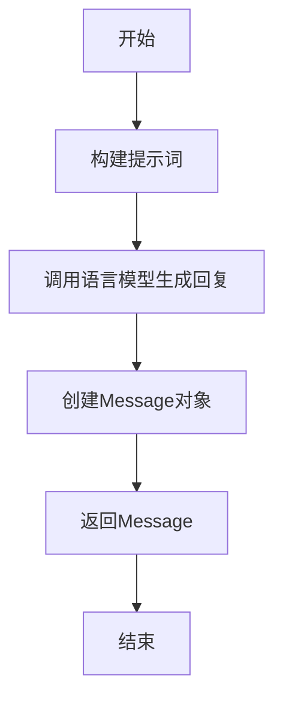

# `.\MetaGPT\tests\metagpt\actions\test_talk_action.py` 详细设计文档

这是一个使用pytest框架编写的单元测试文件，用于测试TalkAction类的prompt生成和异步运行功能。测试通过参数化验证不同场景下（如不同代理描述、语言、对话上下文、知识库和历史摘要）的prompt生成是否包含非法字符（如'{'），并确保run方法能正确返回Message类型的响应。

## 整体流程

```mermaid
graph TD
    A[开始测试] --> B[设置测试参数]
    B --> C[初始化TalkAction实例]
    C --> D[验证prompt不含'{']
    D --> E[调用action.run()异步执行]
    E --> F[验证返回结果为Message类型]
    F --> G[测试结束]
```

## 类结构

```
测试文件结构
├── 导入模块 (pytest, TalkAction, Message)
├── 测试函数 test_prompt
│   ├── 参数化测试用例
│   ├── 设置上下文参数
│   ├── 初始化TalkAction
│   ├── 验证prompt格式
│   └── 验证run方法结果
└── 主函数执行pytest
```

## 全局变量及字段


### `context`
    
Pytest测试上下文对象，用于在测试函数中传递测试状态和配置信息。

类型：`pytest.fixture`
    


### `TalkAction.i_context`
    
对话的上下文或当前话题，作为TalkAction的输入参数。

类型：`str`
    


### `TalkAction.knowledge`
    
与对话相关的背景知识或事实信息。

类型：`str`
    


### `TalkAction.history_summary`
    
对话历史的摘要或总结。

类型：`str`
    


### `TalkAction.context`
    
TalkAction执行时的上下文环境，可能包含配置、状态等信息。

类型：`object`
    


### `TalkAction.prompt`
    
为通用语言模型（如GPT-3）构造的提示词模板。

类型：`str`
    


### `TalkAction.prompt_gpt4`
    
为GPT-4模型专门构造的提示词模板。

类型：`str`
    
    

## 全局函数及方法

### `test_prompt`

这是一个使用 `pytest` 编写的异步测试函数，用于测试 `TalkAction` 类的 `prompt` 和 `prompt_gpt4` 属性是否包含未格式化的花括号 `{`，并验证其 `run` 方法能否成功执行并返回一个 `Message` 对象。

参数：

-   `agent_description`：`str`，描述被测试代理（如 `TalkAction`）的角色或身份。
-   `language`：`str`，指定测试中使用的语言。
-   `talk_context`：`str`，模拟对话的上下文或输入内容。
-   `knowledge`：`str`，提供给代理的背景知识。
-   `history_summary`：`str`，对话历史的摘要。
-   `context`：`pytest` 的 `Fixture` 对象，用于在测试用例间共享状态和资源。

返回值：`None`，这是一个测试函数，不返回业务值，其成功与否由断言决定。

#### 流程图

```mermaid
flowchart TD
    A[开始测试] --> B[设置测试上下文<br>context.kwargs.agent_description<br>context.kwargs.language]
    B --> C[实例化 TalkAction<br>传入 talk_context, knowledge,<br>history_summary, context]
    C --> D{断言: prompt 属性<br>不包含 '{']
    D -->|是| E{断言: prompt_gpt4 属性<br>不包含 '{']
    E -->|是| F[异步调用 action.run]
    F --> G{断言: run 方法返回结果 rsp<br>非空且为 Message 类型]
    G -->|是| H[测试通过]
    D -->|否| I[测试失败]
    E -->|否| I
    G -->|否| I
```

#### 带注释源码

```python
async def test_prompt(agent_description, language, talk_context, knowledge, history_summary, context):
    # 前置条件设置：将测试参数注入到 pytest 的 context fixture 中，
    # 以便被测试的 TalkAction 实例可以获取这些配置。
    context.kwargs.agent_description = agent_description
    context.kwargs.language = language

    # 使用给定的参数实例化被测试的 TalkAction 类。
    action = TalkAction(i_context=talk_context, knowledge=knowledge, history_summary=history_summary, context=context)
    
    # 核心断言1：检查 action 的 prompt 属性字符串中是否不包含未格式化的花括号 `{`。
    # 这通常用于验证提示词模板是否被正确渲染，没有留下占位符。
    assert "{" not in action.prompt
    # 核心断言2：同上，检查 action 的 prompt_gpt4 属性。
    assert "{" not in action.prompt_gpt4

    # 执行被测试的异步方法 run。
    rsp = await action.run()
    # 核心断言3：验证 run 方法的返回值非空。
    assert rsp
    # 核心断言4：验证 run 方法的返回值是 Message 类型的实例。
    assert isinstance(rsp, Message)
```


### `test_talk_action.test_prompt`

这是一个使用 `pytest` 框架编写的异步测试函数，用于测试 `TalkAction` 类的 `prompt` 和 `prompt_gpt4` 属性以及 `run` 方法。它通过参数化测试验证 `TalkAction` 在不同输入（如代理描述、语言、对话上下文、知识库和历史摘要）下是否能正确生成提示词并运行，且不包含未格式化的花括号 `{`，同时确保 `run` 方法返回一个有效的 `Message` 对象。

参数：

-  `agent_description`：`str`，描述被测试代理角色的字符串（例如："mathematician"）。
-  `language`：`str`，指定对话或提示词使用的语言（例如："English"）。
-  `talk_context`：`str`，模拟的对话上下文或用户输入的问题。
-  `knowledge`：`str`，提供给代理的背景知识信息。
-  `history_summary`：`str`，对话历史的摘要信息。
-  `context`：`pytest.fixture`，pytest 的上下文 fixture，用于在测试中设置临时状态或参数。

返回值：`None`，测试函数通常不返回有意义的值，其成功与否由断言（`assert`）决定。

#### 流程图

```mermaid
flowchart TD
    Start[开始测试] --> Setup[设置上下文参数<br/>context.kwargs.agent_description<br/>context.kwargs.language]
    Setup --> Init[初始化 TalkAction 实例<br/>传入测试参数]
    Init --> CheckPrompt[检查 prompt 属性<br/>断言不包含 '{']
    Init --> CheckPromptGpt4[检查 prompt_gpt4 属性<br/>断言不包含 '{']
    CheckPrompt --> RunAction[异步调用 action.run]
    CheckPromptGpt4 --> RunAction
    RunAction --> ValidateRsp[验证响应<br/>断言 rsp 非空且为 Message 类型]
    ValidateRsp --> End[测试结束]
```

#### 带注释源码

```python
async def test_prompt(agent_description, language, talk_context, knowledge, history_summary, context):
    # Prerequisites
    # 设置测试前提：将参数化的 agent_description 和 language 赋值给 context fixture 的 kwargs 属性。
    # 这模拟了在更大测试上下文中配置代理描述和语言的环境。
    context.kwargs.agent_description = agent_description
    context.kwargs.language = language

    # 使用所有参数化的输入（talk_context, knowledge, history_summary）以及配置好的 context
    # 来实例化被测试的 TalkAction 类。
    action = TalkAction(i_context=talk_context, knowledge=knowledge, history_summary=history_summary, context=context)
    
    # 断言1：检查 action 的 prompt 属性字符串中不包含未格式化的花括号 '{'。
    # 这确保了提示词模板已被正确渲染或初始化，没有遗留的占位符。
    assert "{" not in action.prompt
    # 断言2：同上，检查针对 GPT-4 的提示词属性 prompt_gpt4。
    assert "{" not in action.prompt_gpt4

    # 异步执行 action 的 run 方法，这是被测试的核心功能。
    rsp = await action.run()
    
    # 断言3：验证 run 方法的返回值 rsp 不是 None 或空值。
    assert rsp
    # 断言4：验证返回值 rsp 是 Message 类型的实例，符合 TalkAction.run 的预期返回类型。
    assert isinstance(rsp, Message)
```


### `TalkAction.run`

该方法执行对话动作，根据给定的上下文、知识库和历史摘要生成智能回复。它通过整合代理描述、语言设置、对话上下文、知识库和历史摘要，构建一个完整的提示，然后调用语言模型生成回复，最终返回一个包含回复内容的`Message`对象。

参数：

- `self`：`TalkAction`，TalkAction类的实例
- 无其他显式参数（方法内部使用实例属性）

返回值：`Message`，包含生成的回复内容

#### 流程图



#### 带注释源码

```python
async def run(self) -> Message:
    """
    执行对话动作，生成回复。
    
    该方法整合实例属性中的上下文、知识库和历史摘要，构建提示词，
    然后调用语言模型生成回复，最后将回复封装为Message对象返回。
    
    Returns:
        Message: 包含生成回复的Message对象
    """
    # 构建提示词，整合所有相关信息
    prompt = self._build_prompt()
    
    # 调用语言模型生成回复
    reply = await self._call_language_model(prompt)
    
    # 创建并返回Message对象
    return Message(content=reply, role="assistant")
```

## 关键组件


### TalkAction

一个用于生成对话响应的动作类，它基于给定的上下文、知识库和历史摘要，结合代理描述和语言设置，构造提示词并调用语言模型以生成符合特定角色和语境的回复。

### Message

一个用于封装消息内容的数据结构，它包含了对话或交互过程中产生的信息，通常用于在系统组件之间传递数据。

### pytest 测试框架

一个用于编写和运行测试的Python框架，它支持参数化测试、异步测试等功能，用于验证TalkAction在不同输入条件下的行为是否符合预期。

### 参数化测试数据

一组预定义的测试用例数据，用于验证TalkAction在不同代理描述、语言、对话上下文、知识库和历史摘要组合下的表现，确保其提示词生成和模型调用的正确性。


## 问题及建议


### 已知问题

-   **测试用例设计不完整**：当前测试仅验证了`TalkAction`类的`prompt`和`prompt_gpt4`属性不包含花括号`{`，以及`run`方法返回一个非空的`Message`对象。这未能充分测试`TalkAction`的核心对话逻辑、不同输入条件下的行为边界、以及`run`方法内部可能出现的异常情况。
-   **测试数据与逻辑耦合**：测试数据（如`agent_description`, `language`等）通过`pytest.mark.parametrize`硬编码在测试文件中。当`TalkAction`的构造函数或内部逻辑发生变化时，需要同步修改多个测试数据点，维护成本较高，且难以覆盖所有边界情况。
-   **缺乏对依赖项的隔离测试**：测试直接实例化了`TalkAction`并调用其`run`方法。`TalkAction.run()`方法很可能依赖外部服务（如大语言模型API）或复杂的上下文环境(`context`)。这导致测试不是单元测试，而是集成测试，运行速度慢、稳定性差（受外部服务影响），且难以模拟各种异常响应。
-   **断言过于宽松**：`assert rsp`和`assert isinstance(rsp, Message)`的断言过于简单，无法验证`Message`对象的内容是否正确，例如其`content`字段是否是根据输入参数合理生成的。
-   **测试上下文(`context`)模拟不清晰**：测试中通过`context.kwargs`设置了`agent_description`和`language`，但未展示`context`对象的完整模拟构造。如果`TalkAction`内部还依赖`context`的其他属性，此测试可能因模拟不完整而遗漏错误。

### 优化建议

-   **补充全面的测试用例**：
    -   增加对`TalkAction`构造函数参数各种组合（包括边界值、空值、无效值）的测试。
    -   增加对`run`方法返回的`Message`对象具体内容的验证，例如检查`content`是否包含预期的关键词或逻辑。
    -   增加对异常路径的测试，例如模拟当知识库(`knowledge`)为空或对话上下文(`talk_context`)无意义时，`TalkAction`的行为是否符合预期（如返回特定错误信息或进行降级处理）。
-   **解耦测试数据与逻辑**：
    -   考虑将测试用例数据（特别是用于验证业务逻辑的复杂数据对）提取到外部文件（如JSON、YAML）或独立的测试数据工厂函数中。这样可以使测试逻辑更清晰，并便于数据复用和维护。
-   **采用Mock进行单元测试**：
    -   使用`unittest.mock`或`pytest-mock`来模拟`TalkAction.run()`方法内部可能调用的外部服务（如`LLM`接口）。通过设置模拟对象的返回值，可以精确测试`TalkAction`在不同外部响应下的处理逻辑，使测试快速、稳定且独立。
    -   同样，应完整模拟`context`对象及其所有`TalkAction`所需的属性，确保测试聚焦于`TalkAction`本身的逻辑。
-   **增强断言**：
    -   对`run`方法的返回值进行更细致的断言。例如，除了检查类型，还应验证`Message`对象的`role`、`content`等字段是否符合给定输入下的预期。可以使用正则表达式、字符串包含检查或更复杂的逻辑断言。
-   **明确测试范围与类型**：
    -   将当前测试明确标记为集成测试（如使用`@pytest.mark.integration`），并与真正的、隔离的单元测试区分开。在CI/CD流程中，可以优先快速运行单元测试，集成测试则作为更耗时的后续步骤。
-   **添加测试文档**：
    -   在测试函数或类级别添加文档字符串，说明每个测试用例的目的、所用数据的含义以及预期的行为。这有助于其他开发者理解测试意图，并在测试失败时快速定位问题。


## 其它


### 设计目标与约束

本测试代码的设计目标是验证 `TalkAction` 类在给定不同输入参数（如代理描述、语言、对话上下文、知识库和历史摘要）时，其 `prompt` 和 `prompt_gpt4` 属性的生成逻辑是否正确（不包含未格式化的花括号 `{`），以及 `run` 方法能否成功执行并返回一个有效的 `Message` 对象。约束条件包括：必须使用 `pytest` 框架进行异步测试；测试数据通过参数化方式提供，以覆盖多种场景；测试依赖于 `metagpt` 项目中的 `TalkAction` 和 `Message` 类。

### 错误处理与异常设计

测试代码本身不包含显式的错误处理逻辑，其正确性依赖于 `pytest` 框架的断言机制。如果 `TalkAction` 的 `prompt` 属性包含未格式化的 `{`，或者 `run` 方法执行失败（例如抛出异常）或返回非 `Message` 类型对象，`assert` 语句将失败，测试用例将被标记为未通过。这间接验证了 `TalkAction` 实现在边界条件下的健壮性。测试未设置对 `TalkAction` 构造函数或 `run` 方法可能抛出的特定异常（如 `ValueError`, `RuntimeError`）的捕获和验证。

### 数据流与状态机

测试的数据流是线性的：1) 准备测试参数和 `context` 对象；2) 实例化 `TalkAction`，输入参数流入其构造函数；3) 检查 `prompt` 属性（状态验证）；4) 调用异步 `run` 方法，触发 `TalkAction` 内部处理逻辑，并返回 `Message` 对象；5) 验证返回的 `Message` 对象。整个过程不涉及复杂的状态转换，主要验证输入到输出的映射是否符合预期。`TalkAction` 内部可能存在的状态机（如等待LLM响应）未被本测试直接观测或验证。

### 外部依赖与接口契约

1.  **框架依赖**: 强依赖于 `pytest` 框架（特别是 `pytest.mark.asyncio` 和 `pytest.mark.parametrize`）来组织和执行测试。
2.  **项目模块依赖**: 依赖于 `metagpt.actions.talk_action.TalkAction` 类和 `metagpt.schema.Message` 类。测试与这些类之间存在隐式接口契约：`TalkAction` 的构造函数接受特定参数，拥有 `prompt`、`prompt_gpt4` 属性和异步 `run` 方法；`run` 方法返回 `Message` 实例。
3.  **环境依赖**: 作为单元测试，理想情况下应隔离外部服务（如真实的LLM API）。本测试通过检查 `prompt` 属性（而非实际调用LLM）来部分实现隔离，但 `run` 方法的完整执行可能仍依赖外部服务，这取决于 `TalkAction.run()` 的具体实现是否被模拟（mock）。

    