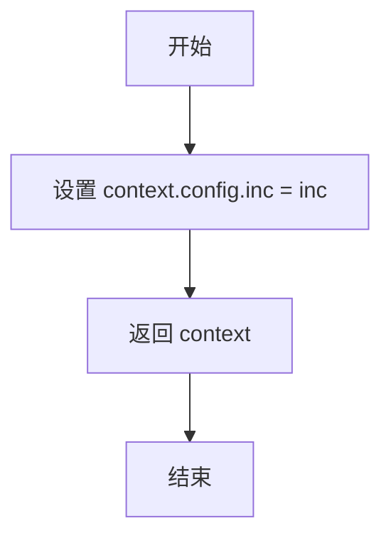
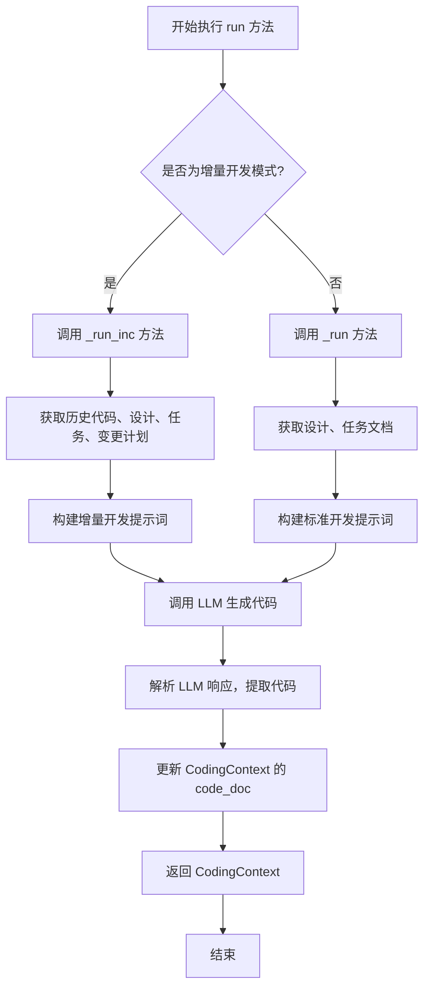
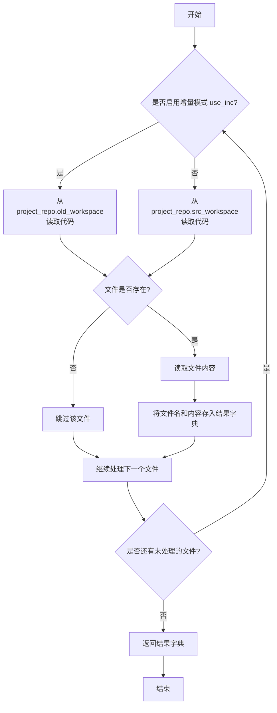
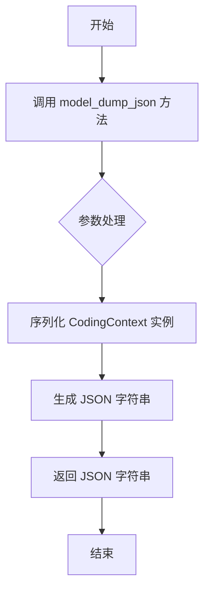
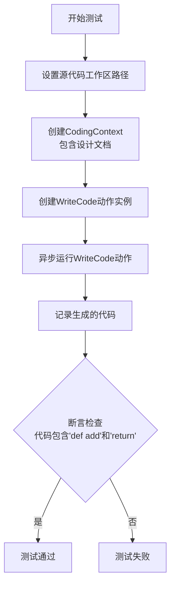

# `.\MetaGPT\tests\metagpt\actions\test_write_code.py` 详细设计文档

该文件是一个单元测试文件，用于测试`WriteCode`类的功能，包括直接生成代码、基于依赖（如设计文档、任务文档）生成代码、生成增量代码以及获取代码列表等场景。

## 整体流程

```mermaid
graph TD
    A[开始执行测试] --> B{选择测试用例}
    B --> C[test_write_code]
    B --> D[test_write_code_directly]
    B --> E[test_write_code_deps]
    B --> F[test_write_refined_code]
    B --> G[test_get_codes]
    C --> C1[设置工作区]
    C1 --> C2[创建CodingContext]
    C2 --> C3[创建WriteCode实例]
    C3 --> C4[运行WriteCode.run()]
    C4 --> C5[验证生成的代码]
    D --> D1[构造提示词]
    D1 --> D2[调用LLM生成代码]
    D2 --> D3[记录结果]
    E --> E1[设置工作区并加载依赖文件]
    E1 --> E2[创建包含依赖的CodingContext]
    E2 --> E3[创建WriteCode实例并运行]
    E3 --> E4[验证生成的代码]
    F --> F1[设置增量工作区]
    F1 --> F2[加载设计、任务、变更计划文档]
    F2 --> F3[保存旧代码]
    F3 --> F4[创建包含增量信息的CodingContext]
    F4 --> F5[创建WriteCode实例并运行]
    F5 --> F6[验证生成的代码]
    G --> G1[设置增量工作区]
    G1 --> G2[保存新旧代码文件]
    G2 --> G3[调用WriteCode.get_codes]
    G3 --> G4[验证返回的代码列表]
    C5 --> H[测试结束]
    D3 --> H
    E4 --> H
    F6 --> H
    G4 --> H
```

## 类结构

```
test_write_code.py (测试模块)
├── 全局函数
│   └── setup_inc_workdir
└── 测试函数
    ├── test_write_code
    ├── test_write_code_directly
    ├── test_write_code_deps
    ├── test_write_refined_code
    └── test_get_codes
```

## 全局变量及字段


### `CODE_PLAN_AND_CHANGE_SAMPLE`
    
包含代码计划和变更信息的示例字符串，用于测试代码重构功能。

类型：`str`
    


### `REFINED_CODE_INPUT_SAMPLE`
    
包含重构后代码输入的示例字符串，用于测试代码生成功能。

类型：`str`
    


### `REFINED_DESIGN_JSON`
    
包含重构后设计信息的JSON格式字符串，用于测试系统设计文档的加载。

类型：`str`
    


### `REFINED_TASK_JSON`
    
包含重构后任务信息的JSON格式字符串，用于测试任务文档的加载。

类型：`str`
    


### `TASKS_2`
    
包含多个任务描述的字符串列表，用于测试代码生成功能。

类型：`list[str]`
    


### `WRITE_CODE_PROMPT_SAMPLE`
    
包含代码生成提示的示例字符串，用于测试直接代码生成功能。

类型：`str`
    


### `CodingContext.filename`
    
表示要生成或处理的代码文件的名称。

类型：`str`
    


### `CodingContext.design_doc`
    
包含系统设计信息的文档对象，用于指导代码生成。

类型：`Document`
    


### `CodingContext.task_doc`
    
包含任务描述的文档对象，用于指导代码生成。

类型：`Document`
    


### `CodingContext.code_plan_and_change_doc`
    
包含代码计划和变更信息的文档对象，用于指导代码重构。

类型：`Document`
    


### `CodingContext.code_doc`
    
包含生成的代码内容的文档对象。

类型：`Document`
    


### `Document.content`
    
文档的内容，可以是文本、JSON字符串或其他格式的数据。

类型：`str`
    


### `Document.filename`
    
文档的文件名，用于标识和存储文档。

类型：`str`
    


### `Document.root_path`
    
文档的根路径，用于定位文档在项目中的位置。

类型：`str`
    
    

## 全局函数及方法

### `setup_inc_workdir`

设置用于测试的增量工作目录。

参数：

- `context`：`object`，测试上下文对象，包含配置信息。
- `inc`：`bool`，是否启用增量模式，默认为`False`。

返回值：`object`，更新后的上下文对象。

#### 流程图



#### 带注释源码

```python
def setup_inc_workdir(context, inc: bool = False):
    """setup incremental workdir for testing"""
    context.config.inc = inc  # 将传入的 inc 值赋给 context 的配置项
    return context  # 返回更新后的 context 对象
```

### `WriteCode.run`

`WriteCode.run` 是 `WriteCode` 类的核心异步方法，负责根据给定的编码上下文（包含设计文档、任务文档、代码计划等）生成或重构代码。它通过整合历史代码、设计规范和变更计划，调用大语言模型（LLM）来生成符合要求的代码，并处理增量开发场景下的代码合并。

参数：

- `self`：`WriteCode` 实例，表示当前执行的动作对象。
- 无显式参数，但方法内部使用实例属性 `self.i_context`（`Document` 类型，包含编码上下文信息）和 `self.context`（`ActionContext` 类型，提供运行时环境如配置、仓库等）。

返回值：`CodingContext`，包含生成的代码文档（`code_doc`）及其他相关上下文信息。

#### 流程图



#### 带注释源码

```python
async def run(self, *args, **kwargs) -> CodingContext:
    """
    执行代码编写的主要入口点。
    根据配置决定是进行增量开发（基于现有代码和变更计划）还是全新开发。
    """
    # 检查是否启用增量开发模式
    if self.context.config.inc:
        # 增量开发：调用内部方法处理代码重构
        return await self._run_inc()
    else:
        # 标准开发：调用内部方法处理新代码生成
        return await self._run()

async def _run(self) -> CodingContext:
    """
    标准代码生成流程。
    基于设计文档和任务文档生成新代码。
    """
    # 从实例的 i_context 属性中解析出 CodingContext 对象
    coding_context = CodingContext(**json.loads(self.i_context.content))
    # 获取设计文档和任务文档的内容
    design = coding_context.design_doc.content
    task = coding_context.task_doc.content if coding_context.task_doc else ""
    # 构建提示词，指导 LLM 生成代码
    prompt = self._build_prompt(design, task)
    # 调用 LLM 获取代码生成结果
    code_rsp = await self._aask_v1(prompt, "code", output_class_name="str")
    # 从 LLM 响应中解析出代码部分
    code = CodeParser.parse_code(text=code_rsp)
    # 更新 CodingContext 中的代码文档内容
    coding_context.code_doc.update(content=code)
    # 返回更新后的 CodingContext
    return coding_context

async def _run_inc(self) -> CodingContext:
    """
    增量代码开发流程。
    基于现有代码、设计、任务和代码变更计划来重构代码。
    """
    # 从实例的 i_context 属性中解析出 CodingContext 对象
    coding_context = CodingContext(**json.loads(self.i_context.content))
    # 获取相关文档：设计、任务、代码变更计划
    design = coding_context.design_doc.content
    task = coding_context.task_doc.content
    code_plan_and_change = coding_context.code_plan_and_change_doc.content
    # 获取历史代码（旧版本）
    old_code = await self._get_old_codes(coding_context.filename)
    # 构建适用于增量开发的提示词，包含历史代码和变更意图
    prompt = self._build_inc_prompt(design, task, code_plan_and_change, old_code)
    # 调用 LLM 获取重构后的代码
    code_rsp = await self._aask_v1(prompt, "code", output_class_name="str")
    # 从 LLM 响应中解析出代码部分
    code = CodeParser.parse_code(text=code_rsp)
    # 更新 CodingContext 中的代码文档内容
    coding_context.code_doc.update(content=code)
    # 返回更新后的 CodingContext
    return coding_context
```

### `WriteCode.get_codes`

该方法用于根据任务文档和项目仓库，获取与任务相关的代码文件内容。它支持增量模式（`use_inc=True`），在该模式下，会优先从增量工作区（`old_workspace`）读取代码，如果不存在，则从当前工作区（`src_workspace`）读取。同时，可以指定排除某些文件（`exclude`）。

参数：
- `task_doc`：`Document`，包含任务信息的文档对象，其内容为JSON字符串，描述了需要实现或修改的任务。
- `exclude`：`str`，可选参数，指定要排除的文件名（不含路径），不读取该文件的内容。
- `project_repo`：`ProjectRepo`，项目仓库对象，用于访问和管理项目中的源代码文件。
- `use_inc`：`bool`，可选参数，默认为`False`。当为`True`时，启用增量模式，优先从`old_workspace`读取代码。

返回值：`Dict[str, str]`，返回一个字典，其中键为文件名（不含路径），值为对应文件的代码内容字符串。

#### 流程图



#### 带注释源码

```python
    @staticmethod
    async def get_codes(
        task_doc: Document, exclude: str = "", project_repo: ProjectRepo = None, use_inc: bool = False
    ) -> Dict[str, str]:
        """
        根据任务文档，获取相关的代码。
        如果 use_inc 为 True，则从 old_workspace 获取代码，否则从 src_workspace 获取。
        :param task_doc: 任务文档
        :param exclude: 要排除的文件名
        :param project_repo: 项目仓库
        :param use_inc: 是否使用增量模式
        :return: 代码字典，key为文件名，value为代码内容
        """
        # 从任务文档内容中解析出任务列表，任务列表中包含每个任务需要修改或创建的文件名
        tasks = json.loads(task_doc.content)
        # 初始化一个空字典用于存储结果
        codes = {}
        # 遍历任务列表中的每个任务
        for task in tasks:
            # 获取当前任务相关的文件名
            filename = task.get("file")
            # 如果文件名与要排除的文件名相同，则跳过当前任务
            if filename == exclude:
                continue
            # 根据是否启用增量模式，选择从哪个工作区读取文件
            if use_inc:
                # 启用增量模式：尝试从 old_workspace 读取文件
                code = await project_repo.with_src_path(project_repo.old_workspace).srcs.get(filename)
            else:
                # 非增量模式：从当前 src_workspace 读取文件
                code = await project_repo.srcs.get(filename)
            # 如果成功读取到文件内容（code不为None），则将其添加到结果字典中
            if code:
                codes[filename] = code
        # 返回包含文件名和代码内容的字典
        return codes
```

### `CodingContext.model_dump_json`

该方法用于将 `CodingContext` 实例序列化为 JSON 格式的字符串。它继承自 Pydantic 的 `BaseModel` 的 `model_dump_json` 方法，用于生成符合 JSON 格式的字符串表示。

参数：

- `self`：`CodingContext` 实例，表示要序列化的对象。
- `indent`：`int | None`，可选参数，指定 JSON 字符串的缩进空格数。如果为 `None`，则不进行缩进。
- `include`：`AbstractSetIntStr | MappingIntStrAny | None`，可选参数，指定要包含在输出中的字段。
- `exclude`：`AbstractSetIntStr | MappingIntStrAny | None`，可选参数，指定要从输出中排除的字段。
- `by_alias`：`bool`，可选参数，如果为 `True`，则使用字段的别名作为键；否则使用字段名。
- `exclude_unset`：`bool`，可选参数，如果为 `True`，则排除未设置的字段。
- `exclude_defaults`：`bool`，可选参数，如果为 `True`，则排除具有默认值的字段。
- `exclude_none`：`bool`，可选参数，如果为 `True`，则排除值为 `None` 的字段。
- `round_trip`：`bool`，可选参数，如果为 `True`，则确保序列化和反序列化的一致性。
- `warnings`：`bool`，可选参数，如果为 `True`，则启用警告。
- `serialize_as_any`：`bool`，可选参数，如果为 `True`，则序列化为任意类型。

返回值：`str`，返回 `CodingContext` 实例的 JSON 字符串表示。

#### 流程图



#### 带注释源码

```python
def model_dump_json(
    self,
    *,
    indent: int | None = None,
    include: AbstractSetIntStr | MappingIntStrAny | None = None,
    exclude: AbstractSetIntStr | MappingIntStrAny | None = None,
    by_alias: bool = False,
    exclude_unset: bool = False,
    exclude_defaults: bool = False,
    exclude_none: bool = False,
    round_trip: bool = False,
    warnings: bool = True,
    serialize_as_any: bool = False,
) -> str:
    """
    将 CodingContext 实例序列化为 JSON 格式的字符串。
    
    参数：
    - indent: 可选，指定 JSON 字符串的缩进空格数。
    - include: 可选，指定要包含在输出中的字段。
    - exclude: 可选，指定要从输出中排除的字段。
    - by_alias: 可选，如果为 True，则使用字段别名作为键。
    - exclude_unset: 可选，如果为 True，则排除未设置的字段。
    - exclude_defaults: 可选，如果为 True，则排除具有默认值的字段。
    - exclude_none: 可选，如果为 True，则排除值为 None 的字段。
    - round_trip: 可选，如果为 True，则确保序列化和反序列化的一致性。
    - warnings: 可选，如果为 True，则启用警告。
    - serialize_as_any: 可选，如果为 True，则序列化为任意类型。
    
    返回值：
    - str: CodingContext 实例的 JSON 字符串表示。
    """
    # 调用父类 BaseModel 的 model_dump_json 方法进行序列化
    return super().model_dump_json(
        indent=indent,
        include=include,
        exclude=exclude,
        by_alias=by_alias,
        exclude_unset=exclude_unset,
        exclude_defaults=exclude_defaults,
        exclude_none=exclude_none,
        round_trip=round_trip,
        warnings=warnings,
        serialize_as_any=serialize_as_any,
    )
```

### `test_write_code`

该函数是一个异步测试函数，用于测试`WriteCode`动作的基本功能。它创建一个简单的`CodingContext`，包含一个设计文档，要求生成一个名为`add`的函数，然后运行`WriteCode`动作并验证生成的代码中是否包含预期的关键字。

参数：

- `context`：`pytest`的`fixture`上下文对象，类型为`Context`，提供测试所需的配置、工作区、仓库等环境信息。

返回值：`None`，该函数是一个测试函数，不返回业务值，仅通过断言验证测试结果。

#### 流程图



#### 带注释源码

```python
@pytest.mark.asyncio
async def test_write_code(context):
    # Prerequisites
    # 设置源代码工作区路径，指向git仓库下的`writecode`目录
    context.src_workspace = context.git_repo.workdir / "writecode"

    # 创建一个CodingContext对象，指定文件名和设计文档内容
    # 设计文档要求：设计一个名为'add'的函数，接受两个整数并返回它们的和
    coding_ctx = CodingContext(
        filename="task_filename.py", design_doc=Document(content="设计一个名为'add'的函数，该函数接受两个整数作为输入，并返回它们的和。")
    )
    # 将CodingContext对象序列化为JSON字符串，并包装成Document对象，作为WriteCode的输入上下文
    doc = Document(content=coding_ctx.model_dump_json())
    # 实例化WriteCode动作，传入输入上下文和测试上下文
    write_code = WriteCode(i_context=doc, context=context)

    # 异步执行WriteCode动作的run方法，生成代码
    code = await write_code.run()
    # 记录生成的代码的JSON表示
    logger.info(code.model_dump_json())

    # 断言：我们不能精确预测生成的代码，但可以检查是否包含某些关键字
    # 检查生成的代码中是否包含函数定义'def add'
    assert "def add" in code.code_doc.content
    # 检查生成的代码中是否包含返回语句'return'
    assert "return" in code.code_doc.content
```

## 关键组件

### WriteCode 类

代码生成的核心组件，负责根据设计文档、任务描述等上下文信息，通过调用LLM生成或修改代码。

### CodingContext 类

代码生成的上下文信息容器，用于封装生成代码所需的所有输入信息，如文件名、设计文档、任务文档、代码变更计划等。

### Document 类

通用文档数据模型，用于封装和传递各种类型的文档内容（如设计、任务、代码），是不同组件间信息交换的载体。

### 项目仓库 (Repo) 与工作空间管理

管理源代码、文档等资源的存储、版本和路径。支持增量开发模式，能区分新旧工作空间以进行代码比对和增量生成。

### 代码解析器 (CodeParser)

用于从LLM的响应或现有代码中解析出结构化的代码块，是处理非结构化文本与结构化代码之间转换的关键工具。

### 增量开发 (Incremental Development) 支持

通过`inc`配置标志、新旧工作空间(`src_workspace`, `old_workspace`)的区分以及`get_codes`方法中的`use_inc`参数，支持基于现有代码进行增量修改和生成的开发模式。

## 问题及建议

### 已知问题

-   **测试数据与逻辑耦合**：测试用例 `test_write_code_deps` 和 `test_write_refined_code` 严重依赖外部数据文件（如 `demo_project` 下的 JSON 文件）。这些文件路径硬编码在测试中，使得测试不具备可移植性，且当外部数据结构变化时，测试容易失败。
-   **测试断言过于宽松**：`test_write_code` 测试仅通过检查输出字符串中是否包含 `"def add"` 和 `"return"` 关键字来断言，这无法有效验证代码生成功能的正确性和质量，可能导致误判。
-   **测试环境设置复杂**：`setup_inc_workdir` 函数和多个测试用例中（如 `test_write_code_deps`, `test_write_refined_code`）都需要手动设置 `context` 的多个属性（如 `src_workspace`, `config.inc`）并模拟仓库操作（`repo.save`），流程繁琐且容易出错，增加了测试的维护成本。
-   **存在未使用的导入**：代码中导入了 `pytest` 但未在测试逻辑中直接使用其高级功能（如 `fixture` 的参数化），同时导入了 `mock_markdown` 中的 `WRITE_CODE_PROMPT_SAMPLE` 但仅在 `test_write_code_directly` 中简单使用，未充分验证其与核心类 `WriteCode` 的集成。
-   **异步测试潜在问题**：所有测试函数都标记为 `@pytest.mark.asyncio`，但测试中混合了同步的 `Path` 操作和异步的 `aread`、`aask` 调用。虽然当前可能工作，但这种模式在更复杂的异步交互中可能引发事件循环问题。

### 优化建议

-   **使用测试夹具和模拟对象**：建议使用 `pytest.fixture` 来集中管理 `context` 和测试数据的初始化。对于外部依赖（如 `context.repo` 的方法），应使用 `unittest.mock` 或 `pytest-mock` 进行模拟，将测试焦点隔离在 `WriteCode` 类的行为上，而不是外部IO和状态管理。
-   **强化测试断言**：对于代码生成测试，应建立更精确的验证机制。例如，可以解析生成的代码（使用 `ast` 模块）来验证函数签名、参数类型和返回值；或者针对已知输入/输出对进行功能测试。断言应检查代码的结构正确性而不仅仅是文本片段。
-   **重构测试数据管理**：将测试用例依赖的外部数据（如 `REFINED_DESIGN_JSON`, `CODE_PLAN_AND_CHANGE_SAMPLE`）内联到测试文件中，或使用 `pytest` 的 `datafiles` 插件进行管理。避免依赖项目目录外的相对路径，以提高测试的独立性和可靠性。
-   **清理导入并聚焦测试范围**：移除未使用的导入。评估 `test_write_code_directly` 测试的价值，如果它只是测试LLM的原始提示响应，而非 `WriteCode.run()` 方法，考虑将其移至更合适的单元测试中，或重构以测试 `WriteCode` 内部对LLM的调用。
-   **优化异步测试结构**：确保所有IO操作在测试中一致地使用异步方式。考虑使用 `asyncio` 的 `run` 函数或 `pytest-asyncio` 的最佳实践来管理事件循环，避免在测试中隐式混合同步和异步上下文。

## 其它


### 设计目标与约束

本测试套件的设计目标是验证`WriteCode`动作类在不同场景下的代码生成能力，包括基础功能实现、直接LLM调用、依赖外部文档的代码生成、增量式代码重构以及代码获取逻辑。约束条件包括：1) 测试环境需要模拟完整的项目上下文（`Context`），包含工作区、配置、版本库和LLM；2) 测试数据依赖于外部Mock数据文件；3) 部分测试断言基于生成代码中预期的关键字，而非精确匹配。

### 错误处理与异常设计

测试用例本身主要验证正常流程，通过`assert`语句检查预期结果。潜在的异常处理点包括：1) 文件读写操作（如`aread`, `save`）可能因路径错误或权限问题抛出`IOError`；2) LLM调用（`llm.aask`）可能因网络或API问题失败；3) 数据解析（如`json.loads`, `CodeParser.parse_code`）可能因格式错误失败。测试框架`pytest`会捕获这些异常并标记测试为失败。

### 数据流与状态机

测试数据流遵循`准备(Arrange) -> 执行(Act) -> 断言(Assert)`模式。关键数据流包括：1) 通过`context`对象注入配置和工作区路径；2) 通过`CodingContext`和`Document`对象封装代码生成的输入（如设计文档、任务文档）；3) `WriteCode`动作接收输入并调用LLM生成代码，输出为包含代码的`Document`对象。状态变化主要体现在`context`的`src_workspace`、`inc`标志以及模拟版本库中文件内容的变更。

### 外部依赖与接口契约

1.  **LLM接口**：通过`context.llm_with_cost_manager_from_llm_config`获取LLM实例，并调用其`aask`方法。测试`test_write_code_directly`直接验证此接口。
2.  **文件系统/版本库接口**：通过`context.repo`（一个`GitRepository`实例）及其子模块（如`docs`, `srcs`）进行文档和源代码的读写操作，模拟了版本控制下的文件管理。
3.  **数据契约**：测试依赖于`tests/data/`目录下的Mock数据文件（如JSON、Markdown），这些文件定义了`WriteCode`动作所需输入（如`REFINED_DESIGN_JSON`）的预期格式。
4.  **工具类依赖**：使用`CodeParser`解析代码块，使用`aread`异步读取文件。

### 测试策略与覆盖范围

测试策略包括：1) **单元测试**：验证`WriteCode.run`方法的核心逻辑；2) **集成测试**：验证`WriteCode`与LLM、版本库的集成（如`test_write_code_deps`, `test_write_refined_code`）；3) **静态方法测试**：验证类方法`WriteCode.get_codes`的代码获取与过滤逻辑。覆盖场景包括：全新代码生成、基于现有设计的代码生成、增量开发模式下的代码重构。

### 环境与配置

测试执行依赖于通过`context` fixture提供的测试环境，该环境配置了临时的Git仓库、LLM模拟器（或真实配置）以及工作目录。`setup_inc_workdir`函数用于动态设置增量开发标志(`inc`)。测试通过`pytest.mark.asyncio`标记为异步测试。

    