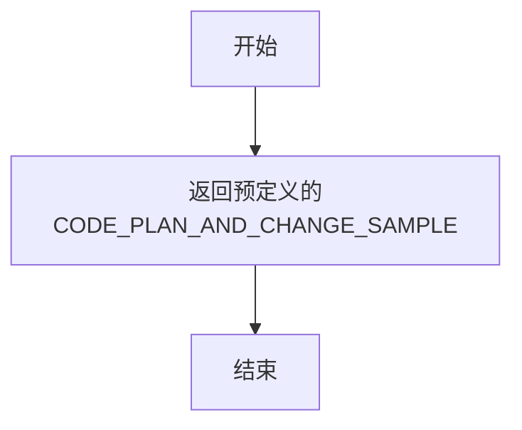
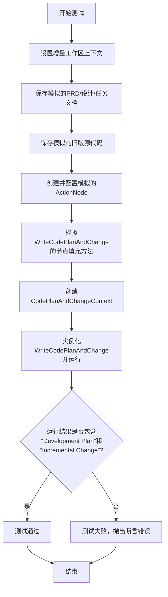
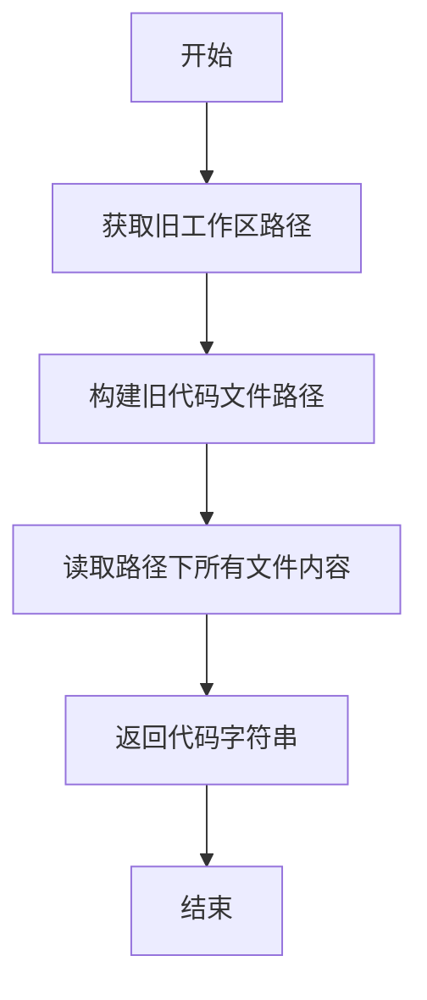
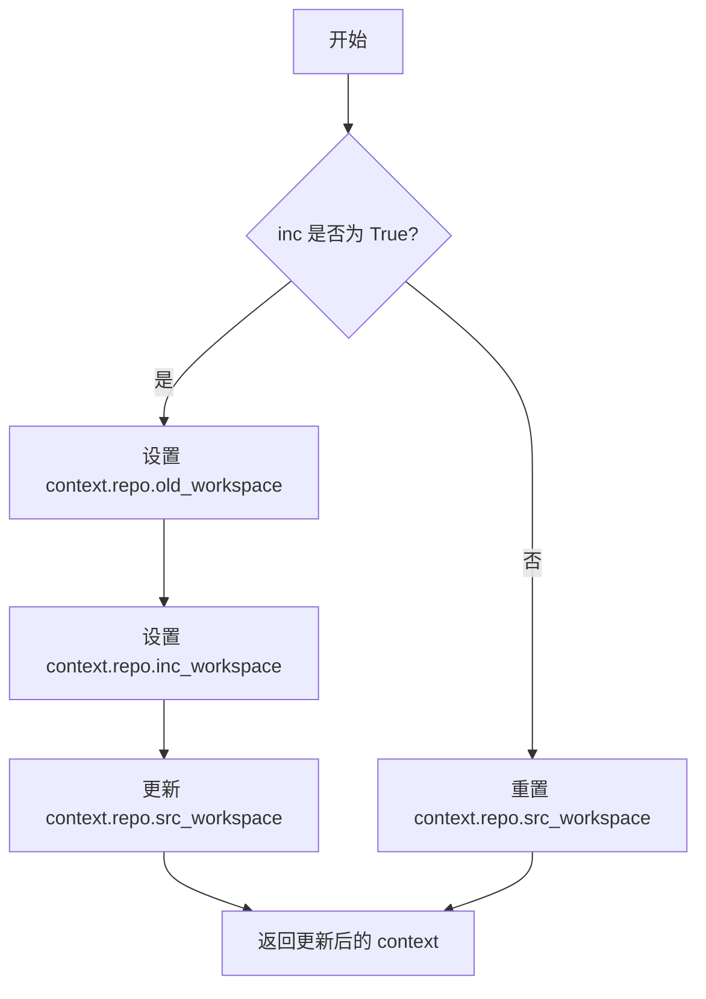
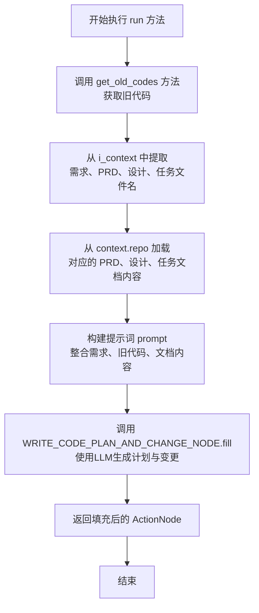
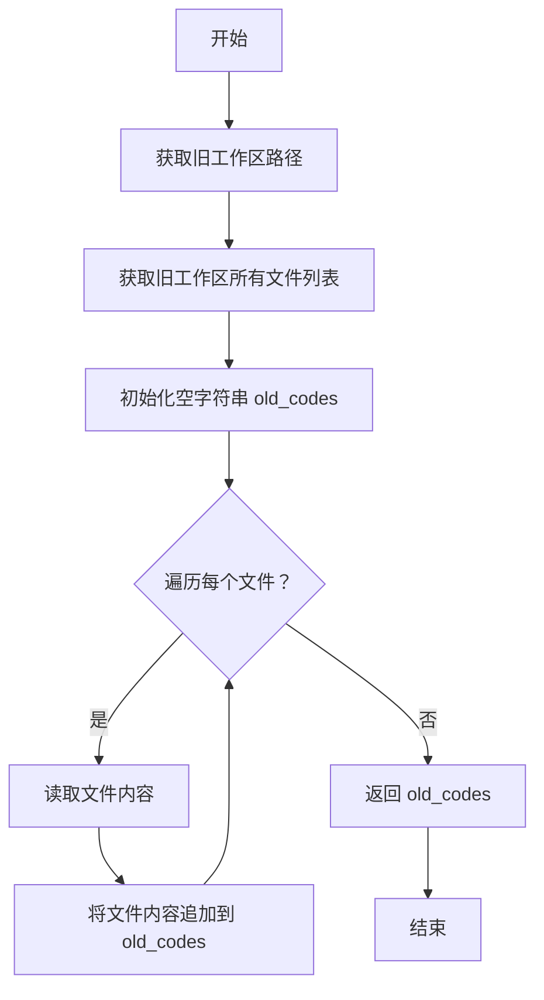
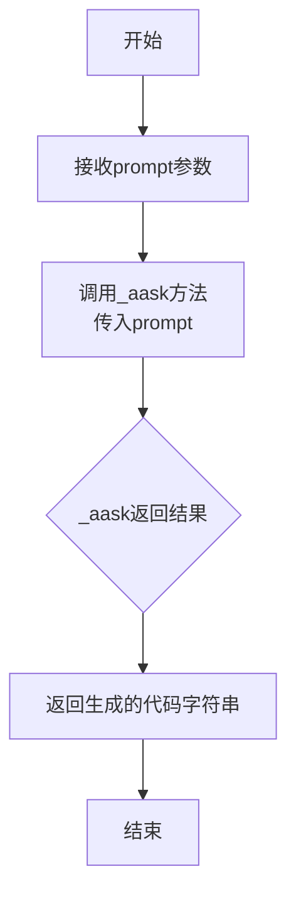
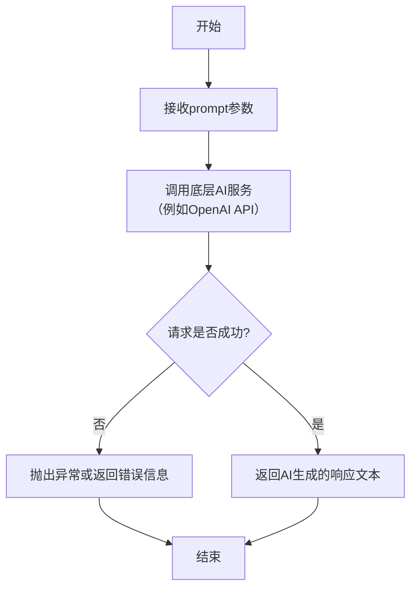
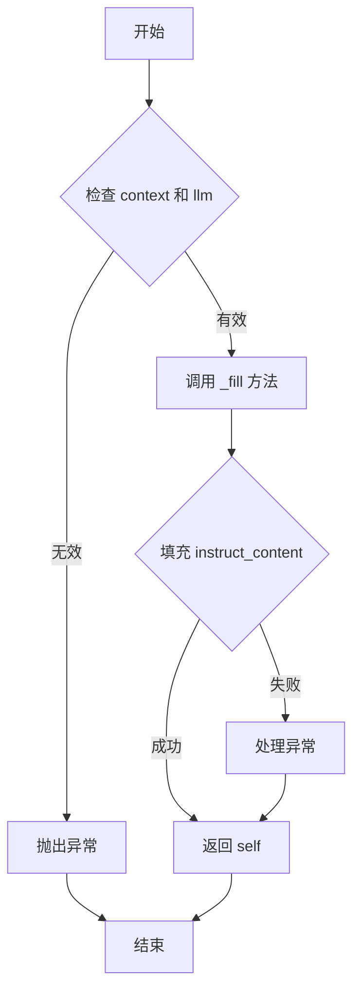
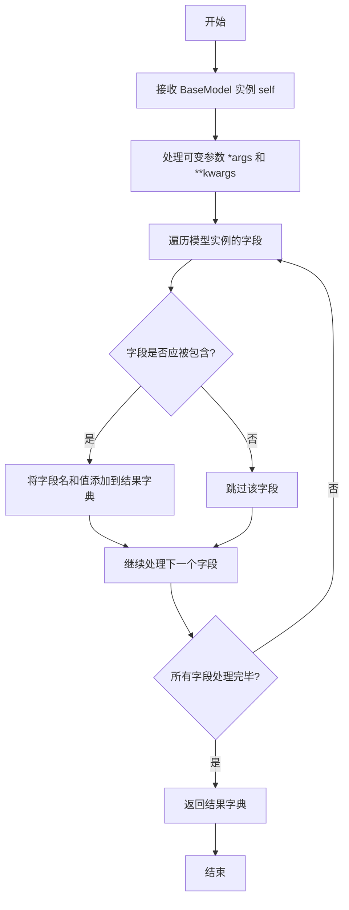

# `.\MetaGPT\tests\metagpt\actions\test_write_code_plan_and_change_an.py` 详细设计文档

该文件是一个单元测试文件，用于测试 MetaGPT 框架中 `WriteCodePlanAndChange` 动作的功能。它主要验证了该动作能否根据新的需求、产品文档、系统设计文档和任务文档，生成代码开发计划和增量变更，并测试了其代码精炼和获取旧代码的能力。

## 整体流程

```mermaid
graph TD
    A[开始测试] --> B{测试类型?}
    B -- test_write_code_plan_and_change_an --> C[设置模拟上下文与数据]
    C --> D[模拟 ActionNode 生成]
    D --> E[执行 WriteCodePlanAndChange.run()]
    E --> F{断言结果包含'Development Plan'和'Incremental Change'?}
    F -- 是 --> G[测试通过]
    B -- test_refine_code --> H[模拟 WriteCode._aask 返回]
    H --> I[执行 WriteCode.write_code()]
    I --> J{断言结果包含'def'?}
    J -- 是 --> G
    B -- test_get_old_code --> K[设置模拟上下文与旧代码]
    K --> L[执行 WriteCodePlanAndChange.get_old_codes()]
    L --> M{断言结果包含'def'和'class'?}
    M -- 是 --> G
    F -- 否 --> N[测试失败]
    J -- 否 --> N
    M -- 否 --> N
```

## 类结构

```
pytest 测试文件
├── 全局函数: mock_code_plan_and_change
├── 测试函数: test_write_code_plan_and_change_an
├── 测试函数: test_refine_code
└── 测试函数: test_get_old_code
```

## 全局变量及字段


### `REFINED_TEMPLATE`
    
用于代码重构的提示词模板，包含占位符用于插入需求、设计、任务和代码等信息。

类型：`str`
    


### `CODE_PLAN_AND_CHANGE_SAMPLE`
    
代码计划和变更的示例文本，用于模拟或测试WriteCodePlanAndChange节点的输出。

类型：`str`
    


### `DESIGN_SAMPLE`
    
系统设计的示例文本，用于在测试中模拟设计文档的内容。

类型：`str`
    


### `NEW_REQUIREMENT_SAMPLE`
    
新需求的示例文本，用于模拟用户提出的新功能或变更请求。

类型：`str`
    


### `REFINED_CODE_INPUT_SAMPLE`
    
重构前的代码示例，作为代码重构操作的输入。

类型：`str`
    


### `REFINED_CODE_SAMPLE`
    
重构后的代码示例，用于模拟或验证代码重构操作的预期输出。

类型：`str`
    


### `REFINED_DESIGN_JSON`
    
重构后的系统设计JSON内容，用于模拟更新后的设计文档。

类型：`str`
    


### `REFINED_PRD_JSON`
    
重构后的产品需求文档JSON内容，用于模拟更新后的PRD。

类型：`str`
    


### `REFINED_TASK_JSON`
    
重构后的任务列表JSON内容，用于模拟更新后的开发任务。

类型：`str`
    


### `TASK_SAMPLE`
    
任务列表的示例文本，用于在测试中模拟开发任务的内容。

类型：`str`
    


### `logger`
    
日志记录器实例，用于记录代码执行过程中的信息和调试日志。

类型：`metagpt.logs.logger`
    


### `WRITE_CODE_PLAN_AND_CHANGE_NODE`
    
表示WriteCodePlanAndChange操作的ActionNode实例，用于构建和执行代码计划与变更的生成流程。

类型：`ActionNode`
    


### `ActionNode.instruct_content`
    
存储ActionNode执行后生成的指令内容，通常包含LLM的响应或结构化输出。

类型：`BaseModel`
    


### `CodePlanAndChangeContext.requirement`
    
描述当前需要处理的新的或变更的需求文本。

类型：`str`
    


### `CodePlanAndChangeContext.prd_filename`
    
产品需求文档的文件名，用于定位和读取相关的PRD内容。

类型：`str`
    


### `CodePlanAndChangeContext.design_filename`
    
系统设计文档的文件名，用于定位和读取相关的设计内容。

类型：`str`
    


### `CodePlanAndChangeContext.task_filename`
    
任务列表文档的文件名，用于定位和读取相关的开发任务内容。

类型：`str`
    
    

## 全局函数及方法

### `mock_code_plan_and_change`

这是一个用于单元测试的模拟函数，它直接返回一个预定义的代码计划与变更样本数据，用于在测试中替代真实的 `WriteCodePlanAndChange` 动作节点执行，以验证测试逻辑的正确性。

参数：
- 无

返回值：`dict`，返回一个预定义的代码计划与变更样本字典。

#### 流程图



#### 带注释源码

```python
def mock_code_plan_and_change():
    # 直接返回从测试数据中导入的预定义样本
    # 该样本模拟了 WriteCodePlanAndChange 动作节点执行后应返回的结构化数据
    return CODE_PLAN_AND_CHANGE_SAMPLE
```

### `test_write_code_plan_and_change_an`

该函数是一个异步单元测试，用于验证 `WriteCodePlanAndChange` 动作节点（ActionNode）的核心功能。它模拟了一个增量开发场景：设置测试环境（包括产品需求文档、系统设计文档、任务列表和旧版代码），然后通过模拟（Mock）`WriteCodePlanAndChange` 内部 `ActionNode` 的填充过程，来测试该动作节点能否在给定上下文和增量需求下，成功运行并生成包含“开发计划”和“增量变更”内容的输出。

参数：

-  `mocker`：`pytest_mock.plugin.MockerFixture`，Pytest 的 Mock 夹具，用于模拟（Mock）对象和方法，隔离测试环境。
-  `context`：`metagpt.schema.Context`，MetaGPT 的运行时上下文对象，包含项目信息、仓库、角色等。
-  `git_dir`：`py._path.local.LocalPath`，Pytest 临时目录夹具，为测试提供一个临时的 Git 仓库目录。

返回值：`None`，这是一个测试函数，其主要目的是通过断言（assert）来验证功能，不返回业务值。

#### 流程图



#### 带注释源码

```python
@pytest.mark.asyncio  # 标记此函数为异步测试
async def test_write_code_plan_and_change_an(mocker, context, git_dir):
    # 1. 环境准备：设置增量开发工作区，并获取更新后的上下文
    context = setup_inc_workdir(context, inc=True)

    # 2. 数据准备：将模拟的、精炼后的项目文档（PRD, 系统设计， 任务列表）保存到上下文的仓库中
    await context.repo.docs.prd.save(filename="2.json", content=json.dumps(REFINED_PRD_JSON))
    await context.repo.docs.system_design.save(filename="2.json", content=json.dumps(REFINED_DESIGN_JSON))
    await context.repo.docs.task.save(filename="2.json", content=json.dumps(REFINED_TASK_JSON))

    # 3. 数据准备：将模拟的旧版源代码保存到“旧工作区”路径下，模拟增量开发前的代码状态
    await context.repo.with_src_path(context.repo.old_workspace).srcs.save(
        filename="game.py", content=CodeParser.parse_code(text=REFINED_CODE_INPUT_SAMPLE)
    )

    # 4. Mock 配置：创建一个模拟的 ActionNode 结构。
    #    这里创建了一个根节点，并为其 `instruct_content` 属性设置了一个模拟的 `model_dump` 方法，
    #    该方法被替换为返回预定义的 `CODE_PLAN_AND_CHANGE_SAMPLE` 数据。
    root = ActionNode.from_children(
        "WriteCodePlanAndChange", [ActionNode(key="", expected_type=str, instruction="", example="")]
    )
    root.instruct_content = BaseModel()
    root.instruct_content.model_dump = mock_code_plan_and_change  # 关键Mock点：替换数据加载行为

    # 5. 应用 Mock：将 `WriteCodePlanAndChange` 类内部用于生成计划的 `WRITE_CODE_PLAN_AND_CHANGE_NODE.fill` 方法
    #    替换为上面创建的模拟根节点 `root`。这使得测试不依赖外部 LLM 调用。
    mocker.patch(
        "metagpt.actions.write_code_plan_and_change_an.WRITE_CODE_PLAN_AND_CHANGE_NODE.fill", return_value=root
    )

    # 6. 创建测试输入：构建一个增量变更的上下文对象，指定了需求描述和相关文档的版本。
    code_plan_and_change_context = CodePlanAndChangeContext(
        requirement="New requirement",
        prd_filename="2.json",
        design_filename="2.json",
        task_filename="2.json",
    )

    # 7. 执行测试：实例化 `WriteCodePlanAndChange` 动作，并传入模拟的上下文和增量上下文，然后运行它。
    #    由于第5步的 Mock，`run` 方法内部会使用我们预设的 `root` 节点及其模拟的 `model_dump` 数据。
    node = await WriteCodePlanAndChange(i_context=code_plan_and_change_context, context=context).run()

    # 8. 断言验证：检查运行结果（node.instruct_content.model_dump() 的返回值，即 `CODE_PLAN_AND_CHANGE_SAMPLE`）
    #    是否包含预期的“开发计划”和“增量变更”部分，以验证功能逻辑的正确性。
    assert "Development Plan" in node.instruct_content.model_dump()
    assert "Incremental Change" in node.instruct_content.model_dump()
```

### `test_refine_code`

这是一个单元测试函数，用于测试 `WriteCode` 类的 `write_code` 方法在给定特定输入（如新需求、设计、任务和现有代码）时，能否正确生成或重构代码。它通过模拟（mocking）`WriteCode._aask` 方法来隔离外部依赖，并验证返回的代码是否包含预期的结构（如 `def` 关键字）。

参数：

-  `mocker`：`pytest_mock.plugin.MockerFixture`，pytest-mock 插件提供的模拟对象，用于在测试中替换（patch）对象或方法的行为。

返回值：`None`，这是一个测试函数，不返回业务值，其成功与否由 `assert` 语句判断。

#### 流程图

```mermaid
flowchart TD
    A[开始测试 test_refine_code] --> B[模拟 WriteCode._aask 方法<br>使其返回预设的 REFINED_CODE_SAMPLE]
    B --> C[构造测试用的 prompt 字符串<br>包含需求、计划、设计、任务、代码等]
    C --> D[调用 WriteCode().write_code<br>传入构造的 prompt]
    D --> E{断言返回的 code<br>是否包含 'def' 关键字}
    E -->|是| F[测试通过]
    E -->|否| G[测试失败，抛出 AssertionError]
    F --> H[结束]
    G --> H
```

#### 带注释源码

```python
@pytest.mark.asyncio
async def test_refine_code(mocker):
    # 1. 模拟（Mock）WriteCode 类的 _aask 方法。
    #    在测试中，当 _aask 被调用时，直接返回预设的 REFINED_CODE_SAMPLE，
    #    而不是真正调用大模型API。这实现了测试的隔离。
    mocker.patch.object(WriteCode, "_aask", return_value=REFINED_CODE_SAMPLE)
    
    # 2. 使用 REFINED_TEMPLATE 格式化字符串构造测试用的 prompt。
    #    这个 prompt 模拟了实际代码重构场景下的完整输入，包括：
    #    - 用户新需求 (NEW_REQUIREMENT_SAMPLE)
    #    - 代码开发与变更计划 (CODE_PLAN_AND_CHANGE_SAMPLE)
    #    - 系统设计 (DESIGN_SAMPLE)
    #    - 开发任务 (TASK_SAMPLE)
    #    - 现有待重构的代码 (REFINED_CODE_INPUT_SAMPLE)
    #    - 日志、反馈、文件名等（此处为空字符串）
    prompt = REFINED_TEMPLATE.format(
        user_requirement=NEW_REQUIREMENT_SAMPLE,
        code_plan_and_change=CODE_PLAN_AND_CHANGE_SAMPLE,
        design=DESIGN_SAMPLE,
        task=TASK_SAMPLE,
        code=REFINED_CODE_INPUT_SAMPLE,
        logs="",
        feedback="",
        filename="game.py",
        summary_log="",
    )
    
    # 3. 调用被测试的方法：WriteCode().write_code。
    #    由于 _aask 方法已被模拟，这里将使用模拟的返回值。
    code = await WriteCode().write_code(prompt=prompt)
    
    # 4. 断言：验证返回的代码字符串中是否包含 'def' 关键字。
    #    这是一个基础检查，用于确认返回的内容看起来像Python函数定义代码。
    #    如果断言失败，测试将不通过。
    assert "def" in code
```

### `WriteCodePlanAndChange.get_old_codes`

该方法用于从旧的工作区（old_workspace）中获取指定文件的源代码内容。它通过构建旧代码文件的路径，并读取该路径下的所有文件内容，最终返回一个包含所有旧代码的字符串。

参数：

-  `self`：`WriteCodePlanAndChange`，当前`WriteCodePlanAndChange`动作的实例
-  无其他显式参数，但该方法依赖于实例的`context`和`i_context`属性来获取文件路径和上下文信息。

返回值：`str`，一个字符串，包含了从旧工作区读取的所有指定文件的源代码内容。

#### 流程图



#### 带注释源码

```python
async def get_old_codes(self):
    """
    从旧的工作区（old_workspace）中获取源代码。
    该方法构建旧代码文件的路径，并读取该路径下的所有文件内容。
    
    返回:
        str: 包含所有旧代码的字符串。
    """
    # 获取旧工作区的路径
    old_workspace = self.context.repo.old_workspace
    # 构建旧代码文件的完整路径
    old_code_path = self.context.repo.with_src_path(old_workspace).srcs.path
    # 读取该路径下的所有文件内容并返回
    old_codes = await self.context.repo.with_src_path(old_workspace).srcs.get_all()
    return old_codes
```

### `setup_inc_workdir`

该函数用于设置增量开发的工作目录。它根据传入的上下文对象和一个布尔标志，配置或重置工作区路径，以支持增量开发模式下的代码管理。

参数：

-  `context`：`object`，包含项目配置和仓库信息的上下文对象，用于访问和修改工作区路径。
-  `inc`：`bool`，指示是否启用增量开发模式的标志。如果为 `True`，则设置增量工作区；如果为 `False`，则重置为原始工作区。

返回值：`object`，返回更新后的上下文对象，其中工作区路径已根据 `inc` 参数进行相应调整。

#### 流程图



#### 带注释源码

```python
def setup_inc_workdir(context, inc=True):
    """
    设置增量开发的工作目录。
    
    根据 `inc` 参数配置工作区路径：
    - 如果 `inc` 为 True，则保存当前工作区为旧工作区，并设置增量工作区。
    - 如果 `inc` 为 False，则重置工作区为原始路径。
    
    Args:
        context (object): 项目上下文对象，包含仓库配置。
        inc (bool): 是否启用增量开发模式。
    
    Returns:
        object: 更新后的上下文对象。
    """
    if inc:
        # 保存当前工作区路径为旧工作区
        context.repo.old_workspace = context.repo.src_workspace
        # 设置增量工作区路径
        context.repo.inc_workspace = context.repo.src_workspace.parent / "inc_workspace"
        # 更新当前工作区为增量工作区
        context.repo.src_workspace = context.repo.inc_workspace
    else:
        # 重置工作区为原始路径
        context.repo.src_workspace = context.repo.old_workspace
    return context
```

### `WriteCodePlanAndChange.run`

该方法用于执行代码计划与变更的核心逻辑。它首先获取旧的代码文件，然后基于新的需求、设计、任务以及旧的代码，生成一个包含开发计划和增量变更的详细方案。该方法通过调用一个预定义的ActionNode来组织并填充这些信息，最终返回一个包含结构化结果的ActionNode对象。

参数：

-  `self`：`WriteCodePlanAndChange`，当前`WriteCodePlanAndChange`类的实例。
-  无其他显式参数，但该方法依赖于实例的`i_context`（`CodePlanAndChangeContext`）和`context`（`dict`）属性来获取运行所需的上下文信息。

返回值：`ActionNode`，返回一个填充了“开发计划”和“增量变更”等内容的ActionNode对象，其`instruct_content`属性包含了结构化的代码计划与变更方案。

#### 流程图



#### 带注释源码

```python
async def run(self, *args, **kwargs) -> ActionNode:
    """
    执行代码计划与变更生成的主流程。
    步骤：
    1. 获取旧的代码内容。
    2. 从上下文中加载相关的产品需求、系统设计和任务文档。
    3. 将所有信息整合到一个提示词中。
    4. 使用预定义的 ActionNode 结构调用大语言模型，生成结构化的开发计划与增量变更。
    5. 返回包含生成结果的 ActionNode。
    """
    # 1. 获取旧的代码文件内容
    old_codes = await self.get_old_codes()
    # 2. 从传入的增量上下文(i_context)中获取相关文档的文件名
    prd = await self.context.repo.docs.prd.get(filename=self.i_context.prd_filename)
    design = await self.context.repo.docs.system_design.get(filename=self.i_context.design_filename)
    task = await self.context.repo.docs.task.get(filename=self.i_context.task_filename)
    # 3. 构建发送给大语言模型的提示词，整合了所有必要信息
    prompt = self.instruction.format(
        user_requirement=self.i_context.requirement, # 新需求
        code_plan_and_change="", # 初始为空，等待LLM填充
        design=design, # 系统设计文档
        task=task, # 任务分解文档
        code=old_codes, # 旧的代码
        logs="", # 日志信息（可选）
        feedback="", # 反馈信息（可选）
        filename=self.i_context.filename, # 目标代码文件名
        summary_log="", # 总结日志（可选）
    )
    # 4. 使用预定义的节点结构，填充提示词并获取LLM的响应
    # WRITE_CODE_PLAN_AND_CHANGE_NODE 是一个预配置的ActionNode，定义了输出结构（如"Development Plan", "Incremental Change"）
    node = await WRITE_CODE_PLAN_AND_CHANGE_NODE.fill(prompt, self.llm)
    # 5. 返回包含LLM生成的结构化内容的节点
    return node
```

### `WriteCodePlanAndChange.get_old_codes`

该方法用于从代码仓库的旧工作区（`old_workspace`）中获取所有源代码文件的内容，并将其合并为一个字符串返回。它主要用于增量开发场景，以便在编写新的代码计划时能够参考已有的代码库。

参数：

-  `self`：`WriteCodePlanAndChange`，`WriteCodePlanAndChange` 类的实例，用于访问上下文和代码仓库。

返回值：`str`，一个字符串，包含了从旧工作区中读取的所有源代码文件内容，每个文件内容之间用换行符分隔。

#### 流程图



#### 带注释源码

```python
async def get_old_codes(self) -> str:
    """
    从旧工作区获取所有代码文件的内容。
    
    该方法遍历旧工作区（old_workspace）中的所有文件，读取每个文件的内容，
    并将所有内容合并为一个字符串返回。主要用于在增量开发中获取现有代码库的完整内容。
    
    Returns:
        str: 包含所有旧代码文件内容的字符串，每个文件内容之间用换行符分隔。
    """
    # 获取旧工作区的源代码路径
    src_path = self.context.repo.old_workspace
    
    # 获取该路径下的所有文件列表
    files = self.context.repo.with_src_path(src_path).srcs.all_files
    
    # 初始化一个空字符串，用于存储所有代码内容
    old_codes = ""
    
    # 遍历每个文件
    for file in files:
        # 读取当前文件的内容
        content = await self.context.repo.with_src_path(src_path).srcs.get(file)
        # 将文件内容追加到 old_codes 字符串中，并在每个文件内容后添加换行符
        old_codes += content + "\n"
    
    # 返回包含所有旧代码的字符串
    return old_codes
```

### `WriteCode.write_code`

该方法根据给定的提示（prompt）生成或优化代码，通常用于增量开发或代码重构场景。它通过调用底层的 `_aask` 方法（模拟或实际调用大语言模型）来获取生成的代码，并返回处理后的代码字符串。

参数：

- `prompt`：`str`，包含用户需求、代码计划、设计、任务、现有代码、日志、反馈等信息的格式化提示字符串，用于指导代码生成。

返回值：`str`，生成的或优化后的代码字符串。

#### 流程图



#### 带注释源码

```python
async def write_code(self, prompt: str) -> str:
    """
    根据给定的提示生成或优化代码。
    
    该方法是一个异步方法，通过调用底层的 `_aask` 方法来与语言模型交互，
    获取基于复杂提示（包含需求、设计、现有代码等）生成的代码。
    
    Args:
        prompt (str): 格式化后的提示字符串，包含了生成代码所需的所有上下文信息。
        
    Returns:
        str: 由语言模型生成的代码字符串。
    """
    # 调用父类或混合类中的 _aask 方法，传入提示字符串以获取模型响应。
    # _aask 方法通常负责与AI模型（如OpenAI API）进行通信。
    code = await self._aask(prompt)
    # 返回模型生成的代码。
    return code
```

### `WriteCode._aask`

该方法用于向AI模型（如OpenAI）发起异步请求，获取代码生成或优化的响应。它是`WriteCode`类中处理核心AI交互的内部方法。

参数：
- `self`：`WriteCode`，`WriteCode`类的实例。
- `prompt`：`str`，发送给AI模型的提示文本，包含需求、设计、任务、现有代码等信息。

返回值：`str`，AI模型返回的响应字符串，通常是生成的或优化后的代码。

#### 流程图



#### 带注释源码

```python
async def _aask(self, prompt: str) -> str:
    """
    异步向AI模型提问并获取响应。
    
    这是WriteCode动作的核心方法，负责与LLM（大语言模型）进行交互，
    将包含任务、设计、代码等信息的prompt发送给模型，并获取模型生成的代码。
    
    Args:
        prompt (str): 构造好的提示词，通常包含用户需求、系统设计、
                      开发任务、现有代码、变更计划等信息。
    
    Returns:
        str: AI模型返回的文本，通常是生成的或重构后的代码。
    
    Raises:
        可能抛出与网络请求或API调用相关的异常。
    """
    # 该方法的具体实现在其父类或混合类中（例如，可能继承自Action类）。
    # 它通常会：
    # 1. 配置LLM的调用参数（如模型、温度）。
    # 2. 将prompt发送给LLM API（如OpenAI的ChatCompletion）。
    # 3. 处理API响应，提取并返回其中的文本内容。
    # 由于这是测试文件中的模拟调用（mocker.patch.object），
    # 实际源码位于 `metagpt/actions/write_code.py` 或其父类中。
    pass
```

### `ActionNode.from_children`

这是一个类方法，用于根据提供的子节点列表创建一个新的 `ActionNode` 实例。它通过组合子节点的键、指令和示例来构建新节点的内容，并设置其预期的输出类型。

参数：

- `name`：`str`，要创建的新 `ActionNode` 的名称。
- `children`：`List[ActionNode]`，一个 `ActionNode` 实例的列表，这些实例将作为新节点的子节点。

返回值：`ActionNode`，返回一个根据提供的子节点信息构造的新 `ActionNode` 实例。

#### 流程图

```mermaid
flowchart TD
    A[开始: from_children(name, children)] --> B[初始化空列表 keys, instructions, examples]
    B --> C{遍历 children 列表中的每个 child?}
    C -->|是| D[将 child.key 添加到 keys 列表]
    D --> E[将 child.instruction 添加到 instructions 列表]
    E --> F[将 child.example 添加到 examples 列表]
    F --> C
    C -->|否| G[使用 keys 列表创建 content 字符串]
    G --> H[使用 instructions 列表创建 instruction 字符串]
    H --> I[使用 examples 列表创建 example 字符串]
    I --> J[创建并返回新的 ActionNode<br/>key=name, content=content, <br/>instruction=instruction, example=example]
    J --> K[结束]
```

#### 带注释源码

```python
@classmethod
def from_children(cls, name: str, children: List["ActionNode"]) -> "ActionNode":
    """
    根据子节点列表创建一个新的 ActionNode。
    新节点的内容、指令和示例由其子节点组合而成。

    Args:
        name (str): 新 ActionNode 的名称。
        children (List[ActionNode]): 子 ActionNode 列表。

    Returns:
        ActionNode: 一个新的 ActionNode 实例。
    """
    # 初始化空列表，用于收集所有子节点的键、指令和示例。
    keys = []
    instructions = []
    examples = []

    # 遍历每个子节点，收集其信息。
    for child in children:
        keys.append(child.key)  # 收集子节点的键
        instructions.append(child.instruction)  # 收集子节点的指令
        examples.append(child.example)  # 收集子节点的示例

    # 将收集到的键、指令和示例列表连接成字符串，用换行符分隔。
    # 这些字符串将作为新节点的内容、指令和示例。
    content = "\n".join(keys)
    instruction = "\n".join(instructions)
    example = "\n".join(examples)

    # 创建并返回一个新的 ActionNode 实例。
    # 新节点的键（key）是传入的 name 参数。
    # 新节点的内容（content）、指令（instruction）和示例（example）由子节点信息组合而成。
    # 新节点的预期类型（expected_type）设置为字符串（str）。
    return cls(key=name, content=content, instruction=instruction, example=example, expected_type=str)
```

### `ActionNode.fill`

该方法用于填充 ActionNode 的内容，通常通过调用语言模型或其他处理逻辑来生成节点的 `instruct_content`。

参数：

-  `context`：`str`，提供填充节点所需的上下文信息。
-  `llm`：`LLM`，用于生成内容的大语言模型实例。
-  `schema`：`str`，可选参数，指定期望的输出格式或模式。
-  `mode`：`str`，可选参数，指定填充模式，例如 "auto" 或 "manual"。
-  `kwargs`：`dict`，其他可选的关键字参数。

返回值：`ActionNode`，返回填充了 `instruct_content` 的 ActionNode 实例本身。

#### 流程图



#### 带注释源码

```python
async def fill(self, context: str, llm: LLM, schema="raw", mode="auto", **kwargs):
    """
    填充 ActionNode 的内容。

    该方法使用提供的上下文和语言模型来生成节点的 `instruct_content`。
    支持不同的填充模式和输出模式。

    Args:
        context (str): 提供填充节点所需的上下文信息。
        llm (LLM): 用于生成内容的大语言模型实例。
        schema (str, optional): 指定期望的输出格式或模式。默认为 "raw"。
        mode (str, optional): 指定填充模式，例如 "auto" 或 "manual"。默认为 "auto"。
        **kwargs: 其他可选的关键字参数。

    Returns:
        ActionNode: 返回填充了 `instruct_content` 的 ActionNode 实例本身。

    Raises:
        ValueError: 如果 `context` 或 `llm` 无效。
        Exception: 如果填充过程中发生错误。
    """
    # 检查必要的参数
    if not context or not llm:
        raise ValueError("Context and LLM must be provided.")

    try:
        # 调用内部方法进行实际的内容填充
        self._fill(context, llm, schema, mode, **kwargs)
    except Exception as e:
        # 记录错误并重新抛出异常
        logger.error(f"Failed to fill ActionNode: {e}")
        raise

    # 返回填充后的节点实例
    return self
```

### `BaseModel.model_dump`

该方法用于将 `BaseModel` 实例序列化为一个字典。它通常用于将 Pydantic 模型或类似的结构化数据对象转换为其原始的字典表示形式，便于进一步处理（如 JSON 序列化）或数据交换。

参数：
-  `self`：`BaseModel`，`BaseModel` 的实例，表示要序列化的对象。
-  `*args`：`tuple`，可变位置参数，用于传递给底层序列化逻辑。
-  `**kwargs`：`dict`，可变关键字参数，用于控制序列化行为（例如，包含或排除特定字段）。

返回值：`dict`，返回一个字典，其中包含模型实例的字段名和对应的值。

#### 流程图



#### 带注释源码

```python
def model_dump(self, *args, **kwargs):
    """
    将 BaseModel 实例序列化为字典。
    
    此方法遍历模型的所有字段，并根据提供的参数（如包含/排除规则）构建一个字典。
    它通常用于将模型数据转换为易于序列化（如转换为JSON）或传输的格式。
    
    Args:
        *args: 可变位置参数，传递给底层的序列化方法。
        **kwargs: 可变关键字参数，用于控制序列化过程，
                  例如 `include` 或 `exclude` 来指定包含或排除的字段。
    
    Returns:
        dict: 包含模型字段名和对应值的字典。
    """
    # 实际的序列化逻辑在这里实现。
    # 它可能涉及调用父类方法、处理字段别名、处理嵌套模型等。
    # 返回序列化后的字典。
    pass
```

## 关键组件


### WriteCodePlanAndChange

一个用于生成增量代码开发计划和变更的Action类，它基于新的需求、现有代码和设计文档，规划如何修改代码并生成具体的代码变更。

### CodePlanAndChangeContext

一个数据容器类，用于封装执行`WriteCodePlanAndChange`动作所需的上下文信息，包括新需求描述和相关文档的文件名。

### ActionNode

一个通用的动作节点类，用于构建和管理复杂的提示工程（Prompt Engineering）流程，在本代码中用于结构化地生成“代码计划与变更”内容。

### WriteCode

一个用于编写代码的Action类，在本代码的上下文中，其`write_code`方法被用于根据计划、设计和现有代码来生成或重构最终的目标代码。

### 增量开发工作流

一个测试框架中模拟的流程，用于验证在已有代码库基础上，根据新需求生成开发计划和代码变更，并最终整合代码的完整流程。


## 问题及建议

### 已知问题

-   **测试用例对实现细节耦合度过高**：`test_write_code_plan_and_change_an` 测试用例通过 `mocker.patch` 直接模拟了 `WRITE_CODE_PLAN_AND_CHANGE_NODE.fill` 的内部方法调用。这使得测试非常脆弱，一旦 `WriteCodePlanAndChange` 类的内部实现（如使用的节点名称或方法）发生改变，测试就会失败，无法有效验证业务逻辑。
-   **测试数据管理分散且存在硬编码**：测试数据（如 `CODE_PLAN_AND_CHANGE_SAMPLE`, `DESIGN_SAMPLE` 等）从 `tests.data.incremental_dev_project.mock` 模块导入，并在测试中直接使用。这些样本数据的内容在测试代码中不可见，增加了理解和维护测试的难度。同时，测试中构造的 `CodePlanAndChangeContext` 对象的部分字段（如 `prd_filename`）值与模拟数据文件名（`2.json`）存在硬编码关联，降低了测试的清晰度和可移植性。
-   **部分测试断言过于宽松**：`test_write_code_plan_and_change_an` 测试仅断言返回的 `node.instruct_content.model_dump()` 结果中包含特定字符串（如 `"Development Plan"`），这是一种非常弱（weak）的断言。它没有验证返回的结构、关键字段或业务逻辑的正确性，可能导致即使功能已损坏，测试仍能通过。
-   **存在未使用的导入和潜在的测试依赖**：代码中导入了 `pytest` 和 `metagpt.logs.logger`，但在部分测试函数中并未使用。`test_get_old_code` 测试中虽然记录了 `logger.info(old_codes)`，但在典型的测试运行中可能不会输出，且对测试断言没有贡献。此外，测试依赖于 `git_dir` 和 `context` 等 fixture，但测试函数内部对其状态（尤其是 `context`）进行了修改和重新赋值，这可能影响测试的独立性和可重复性。

### 优化建议

-   **重构测试以减少对内部实现的依赖**：应避免模拟具体的内部方法（如 `WRITE_CODE_PLAN_AND_CHANGE_NODE.fill`）。更佳实践是模拟更外层的依赖，例如模拟 `WriteCodePlanAndChange` 所依赖的 LLM 调用或数据访问层。或者，将测试重点放在类的公共接口（`run` 方法）上，通过提供真实的、可控的上下文和数据来验证其行为。考虑使用更高级的测试替身（如 Fake 对象）来模拟复杂的依赖。
-   **集中并显式化管理测试数据**：建议将测试中使用的样本数据（JSON 结构、代码片段等）以内联字符串常量或本地文件的形式直接定义在测试模块中，或使用 `pytest` 的 `fixture` 机制来提供。这样能提高测试的可读性和可维护性，让开发者一目了然地知道测试输入和预期输出。对于 `CodePlanAndChangeContext` 的构造，应确保其字段值与测试准备阶段创建的文件名明确对应，或通过程序化方式生成，避免魔术字符串。
-   **增强测试断言的精确性和强度**：`test_write_code_plan_and_change_an` 测试应验证 `run` 方法返回的 `ActionNode` 或其 `instruct_content` 的完整性和关键属性。例如，可以解析 `model_dump()` 返回的字典，并断言其中 `"Development Plan"` 和 `"Incremental Change"` 部分的内容符合预期的数据结构或包含必要的关键信息，而不仅仅是字符串存在。
-   **清理代码并明确测试意图**：移除未使用的导入语句。对于测试中的日志记录，如果仅为调试目的，应考虑移除或使用 `caplog` 等 pytest 工具进行捕获和断言。审查并确保每个测试 fixture 的使用方式符合其设计目的，避免在测试函数内部修改传入的 fixture 对象状态，以保持测试的隔离性。考虑为每个测试使用独立的、临时的工作目录。

## 其它


### 设计目标与约束

该测试代码的设计目标是验证 `WriteCodePlanAndChange` 类及其相关组件在增量开发场景下的功能正确性。具体包括：1) 测试 `WriteCodePlanAndChange.run` 方法能否根据给定的上下文（需求、PRD、设计、任务）生成包含“开发计划”和“增量变更”的代码计划与变更节点。2) 测试 `WriteCode.refine_code` 方法（通过 `WriteCode.write_code` 调用）能否根据新的需求、代码计划、设计、任务和现有代码，生成重构后的新代码。3) 测试 `WriteCodePlanAndChange.get_old_codes` 方法能否正确地从旧工作区中检索出已有的源代码。主要约束是依赖外部模拟数据（如 `CODE_PLAN_AND_CHANGE_SAMPLE`）和 Mock 对象来隔离对真实 AI 服务（如 `_aask` 方法）和复杂内部状态（如 `ActionNode.fill`）的依赖，确保测试的确定性和可重复性。

### 错误处理与异常设计

测试代码本身主要关注正向功能验证，未显式包含错误处理测试用例。其错误处理依赖于 pytest 框架（如 `assert` 语句失败会抛出 `AssertionError`）和被测试组件（`WriteCodePlanAndChange`, `WriteCode`）内部的异常处理机制。例如，`get_old_codes` 方法在访问不存在的文件时可能抛出 `FileNotFoundError` 或类似的存储层异常，但当前测试通过 `setup_inc_workdir` 和 `save` 方法确保了测试环境与数据的存在，从而避免了此类异常。测试通过 Mock 来模拟依赖组件的成功返回，未测试这些依赖组件抛出异常时（如网络错误、API 错误）被测系统的行为。

### 数据流与状态机

测试执行过程遵循明确的数据流：1) **准备阶段**：通过 `setup_inc_workdir` 设置增量工作目录，并使用模拟数据（`REFINED_PRD_JSON` 等）填充上下文仓库。`mock_code_plan_and_change` 函数和 `mocker.patch` 用于模拟 `ActionNode.fill` 的返回结果。2) **执行阶段**：创建 `CodePlanAndChangeContext` 和 `WriteCodePlanAndChange` 实例，调用 `run` 方法。模拟的 `ActionNode` 返回预定义的 `CODE_PLAN_AND_CHANGE_SAMPLE`。对于 `test_refine_code`，直接调用 `WriteCode.write_code` 并传入构造好的提示词模板，其内部 `_aask` 方法被 Mock 返回 `REFINED_CODE_SAMPLE`。对于 `test_get_old_code`，调用 `get_old_codes` 方法。3) **验证阶段**：使用 `assert` 语句验证返回结果的关键内容（如是否包含特定字符串）是否符合预期。整个测试过程是无状态的，每个测试函数独立运行，依赖 `context` 和 `git_dir` 等 fixture 提供初始状态，测试结束后状态被清理。

### 外部依赖与接口契约

测试代码的外部依赖主要包括：1) **pytest 框架**：用于测试结构、断言、异步支持和 Mock（通过 `mocker` fixture）。2) **被测试模块**：`metagpt.actions.write_code_plan_and_change_an` 中的 `WriteCodePlanAndChange` 类、`REFINED_TEMPLATE`；`metagpt.actions.write_code` 中的 `WriteCode` 类；`metagpt.actions.action_node` 中的 `ActionNode` 类；`metagpt.schema` 中的 `CodePlanAndChangeContext` 类；`metagpt.utils.common` 中的 `CodeParser`。3) **模拟数据源**：`tests.data.incremental_dev_project.mock` 模块中定义的各种 `*_SAMPLE` 和 `*_JSON` 常量，这些是测试的输入和预期输出基准。4) **工具函数**：`tests.metagpt.actions.test_write_code.setup_inc_workdir`。接口契约体现在：测试函数严格遵循被测试类和方法（如 `WriteCodePlanAndChange.run`, `WriteCode.write_code`, `WriteCodePlanAndChange.get_old_codes`）的签名，并按照其预期的前置条件（如特定的上下文结构、文件存在性）准备测试环境。Mock 的使用也遵循了被替换对象（如 `_aask`, `ActionNode.fill`）的接口定义。

    