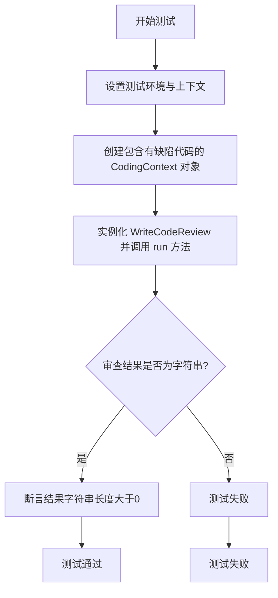
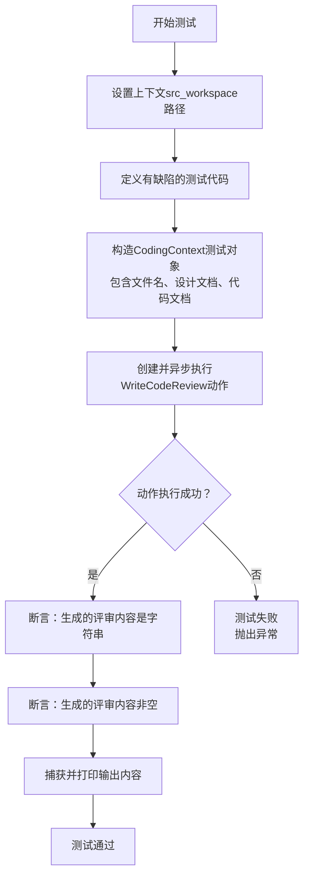
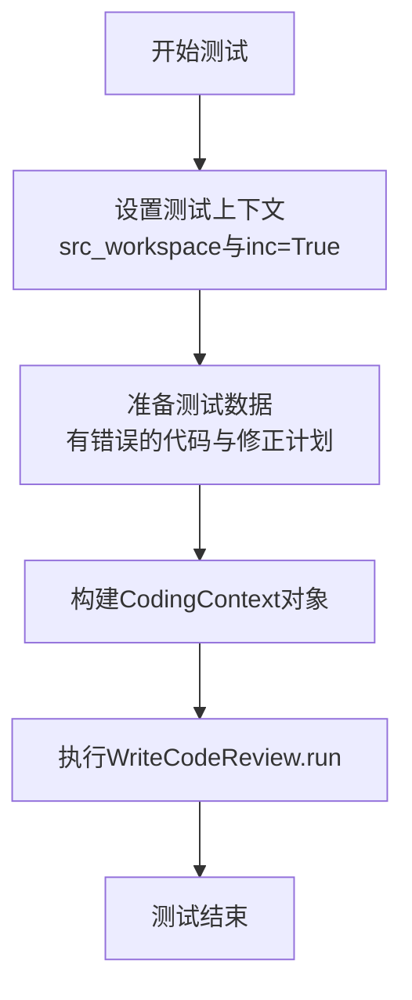
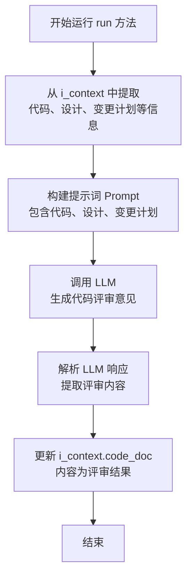

# `.\MetaGPT\tests\metagpt\actions\test_write_code_review.py` 详细设计文档

该代码是一个单元测试文件，用于测试 WriteCodeReview 类的功能。它通过创建包含有缺陷代码的 CodingContext 对象，调用 WriteCodeReview 的 run 方法执行代码审查，并验证返回的审查结果是否符合预期（例如，是否为非空字符串）。

## 整体流程



## 类结构

```
test_write_code_review.py (测试模块)
├── test_write_code_review (测试函数)
└── test_write_code_review_inc (测试函数)
```

## 全局变量及字段


### `capfd`
    
pytest提供的捕获标准输出和标准错误的fixture

类型：`pytest.CaptureFixture`
    


### `context`
    
测试执行上下文，包含配置、工作空间等信息

类型：`metagpt.Context`
    


### `code`
    
待评审的源代码字符串

类型：`str`
    


### `coding_context`
    
代码评审的上下文信息，包含文件名、设计文档、代码文档等

类型：`metagpt.schema.CodingContext`
    


### `code_plan_and_change`
    
代码变更计划，以diff格式描述代码修改

类型：`str`
    


### `CodingContext.filename`
    
代码文件的名称

类型：`str`
    


### `CodingContext.design_doc`
    
设计文档，描述代码的设计意图和功能

类型：`Document`
    


### `CodingContext.code_doc`
    
代码文档，包含待评审的源代码

类型：`Document`
    


### `CodingContext.code_plan_and_change_doc`
    
代码变更计划文档，描述代码的修改计划

类型：`Document`
    


### `Document.content`
    
文档的内容字符串

类型：`str`
    
    

## 全局函数及方法

### `test_write_code_review`

这是一个使用 `pytest` 框架编写的异步测试函数，用于测试 `WriteCodeReview` 动作（Action）的核心功能。该测试模拟了一个代码评审场景：给定一个存在语法错误（`return a +` 缺少操作数）的代码片段和一个简单的设计文档，测试会执行 `WriteCodeReview` 动作，并验证该动作能够运行成功且生成非空的代码评审内容。

参数：
- `capfd`：`pytest` 内置 Fixture，类型为 `CaptureFixture[str]`，用于捕获测试过程中标准输出（stdout）和标准错误（stderr）的内容。
- `context`：`pytest` Fixture，类型应为包含 `repo`、`workdir`、`src_workspace` 等属性的上下文对象，为测试提供运行环境和配置。

返回值：`None`，测试函数通常不显式返回值，其成功与否由 `assert` 语句或 `pytest` 框架判定。

#### 流程图



#### 带注释源码

```python
@pytest.mark.asyncio  # 标记此函数为异步测试，以便pytest使用asyncio事件循环
async def test_write_code_review(capfd, context):
    # 设置测试上下文中的源代码工作空间路径
    context.src_workspace = context.repo.workdir / "srcs"
    
    # 定义一个存在语法错误的代码字符串（缺少第二个操作数）
    code = """
def add(a, b):
    return a + 
"""
    # 构造一个CodingContext对象，模拟一次代码编写任务的上下文
    # 包含：文件名、设计描述文档、待评审的代码文档
    coding_context = CodingContext(
        filename="math.py",
        design_doc=Document(content="编写一个从a加b的函数，返回a+b"),
        code_doc=Document(content=code)
    )

    # 创建WriteCodeReview动作实例，并传入测试上下文，然后异步执行其run方法
    # 预期动作会分析代码，生成评审意见并写回coding_context.code_doc.content
    await WriteCodeReview(i_context=coding_context, context=context).run()

    # 验证部分：不能精确预测生成的评审内容，但可以验证其基本属性
    # 断言1：确保生成的评审内容是一个字符串（例如，包含评论文本或修正后的代码）
    assert isinstance(coding_context.code_doc.content, str)
    # 断言2：确保生成的评审内容不为空，表明动作确实产生了输出
    assert len(coding_context.code_doc.content) > 0

    # 使用capfd fixture捕获测试执行期间打印到标准输出的所有内容
    captured = capfd.readouterr()
    # 将捕获的输出打印出来，便于调试和观察测试过程
    print(f"输出内容: {captured.out}")
```

### `test_write_code_review_inc`

这是一个异步单元测试函数，用于测试在增量模式（`inc=True`）下 `WriteCodeReview` 动作的运行情况。它模拟了一个包含语法错误的代码片段及其对应的修正计划，并验证 `WriteCodeReview` 能够处理这种增量代码评审场景。

参数：

- `capfd`：`pytest` 内置的 `CaptureFixture` 类型，用于捕获测试过程中的标准输出和标准错误流。
- `context`：`pytest` 测试上下文对象，类型通常为自定义的 `Context` 或类似对象，用于提供测试所需的配置和环境信息。

返回值：`None`，测试函数通常不显式返回值，其成功与否由断言或异常决定。

#### 流程图



#### 带注释源码

```python
@pytest.mark.asyncio
async def test_write_code_review_inc(capfd, context):
    # 1. 设置测试环境：指定源代码工作空间并启用增量模式
    context.src_workspace = context.repo.workdir / "srcs"
    context.config.inc = True
    
    # 2. 准备测试数据：一段有语法错误的代码（缺少操作数）
    code = """
    def add(a, b):
        return a + 
    """
    # 3. 准备测试数据：描述如何修正上述错误的计划（补全操作数）
    code_plan_and_change = """
    def add(a, b):
-        return a + 
+        return a + b
    """
    
    # 4. 构建CodingContext对象，封装文件名、设计文档、待评审代码以及增量变更计划
    coding_context = CodingContext(
        filename="math.py",
        design_doc=Document(content="编写一个从a加b的函数，返回a+b"),
        code_doc=Document(content=code),
        code_plan_and_change_doc=Document(content=code_plan_and_change),
    )

    # 5. 创建WriteCodeReview动作实例并异步执行其run方法，触发增量代码评审流程
    await WriteCodeReview(i_context=coding_context, context=context).run()
    # 注意：此测试函数没有显式断言，它主要验证在增量模式下执行WriteCodeReview不会抛出异常。
    # 实际的评审结果（如修正后的代码）会通过CodingContext对象或其它机制（如日志）体现。
```

### `WriteCodeReview.run`

该方法执行代码评审任务。它接收一个包含待评审代码、设计文档等信息的上下文对象，通过调用大语言模型（LLM）对代码进行分析，生成包含问题、建议和改进方案的评审意见，并更新回传入的上下文对象中。

参数：

-  `self`：`WriteCodeReview`，`WriteCodeReview` 类的实例。
-  `*args`：`tuple`，可变位置参数，当前未使用。
-  `**kwargs`：`dict`，可变关键字参数，当前未使用。

返回值：`None`，无返回值。评审结果直接更新到传入的 `i_context` 参数的 `code_doc` 字段中。

#### 流程图



#### 带注释源码

```python
async def run(self, *args, **kwargs):
    # 从实例的 i_context 属性中获取代码评审的上下文信息
    # 该上下文包含了待评审的代码、设计文档、以及可能的代码变更计划
    coding_context = self.i_context
    # 从上下文中提取代码内容，存储在 code 变量中
    code = coding_context.code_doc.content
    # 从上下文中提取设计文档内容，存储在 design 变量中
    design = coding_context.design_doc.content
    # 从上下文中提取代码变更计划内容，存储在 code_plan_and_change 变量中
    # 如果不存在，则默认为空字符串
    code_plan_and_change = coding_context.code_plan_and_change_doc.content if coding_context.code_plan_and_change_doc else ""

    # 构建发送给大语言模型（LLM）的提示词（Prompt）
    # 提示词中包含了任务指令、设计文档、待评审的代码以及代码变更计划
    prompt = f"""
    {self.PROMPT_TEMPLATE}
    ------
    Design: {design}
    ------
    Code: {code}
    ------
    Code Plan And Changes: {code_plan_and_change}
    """
    # 调用 LLM 的异步方法 _aask，传入构建好的提示词，获取模型生成的响应
    rsp = await self._aask(prompt)
    # 将 LLM 返回的代码评审内容（rsp）更新到上下文对象的 code_doc 字段中
    # 这意味着原始的 code_doc 内容（即待评审的代码）被替换为了评审意见
    coding_context.code_doc.content = rsp
```

## 关键组件


### WriteCodeReview 类

这是一个用于执行代码评审的 Action 类，它接收包含代码、设计文档等信息的上下文，分析代码并提供评审意见。

### CodingContext 类

这是一个用于封装代码生成或评审相关上下文信息的 Schema 类，包含文件名、设计文档、代码文档以及增量变更计划等关键信息。

### Document 类

这是一个用于封装文档内容的基础 Schema 类，为设计文档、代码文档等提供统一的数据结构。

### 增量评审模式

一种特殊的代码评审流程，当配置启用增量模式时，评审过程会参考 `code_plan_and_change_doc` 中描述的变更计划，进行更有针对性的增量代码评审。


## 问题及建议


### 已知问题

-   **测试用例断言过于宽松**：`test_write_code_review` 测试用例仅断言返回内容为字符串且长度大于0，这无法有效验证代码评审功能的质量和正确性。例如，即使返回一个无意义的字符串或空格的填充，测试也能通过。
-   **测试用例缺乏对核心逻辑的验证**：测试用例没有验证 `WriteCodeReview` 动作是否正确地分析了代码缺陷（如示例中 `return a +` 的语法错误）并生成了有意义的评审意见。测试更像是检查函数是否运行完毕，而非其功能是否正确。
-   **测试数据硬编码且存在语法错误**：测试中使用的代码片段 `return a +` 是一个不完整的表达式，这虽然是用于测试的用例，但测试本身并未断言输出内容应包含针对此特定错误的评审，降低了测试的价值。
-   **增量模式测试无断言**：`test_write_code_review_inc` 测试用例在调用 `WriteCodeReview.run()` 后没有任何断言语句，这意味着该测试无法捕获增量评审模式下的任何回归错误，是一个无效测试。
-   **存在未使用的导入和变量**：`capfd` 参数在测试中被捕获并打印，但打印内容 (`captured.out`) 并未用于任何断言，这可能是调试遗留代码，在正式测试中应移除或利用其进行验证。

### 优化建议

-   **增强测试断言**：修改 `test_write_code_review` 测试用例，使其能够验证 `WriteCodeReview` 输出的评审内容。例如，可以断言返回的字符串中包含特定的关键词（如“语法错误”、“不完整”、“缺少操作数”等），或者使用更精确的规则（如正则表达式）来匹配预期的评审格式。
-   **为增量测试添加断言**：为 `test_write_code_review_inc` 测试用例添加有意义的断言，以验证在提供 `code_plan_and_change_doc` 上下文时，代码评审功能是否正常工作。例如，可以断言评审意见中提及了代码变更。
-   **重构测试数据与逻辑**：将测试用的代码片段和预期结果提取为更清晰的常量或 fixture，使测试意图更明确。考虑为正例（正确代码）和反例（有缺陷代码）分别编写测试，全面覆盖 `WriteCodeReview` 类的行为。
-   **移除无关代码**：清理测试用例，移除未用于断言的 `capfd` 捕获和打印语句，或将其用于验证标准输出/错误中是否包含特定日志信息。
-   **考虑使用 Mock 或 Fixture**：如果 `WriteCodeReview` 有复杂的外部依赖（如 LLM 调用），建议在单元测试中使用 `unittest.mock` 来模拟这些依赖，确保测试的独立性和速度，并聚焦于业务逻辑的验证。


## 其它


### 设计目标与约束

本测试模块的设计目标是验证 `WriteCodeReview` 动作（Action）的核心功能：对给定的代码片段进行自动化代码审查。主要约束包括：
1.  **功能验证**：确保 `WriteCodeReview.run()` 方法能够处理 `CodingContext` 输入，并生成非空的字符串作为代码审查结果。
2.  **上下文兼容**：测试需兼容两种运行模式：标准模式（`config.inc = False`）和增量模式（`config.inc = True`），后者需要提供 `code_plan_and_change_doc` 作为额外输入。
3.  **测试隔离性**：测试应依赖于 `pytest` 框架提供的 `capfd`（捕获标准输出/错误）和自定义的 `context` fixture，以模拟运行时环境，确保测试的可重复性和独立性。
4.  **断言聚焦**：由于生成的审查内容具有不确定性，测试断言应聚焦于验证输出类型（字符串）和基本有效性（非空），而非具体的审查文本。

### 错误处理与异常设计

当前测试用例本身不包含复杂的错误处理逻辑，其设计主要依赖于 `pytest` 的断言机制和异常传播：
1.  **预期失败**：如果 `WriteCodeReview().run()` 方法内部抛出未处理的异常（如 `CodingContext` 字段缺失、模型调用失败等），测试将自动失败，这有助于发现动作逻辑中的缺陷。
2.  **输出捕获**：使用 `capfd` fixture 捕获并打印测试过程中可能的日志或调试输出，辅助排查问题，但测试成功与否不依赖于捕获的内容。
3.  **输入验证缺失**：测试用例未显式测试 `WriteCodeReview` 动作对非法输入（如 `None`、空字符串、格式错误的代码）的处理。这部分错误处理责任被委托给动作实现本身，测试仅覆盖了“正常”和“增量”两种预设场景。

### 数据流与状态机

测试模块的数据流清晰，遵循“准备-执行-验证”模式：
1.  **状态准备**：
    *   通过 `context` fixture 设置源代码工作区路径（`src_workspace`）和运行模式（`config.inc`）。
    *   构造 `CodingContext` 对象，其中包含待审查的代码（`code_doc`）、设计描述（`design_doc`）以及在增量模式下所需的变更计划（`code_plan_and_change_doc`）。
2.  **动作执行**：
    *   创建 `WriteCodeReview` 动作实例，注入准备好的 `CodingContext` 和 `context`。
    *   异步调用 `run()` 方法。这是核心的数据处理节点，输入数据在此被转化为代码审查意见。
3.  **状态验证**：
    *   检查 `CodingContext.code_doc.content` 是否被更新为一个非空的字符串。这验证了动作执行后目标状态的变化。
    *   数据流终点是测试断言，它决定了测试的最终状态（通过/失败）。

### 外部依赖与接口契约

测试模块的外部依赖和接口契约如下：
1.  **`pytest` 框架**：依赖其测试发现、fixture 注入（`capfd`, `context`）、断言和异步测试支持（`@pytest.mark.asyncio`）。
2.  **`WriteCodeReview` 类**：测试依赖于该类的公共接口，特别是其构造函数（接受 `i_context` 和 `context` 参数）和异步 `run()` 方法。契约是调用 `run()` 会修改传入的 `CodingContext` 对象中的 `code_doc.content`。
3.  **`CodingContext` 与 `Document` 类**：测试依赖于这些数据模型类的结构来构建输入。契约是 `CodingContext` 必须包含有效的 `filename`、`design_doc` 和 `code_doc`，在增量模式下还需包含 `code_plan_and_change_doc`。
4.  **`context` Fixture**：这是一个项目特定的测试 fixture，测试依赖于它提供运行时配置和工作区路径。契约是该 fixture 必须提供 `src_workspace`、`repo.workdir` 和 `config.inc` 等属性。
5.  **隐式依赖**：`WriteCodeReview` 动作内部可能依赖 LLM、代码解析器等，但这些依赖对测试模块是透明的，测试仅关注其输入输出行为。

### 测试策略与覆盖范围

本模块采用基于场景的测试策略：
1.  **场景划分**：
    *   `test_write_code_review`：测试标准代码审查流程。验证基础功能：给定代码和设计描述，能生成审查意见。
    *   `test_write_code_review_inc`：测试增量代码审查流程。验证在提供变更计划（diff）时，审查功能仍能正常工作。此场景下断言被省略，主要验证流程不报错。
2.  **覆盖范围**：
    *   **正面路径**：覆盖了动作的主流程（两个场景）。
    *   **输入变异**：通过两个测试用例，覆盖了 `CodingContext` 包含/不包含 `code_plan_and_change_doc` 的情况。
    *   **输出验证**：对标准场景的输出进行了类型和最小长度验证。
3.  **覆盖缺口**：
    *   **错误/边界输入**：未测试空代码、语法错误极多的代码、`design_doc` 为空等边界情况。
    *   **依赖失败**：未模拟 `WriteCodeReview` 内部依赖（如网络、模型）失败时的行为。
    *   **并发与性能**：未涉及多任务并发调用或性能基准测试。
    *   **状态副作用**：除了 `code_doc.content`，未验证 `CodingContext` 其他字段或全局状态是否被意外修改。

    