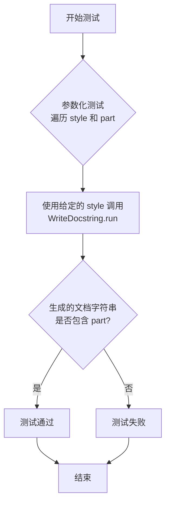
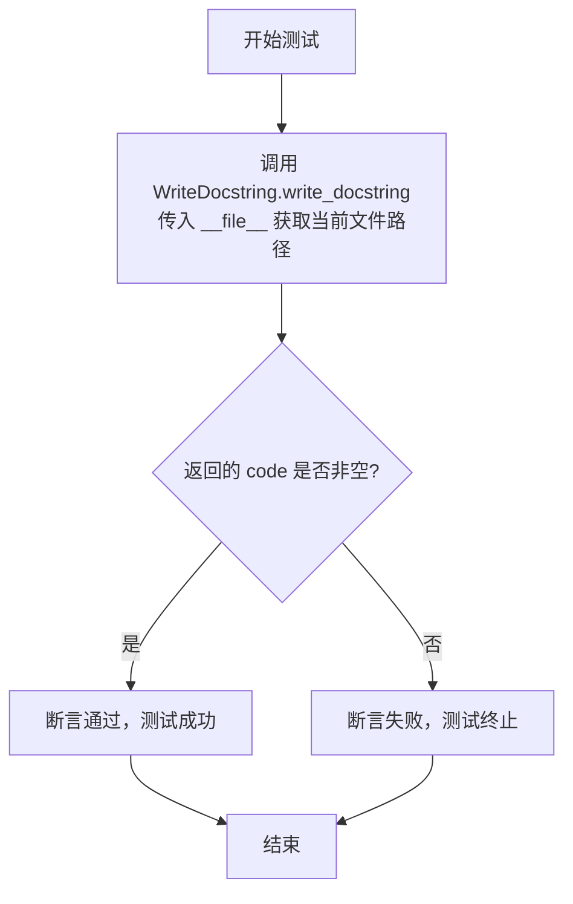
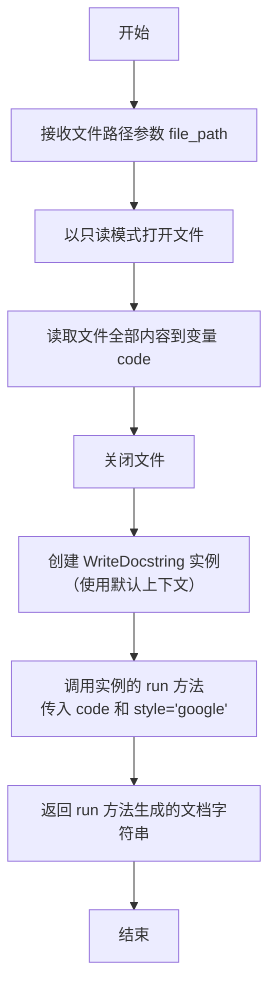

# `.\MetaGPT\tests\metagpt\actions\test_write_docstring.py` 详细设计文档

这是一个使用 pytest 框架编写的单元测试文件，用于测试 MetaGPT 框架中 WriteDocstring 类的功能。该测试验证 WriteDocstring 类能否根据不同的文档字符串风格（Google、NumPy、Sphinx）为给定的 Python 代码片段（包含函数和类）自动生成符合规范的文档字符串。

## 整体流程

```mermaid
graph TD
    A[开始执行测试] --> B{测试函数 test_write_docstring?}
    B -- 是 --> C[使用参数化数据 (style, part)]
    C --> D[创建 WriteDocstring 实例]
    D --> E[调用 run 方法，传入 code 和 style]
    E --> F{生成的文档字符串 ret 是否包含预期部分 part?}
    F -- 是 --> G[测试通过]
    F -- 否 --> H[测试失败]
    B -- 否 --> I[执行测试函数 test_write]
    I --> J[调用 WriteDocstring.write_docstring(__file__)]
    J --> K{是否成功生成文档字符串?}
    K -- 是 --> G
    K -- 否 --> H
    G --> L[测试结束]
    H --> L
```

## 类结构

```
测试文件 (test_write_docstring.py)
├── 全局变量 `code` (测试输入数据)
├── 测试函数 `test_write_docstring` (参数化测试)
└── 测试函数 `test_write` (简单功能测试)
```

## 全局变量及字段


### `code`
    
一个包含Python函数和类定义的字符串，用作WriteDocstring动作的测试输入。

类型：`str`
    


    

## 全局函数及方法

### `test_write_docstring`

这是一个使用 `pytest` 框架编写的异步测试函数，用于验证 `WriteDocstring` 类的 `run` 方法。该测试会使用不同的文档字符串风格（Google、NumPy、Sphinx）对给定的代码片段生成文档字符串，并断言生成的文档字符串中包含特定于该风格的关键部分。

参数：
- `style`：`str`，指定要测试的文档字符串风格（例如 "google", "numpy", "sphinx"）。
- `part`：`str`，预期在生成的文档字符串中出现的特定字符串或关键字，用于验证风格是否正确应用。
- `context`：`pytest` 的 `context` fixture，提供测试运行时的上下文信息。

返回值：`None`，这是一个测试函数，不返回任何值，其成功与否由 `assert` 语句决定。

#### 流程图



#### 带注释源码

```python
# 使用 pytest 的异步支持和参数化装饰器
@pytest.mark.asyncio
@pytest.mark.parametrize(
    # 定义参数化测试的数据集，每个元组包含 (style, part)
    ("style", "part"),
    [
        ("google", "Args:"),        # 测试 Google 风格，检查 "Args:" 部分
        ("numpy", "Parameters"),    # 测试 NumPy 风格，检查 "Parameters" 部分
        ("sphinx", ":param name:"), # 测试 Sphinx 风格，检查 ":param name:" 部分
    ],
    ids=["google", "numpy", "sphinx"], # 为每个测试用例指定一个易读的 ID
)
async def test_write_docstring(style: str, part: str, context):
    # 1. 创建 WriteDocstring 动作实例，并传入测试上下文
    # 2. 调用其异步 run 方法，传入预定义的代码字符串和指定的文档字符串风格
    ret = await WriteDocstring(context=context).run(code, style=style)
    
    # 断言：生成的文档字符串 (ret) 中必须包含预期风格对应的关键部分 (part)
    # 这是测试的核心验证点，用于确认 WriteDocstring 功能按预期工作
    assert part in ret
```

### `test_write`

这是一个异步单元测试函数，用于测试 `WriteDocstring` 类的 `write_docstring` 类方法。它通过调用该方法为当前文件生成文档字符串，并断言返回结果非空，以此验证该功能的基本可用性。

参数：
- 无显式参数。该函数是一个测试用例，不接收用户定义的参数。

返回值：`None`，该函数是一个测试用例，不返回业务值，其返回值类型为 `None`。

#### 流程图



#### 带注释源码

```python
@pytest.mark.asyncio  # 标记此函数为异步测试函数，以便 pytest-asyncio 插件处理
async def test_write():
    # 调用 WriteDocstring 类的类方法 write_docstring，
    # 并传入当前模块的文件路径（__file__）作为参数。
    # 该方法的预期行为是为指定文件生成文档字符串。
    code = await WriteDocstring.write_docstring(__file__)
    # 使用断言验证 write_docstring 方法的返回值（code）非空。
    # 如果 code 为 None 或空字符串等假值，则测试失败。
    assert code
```

### `WriteDocstring.run`

该方法用于为给定的Python代码生成指定风格的文档字符串（docstring）。它接收原始代码和文档字符串风格作为输入，通过调用大语言模型（LLM）来分析和理解代码结构，并生成符合所选风格规范的文档字符串。

参数：

- `code`：`str`，需要生成文档字符串的原始Python源代码。
- `style`：`str`，指定生成的文档字符串风格，例如 `"google"`、`"numpy"` 或 `"sphinx"`。

返回值：`str`，生成的文档字符串。

#### 流程图

```mermaid
graph TD
    A[开始: run(code, style)] --> B[调用LLM生成文档字符串]
    B --> C[返回生成的文档字符串]
    C --> D[结束]
```

#### 带注释源码

```python
async def run(self, code: str, style: str = "google") -> str:
    """
    为给定的代码生成指定风格的文档字符串。

    Args:
        code (str): 需要生成文档字符串的Python源代码。
        style (str): 文档字符串的风格，例如 'google', 'numpy', 'sphinx'。默认为 'google'。

    Returns:
        str: 生成的文档字符串。
    """
    # 构建提示词，指导LLM根据指定风格为代码生成文档字符串
    prompt = self.PROMPT_TEMPLATE.format(code=code, style=style)
    # 调用LLM（通过`self._aask`方法）生成内容
    docstring = await self._aask(prompt)
    # 返回生成的文档字符串
    return docstring
```

### `WriteDocstring.write_docstring`

这是一个静态方法，用于为指定的Python文件生成文档字符串。它通过读取文件内容，调用`WriteDocstring`类的`run`方法，并指定使用`google`风格的文档字符串格式来完成此任务。

参数：

-  `file_path`：`str`，需要生成文档字符串的Python文件的路径。

返回值：`str`，生成的文档字符串内容。

#### 流程图



#### 带注释源码

```python
@staticmethod
async def write_docstring(file_path: str) -> str:
    """
    为指定文件生成文档字符串。

    Args:
        file_path (str): 需要生成文档字符串的Python文件路径。

    Returns:
        str: 生成的文档字符串内容。
    """
    # 以只读模式打开指定路径的文件
    with open(file_path, "r") as file:
        # 读取文件的全部内容
        code = file.read()
    # 创建一个 WriteDocstring 动作实例，使用默认的上下文
    # 调用其 run 方法，传入读取的代码，并指定使用 google 风格的文档字符串格式
    # 返回生成的文档字符串
    return await WriteDocstring().run(code, style="google")
```

## 关键组件


### WriteDocstring 类

一个用于为给定代码生成符合指定风格（如 Google、NumPy、Sphinx）的文档字符串（docstring）的 Action 类。

### 测试框架与参数化

使用 pytest 框架进行异步单元测试，并通过 `@pytest.mark.parametrize` 装饰器对 `test_write_docstring` 测试函数进行参数化，以验证 WriteDocstring 类对不同文档字符串风格的支持。

### 代码样本

包含一个简单的函数 `add_numbers` 和一个 `Person` 类的代码字符串，用作生成文档字符串的输入样本。

### 异步测试执行

测试用例使用 `@pytest.mark.asyncio` 装饰器标记，以支持对 WriteDocstring 类中异步方法 `run` 的测试。


## 问题及建议


### 已知问题

-   **测试用例与实现逻辑耦合**：`test_write_docstring` 测试用例直接断言生成的文档字符串中必须包含特定风格的关键字（如 `"Args:"`, `"Parameters"`, `":param name:"`）。这假设了 `WriteDocstring` 类的内部实现细节（即输出格式），使得测试变得脆弱。如果 `WriteDocstring` 类的实现逻辑或输出格式发生变化（例如，关键字拼写、格式微调），即使其核心功能（生成文档字符串）仍然正确，这些测试也会失败。
-   **测试覆盖不完整**：测试用例仅验证了生成的文档字符串是否包含特定风格的关键字片段，但没有验证生成的文档字符串的整体正确性、完整性或与输入代码的语义匹配度。例如，没有检查生成的参数描述是否准确，或者对于类方法是否生成了正确的文档。
-   **资源依赖与副作用**：`test_write` 测试用例调用了 `WriteDocstring.write_docstring(__file__)`，该方法可能会读取当前测试文件本身并生成其文档字符串。这引入了对文件系统（读取文件）的依赖，并可能产生副作用（如修改文件内容，取决于 `write_docstring` 方法的实现），使得测试不是纯粹、可重复的单元测试，且可能在不同环境下表现不一致。
-   **异步测试的潜在误用**：测试用例被标记为 `@pytest.mark.asyncio` 并使用 `async def`，但测试的主体逻辑（`WriteDocstring(context=context).run`）很可能是同步的或封装了异步操作。如果 `WriteDocstring.run` 方法本身不是真正的异步操作（例如，它只是同步调用），那么使用异步测试框架可能增加了不必要的复杂性，且可能隐藏了真正的并发问题。

### 优化建议

-   **解耦测试与实现细节**：重构 `test_write_docstring` 测试用例，使其不依赖于输出字符串中的特定关键字。可以考虑以下方法：
    -   **使用更健壮的断言**：例如，断言生成的文档字符串非空，并且其长度或结构符合预期（如包含函数名、参数名等），而不检查具体的格式关键字。
    -   **使用黄金文件（Golden File）测试**：为每种风格预先生成并保存一份预期的、完整的文档字符串输出（黄金文件）。在测试中，将 `WriteDocstring` 生成的输出与黄金文件进行对比。这样，当输出格式需要调整时，只需更新黄金文件即可，测试逻辑保持不变。
    -   **验证功能性属性**：编写测试来验证文档字符串的功能性属性，例如，使用 `ast` 模块解析生成的文档字符串，检查它是否可以被正确解析为有效的 Python 文档字符串，或者使用 `doctest` 模块验证文档字符串中的示例是否能正确运行。
-   **增强测试覆盖范围**：增加更多测试用例，覆盖不同的输入场景，例如：
    -   测试空函数、复杂函数（带有默认参数、可变参数、关键字参数等）。
    -   测试类、类方法、静态方法、属性。
    -   测试嵌套函数或类。
    -   测试无效的 Python 代码输入，验证错误处理。
-   **隔离外部依赖**：对于 `test_write` 测试用例：
    -   如果 `write_docstring` 方法确实需要文件路径，考虑在测试中使用临时文件或内存中的文件模拟对象（如 `io.StringIO`）来避免对实际文件系统的依赖。
    -   明确 `write_docstring` 方法的预期行为（是只读、只写，还是读写？），并确保测试不会意外修改生产代码文件。
    -   考虑将这类涉及文件 I/O 的测试标记为集成测试，并与纯单元测试分开。
-   **审查异步使用**：检查 `WriteDocstring` 类的 `run` 和 `write_docstring` 方法是否真正需要异步执行。如果它们主要是 CPU 密集型或同步 I/O 操作，考虑将其改为同步方法，并相应地调整测试（移除 `async`/`await`）。如果确实需要异步，确保测试中正确地模拟了任何异步依赖（如网络请求、数据库查询）。
-   **提高测试可读性和维护性**：为测试用例和参数化添加更清晰的描述性名称或文档字符串，说明每个测试场景的目的。考虑将测试数据（如不同的 `code` 片段和 `style`）提取到外部的配置文件或测试数据类中，使测试主体更简洁。


## 其它


### 设计目标与约束

本测试代码的设计目标是验证 `WriteDocstring` 类的核心功能，即根据给定的代码字符串和指定的文档字符串风格（Google、NumPy、Sphinx）生成对应的文档字符串。主要约束包括：
1.  **功能验证**：确保 `WriteDocstring` 类的 `run` 方法能正确生成包含特定风格关键字的文档字符串。
2.  **异步兼容**：测试方法需使用 `pytest.mark.asyncio` 装饰器，以适配被测试的异步 `run` 方法。
3.  **参数化测试**：使用 `pytest.mark.parametrize` 对不同的文档字符串风格进行参数化测试，提高测试覆盖率和代码简洁性。
4.  **独立性**：测试应尽可能独立，不依赖外部服务或复杂环境，`context` 参数由 `pytest` fixture 提供。

### 错误处理与异常设计

本测试代码本身不包含复杂的业务逻辑错误处理，其错误处理主要体现在测试断言和对 `pytest` 框架的运用上：
1.  **断言失败**：如果 `WriteDocstring` 生成的文档字符串不包含预期的关键字（如 `"Args:"`, `"Parameters"`, `":param name:"`），`assert` 语句将抛出 `AssertionError`，导致测试用例失败，从而指示功能不符合预期。
2.  **异步异常**：如果被测试的 `WriteDocstring().run` 方法内部抛出异常（例如，由于无效的输入或内部错误），该异常将传播到测试方法中，导致测试用例失败。
3.  **测试框架异常**：`pytest` 会捕获并报告测试执行过程中的各种异常，包括导入错误、fixture 错误等。

### 数据流与状态机

本测试代码的数据流相对简单直接：
1.  **输入**：
    *   `code`：一个预定义的包含函数和类的 Python 代码字符串。
    *   `style`：通过参数化测试提供的文档字符串风格标识（`"google"`, `"numpy"`, `"sphinx"`）。
    *   `context`：由测试框架注入的上下文对象（通常是一个 `Message` 对象或类似物，用于满足 `Action` 类的接口要求）。
2.  **处理**：
    *   测试函数 `test_write_docstring` 调用 `WriteDocstring(context=context).run(code, style=style)`。
    *   `WriteDocstring` 类的 `run` 方法执行其内部逻辑，处理输入并生成文档字符串。
3.  **输出/验证**：
    *   `run` 方法返回生成的文档字符串 `ret`。
    *   测试断言检查 `ret` 中是否包含与给定 `style` 对应的特定关键字 `part`。
    *   整个流程不涉及持久化状态的变化，是一个无状态的函数调用验证过程。

### 外部依赖与接口契约

本测试代码依赖以下外部组件，并遵循相应的接口契约：
1.  **pytest 框架**：依赖 `pytest` 作为测试运行器，并使用其 `@pytest.mark.asyncio`、`@pytest.mark.parametrize` 装饰器以及 `pytest.main` 函数。契约是正确使用这些装饰器和函数。
2.  **metagpt.actions.write_docstring.WriteDocstring 类**：这是被测试的核心依赖。测试代码依赖于其公共接口：
    *   `__init__(context)`：构造函数，接受一个 `context` 参数。
    *   `async run(code, style)`：异步方法，接受 `code` 和 `style` 参数，并返回一个字符串（文档字符串）。测试的成功建立在此方法按约定工作的基础上。
    *   `async write_docstring(file_path)`：一个类方法（由 `test_write` 测试），接受文件路径并返回处理后的代码。
3.  **asyncio**：依赖 Python 的 `asyncio` 库来支持异步测试的执行。

    