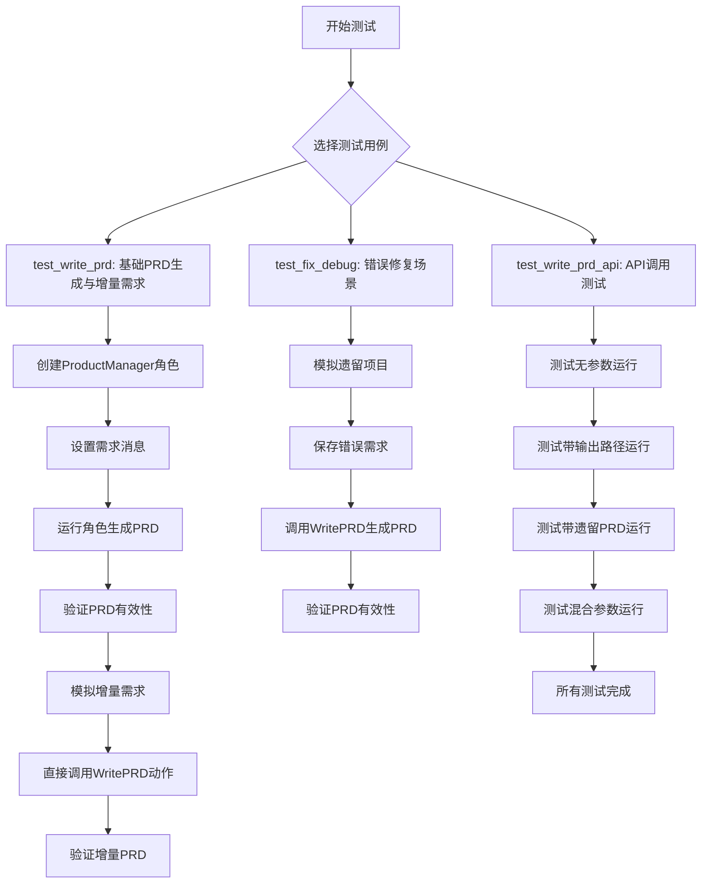
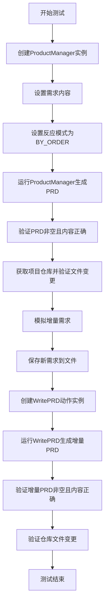
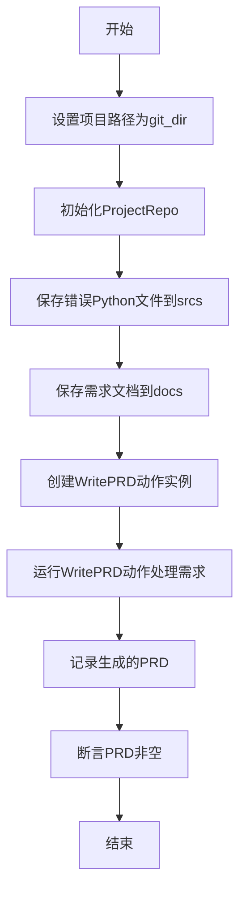
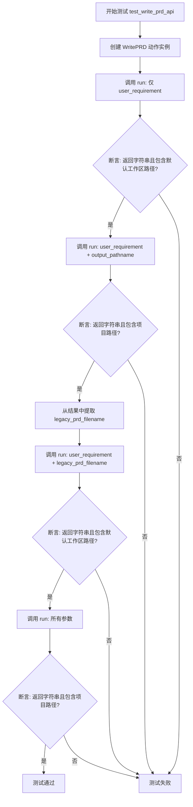
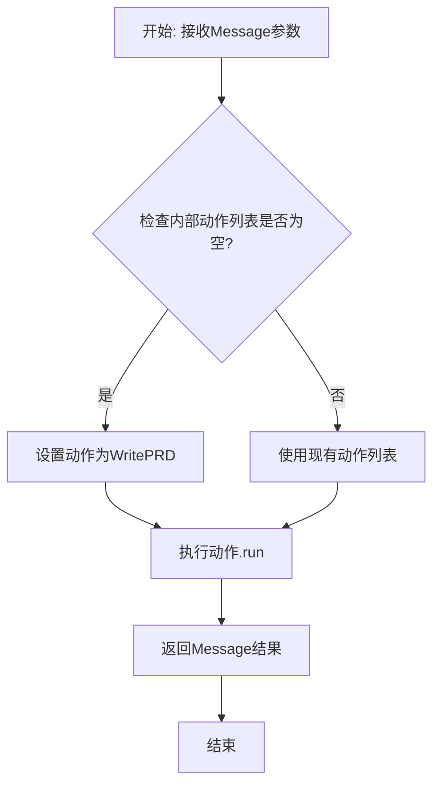
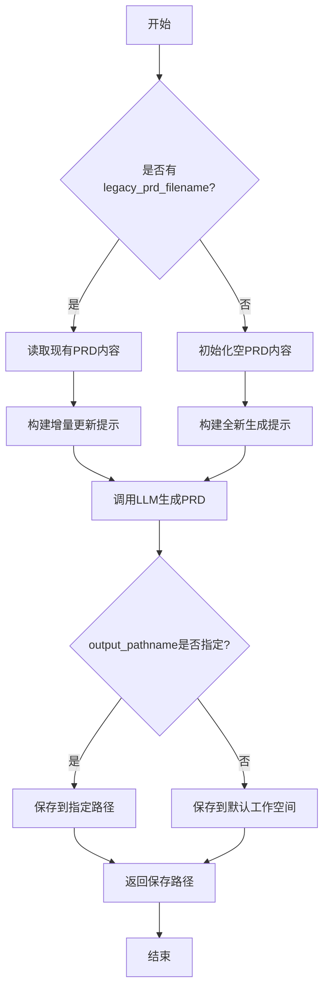
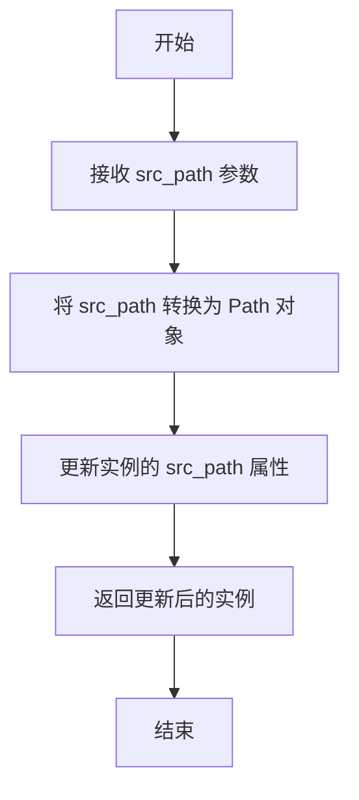
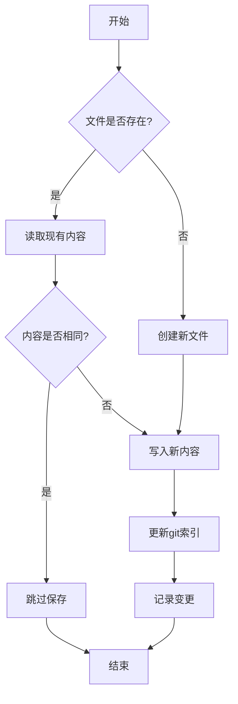
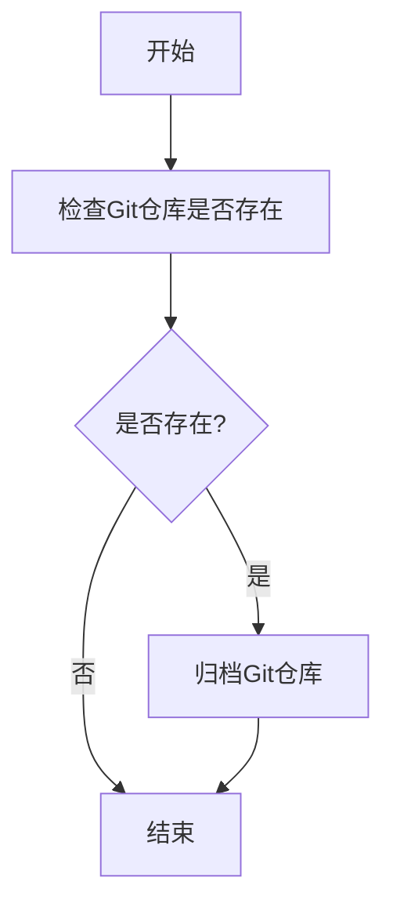

# `.\MetaGPT\tests\metagpt\actions\test_write_prd.py` 详细设计文档

该文件是一个测试文件，用于测试产品经理角色和WritePRD动作的功能，包括验证产品需求文档（PRD）的生成、增量需求处理、错误修复场景下的PRD生成，以及通过API调用WritePRD动作的各种用例。

## 整体流程



## 类结构

```
pytest测试模块
├── test_write_prd (异步测试函数)
├── test_fix_debug (异步测试函数)
└── test_write_prd_api (异步测试函数)
```

## 全局变量及字段


### `DEFAULT_WORKSPACE_ROOT`
    
默认工作空间根目录路径，用于指定项目文件存储的基础位置

类型：`str`
    


### `REQUIREMENT_FILENAME`
    
需求文档的文件名常量，用于统一存储和读取需求文件

类型：`str`
    


### `NEW_REQUIREMENT_SAMPLE`
    
新的需求样本数据，用于模拟增量开发中的新需求输入

类型：`str`
    


### `logger`
    
日志记录器实例，用于输出测试过程中的调试和状态信息

类型：`logging.Logger`
    


### `pytest`
    
Python测试框架模块，用于编写和运行单元测试

类型：`module`
    


### `uuid`
    
UUID生成模块，用于创建唯一的标识符

类型：`module`
    


### `Path`
    
路径操作类，提供跨平台的路径操作和文件系统访问功能

类型：`class`
    


### `ProductManager.rc`
    
角色上下文对象，包含角色运行时的配置和状态信息

类型：`RoleContext`
    


### `ProjectRepo.docs`
    
文档管理器，负责项目中文档文件的存储、读取和管理操作

类型：`DocumentManager`
    


### `ProjectRepo.srcs`
    
源代码管理器，负责项目中源代码文件的存储、读取和管理操作

类型：`SourceCodeManager`
    


### `ProjectRepo.git_repo`
    
Git仓库对象，提供版本控制相关的操作和状态查询功能

类型：`GitRepository`
    


### `Message.content`
    
消息内容主体，存储实际传递的文本信息

类型：`str`
    


### `Message.cause_by`
    
消息触发来源，标识是哪个动作或角色产生了此消息

类型：`str`
    


### `Message.instruct_content`
    
结构化指令内容，可选的附加结构化数据

类型：`Optional[Any]`
    
    

## 全局函数及方法

### `test_write_prd`

该函数是一个异步测试函数，用于测试产品经理角色（ProductManager）和编写产品需求文档（WritePRD）功能。它模拟了从用户需求到生成PRD的完整流程，包括初始需求处理和增量需求更新，并验证生成的PRD内容非空且相关文件被正确修改。

参数：

- `new_filename`：`pytest fixture`，用于生成新的临时文件名，确保测试环境隔离。
- `context`：`pytest fixture`，提供测试上下文，包括配置和项目路径等。

返回值：`None`，该函数为测试函数，不返回具体值，通过断言验证测试结果。

#### 流程图



#### 带注释源码

```python
@pytest.mark.asyncio
async def test_write_prd(new_filename, context):
    # 创建产品经理角色实例，传入测试上下文
    product_manager = ProductManager(context=context)
    # 定义初始用户需求
    requirements = "开发一个基于大语言模型与私有知识库的搜索引擎，希望可以基于大语言模型进行搜索总结"
    # 设置产品经理的反应模式为按顺序执行
    product_manager.rc.react_mode = RoleReactMode.BY_ORDER
    # 运行产品经理，传入需求消息，生成PRD
    prd = await product_manager.run(Message(content=requirements, cause_by=UserRequirement))
    # 验证生成的PRD的触发动作为WritePRD
    assert prd.cause_by == any_to_str(WritePRD)
    # 记录需求和生成的PRD内容
    logger.info(requirements)
    logger.info(prd)

    # 断言PRD不为空且内容非空
    assert prd is not None
    assert prd.content != ""
    # 获取项目仓库实例，验证PRD相关文件已变更
    repo = ProjectRepo(context.kwargs.project_path)
    assert repo.docs.prd.changed_files
    # 归档Git仓库变更
    repo.git_repo.archive()

    # 模拟增量需求场景
    # 设置上下文配置为增量模式
    context.config.inc = True
    # 设置项目路径
    context.config.project_path = context.kwargs.project_path
    # 重新获取项目仓库实例
    repo = ProjectRepo(context.config.project_path)
    # 保存新的需求样本到文件
    await repo.docs.save(filename=REQUIREMENT_FILENAME, content=NEW_REQUIREMENT_SAMPLE)

    # 创建WritePRD动作实例
    action = WritePRD(context=context)
    # 运行WritePRD动作，传入新需求消息，生成增量PRD
    prd = await action.run([Message(content=NEW_REQUIREMENT_SAMPLE, instruct_content=None)])
    # 记录新需求和生成的增量PRD内容
    logger.info(NEW_REQUIREMENT_SAMPLE)
    logger.info(prd)

    # 断言增量PRD不为空且内容非空
    assert prd is not None
    assert prd.content != ""
    # 验证仓库文件已变更
    assert repo.git_repo.changed_files
```

### `test_fix_debug`

该函数是一个异步测试函数，用于测试`WritePRD`动作在修复和调试场景下的功能。它模拟了一个遗留项目环境，其中包含一个存在错误的Python文件和一个需求文档。函数通过`WritePRD`动作处理需求，生成产品需求文档（PRD），并验证生成的PRD非空。

参数：

- `new_filename`：`str`，新文件的名称，用于测试环境中的文件命名。
- `context`：`Context`，测试上下文对象，包含配置和运行时信息。
- `git_dir`：`Path`，Git仓库目录的路径，用于模拟遗留项目的文件结构。

返回值：`None`，该函数为测试函数，不返回具体值，仅通过断言验证测试结果。

#### 流程图



#### 带注释源码

```python
@pytest.mark.asyncio
async def test_fix_debug(new_filename, context, git_dir):
    # 模拟遗留项目环境
    # 将项目路径设置为提供的git_dir，用于模拟遗留项目的根目录
    context.kwargs.project_path = str(git_dir)
    
    # 初始化ProjectRepo，管理项目文件结构
    repo = ProjectRepo(context.kwargs.project_path)
    
    # 设置源代码路径为git_dir的名称，模拟项目结构
    repo.with_src_path(git_dir.name)
    
    # 保存一个存在错误的Python文件到源代码目录
    # 文件内容包含未定义的变量`st`，模拟代码错误
    await repo.srcs.save(filename="main.py", content='if __name__ == "__main__":\nmain()')
    
    # 定义需求内容，描述代码中的错误
    requirements = "ValueError: undefined variable `st`."
    
    # 保存需求文档到文档目录
    await repo.docs.save(filename=REQUIREMENT_FILENAME, content=requirements)

    # 创建WritePRD动作实例，传入上下文
    action = WritePRD(context=context)
    
    # 运行WritePRD动作，处理需求并生成PRD
    # 需求以Message对象形式传递，包含内容但不包含指令内容
    prd = await action.run([Message(content=requirements, instruct_content=None)])
    
    # 记录生成的PRD内容，用于调试和验证
    logger.info(prd)

    # 断言生成的PRD非空，确保动作成功执行并输出内容
    assert prd is not None
    assert prd.content != ""
```

### `test_write_prd_api`

该函数是一个异步测试函数，用于测试`WritePRD`动作类的`run`方法在不同参数组合下的行为。它验证了`run`方法能够正确处理用户需求字符串、输出路径和遗留PRD文件名等参数，并返回有效的PRD内容字符串。

参数：

- `context`：`pytest.fixture`，测试上下文，提供配置信息（如项目路径）等。

返回值：`None`，该函数是测试函数，不返回业务值，仅通过断言验证测试结果。

#### 流程图



#### 带注释源码

```python
@pytest.mark.asyncio
async def test_write_prd_api(context):
    # 1. 创建一个 WritePRD 动作的实例
    action = WritePRD()
    
    # 2. 测试场景1：仅提供用户需求字符串
    # 调用 run 方法，传入用户需求
    result = await action.run(user_requirement="write a snake game.")
    # 断言：返回结果应为非空字符串，并且包含默认工作区根路径
    assert isinstance(result, str)
    assert result
    assert str(DEFAULT_WORKSPACE_ROOT) in result

    # 3. 测试场景2：提供用户需求字符串和自定义输出路径
    # 生成一个唯一的输出文件名（JSON格式），路径基于测试上下文中的项目路径
    result = await action.run(
        user_requirement="write a snake game.",
        output_pathname=str(Path(context.config.project_path) / f"{uuid.uuid4().hex}.json"),
    )
    # 断言：返回结果应为非空字符串，并且包含测试上下文中的项目路径
    assert isinstance(result, str)
    assert result
    assert str(context.config.project_path) in result

    # 4. 从上一个测试的结果中提取出生成的PRD文件名，作为“遗留PRD文件”
    # 假设结果字符串格式包含路径信息，这里通过查找冒号并清理引号来提取文件名
    ix = result.find(":")
    legacy_prd_filename = result[ix + 1 :].replace('"', "").strip()

    # 5. 测试场景3：提供用户需求字符串和遗留PRD文件名（模拟增量更新）
    result = await action.run(user_requirement="Add moving enemy.", legacy_prd_filename=legacy_prd_filename)
    # 断言：返回结果应为非空字符串，并且包含默认工作区根路径
    assert isinstance(result, str)
    assert result
    assert str(DEFAULT_WORKSPACE_ROOT) in result

    # 6. 测试场景4：提供所有参数（用户需求、输出路径、遗留PRD文件名）
    result = await action.run(
        user_requirement="Add moving enemy.",
        output_pathname=str(Path(context.config.project_path) / f"{uuid.uuid4().hex}.json"),
        legacy_prd_filename=legacy_prd_filename,
    )
    # 断言：返回结果应为非空字符串，并且包含测试上下文中的项目路径
    assert isinstance(result, str)
    assert result
    assert str(context.config.project_path) in result
```

### `ProductManager.run`

该方法用于执行产品经理角色的核心工作流程，接收用户需求消息，通过内部动作（如编写PRD）进行处理，并返回处理结果消息。

参数：
- `message`：`Message`，包含用户需求内容的消息对象，其`cause_by`属性通常为`UserRequirement`。

返回值：`Message`，处理完成后生成的消息对象，其内容为产品需求文档（PRD），`cause_by`属性通常为`WritePRD`。

#### 流程图



#### 带注释源码

```python
    async def run(self, message: Message) -> Message:
        """
        产品经理角色的主要执行方法。
        处理传入的需求消息，生成产品需求文档。
        Args:
            message: 包含用户需求的消息。
        Returns:
            包含PRD内容的消息。
        """
        # 如果角色上下文中的动作列表为空，则初始化为包含WritePRD动作
        if not self.rc.actions:
            self.rc.actions = [WritePRD()]
        # 调用父类Role的run方法，执行动作链并返回结果
        return await super().run(message)
```

### `WritePRD.run`

该方法用于执行产品需求文档（PRD）的生成过程。它接收用户需求、输出路径和现有PRD文件等参数，通过调用LLM生成或更新PRD文档，并将结果保存到指定位置。

参数：

- `user_requirement`：`str`，用户的需求描述文本
- `output_pathname`：`str`，可选参数，指定PRD文档的输出路径
- `legacy_prd_filename`：`str`，可选参数，现有PRD文档的文件路径，用于增量更新

返回值：`str`，返回生成的PRD文档的存储路径字符串

#### 流程图



#### 带注释源码

```python
async def run(self, 
              user_requirement: str, 
              output_pathname: str = None, 
              legacy_prd_filename: str = None) -> str:
    """
    执行PRD生成的主要方法
    
    Args:
        user_requirement: 用户需求描述
        output_pathname: 输出文件路径（可选）
        legacy_prd_filename: 现有PRD文件路径（可选，用于增量更新）
    
    Returns:
        str: 生成的PRD文档存储路径
    """
    # 如果有现有PRD文件，读取其内容用于增量更新
    if legacy_prd_filename:
        legacy_prd = await self.repo.docs.get(filename=legacy_prd_filename)
        prompt = self.prompt_template.format(
            user_requirement=user_requirement,
            legacy_prd=legacy_prd
        )
    else:
        # 全新PRD生成
        prompt = self.prompt_template.format(
            user_requirement=user_requirement,
            legacy_prd=""
        )
    
    # 调用LLM生成PRD内容
    prd_content = await self._aask(prompt=prompt)
    
    # 确定输出路径
    if output_pathname:
        output_path = Path(output_pathname)
    else:
        output_path = Path(DEFAULT_WORKSPACE_ROOT) / f"prd_{uuid.uuid4().hex}.md"
    
    # 保存PRD文档
    await self.repo.docs.save(filename=output_path.name, content=prd_content)
    
    # 返回保存路径
    return str(output_path)
```

### `ProjectRepo.with_src_path`

该方法用于设置或更新项目仓库中的源代码路径（`src_path`），并返回更新后的 `ProjectRepo` 实例，以支持链式调用。

参数：

- `src_path`：`str`，源代码目录的路径

返回值：`ProjectRepo`，更新后的 `ProjectRepo` 实例

#### 流程图



#### 带注释源码

```python
def with_src_path(self, src_path: str) -> "ProjectRepo":
    """
    设置或更新源代码路径，并返回更新后的实例以支持链式调用。
    
    参数:
        src_path (str): 源代码目录的路径
    
    返回:
        ProjectRepo: 更新后的 ProjectRepo 实例
    """
    # 将传入的字符串路径转换为 Path 对象，并赋值给实例的 src_path 属性
    self.src_path = Path(src_path)
    # 返回当前实例，支持链式调用
    return self
```

### `ProjectRepo.save`

该方法用于将指定内容保存到项目仓库中的指定文件，支持增量更新和版本控制。

参数：

- `filename`：`str`，要保存的文件名
- `content`：`str`，要保存的文件内容
- `dependencies`：`Optional[List[str]]`，可选参数，文件的依赖项列表

返回值：`None`，无返回值

#### 流程图



#### 带注释源码

```python
async def save(self, filename: str, content: str, dependencies: Optional[List[str]] = None) -> None:
    """
    保存内容到指定文件
    
    如果文件已存在且内容相同，则跳过保存
    如果文件不存在或内容不同，则写入新内容并更新git索引
    
    Args:
        filename: 要保存的文件名
        content: 要保存的文件内容
        dependencies: 可选，文件的依赖项列表
    """
    # 构建完整的文件路径
    file_path = self.path / filename
    
    # 检查文件是否已存在
    if file_path.exists():
        # 读取现有内容
        existing_content = file_path.read_text(encoding="utf-8")
        
        # 如果内容相同，则跳过保存
        if existing_content == content:
            return
    
    # 确保目录存在
    file_path.parent.mkdir(parents=True, exist_ok=True)
    
    # 写入新内容
    file_path.write_text(content, encoding="utf-8")
    
    # 更新git索引
    self.git_repo.add(file_path)
    
    # 记录变更
    self.changed_files.append(str(file_path))
    
    # 如果有依赖项，也添加到git索引
    if dependencies:
        for dep in dependencies:
            dep_path = self.path / dep
            if dep_path.exists():
                self.git_repo.add(dep_path)
```

### `ProjectRepo.archive`

该方法用于归档项目仓库，将当前工作目录中的更改保存到Git仓库中，并创建一个归档文件。

参数：
- 无

返回值：`None`，无返回值

#### 流程图



#### 带注释源码

```python
def archive(self):
    """
    归档项目仓库，将当前工作目录中的更改保存到Git仓库中，并创建一个归档文件。
    该方法会检查Git仓库是否存在，如果存在则执行归档操作。
    """
    if self.git_repo:  # 检查Git仓库是否存在
        self.git_repo.archive()  # 调用Git仓库的归档方法
```

## 关键组件

### WritePRD Action

用于根据用户需求生成产品需求文档（PRD）的核心动作组件，支持增量更新和基于历史PRD的迭代。

### ProductManager Role

产品经理角色，负责接收用户需求并协调WritePRD动作来生成PRD，是需求到PRD转换的协调者。

### ProjectRepo

项目仓库管理组件，负责管理项目文件（如需求文档、PRD、源代码）的版本控制、保存和归档操作。

### RoleReactMode

角色反应模式枚举，定义了角色（如ProductManager）处理消息的顺序和行为模式，例如BY_ORDER表示按顺序执行。

### Message

消息数据结构，用于在角色和动作之间传递信息，包含内容、触发动作类型等元数据。

### UserRequirement

用户需求动作标识，用于标记触发PRD生成流程的初始消息类型。

### 增量开发支持

通过配置标志（如`context.config.inc`）和保存新需求到文件，支持在已有项目基础上进行增量PRD生成。

### 测试框架集成

使用pytest进行异步测试，验证WritePRD动作在不同场景（如全新需求、增量需求、错误修复）下的功能正确性。

## 问题及建议

### 已知问题

-   **测试用例职责不单一**：`test_write_prd` 函数同时测试了`ProductManager`角色运行和`WritePRD`动作运行，还包含了增量需求场景的测试。这违反了单元测试的单一职责原则，使得测试逻辑复杂，难以定位具体失败点。
-   **硬编码的测试数据**：测试中使用了硬编码的字符串作为需求输入（如`“开发一个基于大语言模型与私有知识库的搜索引擎...”`），这使得测试用例难以复用和维护，特别是当需求格式或内容发生变化时。
-   **测试环境依赖与副作用**：测试用例依赖于外部环境（如`context`、`git_dir`）和文件系统操作（通过`ProjectRepo`进行文件保存、归档）。这导致测试不是完全隔离的，可能因环境状态（如文件已存在、Git仓库状态）而产生不可预测的结果或副作用。
-   **断言过于宽泛**：部分断言仅检查返回的PRD内容不为空（`assert prd.content != ""`），这种断言过于薄弱，无法有效验证`WritePRD`动作或`ProductManager`角色是否输出了符合预期格式和质量的PRD文档。
-   **缺乏模拟（Mock）**：测试直接调用了真实的`WritePRD`动作和`ProductManager`角色，而没有对其可能依赖的外部服务（如大语言模型调用）进行模拟。这导致测试运行速度慢、可能不稳定（受网络或外部API影响），且并非纯粹的单元测试。
-   **`test_fix_debug` 函数命名和目的不清晰**：函数名暗示其用于修复调试，但实际行为是模拟一个遗留项目并测试`WritePRD`对错误信息的处理。其测试意图和场景不够明确。

### 优化建议

-   **拆分测试函数**：将`test_write_prd`拆分为多个独立的测试函数，例如：`test_product_manager_generate_prd`、`test_write_prd_action`、`test_write_prd_with_incremental_requirement`。每个函数只测试一个特定功能或场景。
-   **使用测试夹具（Fixture）管理测试数据**：将测试用的需求字符串（如`NEW_REQUIREMENT_SAMPLE`）和预期结果片段提取到`pytest`的`fixture`或模块级常量中，提高可维护性。
-   **隔离测试环境**：为每个测试用例使用独立的、临时的工作目录和Git仓库，确保测试之间没有状态残留。可以利用`pytest`的`tmp_path`等夹具来管理临时文件。
-   **增强断言**：除了检查非空，还应验证返回的`Message`对象的`cause_by`属性是否正确，以及PRD内容是否包含预期的关键部分（如功能列表、非功能性需求等）。可以考虑使用更精确的字符串匹配或解析PRD结构进行验证。
-   **引入模拟（Mock）和存根（Stub）**：对`WritePRD`动作内部可能调用的LLM、文件读写等外部依赖进行模拟。例如，使用`unittest.mock`来模拟`Action.run`方法中与AI模型的交互，返回预定义的、可控的响应，使测试快速、稳定且专注于业务逻辑。
-   **重命名并明确`test_fix_debug`**：将`test_fix_debug`重命名为更具描述性的名称，如`test_write_prd_for_debug_requirement`，并在文档字符串中清晰说明其测试场景：“测试WritePRD动作处理包含错误信息的调试需求时，能否生成有效的PRD或解决方案描述”。
-   **增加负面测试用例**：补充测试用例，验证当输入无效（如空需求、格式错误的需求）时，系统是否按预期处理（如抛出合适的异常或返回错误信息）。

## 其它


### 设计目标与约束

本测试代码的设计目标是验证`WritePRD`动作和`ProductManager`角色在多种场景下的功能正确性，包括：1) 基于初始需求生成产品需求文档（PRD）；2) 在增量开发模式下，基于新的需求更新PRD；3) 处理调试/错误修复场景下的需求；4) 测试`WritePRD`动作的API接口在不同参数组合下的行为。约束包括：测试必须与项目仓库（`ProjectRepo`）交互，验证文件系统的变更；需要模拟不同的项目上下文（如全新项目、增量项目、遗留项目）；测试应覆盖异步执行模式。

### 错误处理与异常设计

测试代码本身主要使用`assert`语句进行验证，未显式包含错误处理逻辑。其设计依赖于`pytest`框架来捕获和管理测试执行过程中可能出现的异常（如断言失败、异步操作异常）。测试用例预期被测试对象（`WritePRD`, `ProductManager`）在收到无效输入或遇到内部错误时能抛出适当的异常，这些异常将由`pytest`捕获并导致测试失败，从而验证错误处理路径。例如，`test_fix_debug`测试用例模拟了一个包含错误信息的遗留项目，预期`WritePRD`能处理这种非标准需求输入并生成有效的PRD内容。

### 数据流与状态机

测试执行的数据流始于测试夹具（如`new_filename`, `context`, `git_dir`）提供的初始状态（如临时工作区、配置上下文、Git仓库）。每个测试用例定义了一个明确的状态转换序列：1) **设置初始状态**：配置角色/动作、写入初始需求文件；2) **执行操作**：调用`run`方法，触发PRD生成流程，这涉及内部LLM调用、文档解析与生成；3) **验证状态变更**：检查返回的`Message`对象内容、验证项目仓库中相关文件（如PRD文档）是否被创建或修改、检查Git仓库的变更状态。测试`test_write_prd`展示了从“初始需求”到“生成PRD”再到“增量需求更新PRD”的状态迁移。`test_write_prd_api`则测试了通过不同输出路径和遗留PRD文件参数来引导数据流走向不同分支。

### 外部依赖与接口契约

1.  **被测试对象接口**：测试依赖于`WritePRD`类的`run`方法接口（接受`Message`列表或`user_requirement`等关键字参数）和`ProductManager`角色的`run`方法接口。它验证这些接口在不同输入下的返回值类型和内容符合预期。
2.  **项目仓库接口**：测试与`ProjectRepo`类紧密交互，依赖其`docs`、`srcs`属性进行文件保存，以及`git_repo`属性检查变更。这验证了`WritePRD`动作与项目持久化层之间的契约。
3.  **配置与上下文**：测试通过`context`夹具获取运行时配置（如`inc`标志、`project_path`），这模拟了系统环境对业务逻辑的影响。
4.  **框架依赖**：完全依赖`pytest`框架进行测试组织、异步支持和断言。
5.  **间接依赖**：测试的成功运行隐含地依赖于`WritePRD`和`ProductManager`的内部依赖，如LLM客户端、知识库等，但这些依赖的具体状态和行为在测试中被隔离或模拟（通过`context`配置），测试主要关注其对外输出的正确性。

### 测试策略与覆盖范围

测试策略采用集成测试与单元测试结合的方式。`test_write_prd`和`test_fix_debug`更接近集成测试，它们验证了从用户需求输入到PRD文档生成及仓库状态变更的完整链条。`test_write_prd_api`则更偏向于单元测试，专注于验证`WritePRD`动作类API接口的多种调用方式。覆盖范围包括：正常需求处理、增量开发模式、错误信息处理、API参数组合（有无`output_pathname`和`legacy_prd_filename`）。通过检查生成的PRD内容非空、特定路径字符串是否出现在结果中、以及文件系统是否发生预期变更来进行功能验证。

### 环境与配置要求

测试执行需要特定的环境配置：1) 必须提供有效的`context`，其中包含必要的运行时配置，特别是用于LLM调用的API密钥等（虽然测试中可能使用Mock）；2) `pytest.mark.asyncio`标记表明测试需要在异步事件循环中运行；3) 测试涉及文件系统操作，因此需要可写的临时目录（由`new_filename`, `git_dir`等夹具提供）；4) 测试`test_write_prd`中启用了增量模式(`context.config.inc = True`)，这要求被测试系统支持并正确理解此配置。测试代码本身不负责环境搭建，而是假设这些条件已由测试框架或前置操作满足。

    