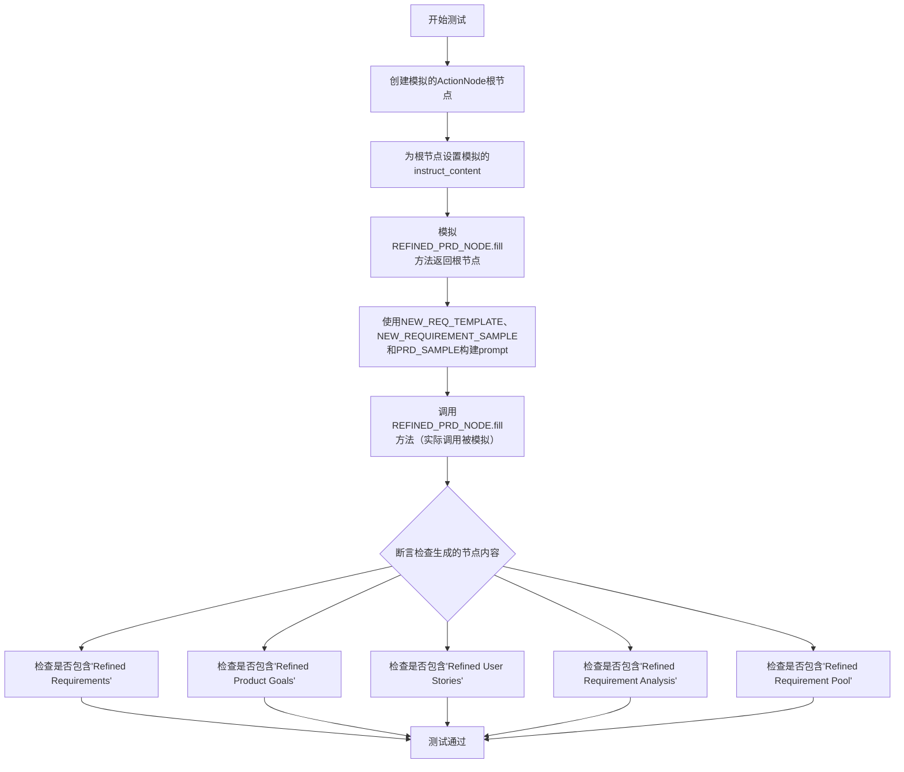
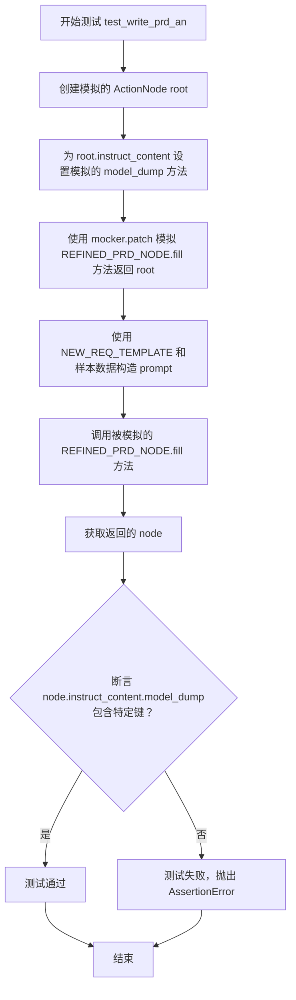
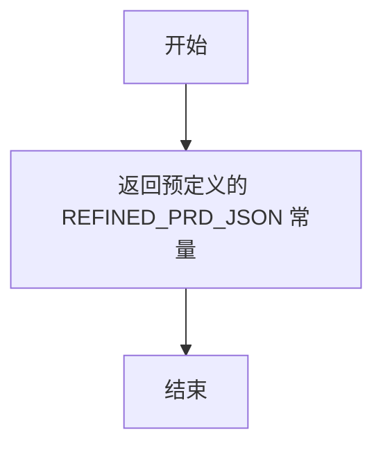
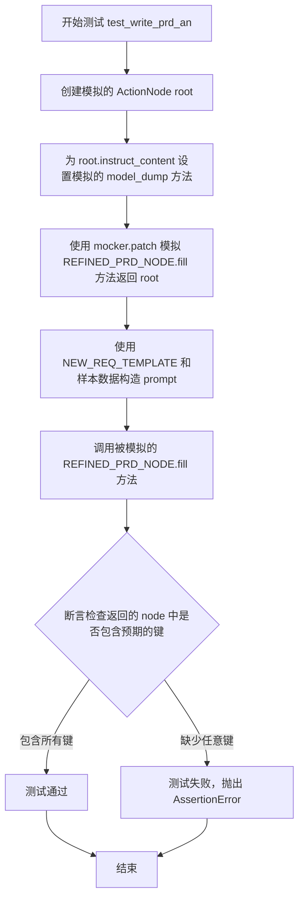
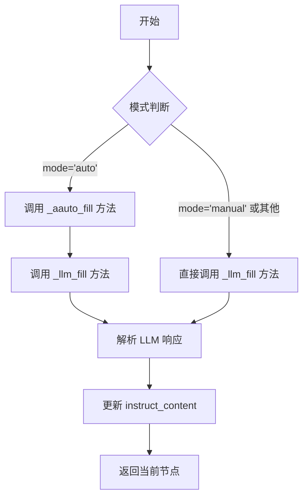
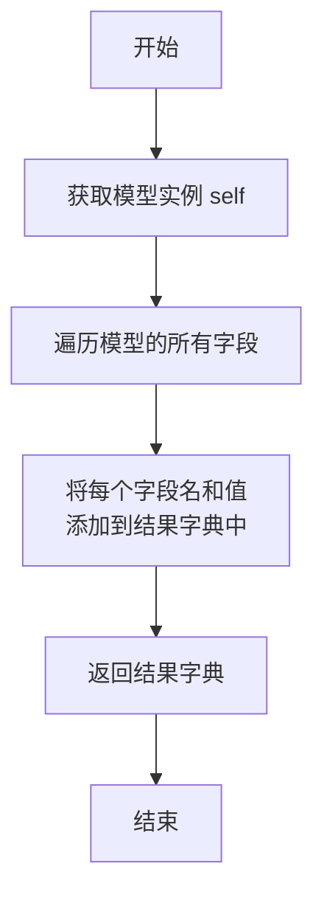

# `.\MetaGPT\tests\metagpt\actions\test_write_prd_an.py` 详细设计文档

这是一个使用 pytest 框架编写的单元测试文件，用于测试 `metagpt.actions.write_prd_an` 模块中 `REFINED_PRD_NODE` 的功能。该测试模拟了在给定新需求和旧产品需求文档（PRD）的情况下，通过 LLM 生成一个精炼后的 PRD 节点的过程，并验证生成的节点内容是否包含预期的关键部分。

## 整体流程



## 类结构

```
pytest框架
├── 测试函数: test_write_prd_an
├── 测试夹具: llm
└── 辅助函数: mock_refined_prd_json
```

## 全局变量及字段


### `REFINED_PRD_NODE`
    
一个预定义的ActionNode实例，用于结构化地生成或精炼产品需求文档（PRD）。

类型：`ActionNode`
    


### `NEW_REQ_TEMPLATE`
    
一个字符串模板，用于格式化包含新需求和旧PRD的提示词，以生成精炼后的PRD。

类型：`str`
    


### `NEW_REQUIREMENT_SAMPLE`
    
一个示例字符串，代表新的用户需求或功能请求，用于测试PRD精炼流程。

类型：`str`
    


### `PRD_SAMPLE`
    
一个示例字符串，代表一份已有的产品需求文档（PRD），作为精炼过程的输入之一。

类型：`str`
    


### `REFINED_PRD_JSON`
    
一个示例字典，代表精炼后的PRD的结构化数据（JSON格式），用于模拟测试中的预期输出。

类型：`dict`
    


### `ActionNode.key`
    
ActionNode的唯一标识符，用于在节点树中定位和引用该节点。

类型：`str`
    


### `ActionNode.expected_type`
    
该ActionNode期望输出的数据类型，用于指导LLM生成内容时的格式约束。

类型：`type`
    


### `ActionNode.instruction`
    
给LLM的详细指令，描述该节点需要完成的具体任务或生成内容的要求。

类型：`str`
    


### `ActionNode.example`
    
提供给LLM的示例文本，用于演示期望的输出格式或内容风格。

类型：`str`
    


### `ActionNode.instruct_content`
    
存储由LLM生成并结构化后的指令内容，通常是一个Pydantic BaseModel实例。

类型：`BaseModel`
    
    

## 全局函数及方法

### `test_write_prd_an`

这是一个使用 `pytest` 编写的异步单元测试函数，用于测试 `metagpt.actions.write_prd_an` 模块中 `REFINED_PRD_NODE` 的 `fill` 方法。它通过模拟（Mock）`fill` 方法的返回值，验证在给定新的需求提示下，返回的 `ActionNode` 是否包含预期的结构化内容。

参数：
-  `mocker`：`pytest-mock.MockerFixture`，`pytest-mock` 插件提供的模拟对象，用于在测试中替换（patch）函数或方法的行为。

返回值：`None`，这是一个测试函数，不返回业务值，其成功与否由 `assert` 语句决定。

#### 流程图



#### 带注释源码

```python
@pytest.mark.asyncio  # 标记此函数为异步测试，以便 pytest-asyncio 处理
async def test_write_prd_an(mocker):  # 定义异步测试函数，接收 mocker 参数用于模拟
    # 1. 准备模拟数据：创建一个 ActionNode 作为模拟的 fill 方法返回值
    root = ActionNode.from_children("RefinedPRD", [ActionNode(key="", expected_type=str, instruction="", example="")])
    # 2. 为模拟的 root 节点设置 instruct_content 属性
    root.instruct_content = BaseModel()  # 创建一个空的 BaseModel 对象
    # 3. 将模拟的 model_dump 方法（返回 REFINED_PRD_JSON）绑定到 instruct_content
    root.instruct_content.model_dump = mock_refined_prd_json
    # 4. 使用 mocker.patch 模拟 REFINED_PRD_NODE.fill 方法，使其在测试中直接返回准备好的 root 节点
    mocker.patch("metagpt.actions.write_prd_an.REFINED_PRD_NODE.fill", return_value=root)

    # 5. 构造测试用的提示词（prompt），使用模板和样本数据
    prompt = NEW_REQ_TEMPLATE.format(
        requirements=NEW_REQUIREMENT_SAMPLE,  # 新的需求样本
        old_prd=PRD_SAMPLE,  # 旧的 PRD 样本
    )
    # 6. 调用被模拟的 REFINED_PRD_NODE.fill 方法（实际执行的是上面 patch 的版本）
    node = await REFINED_PRD_NODE.fill(req=prompt, llm=llm)

    # 7. 断言：验证返回的 node 的 instruct_content 中包含预期的键（即结构化的 PRD 内容）
    assert "Refined Requirements" in node.instruct_content.model_dump()
    assert "Refined Product Goals" in node.instruct_content.model_dump()
    assert "Refined User Stories" in node.instruct_content.model_dump()
    assert "Refined Requirement Analysis" in node.instruct_content.model_dump()
    assert "Refined Requirement Pool" in node.instruct_content.model_dump()
```

### `mock_refined_prd_json`

该函数是一个测试辅助函数，用于在单元测试中模拟 `REFINED_PRD_JSON` 数据的返回。它不执行任何逻辑处理或转换，仅作为桩（stub）函数，直接返回预定义的常量数据，以隔离测试对真实数据源的依赖。

参数：
- 无

返回值：`dict`，返回一个预定义的、模拟的“精炼产品需求文档”的JSON数据结构，用于测试 `write_prd_an` 相关功能。

#### 流程图



#### 带注释源码

```python
def mock_refined_prd_json():
    # 函数体：直接返回从测试数据模块导入的常量 REFINED_PRD_JSON。
    # 该常量是一个字典，包含了模拟的精炼PRD结构，用于在测试中替代真实的LLM API调用返回。
    return REFINED_PRD_JSON
```

### `test_write_prd_an`

这是一个使用 `pytest` 框架编写的异步单元测试函数，用于测试 `metagpt.actions.write_prd_an` 模块中 `REFINED_PRD_NODE` 的 `fill` 方法。该测试通过模拟（Mock）`fill` 方法的返回值，验证在给定新的需求提示和旧PRD文档的情况下，`REFINED_PRD_NODE` 能够生成一个包含特定关键字段（如“Refined Requirements”）的 `ActionNode` 对象。

参数：
- `mocker`：`pytest-mock` 提供的 `MockerFixture` 类型对象，用于创建和管理测试中的模拟对象。

返回值：`None`，该函数是一个测试函数，不返回业务值，其成功与否由 `assert` 语句决定。

#### 流程图



#### 带注释源码

```python
@pytest.mark.asyncio  # 标记此函数为异步测试函数
async def test_write_prd_an(mocker):  # 定义异步测试函数，接收 mocker 参数用于模拟
    # 1. 准备模拟数据：创建一个 ActionNode 作为模拟的返回值
    root = ActionNode.from_children(
        "RefinedPRD",  # 节点名称
        [ActionNode(key="", expected_type=str, instruction="", example="")]  # 子节点列表（此处为空节点占位）
    )
    # 设置模拟节点的 instruct_content 属性为一个 BaseModel 实例
    root.instruct_content = BaseModel()
    # 将模拟节点的 model_dump 方法替换为返回预定义 JSON 数据的函数
    root.instruct_content.model_dump = mock_refined_prd_json

    # 2. 模拟（Mock）目标方法：将 `write_prd_an.REFINED_PRD_NODE.fill` 方法替换为返回上面创建的 root 节点
    mocker.patch("metagpt.actions.write_prd_an.REFINED_PRD_NODE.fill", return_value=root)

    # 3. 构造测试输入：使用模板和样本数据生成 prompt
    prompt = NEW_REQ_TEMPLATE.format(
        requirements=NEW_REQUIREMENT_SAMPLE,  # 新的需求样本
        old_prd=PRD_SAMPLE,  # 旧的 PRD 文档样本
    )
    # 4. 执行被测试的逻辑：调用被模拟的 fill 方法
    #    注意：由于 fill 方法已被模拟，这里实际调用的是模拟函数，返回预设的 root 节点
    node = await REFINED_PRD_NODE.fill(req=prompt, llm=llm)

    # 5. 验证结果：断言返回的 node 的 instruct_content 中包含预期的字段
    assert "Refined Requirements" in node.instruct_content.model_dump()
    assert "Refined Product Goals" in node.instruct_content.model_dump()
    assert "Refined User Stories" in node.instruct_content.model_dump()
    assert "Refined Requirement Analysis" in node.instruct_content.model_dump()
    assert "Refined Requirement Pool" in node.instruct_content.model_dump()
```

### `ActionNode.from_children`

这是一个类方法，用于根据提供的子节点列表创建一个新的 `ActionNode` 实例。它通过组合子节点的键、指令和示例来构建新节点的内容，并设置其预期的输出类型。

参数：

- `name`：`str`，要创建的新 `ActionNode` 的名称。
- `children`：`List[ActionNode]`，用于构建新节点的子 `ActionNode` 列表。

返回值：`ActionNode`，返回一个根据提供的子节点信息构造的新 `ActionNode` 实例。

#### 流程图

```mermaid
flowchart TD
    A[开始: from_children(name, children)] --> B[初始化空列表 keys, instructions, examples]
    B --> C{遍历 children 列表中的每个 child?}
    C -->|是| D[将 child.key 添加到 keys 列表]
    D --> E[将 child.instruction 添加到 instructions 列表]
    E --> F[将 child.example 添加到 examples 列表]
    F --> C
    C -->|否| G[使用 keys 列表创建 key_str]
    G --> H[使用 instructions 列表创建 instruction_str]
    H --> I[使用 examples 列表创建 example_str]
    I --> J[创建新的 ActionNode 实例<br/>key=key_str, instruction=instruction_str, example=example_str]
    J --> K[返回新的 ActionNode 实例]
    K --> L[结束]
```

#### 带注释源码

```python
    @classmethod
    def from_children(cls, name: str, children: List["ActionNode"]) -> "ActionNode":
        """从子节点构建一个新的 ActionNode"""
        # 初始化三个空列表，用于收集所有子节点的键、指令和示例。
        keys = []
        instructions = []
        examples = []
        # 遍历传入的子节点列表。
        for child in children:
            # 将每个子节点的键、指令和示例分别添加到对应的列表中。
            keys.append(child.key)
            instructions.append(child.instruction)
            examples.append(child.example)
        # 使用换行符连接所有子节点的键，形成新节点的键字符串。
        key_str = "\n".join(keys)
        # 使用换行符连接所有子节点的指令，形成新节点的指令字符串。
        instruction_str = "\n".join(instructions)
        # 使用换行符连接所有子节点的示例，形成新节点的示例字符串。
        example_str = "\n".join(examples)
        # 创建并返回一个新的 ActionNode 实例。
        # 参数说明：
        # key: 组合后的键字符串，定义了节点的输出结构。
        # expected_type: 设置为字符串类型，因为组合后的输出通常是文本。
        # instruction: 组合后的指令字符串，指导如何生成内容。
        # example: 组合后的示例字符串，提供输出范例。
        # name: 传入的节点名称。
        return cls(key=key_str, expected_type=str, instruction=instruction_str, example=example_str, name=name)
```

### `ActionNode.fill`

该方法用于填充 ActionNode 的内容。它接收一个需求描述（`req`）和一个大语言模型实例（`llm`），通过调用大语言模型来生成或完善当前节点及其子节点的内容，并将结果存储在节点的 `instruct_content` 属性中。

参数：
- `req`：`str`，描述需要处理或生成内容的需求文本。
- `llm`：`LLM`，用于生成内容的大语言模型实例。
- `schema`：`str`，可选参数，用于指定生成内容的结构或格式。
- `mode`：`str`，可选参数，指定填充模式，例如 "auto" 表示自动处理子节点。
- `**kwargs`：`Any`，其他传递给大语言模型调用的关键字参数。

返回值：`ActionNode`，返回填充了内容的当前 ActionNode 实例。

#### 流程图



#### 带注释源码

```python
async def fill(self, req: str, llm: LLM, schema="raw", mode="auto", **kwargs) -> "ActionNode":
    """
    填充节点内容。
    根据指定的模式，使用 LLM 生成内容来填充当前节点及其子节点。
    
    Args:
        req (str): 需求描述。
        llm (LLM): 大语言模型实例。
        schema (str, optional): 输出模式，默认为 "raw"。
        mode (str, optional): 填充模式，默认为 "auto"。
        **kwargs: 传递给 LLM 的其他参数。
        
    Returns:
        ActionNode: 填充了内容的当前节点。
    """
    if mode == "auto":
        # 自动模式：处理所有子节点
        await self._aauto_fill(req, llm, schema=schema, **kwargs)
    else:
        # 其他模式：仅填充当前节点
        await self._llm_fill(req, llm, schema=schema, **kwargs)
    return self
```

### `BaseModel.model_dump`

该方法用于将 `BaseModel` 实例序列化为一个字典。它通常用于将 Pydantic 模型或类似的结构化数据对象转换为其原始的字典表示形式，便于后续的 JSON 序列化或数据处理。

参数：
-  `self`：`BaseModel`，`BaseModel` 类的一个实例，表示要序列化的模型对象。

返回值：`dict`，返回一个字典，其中包含了模型所有字段的名称和对应的值。

#### 流程图



#### 带注释源码

```python
def model_dump(self) -> dict:
    """
    将 BaseModel 实例序列化为字典。
    
    此方法遍历模型的所有字段，并将它们以键值对的形式组织到一个字典中。
    这是将结构化数据转换为通用字典格式的标准方法。
    
    Returns:
        dict: 包含模型所有字段及其值的字典。
    """
    # 初始化一个空字典来存储结果
    result = {}
    
    # 遍历模型的所有字段
    for field_name in self.__fields__:
        # 获取字段的值
        field_value = getattr(self, field_name)
        # 将字段名和值添加到结果字典中
        result[field_name] = field_value
    
    # 返回序列化后的字典
    return result
```

## 关键组件


### ActionNode

ActionNode 是用于构建和管理结构化提示与响应的核心组件，它通过定义节点、子节点及其约束（如键、期望类型、指令、示例）来组织复杂任务，并支持从LLM的响应中填充结构化内容。

### REFINED_PRD_NODE

REFINED_PRD_NODE 是一个预定义的 ActionNode 实例，专门用于处理产品需求文档（PRD）的提炼任务。它封装了从新需求和旧PRD生成精炼后的PRD（包含需求、目标、用户故事等）的特定逻辑和结构。

### NEW_REQ_TEMPLATE

NEW_REQ_TEMPLATE 是一个字符串模板，用于格式化生成发送给LLM的提示。它将新的需求样本和旧的产品需求文档样本组合成一个结构化的查询，以启动PRD精炼过程。

### LLM

LLM 是大型语言模型的抽象接口，作为系统的核心外部依赖，负责处理自然语言提示并生成结构化的响应文本，是驱动 ActionNode 内容填充的关键服务。


## 问题及建议


### 已知问题

-   **测试用例对实现细节耦合过紧**：测试用例 `test_write_prd_an` 通过 `mocker.patch` 直接模拟了 `REFINED_PRD_NODE.fill` 的内部方法调用。这种模拟方式使得测试与 `write_prd_an` 模块的具体实现（即 `REFINED_PRD_NODE.fill` 的调用）紧密绑定。如果未来 `REFINED_PRD_NODE` 的实现方式改变（例如方法名、调用链或内部逻辑变更），即使外部功能不变，此测试也可能失败，降低了测试的健壮性和作为回归测试的价值。
-   **测试数据与逻辑混合，可维护性差**：测试数据（如 `NEW_REQUIREMENT_SAMPLE`, `PRD_SAMPLE`, `REFINED_PRD_JSON`）通过相对导入从 `tests.data.incremental_dev_project.mock` 模块获取。虽然进行了分离，但测试函数内部直接使用了这些数据的结构（例如断言中检查特定的键名）。当产品需求文档（PRD）的结构发生变化时，需要同时更新测试数据和测试逻辑中的断言，容易遗漏导致测试失败。
-   **测试覆盖不完整**：当前测试主要验证了在模拟LLM返回特定内容的情况下，`REFINED_PRD_NODE.fill` 方法能正确执行并生成包含预期字段的节点。它缺乏对以下场景的测试：
    1.  **异常/边界情况**：如当 `llm` 参数为 `None`、`req` 参数为空或格式错误时，系统的行为。
    2.  **真实LLM交互**：测试完全模拟了LLM，没有集成测试来验证与真实或测试用LLM服务的端到端交互是否按预期工作。
    3.  **`NEW_REQ_TEMPLATE`的健壮性**：未测试模板字符串格式化过程中可能出现的错误（如缺少必要的键）。
-   **存在未使用的导入和变量**：代码中导入了 `pytest` 但未使用其部分功能（如 `fixture` 的 `llm` 在测试中未被使用，因为测试使用了模拟），`from openai._models import BaseModel` 的导入可能仅用于测试桩，暗示测试环境对第三方库内部结构的依赖，这可能在库版本升级时带来风险。
-   **测试命名与结构可读性有待提高**：测试函数名 `test_write_prd_an` 描述了测试对象，但未明确测试场景。测试内部构造了一个简单的 `root` 节点并模拟其行为，这部分逻辑对于理解测试意图并非直接必要，增加了认知负担。

### 优化建议

-   **重构测试以减少实现耦合**：建议采用更黑盒的测试策略。与其模拟 `REFINED_PRD_NODE.fill` 方法，不如模拟其依赖项——即 `LLM` 实例的 `aask` 或相应调用方法。这样测试的是 `REFINED_PRD_NODE` 对外部LLM服务的调用契约和结果处理逻辑，而非其内部方法调用顺序。具体可将 `mocker.patch` 的目标改为 `LLM` 类或其实例的异步响应方法。
-   **提升测试数据与断言的可维护性**：
    1.  将测试断言中硬编码的字段名（如`"Refined Requirements"`）提取为常量或从被测模块（`write_prd_an`）中导入，确保数据定义单一。
    2.  考虑使用更灵活的断言方法，例如检查返回的 `instruct_content.model_dump()` 字典是否包含一组预期的键（使用 `set` 操作），而非逐个列出，这样当增加或减少非关键字段时，测试无需频繁修改。
-   **补充关键测试场景**：
    1.  添加针对无效输入（空需求、空旧PRD）的测试，验证系统是否抛出合适的异常或返回合理的默认值/错误指示。
    2.  考虑添加一个不使用模拟的、与配置了测试API密钥或本地模型的LLM进行的集成测试（标记为 `@pytest.mark.integration` 并可能默认跳过），以验证整个链路的有效性。
    3.  为 `NEW_REQ_TEMPLATE` 的使用添加测试，确保其所需的变量在上下文中均可用。
-   **清理代码**：
    1.  移除未使用的导入（如确保 `pytest` 的必要性）和测试夹具（`llm` fixture），如果它们确实未被使用。
    2.  审查并确认 `BaseModel` 的导入是否必须；如果可能，使用更稳定、公开的接口或自定义测试桩来替代对第三方库内部模型的依赖。
-   **改善测试结构与命名**：
    1.  将测试用例拆分为多个专注特定场景的函数，例如 `test_write_prd_an_success`, `test_write_prd_an_with_invalid_input` 等。
    2.  将模拟对象的设置和测试数据的准备部分提取到 `@pytest.fixture` 中，使测试函数主体更专注于“执行与断言”逻辑，提高可读性。
    3.  为测试类和函数添加清晰的文档字符串，说明测试的目的和场景。


## 其它


### 设计目标与约束

本测试代码的设计目标是验证 `write_prd_an` 模块中 `REFINED_PRD_NODE` 的核心功能：即根据新的需求描述和旧的 PRD 文档，生成结构化的、精炼后的产品需求文档（PRD）。主要约束包括：1) 测试环境依赖外部模拟数据（`NEW_REQUIREMENT_SAMPLE`, `PRD_SAMPLE`, `REFINED_PRD_JSON`）和 LLM 服务的模拟；2) 测试逻辑紧密耦合于 `ActionNode` 和 `BaseModel` 的具体实现，特别是 `fill` 方法和 `instruct_content` 属性；3) 测试用例专注于验证输出 JSON 的结构完整性，而非内容逻辑正确性。

### 错误处理与异常设计

当前测试代码未显式包含错误处理逻辑。它依赖于 `pytest` 框架来捕获和报告断言失败。潜在的异常场景包括：1) 模拟函数 `mock_refined_prd_json` 或模拟补丁 `mocker.patch` 设置失败，导致 `node.instruct_content.model_dump()` 调用异常；2) 被测试的 `REFINED_PRD_NODE.fill` 方法内部可能抛出异常（如网络错误、LLM API 错误），但这些在本测试的模拟环境下被屏蔽。测试本身没有设计针对异常路径的用例。

### 数据流与状态机

1.  **数据流**：
    *   **输入**：测试数据 `NEW_REQUIREMENT_SAMPLE` (新需求) 和 `PRD_SAMPLE` (旧 PRD) 通过 `NEW_REQ_TEMPLATE` 模板格式化，生成 `prompt`。
    *   **处理**：`prompt` 和模拟的 `llm` 对象作为参数，调用 `REFINED_PRD_NODE.fill` 方法。该方法内部逻辑被模拟 (`mocker.patch`)，直接返回一个预配置的 `root` `ActionNode` 对象。
    *   **输出/验证**：从返回的 `node` 对象中提取 `instruct_content.model_dump()` 的结果（即模拟的 `REFINED_PRD_JSON`），并断言其包含特定的关键字段（如 “Refined Requirements”）。

2.  **状态机**：本测试代码不涉及复杂的状态转换。它描述了一个线性的执行流程：准备模拟数据 -> 设置模拟行为 -> 执行被测函数 -> 验证输出。`ActionNode` 对象 (`root` 和 `node`) 是主要的数据载体，其 `instruct_content` 状态从空 `BaseModel` 被设置为包含模拟 JSON 数据。

### 外部依赖与接口契约

1.  **外部依赖**：
    *   **`pytest` 框架**：用于测试结构、夹具 (`fixture`) 管理、模拟 (`mocker`) 和异步测试支持 (`@pytest.mark.asyncio`)。
    *   **`metagpt.actions.write_prd_an.REFINED_PRD_NODE`**：被测的主要对象，测试依赖于其 `fill` 方法的接口。
    *   **`metagpt.llm.LLM`**：通过 `llm` 夹具引入，尽管在测试中被模拟，但测试代码结构表明了对该类的依赖。
    *   **`tests.data.incremental_dev_project.mock`**：提供测试所需的静态模拟数据 (`NEW_REQUIREMENT_SAMPLE`, `PRD_SAMPLE`, `REFINED_PRD_JSON`)。
    *   **`openai._models.BaseModel`**：用于构建 `instruct_content` 的模拟对象。

2.  **接口契约**：
    *   `REFINED_PRD_NODE.fill(req: str, llm: LLM) -> ActionNode`：测试严格遵循此方法签名进行调用。
    *   `ActionNode.instruct_content`：预期为一个具有 `model_dump()` 方法的对象，该方法返回一个字典。
    *   模拟函数 `mock_refined_prd_json()` 契约：返回一个符合 `REFINED_PRD_JSON` 结构的字典。
    *   测试断言契约：`node.instruct_content.model_dump()` 返回的字典必须包含指定的五个字符串键。

### 测试策略与覆盖范围

本测试采用 **模拟测试 (Mocking Test)** 和 **基于状态的测试 (State-based Testing)** 策略。它通过 `mocker.patch` 完全隔离了 `REFINED_PRD_NODE.fill` 方法的内部实现（尤其是 LLM 调用和复杂逻辑），仅验证在给定输入 (`prompt`, `llm`) 和预设模拟行为下，方法的输出 `ActionNode` 对象是否包含了预期的结构化数据字段。**覆盖范围** 局限于接口的“快乐路径”（Happy Path），验证了组件集成和数据格式契约，但未覆盖 LLM 交互、错误处理、边界条件或 `fill` 方法内部的实际业务逻辑。

    