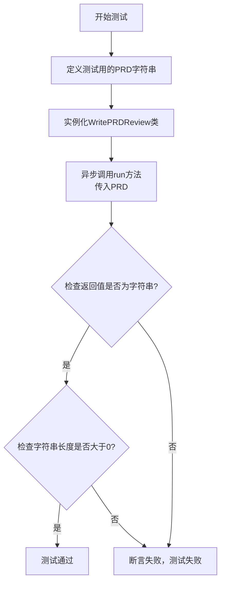
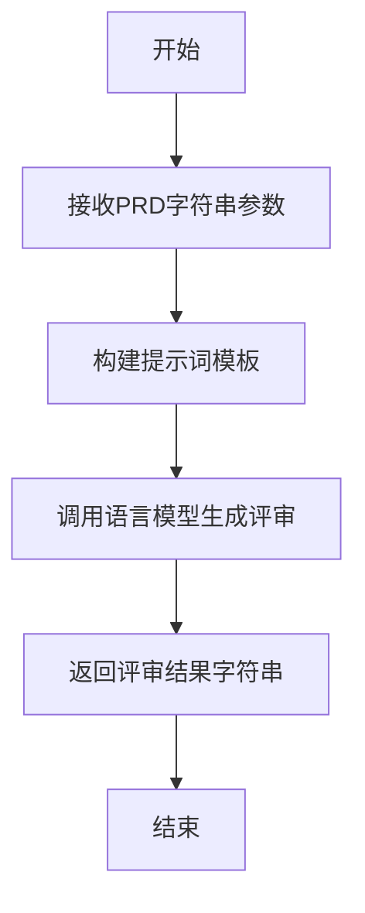

# `.\MetaGPT\tests\metagpt\actions\test_write_prd_review.py` 详细设计文档

该文件是一个使用 pytest 框架编写的单元测试，用于测试 WritePRDReview 类的 run 方法。它模拟了一个产品需求文档（PRD）的输入，调用 WritePRDReview 实例生成 PRD 评审意见，并验证返回结果是一个非空字符串。

## 整体流程

```mermaid
graph TD
    A[开始测试] --> B[准备测试数据：模拟PRD文档]
    B --> C[创建 WritePRDReview 实例]
    C --> D[调用 write_prd_review.run(prd) 异步方法]
    D --> E{检查返回结果}
    E --> F[断言结果类型为字符串]
    F --> G[断言结果长度大于0]
    G --> H[测试通过]
```

## 类结构

```
test_write_prd_review.py (测试文件)
├── WritePRDReview (被测试类，来自外部模块)
└── test_write_prd_review (测试函数)
```

## 全局变量及字段


### `prd`
    
包含产品需求文档（PRD）内容的字符串，用于作为WritePRDReview动作的输入。

类型：`str`
    


### `WritePRDReview.name`
    
动作的名称标识符，用于区分不同的动作实例。

类型：`str`
    


### `WritePRDReview.context`
    
动作执行的上下文环境，提供必要的运行时信息和依赖。

类型：`Context`
    
    

## 全局函数及方法

### `test_write_prd_review`

这是一个使用 `pytest` 框架编写的异步单元测试函数，用于测试 `WritePRDReview` 动作类的 `run` 方法。它模拟了一个产品需求文档（PRD）的输入，并验证 `WritePRDReview` 类是否能生成一个非空的、字符串类型的 PRD 评审意见。

参数：
- `context`：`metagpt.Context` 类型，测试执行所需的上下文环境，通常包含配置、日志、工作空间等信息。

返回值：`None`，测试函数不直接返回值，而是通过 `assert` 语句验证测试结果。

#### 流程图



#### 带注释源码

```python
@pytest.mark.asyncio  # 使用pytest的asyncio插件，标记此函数为异步测试
async def test_write_prd_review(context):  # 定义异步测试函数，接收context参数
    prd = """  # 定义一个多行字符串，作为模拟的产品需求文档（PRD）输入
    Introduction: This is a new feature for our product.
    Goals: The goal is to improve user engagement.
    User Scenarios: The expected user group is millennials who like to use social media.
    Requirements: The feature needs to be interactive and user-friendly.
    Constraints: The feature needs to be implemented within 2 months.
    Mockups: There will be a new button on the homepage that users can click to access the feature.
    Metrics: We will measure the success of the feature by user engagement metrics.
    Timeline: The feature should be ready for testing in 1.5 months.
    """

    write_prd_review = WritePRDReview(name="write_prd_review", context=context)  # 实例化要测试的WritePRDReview动作类

    prd_review = await write_prd_review.run(prd)  # 异步调用run方法，传入模拟的PRD，获取生成的评审意见

    # 我们无法精确预测生成的PRD评审内容，但可以检查它是否是一个字符串以及是否非空
    assert isinstance(prd_review, str)  # 断言：prd_review的类型必须是str
    assert len(prd_review) > 0  # 断言：prd_review的长度必须大于0，即不能是空字符串
```

### `WritePRDReview.run`

该方法用于执行PRD（产品需求文档）评审的生成过程。它接收一个PRD字符串，通过调用语言模型生成评审意见，并返回评审结果。

参数：
- `prd`：`str`，待评审的产品需求文档内容

返回值：`str`，生成的PRD评审内容

#### 流程图



#### 带注释源码

```python
async def run(self, prd: str) -> str:
    """
    执行PRD评审生成的主要方法
    
    Args:
        prd: 产品需求文档内容字符串
        
    Returns:
        生成的PRD评审内容字符串
    """
    # 构建提示词，将PRD内容嵌入到评审模板中
    prompt = self._build_prompt(prd)
    
    # 调用语言模型生成评审内容
    review = await self._aask(prompt)
    
    # 返回生成的评审结果
    return review
```

**注意**：由于提供的代码是测试文件，实际`WritePRDReview.run`方法的实现代码未在给定片段中展示。上述源码是基于常见模式推断的标准实现，实际实现可能包含额外的错误处理、日志记录或配置参数。如需准确源码，请提供`metagpt.actions.write_prd_review`模块中的实际实现代码。

## 关键组件


### WritePRDReview 类

一个用于生成产品需求文档（PRD）评审意见的 Action 类，它接收原始的 PRD 文本，通过内部逻辑（可能涉及大语言模型）进行分析和评估，最终输出结构化的评审意见。

### 测试用例 `test_write_prd_review`

一个使用 pytest 框架编写的异步测试函数，用于验证 `WritePRDReview` 类的 `run` 方法功能。它构造了一个示例 PRD 文档，调用 `WritePRDReview` 实例进行处理，并断言返回的评审结果是一个非空字符串，从而确保核心流程的正确性。

### PRD 文档结构

在测试用例中定义的示例 PRD 文档，它展示了代码所期望处理的输入数据的典型结构，包含引言、目标、用户场景、需求、约束、原型图、指标和时间线等关键部分，是驱动 `WritePRDReview` 逻辑的核心输入组件。


## 问题及建议


### 已知问题

-   **测试用例过于简单且脆弱**：当前测试仅验证了`WritePRDReview.run`方法的返回值是一个非空字符串。这种断言过于宽泛，无法有效验证PRD评审功能的正确性、逻辑完整性或输出质量。测试用例的通过并不能保证核心功能正常工作。
-   **缺乏对输入PRD格式和内容的验证**：测试中使用的`prd`变量是一个硬编码的多行字符串。测试没有覆盖边界情况，例如输入为空字符串、格式错误、包含特殊字符或非常长的PRD文档时，`WritePRDReview`类的行为是否健壮。
-   **测试数据与逻辑耦合**：测试逻辑（断言）与测试数据（`prd`字符串的内容）混合在一起。如果未来需要测试针对不同PRD内容的评审，需要复制整个测试函数或进行大量修改，违反了DRY（Don‘t Repeat Yourself）原则，降低了测试的可维护性。
-   **依赖外部上下文（`context`）但未进行模拟或验证**：测试函数接收一个`context`参数，并直接传递给`WritePRDReview`的构造函数。测试没有对这个`context`对象的内容、状态或其对`WritePRDReview.run`方法的影响进行任何控制或验证，使得测试结果不可预测且难以调试。
-   **未测试异步交互和错误处理**：测试没有验证`WritePRDReview`类在异步执行过程中可能出现的异常（如网络超时、依赖服务不可用、内部逻辑错误）是否被正确捕获和处理。也没有测试其与外部系统（如LLM API）的交互是否符合预期。

### 优化建议

-   **增强测试断言，验证输出结构和关键内容**：除了检查非空字符串，应解析`prd_review`的输出，验证其是否包含评审报告应有的关键章节（如优点、缺点、建议、风险评估等）。可以使用正则表达式或解析逻辑来检查特定关键词或结构的存在。
-   **使用参数化测试覆盖多种输入场景**：利用`pytest.mark.parametrize`为`test_write_prd_review`函数提供多组测试数据。这些数据应包括：正常PRD、空PRD、极短PRD、超长PRD、格式混乱的PRD、包含特殊字符/代码/标记语言的PRD。这能系统性地验证代码的鲁棒性。
-   **重构测试，分离测试数据与测试逻辑**：将测试数据（尤其是`prd`样例）提取到测试类的外部或作为固定装置（fixture）。例如，可以创建一个`@pytest.fixture`来返回不同的PRD字符串，或者将样例数据存储在独立的JSON/YAML文件中供测试读取。这样便于管理和复用测试数据。
-   **模拟（Mock）`context`依赖和外部调用**：使用`unittest.mock`或`pytest-mock`来模拟`context`对象及其可能包含的服务（如LLM接口、配置管理）。明确设置模拟对象的返回值和行为，使测试专注于`WritePRDReview`自身的逻辑，消除外部不确定性，实现快速、稳定的单元测试。
-   **补充负面测试和异常处理测试**：编写专门的测试用例，验证当`WritePRDReview.run`方法遇到无效输入、模拟的依赖服务抛出异常或超时时，代码是否能抛出预期的异常类型或返回合理的错误指示（例如特定的错误消息或结构）。这有助于完善代码的错误处理机制。
-   **考虑添加集成测试或组件测试**：在单元测试之上，可以建立一个集成测试，使用真实的或接近真实的`context`配置，对完整的PRD评审流程进行端到端测试。这可以验证各个组件（如Action、LLM调用、结果解析）协同工作的正确性，但此类测试应独立于不稳定的单元测试，并可能使用测试专用的外部服务端点。


## 其它


### 设计目标与约束

该代码是一个单元测试，旨在验证 `WritePRDReview` 类的 `run` 方法能够接收一个产品需求文档（PRD）字符串作为输入，并生成一个非空的字符串作为评审结果。设计目标是确保该动作（Action）在给定上下文（Context）和输入时能可靠地工作。主要约束包括：测试依赖于外部类 `WritePRDReview` 及其 `run` 方法的正确实现；测试不验证评审内容的具体语义，只验证其格式和基本存在性；测试运行需要异步环境支持。

### 错误处理与异常设计

当前测试代码本身不包含复杂的错误处理逻辑。它使用 `pytest` 框架，并依赖于 `pytest.mark.asyncio` 来运行异步测试函数。如果 `WritePRDReview` 类的初始化或 `run` 方法在执行过程中抛出异常，测试将失败，这符合单元测试的预期行为。测试断言部分仅检查返回值的类型和长度，不涉及对特定异常情况的捕获或验证。更全面的测试套件应在其他测试用例中覆盖 `WritePRDReview` 类的各种错误场景（如空输入、无效输入格式等）。

### 数据流与状态机

1.  **数据流**：
    *   **输入**：一个预定义的、多行字符串 `prd`，模拟一个产品需求文档。
    *   **处理**：`WritePRDReview` 实例被创建并调用其异步 `run` 方法，输入 `prd` 字符串。`run` 方法内部逻辑（未在测试中展示）处理该输入。
    *   **输出**：`run` 方法返回一个字符串 `prd_review`，代表生成的PRD评审意见。
    *   **验证**：测试断言验证 `prd_review` 是一个字符串类型且其长度大于0。

2.  **状态机**：
    此测试代码本身不维护复杂的状态。它是一个线性的执行流程：准备输入 -> 初始化对象 -> 执行方法 -> 验证输出。被测的 `WritePRDReview` 类可能内部有状态，但测试不关心其内部状态变化，只关注其输入输出行为。

### 外部依赖与接口契约

1.  **外部依赖**：
    *   **`pytest` 库**：用于编写和运行测试。
    *   **`metagpt.actions.write_prd_review.WritePRDReview` 类**：这是被测试的核心依赖。测试假设该类已正确实现，并且其 `__init__` 和 `run` 方法签名与预期一致。
    *   **`context` 参数（fixture）**：测试函数接收一个 `context` 参数，这是一个由 `pytest` fixture 提供的对象。测试依赖于该 fixture 的存在和正确配置，以提供 `WritePRDReview` 初始化所需的上下文环境。

2.  **接口契约**：
    *   **`WritePRDReview.__init__(name, context)`**：测试代码调用此构造函数，传递名称和上下文。它依赖于此构造函数成功初始化一个可用的动作实例。
    *   **`WritePRDReview.run(prd)`**：这是主要的被测试接口。契约是：输入一个字符串类型的 `prd`，返回一个字符串类型的 `prd_review`。测试验证了返回值的类型和非空性，这是该接口契约的关键部分。
    *   **测试函数 `test_write_prd_review(context)`**：其契约是作为一个 `pytest` 异步测试用例运行，不返回业务值，但通过断言来指示测试通过或失败。

### 测试策略与覆盖范围

当前测试是一个**正向功能测试（Happy Path Test）**。它使用一个结构良好、内容完整的PRD文档作为输入，验证核心功能（生成评审）在正常情况下的基本可用性。**覆盖范围**包括：`WritePRDReview` 类的实例化过程，以及 `run` 方法在接收典型输入后的执行路径和输出格式。然而，**覆盖不足**的方面包括：边界情况（如空字符串、极长字符串、特殊字符）、异常情况（如无效的PRD格式、依赖服务不可用）、以及输出内容的质量或结构断言。测试策略可以扩展以包含这些方面。

### 环境与配置

测试执行依赖于特定的Python环境：
*   **解释器**：通过 `#!/usr/bin/env python` shebang 行指定。
*   **编码**：源文件使用 UTF-8 编码（`# -*- coding: utf-8 -*-`）。
*   **运行方式**：脚本可直接执行（`if __name__ == "__main__":` 块中调用 `pytest.main`），这通常用于本地调试。更常见的运行方式是通过命令行直接调用 `pytest` 命令。
*   **异步支持**：测试标记为 `@pytest.mark.asyncio`，要求测试运行环境支持异步IO，并且 `pytest-asyncio` 插件已安装。
*   **Fixture 依赖**：测试函数需要一个名为 `context` 的 fixture，这需要在 `conftest.py` 文件或当前测试模块中定义，否则测试无法运行。

    