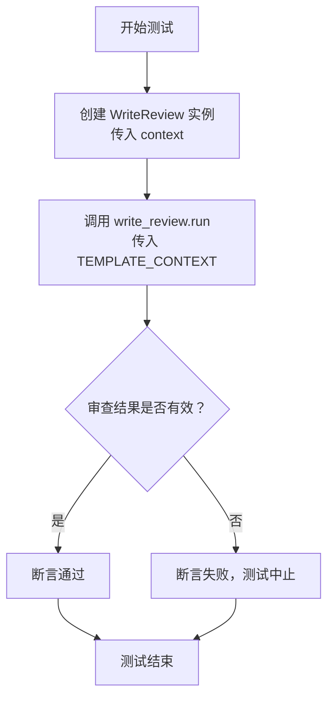
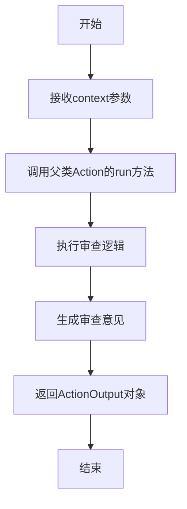

# `.\MetaGPT\tests\metagpt\actions\test_write_review.py` 详细设计文档

这是一个使用 pytest 框架编写的单元测试文件，用于测试 WriteReview 类的功能。该测试验证了 WriteReview 类能够根据给定的模板上下文生成代码评审意见，并确保评审结果包含有效的内容和正确的状态标记（LGTM 或 LBTM）。

## 整体流程

```mermaid
graph TD
    A[开始测试] --> B[创建 WriteReview 实例]
    B --> C[调用 write_review.run(TEMPLATE_CONTEXT)]
    C --> D{生成评审结果}
    D --> E[断言: review.instruct_content 存在]
    E --> F[断言: review.get('LGTM') 为 'LGTM' 或 'LBTM']
    F --> G[测试通过]
```

## 类结构

```
test_write_review.py (测试文件)
├── TEMPLATE_CONTEXT (全局变量)
├── test_write_review (测试函数)
└── WriteReview (被测试类，来自 metagpt.actions.write_review)
```

## 全局变量及字段


### `TEMPLATE_CONTEXT`
    
一个包含模拟项目上下文信息的JSON格式字符串，用于测试WriteReview类的功能。

类型：`str`
    


    

## 全局函数及方法

### `test_write_review`

这是一个使用 `pytest` 框架编写的异步测试函数，用于测试 `WriteReview` 类的 `run` 方法。它模拟一个代码审查场景，验证 `WriteReview` 动作能否根据给定的上下文和模板内容生成有效的审查结果。

参数：

- `context`：`object`，测试框架（如 `pytest`）注入的上下文对象，通常用于管理测试的依赖项、配置或共享状态。在本测试中，它被传递给 `WriteReview` 类的构造函数。

返回值：`None`，测试函数通常不显式返回值，其成功与否由内部的断言（`assert`）决定。

#### 流程图



#### 带注释源码

```python
@pytest.mark.asyncio  # 使用 pytest 的异步测试装饰器，标记此函数为异步测试
async def test_write_review(context):  # 定义异步测试函数，接收一个 context 参数
    # 1. 实例化 WriteReview 动作类，传入测试上下文
    write_review = WriteReview(context=context)
    
    # 2. 异步执行 WriteReview 的 run 方法，传入预定义的模板上下文字符串
    #    该方法预期返回一个包含审查结果的对象
    review = await write_review.run(TEMPLATE_CONTEXT)
    
    # 3. 断言：审查结果对象必须包含 `instruct_content` 属性
    assert review.instruct_content
    
    # 4. 断言：审查结果中 `LGTM` 字段的值必须是 "LGTM"（Looks Good To Me）或 "LBTM"（Looks Bad To Me）
    #    这验证了审查结论的格式和有效性
    assert review.get("LGTM") in ["LGTM", "LBTM"]
```

### `WriteReview.run`

该方法用于执行代码审查任务，接收一个包含项目设计文档的上下文字符串，通过分析生成审查意见，并返回一个包含审查结果（如是否通过）的动作输出对象。

参数：

- `context`：`str`，包含项目设计文档的上下文字符串，用于生成审查意见。

返回值：`ActionOutput`，包含审查结果的动作输出对象，其中包含审查意见和审查结论（如LGTM或LBTM）。

#### 流程图



#### 带注释源码

```python
async def run(self, context: str) -> ActionOutput:
    """
    执行代码审查任务。
    
    参数:
        context (str): 包含项目设计文档的上下文字符串。
    
    返回:
        ActionOutput: 包含审查结果的动作输出对象。
    """
    # 调用父类Action的run方法，传入context参数
    return await super().run(context)
```

## 关键组件


### WriteReview 类

WriteReview 类是测试代码中用于执行代码审查操作的核心组件，它继承自某个基类（可能是 Action 类），负责接收包含项目设计信息的上下文，并生成相应的审查意见。

### TEMPLATE_CONTEXT 变量

TEMPLATE_CONTEXT 变量是一个包含项目设计信息（如原始需求、产品目标、用户故事等）的 JSON 格式字符串模板，用作测试 WriteReview 类功能的输入数据。

### test_write_review 测试函数

test_write_review 是一个异步测试函数，用于验证 WriteReview 类的 run 方法能够正确执行并返回有效的审查结果，包括检查返回对象是否包含预期的指令内容和审查结论（LGTM 或 LBTM）。


## 问题及建议


### 已知问题

-   **测试数据硬编码且不完整**：`TEMPLATE_CONTEXT` 变量包含了硬编码的测试数据。虽然这简化了测试，但它是一个静态的字符串，无法覆盖代码审查逻辑可能遇到的各种边界情况或无效输入格式。这降低了测试的健壮性。
-   **测试断言过于宽松**：断言 `review.get("LGTM") in ["LGTM", "LBTM"]` 仅检查返回的字典中 `"LGTM"` 键的值是否为两个预定义的字符串之一。它没有验证 `WriteReview` 动作生成的完整审查内容的结构、必填字段或逻辑正确性，使得测试的有效性不足。
-   **缺乏对 `WriteReview` 类内部逻辑的测试**：当前的集成测试只验证了 `run` 方法能执行并返回一个包含特定键的字典。它没有测试 `WriteReview` 类如何解析输入、应用审查模板、生成结构化输出等核心逻辑，也未测试错误处理路径。
-   **测试依赖未显式模拟**：测试依赖于 `context` 参数（通过 `pytest.fixture` 提供，但代码片段中未定义）。如果 `WriteReview` 的动作执行依赖于 `context` 中的特定服务（如LLM、文件IO），测试可能会变得不稳定或缓慢，因为它没有对这些外部依赖进行隔离或模拟。

### 优化建议

-   **重构测试数据**：将 `TEMPLATE_CONTEXT` 定义移出测试函数，可能放入一个单独的测试数据文件或模块中。创建多个测试用例，覆盖不同的输入场景，如空输入、格式错误的JSON、缺少关键字段的上下文等，以提高测试覆盖率。
-   **增强断言检查**：除了检查 `"LGTM"` 字段，还应验证 `review` 对象（假设是 `Message` 或类似对象）的 `instruct_content` 属性是否是一个结构化的审查结果（例如，包含问题列表、建议、总结等字段的字典或Pydantic模型）。可以编写辅助函数来验证审查输出的模式。
-   **补充单元测试**：为 `WriteReview` 类编写细粒度的单元测试。测试其 `run` 方法内部调用的辅助函数（如果存在），例如测试上下文解析、审查规则应用等。使用 `unittest.mock` 来模拟 `context` 中的依赖项，确保测试快速、独立且可重复。
-   **明确测试依赖并引入模拟**：在测试函数或类级别，明确声明并模拟 `WriteReview` 所需的所有外部依赖。例如，如果 `WriteReview` 内部使用了一个 `LLM` 子动作，应该在测试中将其替换为一个返回确定性结果的模拟对象，以确保测试的稳定性和执行速度。
-   **考虑测试性能与异步**：由于测试标记为 `@pytest.mark.asyncio` 并测试异步方法，应确保测试环境正确配置了异步支持。同时，可以添加对方法执行时间的简单断言，以防止引入意外的性能退化。


## 其它


### 设计目标与约束

本代码是一个针对 `WriteReview` 类的单元测试。其设计目标是验证 `WriteReview` 类的 `run` 方法能够正确执行，并返回符合预期的评审结果。主要约束包括：
1.  **测试隔离性**：测试应独立于外部系统，仅依赖于 `WriteReview` 类及其依赖的模拟上下文 (`context`)。
2.  **异步支持**：由于 `WriteReview.run` 是异步方法，测试框架必须支持异步测试（使用 `pytest.mark.asyncio`）。
3.  **结果验证**：测试需要验证返回的 `review` 对象包含有效的 `instruct_content` 字段，并且其 `LGTM` 状态值必须是预定义的 `"LGTM"` 或 `"LBTM"` 之一。
4.  **数据驱动**：测试用例通过 `TEMPLATE_CONTEXT` 字符串常量提供固定的输入数据，确保测试的可重复性。

### 错误处理与异常设计

当前测试代码本身不包含复杂的错误处理逻辑，其设计主要依赖于 `pytest` 框架的断言机制。潜在的异常处理点包括：
1.  **`WriteReview` 初始化失败**：如果传入的 `context` 对象无效，`WriteReview` 构造函数可能抛出异常，导致测试失败。这属于预期的测试行为。
2.  **`run` 方法执行异常**：`WriteReview.run` 方法在执行过程中可能因内部逻辑错误、输入数据格式问题或依赖服务异常而抛出异常。测试期望这些异常被抛出，并由 `pytest` 捕获，标记测试为失败。这是验证代码健壮性的一部分。
3.  **断言失败**：如果 `review` 对象不满足 `assert` 语句的条件（如 `instruct_content` 为空，或 `LGTM` 值非法），测试将失败。这是测试的核心验证机制。
测试本身没有显式的 `try-catch` 块，因为任何未捕获的异常都会导致测试失败，这符合单元测试的最佳实践。

### 数据流与状态机

本测试的数据流相对简单线性：
1.  **输入**：固定的 `TEMPLATE_CONTEXT` 字符串（模拟PRD文档）和通过 `pytest fixture` 注入的 `context` 对象（模拟运行上下文）。
2.  **处理**：
    a.  **初始化阶段**：使用 `context` 创建 `WriteReview` 类实例。
    b.  **执行阶段**：调用 `write_review.run(TEMPLATE_CONTEXT)`。此方法内部会解析输入内容，执行评审逻辑，并生成一个 `Message` 对象作为输出。
3.  **输出**：一个 `review` 对象（`Message` 类型）。测试从中提取 `instruct_content` 和 `LGTM` 状态进行验证。
4.  **状态**：测试过程不涉及复杂的状态机。`WriteReview` 类本身可能是无状态的（从测试看），其行为完全由输入参数决定。

### 外部依赖与接口契约

1.  **外部依赖**：
    *   **`pytest` 框架**：用于组织、运行测试和进行断言。
    *   **`pytest-asyncio` 插件**：为 `pytest` 提供异步测试支持。
    *   **`metagpt.actions.write_review.WriteReview` 类**：这是被测试的主体，是测试代码的核心外部依赖。测试假设其接口（特别是 `__init__` 和 `run` 方法）稳定。
    *   **`context` fixture**：测试依赖于一个名为 `context` 的 `pytest fixture` 来提供 `WriteReview` 初始化所需的上下文对象。该 `fixture` 的定义不在本文件中，是其外部依赖。

2.  **接口契约**：
    *   **`WriteReview.__init__(context)`**：契约要求传入一个有效的上下文对象。
    *   **`WriteReview.run(prd)`**：
        *   **输入契约**：接受一个字符串参数 `prd`，代表产品需求文档。
        *   **输出契约**：返回一个 `Message` 对象。该对象必须包含非空的 `instruct_content` 属性，并且通过 `.get("LGTM")` 方法应能获取到值为 `"LGTM"` 或 `"LBTM"` 的评审结论。
    *   **`Message` 对象契约**：测试假设 `Message` 对象具有 `instruct_content` 属性和一个 `.get(key)` 方法用于获取元数据。

### 测试策略与覆盖范围

1.  **测试类型**：这是一个单元测试，专注于验证 `WriteReview` 类单个方法 (`run`) 的功能。
2.  **测试策略**：采用**正向测试**策略，使用一份格式正确、内容完整的模拟PRD (`TEMPLATE_CONTEXT`) 作为输入，验证核心功能路径是否畅通，输出是否符合预期格式和值域。
3.  **覆盖范围**：
    *   **功能覆盖**：验证了 `run` 方法能够成功执行并返回结果。
    *   **输出验证**：验证了返回结果的两个关键属性。
    *   **未覆盖范围**：
        *   **异常路径**：未测试输入 `prd` 为空、格式错误、包含恶意代码等边界和异常情况时 `run` 方法的行为。
        *   **`context` 影响**：未测试不同 `context` 配置（如不同角色、不同配置）对评审结果的影响。
        *   **`Message` 对象完整性**：未验证 `Message` 对象的其他字段或 `instruct_content` 的具体内容。
4.  **测试数据**：使用硬编码的 `TEMPLATE_CONTEXT`，确保了测试的确定性，但可能无法覆盖所有业务场景。

### 配置与环境

1.  **环境依赖**：需要 Python 环境，并安装 `pytest`, `pytest-asyncio` 以及 `metagpt` 包本身。
2.  **运行命令**：通常通过 `pytest path/to/test_write_review.py` 或 `pytest -k test_write_review` 执行。
3.  **配置项**：测试本身没有可配置项。`WriteReview` 类或 `context` fixture 的行为可能由项目级配置文件或 `conftest.py` 控制，但这超出了本测试文件的范围。
4.  **前置条件**：成功的测试执行依赖于 `context` fixture 被正确定义并可用，且 `WriteReview` 类的所有内部依赖（如LLM连接、知识库等）在测试环境中被适当地模拟或配置。

    