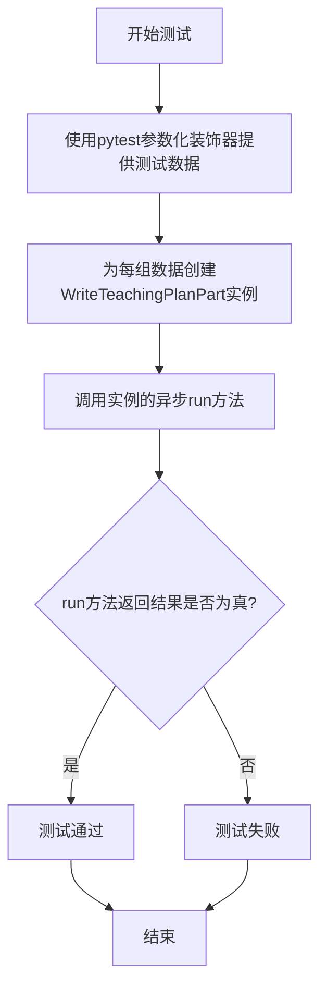
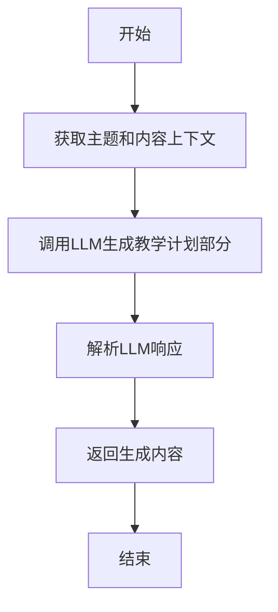

# `.\MetaGPT\tests\metagpt\actions\test_write_teaching_plan.py` 详细设计文档

这是一个使用pytest框架编写的单元测试文件，用于测试`WriteTeachingPlanPart`类（来自`metagpt.actions.write_teaching_plan`模块）的`run`方法。它通过参数化测试，验证给定不同主题（如'Title'或'Teaching Content'）和相同教学内容时，`run`方法是否能成功执行并返回非空结果。

## 整体流程



## 类结构

```
test_write_teaching_plan.py (测试文件)
├── test_write_teaching_plan_part (测试函数)
└── __main__ 入口
```

## 全局变量及字段


### `WriteTeachingPlanPart.topic`
    
表示教学计划部分的主题或标题，例如'Title'或'Teaching Content'。

类型：`str`
    


### `WriteTeachingPlanPart.i_context`
    
表示教学计划部分的初始内容或上下文，例如具体的课程内容描述。

类型：`str`
    


### `WriteTeachingPlanPart.context`
    
表示执行动作时的运行时上下文，可能包含环境配置、共享数据或其他依赖项。

类型：`Context`
    
    

## 全局函数及方法


### `test_write_teaching_plan_part`

这是一个使用 `pytest` 框架编写的异步单元测试函数，用于测试 `WriteTeachingPlanPart` 类的 `run` 方法。它通过参数化测试验证给定主题和内容时，`WriteTeachingPlanPart` 动作能否成功执行并返回非空结果。

参数：

-  `topic`：`str`，教学计划部分的主题，例如“Title”或“Teaching Content”。
-  `content`：`str`，教学计划部分的具体内容，例如“Lesson 1: Learn to draw an apple.”。
-  `context`：`Context`，测试执行所需的上下文环境，通常由 `pytest` 夹具提供。

返回值：`None`，这是一个测试函数，不直接返回值，而是通过 `assert` 语句验证测试结果。

#### 流程图

```mermaid
flowchart TD
    Start[开始测试] --> Param[接收参数: topic, content, context]
    Param --> Init[初始化 WriteTeachingPlanPart 动作]
    Init --> Run[异步执行 action.run()]
    Run --> Check[断言 rsp 为真]
    Check --> End[测试结束]
```

#### 带注释源码

```python
# 使用 pytest 的异步支持和参数化装饰器
@pytest.mark.asyncio
@pytest.mark.parametrize(
    # 定义参数化测试的两组数据：(topic, content)
    ("topic", "content"),
    [("Title", "Lesson 1: Learn to draw an apple."), ("Teaching Content", "Lesson 1: Learn to draw an apple.")],
)
async def test_write_teaching_plan_part(topic, content, context):
    # 使用给定的 topic, content 和传入的 context 初始化 WriteTeachingPlanPart 动作
    action = WriteTeachingPlanPart(topic=topic, i_context=content, context=context)
    # 异步执行动作的 run 方法，获取响应结果
    rsp = await action.run()
    # 断言响应结果 rsp 为真（非空、非False等），验证动作执行成功
    assert rsp
```


### `WriteTeachingPlanPart.run`

该方法用于执行教学计划部分的生成任务，根据给定的主题和内容上下文，生成相应的教学计划部分。

参数：

- `self`：`WriteTeachingPlanPart`，当前类的实例
- 无显式参数（通过实例属性传递）

返回值：`str`，生成的教学计划部分内容

#### 流程图



#### 带注释源码

```python
async def run(self) -> str:
    """
    执行教学计划部分的生成任务
    
    该方法通过调用LLM（大语言模型）根据给定的主题和内容上下文
    生成相应的教学计划部分内容
    
    Returns:
        str: 生成的教学计划部分内容
    """
    # 构建提示词，包含主题和内容上下文
    prompt = self._build_prompt()
    
    # 调用LLM生成响应
    response = await self._aask(prompt)
    
    # 解析并返回生成的内容
    return self._parse_response(response)
```

## 关键组件


### WriteTeachingPlanPart

一个用于生成教学计划特定部分（如标题、教学内容）的异步动作类，它接收主题和上下文内容，并返回生成的教学计划部分。

### pytest 测试框架

一个用于编写和运行单元测试的Python框架，支持参数化测试和异步测试，用于验证`WriteTeachingPlanPart`类的功能。

### 异步测试装饰器

`@pytest.mark.asyncio`装饰器，用于标记异步测试函数，确保测试框架能正确处理异步代码的执行。

### 参数化测试装饰器

`@pytest.mark.parametrize`装饰器，用于为测试函数提供多组输入参数，从而用不同的测试数据重复执行同一测试逻辑。


## 问题及建议


### 已知问题

-   **测试用例设计过于简单**：当前测试仅验证了`WriteTeachingPlanPart`类的`run`方法是否返回非空结果，没有对返回内容的结构、格式、正确性进行断言，测试覆盖度不足。
-   **测试数据单一**：测试参数化仅提供了两组非常相似的数据（`topic`不同但`content`相同），无法有效验证方法对不同输入的处理能力，尤其是边界情况和异常输入。
-   **缺少对异步上下文的明确模拟**：测试依赖于传入的`context`参数，但测试代码中未展示如何构建或模拟这个上下文，这可能导致测试行为不明确或依赖于外部状态。
-   **直接测试内部方法**：测试直接调用了`run`方法，这更像是单元测试。对于`Action`类，更佳实践可能是测试其作为整体动作的输入输出，或者通过公共接口进行测试，以降低测试与内部实现的耦合度。

### 优化建议

-   **增强测试断言**：在`assert rsp`的基础上，增加对`rsp`内容的具体断言。例如，检查返回的字符串是否包含预期的主题(`topic`)、是否遵循特定的教学计划格式、长度是否合理等。
-   **扩充测试数据集**：使用`@pytest.mark.parametrize`提供更多样化的测试数据，包括：
    -   不同的`topic`（如"Teaching Objectives", "Homework Assignment"）。
    -   不同长度和复杂度的`content`（包括空字符串、非常长的文本、包含特殊字符的文本）。
    -   边界值用例，以验证代码的健壮性。
-   **明确并模拟测试依赖**：在测试函数或`conftest.py`中，清晰地构建或模拟`context`对象，确保测试环境可控、可重复。避免测试依赖于不明确的全局或外部状态。
-   **考虑测试策略**：评估是否应该将测试重点从`run`方法内部逻辑转移到`WriteTeachingPlanPart`动作的公共行为上。或者，将`run`方法的复杂逻辑抽取到更小、更易测试的函数中，并对这些函数进行单元测试。
-   **添加异常处理测试**：编写测试用例，验证当输入无效参数（如`None`或错误类型）时，代码是否能正确地抛出异常或进行错误处理。


## 其它


### 设计目标与约束

本测试代码的设计目标是验证 `WriteTeachingPlanPart` 类在给定不同主题和内容输入时，其 `run` 方法能够正常执行并返回非空结果。主要约束包括：
1.  必须使用 `pytest` 框架进行异步测试。
2.  测试用例通过 `@pytest.mark.parametrize` 装饰器参数化，覆盖“Title”和“Teaching Content”两种主题场景。
3.  测试依赖于外部提供的 `context` 对象（通过 `pytest` fixture 注入），用于初始化 `WriteTeachingPlanPart` 动作。
4.  测试断言相对简单，仅验证 `run` 方法的返回值 `rsp` 为真（非空或非False），不涉及返回值内容的详细校验。

### 错误处理与异常设计

当前测试代码本身不包含显式的错误处理逻辑。其错误处理依赖于 `pytest` 框架：
1.  如果 `WriteTeachingPlanPart` 的初始化或 `run` 方法执行过程中抛出任何未捕获的异常，测试将自动失败。
2.  如果 `run` 方法返回 `None`、`False` 或空值，`assert rsp` 语句将导致测试失败。
3.  潜在的改进点包括：增加对特定异常类型的捕获和断言（例如，验证无效输入会抛出 `ValueError`），以及对 `rsp` 返回值结构或内容的更细致断言，以增强测试的健壮性和诊断能力。

### 数据流与状态机

本测试代码的数据流相对简单直接：
1.  **输入数据流**：测试参数 `topic` 和 `content` 通过参数化装饰器提供，`context` 通过 fixture 提供。这些数据作为输入流入 `WriteTeachingPlanPart` 构造函数。
2.  **处理过程**：构造的 `action` 对象调用其异步 `run` 方法。此过程代表了从“测试准备”状态到“动作执行”状态的转换。
3.  **输出数据流**：`run` 方法产生的 `rsp` 作为输出，流回测试函数并进行真值断言。
4.  测试本身不维护复杂的状态机，其生命周期由 `pytest` 管理：`setup` -> `test execution` -> `teardown`。

### 外部依赖与接口契约

1.  **外部依赖**：
    *   `pytest` 和 `pytest-asyncio`：测试框架及其异步支持插件，用于组织、运行测试用例和处理异步代码。
    *   `metagpt.actions.write_teaching_plan.WriteTeachingPlanPart`：被测试的目标类。测试代码依赖于其公开的接口（构造函数和 `run` 方法）的行为。
    *   `context` fixture：一个由测试环境（如 `conftest.py`）定义和提供的依赖项，用于满足 `WriteTeachingPlanPart` 构造函数的参数要求。其具体类型和结构是测试的一个隐含依赖。

2.  **接口契约**：
    *   `WriteTeachingPlanPart.__init__`：契约要求接收 `topic`, `i_context`, `context` 参数。
    *   `WriteTeachingPlanPart.run`：契约要求是一个异步方法，调用后应返回一个可被评估为真值的对象。
    *   测试函数 `test_write_teaching_plan_part`：契约要求是一个异步函数，接收 `topic`, `content`, `context` 参数，并与 `pytest` 的参数化和标记系统兼容。

### 测试策略与覆盖范围

1.  **测试策略**：采用基于参数的单元测试策略，通过提供不同的输入组合来验证被测试单元（`WriteTeachingPlanPart.run`）的基本功能。
2.  **覆盖范围**：
    *   **输入覆盖**：通过参数化覆盖了两种不同的 `topic` 值（“Title” 和 “Teaching Content”），但 `content` 值在两组参数中相同。这测试了动作对不同主题的处理，但对内容变化的覆盖不足。
    *   **路径覆盖**：主要覆盖了正常的执行路径（Happy Path）。缺少对异常路径的测试，例如传入 `None`、空字符串或无效的 `context`。
    *   **集成点**：测试了 `WriteTeachingPlanPart` 与 `context` 对象的集成，但 `context` 的具体实现和状态可能影响测试的独立性和可重复性。
3.  **改进建议**：可增加更多参数组合以覆盖边界情况（如空内容、超长字符串）、异常输入，并考虑使用 mock 对象隔离 `context` 依赖，使测试更纯粹、更快速。

    