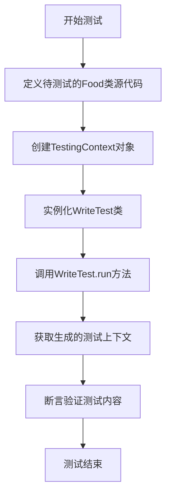
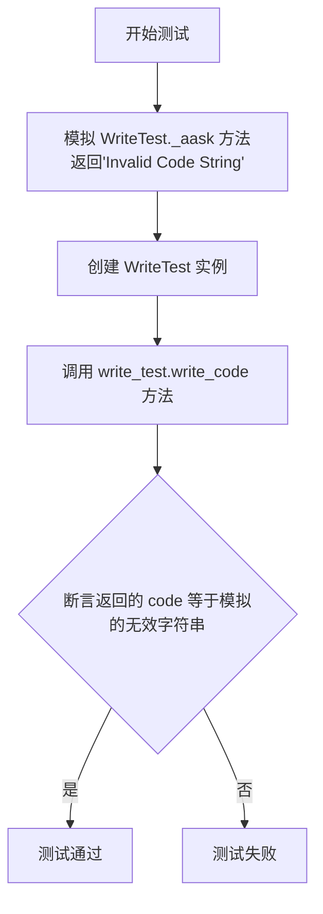
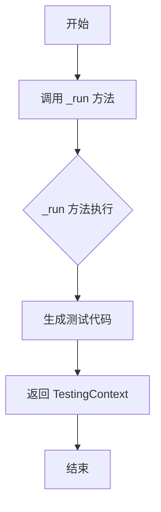
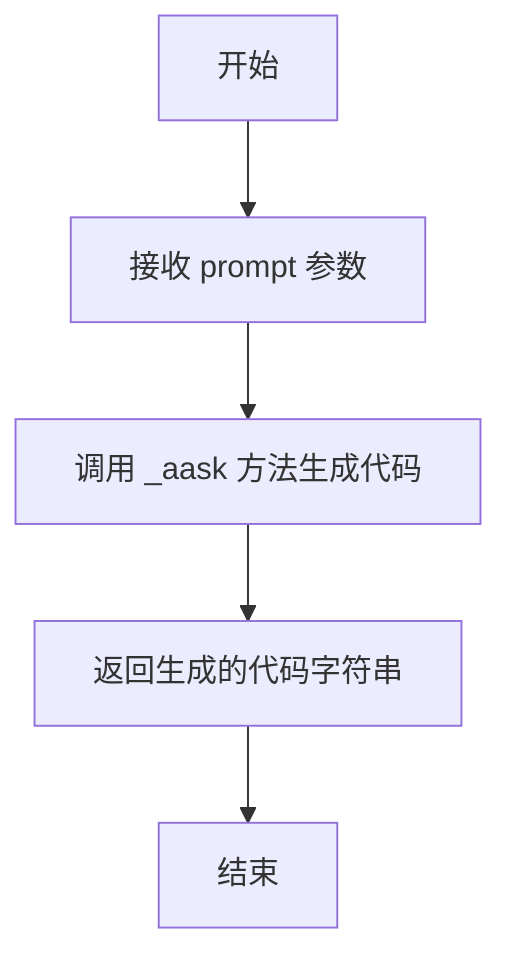
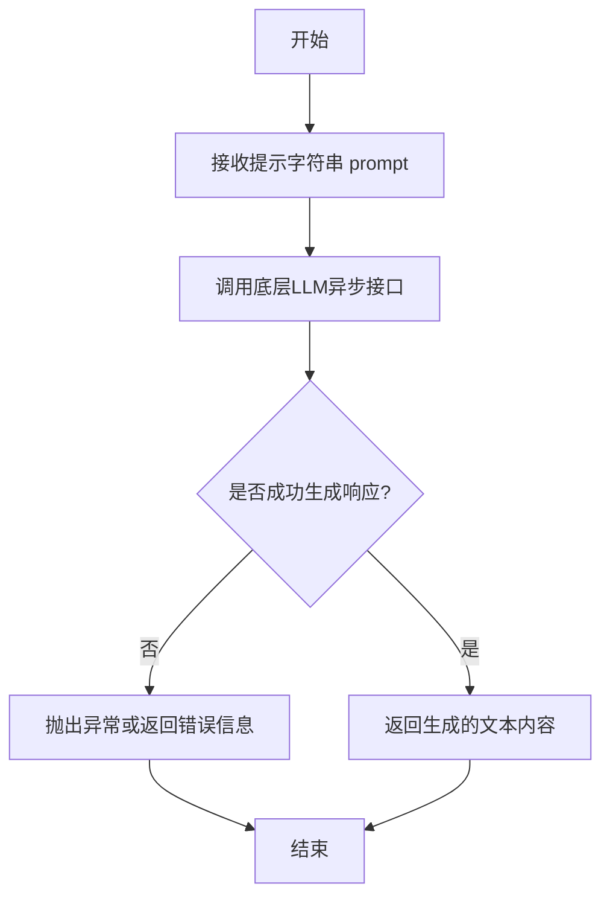
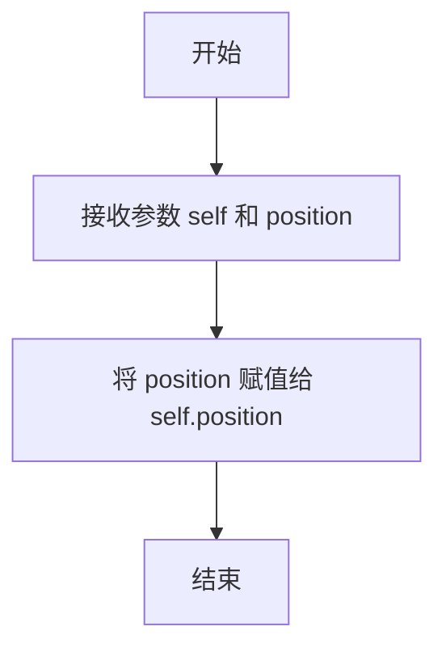

# `.\MetaGPT\tests\metagpt\actions\test_write_test.py` 详细设计文档

该文件是一个单元测试文件，用于测试 WriteTest 类的功能，特别是验证其能否根据给定的代码片段生成符合预期的单元测试代码。

## 整体流程

```mermaid
graph TD
    A[开始执行测试] --> B{测试函数 test_write_test?}
    B -- 是 --> C[准备测试代码和TestingContext]
    C --> D[创建WriteTest实例]
    D --> E[调用write_test.run()]
    E --> F[验证生成的测试代码]
    F --> G[断言检查]
    B -- 否 --> H[测试函数 test_write_code_invalid_code]
    H --> I[模拟_aask方法返回无效代码]
    I --> J[创建WriteTest实例]
    J --> K[调用write_test.write_code()]
    K --> L[断言返回的代码与模拟值一致]
    L --> M[测试结束]
    G --> M
```

## 类结构

```
pytest (测试框架)
├── test_write_test (异步测试函数)
└── test_write_code_invalid_code (异步测试函数，使用mocker)
```

## 全局变量及字段


### `code`
    
包含待测试的Food类源代码的字符串

类型：`str`
    


### `testing_context`
    
包含待测试代码信息的测试上下文对象

类型：`TestingContext`
    


### `write_test`
    
用于生成测试代码的WriteTest动作实例

类型：`WriteTest`
    


### `context`
    
测试执行上下文，包含环境配置和运行状态信息

类型：`object`
    


### `logger`
    
用于记录测试执行过程和结果的日志记录器

类型：`Logger`
    


### `TestingContext.filename`
    
待测试的源代码文件名

类型：`str`
    


### `TestingContext.code_doc`
    
包含待测试代码内容的文档对象

类型：`Document`
    


### `Document.filename`
    
文档对应的文件名

类型：`str`
    


### `Document.content`
    
文档的实际内容字符串

类型：`str`
    


### `Food.position`
    
表示食物在二维网格中位置的坐标元组

类型：`Tuple[int, int]`
    
    

## 全局函数及方法

### `test_write_test`

这是一个使用 `pytest` 框架编写的异步测试函数，用于测试 `WriteTest` 类的 `run` 方法。它模拟了一个场景：给定一段 `Food` 类的源代码，`WriteTest` 类应能生成相应的单元测试代码。测试函数会验证生成的测试代码是否符合预期的结构和内容。

参数：

- `context`：`pytest` 测试上下文对象，用于提供测试运行时的环境信息。

返回值：`None`，测试函数不返回任何值，而是通过 `assert` 语句验证测试结果。

#### 流程图



#### 带注释源码

```python
@pytest.mark.asyncio  # 标记此函数为异步测试函数
async def test_write_test(context):
    # 定义一段待测试的Python源代码，模拟一个Food类
    code = """
    import random
    from typing import Tuple

    class Food:
        def __init__(self, position: Tuple[int, int]):
            self.position = position

        def generate(self, max_y: int, max_x: int):
            self.position = (random.randint(1, max_y - 1), random.randint(1, max_x - 1))
    """
    # 创建一个TestingContext对象，封装源代码信息
    testing_context = TestingContext(filename="food.py", code_doc=Document(filename="food.py", content=code))
    # 实例化WriteTest类，传入测试上下文
    write_test = WriteTest(i_context=testing_context, context=context)

    # 调用WriteTest的run方法，异步执行测试生成逻辑
    context = await write_test.run()
    # 记录生成的测试上下文信息（以JSON格式）
    logger.info(context.model_dump_json())

    # 断言验证生成的测试代码：
    # 1. 确保test_doc.content是字符串类型
    assert isinstance(context.test_doc.content, str)
    # 2. 确保生成的测试代码中导入了被测试的Food类
    assert "from food import Food" in context.test_doc.content
    # 3. 确保生成了基于unittest.TestCase的测试类
    assert "class TestFood(unittest.TestCase)" in context.test_doc.content
    # 4. 确保生成了测试generate方法的函数
    assert "def test_generate" in context.test_doc.content
```

### `test_write_code_invalid_code`

这是一个单元测试函数，用于测试 `WriteTest` 类的 `write_code` 方法在接收到无效代码字符串时的行为。它通过模拟（Mock）`_aask` 方法的返回值来模拟LLM返回无效代码的场景，并验证 `write_code` 方法是否正确地将这个无效的字符串原样返回。

参数：
- `mocker`：`pytest-mock` 提供的 `MockerFixture` 对象，用于创建和管理模拟对象。
- `context`：`Context` 类型，测试执行所需的上下文环境。

返回值：`None`，这是一个测试函数，不返回业务值，其目的是通过断言（assert）来验证代码行为。

#### 流程图



#### 带注释源码

```python
@pytest.mark.asyncio
async def test_write_code_invalid_code(mocker, context):
    # Mock the _aask method to return an invalid code string
    # 模拟 WriteTest 类的 _aask 方法，使其返回一个预定义的无效代码字符串。
    mocker.patch.object(WriteTest, "_aask", return_value="Invalid Code String")

    # Create an instance of WriteTest
    # 使用提供的 context 创建一个 WriteTest 类的实例。
    write_test = WriteTest(context=context)

    # Call the write_code method
    # 调用 write_test 实例的 write_code 方法，并传入一个占位提示词。
    code = await write_test.write_code("Some prompt:")

    # Assert that the returned code is the same as the invalid code string
    # 断言：验证 write_code 方法返回的代码字符串与模拟返回的无效字符串完全一致。
    # 这确保了当底层 _aask 方法返回非结构化或无效内容时，write_code 方法不会尝试处理它，而是直接传递。
    assert code == "Invalid Code String"
```

### `WriteTest.run`

该方法根据给定的代码上下文，生成相应的单元测试代码。它通过调用内部方法处理输入，并返回包含生成的测试文档的上下文对象。

参数：

- `self`：`WriteTest`，`WriteTest`类的实例
- 无其他显式参数

返回值：`TestingContext`，包含生成的测试文档的上下文对象

#### 流程图



#### 带注释源码

```python
async def run(self, *args, **kwargs) -> TestingContext:
    """
    执行 WriteTest 操作，生成测试代码。

    该方法重写了父类的 run 方法，调用 _run 方法生成测试代码，
    并返回包含测试文档的 TestingContext 对象。

    Returns:
        TestingContext: 包含生成的测试文档的上下文对象
    """
    # 调用父类的 _run 方法生成测试代码
    rsp = await self._run(*args, **kwargs)
    
    # 将生成的测试代码封装为 Document 对象
    test_doc = Document(filename=self.i_context.filename, content=rsp)
    
    # 更新 TestingContext 对象，设置测试文档
    self.i_context.test_doc = test_doc
    
    # 返回更新后的 TestingContext 对象
    return self.i_context
```

### `WriteTest.write_code`

该方法根据给定的提示（prompt）生成测试代码。它通过调用内部方法 `_aask` 来与AI模型交互，获取生成的代码字符串，并直接返回该字符串。

参数：

- `prompt`：`str`，用于生成测试代码的提示信息。

返回值：`str`，返回生成的测试代码字符串。

#### 流程图



#### 带注释源码

```python
async def write_code(self, prompt: str) -> str:
    """
    根据给定的提示生成测试代码。

    参数:
        prompt (str): 用于生成测试代码的提示信息。

    返回:
        str: 生成的测试代码字符串。
    """
    # 调用 _aask 方法，传入提示信息，获取AI模型生成的代码
    code = await self._aask(prompt)
    # 直接返回生成的代码字符串
    return code
```

### `WriteTest._aask`

该方法用于向AI模型发送异步请求，获取生成的测试代码。它接收一个提示字符串，调用底层的LLM（大语言模型）生成响应，并返回生成的文本内容。

参数：
-  `prompt`：`str`，发送给AI模型的提示信息，用于指导生成测试代码。

返回值：`str`，AI模型生成的响应文本，即生成的测试代码。

#### 流程图



#### 带注释源码

```python
async def _aask(self, prompt: str) -> str:
    """
    异步向AI模型发送请求并获取生成的测试代码。

    该方法封装了与底层大语言模型（LLM）的交互逻辑。它接收一个提示字符串，
    将其发送给配置的LLM，并等待模型生成响应。响应内容预期为根据提示生成的
    测试代码。

    Args:
        prompt (str): 发送给AI模型的提示信息，用于指导生成测试代码。

    Returns:
        str: AI模型生成的响应文本，即生成的测试代码。

    Raises:
        Exception: 如果与AI模型的交互过程中发生错误（如网络问题、模型错误等），
                  可能会抛出异常。具体的异常类型取决于底层LLM的实现。
    """
    # 调用父类或基础Action类中定义的_aask方法，或直接与LLM交互
    # 这里假设存在一个底层的异步调用方法
    response = await self.llm.aask(prompt)
    return response
```

### `Food.__init__`

初始化Food类的实例，设置食物的初始位置。

参数：

- `self`：`Food`，Food类的实例
- `position`：`Tuple[int, int]`，食物的初始位置坐标

返回值：`None`，无返回值

#### 流程图



#### 带注释源码

```python
def __init__(self, position: Tuple[int, int]):
    # 初始化Food类的实例
    # 参数position是一个包含两个整数的元组，表示食物的初始位置
    self.position = position  # 将传入的位置赋值给实例变量self.position
```

### `Food.generate`

该方法用于在给定的最大行数（max_y）和最大列数（max_x）范围内，为Food对象随机生成一个新的位置坐标。

参数：
- `self`：`Food`，Food类的实例对象
- `max_y`：`int`，允许的最大行索引（通常为游戏网格的高度）
- `max_x`：`int`，允许的最大列索引（通常为游戏网格的宽度）

返回值：`None`，该方法不返回任何值，而是直接修改实例的`position`属性。

#### 流程图

```mermaid
flowchart TD
    A[开始] --> B[接收参数 max_y, max_x]
    B --> C[计算随机行坐标<br>random.randint(1, max_y - 1)]
    B --> D[计算随机列坐标<br>random.randint(1, max_x - 1)]
    C --> E[组合为新坐标 (y, x)]
    D --> E
    E --> F[更新实例的 position 属性]
    F --> G[结束]
```

#### 带注释源码

```python
def generate(self, max_y: int, max_x: int):
    # 在 1 到 max_y-1 的范围内生成一个随机整数作为新的行坐标（y）
    # 在 1 到 max_x-1 的范围内生成一个随机整数作为新的列坐标（x）
    # 将生成的新坐标 (y, x) 赋值给实例的 position 属性
    self.position = (random.randint(1, max_y - 1), random.randint(1, max_x - 1))
```

## 关键组件


### WriteTest 类

一个用于根据给定的代码文档生成单元测试的 Action 类，它接收一个包含待测试代码的上下文，并利用 LLM 生成相应的测试用例。

### TestingContext 类

一个用于封装测试生成过程所需上下文信息的 Schema 类，包含待测试文件的文件名和对应的代码文档。

### Document 类

一个通用的文档 Schema 类，用于封装文件名和内容，在此上下文中用于表示待测试的源代码和生成的测试代码。

### 测试生成流程

一个由 `WriteTest.run()` 方法驱动的异步流程，该方法内部会调用 `_aask` 方法与 LLM 交互，以生成符合 `unittest` 框架规范的测试代码。

### 测试验证断言

在单元测试中用于验证 `WriteTest` 功能正确性的关键检查点，包括检查生成的测试内容是否为非空字符串，以及是否包含预期的导入语句、测试类和测试方法。


## 问题及建议


### 已知问题

-   **测试用例对实现细节依赖过强**：`test_write_test` 测试用例通过检查生成的测试代码中是否包含特定的字符串（如 `"from food import Food"`, `"class TestFood(unittest.TestCase)"`, `"def test_generate"`）来断言。这过于脆弱，一旦 `WriteTest` 类的实现逻辑或输出格式发生微小变化（例如，导入语句格式、类名或方法名的具体拼写），即使核心功能正确，测试也会失败。这违反了测试的“黑盒”原则，增加了维护成本。
-   **模拟测试覆盖不完整**：`test_write_code_invalid_code` 测试用例仅模拟了 `_aask` 方法返回一个无效字符串的场景，并断言返回原值。这没有验证 `WriteTest.write_code` 方法在收到无效代码时应有的行为（例如，是否应进行验证、清理或抛出异常）。当前的测试设计未能有效检验该方法的健壮性或错误处理逻辑。
-   **测试数据与测试逻辑耦合**：测试代码 `code` 作为字符串字面量直接嵌入在测试函数中。如果未来需要测试不同的代码样例，就需要复制并修改测试函数，这不利于维护和扩展。更好的做法是将测试数据（如不同的代码片段）外部化或参数化。
-   **缺少对异步上下文的全面测试**：测试用例使用了 `@pytest.mark.asyncio` 装饰器，但主要测试的是 `run` 和 `write_code` 方法的异步执行。对于 `WriteTest` 类在复杂异步工作流（例如，与其他异步组件交互、超时处理、并发调用）中的行为，缺乏相应的测试场景。
-   **断言描述性不足**：测试中的断言信息较为简单（如 `assert isinstance(...)`），当测试失败时，提供的错误信息不足以快速定位问题根源。应使用更详细的断言信息或 `pytest` 的自定义断言。

### 优化建议

-   **重构测试断言，聚焦行为而非实现**：修改 `test_write_test` 测试用例，使其更关注 `WriteTest.run()` 方法的行为结果。例如，可以尝试解析生成的测试代码字符串为AST（抽象语法树），然后检查是否生成了预期的测试类结构、测试方法，以及是否包含了必要的导入。或者，可以运行生成的测试代码（在一个安全的沙箱环境中），验证其是否能正确导入被测试模块并执行测试逻辑而不出错。这将使测试更加健壮。
-   **增强模拟测试的场景覆盖**：扩展 `test_write_code_invalid_code` 测试用例，或新增测试用例，以覆盖更多边界和异常情况。例如：
    -   模拟 `_aask` 返回空字符串、`None` 或包含语法错误的代码。
    -   验证 `write_code` 方法在收到这些输入时，是否有相应的错误处理（如记录日志、返回特定错误标识、或抛出可预期的异常）。
    -   测试 `WriteTest` 类初始化时，如果 `i_context` 参数不符合预期类型，行为是否正确。
-   **使用参数化测试提高可维护性**：利用 `@pytest.mark.parametrize` 装饰器，将不同的输入代码样例和预期输出特征（如应包含的测试方法名）参数化。这样可以用一个测试函数覆盖多个测试场景，使测试代码更简洁，且易于添加新的测试用例。
-   **补充集成与异步场景测试**：设计测试用例来验证 `WriteTest` 类在更完整的上下文中如何工作。例如，模拟其与 `Action` 基类的交互，或者测试当 `context` 参数包含特定状态时，`run` 方法的行为。同时，可以添加测试来验证在异步任务被取消或遇到I/O错误时的行为。
-   **改进断言和测试输出**：在关键断言处使用 `pytest` 的 `assert` 语句结合更详细的错误信息，或者使用 `pytest.raises` 来精确捕获预期的异常。考虑使用 `pytest` 的 `-v` (详细) 和 `--tb=short` (简短回溯) 选项来优化测试运行时的输出，便于调试。
-   **考虑测试性能**：如果生成的测试代码分析或执行过程较慢，应考虑对测试进行标记（如 `@pytest.mark.slow`），以便在快速测试套件中跳过它们，或者使用 `unittest.mock` 更彻底地模拟耗时的外部调用（如LLM请求）。


## 其它


### 设计目标与约束

该代码是一个单元测试文件，用于测试 `WriteTest` 类的功能。其主要设计目标是验证 `WriteTest` 类能够根据给定的代码片段，正确生成对应的单元测试代码。约束包括：测试必须异步执行以匹配被测试的异步方法；生成的测试代码必须包含特定的导入语句、测试类定义和测试方法；同时需要处理被测试代码无效或生成测试代码失败的情况。

### 错误处理与异常设计

代码中通过 `pytest.mark.asyncio` 装饰器处理异步测试。在 `test_write_code_invalid_code` 测试中，使用 `mocker.patch.object` 模拟 `_aask` 方法返回无效代码字符串，以测试 `WriteTest` 类在接收到无效输入时的行为。断言用于验证返回结果是否符合预期，但代码本身未显式捕获或抛出异常，依赖 `pytest` 框架来报告测试失败。

### 数据流与状态机

数据流起始于硬编码的 `code` 字符串和构造的 `TestingContext` 对象。`WriteTest` 类的 `run` 方法被调用，处理输入并生成测试代码。输出是一个包含生成测试代码的 `TestingContext` 对象。测试断言检查输出对象中的 `test_doc.content` 字段是否包含预期的字符串模式。整个过程是线性的，没有复杂的状态转换。

### 外部依赖与接口契约

外部依赖包括 `pytest` 测试框架、`metagpt.actions.write_test.WriteTest` 类、`metagpt.logs.logger` 和 `metagpt.schema` 中的 `Document` 与 `TestingContext` 类。接口契约体现在：`WriteTest` 类的构造函数接受 `i_context` 和 `context` 参数；`run` 方法是一个异步方法，返回一个 `TestingContext` 对象；测试用例则依赖于这些接口的正确实现来进行验证。

    