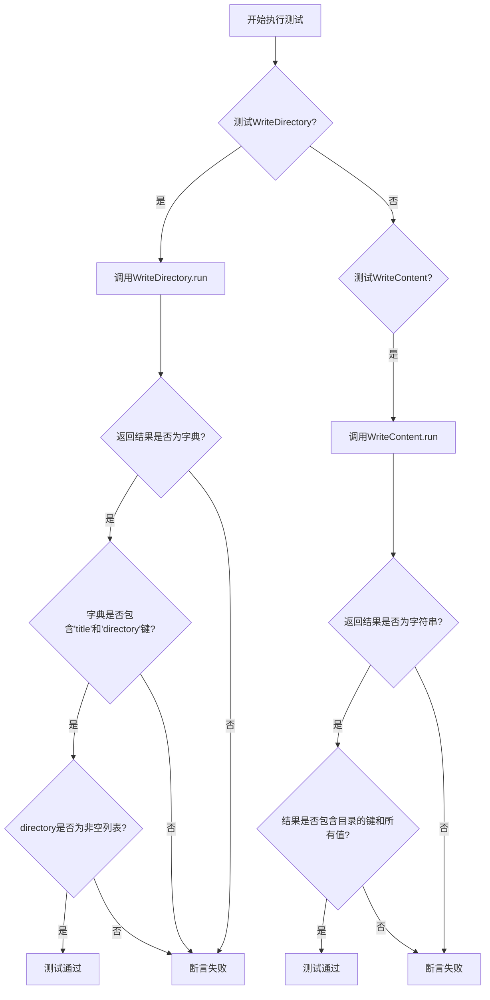
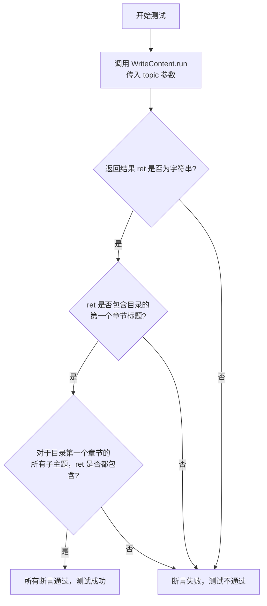
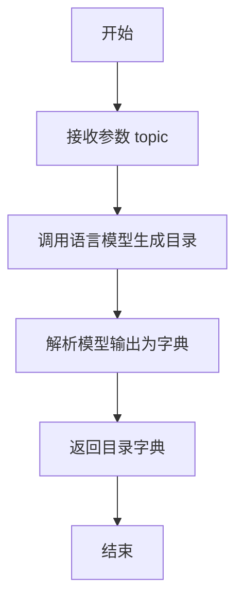
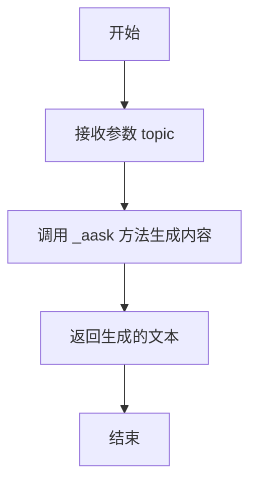

# `.\MetaGPT\tests\metagpt\actions\test_write_tutorial.py` 详细设计文档

该文件是一个使用 pytest 框架编写的异步单元测试文件，用于测试 MetaGPT 项目中 `WriteDirectory` 和 `WriteContent` 这两个动作（Action）的功能。`WriteDirectory` 负责根据主题生成教程的目录结构，`WriteContent` 则根据给定的目录结构生成具体的教程内容。测试验证了这两个动作的输入输出是否符合预期。

## 整体流程



## 类结构

```
pytest 测试文件
├── test_write_directory (异步测试函数)
└── test_write_content (异步测试函数)
```

## 全局变量及字段


### `WriteDirectory.language`
    
指定教程内容的语言，例如 'English' 或 '中文'。

类型：`str`
    


### `WriteDirectory.context`
    
提供执行任务所需的上下文信息，可能包含环境配置、用户偏好或历史数据等。

类型：`Context`
    


### `WriteContent.language`
    
指定教程内容的语言，例如 'English' 或 '中文'。

类型：`str`
    


### `WriteContent.directory`
    
教程的目录结构，通常是一个字典，键为章节标题，值为该章节下的子主题列表。

类型：`Dict`
    


### `WriteContent.context`
    
提供执行任务所需的上下文信息，可能包含环境配置、用户偏好或历史数据等。

类型：`Context`
    
    

## 全局函数及方法

### `test_write_directory`

这是一个使用 pytest 框架编写的异步单元测试函数，用于测试 `WriteDirectory` 类的 `run` 方法。该测试验证了在给定语言和主题的情况下，`WriteDirectory` 能否正确生成一个包含标题和目录结构的字典。

参数：

- `language`：`str`，指定生成教程内容的语言，例如 "English"。
- `topic`：`str`，指定教程的主题，例如 "Write a tutorial about Python"。
- `context`：`Context`，测试执行上下文，通常由 pytest 的 fixture 提供，用于管理测试环境。

返回值：`None`，这是一个测试函数，不返回业务值，而是通过断言（assert）来验证测试结果。

#### 流程图

```mermaid
flowchart TD
    A[开始测试] --> B[创建 WriteDirectory 实例]
    B --> C[调用 run 方法]
    C --> D{返回结果 ret}
    D --> E[断言 ret 是 dict]
    E --> F[断言 ret 包含 'title' 键]
    F --> G[断言 ret 包含 'directory' 键]
    G --> H[断言 ret['directory'] 是 list]
    H --> I[断言 ret['directory'] 非空]
    I --> J[断言 ret['directory'][0] 是 dict]
    J --> K[测试通过]
```

#### 带注释源码

```python
# 使用 pytest 的异步和参数化装饰器
@pytest.mark.asyncio
@pytest.mark.parametrize(("language", "topic"), [("English", "Write a tutorial about Python")])
async def test_write_directory(language: str, topic: str, context):
    # 1. 创建 WriteDirectory 动作实例，并传入语言和上下文
    # 2. 异步执行其 run 方法，传入主题，获取返回结果 ret
    ret = await WriteDirectory(language=language, context=context).run(topic=topic)
    
    # 3. 断言返回结果 ret 是一个字典
    assert isinstance(ret, dict)
    # 4. 断言字典中包含 'title' 键
    assert "title" in ret
    # 5. 断言字典中包含 'directory' 键
    assert "directory" in ret
    # 6. 断言 'directory' 对应的值是一个列表
    assert isinstance(ret["directory"], list)
    # 7. 断言 'directory' 列表不为空
    assert len(ret["directory"])
    # 8. 断言 'directory' 列表的第一个元素是一个字典
    assert isinstance(ret["directory"][0], dict)
```

### `test_write_content`

这是一个使用 `pytest` 框架编写的异步测试函数，用于测试 `WriteContent` 类的 `run` 方法。该测试验证了给定一个主题、语言和目录结构时，`WriteContent` 能否生成包含预期章节标题和内容的教程文本。

参数：

- `language`：`str`，指定生成教程所使用的语言，例如 "English"。
- `topic`：`str`，指定教程的主题，例如 "Write a tutorial about Python"。
- `directory`：`Dict`，一个字典，表示教程的目录结构，其键为章节标题，值为该章节下的子主题列表。
- `context`：`pytest` 的 `context` fixture，提供测试运行时的上下文信息。

返回值：`None`，这是一个测试函数，不返回任何值，其目的是通过断言（`assert`）来验证代码行为。

#### 流程图



#### 带注释源码

```python
# 使用 pytest 的异步和参数化装饰器
@pytest.mark.asyncio
@pytest.mark.parametrize(
    # 定义测试参数组：语言、主题、目录
    ("language", "topic", "directory"),
    [("English", "Write a tutorial about Python", {"Introduction": ["What is Python?", "Why learn Python?"]})],
)
# 定义异步测试函数，接收参数化注入的参数
async def test_write_content(language: str, topic: str, directory: Dict, context):
    # 1. 执行被测试的操作：创建 WriteContent 实例并调用其 run 方法
    #    - 传入 language, directory, context 初始化实例
    #    - 调用 run 方法，传入 topic 参数
    ret = await WriteContent(language=language, directory=directory, context=context).run(topic=topic)

    # 2. 验证返回结果 ret 的类型是否为字符串（即生成的教程内容）
    assert isinstance(ret, str)

    # 3. 验证生成的教程内容 ret 中是否包含了目录的第一个章节标题
    #    - list(directory.keys())[0] 获取目录的第一个键（章节标题）
    assert list(directory.keys())[0] in ret

    # 4. 验证生成的教程内容 ret 中是否包含了第一个章节下的所有子主题
    #    - list(directory.values())[0] 获取第一个键对应的值（子主题列表）
    for value in list(directory.values())[0]:
        # 遍历子主题列表，检查每个子主题字符串是否都出现在 ret 中
        assert value in ret
```

### `WriteDirectory.run`

该方法根据给定的主题和语言，生成一个教程的目录结构。它通过调用语言模型来生成一个包含标题和章节列表的目录。

参数：

- `topic`：`str`，教程的主题，例如“Write a tutorial about Python”

返回值：`Dict`，返回一个字典，包含生成的教程标题和目录结构，格式为`{"title": str, "directory": List[Dict]}`

#### 流程图



#### 带注释源码

```python
async def run(self, topic: str) -> Dict:
    """
    根据给定的主题生成教程目录。

    Args:
        topic (str): 教程的主题。

    Returns:
        Dict: 包含标题和目录的字典。
    """
    # 调用语言模型生成目录内容
    prompt = self._build_prompt(topic)
    response = await self._llm.aask(prompt)
    
    # 解析模型输出为字典格式
    directory = self._parse_response(response)
    
    return directory
```

### `WriteContent.run`

该方法用于根据给定的主题和目录结构，生成教程的详细内容。它通过调用语言模型，将主题和目录转换为具体的教程内容，并返回生成的文本。

参数：

- `topic`：`str`，教程的主题，例如 "Write a tutorial about Python"。

返回值：`str`，生成的教程内容文本。

#### 流程图



#### 带注释源码

```python
async def run(self, topic: str) -> str:
    """
    根据给定的主题和目录结构，生成教程的详细内容。

    Args:
        topic (str): 教程的主题，例如 "Write a tutorial about Python"。

    Returns:
        str: 生成的教程内容文本。
    """
    # 调用 _aask 方法，将主题和目录结构作为提示，生成教程内容
    return await self._aask(prompt=f"根据主题 '{topic}' 和目录结构 {self.directory}，生成详细的教程内容。")
```

## 关键组件


### WriteDirectory

一个用于生成教程目录结构的组件，它接收语言和主题作为输入，并输出一个包含标题和章节列表的字典。

### WriteContent

一个用于根据给定的目录结构生成具体教程内容的组件，它接收语言、主题和目录字典作为输入，并输出对应章节的详细文本内容。

### 测试框架 (pytest)

用于验证 `WriteDirectory` 和 `WriteContent` 组件功能的测试套件，包含异步测试用例和参数化测试数据。


## 问题及建议


### 已知问题

-   **测试数据耦合度高**：测试用例 `test_write_content` 的参数化数据 `directory` 是一个硬编码的字典。这导致测试用例与特定的目录结构紧密耦合。如果 `WriteContent` 类的实现逻辑发生变化，或者需要测试不同的目录结构，必须修改测试代码本身，降低了测试的灵活性和可维护性。
-   **测试覆盖不全面**：当前的测试用例仅验证了 `WriteDirectory` 和 `WriteContent` 类在特定输入下的基本行为（如返回类型、结构）。没有测试边界条件（如空主题、空目录）、异常情况（如无效语言参数）或更复杂的目录嵌套结构，测试覆盖率有限。
-   **缺少对异步上下文的明确模拟**：测试函数接收一个 `context` 参数，但测试用例中并未展示如何设置或模拟这个上下文。如果 `context` 对 `WriteDirectory` 和 `WriteContent` 的行为有重要影响（例如，提供LLM连接或配置），那么当前测试可能没有在真实或可控的环境下运行，测试结果可能不可靠。
-   **断言过于宽松**：`test_write_directory` 中对 `ret["directory"]` 内容的断言 (`assert isinstance(ret["directory"][0], dict)`) 没有检查字典内部的具体结构或必需字段，无法保证返回的目录项格式符合预期。

### 优化建议

-   **解耦测试数据**：将测试数据（尤其是 `directory`）提取到外部的测试数据文件（如JSON、YAML）或独立的测试数据生成函数中。这样可以在不修改测试逻辑的情况下，轻松添加新的测试场景和数据结构。
-   **增加测试场景和断言**：
    -   为 `WriteDirectory` 添加测试用例，涵盖空字符串主题、超长主题等边界情况。
    -   为 `WriteContent` 添加测试用例，测试空目录 `{}`、多级嵌套目录等复杂结构。
    -   在 `test_write_directory` 中，增加对 `ret["directory"][0]` 字典内部键（如 `"title"`, `"content"` 等，取决于实际契约）的断言，以验证数据结构的完整性。
-   **明确和模拟上下文**：在测试文件或 `conftest.py` 中，为 `context` 参数定义一个清晰的pytest fixture。这个fixture应该模拟或提供 `WriteDirectory` 和 `WriteContent` 动作运行时所需的完整上下文环境，确保测试的独立性和可重复性。
-   **考虑使用属性测试**：对于 `WriteDirectory` 和 `WriteContent` 这类可能接受多种输入并生成复杂输出的组件，可以考虑使用属性测试库（如 `hypothesis`）。通过定义输入数据的规则，自动生成大量测试用例，验证输出是否始终满足某些不变性质（例如，返回的目录列表不为负、内容字符串包含主题关键词等），从而更全面地发现边缘情况下的错误。
-   **添加集成测试标记**：如果 `WriteDirectory` 和 `WriteContent` 严重依赖外部服务（如大语言模型API），当前的测试更像是集成测试。建议使用 `@pytest.mark.integration` 等自定义标记将其与单元测试区分开，并确保CI/CD管道可以灵活地控制是否运行这些耗时或有外部依赖的测试。


## 其它


### 设计目标与约束

本代码是一个针对 `metagpt.actions.write_tutorial` 模块中 `WriteDirectory` 和 `WriteContent` 两个类的单元测试。其设计目标是验证这两个异步操作类在给定语言、主题和上下文等输入参数时，能够正确生成符合预期的输出结构（字典或字符串），并确保输出内容与输入参数存在逻辑关联。主要约束包括：必须使用 `pytest` 测试框架，支持异步测试（`pytest.mark.asyncio`），并能够通过参数化测试（`pytest.mark.parametrize`）覆盖不同的输入场景。

### 错误处理与异常设计

测试代码本身不包含业务逻辑的错误处理，其核心是断言（`assert`）被测试对象的行为。如果 `WriteDirectory.run` 或 `WriteContent.run` 方法在测试过程中抛出任何未预期的异常（例如网络错误、数据格式错误、异步超时等），测试将失败，这有助于暴露被测试代码中的缺陷。测试通过检查返回值的类型、关键字段的存在性、列表长度以及字符串包含关系来验证功能的正确性，这些断言本身构成了对正常流程和部分边界条件的验证。

### 数据流与状态机

测试的数据流是线性的：
1.  **输入**：测试参数（`language`, `topic`, `directory`）和通过 `pytest` fixture 注入的 `context` 对象作为初始输入。
2.  **处理**：调用 `WriteDirectory().run(topic)` 或 `WriteContent().run(topic)` 方法。测试代码不关心其内部复杂过程（可能涉及LLM调用、数据处理等），只关注其输入输出契约。
3.  **验证**：对方法的返回结果进行一系列断言检查，验证其类型、结构完整性以及内容相关性。
4.  **输出**：测试结果（成功或失败）。测试本身没有持久化状态，每次执行都是独立的。

本测试不涉及复杂的状态机，它验证的是单个动作（Action）的原子性执行。

### 外部依赖与接口契约

1.  **外部依赖**：
    *   **被测试模块**：`metagpt.actions.write_tutorial.WriteDirectory` 和 `metagpt.actions.write_tutorial.WriteContent`。测试的成功执行完全依赖于这两个类的可用性和行为稳定性。
    *   **测试框架**：`pytest` 及其插件 `pytest-asyncio`（用于支持异步测试）。
    *   **Fixture `context`**：代码中使用了未定义的 `context` 参数，这依赖于一个同名的 `pytest fixture` 来提供运行时上下文（可能包含配置、会话信息等）。这是测试环境的关键依赖。

2.  **接口契约（测试用例层面）**：
    *   `test_write_directory` 契约：给定 `language`, `topic`, `context`，`WriteDirectory.run` 应返回一个字典，且该字典必须包含字符串类型的 `title` 键和列表类型的 `directory` 键，`directory` 列表非空且其元素为字典。
    *   `test_write_content` 契约：给定 `language`, `topic`, `directory`, `context`，`WriteContent.run` 应返回一个字符串，且该字符串必须包含 `directory` 字典的第一个键名以及该键对应的所有值。

### 测试策略与覆盖范围

1.  **测试策略**：采用基于接口的单元测试策略，聚焦于验证类方法的输入输出行为，而非其内部实现细节。使用了参数化测试来用一组典型数据驱动测试执行。
2.  **覆盖范围**：
    *   **正向路径测试**：验证在正常输入下，功能能否产生正确格式的输出。
    *   **数据结构验证**：对返回值的类型、关键字段进行严格检查。
    *   **内容关联性验证**：确保输出内容（教程目录的标题、教程内容文本）与输入主题（`topic`）和提纲（`directory`）存在逻辑上的包含关系。
    *   **当前未覆盖**：异常输入测试（如空主题、无效语言）、边界条件测试（如超长主题）、`context` fixture 不同状态下的行为、以及 `WriteDirectory` 生成的 `directory` 结构与 `WriteContent` 输入所需的 `directory` 结构之间的一致性。

    